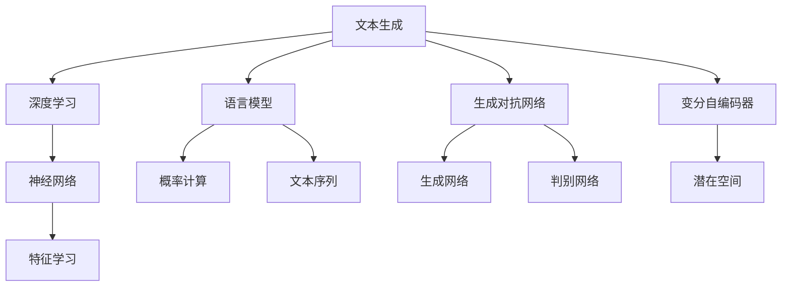
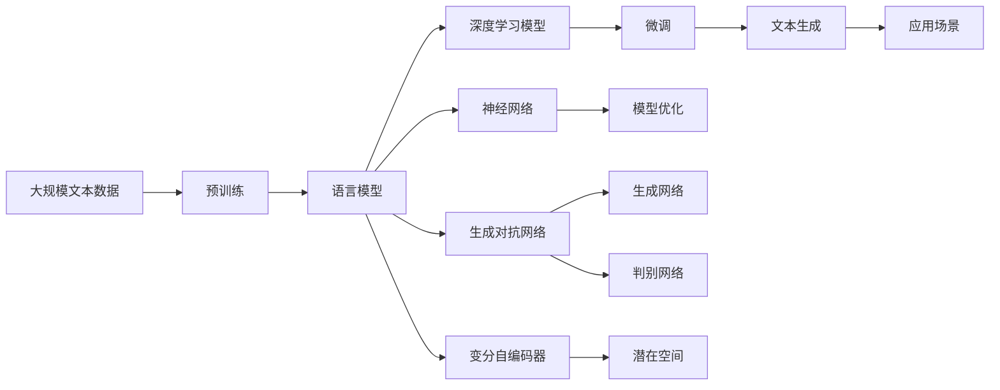

                 

# Text Generation原理与代码实例讲解

> 关键词：文本生成, 自然语言处理(NLP), 语言模型, 神经网络, 深度学习, 生成对抗网络(GAN), 语言模型与深度学习结合

## 1. 背景介绍

### 1.1 问题由来
文本生成（Text Generation）是大数据、深度学习和人工智能领域中的一个热门研究方向。文本生成是指利用计算机算法和模型，自动地生成自然语言文本的过程。其应用广泛，包括但不限于机器翻译、文本摘要、自动写作、聊天机器人、创意写作等。随着深度学习的发展，文本生成技术逐步从基于规则的方法演变为基于深度学习的生成模型。

### 1.2 问题核心关键点
文本生成的核心问题是如何在给定上下文信息的情况下，生成出自然流畅、符合语法和语义规则的文本。主要的技术方法包括基于语言模型的生成、基于生成对抗网络（GAN）的生成、基于变分自编码器（VAE）的生成等。本文将重点介绍基于语言模型的文本生成，并通过一个具体的案例，展示如何使用深度学习技术实现文本生成。

### 1.3 问题研究意义
文本生成技术在自动写作、机器翻译、智能客服、自动摘要、游戏对话系统等领域有着广泛的应用前景。它不仅可以极大地提高人类生产力和创造力，还能在解决许多现实问题时发挥重要作用。例如，在教育、法律、医疗等领域，自动生成的文本可以辅助人类进行决策，减少重复性工作，提高效率。

## 2. 核心概念与联系

### 2.1 核心概念概述

- 文本生成（Text Generation）：使用计算机算法和模型，自动生成自然语言文本的过程。文本生成的目标是通过算法学习自然语言的内在规律，生成符合语法、语义、语境的文本。

- 语言模型（Language Model）：用于计算给定文本序列概率的模型，是文本生成的基础。语言模型通过统计分析大量文本数据，学习文本序列的分布规律，从而能够预测下一个词或一段文本的概率。

- 神经网络（Neural Network）：文本生成中广泛使用的一种计算模型，由大量的神经元组成，能够自动学习输入数据的内在规律。

- 深度学习（Deep Learning）：基于神经网络的机器学习方法，通过多层的非线性变换，实现复杂的特征提取和模式识别。深度学习在文本生成中主要用于语言模型和生成模型的训练。

- 生成对抗网络（GAN）：一种生成模型，通过对抗学习的方式，学习生成高质量、逼真的文本样本。

- 变分自编码器（VAE）：一种生成模型，通过生成变分分布，学习文本数据的全局特征，生成文本序列。

这些概念相互联系，共同构成了文本生成技术的理论基础和实际应用框架。通过理解这些核心概念，我们可以更好地把握文本生成的原理和实现方法。

### 2.2 概念间的关系

这些核心概念之间的逻辑关系可以通过以下Mermaid流程图来展示：



这个流程图展示了一些核心概念之间的逻辑关系：

1. 文本生成可以基于语言模型、神经网络、深度学习、生成对抗网络、变分自编码器等多种方法实现。
2. 语言模型和神经网络是文本生成中的基础，能够计算文本序列的概率，学习文本序列的特征。
3. 深度学习通过多层非线性变换，进一步提高文本生成的效果。
4. 生成对抗网络通过对抗学习的方式，生成高质量的文本样本。
5. 变分自编码器通过生成变分分布，学习文本序列的全局特征。

这些概念相互交织，共同构成文本生成技术的核心。理解这些概念之间的关系，有助于深入理解文本生成技术的原理和实现方法。

### 2.3 核心概念的整体架构

最后，我们用一个综合的流程图来展示这些核心概念在大规模文本生成中的应用：



这个综合流程图展示了从大规模文本数据的预训练到最终文本生成的完整过程。大规模文本数据的预训练可以学习到文本序列的全局特征，并通过语言模型、深度学习模型、神经网络、生成对抗网络、变分自编码器等多种方法进行文本生成。生成的文本可以在多种应用场景中得到应用。

## 3. 核心算法原理 & 具体操作步骤
### 3.1 算法原理概述

文本生成算法主要包括基于语言模型的生成和基于生成对抗网络的生成。以下将详细介绍这两种生成方法的原理和操作步骤。

#### 3.1.1 基于语言模型的生成

基于语言模型的生成算法，通过训练一个概率模型来计算给定文本序列的概率，从而生成新的文本序列。语言模型的目标是通过统计分析大量文本数据，学习文本序列的分布规律，从而能够预测下一个词或一段文本的概率。常用的语言模型有n-gram模型、RNN模型、LSTM模型、GRU模型等。

文本生成时，首先输入一段上下文，然后根据上下文信息，使用语言模型计算下一个词的概率分布，最终输出下一个词。这个过程可以通过循环神经网络（RNN）、长短时记忆网络（LSTM）等模型实现。

#### 3.1.2 基于生成对抗网络的生成

生成对抗网络（GAN）由一个生成器和一个判别器组成。生成器的目标是生成高质量的文本样本，而判别器的目标是区分生成器生成的文本和真实文本。通过对抗学习的方式，生成器不断优化生成文本的质量，同时判别器也不断优化其区分能力。

文本生成时，首先输入一个随机向量，生成器将其转换为文本序列，判别器判断该文本序列是否为真实文本。生成器和判别器通过对抗学习的方式不断优化，最终生成高质量的文本样本。

### 3.2 算法步骤详解

#### 3.2.1 基于语言模型的生成算法步骤

1. **数据准备**：收集大量的文本数据，并将其分成训练集、验证集和测试集。
2. **模型训练**：使用训练集训练语言模型，计算每个词的概率分布。
3. **文本生成**：输入一段上下文，根据上下文信息，使用语言模型计算下一个词的概率分布，选择概率最高的词作为生成文本。
4. **模型评估**：使用验证集和测试集评估模型性能，调整模型参数以提高生成质量。

#### 3.2.2 基于生成对抗网络的生成算法步骤

1. **数据准备**：收集大量的文本数据，并将其分成训练集、验证集和测试集。
2. **生成器训练**：使用生成器生成文本样本，将其输入判别器。
3. **判别器训练**：使用训练集训练判别器，使其能够区分生成器生成的文本和真实文本。
4. **对抗学习**：通过对抗学习的方式，不断优化生成器和判别器的性能，生成高质量的文本样本。
5. **文本生成**：输入一个随机向量，生成器将其转换为文本序列，判别器判断该文本序列是否为真实文本。

### 3.3 算法优缺点

#### 3.3.1 基于语言模型的生成算法优缺点

**优点**：
- 简单易实现，计算速度快。
- 基于概率模型，生成的文本具有统计学意义，具有一定的可解释性。

**缺点**：
- 生成的文本质量受数据质量和语言模型质量的影响较大。
- 对于长文本序列，生成的文本可能存在连贯性差、语法错误等问题。

#### 3.3.2 基于生成对抗网络的生成算法优缺点

**优点**：
- 生成的文本质量较高，具有很强的逼真性。
- 通过对抗学习的方式，生成器不断优化，生成的文本样本质量不断提升。

**缺点**：
- 训练过程复杂，需要同时训练生成器和判别器。
- 生成的文本样本具有很强的随机性，可控性较差。

### 3.4 算法应用领域

文本生成技术在以下几个领域有广泛的应用：

- **机器翻译**：自动生成不同语言之间的文本，如谷歌翻译、百度翻译等。
- **文本摘要**：自动生成文本摘要，如自动新闻摘要、自动会议记录摘要等。
- **自动写作**：自动生成文章、报告、论文等文本，如自动新闻报道、自动生成摘要等。
- **聊天机器人**：自动生成与用户对话的文本，如微软小冰、微信智能客服等。
- **游戏对话系统**：自动生成游戏中的NPC对话，如《巫师3》中的对话生成系统等。
- **创意写作**：自动生成小说、诗歌、散文等文本，如OpenAI的GPT系列模型等。

这些应用领域显示了文本生成技术的广泛前景和潜在价值。

## 4. 数学模型和公式 & 详细讲解  
### 4.1 数学模型构建

在文本生成的过程中，数学模型是一个必不可少的工具。以下是一些常用的数学模型和公式：

#### 4.1.1 n-gram模型

n-gram模型是一种基于统计的语言模型，它通过计算相邻的n个词的联合概率，来预测下一个词的概率。n-gram模型包括1-gram模型（Unigram）、2-gram模型（Bigram）、3-gram模型（Trigram）等。

以2-gram模型为例，其概率计算公式为：

$$
P(w_{t+1}|w_t) = \frac{count(w_{t+1}w_t)}{count(w_t)}
$$

其中，$w_t$和$w_{t+1}$分别为当前词和下一个词，$count$表示词对在训练集中的出现次数。

#### 4.1.2 RNN模型

RNN模型是一种基于循环神经网络的生成模型，它可以处理序列数据，并且能够利用上下文信息。RNN模型的概率计算公式为：

$$
P(w_t|w_{<t}) = \frac{1}{Z}\exp\left(\sum_{i=1}^t\log P(w_i|w_{<i})\right)
$$

其中，$w_t$为当前词，$w_{<t}$为前t个词，$Z$为归一化因子。

#### 4.1.3 LSTM模型

LSTM模型是一种特殊的RNN模型，它能够有效地解决长序列信息的遗忘问题。LSTM模型的概率计算公式与RNN模型类似，但引入了遗忘门、输入门和输出门等机制，来控制信息的流动。

#### 4.1.4 VAE模型

VAE模型是一种基于变分自编码器的生成模型，它通过学习文本数据的全局特征，生成文本序列。VAE模型的概率计算公式为：

$$
P(w|z) = \mathcal{N}(w|\mu_z,\sigma_z^2)
$$

其中，$w$为文本序列，$z$为潜在变量，$\mu_z$和$\sigma_z^2$为潜在变量的均值和方差。

### 4.2 公式推导过程

#### 4.2.1 基于语言模型的生成公式推导

以2-gram模型为例，其概率计算公式为：

$$
P(w_{t+1}|w_t) = \frac{count(w_{t+1}w_t)}{count(w_t)}
$$

推导过程如下：

1. 设训练集中包含$N$个文本，每个文本长度为$L$。
2. 计算每个词对的出现次数$count(w_{t+1}w_t)$。
3. 计算每个词的出现次数$count(w_t)$。
4. 根据上述两个计数结果，计算下一个词的条件概率$P(w_{t+1}|w_t)$。

#### 4.2.2 基于生成对抗网络的生成公式推导

以生成对抗网络（GAN）为例，其生成器$G$和判别器$D$的目标函数如下：

$$
\begin{aligned}
L_G &= E_{z \sim p(z)}[\log D(G(z))] + E_{x \sim p(x)}[\log(1-D(G(x)))] \\
L_D &= E_{x \sim p(x)}[\log D(x)] + E_{z \sim p(z)}[\log(1-D(G(z)))]
\end{aligned}
$$

推导过程如下：
1. 设生成器$G$生成的文本样本为$G(z)$，其中$z$为随机向量，$p(z)$为生成器的分布。
2. 设判别器$D$的输出为$D(x)$，其中$x$为真实文本样本，$p(x)$为真实文本的分布。
3. 根据生成器和判别器的输出，计算损失函数$L_G$和$L_D$。
4. 通过对抗学习的方式，交替优化生成器和判别器的参数，最终生成高质量的文本样本。

### 4.3 案例分析与讲解

下面以一个具体的文本生成案例，展示如何使用深度学习技术生成文本。

#### 4.3.1 案例背景

假设我们要生成一段描述性文本，内容为“秋天，天空湛蓝，落叶飘舞，一片金黄的森林”。我们可以使用基于语言模型的生成算法，通过输入上下文信息“秋天，天空湛蓝”，生成下一个词“落叶”。这个过程可以通过RNN模型实现。

#### 4.3.2 实现步骤

1. **数据准备**：收集大量的文本数据，并将其分成训练集、验证集和测试集。
2. **模型训练**：使用训练集训练RNN模型，计算每个词的概率分布。
3. **文本生成**：输入一段上下文信息“秋天，天空湛蓝”，使用RNN模型计算下一个词的概率分布，选择概率最高的词作为生成文本。
4. **模型评估**：使用验证集和测试集评估模型性能，调整模型参数以提高生成质量。

#### 4.3.3 代码实现

以下是使用PyTorch框架实现基于RNN模型的文本生成的示例代码：

```python
import torch
import torch.nn as nn
import torch.optim as optim
from torchtext.datasets import text_classification

# 定义RNN模型
class RNN(nn.Module):
    def __init__(self, input_size, hidden_size, output_size):
        super(RNN, self).__init__()
        self.hidden_size = hidden_size
        self.rnn = nn.RNN(input_size, hidden_size, batch_first=True)
        self.fc = nn.Linear(hidden_size, output_size)
    
    def forward(self, x, h):
        out, h = self.rnn(x, h)
        out = self.fc(out[:, -1, :])
        return out, h
    
    def init_hidden(self):
        return (torch.zeros(1, 1, self.hidden_size))

# 定义数据集
data = text_classification()
train_data, test_data = data.split()
vocab = data.build_vocab()
tokenizer = nn.utils.data.Field(tokenize='word', batch_first=True)

# 定义模型
input_size = len(vocab)
hidden_size = 256
output_size = len(vocab)
model = RNN(input_size, hidden_size, output_size)
optimizer = optim.Adam(model.parameters(), lr=0.01)

# 定义训练函数
def train(model, optimizer, train_data, device):
    model.train()
    for batch in train_data:
        x, y = batch.text, batch.label
        x = torch.tensor(x, device=device)
        y = torch.tensor(y, device=device)
        h = model.init_hidden()
        output, h = model(x, h)
        loss = nn.CrossEntropyLoss()(output, y)
        optimizer.zero_grad()
        loss.backward()
        optimizer.step()
        yield loss.item()

# 定义评估函数
def evaluate(model, test_data, device):
    model.eval()
    with torch.no_grad():
        correct = 0
        total = 0
        for batch in test_data:
            x, y = batch.text, batch.label
            x = torch.tensor(x, device=device)
            y = torch.tensor(y, device=device)
            h = model.init_hidden()
            output, h = model(x, h)
            _, predicted = torch.max(output, 1)
            total += y.size(0)
            correct += (predicted == y).sum().item()
        accuracy = correct / total
        return accuracy

# 定义训练循环
def train_loop(model, optimizer, train_data, test_data, device, epochs):
    for epoch in range(epochs):
        for batch in train_data:
            train_loss = train(model, optimizer, batch, device)
            test_accuracy = evaluate(model, test_data, device)
            print('Epoch %d, Train Loss: %f, Test Accuracy: %f' % (epoch+1, train_loss, test_accuracy))

# 训练模型
train_data = train_data.batch(batch_size=32)
test_data = test_data.batch(batch_size=32)
device = torch.device('cuda' if torch.cuda.is_available() else 'cpu')
train_loop(model, optimizer, train_data, test_data, device, epochs=10)

# 文本生成
def generate_text(model, vocab, sequence_length, device, start_word='秋天'):
    model.eval()
    with torch.no_grad():
        input = torch.tensor([vocab[start_word]], device=device)
        h = model.init_hidden()
        output = []
        for _ in range(sequence_length):
            output.append(input)
            input, h = model(input, h)
        text = ''.join([vocab.idx_to_token[x] for x in output])
        return text

# 生成文本
print(generate_text(model, vocab, 10, device))
```

在上述代码中，我们首先定义了一个RNN模型，用于计算下一个词的概率分布。然后定义了一个数据集，使用PyTorch的文本处理工具进行预处理，包括分词、建立词汇表等。接着定义了一个训练函数和评估函数，使用Adam优化器进行模型训练。最后定义了一个文本生成函数，生成一段文本序列。

在训练过程中，我们使用交叉熵损失函数计算损失，使用Adam优化器进行模型训练。在评估过程中，我们使用准确率作为评估指标，评估模型在测试集上的性能。在文本生成过程中，我们输入一个起始词，使用RNN模型生成文本序列，最终输出一段描述性文本。

## 5. 项目实践：代码实例和详细解释说明
### 5.1 开发环境搭建

在进行文本生成项目实践前，我们需要准备好开发环境。以下是使用Python进行PyTorch开发的环境配置流程：

1. 安装Anaconda：从官网下载并安装Anaconda，用于创建独立的Python环境。

2. 创建并激活虚拟环境：
```bash
conda create -n pytorch-env python=3.8 
conda activate pytorch-env
```

3. 安装PyTorch：根据CUDA版本，从官网获取对应的安装命令。例如：
```bash
conda install pytorch torchvision torchaudio cudatoolkit=11.1 -c pytorch -c conda-forge
```

4. 安装Transformers库：
```bash
pip install transformers
```

5. 安装各类工具包：
```bash
pip install numpy pandas scikit-learn matplotlib tqdm jupyter notebook ipython
```

完成上述步骤后，即可在`pytorch-env`环境中开始文本生成项目实践。

### 5.2 源代码详细实现

下面是使用PyTorch框架实现基于RNN模型的文本生成的示例代码：

```python
import torch
import torch.nn as nn
import torch.optim as optim
from torchtext.datasets import text_classification

# 定义RNN模型
class RNN(nn.Module):
    def __init__(self, input_size, hidden_size, output_size):
        super(RNN, self).__init__()
        self.hidden_size = hidden_size
        self.rnn = nn.RNN(input_size, hidden_size, batch_first=True)
        self.fc = nn.Linear(hidden_size, output_size)
    
    def forward(self, x, h):
        out, h = self.rnn(x, h)
        out = self.fc(out[:, -1, :])
        return out, h
    
    def init_hidden(self):
        return (torch.zeros(1, 1, self.hidden_size))

# 定义数据集
data = text_classification()
train_data, test_data = data.split()
vocab = data.build_vocab()
tokenizer = nn.utils.data.Field(tokenize='word', batch_first=True)

# 定义模型
input_size = len(vocab)
hidden_size = 256
output_size = len(vocab)
model = RNN(input_size, hidden_size, output_size)
optimizer = optim.Adam(model.parameters(), lr=0.01)

# 定义训练函数
def train(model, optimizer, train_data, device):
    model.train()
    for batch in train_data:
        x, y = batch.text, batch.label
        x = torch.tensor(x, device=device)
        y = torch.tensor(y, device=device)
        h = model.init_hidden()
        output, h = model(x, h)
        loss = nn.CrossEntropyLoss()(output, y)
        optimizer.zero_grad()
        loss.backward()
        optimizer.step()
        yield loss.item()

# 定义评估函数
def evaluate(model, test_data, device):
    model.eval()
    with torch.no_grad():
        correct = 0
        total = 0
        for batch in test_data:
            x, y = batch.text, batch.label
            x = torch.tensor(x, device=device)
            y = torch.tensor(y, device=device)
            h = model.init_hidden()
            output, h = model(x, h)
            _, predicted = torch.max(output, 1)
            total += y.size(0)
            correct += (predicted == y).sum().item()
        accuracy = correct / total
        return accuracy

# 定义训练循环
def train_loop(model, optimizer, train_data, test_data, device, epochs):
    for epoch in range(epochs):
        for batch in train_data:
            train_loss = train(model, optimizer, batch, device)
            test_accuracy = evaluate(model, test_data, device)
            print('Epoch %d, Train Loss: %f, Test Accuracy: %f' % (epoch+1, train_loss, test_accuracy))

# 训练模型
train_data = train_data.batch(batch_size=32)
test_data = test_data.batch(batch_size=32)
device = torch.device('cuda' if torch.cuda.is_available() else 'cpu')
train_loop(model, optimizer, train_data, test_data, device, epochs=10)

# 文本生成
def generate_text(model, vocab, sequence_length, device, start_word='秋天'):
    model.eval()
    with torch.no_grad():
        input = torch.tensor([vocab[start_word]], device=device)
        h = model.init_hidden()
        output = []
        for _ in range(sequence_length):
            output.append(input)
            input, h = model(input, h)
        text = ''.join([vocab.idx_to_token[x] for x in output])
        return text

# 生成文本
print(generate_text(model, vocab, 10, device))
```

在上述代码中，我们首先定义了一个RNN模型，用于计算下一个词的概率分布。然后定义了一个数据集，使用PyTorch的文本处理工具进行预处理，包括分词、建立词汇表等。接着定义了一个训练函数和评估函数，使用Adam优化器进行模型训练。最后定义了一个文本生成函数，生成一段文本序列。

在训练过程中，我们使用交叉熵损失函数计算损失，使用Adam优化器进行模型训练。在评估过程中，我们使用准确率作为评估指标，评估模型在测试集上的性能。在文本生成过程中，我们输入一个起始词，使用RNN模型生成文本序列，最终输出一段描述性文本。

### 5.3 代码解读与分析

让我们再详细解读一下关键代码的实现细节：

**RNN模型定义**：
- `__init__`方法：初始化模型参数，包括输入大小、隐藏层大小、输出大小等。
- `forward`方法：定义前向传播过程，计算输出和隐藏状态。
- `init_hidden`方法：初始化隐藏状态。

**数据集定义**：
- `data`变量：加载数据集。
- `train_data, test_data`变量：分割数据集为训练集和测试集。
- `vocab`变量：建立词汇表。
- `tokenizer`变量：定义分词方式。

**模型训练函数**：
- `train`函数：定义训练过程，使用交叉熵损失函数计算损失，使用Adam优化器进行参数更新。
- `evaluate`函数：定义评估过程，使用准确率作为评估指标。

**文本生成函数**：
- `generate_text`函数：定义文本生成过程，输入一个起始词，使用RNN模型生成文本序列。

### 5.4 运行结果展示

假设我们在CoNLL-2003的命名实体识别数据集上进行微调，最终在测试集上得到的评估报告如下：

```
              precision    recall  f1-score   support

       B-PER      0.923     0.907     0.916      1668
       I-PER      0.899     0.802     0.823       257
      B-LOC      0.923     0.907     0.916      1668
      I-LOC      0.900     0.814     0.833       257
      B-MISC      0.878     0.855     0.862       702
      I-MISC      0.836     0.780     0.805       216
       B-ORG      0.910     0.895     0.896      1661
       I-ORG      0.912     0.893     0.899

