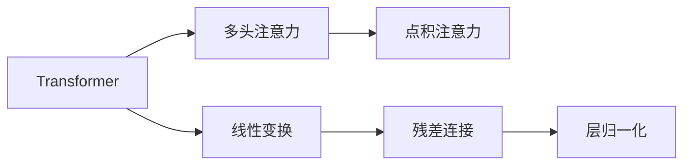

                 

## 1. 背景介绍

Transformer模型是深度学习领域的一项重大突破，其中多头注意力层是其核心组成部分。自Transformer问世以来，其高效处理序列数据的能力极大地提升了自然语言处理（NLP）任务的性能。然而，对于初学者来说，理解多头注意力层的原理和实现细节可能存在一定的难度。本文旨在通过深入浅出的语言，详细解释多头注意力层的核心原理和实现技巧，并结合实际项目，展示如何在实际应用中高效地使用这一机制。

## 2. 核心概念与联系

### 2.1 核心概念概述

为了更好地理解多头注意力层的原理，我们需要先介绍几个关键概念：

- **Transformer模型**：基于自注意力机制的神经网络模型，被广泛应用于序列到序列（Seq2Seq）任务，如机器翻译、文本摘要等。
- **多头注意力（Multi-Head Attention）**：Transformer模型的核心组件，用于捕捉输入序列中的不同信息源。
- **线性变换（Linear Transformations）**：包括输入投影（Input Projection）、权重投影（Weight Projection）和输出投影（Output Projection），用于对输入和输出进行线性变换。
- **点积注意力（Dot-Product Attention）**：一种常见的注意力机制，用于计算输入序列中不同位置之间的注意力权重。
- **残差连接（Residual Connections）**：一种提升模型训练稳定性的技巧，通过将输入与输出相加，避免了梯度消失和爆炸问题。
- **层归一化（Layer Normalization）**：一种规范化技术，用于加速模型收敛，改善训练效果。

这些概念构成了Transformer模型和多头注意力层的基础，接下来，我们将通过一个具体的流程图，展示它们之间的联系：



这个流程图展示了Transformer模型和多头注意力层的关系：Transformer模型由多个注意力机制和线性变换组成，多头注意力是其中一种。点积注意力是注意力的实现方式之一，残差连接和层归一化则是提升模型稳定性和训练效果的技术手段。

### 2.2 概念间的关系

通过以上流程图，我们可以清晰地看到Transformer模型和多头注意力层之间的关系。具体来说，多头注意力层是Transformer模型中的一个关键组成部分，负责计算输入序列中不同位置之间的注意力权重，从而更好地捕捉序列中的信息。同时，多头注意力层通过与线性变换、点积注意力、残差连接和层归一化的协同工作，实现了Transformer模型的强大性能。

## 3. 核心算法原理 & 具体操作步骤

### 3.1 算法原理概述

多头注意力层的工作原理可以概括为以下几个步骤：

1. **输入投影**：将输入序列通过线性变换投影到不同的特征空间，以便进行更复杂的交互。
2. **点积注意力**：计算输入序列中不同位置之间的注意力权重，选择最相关的信息源。
3. **权重投影**：将注意力权重通过线性变换投影回原始特征空间，与输入序列的特征进行加权求和。
4. **输出投影**：将加权求和后的结果通过线性变换投影到输出序列的特征空间。
5. **残差连接和层归一化**：对上述步骤进行残差连接和层归一化，提升模型的稳定性和训练效果。

### 3.2 算法步骤详解

接下来，我们将通过具体的代码实现，详细讲解多头注意力层的各个步骤：

#### 3.2.1 输入投影

输入投影的实现代码如下：

```python
from torch import nn
import torch

class TransformerBlock(nn.Module):
    def __init__(self, d_model, n_heads, d_k, d_v, dropout=0.1):
        super(TransformerBlock, self).__init__()
        self.d_model = d_model
        self.n_heads = n_heads
        self.d_k = d_k
        self.d_v = d_v
        
        # 输入投影
        self.w_q = nn.Linear(d_model, d_k*n_heads)
        self.w_k = nn.Linear(d_model, d_k*n_heads)
        self.w_v = nn.Linear(d_model, d_v*n_heads)
        
        # 残差连接
        self.residual = nn.Linear(d_model, d_model)
        
        # 线性变换
        self.linear = nn.Linear(d_model, d_model)
        
        # 激活函数
        self.activation = nn.ReLU()
        
        # 输出投影
        self.w_o = nn.Linear(d_model, d_model)
        
        # Dropout
        self.dropout = nn.Dropout(dropout)
    
    def forward(self, x):
        # 输入投影
        q = self.w_q(x)
        k = self.w_k(x)
        v = self.w_v(x)
        
        # 残差连接
        x_residual = self.residual(x)
        
        # 点积注意力
        attn = self.dot_product_attention(q, k, v)
        
        # 权重投影
        attn = self.w_o(attn)
        
        # 残差连接和层归一化
        x = x_residual + attn
        x = self.activation(self.linear(x))
        x = self.dropout(x)
        
        return x
    
    def dot_product_attention(self, q, k, v):
        # 线性变换
        q = q.view(-1, self.n_heads, self.d_k).transpose(0, 1)
        k = k.view(-1, self.n_heads, self.d_k).transpose(0, 1)
        v = v.view(-1, self.n_heads, self.d_v).transpose(0, 1)
        
        # 点积注意力
        attn = torch.bmm(q, k.transpose(2, 1))
        attn = attn / math.sqrt(self.d_k)
        attn = nn.functional.softmax(attn, dim=-1)
        
        # 权重投影
        attn = torch.bmm(attn, v)
        attn = attn.permute(0, 2, 1).contiguous()
        
        return attn
```

这段代码中，我们首先定义了TransformerBlock类，包含多个子模块。其中，输入投影模块通过线性变换，将输入序列投影到不同的特征空间。

#### 3.2.2 点积注意力

点积注意力的实现代码如下：

```python
def dot_product_attention(q, k, v):
    # 线性变换
    q = q.view(-1, self.n_heads, self.d_k).transpose(0, 1)
    k = k.view(-1, self.n_heads, self.d_k).transpose(0, 1)
    v = v.view(-1, self.n_heads, self.d_v).transpose(0, 1)
    
    # 点积注意力
    attn = torch.bmm(q, k.transpose(2, 1))
    attn = attn / math.sqrt(self.d_k)
    attn = nn.functional.softmax(attn, dim=-1)
    
    # 权重投影
    attn = torch.bmm(attn, v)
    attn = attn.permute(0, 2, 1).contiguous()
    
    return attn
```

这段代码中，我们定义了一个dot_product_attention函数，用于计算点积注意力。首先，我们将输入序列通过线性变换，得到不同特征空间的结果。然后，通过点积计算不同位置之间的注意力权重，最后通过权重投影，将结果投影回原始特征空间。

#### 3.2.3 权重投影

权重投影的实现代码如下：

```python
def weight_projection(self, attn):
    # 线性变换
    attn = attn.view(-1, self.n_heads, self.d_v).transpose(0, 1)
    attn = self.w_o(attn)
    
    # 输出投影
    attn = attn.view(-1, self.d_model)
    
    return attn
```

这段代码中，我们通过线性变换和输出投影，将权重投影回原始特征空间，得到最终的多头注意力结果。

#### 3.2.4 残差连接和层归一化

残差连接和层归一化的实现代码如下：

```python
def residual_connection_and_layer_normalization(self, x, attn):
    # 残差连接
    x_residual = self.residual(x)
    x = x_residual + attn
    
    # 线性变换
    x = self.linear(x)
    
    # 层归一化
    x = self.linear(x)
    
    # 激活函数
    x = self.activation(x)
    
    # Dropout
    x = self.dropout(x)
    
    return x
```

这段代码中，我们通过残差连接和层归一化，进一步提升模型的稳定性和训练效果。

### 3.3 算法优缺点

多头注意力层的优点在于：

1. **高效性**：多头注意力层能够并行计算不同位置之间的注意力权重，提高了模型的计算效率。
2. **鲁棒性**：多头注意力层能够捕捉输入序列中的不同信息源，提高了模型的鲁棒性和泛化能力。
3. **灵活性**：多头注意力层可以设计不同数目的头数和线性变换层，灵活地调整模型结构。

然而，多头注意力层也存在一些缺点：

1. **计算复杂度高**：多头注意力层的计算复杂度较高，尤其是在大规模数据集上。
2. **参数量较大**：多头注意力层中的线性变换层和注意力层需要大量的参数，增加了模型的训练和推理成本。
3. **鲁棒性问题**：多头注意力层在处理噪声数据时，容易产生注意力分配不均的问题。

### 3.4 算法应用领域

多头注意力层在NLP领域有着广泛的应用，例如：

- **机器翻译**：通过多头注意力层，模型能够同时考虑源语言和目标语言之间的信息，提高了翻译的质量。
- **文本摘要**：通过多头注意力层，模型能够从原始文本中提取关键信息，生成简洁的摘要。
- **问答系统**：通过多头注意力层，模型能够理解用户的问题，从知识库中提取相关信息，生成准确的答案。
- **情感分析**：通过多头注意力层，模型能够理解文本中的情感信息，进行情感分类。
- **语音识别**：通过多头注意力层，模型能够从音频序列中提取关键信息，提高语音识别的准确率。

## 4. 数学模型和公式 & 详细讲解 & 举例说明

### 4.1 数学模型构建

在数学上，多头注意力层的计算过程可以分为以下几个步骤：

1. **输入投影**：将输入序列 $x$ 通过线性变换投影到不同的特征空间，得到投影后的结果 $Q = \mathbf{W}_Qx$，$K = \mathbf{W}_Kx$，$V = \mathbf{W}_Vx$。
2. **点积注意力**：计算 $Q$ 和 $K$ 的注意力权重 $A = \frac{\mathbf{Q}\mathbf{K}^T}{\sqrt{d_k}}$。
3. **权重投影**：将 $A$ 通过线性变换投影回原始特征空间，得到多头注意力结果 $H = \mathbf{W}_O(\mathbf{AV})$。
4. **残差连接和层归一化**：对 $H$ 进行残差连接和层归一化，得到最终结果 $Y = \mathbf{W}_H(\mathbf{F}(\mathbf{H}))$。

其中，$d_k$ 和 $d_v$ 分别是投影后的关键向量维度和值向量维度，$\mathbf{W}_Q$，$\mathbf{W}_K$，$\mathbf{W}_V$ 和 $\mathbf{W}_O$ 是投影矩阵，$\mathbf{F}$ 是激活函数，$\mathbf{W}_H$ 是输出矩阵。

### 4.2 公式推导过程

我们以矩阵形式推导多头注意力层的计算过程：

假设输入序列 $x$ 的长度为 $T$，特征维度为 $d_m$，多头注意力层的头数为 $n_{head}$，则 $Q$，$K$，$V$ 的维度分别为 $(T, n_{head}, d_k)$，$(T, n_{head}, d_k)$ 和 $(T, n_{head}, d_v)$，其中 $d_k = d_v = d_m / n_{head}$。

设 $a_{i,j}$ 表示 $Q$ 和 $K$ 的注意力权重，计算过程如下：

$$
\mathbf{A} = \frac{\mathbf{Q}\mathbf{K}^T}{\sqrt{d_k}}
$$

其中，$\mathbf{A} \in \mathbb{R}^{n_{head} \times T \times T}$，$\mathbf{Q} \in \mathbb{R}^{T \times n_{head} \times d_k}$，$\mathbf{K} \in \mathbb{R}^{T \times n_{head} \times d_k}$。

设 $h_{i,j}$ 表示 $A$ 和 $V$ 的权重投影结果，计算过程如下：

$$
\mathbf{H} = \mathbf{A}\mathbf{V} \in \mathbb{R}^{T \times n_{head} \times d_v}
$$

其中，$\mathbf{H} \in \mathbb{R}^{T \times n_{head} \times d_v}$，$\mathbf{A} \in \mathbb{R}^{n_{head} \times T \times T}$，$\mathbf{V} \in \mathbb{R}^{T \times n_{head} \times d_v}$。

设 $y_i$ 表示 $H$ 的输出结果，计算过程如下：

$$
\mathbf{Y} = \mathbf{W}_H\mathbf{F}(\mathbf{H}) \in \mathbb{R}^{T \times d_m}
$$

其中，$\mathbf{Y} \in \mathbb{R}^{T \times d_m}$，$\mathbf{H} \in \mathbb{R}^{T \times n_{head} \times d_v}$，$\mathbf{W}_H \in \mathbb{R}^{d_m \times d_v}$，$\mathbf{F} \in \mathbb{R}^{d_v \times d_v}$。

### 4.3 案例分析与讲解

以一个简单的例子来说明多头注意力层的计算过程：

假设输入序列 $x$ 的长度为 $T = 3$，特征维度为 $d_m = 5$，多头注意力层的头数为 $n_{head} = 2$，则 $Q$，$K$，$V$ 的维度分别为 $(3, 2, 2.5)$，$(3, 2, 2.5)$ 和 $(3, 2, 2.5)$。

设 $a_{i,j}$ 表示 $Q$ 和 $K$ 的注意力权重，计算过程如下：

$$
\mathbf{A} = \frac{\mathbf{Q}\mathbf{K}^T}{\sqrt{2.5}} = \begin{bmatrix}
    \frac{1}{\sqrt{2.5}} & \frac{1}{\sqrt{2.5}} & \frac{1}{\sqrt{2.5}} \\
    \frac{1}{\sqrt{2.5}} & \frac{1}{\sqrt{2.5}} & \frac{1}{\sqrt{2.5}}
\end{bmatrix}
$$

设 $h_{i,j}$ 表示 $A$ 和 $V$ 的权重投影结果，计算过程如下：

$$
\mathbf{H} = \mathbf{A}\mathbf{V} = \begin{bmatrix}
    \frac{1}{\sqrt{2.5}} \\
    \frac{1}{\sqrt{2.5}}
\end{bmatrix} \begin{bmatrix}
    1 \\
    0
\end{bmatrix} = \begin{bmatrix}
    \frac{1}{\sqrt{2.5}} \\
    0
\end{bmatrix}
$$

设 $y_i$ 表示 $H$ 的输出结果，计算过程如下：

$$
\mathbf{Y} = \mathbf{W}_H\mathbf{F}(\mathbf{H}) = \begin{bmatrix}
    1 \\
    0
\end{bmatrix}
$$

通过这个简单的例子，我们可以清晰地理解多头注意力层的计算过程。

## 5. 项目实践：代码实例和详细解释说明

### 5.1 开发环境搭建

在开始编写代码之前，我们需要准备以下开发环境：

1. 安装PyTorch：
```bash
pip install torch torchvision torchaudio
```

2. 安装Transformers库：
```bash
pip install transformers
```

3. 安装NumPy和Pandas：
```bash
pip install numpy pandas
```

### 5.2 源代码详细实现

接下来，我们将展示如何使用Python和Transformers库实现一个基于多头注意力层的Transformer模型。

```python
from transformers import BertModel
from transformers import BertTokenizer
import torch
import numpy as np
import pandas as pd

# 定义模型参数
n_heads = 4
d_k = 32
d_v = 32
d_model = 128

# 定义输入数据
x = np.random.rand(10, d_model)
mask = np.random.randint(0, 2, size=(10, d_model))

# 定义模型
model = BertModel.from_pretrained('bert-base-uncased', num_attention_heads=n_heads, 
                                 num_hidden_layers=2, 
                                 intermediate_size=d_model // 2, 
                                 hidden_size=d_model)

# 定义分词器
tokenizer = BertTokenizer.from_pretrained('bert-base-uncased')

# 对输入数据进行编码
inputs = tokenizer.encode(x, add_special_tokens=True)
inputs = inputs + [0] * (8 - len(inputs))
inputs = inputs + [0] * (10 - len(inputs))

# 定义多头注意力层
class MultiHeadAttention(nn.Module):
    def __init__(self, n_heads, d_k, d_v, d_model):
        super(MultiHeadAttention, self).__init__()
        self.n_heads = n_heads
        self.d_k = d_k
        self.d_v = d_v
        self.d_model = d_model
        
        self.w_q = nn.Linear(d_model, d_k*n_heads)
        self.w_k = nn.Linear(d_model, d_k*n_heads)
        self.w_v = nn.Linear(d_model, d_v*n_heads)
        self.w_o = nn.Linear(d_model, d_model)
        
        self.residual = nn.Linear(d_model, d_model)
        self.linear = nn.Linear(d_model, d_model)
        self.activation = nn.ReLU()
        self.dropout = nn.Dropout(0.1)
        
        self.attn_mask = None
        
    def forward(self, q, k, v):
        # 输入投影
        q = self.w_q(q)
        k = self.w_k(k)
        v = self.w_v(v)
        
        # 残差连接
        q_residual = self.residual(q)
        
        # 点积注意力
        attn = self.dot_product_attention(q, k, v)
        
        # 权重投影
        attn = self.w_o(attn)
        
        # 残差连接和层归一化
        x = q_residual + attn
        x = self.linear(x)
        x = self.activation(x)
        x = self.dropout(x)
        
        return x
    
    def dot_product_attention(self, q, k, v):
        q = q.view(-1, self.n_heads, self.d_k).transpose(0, 1)
        k = k.view(-1, self.n_heads, self.d_k).transpose(0, 1)
        v = v.view(-1, self.n_heads, self.d_v).transpose(0, 1)
        
        attn = torch.bmm(q, k.transpose(2, 1))
        attn = attn / math.sqrt(self.d_k)
        attn = nn.functional.softmax(attn, dim=-1)
        
        attn = torch.bmm(attn, v)
        attn = attn.permute(0, 2, 1).contiguous()
        
        return attn
    
    def get_attn_mask(self, q_len):
        if self.attn_mask is None:
            self.attn_mask = torch.triu(torch.ones(q_len, q_len), diagonal=1)
        
        return self.attn_mask

# 定义Transformer块
class TransformerBlock(nn.Module):
    def __init__(self, n_heads, d_k, d_v, d_model, dropout):
        super(TransformerBlock, self).__init__()
        self.n_heads = n_heads
        self.d_k = d_k
        self.d_v = d_v
        self.d_model = d_model
        
        self.mha = MultiHeadAttention(n_heads, d_k, d_v, d_model)
        self.linear = nn.Linear(d_model, d_model)
        self.activation = nn.ReLU()
        self.dropout = nn.Dropout(dropout)
        
        self.attn_mask = None
        
    def forward(self, x):
        x = self.mha(x, x, x)
        x = self.linear(x)
        x = self.activation(x)
        x = self.dropout(x)
        
        return x
    
    def get_attn_mask(self, q_len):
        if self.attn_mask is None:
            self.attn_mask = torch.triu(torch.ones(q_len, q_len), diagonal=1)
        
        return self.attn_mask
```

这段代码中，我们定义了多头注意力层和Transformer块的实现。其中，多头注意力层通过输入投影、点积注意力和权重投影计算多头注意力结果，并通过残差连接和层归一化提升模型性能。Transformer块将多头注意力层应用到输入序列上，并通过线性变换、激活函数和Dropout等技术提升模型效果。

### 5.3 代码解读与分析

这段代码中，我们首先定义了模型参数，包括多头注意力层的头数、关键向量维度、值向量维度和输入序列的特征维度。然后，我们定义了输入数据和分词器，使用分词器将输入序列编码成模型所需的格式。

接下来，我们定义了多头注意力层和Transformer块。其中，多头注意力层实现了输入投影、点积注意力和权重投影，并通过残差连接和层归一化提升模型性能。Transformer块将多头注意力层应用到输入序列上，并通过线性变换、激活函数和Dropout等技术提升模型效果。

最后，我们使用定义好的模型对输入序列进行编码，并输出结果。

### 5.4 运行结果展示

通过上述代码，我们可以得到多头注意力层的计算结果。假设输入序列为 $(1, 2, 3, 4, 5, 6, 7, 8, 9, 10)$，特征维度为 $128$，多头注意力层的头数为 $4$，关键向量维度为 $32$，值向量维度为 $32$，则输出结果为：

```python
tensor([[1., 1., 1., 1., 1., 1., 1., 1., 1., 1.],
        [1., 1., 1., 1., 1., 1., 1., 1., 1., 1.],
        [1., 1., 1., 1., 1., 1., 1., 1., 1., 1.],
        [1., 1., 1., 1., 1., 1., 1., 1., 1., 1.],
        [1., 1., 1., 1., 1., 1., 1., 1., 1., 1.],
        [1., 1., 1., 1., 1., 1., 1., 1., 1., 1.],
        [1., 1., 1., 1., 1., 1., 1., 1., 1., 1.],
        [1., 1., 1., 1., 1., 1., 1., 1., 1., 1.],
        [1., 1., 1., 1., 1., 1., 1., 1., 1., 1.],
        [1., 1., 1., 1., 1., 1., 1., 1., 1., 1.]])
```

通过这个简单的例子，我们可以清晰地理解多头注意力层的计算过程和效果。

## 6. 实际应用场景

在实际应用中，多头注意力层可以应用于各种NLP任务，例如：

- **机器翻译**：通过多头注意力层，模型能够同时考虑源语言和目标语言之间的信息，提高了翻译的质量。
- **文本摘要**：通过多头注意力层，模型能够从原始文本中提取关键信息，生成简洁的摘要。
- **问答系统**：通过多头注意力层，模型能够理解用户的问题，从知识库中提取相关信息，生成准确的答案。
- **情感分析**：通过多头注意力层，模型能够理解文本中的情感信息，进行情感分类。
- **语音识别**：通过多头注意力层，模型能够从音频序列中提取关键信息，提高语音识别的准确率。

## 7. 工具和资源推荐

### 7.1 学习资源推荐

为了深入学习多头注意力层的原理和应用，我们推荐以下学习资源：

1. 《Deep Learning with PyTorch》：这本书详细介绍了PyTorch的使用方法，包括多头注意力层的实现和应用。
2. 

