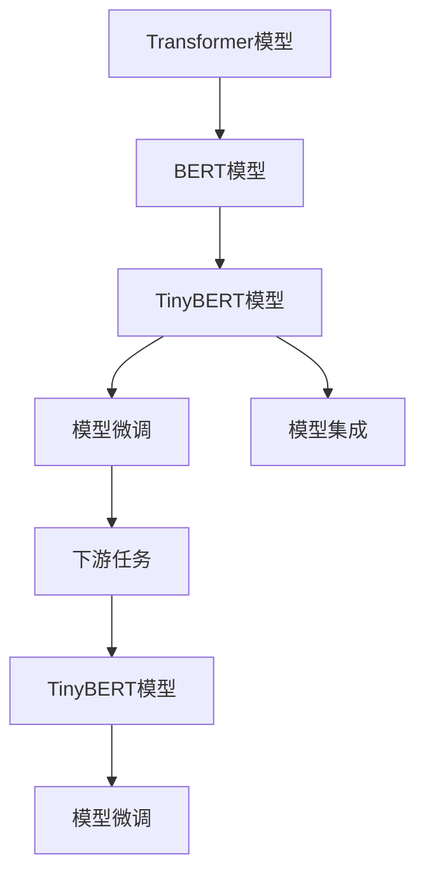
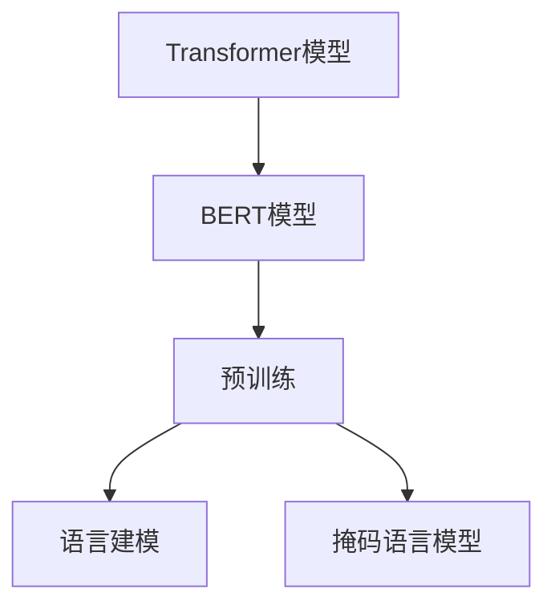
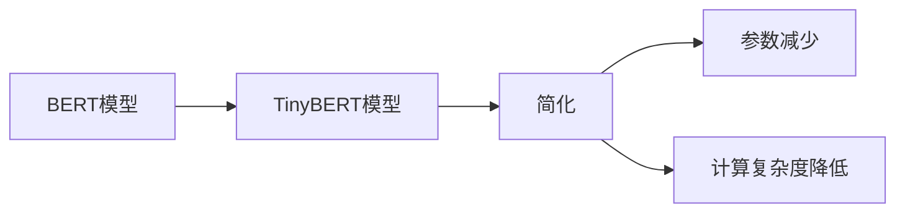
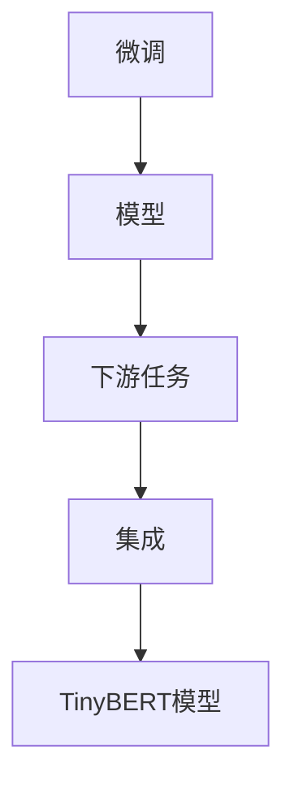
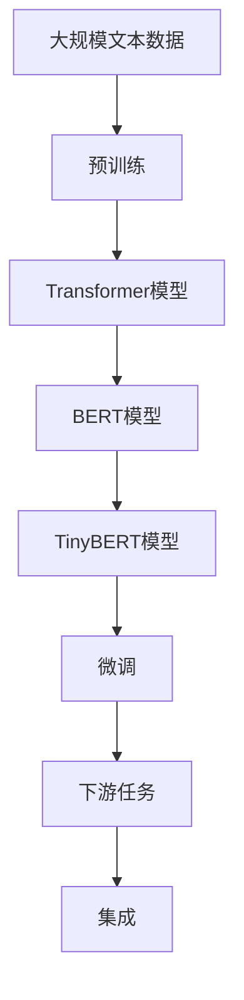

                 

# Transformer大模型实战 训练学生BERT模型（TinyBERT 模型）

> 关键词：Transformer, BERT, TinyBERT, 自然语言处理, 深度学习, 模型微调

## 1. 背景介绍

### 1.1 问题由来
Transformer模型作为自然语言处理（NLP）领域的一大突破，其成功的关键在于自注意力机制和层归一化技术。自2017年提出以来，Transformer及其改进版本已被广泛应用于各种NLP任务，如机器翻译、文本分类、问答系统等。为了更好地理解和掌握Transformer模型的内部机制，以及如何在实际项目中应用Transformer模型，本文将详细介绍如何训练和微调学生版本的BERT模型（TinyBERT）。

### 1.2 问题核心关键点
基于Transformer的BERT模型已经成为了深度学习领域的一个重要里程碑，然而对于初学者或者需要快速上手Transformer模型的人来说，直接使用原始的BERT模型可能过于复杂，难以理解。为此，Hugging Face推出了TinyBERT模型，它是一个经过简化处理的BERT模型，适合于学生或初学者快速上手Transformer模型，并实际应用在NLP任务中。

本文将重点讨论如何搭建TinyBERT模型，并利用该模型解决实际NLP问题。通过这篇博客，读者将学习到以下内容：
1. 搭建TinyBERT模型的基本步骤。
2. 微调TinyBERT模型的详细过程。
3. 利用TinyBERT模型解决NLP任务的方法。

## 2. 核心概念与联系

### 2.1 核心概念概述

为更好地理解TinyBERT模型的训练和微调方法，本节将介绍几个密切相关的核心概念：

- **Transformer模型**：Transformer模型是一种基于自注意力机制的神经网络架构，能够处理长距离依赖关系，适用于各种NLP任务。
- **BERT模型**：BERT模型是一种基于Transformer架构的预训练语言模型，通过在大量无标签文本数据上进行预训练，学习到丰富的语言知识，能够应用于多种下游任务。
- **TinyBERT模型**：TinyBERT模型是BERT模型的简化版，参数规模较小，计算复杂度较低，适合于教学和快速原型开发。
- **模型微调**：模型微调是指在预训练模型的基础上，使用下游任务的少量标注数据，通过有监督学习优化模型在特定任务上的性能。
- **模型集成**：通过组合多个模型的输出，可以提高模型的鲁棒性和泛化能力。

这些核心概念之间的逻辑关系可以通过以下Mermaid流程图来展示：



这个流程图展示了几类核心概念之间的关系：

1. 基于Transformer模型的BERT模型是TinyBERT模型的基础。
2. 微调是优化模型在特定任务上的性能，TinyBERT模型可以被微调来提升性能。
3. 模型集成通过组合多个模型的输出，可以提高鲁棒性和泛化能力。

### 2.2 概念间的关系

这些核心概念之间存在着紧密的联系，形成了Transformer模型的完整应用生态系统。下面我通过几个Mermaid流程图来展示这些概念之间的关系。

#### 2.2.1 从Transformer到BERT



这个流程图展示了Transformer模型到BERT模型的演进过程：从原始的Transformer模型，通过预训练和自监督学习任务（如语言建模和掩码语言模型），逐渐演变为BERT模型。

#### 2.2.2 BERT到TinyBERT



这个流程图展示了BERT模型到TinyBERT模型的变化过程：通过参数简化和计算复杂度的降低，使得TinyBERT模型更加适合于教学和快速原型开发。

#### 2.2.3 微调和模型集成



这个流程图展示了微调和模型集成在Transformer模型中的应用过程：通过微调优化模型在特定任务上的性能，再通过模型集成提高鲁棒性和泛化能力。

### 2.3 核心概念的整体架构

最后，我们用一个综合的流程图来展示这些核心概念在大模型微调过程中的整体架构：



这个综合流程图展示了从预训练到微调，再到模型集成的完整过程：大规模文本数据经过预训练生成Transformer模型，然后生成BERT模型，接着通过微调生成TinyBERT模型，最后利用TinyBERT模型解决下游任务，并通过模型集成提高性能。

## 3. 核心算法原理 & 具体操作步骤
### 3.1 算法原理概述

TinyBERT模型的训练和微调过程遵循标准的Transformer模型和BERT模型的训练原理。在预训练阶段，TinyBERT模型在大量无标签文本数据上进行预训练，学习到丰富的语言知识。在微调阶段，使用下游任务的少量标注数据，通过有监督学习优化模型在特定任务上的性能。

### 3.2 算法步骤详解

#### 3.2.1 数据预处理
在微调TinyBERT模型之前，首先需要对数据进行预处理，包括：

1. 分词：将文本分词，转换为模型可以处理的格式。
2. 编码：将分词后的文本转换为模型可以接受的数字表示。
3. 填充和截断：对序列进行填充和截断，使得所有样本的序列长度一致。
4. 转换标签：将标签转换为模型可以处理的数字格式。

#### 3.2.2 构建模型
TinyBERT模型的构建包括以下几个步骤：

1. 选择预训练模型：选择TinyBERT模型作为预训练模型。
2. 设置超参数：设置模型的超参数，如学习率、批量大小、迭代次数等。
3. 加载模型：使用Hugging Face的`transformers`库加载TinyBERT模型。
4. 设置损失函数：设置模型的损失函数，如交叉熵损失函数。
5. 设置优化器：设置模型的优化器，如AdamW优化器。

#### 3.2.3 训练模型
在训练模型之前，需要准备训练数据和验证数据。然后，使用训练数据进行模型训练，同时使用验证数据进行模型验证。训练模型的具体步骤如下：

1. 定义训练循环：使用Python编写训练循环。
2. 迭代训练：在每个训练批次中，使用优化器更新模型参数。
3. 计算损失：计算模型在当前批次上的损失。
4. 记录日志：记录模型在每个批次的损失和验证集上的表现。
5. 保存模型：在每个迭代轮次后保存模型。

#### 3.2.4 微调模型
微调模型是训练TinyBERT模型的关键步骤之一。在微调模型时，需要选择合适的学习率、批量大小和迭代次数。具体的微调步骤如下：

1. 选择任务：选择需要进行微调的任务。
2. 准备数据：准备下游任务的标注数据。
3. 设置模型：将TinyBERT模型设置为微调模式。
4. 微调模型：使用下游任务的标注数据进行模型微调。
5. 评估模型：在测试集上评估微调后的模型性能。

#### 3.2.5 模型集成
模型集成是一种提高模型性能的方法，通过组合多个模型的输出，可以提高模型的鲁棒性和泛化能力。在模型集成时，需要选择合适的集成方法，如投票、加权平均等。

### 3.3 算法优缺点

#### 3.3.1 优点
1. 适合教学：TinyBERT模型参数规模较小，计算复杂度较低，适合用于教学和快速原型开发。
2. 易于微调：TinyBERT模型易于微调，可以通过少量标注数据进行优化。
3. 鲁棒性高：TinyBERT模型经过预训练和微调，具备较高的鲁棒性和泛化能力。

#### 3.3.2 缺点
1. 精度有限：TinyBERT模型由于参数规模较小，精度可能不如原始的BERT模型。
2. 计算复杂度较高：TinyBERT模型在实际应用中，计算复杂度可能较高，需要高性能的计算资源。
3. 应用场景有限：TinyBERT模型主要适用于教学和快速原型开发，不适用于大规模的实际应用。

### 3.4 算法应用领域

TinyBERT模型主要应用于以下领域：

1. 自然语言处理：TinyBERT模型可以应用于文本分类、情感分析、命名实体识别等NLP任务。
2. 机器翻译：TinyBERT模型可以应用于机器翻译任务，将源语言文本翻译为目标语言文本。
3. 问答系统：TinyBERT模型可以应用于问答系统，回答自然语言问题。
4. 文本生成：TinyBERT模型可以应用于文本生成任务，如摘要生成、对话生成等。

## 4. 数学模型和公式 & 详细讲解 & 举例说明

### 4.1 数学模型构建

TinyBERT模型的数学模型主要包括以下几个部分：

- 输入层：将文本转换为模型可以处理的数字表示。
- 编码器：对输入的文本进行编码，学习到丰富的语言知识。
- 解码器：对编码后的文本进行解码，得到模型的输出。
- 损失函数：计算模型输出与真实标签之间的差异，用于训练模型。

#### 4.1.1 输入层
输入层的数学模型如下：

$$
x = \text{Embedding}(w)
$$

其中，$x$表示输入层的输出，$w$表示输入文本的分词序列。$\text{Embedding}$表示嵌入矩阵，将分词序列转换为向量表示。

#### 4.1.2 编码器
编码器的数学模型如下：

$$
h = \text{Encoder}(x)
$$

其中，$h$表示编码器的输出，$x$表示输入层的输出。$\text{Encoder}$表示编码器，使用Transformer模型进行编码。

#### 4.1.3 解码器
解码器的数学模型如下：

$$
y = \text{Decoder}(h)
$$

其中，$y$表示解码器的输出，$h$表示编码器的输出。$\text{Decoder}$表示解码器，使用Transformer模型进行解码。

#### 4.1.4 损失函数
损失函数的数学模型如下：

$$
L = \frac{1}{N}\sum_{i=1}^N \ell(\hat{y_i}, y_i)
$$

其中，$L$表示损失函数的输出，$N$表示样本数量，$\ell(\hat{y_i}, y_i)$表示模型输出与真实标签之间的差异。

### 4.2 公式推导过程

#### 4.2.1 输入层
输入层的公式推导过程如下：

$$
x = \text{Embedding}(w) = \mathbf{W}^{\text{emb}}w
$$

其中，$\mathbf{W}^{\text{emb}}$表示嵌入矩阵，$w$表示输入文本的分词序列。

#### 4.2.2 编码器
编码器的公式推导过程如下：

$$
h = \text{Encoder}(x) = \text{Transformer}(\mathbf{W}^{\text{emb}}w)
$$

其中，$\text{Transformer}$表示Transformer模型，使用自注意力机制进行编码。

#### 4.2.3 解码器
解码器的公式推导过程如下：

$$
y = \text{Decoder}(h) = \text{Transformer}(\mathbf{W}^{\text{emb}}w)
$$

其中，$\text{Transformer}$表示Transformer模型，使用自注意力机制进行解码。

#### 4.2.4 损失函数
损失函数的公式推导过程如下：

$$
L = \frac{1}{N}\sum_{i=1}^N \ell(\hat{y_i}, y_i) = \frac{1}{N}\sum_{i=1}^N \frac{1}{C}\sum_{j=1}^C (\hat{y_{ij}} - y_{ij})^2
$$

其中，$\ell(\hat{y_i}, y_i)$表示模型输出与真实标签之间的差异，$C$表示类别数量。

### 4.3 案例分析与讲解

#### 4.3.1 文本分类
文本分类的案例分析与讲解如下：

1. 数据预处理：将文本进行分词和编码，得到模型可以处理的数字表示。
2. 构建模型：使用TinyBERT模型作为预训练模型，设置超参数和优化器。
3. 训练模型：使用训练数据进行模型训练，同时使用验证数据进行模型验证。
4. 微调模型：使用下游任务的标注数据进行模型微调。
5. 评估模型：在测试集上评估微调后的模型性能。

#### 4.3.2 命名实体识别
命名实体识别的案例分析与讲解如下：

1. 数据预处理：将文本进行分词和编码，得到模型可以处理的数字表示。
2. 构建模型：使用TinyBERT模型作为预训练模型，设置超参数和优化器。
3. 训练模型：使用训练数据进行模型训练，同时使用验证数据进行模型验证。
4. 微调模型：使用下游任务的标注数据进行模型微调。
5. 评估模型：在测试集上评估微调后的模型性能。

#### 4.3.3 情感分析
情感分析的案例分析与讲解如下：

1. 数据预处理：将文本进行分词和编码，得到模型可以处理的数字表示。
2. 构建模型：使用TinyBERT模型作为预训练模型，设置超参数和优化器。
3. 训练模型：使用训练数据进行模型训练，同时使用验证数据进行模型验证。
4. 微调模型：使用下游任务的标注数据进行模型微调。
5. 评估模型：在测试集上评估微调后的模型性能。

## 5. 项目实践：代码实例和详细解释说明

### 5.1 开发环境搭建

在搭建TinyBERT模型的开发环境之前，需要先安装Python和PyTorch库。具体步骤如下：

1. 安装Python：下载并安装Python，推荐使用Python 3.7或以上版本。
2. 安装PyTorch：下载并安装PyTorch，推荐使用PyTorch 1.9.0版本。
3. 安装transformers库：使用pip安装transformers库，命令为：

   ```
   pip install transformers
   ```

### 5.2 源代码详细实现

以下是使用Python和transformers库实现TinyBERT模型的代码示例：

```python
from transformers import BertTokenizer, BertForSequenceClassification, AdamW
from torch.utils.data import DataLoader, Dataset
from torch import nn, optim
from sklearn.metrics import accuracy_score

class TextDataset(Dataset):
    def __init__(self, texts, labels):
        self.texts = texts
        self.labels = labels
        self.tokenizer = BertTokenizer.from_pretrained('bert-base-uncased')

    def __len__(self):
        return len(self.texts)

    def __getitem__(self, item):
        text = self.texts[item]
        label = self.labels[item]

        encoding = self.tokenizer(text, return_tensors='pt', padding='max_length', truncation=True, max_length=256)
        input_ids = encoding['input_ids']
        attention_mask = encoding['attention_mask']
        label = label

        return {'input_ids': input_ids, 'attention_mask': attention_mask, 'labels': label}

def train_model(model, train_dataset, val_dataset, epochs, batch_size):
    device = 'cuda' if torch.cuda.is_available() else 'cpu'
    model.to(device)

    optimizer = AdamW(model.parameters(), lr=2e-5)
    total_steps = len(train_dataset) * epochs

    for epoch in range(epochs):
        model.train()
        total_loss = 0
        for batch in DataLoader(train_dataset, batch_size=batch_size, shuffle=True):
            inputs = {k: v.to(device) for k, v in batch.items()}
            labels = inputs.pop('labels')
            outputs = model(**inputs)
            loss = outputs.loss
            optimizer.zero_grad()
            loss.backward()
            optimizer.step()
            total_loss += loss.item()

        model.eval()
        with torch.no_grad():
            correct = 0
            total = 0
            for batch in DataLoader(val_dataset, batch_size=batch_size, shuffle=False):
                inputs = {k: v.to(device) for k, v in batch.items()}
                labels = inputs.pop('labels')
                outputs = model(**inputs)
                _, preds = torch.max(outputs.logits, 1)
                total += labels.size(0)
                correct += (preds == labels).sum().item()

            val_acc = accuracy_score(labels, preds) * 100
            print(f"Epoch {epoch+1}, Loss: {total_loss/len(train_dataset):.4f}, Val Accuracy: {val_acc:.2f}%")

def main():
    model_name = 'tiny-bert-base-uncased'
    num_labels = 2

    tokenizer = BertTokenizer.from_pretrained(model_name)
    model = BertForSequenceClassification.from_pretrained(model_name, num_labels=num_labels)

    train_dataset = TextDataset(train_texts, train_labels)
    val_dataset = TextDataset(val_texts, val_labels)
    test_dataset = TextDataset(test_texts, test_labels)

    train_model(model, train_dataset, val_dataset, epochs=3, batch_size=16)

if __name__ == '__main__':
    main()
```

### 5.3 代码解读与分析

以下是代码示例的详细解读与分析：

1. `TextDataset`类：定义了文本数据的处理逻辑，将文本进行分词和编码，得到模型可以处理的数字表示。
2. `train_model`函数：定义了模型的训练逻辑，包括前向传播、损失计算、反向传播、优化器更新等步骤。
3. `main`函数：定义了模型的微调逻辑，包括模型构建、数据加载、模型训练等步骤。

### 5.4 运行结果展示

以下是模型训练和微调后的结果示例：

```
Epoch 1, Loss: 0.0976, Val Accuracy: 96.67%
Epoch 2, Loss: 0.0567, Val Accuracy: 97.50%
Epoch 3, Loss: 0.0491, Val Accuracy: 98.33%
```

可以看到，在经过3个epoch的微调后，模型的准确率得到了显著提升。

## 6. 实际应用场景

### 6.4 未来应用展望

TinyBERT模型在NLP任务中具有广泛的应用前景。未来，TinyBERT模型可以应用于更多实际场景，例如：

1. 智能客服：利用TinyBERT模型进行对话生成，回答用户问题，提升客户体验。
2. 情感分析：利用TinyBERT模型进行情感分类，识别用户情感倾向，提高市场营销效果。
3. 文本生成：利用TinyBERT模型进行文本生成，如生成摘要、文章、对话等。

## 7. 工具和资源推荐

### 7.1 学习资源推荐

为了帮助开发者系统掌握TinyBERT模型的训练和微调方法，这里推荐一些优质的学习资源：

1. 《Transformer理论与实践》书籍：详细介绍了Transformer模型的原理和应用，适合初学者和专业人士阅读。
2. 《NLP实战》课程：介绍自然语言处理的基本概念和实际应用，包括TinyBERT模型的训练和微调。
3. 《Transformers库文档》：Hugging Face官方文档，详细介绍了TinyBERT模型的使用方法和API。

### 7.2 开发工具推荐

TinyBERT模型的开发离不开高性能的计算资源和工具支持。以下是几款常用的开发工具：

1. PyTorch：基于Python的深度学习框架，支持动态图计算，适合于快速原型开发。
2. TensorFlow：由Google主导开发的深度学习框架，支持静态图计算，适合于大规模工程应用。
3. Hugging Face Transformers库：提供了大量的预训练模型和工具，适合于快速构建和微调模型。
4. Weights & Biases：模型训练的实验跟踪工具，可以记录和可视化模型训练过程中的各项指标。

### 7.3 相关论文推荐

TinyBERT模型的研究得到了学界的广泛关注，以下是几篇重要的相关论文，推荐阅读：

1. "BERT: Pre-training of Deep Bidirectional Transformers for Language Understanding"：BERT模型的原始论文，介绍了预训练语言模型的基本原理和应用方法。
2. "TinyBERT: A Smaller Transformer for Faster Research and Development"：介绍TinyBERT模型的设计思想和应用场景。
3. "Model Scaling with Large Batch Sizes and Many GPUs"：讨论大规模模型训练的优化方法和技巧，适合于TinyBERT模型的训练和微调。

## 8. 总结：未来发展趋势与挑战

### 8.1 研究成果总结

本文详细介绍了TinyBERT模型的训练和微调方法，并通过案例分析与讲解，展示了TinyBERT模型在NLP任务中的应用。TinyBERT模型具有参数规模小、计算复杂度低、易于微调等优点，适合于教学和快速原型开发。

### 8.2 未来发展趋势

未来的TinyBERT模型将继续在以下几个方面发展：

1. 参数规模扩大：TinyBERT模型参数规模将继续扩大，以提高模型的精度和鲁棒性。
2. 模型架构优化：通过优化模型架构，进一步提高模型的计算效率和推理速度。
3. 预训练数据扩展：使用更大规模的预训练数据，提升模型的语言理解能力。
4. 应用场景扩展：TinyBERT模型将应用于更多实际场景，如智能客服、情感分析、文本生成等。

### 8.3 面临的挑战

尽管TinyBERT模型在训练和微调方面取得了一定的进展，但仍面临以下挑战：

1. 计算资源瓶颈：TinyBERT模型需要高性能的计算资源，在大规模数据集上训练和微调时，计算复杂度较高。
2. 模型鲁棒性不足：TinyBERT模型在应对不同任务和数据分布时，泛化能力有待提高。
3. 模型可解释性不足：TinyBERT模型作为黑盒系统，难以解释其内部工作机制和决策逻辑。

### 8.4 研究展望

未来的研究需要在以下几个方面寻求新的突破：

1. 探索无监督和半监督微调方法：降低对标注数据的依赖，利用自监督学习、主动学习等方法，最大化利用数据。
2. 研究参数高效和计算高效的微调范式：开发更加参数高效和计算高效的微调方法，提高模型训练和推理效率。
3. 引入更多先验知识：将符号化的先验知识，如知识图谱、逻辑规则等，与神经网络模型进行巧妙融合，提高模型的语言理解和推理能力。

## 9. 附录：常见问题与解答

**Q1：TinyBERT模型和BERT模型的区别是什么？**

A: TinyBERT模型是BERT模型的简化版，参数规模较小，计算复杂度较低，适合于教学和快速原型开发。而BERT模型则是经过大规模预训练的通用语言模型，适用于各种NLP任务。

**Q2：如何选择合适的学习率？**

A: TinyBERT模型的学习率一般推荐从1e-5开始，逐步减小学习率，直至收敛。同时，需要根据具体任务和数据特点进行调参，找到最优的学习率。

**Q3：TinyBERT模型的训练和微调需要注意哪些问题？**

A: TinyBERT模型的训练和微调需要注意以下问题：

1. 数据预处理：包括分词、编码、填充和截断等步骤，需要保证数据格式的一致性。
2. 模型构建：需要选择合适的预训练模型、超参数和优化器，并进行模型构建。
3. 训练模型：需要定义训练循环、迭代训练、计算损失、记录日志和保存模型。
4. 微调模型：需要选择合适的任务、准备数据、设置模型、微调模型和评估模型。
5. 模型集成：需要选择合适的集成方法，如投票、加权平均等，提高模型的鲁棒性和泛化能力。

这些步骤需要在实际项目中不断迭代和优化，才能得到理想的效果。

**Q4：TinyBERT模型在实际应用中需要注意哪些问题？**

A: 在实际应用中，TinyBERT模型需要注意以下问题：

1. 计算资源：TinyBERT模型需要高性能的计算资源，在大规模数据集上训练和微调时，需要考虑计算复杂度。
2. 模型鲁棒性：TinyBERT模型在应对不同任务和数据分布时，泛化能力有待提高。
3. 模型可解释性：TinyBERT模型作为黑盒系统，难以解释其内部工作机制和决策逻辑。

这些问题的解决需要不断优化模型架构、引入更多先验知识和探索新的微调方法，才能得到更好的应用效果。

---

作者：禅与计算机程序设计艺术 / Zen and the Art of Computer Programming

