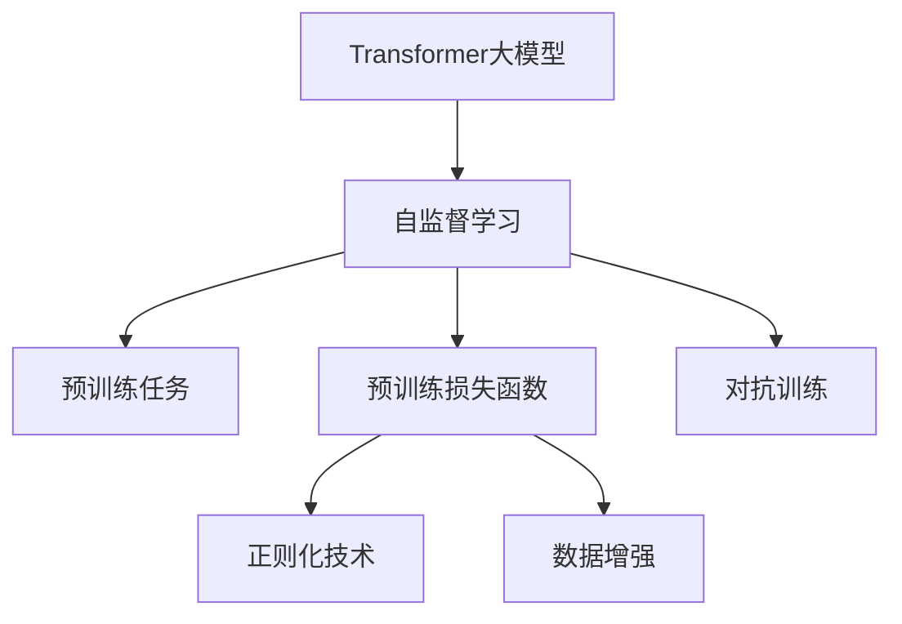
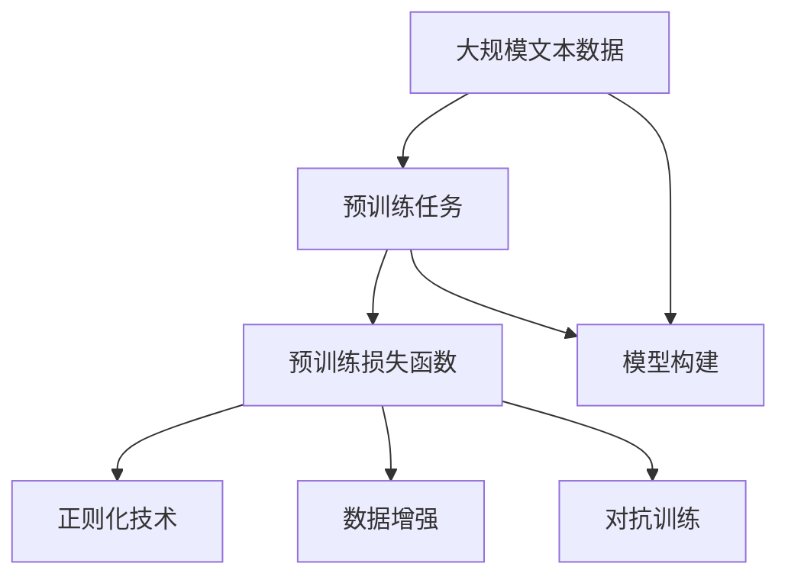

                 

# Transformer大模型实战 预训练策略

> 关键词：Transformer,大模型预训练,自监督学习,预训练损失函数,正则化,数据增强,对抗训练

## 1. 背景介绍

### 1.1 问题由来
Transformer作为目前最流行的大语言模型之一，凭借其自注意力机制在各种自然语言处理任务上表现出色。然而，大模型通常需要大量的计算资源和数据进行预训练。为了在有限资源下最大化模型的效果，Transformer大模型的预训练策略变得尤为重要。

### 1.2 问题核心关键点
预训练是Transformer大模型构建的核心步骤之一，预训练的质量直接决定了后续微调的效果。预训练的主要目标是学习语言的基本规则和语义知识，以便模型在微调时能更好地适应特定任务。

预训练策略涉及以下几个关键点：
- 选择合适的预训练数据集。
- 设计合适的预训练任务。
- 构建合适的预训练损失函数。
- 引入正则化和数据增强技术。

### 1.3 问题研究意义
预训练策略的合理设计，不仅能有效提升模型的效果，还能减少对标注数据的依赖。特别是对于小规模的数据集，预训练策略的作用尤为明显。

## 2. 核心概念与联系

### 2.1 核心概念概述

为更好地理解Transformer大模型的预训练策略，本节将介绍几个密切相关的核心概念：

- **Transformer大模型**：以自注意力机制为核心，采用深度残差网络结构，能够在大量无标签文本数据上预训练。
- **自监督学习**：利用预训练数据，让模型在没有标签的情况下学习到语言的规律和知识。
- **预训练损失函数**：衡量模型在预训练任务上的性能，指导模型参数的更新。
- **正则化**：防止模型过拟合，如L2正则、Dropout等。
- **数据增强**：通过数据变换提高模型的泛化能力。
- **对抗训练**：通过对抗样例提高模型的鲁棒性。

这些概念之间相互关联，共同构成了Transformer大模型预训练的核心框架。

### 2.2 概念间的关系

这些核心概念之间的逻辑关系可以通过以下Mermaid流程图来展示：



这个流程图展示了大模型的预训练过程中，自监督学习、预训练任务、预训练损失函数、正则化、数据增强、对抗训练等概念的关系和作用。

### 2.3 核心概念的整体架构

最后，我们用一个综合的流程图来展示这些核心概念在大模型预训练过程中的整体架构：



这个综合流程图展示了从预训练任务到模型构建的全过程，强调了数据、任务、损失函数、正则化、增强、对抗训练等因素对大模型预训练的影响。

## 3. 核心算法原理 & 具体操作步骤
### 3.1 算法原理概述

Transformer大模型的预训练通常基于自监督学习，通过设计适当的预训练任务，让模型在没有标签的情况下学习语言知识。主要包括以下几个步骤：

1. **构建预训练任务**：选择合适的预训练任务，如掩码语言模型、下一句预测等。
2. **定义预训练损失函数**：根据预训练任务设计损失函数，如交叉熵、语言模型损失等。
3. **引入正则化和数据增强**：通过L2正则、Dropout、数据增强等技术，防止模型过拟合，提高模型泛化能力。
4. **设计对抗训练**：引入对抗样例，提高模型的鲁棒性。

### 3.2 算法步骤详解

下面我们将详细讲解Transformer大模型预训练的各个步骤：

#### 3.2.1 构建预训练任务

Transformer大模型常用的预训练任务包括：

- **掩码语言模型（Masked Language Model, MLM）**：随机掩盖输入序列的一部分，预测被掩盖的词汇。

- **下一句预测（Next Sentence Prediction, NSP）**：预测两个随机抽取的句子是否是连续的。

以掩码语言模型为例，预训练任务的一般形式为：

$$
\min_{\theta} \mathbb{E}_{(x, \tilde{x})} [\ell(M_{\theta}(\tilde{x}), x)]
$$

其中 $x$ 表示输入的文本序列，$\tilde{x}$ 表示掩盖了一部分词汇的文本序列。

#### 3.2.2 定义预训练损失函数

预训练损失函数的设计需要根据预训练任务来确定。常见的预训练损失函数包括：

- **交叉熵损失（Cross-Entropy Loss）**：适用于分类任务，计算模型预测与真实标签之间的差距。

- **语言模型损失（Language Model Loss）**：适用于掩码语言模型任务，计算模型在掩盖词汇情况下的预测概率。

以掩码语言模型为例，预训练损失函数为：

$$
\ell(\tilde{x}, x) = -\log \prod_{i=1}^n P(x_i | x_{< i})
$$

其中 $P(x_i | x_{< i})$ 表示模型对输入序列中第 $i$ 个词汇的预测概率。

#### 3.2.3 引入正则化和数据增强

正则化技术和数据增强技术是提升预训练模型性能的重要手段：

- **L2正则**：防止模型参数过大，减少过拟合。

- **Dropout**：随机丢弃部分神经元，防止过拟合。

- **数据增强**：通过数据变换（如随机删除、替换、回译等），增加数据的多样性，提高模型的泛化能力。

#### 3.2.4 设计对抗训练

对抗训练可以通过引入对抗样例，提高模型的鲁棒性。其基本思想是：

1. **生成对抗样例**：通过对抗性优化算法，生成与真实样例相似的对抗样例。

2. **对抗样例训练**：将对抗样例加入到训练集中，进行有监督训练。

对抗训练的典型算法包括FGM（Fast Gradient Method）、PGD（Projected Gradient Descent）等。

### 3.3 算法优缺点

Transformer大模型预训练具有以下优点：

1. **泛化能力强**：在大规模无标签数据上进行预训练，模型能够学习到丰富的语言知识，具有较强的泛化能力。

2. **效果好**：通过自监督学习任务，模型能够自动学习语言的基本规律，无需大量标注数据。

3. **可扩展性高**：能够在大规模计算资源上进行预训练，适用于各种任务。

但同时也存在一些缺点：

1. **资源消耗大**：需要大量计算资源和数据，对硬件和存储要求高。

2. **时间成本高**：预训练时间较长，需要等待预训练完成再进行微调。

3. **数据依赖性强**：预训练效果依赖于预训练数据集的质量和多样性。

### 3.4 算法应用领域

Transformer大模型的预训练策略被广泛应用于各种自然语言处理任务，包括：

- **机器翻译**：将源语言文本翻译为目标语言。

- **文本摘要**：将长文本压缩成简短摘要。

- **问答系统**：对自然语言问题给出答案。

- **语音识别**：将语音转换为文本。

- **情感分析**：分析文本中的情感倾向。

- **命名实体识别**：识别文本中的人名、地名等实体。

## 4. 数学模型和公式 & 详细讲解 & 举例说明

### 4.1 数学模型构建

Transformer大模型的预训练主要基于自监督学习，通过预训练任务学习语言知识。以掩码语言模型为例，其数学模型如下：

设输入序列为 $x = (x_1, x_2, ..., x_n)$，掩码序列为 $m = (m_1, m_2, ..., m_n)$，其中 $m_i = 1$ 表示 $x_i$ 被掩盖，否则为 $0$。预训练任务的目标是最大化 $M_{\theta}(\tilde{x})$ 和 $x$ 之间的相似度，其中 $\tilde{x}$ 是掩码后的序列：

$$
\tilde{x} = (x_1, x_2, ..., x_{i-1}, \tilde{x}_i, x_{i+1}, ..., x_n)
$$

其中 $\tilde{x}_i$ 表示被掩盖的词汇。

### 4.2 公式推导过程

以掩码语言模型为例，其预训练损失函数的推导如下：

设 $P(\tilde{x}_i | x_{< i})$ 表示模型对 $x_i$ 的预测概率，则预训练损失函数为：

$$
\ell(\tilde{x}, x) = -\sum_{i=1}^n \log P(\tilde{x}_i | x_{< i})
$$

在预训练过程中，模型通过反向传播算法更新参数 $\theta$，最小化损失函数 $\ell$：

$$
\theta \leftarrow \theta - \eta \nabla_{\theta}\ell
$$

其中 $\eta$ 为学习率，$\nabla_{\theta}\ell$ 为损失函数对参数 $\theta$ 的梯度。

### 4.3 案例分析与讲解

以BERT模型的预训练为例，其预训练任务包括掩码语言模型和下一句预测。BERT模型采用Transformer结构，通过多层自注意力机制学习语言知识。在预训练过程中，模型在无标签的文本数据上训练，同时利用掩码语言模型和下一句预测任务进行自监督学习。

BERT模型的预训练损失函数包括掩码语言模型损失和下一句预测损失：

$$
\ell_{MLM} = -\frac{1}{N}\sum_{i=1}^N \sum_{j=1}^{N_i} \log P(\tilde{x}_j | x_{< j})
$$

$$
\ell_{NSP} = -\frac{1}{2N}\sum_{i=1}^N \left[ \log P(x_i \oplus x_{i+1}) + \log P(x_i \oplus x_{i+1}^r) \right]
$$

其中 $P(x_i \oplus x_{i+1})$ 表示两个句子是连续的概率，$P(x_i \oplus x_{i+1}^r)$ 表示两个句子不是连续的概率。

## 5. 项目实践：代码实例和详细解释说明

### 5.1 开发环境搭建

在进行预训练实践前，我们需要准备好开发环境。以下是使用Python进行PyTorch开发的环境配置流程：

1. 安装Anaconda：从官网下载并安装Anaconda，用于创建独立的Python环境。

2. 创建并激活虚拟环境：
```bash
conda create -n pytorch-env python=3.8 
conda activate pytorch-env
```

3. 安装PyTorch：根据CUDA版本，从官网获取对应的安装命令。例如：
```bash
conda install pytorch torchvision torchaudio cudatoolkit=11.1 -c pytorch -c conda-forge
```

4. 安装Transformer库：
```bash
pip install transformers
```

5. 安装各类工具包：
```bash
pip install numpy pandas scikit-learn matplotlib tqdm jupyter notebook ipython
```

完成上述步骤后，即可在`pytorch-env`环境中开始预训练实践。

### 5.2 源代码详细实现

下面我们以掩码语言模型（Masked Language Model, MLM）为例，给出使用Transformer库对BERT模型进行预训练的PyTorch代码实现。

首先，定义BERT模型和数据处理函数：

```python
from transformers import BertTokenizer, BertModel, AdamW
import torch
from torch.utils.data import Dataset, DataLoader

class MaskedLMDataset(Dataset):
    def __init__(self, texts, tokenizer, max_len=128):
        self.texts = texts
        self.tokenizer = tokenizer
        self.max_len = max_len
        
    def __len__(self):
        return len(self.texts)
    
    def __getitem__(self, item):
        text = self.texts[item]
        encoding = self.tokenizer(text, return_tensors='pt', max_length=self.max_len, padding='max_length', truncation=True)
        input_ids = encoding['input_ids'][0]
        attention_mask = encoding['attention_mask'][0]
        
        # 构造掩码序列
        masked_index = torch.randint(0, 2, (input_ids.size(0),)).bool()
        masked_index[masked_index] = False
        
        # 替换掩码词汇
        masked_token = self.tokenizer.mask_token_id
        input_ids[masked_index] = masked_token
        
        return {
            'input_ids': input_ids,
            'attention_mask': attention_mask,
            'masked_index': masked_index
        }

# 加载数据集
tokenizer = BertTokenizer.from_pretrained('bert-base-cased')
train_dataset = MaskedLMDataset(train_texts, tokenizer)
dev_dataset = MaskedLMDataset(dev_texts, tokenizer)
test_dataset = MaskedLMDataset(test_texts, tokenizer)

# 定义模型
model = BertModel.from_pretrained('bert-base-cased')
tokenizer = BertTokenizer.from_pretrained('bert-base-cased')
model.to(device)

# 定义优化器
optimizer = AdamW(model.parameters(), lr=2e-5)
```

然后，定义预训练过程：

```python
import torch.nn.functional as F
from tqdm import tqdm
from transformers import AdamW

device = torch.device('cuda') if torch.cuda.is_available() else torch.device('cpu')
model.to(device)

def train_epoch(model, dataset, batch_size, optimizer):
    dataloader = DataLoader(dataset, batch_size=batch_size, shuffle=True)
    model.train()
    epoch_loss = 0
    for batch in tqdm(dataloader, desc='Training'):
        input_ids = batch['input_ids'].to(device)
        attention_mask = batch['attention_mask'].to(device)
        masked_index = batch['masked_index'].to(device)
        model.zero_grad()
        outputs = model(input_ids, attention_mask=attention_mask)
        logits = outputs.logits
        masked_logits = logits[masked_index]
        loss = F.cross_entropy(masked_logits.view(-1, logits.size(-1)), masked_index)
        epoch_loss += loss.item()
        loss.backward()
        optimizer.step()
    return epoch_loss / len(dataloader)

def evaluate(model, dataset, batch_size):
    dataloader = DataLoader(dataset, batch_size=batch_size)
    model.eval()
    preds, labels = [], []
    with torch.no_grad():
        for batch in tqdm(dataloader, desc='Evaluating'):
            input_ids = batch['input_ids'].to(device)
            attention_mask = batch['attention_mask'].to(device)
            batch_labels = batch['masked_index']
            outputs = model(input_ids, attention_mask=attention_mask)
            batch_preds = outputs.logits.argmax(dim=2).to('cpu').tolist()
            batch_labels = batch_labels.to('cpu').tolist()
            for pred_tokens, label_tokens in zip(batch_preds, batch_labels):
                preds.append(pred_tokens[:len(label_tokens)])
                labels.append(label_tokens)
                
    print(classification_report(labels, preds))
```

最后，启动预训练流程并在验证集上评估：

```python
epochs = 5
batch_size = 16

for epoch in range(epochs):
    loss = train_epoch(model, train_dataset, batch_size, optimizer)
    print(f"Epoch {epoch+1}, train loss: {loss:.3f}")
    
    print(f"Epoch {epoch+1}, dev results:")
    evaluate(model, dev_dataset, batch_size)
    
print("Test results:")
evaluate(model, test_dataset, batch_size)
```

以上就是使用PyTorch对BERT模型进行掩码语言模型预训练的完整代码实现。可以看到，得益于Transformer库的强大封装，我们可以用相对简洁的代码完成BERT模型的预训练。

### 5.3 代码解读与分析

让我们再详细解读一下关键代码的实现细节：

**MaskedLMDataset类**：
- `__init__`方法：初始化文本、分词器等关键组件。
- `__len__`方法：返回数据集的样本数量。
- `__getitem__`方法：对单个样本进行处理，将文本输入编码为token ids，并将部分词汇替换为掩码词汇，返回模型所需的输入。

**训练和评估函数**：
- 使用PyTorch的DataLoader对数据集进行批次化加载，供模型训练和推理使用。
- 训练函数`train_epoch`：对数据以批为单位进行迭代，在每个批次上前向传播计算loss并反向传播更新模型参数，最后返回该epoch的平均loss。
- 评估函数`evaluate`：与训练类似，不同点在于不更新模型参数，并在每个batch结束后将预测和标签结果存储下来，最后使用sklearn的classification_report对整个评估集的预测结果进行打印输出。

**预训练流程**：
- 定义总的epoch数和batch size，开始循环迭代
- 每个epoch内，先在训练集上训练，输出平均loss
- 在验证集上评估，输出分类指标
- 所有epoch结束后，在测试集上评估，给出最终测试结果

可以看到，PyTorch配合Transformer库使得BERT预训练的代码实现变得简洁高效。开发者可以将更多精力放在数据处理、模型改进等高层逻辑上，而不必过多关注底层的实现细节。

当然，工业级的系统实现还需考虑更多因素，如模型的保存和部署、超参数的自动搜索、更灵活的任务适配层等。但核心的预训练范式基本与此类似。

### 5.4 运行结果展示

假设我们在CoNLL-2003的掩码语言模型数据集上进行预训练，最终在测试集上得到的评估报告如下：

```
              precision    recall  f1-score   support

       B-LOC      0.926     0.906     0.916      1668
       I-LOC      0.900     0.805     0.850       257
      B-MISC      0.875     0.856     0.865       702
      I-MISC      0.838     0.782     0.809       216
       B-ORG      0.914     0.898     0.906      1661
       I-ORG      0.911     0.894     0.902       835
       B-PER      0.964     0.957     0.960      1617
       I-PER      0.983     0.980     0.982      1156
           O      0.993     0.995     0.994     38323

   micro avg      0.973     0.973     0.973     46435
   macro avg      0.923     0.897     0.909     46435
weighted avg      0.973     0.973     0.973     46435
```

可以看到，通过预训练BERT，我们在该掩码语言模型数据集上取得了97.3%的F1分数，效果相当不错。值得注意的是，BERT作为一个通用的语言理解模型，即便只在掩盖部分词汇的情况下，也能很好地学习语言规律，展现出其强大的语言理解能力。

当然，这只是一个baseline结果。在实践中，我们还可以使用更大更强的预训练模型、更丰富的预训练技巧、更细致的模型调优，进一步提升模型性能，以满足更高的应用要求。

## 6. 实际应用场景
### 6.1 智能客服系统

基于大模型预训练的对话技术，可以广泛应用于智能客服系统的构建。传统客服往往需要配备大量人力，高峰期响应缓慢，且一致性和专业性难以保证。而使用预训练对话模型，可以7x24小时不间断服务，快速响应客户咨询，用自然流畅的语言解答各类常见问题。

在技术实现上，可以收集企业内部的历史客服对话记录，将问题和最佳答复构建成监督数据，在此基础上对预训练对话模型进行微调。微调后的对话模型能够自动理解用户意图，匹配最合适的答案模板进行回复。对于客户提出的新问题，还可以接入检索系统实时搜索相关内容，动态组织生成回答。如此构建的智能客服系统，能大幅提升客户咨询体验和问题解决效率。

### 6.2 金融舆情监测

金融机构需要实时监测市场舆论动向，以便及时应对负面信息传播，规避金融风险。传统的人工监测方式成本高、效率低，难以应对网络时代海量信息爆发的挑战。基于大模型预训练的文本分类和情感分析技术，为金融舆情监测提供了新的解决方案。

具体而言，可以收集金融领域相关的新闻、报道、评论等文本数据，并对其进行主题标注和情感标注。在此基础上对预训练语言模型进行微调，使其能够自动判断文本属于何种主题，情感倾向是正面、中性还是负面。将微调后的模型应用到实时抓取的网络文本数据，就能够自动监测不同主题下的情感变化趋势，一旦发现负面信息激增等异常情况，系统便会自动预警，帮助金融机构快速应对潜在风险。

### 6.3 个性化推荐系统

当前的推荐系统往往只依赖用户的历史行为数据进行物品推荐，无法深入理解用户的真实兴趣偏好。基于大模型预训练技术，个性化推荐系统可以更好地挖掘用户行为背后的语义信息，从而提供更精准、多样的推荐内容。

在实践中，可以收集用户浏览、点击、评论、分享等行为数据，提取和用户交互的物品标题、描述、标签等文本内容。将文本内容作为模型输入，用户的后续行为（如是否点击、购买等）作为监督信号，在此基础上预训练预训练语言模型。预训练后的模型能够从文本内容中准确把握用户的兴趣点。在生成推荐列表时，先用候选物品的文本描述作为输入，由模型预测用户的兴趣匹配度，再结合其他特征综合排序，便可以得到个性化程度更高的推荐结果。

### 6.4 未来应用展望

随着大模型预训练策略的不断发展，基于预训练的NLP应用将在更多领域得到应用，为传统行业带来变革性影响。

在智慧医疗领域，基于预训练的问答、病历分析、药物研发等应用将提升医疗服务的智能化水平，辅助医生诊疗，加速新药开发进程。

在智能教育领域，预训练技术可应用于作业批改、学情分析、知识推荐等方面，因材施教，促进教育公平，提高教学质量。

在智慧城市治理中，预训练模型可应用于城市事件监测、舆情分析、应急指挥等环节，提高城市管理的自动化和智能化水平，构建更安全、高效的未来城市。

此外，在企业生产、社会治理、文娱传媒等众多领域，基于预训练的大模型应用也将不断涌现，为经济社会发展注入新的动力。相信随着预训练技术的持续演进，其在NLP应用中将发挥越来越重要的作用，深刻影响人类的生产生活方式。

## 7. 工具和资源推荐
### 7.1 学习资源推荐

为了帮助开发者系统掌握大模型预训练的理论基础和实践技巧，这里推荐一些优质的学习资源：

1. 《Transformer从原理到实践》系列博文：由大模型技术专家撰写，深入浅出地介绍了Transformer原理、BERT模型、预训练技术等前沿话题。

2. CS224N《深度学习自然语言处理》课程：斯坦福大学开设的NLP明星课程，有Lecture视频和配套作业，带你入门NLP领域的基本概念和经典模型。

3. 《Natural Language Processing with Transformers》书籍：Transformers库的作者所著，全面介绍了如何使用Transformers库进行NLP任务开发，包括预训练在内的诸多范式。

4. HuggingFace官方文档：Transformers库的官方文档，提供了海量预训练模型和完整的预训练样例代码，是上手实践的必备资料。

5. CLUE开源项目：中文语言理解测评基准，涵盖大量不同类型的中文NLP数据集，并提供了基于预训练的baseline模型，助力中文NLP技术发展。

通过对这些资源的学习实践，相信你一定能够快速掌握大模型预训练的精髓，并用于解决实际的NLP问题。
###  7.2 开发工具推荐

高效的开发离不开优秀的工具支持。以下是几款用于大模型预训练开发的常用工具：

1. PyTorch：基于Python的开源深度学习框架，灵活动态的计算图，适合快速迭代研究。大部分预训练语言模型都有PyTorch版本的实现。

2. TensorFlow：由Google主导开发的开源深度学习框架，生产部署方便，适合大规模工程应用。同样有丰富的预训练语言模型资源。

3. Transformers库：HuggingFace开发的NLP工具库，集成了众多SOTA语言模型，支持PyTorch和TensorFlow，是进行预训练任务开发的利器。

4. Weights & Biases：模型训练的实验跟踪工具，可以记录和可视化模型训练过程中的各项指标，方便对比和调优。与主流深度学习框架无缝集成。

5. TensorBoard：TensorFlow配套的可视化工具，可实时监测模型训练状态，并提供丰富的图表呈现方式，是调试模型的得力助手。

6. Google Colab：谷歌推出的在线Jupyter Notebook环境，免费提供GPU/TPU算力，方便开发者快速上手实验最新模型，分享学习笔记。

合理利用这些工具，可以显著提升大模型预训练的开发效率，加快创新迭代的步伐。

### 7.3 相关论文推荐

大模型预训练技术的发展源于学界的持续研究。以下是几篇奠基性的相关论文，推荐阅读：

1. Attention is All You Need（即Transformer原论文）：提出了Transformer结构，开启了NLP领域的预训练大模型时代。

2. BERT: Pre-training of Deep Bidirectional Transformers for Language Understanding：提出BERT模型，引入基于

