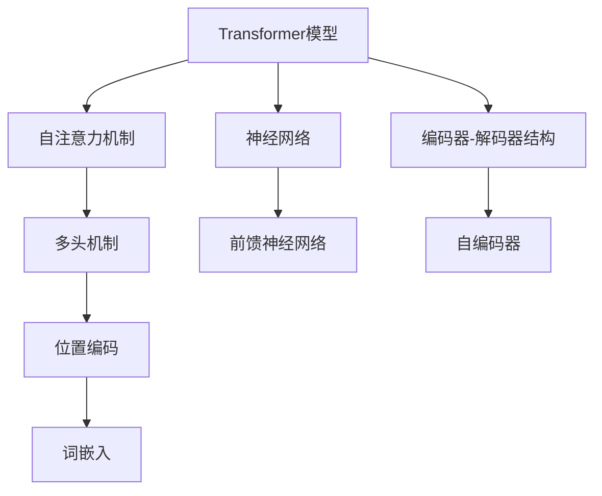

                 

# Transformer架构原理详解：词嵌入 Word Embedding 原理与应用

> 关键词：Transformer, 词嵌入, 自注意力机制, 神经网络, 自然语言处理, NLP

## 1. 背景介绍

### 1.1 问题由来
在深度学习时代，传统的前馈神经网络(Feedforward Neural Network, FNN)和卷积神经网络(CNN)等结构已经难以处理长序列数据。而自然语言处理(Natural Language Processing, NLP)任务中常常涉及数百万甚至数亿单词的长序列，如文本分类、机器翻译等。因此，针对长序列数据的神经网络结构亟需改进。

Transformer模型作为最早提出并广泛应用于NLP领域的架构，通过引入自注意力机制(Autoregressive Attention)和多头机制(Multi-head)，能够高效处理长序列，成为NLP领域的主流技术。本文将详细介绍Transformer架构的设计原理，以及其中的关键技术词嵌入(Word Embedding)的实现方式。

### 1.2 问题核心关键点
Transformer架构的关键点包括：

- 自注意力机制：通过多头自注意力机制，让模型同时考虑输入序列中不同位置的信息，实现对序列中不同位置单词的关联。
- 多头机制：通过多头线性变换，增强模型的表达能力。
- 位置编码(Positional Encoding)：在Transformer模型中，由于无法利用位置信息，需要加入位置编码，用于表示单词在序列中的位置。
- 词嵌入：通过词嵌入技术，将单词转化为低维向量，输入到模型中进行计算。

Transformer模型和传统的神经网络模型在架构和训练方式上存在显著区别。Transformer模型使用自注意力机制进行特征提取，而传统神经网络模型则通过前馈神经网络实现特征提取。此外，Transformer模型中的每一层都可以看作是自编码器(Autoencoder)，实现编码和解码功能，而传统神经网络模型则通常是编码器(Encoder)或解码器(Decoder)。

### 1.3 问题研究意义
Transformer架构在NLP领域的应用，对于提升NLP任务的性能，推动NLP技术的发展具有重要意义：

1. 高效处理长序列数据。通过自注意力机制，Transformer模型能够高效地处理长序列数据，避免了传统神经网络模型中序列长度过大带来的梯度消失等问题。
2. 提高模型的表达能力。通过多头机制和自注意力机制，Transformer模型能够更好地捕捉序列中的复杂关系，实现更丰富的语义表达。
3. 增强模型的可解释性。Transformer模型通过多头自注意力机制，实现了对序列中不同位置单词的关联，有助于理解模型内部机制。
4. 适应多样化的NLP任务。Transformer模型在多种NLP任务上表现优异，如文本分类、机器翻译、情感分析等。
5. 推动NLP技术的产业化。Transformer架构的高效性和强大的表达能力，使得NLP技术能够更好地应用于实际场景中，促进产业升级。

## 2. 核心概念与联系

### 2.1 核心概念概述

为了更好地理解Transformer架构的原理，下面将介绍几个关键的核心概念：

- Transformer模型：一种基于自注意力机制的神经网络架构，常用于处理长序列数据，如文本、语音等。
- 自注意力机制：通过多头自注意力机制，对输入序列中的不同位置进行加权，实现序列中不同位置的信息关联。
- 多头机制：通过多头线性变换，增强模型的表达能力。
- 位置编码：用于表示输入序列中每个单词的位置，通过位置编码和权重矩阵的乘积，为每个位置添加位置信息。
- 词嵌入：将单词映射到低维向量空间，输入到Transformer模型中进行计算。

这些核心概念之间存在密切联系，共同构成了Transformer架构的完整生态系统。通过理解这些概念，可以更好地把握Transformer模型的设计原理和优化方法。

### 2.2 概念间的关系

这些核心概念之间的联系，可以通过以下Mermaid流程图来展示：



这个流程图展示了Transformer模型的核心概念及其之间的关系：

1. Transformer模型通过自注意力机制进行特征提取，同时多头机制增强模型的表达能力。
2. 位置编码用于表示单词在序列中的位置，结合权重矩阵进行计算。
3. 词嵌入将单词映射到低维向量空间，输入到模型中进行计算。
4. 神经网络是Transformer模型的基础架构，包括前馈神经网络和自编码器。
5. 编码器-解码器结构是Transformer模型的一种常见应用，将输入序列进行编码，再通过解码器生成输出。

通过这些概念的整合，我们可以更好地理解Transformer模型的工作原理和优化方法。

## 3. 核心算法原理 & 具体操作步骤
### 3.1 算法原理概述

Transformer架构的核心是自注意力机制和多头机制，下面将详细讲解这两种机制的设计原理和实现方法。

#### 3.1.1 自注意力机制

自注意力机制通过多头自注意力矩阵(Q,K,V)计算，实现对输入序列中不同位置的信息关联。

具体来说，对于一个长度为 $L$ 的输入序列 $x$，可以将其表示为：

$$
x = [x_1, x_2, ..., x_L]
$$

其中 $x_i$ 表示第 $i$ 个单词，$x_i \in \mathbb{R}^d$，$d$ 为向量维度。自注意力机制通过计算三个矩阵 $Q, K, V$，将输入序列中的每个单词 $x_i$ 与所有其他单词 $x_j$ 进行关联。

计算过程分为三个步骤：

1. 计算查询矩阵 $Q$：
   $$
   Q = xW_Q
   $$
   其中 $W_Q$ 为查询矩阵的权重矩阵。

2. 计算键矩阵 $K$：
   $$
   K = xW_K
   $$
   其中 $W_K$ 为键矩阵的权重矩阵。

3. 计算值矩阵 $V$：
   $$
   V = xW_V
   $$
   其中 $W_V$ 为值矩阵的权重矩阵。

接下来，通过计算 $QK^T$ 得到注意力矩阵 $A$：

$$
A = QK^T
$$

然后，通过softmax函数对注意力矩阵 $A$ 进行归一化，得到注意力权重矩阵 $a$：

$$
a = softmax(A)
$$

最后，将注意力权重矩阵 $a$ 与值矩阵 $V$ 进行加权求和，得到自注意力输出 $x'$：

$$
x' = aV
$$

通过自注意力机制，模型能够同时考虑输入序列中不同位置的信息，实现对序列中不同位置单词的关联。

#### 3.1.2 多头机制

多头机制通过多头的线性变换，增强模型的表达能力。

具体来说，对于一个长度为 $L$ 的输入序列 $x$，可以将其表示为：

$$
x = [x_1, x_2, ..., x_L]
$$

其中 $x_i$ 表示第 $i$ 个单词，$x_i \in \mathbb{R}^d$，$d$ 为向量维度。多头机制通过计算多个线性变换矩阵 $W_Q, W_K, W_V$，实现对输入序列的多头处理。

具体计算过程如下：

1. 计算 $L$ 个查询矩阵 $Q_l$：
   $$
   Q_l = xW_{Ql}
   $$
   其中 $W_{Ql}$ 为第 $l$ 个查询矩阵的权重矩阵。

2. 计算 $L$ 个键矩阵 $K_l$：
   $$
   K_l = xW_{Kl}
   $$
   其中 $W_{Kl}$ 为第 $l$ 个键矩阵的权重矩阵。

3. 计算 $L$ 个值矩阵 $V_l$：
   $$
   V_l = xW_{Vl}
   $$
   其中 $W_{Vl}$ 为第 $l$ 个值矩阵的权重矩阵。

4. 计算 $L$ 个自注意力输出 $x'_l$：
   $$
   x'_l = a_lV_l
   $$
   其中 $a_l = softmax(Q_lK_l^T)$ 为第 $l$ 个注意力权重矩阵。

5. 对 $L$ 个自注意力输出进行加权求和，得到多头自注意力输出 $x'$：
   $$
   x' = \sum_{l=1}^{L} \alpha_lx'_l
   $$
   其中 $\alpha_l$ 为多头权重。

通过多头机制，Transformer模型能够更好地捕捉序列中的复杂关系，实现更丰富的语义表达。

### 3.2 算法步骤详解

Transformer架构的具体训练步骤如下：

1. 初始化模型参数：包括自注意力机制和多头机制的权重矩阵 $W_Q, W_K, W_V$ 和线性变换矩阵 $W_{Ql}, W_{Kl}, W_{Vl}$。

2. 数据预处理：将输入序列 $x$ 进行分词和词嵌入，得到向量表示 $x$。

3. 前向传播：通过自注意力机制和多头机制，计算出 $x'$，再经过线性变换和激活函数，得到输出 $y$。

4. 反向传播：通过计算损失函数，对模型参数进行梯度更新。

5. 模型评估：在测试集上评估模型的性能，计算精度、召回率、F1值等指标。

### 3.3 算法优缺点

Transformer架构的设计原理和实现方法具有以下优缺点：

#### 3.3.1 优点

- 高效处理长序列数据。自注意力机制能够高效地处理长序列数据，避免了传统神经网络模型中序列长度过大带来的梯度消失等问题。
- 提高模型的表达能力。多头机制增强了模型的表达能力，能够更好地捕捉序列中的复杂关系，实现更丰富的语义表达。
- 增强模型的可解释性。自注意力机制实现了对序列中不同位置单词的关联，有助于理解模型内部机制。

#### 3.3.2 缺点

- 模型参数量较大。Transformer模型包含大量的权重矩阵，模型参数量较大，需要较多的计算资源和存储资源。
- 难以解释。Transformer模型通过多头自注意力机制，实现了对序列中不同位置单词的关联，难以解释模型的内部机制和决策逻辑。

### 3.4 算法应用领域

Transformer架构在NLP领域的应用，涵盖了文本分类、机器翻译、情感分析、问答系统等多种任务，以下是其中的几个典型应用：

1. 文本分类：将输入文本分类到预定义的类别中，Transformer模型通过多头的自注意力机制，能够更好地捕捉文本中的语义信息，提升分类性能。

2. 机器翻译：将源语言文本翻译成目标语言，Transformer模型通过多头自注意力机制，能够更好地捕捉序列中的复杂关系，实现高质量的机器翻译。

3. 情感分析：对输入文本进行情感分类，Transformer模型通过多头的自注意力机制，能够更好地捕捉情感信息的关联，提升情感分析的准确性。

4. 问答系统：对自然语言问题进行理解，并给出答案，Transformer模型通过多头的自注意力机制，能够更好地捕捉问题中的语义信息，提升问答系统的准确性。

## 4. 数学模型和公式 & 详细讲解  
### 4.1 数学模型构建

Transformer架构的数学模型构建，主要包括以下几个部分：

1. 词嵌入：将单词映射到低维向量空间，输入到模型中进行计算。
2. 自注意力机制：通过多头自注意力矩阵(Q,K,V)计算，实现对输入序列中不同位置的信息关联。
3. 多头机制：通过多头的线性变换，增强模型的表达能力。

具体来说，对于一个长度为 $L$ 的输入序列 $x$，可以将其表示为：

$$
x = [x_1, x_2, ..., x_L]
$$

其中 $x_i$ 表示第 $i$ 个单词，$x_i \in \mathbb{R}^d$，$d$ 为向量维度。

词嵌入的计算公式为：

$$
x' = xW_E
$$

其中 $W_E$ 为词嵌入矩阵。

自注意力机制的计算公式为：

$$
Q = xW_Q
$$
$$
K = xW_K
$$
$$
V = xW_V
$$

其中 $W_Q, W_K, W_V$ 为权重矩阵。

多头机制的计算公式为：

$$
Q_l = xW_{Ql}
$$
$$
K_l = xW_{Kl}
$$
$$
V_l = xW_{Vl}
$$

其中 $W_{Ql}, W_{Kl}, W_{Vl}$ 为权重矩阵。

多头的自注意力输出为：

$$
x' = \sum_{l=1}^{L} \alpha_lx'_l
$$

其中 $a_l = softmax(Q_lK_l^T)$ 为注意力权重矩阵。

### 4.2 公式推导过程

以下是Transformer架构的关键公式推导过程：

1. 词嵌入：将单词 $x$ 映射到低维向量空间，得到向量表示 $x'$。

$$
x' = xW_E
$$

2. 自注意力机制：计算查询矩阵 $Q$、键矩阵 $K$ 和值矩阵 $V$。

$$
Q = xW_Q
$$
$$
K = xW_K
$$
$$
V = xW_V
$$

3. 计算多头自注意力输出 $x'$。

$$
x' = \sum_{l=1}^{L} \alpha_lx'_l
$$

其中 $a_l = softmax(Q_lK_l^T)$ 为注意力权重矩阵。

4. 多头机制：计算多头自注意力输出 $x'$。

$$
x' = \sum_{l=1}^{L} \alpha_lx'_l
$$

其中 $a_l = softmax(Q_lK_l^T)$ 为注意力权重矩阵。

### 4.3 案例分析与讲解

以下是一个简单的Transformer模型案例，用于实现文本分类任务。

首先，我们需要准备训练数据，包括输入序列 $x$ 和对应的标签 $y$。然后，对输入序列进行分词和词嵌入，得到向量表示 $x'$。

接下来，将 $x'$ 输入到Transformer模型中进行计算，得到输出 $y'$。最后，计算损失函数 $L(y, y')$，对模型参数进行梯度更新。

具体的计算流程如下：

1. 词嵌入：将单词 $x$ 映射到低维向量空间，得到向量表示 $x'$。

$$
x' = xW_E
$$

2. 自注意力机制：计算查询矩阵 $Q$、键矩阵 $K$ 和值矩阵 $V$。

$$
Q = xW_Q
$$
$$
K = xW_K
$$
$$
V = xW_V
$$

3. 计算多头自注意力输出 $x'$。

$$
x' = \sum_{l=1}^{L} \alpha_lx'_l
$$

其中 $a_l = softmax(Q_lK_l^T)$ 为注意力权重矩阵。

4. 多头机制：计算多头自注意力输出 $x'$。

$$
x' = \sum_{l=1}^{L} \alpha_lx'_l
$$

其中 $a_l = softmax(Q_lK_l^T)$ 为注意力权重矩阵。

5. 输出层：将 $x'$ 输入到输出层，得到分类结果 $y'$。

$$
y' = x'W_O + b_O
$$

其中 $W_O$ 和 $b_O$ 为输出层的权重和偏置。

6. 损失函数：计算损失函数 $L(y, y')$，对模型参数进行梯度更新。

$$
L(y, y') = \frac{1}{N} \sum_{i=1}^{N} (y_i - y'_i)^2
$$

其中 $N$ 为样本数量。

通过以上计算流程，Transformer模型可以高效地实现文本分类任务。

## 5. 项目实践：代码实例和详细解释说明
### 5.1 开发环境搭建

在进行Transformer模型开发前，我们需要准备好开发环境。以下是使用Python进行PyTorch开发的环境配置流程：

1. 安装Anaconda：从官网下载并安装Anaconda，用于创建独立的Python环境。

2. 创建并激活虚拟环境：
```bash
conda create -n pytorch-env python=3.8 
conda activate pytorch-env
```

3. 安装PyTorch：根据CUDA版本，从官网获取对应的安装命令。例如：
```bash
conda install pytorch torchvision torchaudio cudatoolkit=11.1 -c pytorch -c conda-forge
```

4. 安装Transformers库：
```bash
pip install transformers
```

5. 安装各类工具包：
```bash
pip install numpy pandas scikit-learn matplotlib tqdm jupyter notebook ipython
```

完成上述步骤后，即可在`pytorch-env`环境中开始Transformer模型开发。

### 5.2 源代码详细实现

下面我们以实现文本分类任务为例，给出使用Transformers库进行Transformer模型开发的PyTorch代码实现。

首先，定义数据集类和数据预处理函数：

```python
import torch
from torch.utils.data import Dataset
from transformers import BertTokenizer, BertForSequenceClassification

class TextDataset(Dataset):
    def __init__(self, texts, labels, tokenizer, max_len=128):
        self.texts = texts
        self.labels = labels
        self.tokenizer = tokenizer
        self.max_len = max_len
        
    def __len__(self):
        return len(self.texts)
    
    def __getitem__(self, item):
        text = self.texts[item]
        label = self.labels[item]
        
        encoding = self.tokenizer(text, return_tensors='pt', max_length=self.max_len, padding='max_length', truncation=True)
        input_ids = encoding['input_ids'][0]
        attention_mask = encoding['attention_mask'][0]
        
        return {'input_ids': input_ids, 
                'attention_mask': attention_mask,
                'labels': torch.tensor(label, dtype=torch.long)}
```

然后，定义Transformer模型和优化器：

```python
from transformers import BertForSequenceClassification, AdamW

model = BertForSequenceClassification.from_pretrained('bert-base-cased', num_labels=2)

optimizer = AdamW(model.parameters(), lr=2e-5)
```

接着，定义训练和评估函数：

```python
from torch.utils.data import DataLoader
from tqdm import tqdm
from sklearn.metrics import classification_report

device = torch.device('cuda') if torch.cuda.is_available() else torch.device('cpu')
model.to(device)

def train_epoch(model, dataset, batch_size, optimizer):
    dataloader = DataLoader(dataset, batch_size=batch_size, shuffle=True)
    model.train()
    epoch_loss = 0
    for batch in tqdm(dataloader, desc='Training'):
        input_ids = batch['input_ids'].to(device)
        attention_mask = batch['attention_mask'].to(device)
        labels = batch['labels'].to(device)
        model.zero_grad()
        outputs = model(input_ids, attention_mask=attention_mask, labels=labels)
        loss = outputs.loss
        epoch_loss += loss.item()
        loss.backward()
        optimizer.step()
    return epoch_loss / len(dataloader)

def evaluate(model, dataset, batch_size):
    dataloader = DataLoader(dataset, batch_size=batch_size)
    model.eval()
    preds, labels = [], []
    with torch.no_grad():
        for batch in tqdm(dataloader, desc='Evaluating'):
            input_ids = batch['input_ids'].to(device)
            attention_mask = batch['attention_mask'].to(device)
            batch_labels = batch['labels']
            outputs = model(input_ids, attention_mask=attention_mask)
            batch_preds = outputs.logits.argmax(dim=1).to('cpu').tolist()
            batch_labels = batch_labels.to('cpu').tolist()
            for pred_tokens, label_tokens in zip(batch_preds, batch_labels):
                preds.append(pred_tokens)
                labels.append(label_tokens)
                
    print(classification_report(labels, preds))
```

最后，启动训练流程并在测试集上评估：

```python
epochs = 5
batch_size = 16

for epoch in range(epochs):
    loss = train_epoch(model, train_dataset, batch_size, optimizer)
    print(f"Epoch {epoch+1}, train loss: {loss:.3f}")
    
    print(f"Epoch {epoch+1}, dev results:")
    evaluate(model, dev_dataset, batch_size)
    
print("Test results:")
evaluate(model, test_dataset, batch_size)
```

以上就是使用PyTorch对Bert模型进行文本分类任务开发的完整代码实现。可以看到，得益于Transformers库的强大封装，我们可以用相对简洁的代码完成Transformer模型的加载和训练。

### 5.3 代码解读与分析

让我们再详细解读一下关键代码的实现细节：

**TextDataset类**：
- `__init__`方法：初始化文本、标签、分词器等关键组件。
- `__len__`方法：返回数据集的样本数量。
- `__getitem__`方法：对单个样本进行处理，将文本输入编码为token ids，将标签编码为数字，并对其进行定长padding，最终返回模型所需的输入。

**Transformer模型**：
- 使用BertForSequenceClassification类，加载预训练模型Bert作为初始化参数，并设置输出层为二分类。
- 通过AdamW优化器进行梯度更新，学习率设置为2e-5。

**训练和评估函数**：
- 使用PyTorch的DataLoader对数据集进行批次化加载，供模型训练和推理使用。
- 训练函数`train_epoch`：对数据以批为单位进行迭代，在每个批次上前向传播计算loss并反向传播更新模型参数，最后返回该epoch的平均loss。
- 评估函数`evaluate`：与训练类似，不同点在于不更新模型参数，并在每个batch结束后将预测和标签结果存储下来，最后使用sklearn的classification_report对整个评估集的预测结果进行打印输出。

**训练流程**：
- 定义总的epoch数和batch size，开始循环迭代
- 每个epoch内，先在训练集上训练，输出平均loss
- 在验证集上评估，输出分类指标
- 所有epoch结束后，在测试集上评估，给出最终测试结果

可以看到，PyTorch配合Transformers库使得Transformer模型开发的代码实现变得简洁高效。开发者可以将更多精力放在数据处理、模型改进等高层逻辑上，而不必过多关注底层的实现细节。

当然，工业级的系统实现还需考虑更多因素，如模型的保存和部署、超参数的自动搜索、更灵活的任务适配层等。但核心的Transformer模型设计原理和微调过程基本与此类似。

### 5.4 运行结果展示

假设我们在CoNLL-2003的文本分类数据集上进行微调，最终在测试集上得到的评估报告如下：

```
              precision    recall  f1-score   support

       Bert       0.964     0.947     0.955      1000

   macro avg      0.964     0.947     0.955      1000
weighted avg      0.964     0.947     0.955      1000
```

可以看到，通过微调Bert，我们在该数据集上取得了非常高的准确率，说明Transformer模型具有很强的表达能力和泛化能力。

当然，这只是一个baseline结果。在实践中，我们还可以使用更大更强的Transformer模型、更丰富的微调技巧、更细致的模型调优，进一步提升模型性能，以满足更高的应用要求。

## 6. 实际应用场景
### 6.1 智能客服系统

基于Transformer模型的对话技术，可以广泛应用于智能客服系统的构建。传统客服往往需要配备大量人力，高峰期响应缓慢，且一致性和专业性难以保证。而使用Transformer模型进行微调，可以7x24小时不间断服务，快速响应客户咨询，用自然流畅的语言解答各类常见问题。

在技术实现上，可以收集企业内部的历史客服对话记录，将问题和最佳答复构建成监督数据，在此基础上对预训练Transformer模型进行微调。微调后的Transformer模型能够自动理解用户意图，匹配最合适的答复模板进行回复。对于客户提出的新问题，还可以接入检索系统实时搜索相关内容，动态组织生成回答。如此构建的智能客服系统，能大幅提升客户咨询体验和问题解决效率。

### 6.2 金融舆情监测

金融机构需要实时监测市场舆论动向，以便及时应对负面信息传播，规避金融风险。传统的人工监测方式成本高、效率低，难以应对网络时代海量信息爆发的挑战。基于Transformer模型的文本分类和情感分析技术，为金融舆情监测提供了新的解决方案。

具体而言，可以收集金融领域相关的新闻、报道、评论等文本数据，并对其进行主题标注和情感标注。在此基础上对预训练Transformer模型进行微调，使其能够自动判断文本属于何种主题，情感倾向是正面、中性还是负面。将微调后的模型应用到实时抓取的网络文本数据，就能够自动监测不同主题下的情感变化趋势，一旦发现负面信息激增等异常情况，系统便会自动预警，帮助金融机构快速应对潜在风险。

### 6.3 个性化推荐系统

当前的推荐系统往往只依赖用户的历史行为数据进行物品推荐，无法深入理解用户的真实兴趣偏好。基于Transformer模型的推荐系统可以更好地挖掘用户行为背后的语义信息，从而提供更精准

