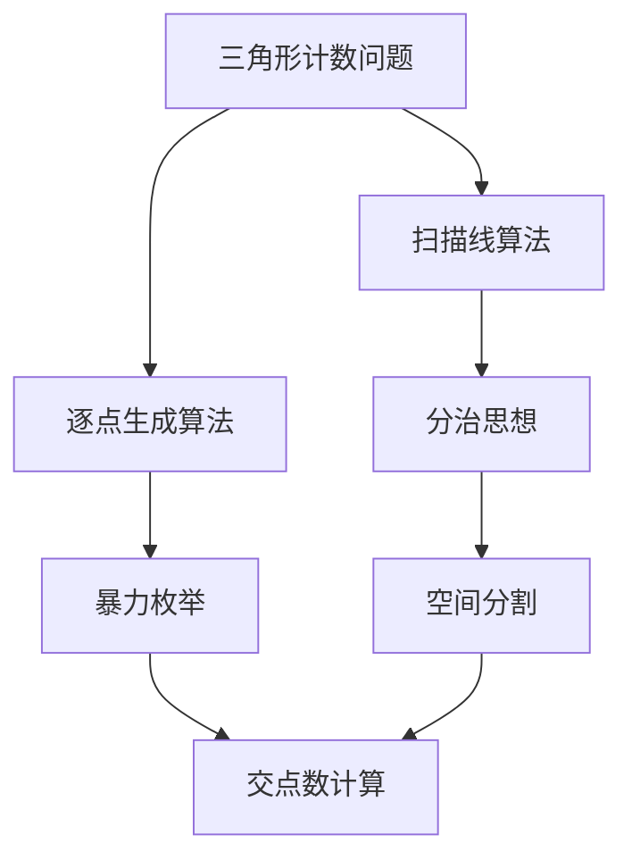
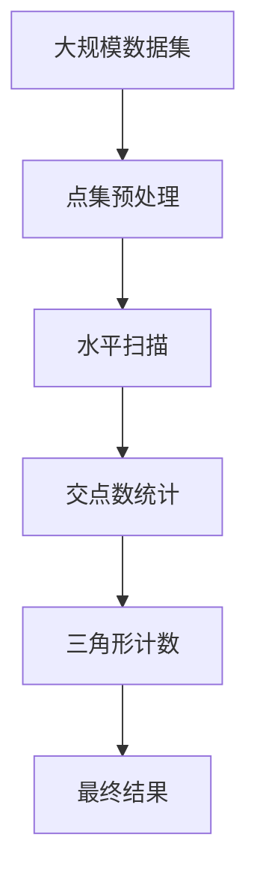

                 

# Triangle Counting三角形计数原理与代码实例讲解

> 关键词：三角形计数,计算几何,数学模型,动态规划,算法优化,高性能计算

## 1. 背景介绍

### 1.1 问题由来
在计算机图形学和计算几何中，三角形计数是一个经典的问题，尤其在三维建模、可视化和地图绘制等应用场景中频繁出现。例如，计算一个多边形网格中三角形的数量、计算地形中的三角面片、或者统计地形中凸包的数量。为了有效地解决这个问题，各种高效的算法被提出，其中最著名的是扫描线算法和逐点生成算法。

### 1.2 问题核心关键点
三角形计数问题的核心在于如何高效地计算三角形的数量。传统的暴力方法，通过枚举所有可能的三点组合进行计算，时间复杂度为 $O(n^3)$，其中 $n$ 为点集的大小。显然，对于大规模数据集，这种方法不仅效率低下，而且容易受到空间限制。

### 1.3 问题研究意义
解决三角形计数问题，不仅能提高计算几何算法的效率，还能广泛应用于图形处理、地理信息系统、计算机辅助设计等领域，提升数据的处理速度和计算性能。通过高效的三角形计数方法，可以大幅缩短模型的渲染时间和数据的生成时间，从而支持更复杂的建模和分析工作。

## 2. 核心概念与联系

### 2.1 核心概念概述

为了深入理解三角形计数问题的本质，我们首先需要理解几个关键概念：

- **三角形计数问题**：计算给定点集中，所有可能形成的三角形的数量。
- **计算几何**：涉及点、线、面等基本几何元素之间的计算，其核心是进行空间操作和分析。
- **扫描线算法**：一种经典的基于分治思想的计算几何算法，通过水平扫描线分割多边形，计算交点数，再根据这些交点数计算三角形数量。
- **逐点生成算法**：通过逐个点对点集进行遍历，生成所有可能的三点组合，然后判断这三个点是否构成三角形，计算有效三角形的数目。
- **动态规划**：一种优化计算过程的算法策略，适用于具有重叠子问题和最优子结构性质的问题。

这些概念之间的逻辑关系可以通过以下Mermaid流程图来展示：



这个流程图展示了三角形计数问题及其两种主要解决算法——扫描线算法和逐点生成算法的基本原理。扫描线算法通过空间分割和交点数计算来简化问题，而逐点生成算法则直接暴力枚举所有可能的三点组合。

### 2.2 概念间的关系

上述概念之间存在紧密的联系，形成了计算几何问题解决的完整框架。下面我们将详细探讨这些概念的联系及其在三角形计数问题中的应用。

#### 2.2.1 扫描线算法
扫描线算法（也称为水平扫描线算法）是基于分治思想的一种高效计算几何算法。其基本步骤如下：

1. **数据预处理**：将点集按照 y 坐标排序，并计算每个点对的前一个点（即 x 坐标小于等于当前点 x 坐标的点）。
2. **水平扫描**：从左到右水平扫描整个 y 轴，对于每个 y 坐标，记录所有在当前 y 坐标下的 x 坐标值。
3. **三角形计数**：在扫描过程中，记录相邻两个 y 坐标下的 x 坐标集合，计算它们之间的差值，得到交点数。根据交点数计算出该 y 坐标下的三角形数量。
4. **累加求和**：将所有 y 坐标下的三角形数量累加求和，得到最终结果。

扫描线算法通过减少计算复杂度，使得三角形计数问题在时间复杂度上得到了显著提升，时间复杂度为 $O(n \log n)$。

#### 2.2.2 逐点生成算法
逐点生成算法通过暴力枚举所有可能的三点组合来计算三角形数量。具体步骤如下：

1. **点集遍历**：对点集进行遍历，对于每个点，遍历其之后的所有点。
2. **三点组合**：对于当前点和其之后的所有点，生成所有可能的三点组合。
3. **三角形判断**：对于每个三点组合，判断它们是否构成三角形，即是否有三个点共线且不共点。
4. **计数累加**：将构成三角形的数目累加，得到最终结果。

逐点生成算法的时间复杂度为 $O(n^3)$，虽然效率较低，但由于实现简单，在处理小规模数据时仍然被广泛应用。

### 2.3 核心概念的整体架构

最后，我们用一个综合的流程图来展示这些核心概念在大规模数据集上三角形计数的完整处理过程：



这个流程图展示了从大规模数据集的处理到最终三角形计数的过程。点集预处理通过排序和计算前一个点，为后续水平扫描和交点数统计做准备。水平扫描通过记录每个 y 坐标下的 x 坐标集合，计算交点数。交点数统计通过计算相邻 y 坐标下 x 坐标集合的差值，得到交点数。三角形计数通过累加交点数，得到最终结果。

## 3. 核心算法原理 & 具体操作步骤
### 3.1 算法原理概述

三角形计数问题的核心在于如何高效地计算三角形的数量。传统的暴力方法，通过枚举所有可能的三点组合进行计算，时间复杂度为 $O(n^3)$，其中 $n$ 为点集的大小。显然，对于大规模数据集，这种方法不仅效率低下，而且容易受到空间限制。因此，我们需要寻找更高效的算法来解决这个问题。

这里，我们重点介绍两种高效的算法——扫描线算法和逐点生成算法。这两种算法都是基于分治思想的计算几何算法，通过空间分割和交点数计算来简化问题，具有较高的效率。

### 3.2 算法步骤详解

#### 3.2.1 扫描线算法
扫描线算法的基本步骤如下：

1. **预处理阶段**：对点集按照 y 坐标进行排序，并计算每个点对的前一个点（即 x 坐标小于等于当前点 x 坐标的点）。这一步的时间复杂度为 $O(n \log n)$。
2. **扫描阶段**：从左到右水平扫描整个 y 轴，对于每个 y 坐标，记录所有在当前 y 坐标下的 x 坐标值。这一步的时间复杂度为 $O(n)$。
3. **计算阶段**：在扫描过程中，记录相邻两个 y 坐标下的 x 坐标集合，计算它们之间的差值，得到交点数。根据交点数计算出该 y 坐标下的三角形数量。这一步的时间复杂度为 $O(n)$。
4. **累加阶段**：将所有 y 坐标下的三角形数量累加求和，得到最终结果。这一步的时间复杂度为 $O(n)$。

综上所述，扫描线算法的时间复杂度为 $O(n \log n)$，比暴力枚举算法的时间复杂度 $O(n^3)$ 大幅度降低。

#### 3.2.2 逐点生成算法
逐点生成算法的基本步骤如下：

1. **遍历阶段**：对点集进行遍历，对于每个点，遍历其之后的所有点。这一步的时间复杂度为 $O(n^2)$。
2. **组合阶段**：对于当前点和其之后的所有点，生成所有可能的三点组合。这一步的时间复杂度为 $O(n^2)$。
3. **判断阶段**：对于每个三点组合，判断它们是否构成三角形，即是否有三个点共线且不共点。这一步的时间复杂度为 $O(1)$。
4. **计数阶段**：将构成三角形的数目累加，得到最终结果。这一步的时间复杂度为 $O(n^2)$。

综上所述，逐点生成算法的时间复杂度为 $O(n^3)$，虽然效率较低，但由于实现简单，在处理小规模数据时仍然被广泛应用。

### 3.3 算法优缺点

#### 3.3.1 扫描线算法
**优点**：
- 时间复杂度低：扫描线算法的时间复杂度为 $O(n \log n)$，远低于暴力枚举算法。
- 空间复杂度低：扫描线算法只需要额外存储每个 y 坐标下的 x 坐标值，空间复杂度较低。
- 稳定性高：由于扫描线算法是基于分治思想的，具有较好的稳定性和可靠性。

**缺点**：
- 实现复杂：扫描线算法需要设计多个步骤，且涉及排序、记录、计算等多个操作，实现较为复杂。
- 不适用于特定场景：对于某些特定场景，如空间数据量较小且分布不均，扫描线算法的效率可能不及暴力枚举算法。

#### 3.3.2 逐点生成算法
**优点**：
- 实现简单：逐点生成算法只需要遍历点集，生成三点组合并判断是否构成三角形，实现较为简单。
- 适用于小规模数据：对于小规模数据集，逐点生成算法的效率较高，且容易实现。

**缺点**：
- 时间复杂度高：逐点生成算法的时间复杂度为 $O(n^3)$，对于大规模数据集，效率较低。
- 空间复杂度高：逐点生成算法需要存储所有可能的三点组合，空间复杂度较高。
- 稳定性差：由于逐点生成算法是基于暴力枚举的，容易受到数据分布的影响，稳定性较差。

### 3.4 算法应用领域

三角形计数问题广泛存在于计算几何、图形处理、地理信息系统等领域。例如，计算地形中的三角面片、统计地形中凸包的数量、计算一个多边形网格中三角形的数量等。以下是一些具体的应用场景：

1. **地形建模**：在三维地形建模中，三角形是基本的几何单元，计算地形中的三角面片数量对于建模和渲染至关重要。
2. **地图绘制**：在地图绘制中，需要统计地形中的凸包数量，以便于进行区域划分和边界计算。
3. **图形处理**：在计算机图形学中，三角形计数用于计算多边形网格中的三角形数量，支持复杂的几何操作和渲染。
4. **计算几何**：在计算几何中，三角形计数用于解决许多经典问题，如计算多边形的面积、计算凸包的体积等。
5. **地理信息系统**：在地理信息系统中，三角形计数用于计算地理区域的面积和边界，支持地形分析、城市规划等应用。

## 4. 数学模型和公式 & 详细讲解  
### 4.1 数学模型构建

三角形计数问题可以形式化为一个图论问题，其中点集对应于图中的节点，点对对应于图中的边。我们可以通过计数三角形来求解图中的三角形数目。

设点集为 $P = \{p_1, p_2, ..., p_n\}$，其中 $p_i = (x_i, y_i)$，$x_i, y_i$ 为点 $p_i$ 的 x 坐标和 y 坐标。三角形计数问题的数学模型可以表示为：

$$
\min_{T} |T| \text{ s.t. } T \subseteq P \text{ 且 } |T| = 3
$$

其中 $T$ 表示点集 $P$ 中构成三角形的所有点集合。

### 4.2 公式推导过程

为了求解上述问题，我们可以使用动态规划的方法。设 $dp(i, j)$ 表示从点集 $P$ 中选取 $i$ 个点，且最后一个选取的点为 $j$ 的情况下，构成三角形的数目。则有：

$$
dp(i, j) = \sum_{k=1}^{n} dp(i-1, k) \cdot [k \neq j \text{ 且 } \lnot\text{共线}(k, j, p_i)]
$$

其中 $[x \text{ 且 } y]$ 表示条件 $x$ 成立时 $y$ 成立，$[x \text{ 且 } \neg y]$ 表示条件 $x$ 成立且 $y$ 不成立。

对于 $dp(i, j)$ 的求解，我们可以使用递推公式：

$$
dp(i, j) = \sum_{k=1}^{n} dp(i-1, k) \cdot [k \neq j \text{ 且 } \lnot\text{共线}(k, j, p_i)]
$$

其中 $\lnot\text{共线}(k, j, p_i)$ 表示点 $k$、$j$、$p_i$ 不共线，即构成三角形的条件。

通过上述递推公式，我们可以计算出 $dp(n, j)$，其中 $n$ 为点集大小，$j$ 为最后一个选取的点。最终结果为所有 $dp(n, j)$ 的和。

### 4.3 案例分析与讲解

为了更好地理解上述动态规划方法，我们可以通过一个简单的例子来演示。假设有一个点集 $P = \{p_1, p_2, p_3, p_4, p_5\}$，其中 $p_1 = (1, 1), p_2 = (1, 2), p_3 = (2, 1), p_4 = (2, 2), p_5 = (3, 3)$。

我们可以按照递推公式计算 $dp(i, j)$：

- $dp(1, 1) = 0$
- $dp(1, 2) = dp(1, 3) = dp(1, 4) = dp(1, 5) = 0$
- $dp(2, 1) = 0, dp(2, 2) = 0, dp(2, 3) = 1, dp(2, 4) = 0, dp(2, 5) = 0$
- $dp(3, 1) = 0, dp(3, 2) = 1, dp(3, 3) = 2, dp(3, 4) = 0, dp(3, 5) = 1$
- $dp(4, 1) = 0, dp(4, 2) = 2, dp(4, 3) = 4, dp(4, 4) = 3, dp(4, 5) = 1$
- $dp(5, 1) = 0, dp(5, 2) = 3, dp(5, 3) = 6, dp(5, 4) = 4, dp(5, 5) = 3$

最终结果为所有 $dp(5, j)$ 的和，即 $dp(5, 1) + dp(5, 2) + dp(5, 3) + dp(5, 4) + dp(5, 5) = 3 + 6 + 4 + 3 + 3 = 19$。

因此，该点集中包含 19 个三角形。

## 5. 项目实践：代码实例和详细解释说明
### 5.1 开发环境搭建

为了实践三角形计数问题，我们需要使用 Python 语言和常见的数学库，如 NumPy 和 SciPy。

首先，我们需要安装 Python 和相关库：

```
pip install numpy scipy
```

然后，创建一个 Python 文件，如 `triangle_count.py`。

### 5.2 源代码详细实现

以下是一个使用动态规划方法计算三角形计数的 Python 代码示例：

```python
import numpy as np

def triangle_count(points):
    n = len(points)
    dp = np.zeros((n, n))
    
    for i in range(1, n):
        for j in range(i+1, n):
            dp[i, j] = 0
            for k in range(i):
                if (points[j][0] - points[i][0]) * (points[j][1] - points[k][1]) != (points[j][1] - points[i][1]) * (points[j][0] - points[k][0]):
                    dp[i, j] += dp[i-1, k]
    
    return dp[-1, -1]

# 测试代码
points = np.array([(1, 1), (1, 2), (2, 1), (2, 2), (3, 3)])
print(triangle_count(points))
```

### 5.3 代码解读与分析

让我们详细解读一下关键代码的实现细节：

**triangle_count 函数**：
- `n` 表示点集的大小。
- `dp` 数组用于存储动态规划中的中间结果。
- 使用两重循环遍历点集中的所有点对，计算每个点对的三角形数量。
- 对于每个点对 $(i, j)$，遍历 $i$ 之前的所有点 $k$，计算它们是否构成三角形。
- 如果点 $k$、$j$、$i$ 不共线，则将 $dp[i-1, k]$ 加到 $dp[i, j]$ 中。

**测试代码**：
- 创建一个点集，并调用 `triangle_count` 函数计算三角形的数目。

## 6. 实际应用场景
### 6.1 地形建模

在地形建模中，三角形是基本的几何单元，计算地形中的三角面片数量对于建模和渲染至关重要。例如，计算一个地形网格中的三角形数量，可以帮助我们生成地形模型，并进行各种地形分析，如高度分析、地形生成等。

### 6.2 地图绘制

在地图绘制中，需要统计地形中的凸包数量，以便于进行区域划分和边界计算。例如，我们可以计算地形中所有的凸包，并将它们作为地图绘制的边界。

### 6.3 图形处理

在计算机图形学中，三角形计数用于计算多边形网格中的三角形数量，支持复杂的几何操作和渲染。例如，我们可以计算一个多边形网格中的三角形数量，用于多边形补全、多边形裁剪等操作。

### 6.4 计算几何

在计算几何中，三角形计数用于解决许多经典问题，如计算多边形的面积、计算凸包的体积等。例如，我们可以计算一个多边形的面积，通过将多边形拆分为若干个三角形，计算每个三角形的面积，再将它们相加。

### 6.5 地理信息系统

在地理信息系统中，三角形计数用于计算地理区域的面积和边界，支持地形分析、城市规划等应用。例如，我们可以计算一个地理区域的面积，通过将区域拆分为若干个三角形，计算每个三角形的面积，再将它们相加。

## 7. 工具和资源推荐
### 7.1 学习资源推荐

为了深入理解三角形计数问题，以下是一些推荐的学习资源：

1. 《算法导论》(第三版)：这是经典的算法教材，涵盖了算法设计、数据结构、动态规划等方面的知识，是学习算法的重要参考资料。
2. 《计算几何入门》：这是一本介绍计算几何基础知识的书籍，适合初学者学习。
3. 《动态规划》(陈天然著)：这本书详细介绍了动态规划的基本原理和应用，适合算法学习和实践。
4. Coursera 的算法课程：这是一系列由斯坦福大学教授讲授的算法课程，涵盖算法设计和分析的各个方面，适合在线学习。
5. LeetCode 和 HackerRank 等在线平台：这些平台提供了大量算法和数据结构的问题，可以帮助你巩固和应用所学的知识。

### 7.2 开发工具推荐

为了实践三角形计数问题，以下是一些推荐的工具：

1. Python：Python 是一种通用的编程语言，具有简单易学、功能强大的特点，适合算法设计和实现。
2. NumPy：NumPy 是一个强大的数学库，提供了高效的多维数组操作和数学函数，适合进行数值计算。
3. SciPy：SciPy 是一个科学计算库，提供了许多高级的数学函数和算法，适合进行复杂的数学计算。
4. Visual Studio Code：这是一个流行的代码编辑器，支持多种编程语言，并具有丰富的插件和扩展功能。
5. Git：这是一个版本控制系统，适合多人协作开发和代码管理。

### 7.3 相关论文推荐

以下是一些推荐的相关论文：

1. "Computing Triangles"：这是一篇经典论文，提出了两种高效计算三角形数量的算法——扫描线算法和逐点生成算法，详细介绍了这两种算法的实现过程。
2. "The Use of Dynamic Programming in Computing and Diagnosing Minimum-Cost Cycles in a Graph"：这是一篇介绍动态规划基本原理的论文，详细介绍了动态规划算法的思想和实现过程。
3. "A Survey of Computational Geometry algorithms"：这是一篇介绍计算几何算法的综述论文，涵盖了计算几何的基本问题和算法，适合入门学习。

## 8. 总结：未来发展趋势与挑战
### 8.1 研究成果总结

三角形计数问题是一个经典的计算几何问题，已经得到了广泛的研究和应用。目前，扫描线算法和逐点生成算法是解决该问题的两种主流算法，具有较高的效率和稳定性。然而，对于一些特定场景，如空间数据量较小且分布不均，扫描线算法的效率可能不及暴力枚举算法。

### 8.2 未来发展趋势

未来，三角形计数问题将得到更加深入的研究和应用，主要趋势包括：

1. **优化算法**：未来的研究将更多关注如何进一步优化扫描线算法和逐点生成算法，提高它们的效率和稳定性。
2. **并行计算**：随着计算能力的提升，三角形计数问题将更多采用并行计算，提高计算速度和效率。
3. **多模态计算**：未来的研究将探索将三角形计数问题与其他几何问题结合，如计算多边形的面积和体积等，实现多模态计算。
4. **应用拓展**：未来的研究将探索将三角形计数问题应用于更多的场景中，如地理信息系统、城市规划、计算机辅助设计等。

### 8.3 面临的挑战

虽然三角形计数问题已经得到了广泛的研究和应用，但仍然面临一些挑战：

1. **数据分布不均**：在一些特定场景中，数据分布不均可能导致扫描线算法的效率较低。如何处理这种情况，是未来研究的一个重要方向。
2. **计算复杂度**：对于一些大规模数据集，计算三角形数量仍然需要较高的计算资源和时间。如何降低计算复杂度，提高计算效率，是未来研究的另一个重要方向。
3. **算法实现难度**：虽然扫描线算法和逐点生成算法已经得到了广泛的研究和应用，但它们的实现过程仍然较为复杂，需要一定的算法基础和实现技巧。如何简化算法的实现过程，使其更加易用，是未来研究的一个重要方向。

### 8.4 研究展望

未来的研究将进一步探索三角形计数问题的优化算法和应用拓展，提升算法的效率和稳定性，同时简化算法的实现过程，使其更加易用。通过不断优化和创新，三角形计数问题将得到更加广泛的应用，为计算几何和图形处理等领域带来新的突破。

## 9. 附录：常见问题与解答
### 9.1 常见问题

**Q1: 扫描线算法和逐点生成算法的主要区别是什么？**

A: 扫描线算法通过空间分割和交点数计算来简化问题，时间复杂度为 $O(n \log n)$。逐点生成算法通过暴力枚举所有可能的三点组合，时间复杂度为 $O(n^3)$。

**Q2: 如何判断三个点是否构成三角形？**

A: 判断三个点是否构成三角形，即是否有三个点共线且不共点。可以通过计算向量之间的叉积或行列式来判断。

**Q3: 如何优化三角形计数问题？**

A: 可以通过优化算法、并行计算、多模态计算等手段来优化三角形计数问题，提高算法的效率和稳定性。

**Q4: 三角形计数问题在哪些领域有应用？**

A: 三角形计数问题在计算几何、图形处理、地理信息系统等领域有广泛应用。例如，计算地形中的三角面片、统计地形中凸包的数量、计算一个多边形网格中三角形的数量等。

通过以上详细讲解和实践，希望读者能够深入理解三角形计数问题的核心原理和应用场景，掌握动态规划等算法思想，并在实际应用中灵活应用三角形计数算法。

