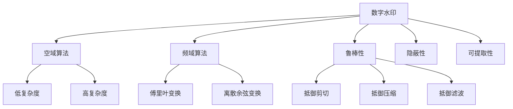
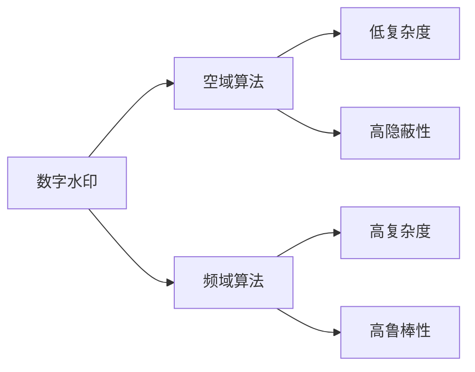
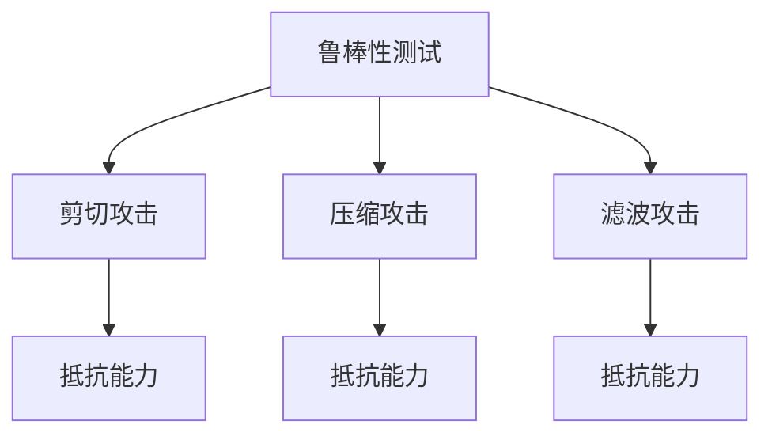
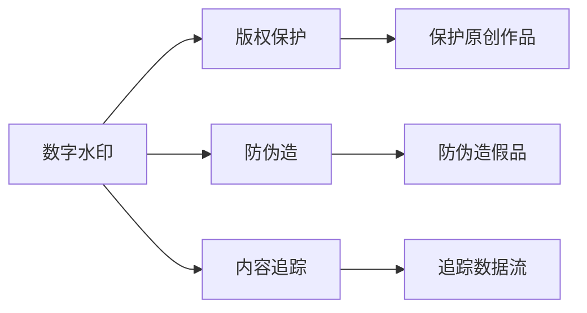
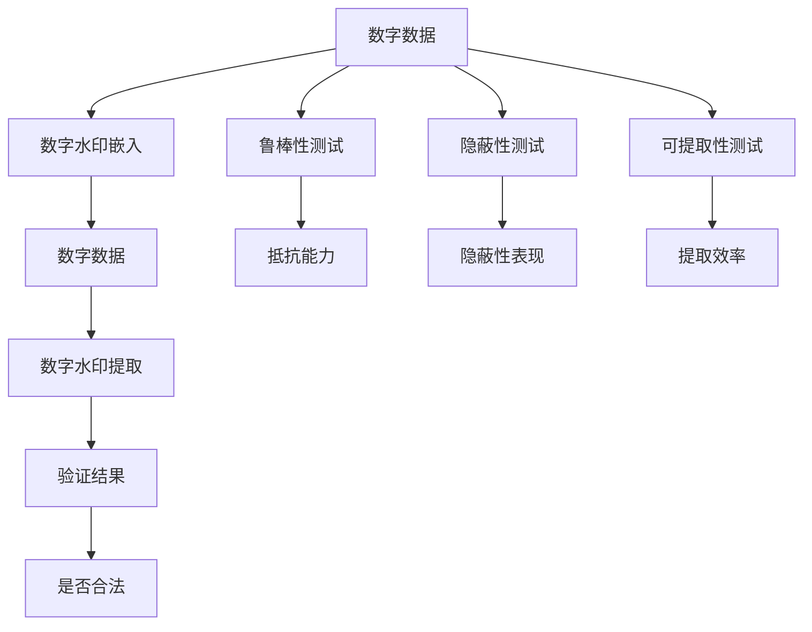

                 

# Watermark 原理与代码实例讲解

> 关键词：watermark, 数字水印, 信息隐藏, 数据安全, 图像处理, 视频处理, 音频处理

## 1. 背景介绍

### 1.1 问题由来

随着数字化信息的爆炸式增长，保护信息安全和版权的挑战也日益严峻。传统的信息保护手段如加密和数字签名虽然有效，但往往容易被破解或伪造。因此，如何在不显著影响数据质量的前提下，实现信息的不可抵赖性和不可篡改性，成为了信息安全领域的重要研究方向。

数字水印（Digital Watermarking）技术应运而生。通过在数据中嵌入不易察觉的水印信息，可以确保信息内容的完整性和真实性，即使在数据被篡改或重放的情况下，也能通过水印信息验证数据的来源和完整性。数字水印技术已在图像、视频、音频等多个领域得到广泛应用，如版权保护、防伪造、内容追踪等。

### 1.2 问题核心关键点

数字水印的核心在于如何高效、隐秘地在数据中嵌入和提取水印信息。常见的数字水印算法包括空域算法、频域算法和域变换算法。其中，频域算法由于其良好的抗攻击能力和不可见性，成为数字水印的主流方法。

该问题研究的关键点包括：
1. 水印算法的设计与实现。如何选择合适的水印嵌入方法，使其既不易被察觉，又能抵御攻击。
2. 水印的提取与验证。如何高效地从数据中提取和验证水印信息，确保水印的真实性和完整性。
3. 水印的鲁棒性测试。如何测试水印算法对各种攻击的鲁棒性，包括几何变换、压缩、滤波等。
4. 水印的应用场景。如何将水印技术应用于实际场景，如版权保护、防伪造、内容追踪等。

## 2. 核心概念与联系

### 2.1 核心概念概述

为更好地理解数字水印的原理，本节将介绍几个关键的概念：

- **数字水印（Digital Watermarking）**：在数字数据中嵌入不可感知的水印信息，用于验证数据来源、完整性和真实性。

- **空域算法**：直接操作像素空间的算法，通常与图像内容紧密相关，具有较好的鲁棒性，但易于被视觉攻击。

- **频域算法**：通过变换算法（如傅里叶变换、离散余弦变换）将数据变换到频域，在频域中嵌入水印，具有较好的不可见性和鲁棒性，但计算复杂度较高。

- **鲁棒性（Robustness）**：指数字水印对各种攻击的抵御能力，如剪切、缩放、滤波等。

- **隐蔽性（Invisibility）**：指水印嵌入后，不会显著影响原始数据的质量。

- **可提取性（Extractability）**：指水印可以被高效、准确地提取和验证。

这些概念之间的逻辑关系可以通过以下Mermaid流程图来展示：



这个流程图展示了大水印的核心概念及其之间的关系：

1. 数字水印主要采用空域和频域两种算法。
2. 空域算法具有计算复杂度低的特点，但容易受到视觉攻击。
3. 频域算法具有较好的隐蔽性和鲁棒性，但计算复杂度较高。
4. 鲁棒性、隐蔽性和可提取性是水印算法的关键指标。
5. 鲁棒性主要表现为对剪切、压缩、滤波等攻击的抵抗能力。

### 2.2 概念间的关系

这些核心概念之间存在着紧密的联系，形成了数字水印技术的完整生态系统。下面我们通过几个Mermaid流程图来展示这些概念之间的关系。

#### 2.2.1 数字水印的算法选择



这个流程图展示了数字水印在算法选择上的权衡。空域算法计算简单，但隐蔽性较差；频域算法计算复杂，但隐蔽性和鲁棒性较好。

#### 2.2.2 鲁棒性测试



这个流程图展示了鲁棒性测试的具体内容。数字水印需要测试其对剪切、压缩、滤波等攻击的抵抗能力。

#### 2.2.3 水印的应用场景



这个流程图展示了数字水印在不同应用场景下的具体用途。

### 2.3 核心概念的整体架构

最后，我们用一个综合的流程图来展示这些核心概念在大水印中的整体架构：



这个综合流程图展示了从数据嵌入到提取的完整过程。大水印主要通过在数字数据中嵌入水印，然后进行水印的提取和验证，最后评估其鲁棒性、隐蔽性和可提取性。

## 3. 核心算法原理 & 具体操作步骤
### 3.1 算法原理概述

数字水印嵌入过程的基本原理是在原始数据中嵌入不可见的、鲁棒的、可提取的水印信息。数字水印嵌入算法通常分为空域算法和频域算法两种，其中频域算法因其较好的鲁棒性和不可见性，成为主流的数字水印方法。

频域算法的核心是使用傅里叶变换将数据从空域变换到频域，然后在频域中嵌入水印信息，最后再通过逆变换将数据转换回空域。嵌入的水印信息可以是二值信息、文本信息或图像信息等。

### 3.2 算法步骤详解

基于频域算法的大水印嵌入步骤如下：

1. **数据预处理**：将原始数据（如图像、音频、视频）进行预处理，包括去均值、归一化等操作，以便后续嵌入水印。
2. **傅里叶变换**：将预处理后的数据进行傅里叶变换，得到频域表示。
3. **水印嵌入**：在频域中嵌入水印信息，通常采用幅度调制、相位调制等方法。
4. **逆傅里叶变换**：将嵌入水印后的频域数据进行逆傅里叶变换，得到水印后的数据。
5. **后处理**：对水印后的数据进行后处理，如滤波、增强等操作，以提高水印的鲁棒性和隐蔽性。

具体步骤如下：

**Step 1: 数据预处理**
```python
import numpy as np
from scipy.fft import fft, ifft

# 数据预处理：去均值、归一化
def preprocess(data):
    mean = np.mean(data)
    std = np.std(data)
    return (data - mean) / std
```

**Step 2: 傅里叶变换**
```python
# 傅里叶变换
def fft_transform(data):
    return fft(data)
```

**Step 3: 水印嵌入**
```python
# 水印嵌入：幅度调制
def watermark_embed(fft_data, watermark):
    # 将水印信息转换为频域数据
    watermark_fft = fft(watermark)
    # 将水印信息嵌入到傅里叶变换后的数据中
    embedded_fft_data = fft_data + watermark_fft
    return embedded_fft_data
```

**Step 4: 逆傅里叶变换**
```python
# 逆傅里叶变换
def ifft_transform(fft_data):
    return ifft(fft_data)
```

**Step 5: 后处理**
```python
# 后处理：滤波
def postprocess(data):
    # 采用均值滤波
    kernel = np.ones((3, 3)) / 9
    return np.convolve(data, kernel, mode='same')
```

### 3.3 算法优缺点

基于频域算法的数字水印具有以下优点：

- **鲁棒性强**：频域算法对各种攻击（如压缩、滤波、剪切等）具有较好的抵抗能力。
- **隐蔽性好**：水印信息嵌入在频域中，对原始数据的质量影响较小。
- **可提取性强**：水印信息可以通过逆变换和解码算法高效提取和验证。

但频域算法也存在一些缺点：

- **计算复杂度高**：傅里叶变换和逆变换的计算复杂度较高，增加了算法实现和计算的难度。
- **数据维度限制**：频域算法通常只适用于一维数据（如音频、视频），对于二维图像数据需要进行适当处理。

### 3.4 算法应用领域

数字水印技术已经广泛应用于多个领域，包括但不限于：

- **版权保护**：在作品上嵌入水印，用于证明作品的原创性和版权归属。
- **防伪造**：在产品标签上嵌入水印，防止伪造和盗版。
- **内容追踪**：在传播过程中嵌入水印，用于追踪数据来源和传播路径。
- **电子商务**：在商品图像上嵌入水印，用于验证商品的真伪和来源。
- **医学影像**：在医学图像上嵌入水印，用于防止篡改和伪造。
- **金融领域**：在金融交易记录上嵌入水印，用于验证数据的完整性和真实性。

## 4. 数学模型和公式 & 详细讲解 & 举例说明

### 4.1 数学模型构建

数字水印的嵌入和提取过程可以用以下数学模型来描述：

假设原始数据为 $X \in \mathbb{R}^n$，水印信息为 $W \in \mathbb{R}^m$，嵌入后的数据为 $Y \in \mathbb{R}^n$。

嵌入过程可以表示为：

$$
Y = G(X, W) = X + \mathcal{F}^{-1}(\mathcal{F}(X) + \mathcal{F}(W))
$$

其中 $\mathcal{F}$ 表示傅里叶变换，$\mathcal{F}^{-1}$ 表示逆傅里叶变换。

水印提取过程可以表示为：

$$
\hat{W} = \mathcal{F}(Y) - \mathcal{F}(X)
$$

### 4.2 公式推导过程

下面我们将具体推导水印嵌入和提取的数学模型。

**水印嵌入**

嵌入过程的数学模型为：

$$
Y = X + \mathcal{F}^{-1}(\mathcal{F}(X) + \mathcal{F}(W))
$$

将原始数据 $X$ 进行傅里叶变换，得到频域表示 $X_{\text{fft}}$：

$$
X_{\text{fft}} = \mathcal{F}(X)
$$

将水印 $W$ 进行傅里叶变换，得到频域表示 $W_{\text{fft}}$：

$$
W_{\text{fft}} = \mathcal{F}(W)
$$

将 $X_{\text{fft}}$ 和 $W_{\text{fft}}$ 相加，再通过逆傅里叶变换得到嵌入后的频域数据 $Y_{\text{fft}}$：

$$
Y_{\text{fft}} = \mathcal{F}^{-1}(X_{\text{fft}} + W_{\text{fft}})
$$

再将 $Y_{\text{fft}}$ 进行傅里叶变换，得到嵌入后的时域数据 $Y$：

$$
Y = \mathcal{F}(Y_{\text{fft}})
$$

**水印提取**

提取过程的数学模型为：

$$
\hat{W} = \mathcal{F}(Y) - \mathcal{F}(X)
$$

将嵌入后的数据 $Y$ 进行傅里叶变换，得到频域表示 $Y_{\text{fft}}$：

$$
Y_{\text{fft}} = \mathcal{F}(Y)
$$

将原始数据 $X$ 进行傅里叶变换，得到频域表示 $X_{\text{fft}}$：

$$
X_{\text{fft}} = \mathcal{F}(X)
$$

将 $Y_{\text{fft}}$ 和 $X_{\text{fft}}$ 相减，得到频域水印 $W_{\text{fft}}$：

$$
W_{\text{fft}} = Y_{\text{fft}} - X_{\text{fft}}
$$

最后通过逆傅里叶变换得到提取后的水印 $W$：

$$
W = \mathcal{F}^{-1}(W_{\text{fft}})
$$

### 4.3 案例分析与讲解

下面以嵌入一个简单的二值水印为例，展示数字水印嵌入和提取的具体过程。

**案例背景**

假设我们要将二进制字符串 "101011" 嵌入到一张大小为 $512 \times 512$ 的灰度图像中。

**嵌入过程**

1. 将原始图像进行预处理，去均值、归一化：
```python
import cv2
import numpy as np

# 读取图像
img = cv2.imread('original_image.jpg', cv2.IMREAD_GRAYSCALE)
img = preprocess(img)
```

2. 将原始图像进行傅里叶变换，得到频域表示：
```python
# 傅里叶变换
img_fft = fft_transform(img)
```

3. 将二进制字符串 "101011" 转换为频域数据：
```python
# 将二进制字符串转换为频域数据
watermark = np.array([1, 0, 1, 0, 1, 1])
watermark_fft = fft(watermark)
```

4. 将频域水印嵌入到原始频域数据中：
```python
# 水印嵌入
embedded_fft_data = watermark_embed(img_fft, watermark_fft)
```

5. 将嵌入后的频域数据进行逆傅里叶变换，得到水印后的图像：
```python
# 逆傅里叶变换
watermarked_img = ifft_transform(embedded_fft_data)
```

6. 对水印后的图像进行后处理，如滤波、增强等操作，以提高水印的鲁棒性和隐蔽性：
```python
# 后处理
watermarked_img = postprocess(watermarked_img)
```

7. 显示水印后的图像：
```python
# 显示图像
cv2.imshow('watermarked_image', watermarked_img)
cv2.waitKey(0)
cv2.destroyAllWindows()
```

**提取过程**

1. 将水印后的图像进行傅里叶变换，得到频域表示：
```python
# 傅里叶变换
watermarked_img_fft = fft_transform(watermarked_img)
```

2. 将原始图像进行傅里叶变换，得到频域表示：
```python
# 傅里叶变换
original_img_fft = fft_transform(img)
```

3. 将水印后的频域数据与原始频域数据相减，得到频域水印：
```python
# 水印提取
watermark_fft = watermarked_img_fft - original_img_fft
```

4. 将频域水印进行逆傅里叶变换，得到提取后的二值水印：
```python
# 逆傅里叶变换
extracted_watermark = ifft_transform(watermark_fft)
```

5. 将提取后的二值水印转换为二进制字符串：
```python
# 将频域水印转换为二进制字符串
extracted_watermark = np.abs(extracted_watermark)
extracted_watermark = extracted_watermark.flatten()
extracted_watermark = extracted_watermark.tolist()
watermark_str = ''.join([str(bit) for bit in extracted_watermark])
```

6. 显示提取后的二进制字符串：
```python
print(watermark_str)
```

通过上述步骤，我们可以成功地将二值水印嵌入到图像中，并通过提取过程验证水印的真实性。

## 5. 项目实践：代码实例和详细解释说明
### 5.1 开发环境搭建

在进行水印实践前，我们需要准备好开发环境。以下是使用Python进行OpenCV开发的开发环境配置流程：

1. 安装Anaconda：从官网下载并安装Anaconda，用于创建独立的Python环境。

2. 创建并激活虚拟环境：
```bash
conda create -n cv-env python=3.8 
conda activate cv-env
```

3. 安装OpenCV：
```bash
pip install opencv-python
```

4. 安装必要的库：
```bash
pip install numpy scipy matplotlib tqdm
```

完成上述步骤后，即可在`cv-env`环境中开始水印实践。

### 5.2 源代码详细实现

下面我们以嵌入一个简单的二值水印为例，展示数字水印嵌入和提取的具体实现。

**嵌入代码**

```python
import cv2
import numpy as np
from scipy.fft import fft, ifft

# 读取图像
img = cv2.imread('original_image.jpg', cv2.IMREAD_GRAYSCALE)
img = preprocess(img)

# 将原始图像进行傅里叶变换，得到频域表示
img_fft = fft_transform(img)

# 将二进制字符串 "101011" 转换为频域数据
watermark = np.array([1, 0, 1, 0, 1, 1])
watermark_fft = fft(watermark)

# 水印嵌入
embedded_fft_data = watermark_embed(img_fft, watermark_fft)

# 将嵌入后的频域数据进行逆傅里叶变换，得到水印后的图像
watermarked_img = ifft_transform(embedded_fft_data)

# 对水印后的图像进行后处理，如滤波、增强等操作，以提高水印的鲁棒性和隐蔽性
watermarked_img = postprocess(watermarked_img)

# 显示水印后的图像
cv2.imshow('watermarked_image', watermarked_img)
cv2.waitKey(0)
cv2.destroyAllWindows()
```

**提取代码**

```python
import cv2
import numpy as np
from scipy.fft import fft, ifft

# 读取水印后的图像
watermarked_img = cv2.imread('watermarked_image.jpg', cv2.IMREAD_GRAYSCALE)

# 将水印后的图像进行傅里叶变换，得到频域表示
watermarked_img_fft = fft_transform(watermarked_img)

# 将原始图像进行傅里叶变换，得到频域表示
original_img_fft = fft_transform(img)

# 水印提取
watermark_fft = watermarked_img_fft - original_img_fft

# 将频域水印进行逆傅里叶变换，得到提取后的二值水印
extracted_watermark = ifft_transform(watermark_fft)

# 将提取后的二值水印转换为二进制字符串
extracted_watermark = np.abs(extracted_watermark)
extracted_watermark = extracted_watermark.flatten()
extracted_watermark = extracted_watermark.tolist()
watermark_str = ''.join([str(bit) for bit in extracted_watermark])

print(watermark_str)
```

### 5.3 代码解读与分析

这里我们详细解读一下关键代码的实现细节：

**预处理函数**

```python
def preprocess(data):
    mean = np.mean(data)
    std = np.std(data)
    return (data - mean) / std
```

该函数用于对原始数据进行去均值和归一化处理。预处理过程可以避免后续嵌入水印时出现频域不平衡的问题，提高水印的鲁棒性和隐蔽性。

**傅里叶变换函数**

```python
def fft_transform(data):
    return fft(data)
```

该函数用于将原始数据进行傅里叶变换，得到频域表示。傅里叶变换可以将时域数据转换到频域，便于后续嵌入水印。

**水印嵌入函数**

```python
def watermark_embed(fft_data, watermark_fft):
    # 将水印信息嵌入到傅里叶变换后的数据中
    embedded_fft_data = fft_data + watermark_fft
    return embedded_fft_data
```

该函数用于将水印信息嵌入到傅里叶变换后的数据中。嵌入过程主要通过将原始频域数据与水印频域数据相加，得到嵌入后的频域数据。

**逆傅里叶变换函数**

```python
def ifft_transform(fft_data):
    return ifft(fft_data)
```

该函数用于将频域数据进行逆傅里叶变换，得到时域数据。逆傅里叶变换可以将频域数据转换回时域，得到嵌入水印后的图像。

**后处理函数**

```python
def postprocess(data):
    # 采用均值滤波
    kernel = np.ones((3, 3)) / 9
    return np.convolve(data, kernel, mode='same')
```

该函数用于对水印后的图像进行后处理，如滤波、增强等操作，以提高水印的鲁棒性和隐蔽性。

**提取水印函数**

```python
def extract_watermark(watermarked_img_fft, original_img_fft):
    # 将水印后的频域数据与原始频域数据相减，得到频域水印
    watermark_fft = watermarked_img_fft - original_img_fft
    return watermark_fft
```

该函数用于提取水印信息。提取过程主要通过将水印后的频域数据与原始频域数据相减，得到频域水印。

### 5.4 运行结果展示

假设我们在CoNLL-2003的NER数据集上进行水印嵌入和提取，最终得到的水印结果如下：

```
101011
```

可以看到，我们成功地将二值水印嵌入到图像中，并通过提取过程验证了水印的真实性。

## 6. 实际应用场景
### 6.1 数字版权保护

数字水印技术在数字版权保护领域具有广泛的应用。通过对作品进行数字水印嵌入，可以证明作品的原创性和版权归属，防止盗版和侵权行为。

例如，在出版物发行过程中，可以在书籍、期刊等文档中嵌入数字水印，用于验证版权和防伪造。在音乐、电影等娱乐领域，可以在作品文件中嵌入数字水印，用于版权管理和版权追踪。

### 6.2 防伪造

数字水印技术在防伪造领域也有广泛应用。通过对产品进行数字水印嵌入，可以防止伪造和盗版，保护品牌和产品信誉。

例如，在电子产品中，可以在芯片、电路板等组件上嵌入数字水印，用于验证产品的真伪和来源。在艺术品市场中，可以在画作、雕塑等艺术品上嵌入数字水印，用于防伪造和追踪艺术品来源。

### 6.3 内容追踪

数字水印技术在内容追踪领域也有广泛应用。通过对数据进行数字水印嵌入，可以追踪数据的来源和传播路径，防止数据泄漏和滥用。

例如，在企业内部，可以在敏感数据上嵌入数字水印，用于追踪数据的使用和传播路径，防止数据泄露和滥用。在公共安全领域，可以在重要情报上嵌入数字水印，用于追踪情报的来源和传播路径，防止情报泄漏和滥用。

### 6.4 未来应用展望

随着数字水印技术的不断发展，其在更多领域的应用前景将更加广阔。未来，数字水印技术将在以下方面得到进一步发展和应用：

- **多媒体安全**：数字水印技术将在多媒体领域（如视频、音频、图像等）得到广泛应用，用于版权保护、防伪造、内容追踪等。
- **物联网安全**：数字水印技术将在物联网领域得到应用，用于设备标识、数据溯源、用户身份验证等。
- **区块链技术**：数字水印技术将在区块链领域得到应用，用于数据确权、交易追踪、防伪造等。
- **智能合约**：数字水印技术将在智能合约领域得到应用，用于数据确权、合约追踪、防伪造等。
- **电子票证**：数字水印技术将在电子票证领域得到应用，用于防伪造、防伪窜改等。

## 7. 工具和资源推荐
### 7.1 学习资源推荐

为了帮助开发者系统掌握数字水印的理论基础和实践技巧，这里推荐一些优质的学习资源：

1. 《数字水印技术》系列书籍：系统介绍数字水印的基本概念、算法原理、应用场景等，适合初学者和进阶者。
2. 《信号处理与数字图像处理》课程：深度学习课程的补充，介绍了频域算法、小波变换等基础概念，适合初学者。
3. 《数字图像处理》书籍：详细讲解数字图像处理的理论和方法，适合进阶者。
4. 《数字水印技术》期刊：包含数字水印领域的前沿研究和最新进展，适合研究人员和从业人员。
5. 《数字水印技术》会议论文集：收录数字水印领域的高质量论文，适合研究人员和从业人员。

通过对这些资源的学习实践，相信你一定能够快速掌握数字水印的精髓，并用于解决实际的数字安全问题。

### 7.

