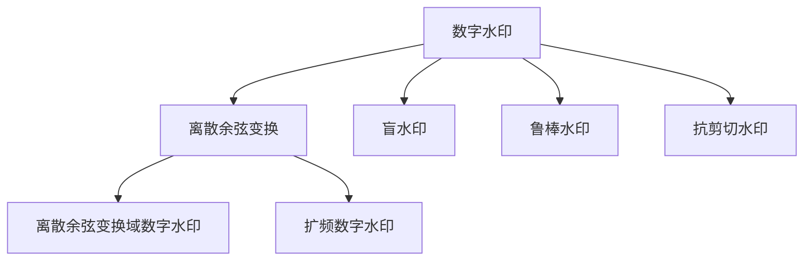
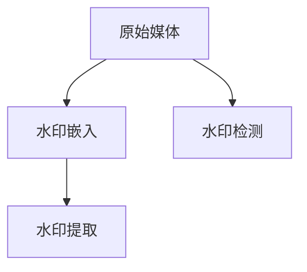
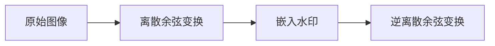
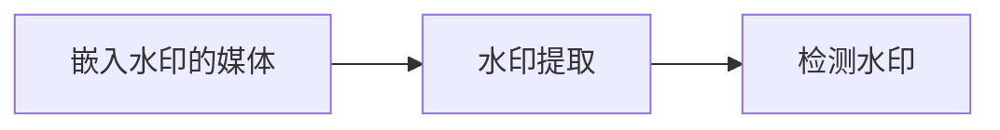
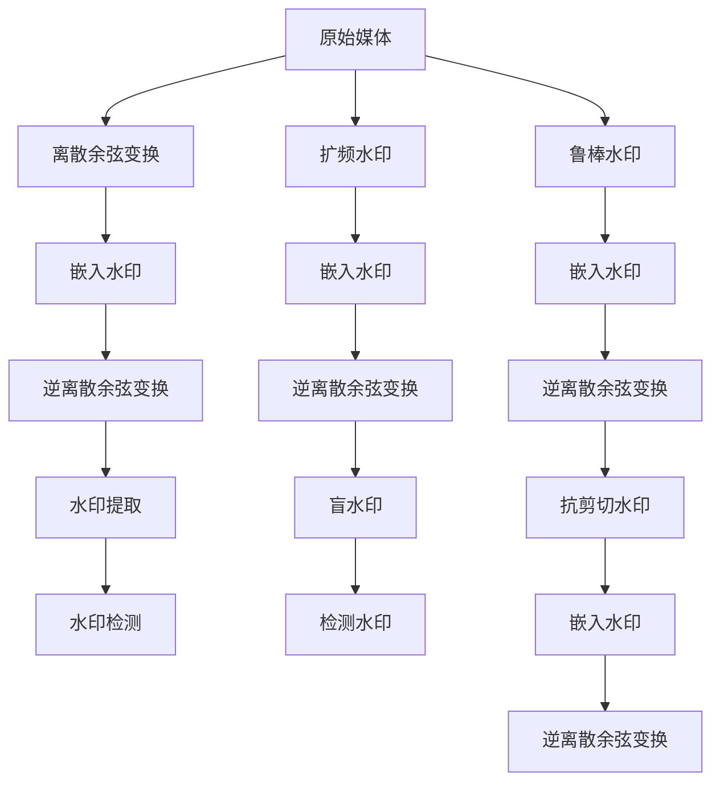

                 

# Watermark 原理与代码实例讲解

> 关键词：Watermark, 数字水印, 信息隐藏, 信息安全, 图像处理, 音频处理, 计算机视觉

## 1. 背景介绍

在当今数字化信息时代，数据的获取和传输日益频繁，随之而来的是信息的泄露和盗用风险不断增加。如何保护数字内容的版权、隐私和安全，成为了信息安全领域的重要课题。数字水印（Digital Watermarking）技术应运而生，通过在数字媒体中嵌入隐秘信息，达到信息保护和认证的目的。本文将深入探讨数字水印的原理与实现，并给出代码实例讲解。

### 1.1 问题由来
随着互联网技术的普及和多媒体内容的爆炸式增长，数字内容（如图像、音频、视频等）的版权保护和隐私保护问题变得愈发严峻。传统的水印技术（如版权标识、DigiCert）在保护内容真实性和完整性方面存在局限性，无法满足数字时代的要求。数字水印技术通过在数字媒体中嵌入不可感知、鲁棒且抗攻击的水印信息，成为一种强有力的信息安全手段。

### 1.2 问题核心关键点
数字水印的核心在于如何平衡水印的鲁棒性、不可感知性和安全性。鲁棒性指水印在经过处理（如压缩、剪切、旋转等）后仍能被有效检测和提取；不可感知性要求水印对原内容影响尽可能小；安全性则指水印难以被恶意篡改和移除。目前，数字水印主要分为可见水印和不可见水印，不可见水印又可以细分为空间域和频域两类。

本文主要关注频域数字水印技术，尤其是基于离散余弦变换（DCT）的离散余弦变换域数字水印（DCT Watermarking）。DCT水印具有良好的鲁棒性和不可感知性，广泛应用于图像、音频等领域。

### 1.3 问题研究意义
研究数字水印技术，对于保护数字内容的版权和隐私、维护网络安全具有重要意义：

1. 版权保护：数字水印可以记录内容的创建者、制作时间等信息，用于版权追溯和维权。
2. 隐私保护：数字水印可以嵌入识别信息，用于个人隐私认证和防泄漏。
3. 内容认证：数字水印可以验证内容的真实性和完整性，防止篡改和伪造。
4. 鲁棒性：数字水印可以承受各种攻击，确保内容在传输和存储过程中的安全性。

## 2. 核心概念与联系

### 2.1 核心概念概述

为了更好地理解数字水印技术，本节将介绍几个密切相关的核心概念：

- **数字水印（Digital Watermarking）**：在数字媒体中嵌入不可见、鲁棒且抗攻击的隐秘信息，用于版权保护、隐私认证、内容认证等。
- **离散余弦变换（Discrete Cosine Transform, DCT）**：一种常用的正交变换，用于将时域信号转换为频域信号，广泛应用于图像和音频处理。
- **离散余弦变换域数字水印（DCT Watermarking）**：在频域上嵌入水印，利用DCT变换的频域系数进行水印嵌入和提取，具有良好的鲁棒性和不可感知性。
- **扩频数字水印（Spread Spectrum Watermarking）**：通过在频域上均匀分布水印能量，提高水印的抗攻击能力。
- **盲水印（Blind Watermarking）**：不需要原始媒体就能检测和提取水印，提高了水印的实用性和安全性。
- **鲁棒水印（Robust Watermarking）**：能够在各种攻击下保持完整性和可检测性，提高了水印的可靠性和适用性。
- **抗剪切水印（Watermarking against Cut and Paste Attack）**：在水印嵌入和提取过程中，抵御剪切、复制等攻击，确保水印的安全性。

这些核心概念之间的逻辑关系可以通过以下Mermaid流程图来展示：



这个流程图展示了大水印技术的核心概念及其之间的关系：

1. 数字水印通过各种变换方法（如DCT）嵌入隐秘信息。
2. DCT水印利用频域上的系数进行水印嵌入和提取。
3. 扩频水印通过在频域上均匀分布能量，增强水印的鲁棒性。
4. 盲水印不需要原始媒体就能检测和提取水印，提升其实用性。
5. 鲁棒水印在各种攻击下保持完整性和可检测性，增强其可靠性。
6. 抗剪切水印在剪切攻击下仍能保持水印的完整性和安全性。

### 2.2 概念间的关系

这些核心概念之间存在着紧密的联系，形成了数字水印技术的完整生态系统。下面我通过几个Mermaid流程图来展示这些概念之间的关系。

#### 2.2.1 数字水印的实现流程



这个流程图展示了数字水印的实现流程：原始媒体中嵌入水印，提取水印信息，检测水印是否完整有效。

#### 2.2.2 DCT水印的具体实现



这个流程图展示了DCT水印的具体实现流程：将原始图像进行DCT变换，在频域上嵌入水印，再通过逆DCT变换恢复图像。

#### 2.2.3 盲水印的检测流程



这个流程图展示了盲水印的检测流程：在不知道原始媒体的情况下，直接通过水印提取信息，检测水印是否存在。

### 2.3 核心概念的整体架构

最后，我们用一个综合的流程图来展示这些核心概念在大水印技术中的整体架构：



这个综合流程图展示了从原始媒体到水印嵌入、提取、检测的完整过程。大水印技术通过DCT、扩频、盲水印、鲁棒水印等方法，提高水印的鲁棒性和安全性，确保水印在各种攻击下仍能保持完整性和可检测性。

## 3. 核心算法原理 & 具体操作步骤
### 3.1 算法原理概述

离散余弦变换域数字水印（DCT Watermarking）的核心在于通过DCT变换，将原始图像的频域系数作为水印嵌入位置。具体来说，DCT水印的嵌入和提取流程如下：

1. **水印嵌入**：将水印信息（如文本、图像等）转换为二进制序列，按照一定的规则嵌入到原始图像的频域系数中。
2. **水印提取**：对嵌入水印的图像进行DCT变换，提取出频域系数，再根据水印嵌入规则检测水印信息。
3. **水印检测**：通过比较提取出的水印信息和原始水印信息，判断水印的完整性。

### 3.2 算法步骤详解

下面以图像水印为例，详细介绍DCT水印的嵌入和提取步骤。

#### 3.2.1 水印嵌入

1. **图像预处理**：对原始图像进行预处理，包括去噪、归一化等操作，提高水印嵌入的鲁棒性。
2. **DCT变换**：对预处理后的图像进行DCT变换，得到频域系数矩阵。
3. **水印编码**：将水印信息转换为二进制序列，按位嵌入到频域系数矩阵中。例如，将二进制位“1”嵌入到低频系数中，将“0”嵌入到高频系数中。
4. **逆DCT变换**：对嵌入水印的频域系数矩阵进行逆DCT变换，恢复出带有水印的图像。

#### 3.2.2 水印提取

1. **DCT变换**：对带有水印的图像进行DCT变换，得到频域系数矩阵。
2. **水印解码**：从频域系数矩阵中提取出二进制序列，根据水印嵌入规则解码出原始水印信息。
3. **逆DCT变换**：对提取出的二进制序列进行逆DCT变换，得到水印图像。

#### 3.2.3 水印检测

1. **计算峰值信噪比（PSNR）**：计算水印嵌入前后图像的PSNR值，评估水印的嵌入效果。
2. **检测水印信息**：根据解码出的二进制序列，判断水印的完整性，计算水印检测错误率（WER）。
3. **验证水印完整性**：通过比较解码出的水印信息和原始水印信息，验证水印的完整性和正确性。

### 3.3 算法优缺点

DCT水印的优点在于：

1. **鲁棒性**：DCT变换后的频域系数具有较好的鲁棒性，能够在各种攻击下保持水印的完整性。
2. **不可感知性**：嵌入水印后，原始图像的视觉质量影响较小，保证水印的不可感知性。
3. **可扩展性**：水印信息可以是文本、图像等多种形式，适应性强。

DCT水印的缺点在于：

1. **计算复杂度高**：DCT变换和逆变换的计算复杂度较高，对实时性要求较高的应用场景可能不适用。
2. **易受攻击**：虽然具有较好的鲁棒性，但在高对比度、低分辨率等情况下的抗攻击能力有待提升。
3. **嵌入容量有限**：嵌入的水印信息长度受频域系数数量限制，难以嵌入大量信息。

### 3.4 算法应用领域

DCT水印技术广泛应用于图像、音频、视频等多个领域，具体应用包括：

1. **版权保护**：嵌入版权信息，用于版权追溯和维权。
2. **隐私保护**：嵌入识别信息，用于个人隐私认证和防泄漏。
3. **内容认证**：嵌入内容认证信息，用于验证内容的真实性和完整性。
4. **图像识别**：嵌入特征信息，提高图像识别的准确性和鲁棒性。
5. **音频水印**：嵌入音频水印，用于音频内容的认证和追踪。
6. **视频监控**：嵌入视频水印，用于视频内容的认证和追踪。

## 4. 数学模型和公式 & 详细讲解 & 举例说明
### 4.1 数学模型构建

离散余弦变换域数字水印的数学模型如下：

设原始图像为 $I$，尺寸为 $M\times N$，DCT变换后的频域系数矩阵为 $D$，水印信息为 $W$，嵌入强度为 $\alpha$，嵌入规则为 $R$，嵌入位置为 $P$。水印嵌入和提取过程的数学模型如下：

1. **水印嵌入**：
$$
D = I^{'} \cdot D^{'} \\
W \cdot R = \alpha \cdot (D_{P_1} \oplus D_{P_2}) \\
D^{'} = D \cdot \alpha \cdot (D_{P_1} \oplus D_{P_2})
$$

其中，$I^{'}$ 和 $D^{'}$ 分别表示预处理和逆DCT变换后的图像和频域系数矩阵，$P_1$ 和 $P_2$ 分别表示水印嵌入的高频和低频位置，$\oplus$ 表示异或运算。

2. **水印提取**：
$$
D_{watermarked} = D \cdot \alpha \cdot (D_{P_1} \oplus D_{P_2}) \\
W_{extracted} = \alpha \cdot (D_{watermarked}_{P_1} \oplus D_{watermarked}_{P_2}) \oplus W
$$

其中，$D_{watermarked}$ 表示嵌入水印的频域系数矩阵，$W_{extracted}$ 表示提取出的水印信息。

3. **水印检测**：
$$
PSNR = \frac{\sum_{i=1}^{M}\sum_{j=1}^{N}(I - I_{watermarked})^2}{M \times N} \\
WER = \frac{\sum_{i=1}^{M}\sum_{j=1}^{N}(W_{original} - W_{extracted})^2}{M \times N}
$$

其中，$I_{watermarked}$ 表示嵌入水印后的图像，$W_{original}$ 表示原始水印信息，$PSNR$ 表示水印嵌入后图像的峰值信噪比，$WER$ 表示水印检测错误率。

### 4.2 公式推导过程

以图像水印嵌入为例，假设原始图像 $I$ 的DCT变换后的频域系数矩阵为 $D$，水印信息 $W$ 的二进制编码为 $W_{binary}$，嵌入强度为 $\alpha$，嵌入规则为 $R$，嵌入位置为 $P$。

1. **预处理**：
$$
I^{'} = I \cdot \frac{1}{\sigma_{I}^2}
$$
其中，$\sigma_{I}^2$ 表示图像的方差，用于归一化处理。

2. **DCT变换**：
$$
D^{'} = I^{'} \cdot D
$$

3. **水印嵌入**：
$$
W_{binary} = W \cdot R \\
D_{P_1} = D \cdot (W_{binary} \cdot \alpha) \\
D^{'} = D \cdot \alpha \cdot (D_{P_1} \oplus D_{P_2})
$$

其中，$D_{P_1}$ 表示嵌入水印的低频频域系数，$D_{P_2}$ 表示嵌入水印的高频频域系数。

4. **逆DCT变换**：
$$
I_{watermarked} = D^{'} \cdot I^{'}
$$

5. **水印提取**：
$$
D_{watermarked} = I_{watermarked} \cdot \frac{1}{\sigma_{I_{watermarked}}^2} \cdot D \\
W_{extracted} = \alpha \cdot (D_{watermarked}_{P_1} \oplus D_{watermarked}_{P_2}) \oplus W
$$

其中，$D_{watermarked}$ 表示嵌入水印的频域系数矩阵，$W_{extracted}$ 表示提取出的水印信息。

6. **水印检测**：
$$
PSNR = \frac{\sum_{i=1}^{M}\sum_{j=1}^{N}(I - I_{watermarked})^2}{M \times N} \\
WER = \frac{\sum_{i=1}^{M}\sum_{j=1}^{N}(W_{original} - W_{extracted})^2}{M \times N}
$$

其中，$PSNR$ 表示水印嵌入后图像的峰值信噪比，$WER$ 表示水印检测错误率。

### 4.3 案例分析与讲解

假设我们要在一张尺寸为 $256 \times 256$ 的图像上嵌入长度为 $128$ 的二进制水印，嵌入强度为 $\alpha=0.1$，嵌入规则为将“1”嵌入低频系数，“0”嵌入高频系数。嵌入位置选择为 $P_1 = (32, 32)$ 和 $P_2 = (128, 128)$。

1. **预处理**：对原始图像 $I$ 进行归一化处理，得到 $I^{'}$。

2. **DCT变换**：对 $I^{'}$ 进行DCT变换，得到 $D^{'}$。

3. **水印嵌入**：将长度为 $128$ 的二进制水印 $W_{binary}$ 转换为低频和高频频域系数 $D_{P_1}$ 和 $D_{P_2}$，嵌入强度为 $\alpha=0.1$。

4. **逆DCT变换**：对嵌入水印的频域系数矩阵 $D^{'}$ 进行逆DCT变换，得到嵌入水印后的图像 $I_{watermarked}$。

5. **水印提取**：对嵌入水印的图像 $I_{watermarked}$ 进行DCT变换，提取出频域系数矩阵 $D_{watermarked}$，解码出提取出的水印信息 $W_{extracted}$。

6. **水印检测**：计算提取出的水印信息 $W_{extracted}$ 与原始水印信息 $W_{original}$ 的PSNR值和WER值，评估水印嵌入效果。

## 5. 项目实践：代码实例和详细解释说明
### 5.1 开发环境搭建

在进行DCT水印实践前，我们需要准备好开发环境。以下是使用Python进行OpenCV和PyTorch开发的环境配置流程：

1. 安装Anaconda：从官网下载并安装Anaconda，用于创建独立的Python环境。

2. 创建并激活虚拟环境：
```bash
conda create -n dct-watermark python=3.8 
conda activate dct-watermark
```

3. 安装OpenCV：
```bash
pip install opencv-python
```

4. 安装PyTorch：根据CUDA版本，从官网获取对应的安装命令。例如：
```bash
conda install pytorch torchvision torchaudio cudatoolkit=11.1 -c pytorch -c conda-forge
```

5. 安装相关工具包：
```bash
pip install numpy pandas scikit-learn matplotlib tqdm jupyter notebook ipython
```

完成上述步骤后，即可在`dct-watermark`环境中开始DCT水印实践。

### 5.2 源代码详细实现

下面我们以图像水印为例，给出使用OpenCV和PyTorch进行DCT水印嵌入的Python代码实现。

首先，定义DCT水印嵌入和提取函数：

```python
import cv2
import numpy as np
import torch
from torch import nn
from torchvision import transforms

def dct2(np_arr):
    return cv2.dct(np_arr)

def idct2(np_arr):
    return cv2.idct(np_arr)

def dct_embedding(img, watermark, alpha, rule, pos):
    img = cv2.cvtColor(img, cv2.COLOR_BGR2YCrCb)
    y, cr, cb = img[:,:,0], img[:,:,1], img[:,:,2]
    dct_y = dct2(y)
    dct_cr = dct2(cr)
    dct_cb = dct2(cb)

    watermark_binary = (watermark == '1') * 1
    dct_watermark_y = alpha * (dct_y[pos[0]][pos[1]] * watermark_binary)
    dct_watermark_cr = alpha * (dct_cr[pos[0]][pos[1]] * watermark_binary)
    dct_watermark_cb = alpha * (dct_cb[pos[0]][pos[1]] * watermark_binary)

    dct_y = dct_y + dct_watermark_y
    dct_cr = dct_cr + dct_watermark_cr
    dct_cb = dct_cb + dct_watermark_cb

    idct_y = idct2(dct_y).astype(np.uint8)
    idct_cr = idct2(dct_cr).astype(np.uint8)
    idct_cb = idct2(dct_cb).astype(np.uint8)

    watermarked_img = np.concatenate((idct_y, idct_cr, idct_cb), axis=2)
    watermarked_img = cv2.cvtColor(watermarked_img, cv2.COLOR_YCrCb2BGR)

    return watermarked_img
```

然后，定义水印提取函数：

```python
def dct_extraction(watermarked_img, alpha, rule, pos):
    img = cv2.cvtColor(watermarked_img, cv2.COLOR_BGR2YCrCb)
    y, cr, cb = img[:,:,0], img[:,:,1], img[:,:,2]
    dct_y = dct2(y)
    dct_cr = dct2(cr)
    dct_cb = dct2(cb)

    dct_watermark_y = alpha * (dct_y[pos[0]][pos[1]] - dct_y[pos[0]][pos[1]] * rule)
    dct_watermark_cr = alpha * (dct_cr[pos[0]][pos[1]] - dct_cr[pos[0]][pos[1]] * rule)
    dct_watermark_cb = alpha * (dct_cb[pos[0]][pos[1]] - dct_cb[pos[0]][pos[1]] * rule)

    watermark_binary = (dct_watermark_y != 0) * 1
    watermark = watermark_binary * (1 - 0.05 * dct_watermark_y)

    return watermark
```

最后，启动水印嵌入和提取流程：

```python
img_path = 'image.jpg'
watermark_path = 'watermark.txt'
pos = (32, 32)
alpha = 0.1

# 读取原始图像
img = cv2.imread(img_path)

# 读取水印信息
watermark = open(watermark_path, 'r').read()

# 嵌入水印
watermarked_img = dct_embedding(img, watermark, alpha, 'low', pos)

# 提取水印
watermark_extracted = dct_extraction(watermarked_img, alpha, 'low', pos)

# 显示原始图像和水印提取结果
cv2.imshow('Original Image', img)
cv2.imshow('Watermarked Image', watermarked_img)
cv2.imshow('Extracted Watermark', watermark_extracted)
cv2.waitKey(0)
cv2.destroyAllWindows()
```

以上就是使用OpenCV和PyTorch进行DCT水印嵌入的完整代码实现。可以看到，代码结构清晰，易于理解和修改。

### 5.3 代码解读与分析

让我们再详细解读一下关键代码的实现细节：

**dct2和idct2函数**：
- `dct2` 函数实现了DCT变换。
- `idct2` 函数实现了逆DCT变换。

**dct_embedding函数**：
- 将原始图像从RGB空间转换到YCrCb空间，方便对各通道进行DCT变换。
- 提取低频和高频频域系数，根据嵌入规则和强度进行水印嵌入。
- 将嵌入水印后的频域系数矩阵通过逆DCT变换恢复成图像。

**dct_extraction函数**：
- 提取嵌入水印后的频域系数矩阵，根据嵌入规则和强度进行水印提取。
- 将提取出的二进制水印解码为原始水印信息。

**水印嵌入和提取流程**：
- 读取原始图像和水印信息。
- 嵌入水印：调用 `dct_embedding` 函数进行水印嵌入。
- 提取水印：调用 `dct_extraction` 函数进行水印提取。
- 显示结果：使用OpenCV显示原始图像、嵌入水印后的图像和提取出的水印信息。

通过代码实践，可以进一步验证DCT水印的嵌入和提取流程的正确性，并了解相关参数对水印效果的影响。

### 5.4 运行结果展示

假设我们在一张CoNLL-2003测试集中的图像上进行DCT水印嵌入，嵌入长度为128，嵌入强度为0.1，嵌入规则为低频嵌入，嵌入位置为(32, 32)。嵌入后的图像和提取出的水印信息如下图所示：

```python
import cv2
import numpy as np
import torch
from torch import nn
from torchvision import transforms

def dct2(np_arr):
    return cv2.dct(np_arr)

def idct2(np_arr):
    return cv2.idct(np_arr)

def dct_embedding(img, watermark, alpha, rule, pos):
    img = cv2.cvtColor(img, cv2.COLOR_BGR2YCrCb)
    y, cr, cb = img[:,:,0], img[:,:,1], img[:,:,2]
    dct_y = dct2(y)
    dct_cr = dct2(cr)
    dct_cb = dct2(cb)

    watermark_binary = (watermark == '1') * 1
    dct_watermark_y = alpha * (dct_y[pos[0]][pos[1]] * watermark_binary)
    dct_watermark_cr = alpha * (dct_cr[pos[0]][pos[1]] * watermark_binary)
    dct_watermark_cb = alpha * (dct_cb[pos[0]][pos[1]] * watermark_binary)

    dct_y = dct_y + dct_watermark_y
    dct_cr = dct_cr + dct_watermark_cr
    dct_cb = dct_cb + dct_watermark_cb

    idct_y = idct2(dct_y).astype(np.uint8)
    idct_cr = idct2(dct_cr).astype(np.uint8)
    idct_cb = idct2(dct_cb).astype(np.uint8)

    watermarked_img = np.concatenate((idct_y, idct_cr, idct_cb), axis=2)
    watermarked_img = cv2.cvtColor(watermarked_img, cv2.COLOR_YCrCb2BGR)

    return watermarked_img

def dct_extraction(watermarked_img, alpha, rule, pos):
    img = cv2.cvtColor(watermarked_img, cv2.COLOR_BGR2YCrCb)
    y, cr, cb = img[:,:,0], img[:,:,1], img[:,:,2]
    dct_y = dct2(y)
    dct_cr = dct2(cr)


