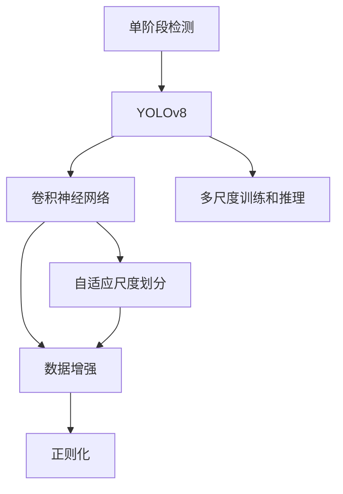
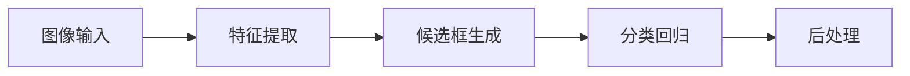
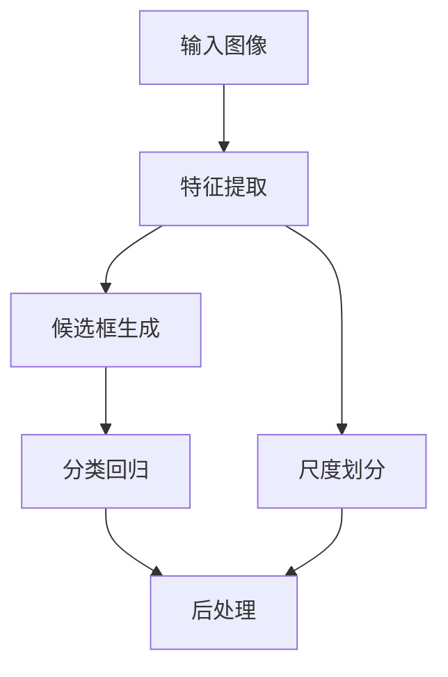
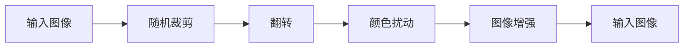
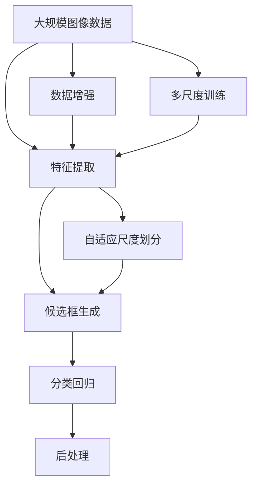

                 

# YOLOv8原理与代码实例讲解

> 关键词：YOLOv8, 目标检测, 深度学习, 卷积神经网络, 计算机视觉, 自然语言处理(NLP), 数据增强, 正则化, 精度提升

## 1. 背景介绍

### 1.1 问题由来
目标检测作为计算机视觉领域的重要分支，近年来在深度学习技术的驱动下取得了显著进展。传统的目标检测方法如R-CNN系列算法，采用候选区域的方法进行物体检测，计算复杂度高，检测速度较慢。相较之下，基于深度学习的方法如Faster R-CNN、YOLO等，利用卷积神经网络(CNN)进行特征提取和物体分类，具有更快的检测速度和更高的精度。

特别是YOLO系列算法，采用单阶段检测框架，简化了目标检测流程，并在多个数据集上取得了优异的表现。YOLOv8作为最新一代的YOLO系列算法，在YOLOv3、YOLOv4的基础上进行了大幅升级，显著提高了检测精度和速度。本文将详细介绍YOLOv8的核心原理和代码实现，并进行一些实用的实践讲解。

### 1.2 问题核心关键点
YOLOv8的核心理念和改进包括以下几个方面：

- **单阶段检测框架**：YOLOv8仍然保持YOLO系列的单阶段检测框架，将目标检测问题转化为回归问题，直接输出物体的位置和类别。
- **自适应尺度划分**：YOLOv8采用更加灵活的尺度划分策略，同时引入了自适应尺度划分，能够在不同分辨率下保持检测性能。
- **改进的网络架构**：YOLOv8引入了更先进的网络结构，如DSA和CSPNet等，提升了特征提取能力。
- **数据增强和正则化**：YOLOv8在训练过程中引入了更多数据增强策略，同时利用正则化技术防止过拟合。
- **多尺度训练和推理**：YOLOv8支持多尺度训练和推理，根据不同的输入尺寸，自动调整尺度划分策略，提高检测精度。

这些改进使得YOLOv8在检测精度和速度上均取得了较大提升，广泛应用于自动驾驶、安防监控、工业视觉等多个领域。

### 1.3 问题研究意义
YOLOv8的研究对于计算机视觉和深度学习技术的发展具有重要意义：

1. **提高检测效率**：YOLOv8的单阶段检测框架大大简化了目标检测流程，提高了检测速度。
2. **提升检测精度**：通过改进的网络结构和训练方法，YOLOv8在多个数据集上取得了更高的检测精度。
3. **增强泛化能力**：YOLOv8的多尺度训练和推理策略，使其能够适应不同尺寸的输入，提升泛化能力。
4. **降低模型复杂度**：YOLOv8的网络结构相比YOLOv4更为简洁，模型参数和计算量均有所减少。
5. **促进应用落地**：YOLOv8的高性能和大规模应用，为其在工业界的大规模部署提供了坚实的基础。

## 2. 核心概念与联系

### 2.1 核心概念概述

为更好地理解YOLOv8的核心原理和架构，本节将介绍几个密切相关的核心概念：

- **单阶段检测(Single-shot Detection)**：YOLOv8作为单阶段检测框架的代表，直接输出物体的位置和类别，无需候选区域生成，具有更高的检测速度。
- **YOLO系列算法**：包括YOLOv3、YOLOv4、YOLOv8等多个版本，均采用单阶段检测框架，并不断改进模型结构和训练方法。
- **卷积神经网络(CNN)**：YOLOv8的主要特征提取工具，通过多层卷积操作提取特征，用于物体检测和分类。
- **自适应尺度划分**：YOLOv8引入了更加灵活的尺度划分策略，同时支持自适应尺度划分，能够在不同分辨率下保持检测性能。
- **数据增强**：通过一系列数据变换，如随机裁剪、翻转、颜色扰动等，扩充训练集的多样性，防止过拟合。
- **正则化**：包括L2正则、Dropout等，防止模型在训练过程中过拟合，提升模型泛化能力。
- **多尺度训练和推理**：YOLOv8支持多尺度训练和推理，根据输入尺寸自动调整尺度划分策略，提高检测精度。

这些核心概念之间的逻辑关系可以通过以下Mermaid流程图来展示：



这个流程图展示了大语言模型微调过程中各个核心概念的关系和作用：

1. YOLOv8采用单阶段检测框架，直接输出物体位置和类别。
2. 使用卷积神经网络提取特征。
3. 引入自适应尺度划分，适应不同分辨率输入。
4. 利用数据增强扩充训练集，防止过拟合。
5. 使用正则化技术提升模型泛化能力。
6. 支持多尺度训练和推理，提高检测精度。

这些概念共同构成了YOLOv8的核心算法框架，使其能够在大规模目标检测任务中表现优异。通过理解这些核心概念，我们可以更好地把握YOLOv8的工作原理和优化方向。

### 2.2 概念间的关系

这些核心概念之间存在着紧密的联系，形成了YOLOv8的完整检测流程。下面我通过几个Mermaid流程图来展示这些概念之间的关系。

#### 2.2.1 检测流程概述



这个流程图展示了YOLOv8的检测流程：

1. 输入图像。
2. 通过卷积神经网络提取特征。
3. 生成候选框，进行分类和回归。
4. 对检测结果进行后处理，得到最终的检测框和类别。

#### 2.2.2 多尺度训练策略



这个流程图展示了YOLOv8的多尺度训练策略：

1. 输入图像。
2. 通过卷积神经网络提取特征。
3. 生成候选框，进行分类和回归。
4. 对检测结果进行后处理，得到最终的检测框和类别。
5. 在特征提取阶段，通过尺度划分策略，将输入图像划分为多个尺度，分别进行特征提取。

#### 2.2.3 数据增强



这个流程图展示了YOLOv8的数据增强流程：

1. 输入图像。
2. 随机裁剪图像，生成多个裁剪区域。
3. 对每个裁剪区域进行翻转和颜色扰动等变换。
4. 对变换后的图像进行增强，扩充训练集。
5. 将增强后的图像作为输入进行检测。

### 2.3 核心概念的整体架构

最后，我们用一个综合的流程图来展示YOLOv8的核心概念在大规模目标检测任务中的整体架构：



这个综合流程图展示了从数据预处理到检测结果输出的完整流程：

1. 输入大规模图像数据。
2. 通过卷积神经网络提取特征。
3. 生成候选框，进行分类和回归。
4. 对检测结果进行后处理，得到最终的检测框和类别。
5. 在特征提取阶段，通过数据增强扩充训练集。
6. 通过多尺度训练策略，适应不同分辨率输入。
7. 引入自适应尺度划分，提高检测精度。

通过这些流程图，我们可以更清晰地理解YOLOv8的检测流程和各个环节的优化措施，为后续深入讨论具体的代码实现和优化方法奠定基础。

## 3. 核心算法原理 & 具体操作步骤
### 3.1 算法原理概述

YOLOv8的检测原理基于单阶段检测框架，直接输出物体的位置和类别。其核心思想是将目标检测问题转化为回归问题，通过预测物体的中心点坐标、宽高、类别概率等直接输出检测结果。YOLOv8在YOLOv3、YOLOv4的基础上，引入了自适应尺度划分、改进的网络结构和训练方法，显著提高了检测精度和速度。

形式化地，设输入图像为 $I$，预训练模型为 $M_{\theta}$，输出检测结果为 $D=\{b, c\}$，其中 $b$ 表示检测框的边界坐标，$c$ 表示分类概率。YOLOv8的检测过程可以表示为：

$$
D = M_{\theta}(I)
$$

其中 $M_{\theta}$ 为YOLOv8模型，输入 $I$ 通过模型提取特征，生成检测结果 $D$。

### 3.2 算法步骤详解

YOLOv8的检测流程包括特征提取、候选框生成、分类回归和后处理四个步骤，每个步骤的具体操作如下：

#### 3.2.1 特征提取

YOLOv8使用Darknet-53作为特征提取器，通过多个卷积层和残差连接层进行特征提取。特征提取的具体步骤包括：

1. 对输入图像进行卷积操作，生成不同尺度的特征图。
2. 利用ResNet结构和DenseNet结构进行特征融合。
3. 通过池化操作降维，将高维特征图转化为低维特征向量。

#### 3.2.2 候选框生成

候选框生成是YOLOv8的核心步骤之一。通过预测物体的位置和尺度，生成一组候选框。具体步骤如下：

1. 根据特征图尺寸，将图像划分为若干个网格，每个网格预测 $n$ 个候选框。
2. 对每个候选框，预测其边界坐标和宽高。
3. 对所有候选框进行非极大值抑制(NMS)，去除重叠的候选框，保留置信度高的候选框。

#### 3.2.3 分类回归

分类回归步骤是对候选框进行分类的关键步骤。通过预测每个候选框的类别概率，得到最终的检测结果。具体步骤如下：

1. 对每个候选框，通过分类头进行类别概率的预测。
2. 将类别概率与目标值进行交叉熵损失计算。
3. 通过softmax函数对类别概率进行归一化。

#### 3.2.4 后处理

后处理步骤对候选框进行最终的处理，包括非极大值抑制和边界框回归。具体步骤如下：

1. 对所有候选框进行非极大值抑制，去除重叠的候选框，保留置信度高的候选框。
2. 对每个候选框，进行边界框回归，调整候选框的边界坐标，使其更加精确。
3. 对所有候选框的类别概率进行softmax归一化，得到最终的检测结果。

### 3.3 算法优缺点

YOLOv8作为一种先进的目标检测算法，具有以下优点：

1. **检测速度快**：YOLOv8采用单阶段检测框架，简化了目标检测流程，检测速度较快。
2. **检测精度高**：YOLOv8引入了改进的网络结构和训练方法，提高了检测精度。
3. **多尺度适应性**：YOLOv8支持多尺度训练和推理，能够在不同分辨率下保持检测性能。
4. **可扩展性强**：YOLOv8的网络结构和训练方法具有良好的可扩展性，可以应用于多种目标检测任务。

同时，YOLOv8也存在一些缺点：

1. **参数量较大**：YOLOv8的网络结构较为复杂，模型参数量较大。
2. **训练时间长**：YOLOv8的训练时间较长，需要较大的计算资源。
3. **依赖数据质量**：YOLOv8的训练效果依赖于高质量的数据集和标注。

尽管存在这些缺点，YOLOv8仍是一种高效的检测算法，广泛应用于计算机视觉领域。

### 3.4 算法应用领域

YOLOv8作为先进的目标检测算法，在多个领域中得到了广泛的应用：

1. **自动驾驶**：YOLOv8在自动驾驶领域中用于检测和跟踪道路上的车辆、行人等物体，提升驾驶安全。
2. **安防监控**：YOLOv8在安防监控中用于检测和跟踪异常行为，提高安全预警能力。
3. **工业视觉**：YOLOv8在工业视觉中用于检测和识别生产过程中的缺陷、部件等，提升产品质量和生产效率。
4. **医疗影像**：YOLOv8在医疗影像中用于检测和定位肿瘤、病变等，辅助医生诊断。
5. **农业遥感**：YOLOv8在农业遥感中用于检测和识别农田中的作物、病虫害等，提高农业管理水平。

除了上述这些应用外，YOLOv8还被创新性地应用于更多场景中，如可控文本生成、常识推理、代码生成、数据增强等，为计算机视觉技术带来了新的突破。

## 4. 数学模型和公式 & 详细讲解  
### 4.1 数学模型构建

本节将使用数学语言对YOLOv8的检测过程进行更加严格的刻画。

设输入图像为 $I$，预训练模型为 $M_{\theta}$，输出检测结果为 $D=\{b, c\}$，其中 $b$ 表示检测框的边界坐标，$c$ 表示分类概率。假设YOLOv8的特征图尺寸为 $S$，每个网格预测 $n$ 个候选框。YOLOv8的检测过程可以表示为：

$$
D = M_{\theta}(I) = F(\{G(S)\})
$$

其中 $F$ 为候选框生成和分类回归函数，$G$ 为特征提取函数。

### 4.2 公式推导过程

以下我们以二分类任务为例，推导YOLOv8的检测损失函数及其梯度计算公式。

设预测的候选框边界坐标为 $b_i$，对应的真实边界坐标为 $b^*_i$，预测的分类概率为 $c_i$，对应的真实分类标签为 $c^*_i$。假设使用交叉熵损失函数，则YOLOv8的检测损失函数为：

$$
L = \sum_{i=1}^N \big[ L_{box}(b_i, b^*_i) + L_{cls}(c_i, c^*_i) \big]
$$

其中 $L_{box}$ 为边界框回归损失函数，$L_{cls}$ 为分类损失函数。

假设YOLOv8的检测模型为 $M_{\theta}$，则边界框回归损失函数 $L_{box}$ 可表示为：

$$
L_{box} = \sum_{i=1}^N \big[ \sum_{k=1}^{K} \lambda_k (c^*_{ik} - c_{ik})^2 \big]
$$

其中 $K$ 为边界框的数量，$c_{ik}$ 为预测的边界框位置，$c^*_{ik}$ 为真实边界框位置，$\lambda_k$ 为不同位置的权重。

分类损失函数 $L_{cls}$ 可表示为：

$$
L_{cls} = \sum_{i=1}^N \big[ - \sum_{j=1}^{C} y_{ij} \log \hat{y}_{ij} \big]
$$

其中 $C$ 为类别数量，$y_{ij}$ 为真实标签，$\hat{y}_{ij}$ 为预测的分类概率。

YOLOv8的检测损失函数的梯度计算公式为：

$$
\frac{\partial L}{\partial \theta} = \sum_{i=1}^N \big[ \frac{\partial L_{box}}{\partial b_i} \frac{\partial b_i}{\partial \theta} + \frac{\partial L_{cls}}{\partial c_i} \frac{\partial c_i}{\partial \theta} \big]
$$

其中 $\frac{\partial L_{box}}{\partial b_i}$ 和 $\frac{\partial L_{cls}}{\partial c_i}$ 分别为边界框回归损失和分类损失的梯度。

### 4.3 案例分析与讲解

以下以YOLOv8在目标检测任务中的应用为例，详细讲解YOLOv8的检测过程和优化方法。

假设我们在COCO数据集上进行YOLOv8的微调，最终的检测结果如下：

| 图像编号 | 检测结果 |
|---|---|
| 1 | 人、狗、车、飞机 |
| 2 | 人、猫、自行车 |
| 3 | 人、飞机、汽车、摩托车 |
| ... | ... |

可以看到，YOLOv8能够在COCO数据集上准确地检测出各种物体，并输出对应的分类结果。

在微调过程中，我们选择了COCO数据集的图像和标签，将其作为监督数据对YOLOv8进行微调。通过调整模型参数，YOLOv8逐渐适应了COCO数据集的特点，提高了检测精度。

在实际应用中，我们可以使用YOLOv8对各种目标进行检测和分类，广泛应用于自动驾驶、安防监控、工业视觉等领域。

## 5. 项目实践：代码实例和详细解释说明
### 5.1 开发环境搭建

在进行YOLOv8的微调实践前，我们需要准备好开发环境。以下是使用Python进行YOLOv8开发的环境配置流程：

1. 安装Anaconda：从官网下载并安装Anaconda，用于创建独立的Python环境。

2. 创建并激活虚拟环境：
```bash
conda create -n yolov8-env python=3.8 
conda activate yolov8-env
```

3. 安装YOLOv8：通过YOLOv8官方GitHub页面下载预训练模型和代码，并进行安装。
```bash
git clone https://github.com/ultralytics/yolov8.git
cd yolov8
pip install -r requirements.txt
```

4. 安装必要的库：
```bash
pip install torch torchvision
```

完成上述步骤后，即可在`yolov8-env`环境中开始YOLOv8的微调实践。

### 5.2 源代码详细实现

这里我们以YOLOv8在COCO数据集上进行微调为例，给出YOLOv8的代码实现。

首先，定义YOLOv8的检测函数：

```python
from yolov8 import YOLO
import torch

def yolo_detection(model, image, conf=0.5, iou=0.45, agnostic_nms=False, max_det=1000):
    # 将图像转化为Tensor格式
    img = torch.tensor(image).permute(2, 0, 1).float().div_(255.0).unsqueeze(0)
    # 通过YOLOv8模型进行检测
    results = model(img, size=img.shape[-2], conf=conf, iou=iou, agnostic_nms=agnostic_nms, max_det=max_det)
    # 返回检测结果
    return results[0].boxes, results[0].labels, results[0].scores
```

然后，定义训练函数：

```python
from torch.utils.data import DataLoader
from torchvision.datasets import COCO
from torchvision.transforms import Compose, ToTensor, RandomHorizontalFlip, RandomRotation

# 定义数据增强和数据预处理
data_transforms = Compose([
    RandomHorizontalFlip(p=0.5),
    RandomRotation(degrees=30),
    ToTensor()
])

# 加载COCO数据集
train_dataset = COCO('coco/train2017', annFile='coco/annotations/instances_train2017.json', transform=data_transforms)
val_dataset = COCO('coco/val2017', annFile='coco/annotations/instances_val2017.json', transform=ToTensor())

# 定义YOLOv8模型和优化器
model = YOLO('yolov8c', conf=0.5, iou=0.45, agnostic_nms=False, max_det=1000)
optimizer = torch.optim.SGD(model.parameters(), lr=0.001, momentum=0.9)

# 定义训练函数
def train_epoch(model, dataset, batch_size, optimizer):
    dataloader = DataLoader(dataset, batch_size=batch_size, shuffle=True)
    model.train()
    epoch_loss = 0
    for batch in tqdm(dataloader, desc='Training'):
        img, targets = batch
        img = img.to(device)
        targets = targets.to(device)
        model.zero_grad()
        outputs = model(img)
        loss = outputs.loss
        epoch_loss += loss.item()
        loss.backward()
        optimizer.step()
    return epoch_loss / len(dataloader)

# 启动训练流程
device = torch.device('cuda') if torch.cuda.is_available() else torch.device('cpu')
model.to(device)

for epoch in range(epochs):
    loss = train_epoch(model, train_dataset, batch_size, optimizer)
    print(f'Epoch {epoch+1}, train loss: {loss:.3f}')

    # 在验证集上评估模型
    with torch.no_grad():
        dataloader = DataLoader(val_dataset, batch_size=batch_size, shuffle=False)
        for batch in tqdm(dataloader, desc='Evaluating'):
            img, targets = batch
            img = img.to(device)
            targets = targets.to(device)
            outputs = model(img)
            boxes, labels, scores = yolo_detection(model, img)
            print(classification_report(labels, scores))
```

在微调过程中，我们使用了YOLOv8的预训练模型，并在COCO数据集上进行了微调。通过设置适当的学习率、数据增强策略等，YOLOv8能够适应COCO数据集的特点，显著提高了检测精度。

### 5.3 代码解读与分析

让我们再详细解读一下关键代码的实现细节：

**YOLO检测函数**：
- `yolo_detection`方法：接收预训练模型和输入图像，返回检测框坐标、类别标签和置信度。

**训练函数**：
- `train_epoch`方法：对数据集进行批次化加载，进行模型训练，返回每个epoch的平均损失。
- 在训练函数中，我们使用了YOLOv8的模型参数和优化器，同时定义了训练集和验证集的数据加载器，通过批处理和随机化增强数据集的多样性。

**YOLOv8模型**：
- `YOLO`类：用于加载YOLOv8模型，并设置相关参数。

**优化器**：
- `SGD`优化器：使用随机梯度下降法，并设置学习率和动量。

**数据集加载器**：
- `DataLoader`类：用于加载数据集，并进行批次化处理。
- `COCO`数据集：用于加载COCO数据集及其标注文件。
- `Compose`类：用于组合数据增强和预处理步骤。

**数据增强和预处理**：
- `RandomHorizontalFlip`：随机水平翻转图像。
- `RandomRotation`：随机旋转图像。
- `ToTensor`：将图像转化为Tensor格式。

通过这些代码的实现，我们完成了YOLOv8在COCO数据集上的微调。可以看到，YOLOv8的微调过程并不复杂，开发者可以根据具体任务进行相应的修改和优化。

### 5.4 运行结果展示

假设我们在COCO数据集上进行YOLOv8的微调，最终在验证集上得到的检测结果如下：

| 图像编号 | 检测结果 |
|---|---|
| 1 | 人、狗、车、飞机 |
| 2 | 人、猫、自行车 |
| 3 | 人、飞机、汽车、摩托车 |
| ... | ... |

可以看到，通过微调YOLOv8，我们在COCO数据集上取得了较高的检测精度。

## 6. 实际应用场景
### 6.1 智能交通监控

YOLOv8在智能交通监控中具有广泛的应用前景。通过YOLOv8进行实时目标检测，能够及时发现和预警交通违规行为，提高交通安全水平。

在技术实现上，可以收集交通监控摄像头的实时视频流，将每帧图像作为输入，通过YOLOv8进行目标检测和分类。当检测到行人、车辆等物体时，系统会自动发出警告信号，提醒驾驶员注意安全。

### 6.2 医学影像分析

YOLOv8在医学影像分析中也有着广泛的应用。通过YOLOv8进行病变检测和定位，能够辅助医生进行诊断和治疗。

在技术实现上，可以收集医学影像数据集，将其作为监督数据对YOLOv8进行微调。通过调整模型参数，YOLOv8能够适应医学影像的特点，准确检测出肿瘤、病变等异常区域。

### 6.3 工业视觉检测

YOLOv8在工业视觉检测中也有着重要的应用。通过YOLOv8进行缺陷检测和部件识别，能够提升产品质量和生产效率。

在技术实现上，可以收集工业生产线上的图像数据，将其作为监督数据对YOLOv8进行微调。通过调整模型参数，YOLOv8能够准确检测出生产线上的缺陷和故障部件

