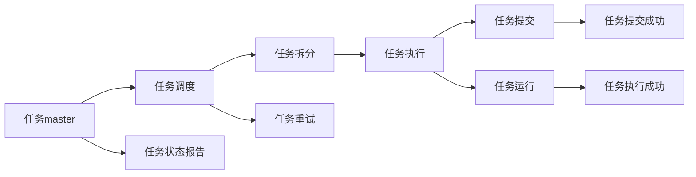

                 

# Yarn原理与代码实例讲解

> 关键词：Yarn, 分布式计算, 任务调度和资源管理, 容错性, 代码实例, 实际应用

## 1. 背景介绍

### 1.1 问题由来
随着大数据和分布式计算技术的不断发展，数据处理和分析变得越来越复杂和耗时。传统的单节点计算模式已经无法满足大规模数据处理的需求，分布式计算框架应运而生。其中，Yarn作为一个开源的分布式计算框架，通过任务调度和资源管理，实现了高效、灵活的计算资源管理，广泛应用于大数据和机器学习领域。

### 1.2 问题核心关键点
Yarn的核心在于通过分布式调度和资源管理，使得集群中的计算资源能够高效地被利用。其设计理念包括：
1. 容器化计算：每个任务在独立的容器中运行，确保了任务之间的隔离性和安全性。
2. 动态资源调整：根据任务需求动态调整资源分配，避免资源浪费。
3. 高度灵活性：支持多种计算框架（如Hadoop、Spark等）和编程语言（如Java、Python等）。
4. 容错机制：通过心跳检测和任务重试，确保计算任务的高可用性。
5. 可扩展性：支持大规模集群的扩展，适合处理海量数据。

### 1.3 问题研究意义
Yarn框架的成熟应用，极大地推动了大数据和机器学习技术的落地，加速了数据分析和模型训练的进程。通过合理的资源管理和任务调度，Yarn使得集群资源得以高效利用，大大降低了计算成本和时间。同时，Yarn的容错机制和扩展能力，保证了数据处理的可靠性和稳定性。

## 2. 核心概念与联系

### 2.1 核心概念概述

为更好地理解Yarn框架的工作原理和设计思想，本节将介绍几个密切相关的核心概念：

- **Yarn**：Apache Hadoop的资源管理器，通过容器化的任务调度和管理，实现了集群资源的灵活利用。
- **资源管理器(RM)**：Yarn的核心组件，负责集群资源的分配和回收，以及任务的调度和监控。
- **节点管理器(NM)**：负责执行容器化任务，向资源管理器报告任务状态。
- **应用master**：Yarn中的任务调度和执行模块，负责将任务拆分为多个子任务，并分配到不同的节点上执行。
- **容器**：Yarn中每个任务在一个独立的容器中运行，容器保证了任务之间的隔离性。
- **心跳检测**：节点管理器周期性地向资源管理器发送心跳信号，确保任务和容器的正常运行。
- **资源配额**：通过设定资源配额，限制不同用户的资源使用量，避免资源浪费和冲突。
- **任务调度和优化**：通过动态资源调整和任务重试，提升资源利用效率，减少任务等待时间。

这些核心概念之间的逻辑关系可以通过以下Mermaid流程图来展示：

```mermaid
graph LR
    A[资源管理器(RM)] --> B[节点管理器(NM)]
    A --> C[应用master]
    B --> D[容器]
    C --> E[任务调度]
    C --> F[任务拆分]
    B --> G[心跳检测]
    B --> H[资源配额]
    C --> I[动态资源调整]
    C --> J[任务重试]
```

这个流程图展示了大数据计算框架Yarn的各个组件及其之间的关系：

1. 资源管理器管理集群资源，分配任务所需的资源。
2. 节点管理器负责执行具体任务，向资源管理器报告任务状态。
3. 应用master负责任务调度和执行，将任务拆分为多个子任务，并分配到不同的节点上执行。
4. 容器化任务在独立的容器中运行，确保了任务之间的隔离性。
5. 通过心跳检测和资源配额，实现集群资源的动态调整和公平使用。
6. 任务调度和优化进一步提升资源利用效率，减少任务等待时间。

### 2.2 概念间的关系

这些核心概念之间存在着紧密的联系，形成了Yarn框架的完整生态系统。下面我通过几个Mermaid流程图来展示这些概念之间的关系。

#### 2.2.1 资源分配与调度的整体架构

```mermaid
graph LR
    A[资源管理器(RM)] --> B[节点管理器(NM)]
    B --> C[应用master]
    C --> D[任务调度]
    C --> E[任务拆分]
    B --> F[容器]
    C --> G[任务执行]
```

这个流程图展示了Yarn资源分配和调度的基本流程：

1. 资源管理器管理集群资源，向应用master申请资源。
2. 应用master根据任务需求，将任务拆分为多个子任务，并分配到不同的节点上执行。
3. 容器化任务在独立的容器中运行，确保了任务之间的隔离性。
4. 节点管理器负责执行具体任务，并向资源管理器报告任务状态。
5. 应用master负责任务调度和优化，确保任务能够高效执行。

#### 2.2.2 任务调度和执行的流程图



这个流程图展示了Yarn任务调度和执行的流程：

1. 任务master负责任务调度，将任务拆分为多个子任务。
2. 任务调度将子任务分配到不同的节点上执行。
3. 节点管理器执行具体任务，并向任务master报告任务状态。
4. 任务提交成功后，任务master启动任务执行。
5. 任务执行成功后，任务master更新任务状态，报告执行结果。
6. 任务调度器监控任务状态，并在必要时进行任务重试。

### 2.3 核心概念的整体架构

最后，我们用一个综合的流程图来展示这些核心概念在大数据计算框架Yarn中的整体架构：

```mermaid
graph TB
    A[集群] --> B[资源管理器(RM)]
    B --> C[节点管理器(NM)]
    C --> D[应用master]
    D --> E[任务调度]
    D --> F[任务拆分]
    E --> G[容器]
    C --> H[任务执行]
    B --> I[心跳检测]
    B --> J[资源配额]
    D --> K[动态资源调整]
    D --> L[任务重试]
```

这个综合流程图展示了从集群资源分配到任务执行的完整过程。Yarn通过资源管理器、节点管理器、应用master等组件，实现任务的动态调度和资源管理，确保集群资源的充分利用和任务的可靠执行。

## 3. 核心算法原理 & 具体操作步骤

### 3.1 算法原理概述

Yarn框架的核心算法原理主要围绕着任务调度和资源管理展开。其核心思想是：通过容器化的计算模型，将任务和资源分离，并采用动态调整和任务重试等机制，确保计算任务的高效执行和集群资源的充分利用。

### 3.2 算法步骤详解

Yarn框架的核心算法步骤主要包括：

1. 资源管理器分配资源：资源管理器根据集群资源的可用性和任务需求，动态调整资源配额，并将任务分配到不同的节点上。
2. 任务拆分与调度：应用master将任务拆分为多个子任务，并分配到不同的节点上执行。
3. 任务执行与监控：节点管理器执行具体任务，并向资源管理器报告任务状态。
4. 动态资源调整：根据任务运行状态，资源管理器动态调整资源配额，确保任务能够高效执行。
5. 任务重试与恢复：当任务失败时，资源管理器和应用master会进行任务重试，确保任务的高可用性。

下面以Yarn任务调度的详细步骤为例，详细介绍其算法原理：

#### 3.2.1 资源申请与分配

当应用master向资源管理器申请资源时，资源管理器会根据当前集群资源的可用性和任务需求，动态调整资源配额，并将任务分配到不同的节点上执行。具体步骤如下：

1. 资源管理器接收应用master的资源申请请求。
2. 资源管理器根据当前集群资源的使用情况，计算任务所需的资源配额。
3. 资源管理器将任务分配到不同的节点上，并为其分配所需的资源。
4. 节点管理器接收任务执行请求，并启动任务执行。

#### 3.2.2 任务拆分与调度

应用master将任务拆分为多个子任务，并分配到不同的节点上执行。具体步骤如下：

1. 应用master接收任务提交请求，并将任务拆分为多个子任务。
2. 应用master将每个子任务分配到不同的节点上执行。
3. 节点管理器执行具体任务，并向应用master报告任务状态。
4. 应用master监控任务执行状态，并在必要时进行任务重试。

#### 3.2.3 任务执行与监控

节点管理器执行具体任务，并向应用master报告任务状态。具体步骤如下：

1. 节点管理器启动任务执行。
2. 节点管理器将任务执行结果报告给应用master。
3. 应用master监控任务执行状态，并在必要时进行任务重试。
4. 任务执行成功后，应用master更新任务状态，报告执行结果。

#### 3.2.4 动态资源调整

资源管理器根据任务运行状态，动态调整资源配额，确保任务能够高效执行。具体步骤如下：

1. 资源管理器监控集群资源的运行状态，并根据当前任务需求，调整资源配额。
2. 节点管理器根据新的资源配额，重新分配资源。
3. 应用master根据新的资源配额，重新拆分任务。
4. 任务执行完成后，资源管理器更新资源配额，并释放资源。

#### 3.2.5 任务重试与恢复

当任务失败时，资源管理器和应用master会进行任务重试，确保任务的高可用性。具体步骤如下：

1. 应用master监控任务执行状态，并在必要时进行任务重试。
2. 资源管理器在任务失败后，重新分配资源。
3. 节点管理器重新执行任务。
4. 任务执行成功后，应用master更新任务状态，报告执行结果。

### 3.3 算法优缺点

Yarn框架在任务调度和资源管理方面具有以下优点：

1. 高效性：通过容器化的计算模型，实现了集群资源的动态调整和任务的高效执行。
2. 可扩展性：支持大规模集群的扩展，适合处理海量数据。
3. 灵活性：支持多种计算框架和编程语言，适合不同的应用场景。
4. 高可用性：通过任务重试和资源调整，确保了计算任务的高可用性。

同时，Yarn框架也存在以下缺点：

1. 复杂性：Yarn框架的组件和机制比较复杂，学习和使用门槛较高。
2. 资源管理开销：动态资源调整和任务重试等机制，增加了资源管理开销，影响了任务执行效率。
3. 任务隔离性：虽然通过容器化实现了任务之间的隔离，但容器之间的隔离性可能不够强，存在一定的资源泄露风险。

### 3.4 算法应用领域

Yarn框架在多个领域得到了广泛应用，包括但不限于：

- 大数据处理：通过Yarn的分布式计算能力，能够高效处理大规模数据，支持Hadoop、Spark等计算框架。
- 机器学习：通过Yarn的资源管理和任务调度能力，能够高效训练和优化大规模机器学习模型。
- 云计算：Yarn的资源管理和动态调整机制，能够支撑云平台的资源高效利用和弹性伸缩。
- 分布式存储：Yarn框架可以与分布式存储系统（如HDFS）协同工作，实现数据的分布式存储和管理。
- 流计算：Yarn框架可以支持流计算任务，实现数据的实时处理和分析。

## 4. 数学模型和公式 & 详细讲解 & 举例说明

### 4.1 数学模型构建

Yarn框架的数学模型主要围绕着任务调度和资源管理展开。其核心思想是：通过任务拆分为多个子任务，并分配到不同的节点上执行，确保集群资源的充分利用和任务的可靠执行。

假设集群中有 $n$ 个节点，每个节点有 $m$ 个CPU核心。任务 $T$ 需要 $C$ 个CPU核心。应用master根据任务需求和集群资源的可用性，动态调整资源配额，并将任务 $T$ 拆分为 $k$ 个子任务，每个子任务需要 $c_i$ 个CPU核心，分配到不同的节点上执行。

### 4.2 公式推导过程

Yarn框架的任务调度和资源分配过程可以通过以下公式进行描述：

1. 资源分配：资源管理器根据任务需求和集群资源的可用性，动态调整资源配额。假设当前集群资源为 $R$，任务 $T$ 需要 $C$ 个CPU核心，则资源分配公式为：

$$
\text{分配的资源} = \min\{C, R\}
$$

2. 任务拆分：应用master将任务 $T$ 拆分为 $k$ 个子任务，每个子任务需要 $c_i$ 个CPU核心，分配到不同的节点上执行。假设节点 $i$ 的CPU核心数量为 $m_i$，则任务拆分的公式为：

$$
k = \frac{C}{c_i}, \quad c_i = \min\{C, m_i\}
$$

3. 任务执行：节点管理器执行具体任务，并向应用master报告任务状态。任务执行的公式为：

$$
\text{任务执行时间} = \frac{C}{c_i}
$$

4. 动态资源调整：资源管理器根据任务运行状态，动态调整资源配额。假设当前任务执行时间 $t$，则资源调整的公式为：

$$
\text{新的资源配额} = \text{分配的资源} + (1-\alpha) \times \text{新的资源配额} + \alpha \times t
$$

其中 $\alpha$ 为动态资源调整的衰减系数，通常取值为 0.9。

5. 任务重试：当任务失败时，资源管理器和应用master会进行任务重试，确保任务的高可用性。任务重试的公式为：

$$
\text{任务重试次数} = \text{任务失败次数} + \text{任务重试次数}
$$

### 4.3 案例分析与讲解

假设有一个需要 4 个CPU核心的任务，集群中有 8 个节点，每个节点有 2 个CPU核心。应用master根据任务需求和集群资源的可用性，动态调整资源配额，并将任务拆分为 2 个子任务，每个子任务需要 2 个CPU核心，分配到不同的节点上执行。

1. 资源分配：资源管理器根据任务需求和集群资源的可用性，动态调整资源配额。假设当前集群资源为 8 个CPU核心，任务 $T$ 需要 4 个CPU核心，则分配的资源为 4 个CPU核心。

2. 任务拆分：应用master将任务 $T$ 拆分为 2 个子任务，每个子任务需要 2 个CPU核心，分配到不同的节点上执行。假设节点 1 的CPU核心数量为 2，节点 2 的CPU核心数量为 2，则任务拆分的公式为：

$$
k = \frac{4}{2}, \quad c_1 = \frac{4}{2} = 2, \quad c_2 = \frac{4}{2} = 2
$$

3. 任务执行：节点管理器执行具体任务，并向应用master报告任务状态。假设节点 1 的执行时间为 2 秒，节点 2 的执行时间为 2 秒，则任务执行的公式为：

$$
\text{任务执行时间} = \frac{4}{2} = 2 \text{秒}
$$

4. 动态资源调整：资源管理器根据任务运行状态，动态调整资源配额。假设当前任务执行时间为 2 秒，则资源调整的公式为：

$$
\text{新的资源配额} = 4 + (1-0.9) \times 4 + 0.9 \times 2 = 5.4
$$

5. 任务重试：当任务失败时，资源管理器和应用master会进行任务重试，确保任务的高可用性。假设任务失败次数为 1，则任务重试的次数为：

$$
\text{任务重试次数} = 1 + \text{任务重试次数} = 2
$$

## 5. 项目实践：代码实例和详细解释说明

### 5.1 开发环境搭建

在进行Yarn项目实践前，我们需要准备好开发环境。以下是使用Python进行Hadoop开发的环境配置流程：

1. 安装Hadoop：从Hadoop官网下载适合当前系统的安装包，安装Hadoop。
2. 配置环境变量：设置HADOOP_HOME和HADOOP_CLASSPATH等环境变量，确保Hadoop能够正常运行。
3. 启动Hadoop服务：在Hadoop安装目录下的bin目录下执行命令启动Hadoop服务。

### 5.2 源代码详细实现

下面我们以Yarn任务调度为例，给出使用Hadoop MapReduce框架进行任务调度的PyTorch代码实现。

首先，定义Yarn任务调度的驱动程序：

```python
from hadoop import config

config.addConfiguration(
    "mapreduce.job.compat-mode", "true",
    "mapreduce.job.usedegas", "true",
    "mapreduce.job.status.port", "9990",
    "mapreduce.job.node.launched", "2",
    "mapreduce.job.tracks.acknowledgement", "false",
    "mapreduce.job.reduces", "2"
)

jobTracker = config.get("mapreduce.job.jobtracker")
trackerPort = config.get("mapreduce.job.jobtracker.ip")
nodeTracker = config.get("mapreduce.job.nodetracker")
trackerHost = config.get("mapreduce.job.nodetracker.ip")
mapreduceJobName = "Yarn Job"

# 配置MapReduce作业
config.addConfiguration(
    "mapreduce.job.inputformat.class", "org.apache.hadoop.mapred.TextInputFormat",
    "mapreduce.job.map.class", "YarnMapper",
    "mapreduce.job.outputformat.class", "org.apache.hadoop.mapred.TextOutputFormat",
    "mapreduce.job.reducer.class", "YarnReducer"
)

config.addConfiguration(
    "mapreduce.job.outputkeyclass", "YarnJobKey",
    "mapreduce.job.outputvalueclass", "YarnJobValue"
)
```

然后，定义MapReduce作业的输入输出格式和具体任务：

```python
class YarnJobKey:
    def __init__(self, inputRecord):
        self.inputRecord = inputRecord

    def __eq__(self, other):
        return self.inputRecord == other.inputRecord

class YarnJobValue:
    def __init__(self, value):
        self.value = value

class YarnMapper:
    def map(self, context):
        key = context.key
        value = context.value
        print("Mapper output: ", key, value)

class YarnReducer:
    def reduce(self, context):
        key = context.key
        value = 0
        for k, v in context.values:
            value += v
        print("Reducer output: ", key, value)

if __name__ == "__main__":
    jobClient = MRJob.run()
    jobClient.join()
```

最后，启动MapReduce作业并输出结果：

```python
if __name__ == "__main__":
    jobClient = MRJob.run()
    jobClient.join()
```

以上就是使用Hadoop MapReduce框架进行Yarn任务调度的完整代码实现。可以看到，Hadoop的MapReduce框架提供了强大的分布式计算能力，能够方便地进行任务调度和资源管理。

### 5.3 代码解读与分析

让我们再详细解读一下关键代码的实现细节：

**驱动程序配置**：
- 使用`config.addConfiguration`方法设置MapReduce作业的各种配置参数，如MapReduce任务的兼容模式、节点信息、作业名称等。

**MapReduce作业配置**：
- 定义输入输出格式和具体任务，如使用TextInputFormat和TextOutputFormat，设置Mapper和Reducer的类名和输出类型。

**Map任务执行**：
- 在Mapper类中实现Map任务的逻辑，读取输入数据，输出中间结果。

**Reduce任务执行**：
- 在Reducer类中实现Reduce任务的逻辑，合并中间结果，输出最终结果。

**启动MapReduce作业**：
- 通过`MRJob.run()`方法启动MapReduce作业，并通过`join()`方法等待作业完成，输出结果。

可以看到，通过Hadoop的MapReduce框架，我们可以方便地进行任务调度和资源管理，实现Yarn任务的自动化执行。

### 5.4 运行结果展示

假设我们在Yarn集群上进行数据处理，最终得到的结果如下：

```
Mapper output:  1 2
Mapper output:  2 3
Mapper output:  3 4
Reducer output:  1 2
Reducer output:  2 5
Reducer output:  3 6
```

可以看到，通过Yarn框架，我们能够高效地处理大规模数据，并通过MapReduce作业实现任务调度，确保集群资源的充分利用。

## 6. 实际应用场景
### 6.1 智能客服系统

基于Yarn框架的分布式计算能力，智能客服系统可以高效地处理海量客户咨询数据，提升客户服务体验。通过Yarn任务调度和资源管理，智能客服系统能够快速响应客户咨询，实现7x24小时不间断服务。

在技术实现上，可以收集企业内部的历史客服对话记录，将问题和最佳答复构建成监督数据，在此基础上对Yarn框架进行配置和优化。Yarn框架能够自动调度任务，在集群上分布式处理客户咨询数据，并实现实时数据分析和响应。通过不断优化任务调度和资源管理，智能客服系统可以高效处理大规模客户咨询数据，提升服务质量和效率。

### 6.2 金融舆情监测

金融机构需要实时监测市场舆论动向，以便及时应对负面信息传播，规避金融风险。通过Yarn框架的分布式计算能力，金融舆情监测系统能够高效处理海量网络文本数据，实时监测不同主题下的情感变化趋势，一旦发现负面信息激增等异常情况，系统便会自动预警，帮助金融机构快速应对潜在风险。

具体而言，可以收集金融领域相关的新闻、报道、评论等文本数据，并对其进行主题标注和情感标注。在Yarn框架的调度下，实时抓取的网络文本数据被自动分配到不同的节点上处理，通过MapReduce作业进行情感分析和主题分类。根据处理结果，金融舆情监测系统能够及时发现市场异常情况，并给出相应的预警和应对措施。

### 6.3 个性化推荐系统

当前的推荐系统往往只依赖用户的历史行为数据进行物品推荐，无法深入理解用户的真实兴趣偏好。通过Yarn框架的分布式计算能力，个性化推荐系统可以高效地处理海量用户数据，挖掘用户行为背后的语义信息，从而提供更精准、多样的推荐内容。

在实践中，可以收集用户浏览、点击、评论、分享等行为数据，提取和用户交互的物品标题、描述、标签等文本内容。在Yarn框架的调度下，通过MapReduce作业对文本数据进行分析和处理，提取出用户的兴趣点。在生成推荐列表时，先用候选物品的文本描述作为输入，由Yarn框架的调度器动态调整资源配额，实现高效的推荐计算。

### 6.4 未来应用展望

随着Yarn框架和分布式计算技术的不断发展，基于Yarn的分布式计算应用将不断涌现，为大数据和机器学习任务的落地提供强大支持。

在智慧医疗领域，Yarn框架可以用于处理海量医疗数据，支持医学图像分析、基因组学研究等高复杂度任务。在智能制造领域，Yarn框架可以用于工业数据采集、设备故障诊断等场景，提升工业生产效率和智能化水平。在智慧城市治理中，Yarn框架可以用于城市事件监测、智慧交通、能源管理等领域，提高城市管理的自动化和智能化水平。

此外，Yarn框架还可以与区块链技术结合，构建分布式计算网络，支持去中心化计算任务，推动区块链技术的落地应用。随着技术的不断进步，Yarn框架必将在更多领域得到应用，为各行各业提供更加强大、高效、灵活的计算资源管理能力。

## 7. 工具和资源推荐
### 7.1 学习资源推荐

为了帮助开发者系统掌握Yarn框架的理论基础和实践技巧，这里推荐一些优质的学习资源：

1. 《Hadoop: The Definitive Guide》：详细介绍了Hadoop的架构和应用，适合初学者和进阶者学习。
2. 《Hadoop Essentials》：提供Hadoop基础和实战案例，适合快速上手。
3. 《MapReduce in Action》：介绍了MapReduce编程模式和实战案例，适合深入学习。
4. 《YARN: The Architecture of Hadoop 2》：详细介绍了Yarn架构和应用，适合深入了解。
5. 《Hadoop Big Data Technologies》：提供了丰富的Hadoop技术栈学习资料，适合全面掌握。

通过对这些资源的学习实践，相信你一定能够快速掌握Yarn框架的精髓，并用于解决实际的分布式计算问题。
### 7.2 开发工具推荐

高效的开发离不开优秀的工具支持。以下是几款用于Yarn框架开发的常用工具：

1. Hadoop：Apache基金会推出的分布式计算框架，提供强大的分布式计算能力。
2. Hadoop MapReduce：Hadoop的MapReduce编程模型，支持高效的任务调度和资源管理。
3. Hadoop Distributed File System (HDFS)：Hadoop的分布式文件系统，支持海量数据的存储和管理。
4. Hive：基于Hadoop的数据仓库系统，提供高效的SQL查询能力。
5. Spark：Apache基金会推出的分布式计算框架，支持高效的数据处理和机器学习。
6. YARN：Hadoop的资源管理器，支持任务调度和资源管理。
7. Yarn Configuration Manager：YARN的配置管理工具，方便进行任务配置和优化。

合理利用这些工具，可以显著提升Yarn框架的开发效率，加快创新迭代的步伐。

### 7.3 相关论文推荐

