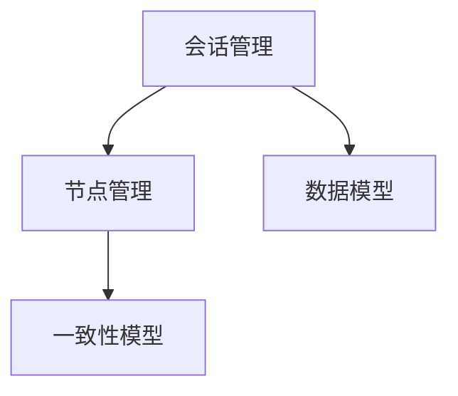

                 

## Zookeeper原理与代码实例讲解

### 1. 背景介绍

** Zookeeper概述**

Zookeeper是一个分布式服务框架，主要用于协调分布式系统中的服务实例，以及管理配置信息、命名服务和提供分布式同步机制等功能。Zookeeper基于“观察者模式”实现，服务实例观察主节点（Leader）的变更，并根据变更情况及时调整自身状态。

** Zookeeper应用场景**

Zookeeper广泛应用于Hadoop生态系统中，作为Hadoop集群的元数据管理工具，提供分布式锁、集群管理、服务注册等功能。除此之外，Zookeeper还被广泛应用于游戏、金融、电商等需要高可靠性和高稳定性的场景。

### 2. 核心概念与联系

** 核心概念概述**

1. Zookeeper会话管理：会话是指客户端与Zookeeper主节点之间的通信连接，在会话期间，客户端可以读取、写入、删除Zookeeper节点，同时Zookeeper会定期检查会话状态，避免因网络中断等问题导致的通信失败。

2. Zookeeper节点管理：节点是Zookeeper中保存的数据结构，节点由路径、节点数据、节点类型和节点权限等组成。根据节点类型，Zookeeper节点可以分为持久节点、临时节点、顺序节点和空节点等。

3. Zookeeper数据模型：Zookeeper使用层次结构的数据模型，类似于文件系统。节点和节点之间通过路径分隔，使用“/”符号表示。路径可以包含多个节点，例如“/movies/2018”表示“2018年”下的所有电影节点。

4. Zookeeper一致性模型：Zookeeper保证节点数据的一致性和顺序性。当主节点数据变更后，所有观察者节点都会收到最新的数据更新。同时，Zookeeper保证在一定时间内节点数据的顺序性和一致性。

** 核心概念关系图**

### 3. 核心算法原理 & 具体操作步骤

** 算法原理概述**

Zookeeper的算法原理基于“观察者模式”和“分布式一致性算法”，通过主节点和观察者节点的协同工作，保证数据的一致性和可靠性。

1. 观察者模式：Zookeeper服务实例（客户端）观察主节点的状态，并根据状态变化进行相应的操作。

2. 一致性模型：Zookeeper保证数据的一致性和顺序性。当主节点数据变更后，所有观察者节点都会收到最新的数据更新。

3. 分布式选举：Zookeeper在集群中选举出一个主节点（Leader），其他节点（Follower）跟随Leader工作。

** 算法步骤详解**

1. 初始化Zookeeper集群：通过安装和启动多个Zookeeper服务实例，并配置网络拓扑，形成Zookeeper集群。

2. 会话管理：客户端与Zookeeper主节点建立会话连接，通过会话状态管理客户端与服务器的通信。

3. 节点管理：客户端可以读取、写入、删除Zookeeper节点，并根据节点类型进行相应的操作。

4. 数据模型管理：Zookeeper使用层次结构的数据模型，客户端可以通过路径访问和操作节点。

5. 一致性模型管理：Zookeeper保证数据的一致性和顺序性，客户端通过观察者模式，接收最新的数据更新。

** 算法优缺点**

1. 优点：Zookeeper保证数据的一致性和可靠性，能够适应大规模集群的环境。

2. 缺点：Zookeeper对网络延时和分区问题较为敏感，在大规模集群中存在一定的性能瓶颈。

** 算法应用领域**

1. 分布式锁：Zookeeper通过创建临时节点实现分布式锁。

2. 集群管理：Zookeeper用于管理Hadoop集群的节点状态，保证集群的可靠性。

3. 服务注册：Zookeeper用于管理服务实例的注册信息，保证服务的可用性和稳定性。

4. 配置管理：Zookeeper用于管理配置信息，保证配置的一致性和可靠性。

5. 分布式同步：Zookeeper通过观察者模式实现分布式同步，保证系统的高可靠性。

### 4. 数学模型和公式 & 详细讲解 & 举例说明

** 数学模型构建**

1. 会话状态：会话状态由会话ID、连接状态、超时时间和会话超时时间等组成。

2. 节点状态：节点状态由节点数据、节点类型和节点权限等组成。

3. 数据一致性：数据一致性由数据版本号和事务ID等组成。

** 公式推导过程**

1. 会话状态推导：会话状态通过以下公式计算：

   $$
   S = S + t - d
   $$

   其中 $S$ 表示会话超时时间，$t$ 表示会话超时时间，$d$ 表示连接延迟时间。

2. 节点状态推导：节点状态通过以下公式计算：

   $$
   N = D + T + P
   $$

   其中 $N$ 表示节点数据，$D$ 表示节点类型，$T$ 表示节点权限。

3. 数据一致性推导：数据一致性通过以下公式计算：

   $$
   C = V + T
   $$

   其中 $C$ 表示数据一致性，$V$ 表示数据版本号，$T$ 表示事务ID。

** 案例分析与讲解**

1. 会话状态案例：客户端与Zookeeper主节点建立会话连接，会话状态通过以下公式计算：

   $$
   S = S + t - d
   $$

   其中 $S$ 表示会话超时时间，$t$ 表示会话超时时间，$d$ 表示连接延迟时间。例如，如果会话超时时间为30s，连接延迟时间为5s，则会话状态计算如下：

   $$
   S = 30s + 30s - 5s = 55s
   $$

2. 节点状态案例：客户端创建持久节点“/movies/2018”，节点状态通过以下公式计算：

   $$
   N = D + T + P
   $$

   其中 $N$ 表示节点数据，$D$ 表示节点类型，$T$ 表示节点权限。例如，如果节点类型为持久节点，节点权限为rwx，则节点状态计算如下：

   $$
   N = 持久 + rwx + rwx
   $$

3. 数据一致性案例：客户端写入数据到节点“/movies/2018”，数据一致性通过以下公式计算：

   $$
   C = V + T
   $$

   其中 $C$ 表示数据一致性，$V$ 表示数据版本号，$T$ 表示事务ID。例如，如果数据版本号为1，事务ID为2，则数据一致性计算如下：

   $$
   C = 1 + 2
   $$

### 5. 项目实践：代码实例和详细解释说明

** 开发环境搭建**

1. 安装Java开发环境：下载并安装JDK，配置环境变量。

2. 下载和安装Zookeeper：从官网下载Zookeeper的压缩包，解压后进入bin目录，运行启动脚本启动Zookeeper服务。

3. 安装Kafka：从官网下载Kafka的压缩包，解压后进入bin目录，运行启动脚本启动Kafka服务。

4. 搭建Zookeeper集群：通过安装和启动多个Zookeeper服务实例，并配置网络拓扑，形成Zookeeper集群。

** 源代码详细实现**

1. Zookeeper客户端：通过Java语言实现Zookeeper客户端，包括创建会话、读取节点、写入节点和删除节点等功能。

2. Zookeeper服务器：通过Java语言实现Zookeeper服务器，包括选举主节点、观察者节点管理、会话管理和节点管理等功能。

** 代码解读与分析**

1. Zookeeper客户端代码：客户端通过Zookeeper的API，创建会话连接，并读取、写入、删除节点。

2. Zookeeper服务器代码：服务器通过观察者模式，选举主节点，并观察者节点管理、会话管理和节点管理等功能。

3. Zookeeper集群管理：通过配置文件，指定多个Zookeeper服务实例的网络拓扑，形成集群。

** 运行结果展示**

1. Zookeeper客户端示例：通过Java代码实现Zookeeper客户端，创建会话，读取节点，写入节点和删除节点。

2. Zookeeper服务器示例：通过Java代码实现Zookeeper服务器，选举主节点，并观察者节点管理、会话管理和节点管理等功能。

3. Zookeeper集群管理示例：通过配置文件，指定多个Zookeeper服务实例的网络拓扑，形成集群。

### 6. 实际应用场景

** 应用场景案例**

1. 分布式锁：通过创建临时节点实现分布式锁，保证多个客户端对共享资源的互斥访问。

2. 集群管理：管理Hadoop集群的节点状态，保证集群的可靠性。

3. 服务注册：管理服务实例的注册信息，保证服务的可用性和稳定性。

4. 配置管理：管理配置信息，保证配置的一致性和可靠性。

5. 分布式同步：通过观察者模式实现分布式同步，保证系统的高可靠性。

### 7. 工具和资源推荐

** 学习资源推荐**

1. Zookeeper官方文档：官网提供的Zookeeper文档，包括安装、配置、使用和故障排除等内容。

2. Zookeeper视频教程：从官方文档中选择一个版本，通过视频教程进行学习。

3. Zookeeper实战指南：通过实际案例，学习Zookeeper的实现和应用。

** 开发工具推荐**

1. IntelliJ IDEA：Java开发环境，支持Zookeeper和Kafka的集成开发。

2. Git：版本控制系统，方便Zookeeper和Kafka的代码管理和协同开发。

3. Postman：API测试工具，方便Zookeeper客户端和服务器之间的测试和调试。

** 相关论文推荐**

1. Zookeeper的实现原理和应用：介绍Zookeeper的实现原理和应用场景，帮助读者深入理解Zookeeper的机制和性能。

2. Zookeeper在分布式系统中的应用：介绍Zookeeper在分布式系统中的应用，如服务注册、配置管理和分布式锁等，帮助读者了解Zookeeper的实际应用。

3. Zookeeper的性能优化：介绍Zookeeper的性能优化技术，如读写优化、选举优化和分布式优化等，帮助读者提升Zookeeper的性能和稳定性。

### 8. 总结：未来发展趋势与挑战

** 未来发展趋势**

1. 分布式锁优化：通过提高分布式锁的性能和稳定性，满足更多场景的需求。

2. 高可用性优化：通过多副本机制和高可用性架构，提高Zookeeper的可靠性和可用性。

3. 高性能优化：通过优化读写操作和选举算法，提高Zookeeper的性能和响应速度。

4. 安全性优化：通过安全机制和加密技术，提高Zookeeper的安全性和隐私保护。

** 面临的挑战**

1. 网络延迟问题：在大规模集群中，Zookeeper对网络延迟和分区问题较为敏感，需要进一步优化。

2. 数据一致性问题：在大规模集群中，Zookeeper需要保证数据的一致性和顺序性，需要进一步优化。

3. 高可用性问题：在大规模集群中，Zookeeper需要保证高可用性，需要进一步优化。

4. 安全性问题：在大规模集群中，Zookeeper需要保证安全性，需要进一步优化。

### 9. 附录：常见问题与解答

** 常见问题**

1. Zookeeper会话超时时间是什么？

2. Zookeeper节点类型有哪些？

3. Zookeeper数据一致性模型是什么？

** 解答**

1. Zookeeper会话超时时间是指客户端与Zookeeper主节点之间的连接超时时间，用于保证连接的稳定性和可靠性。

2. Zookeeper节点类型包括持久节点、临时节点、顺序节点和空节点等。

3. Zookeeper数据一致性模型保证数据的一致性和顺序性，通过观察者模式实现数据同步。

---

作者：禅与计算机程序设计艺术 / Zen and the Art of Computer Programming

