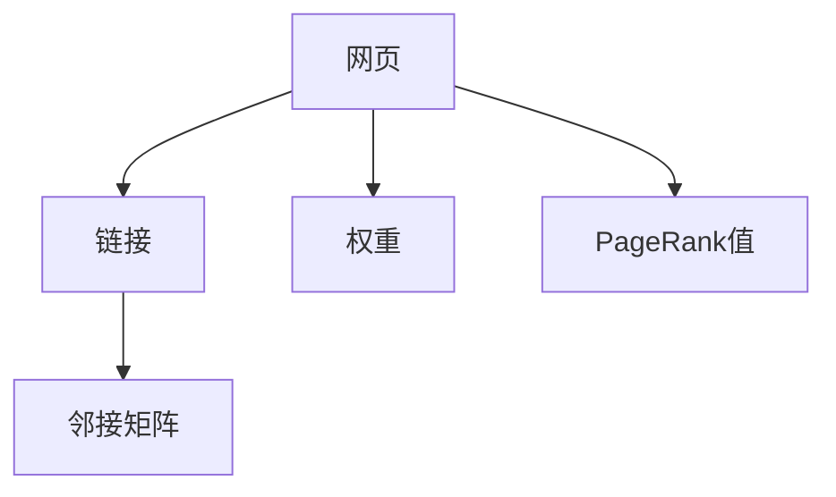
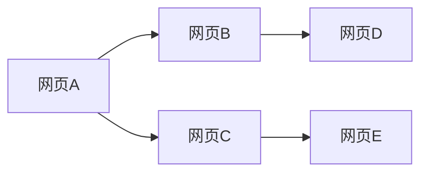
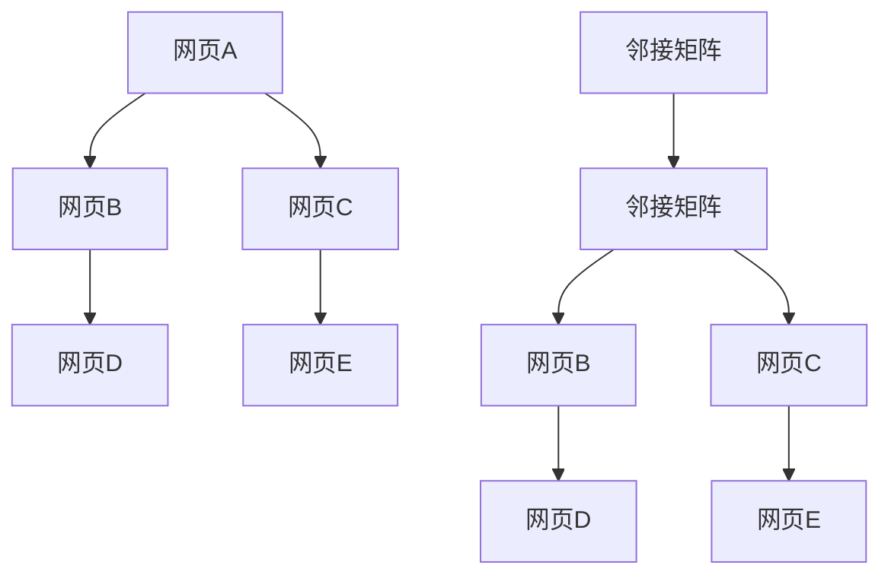
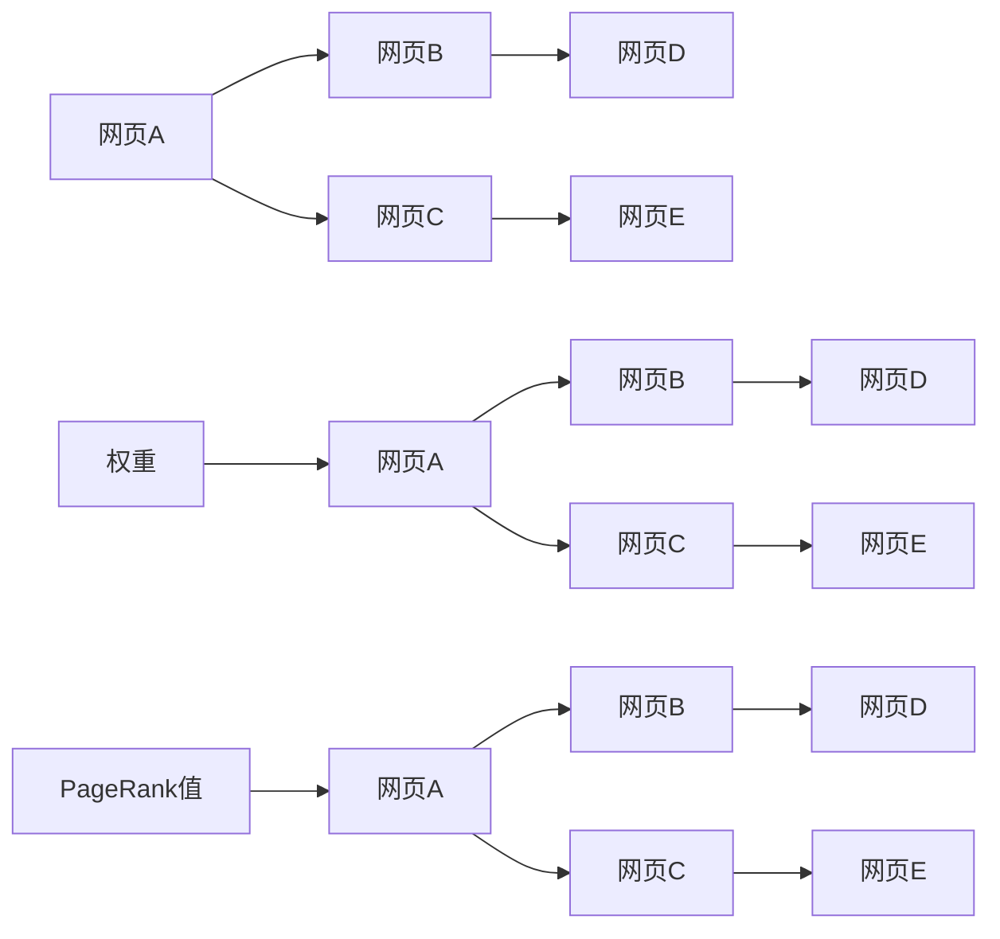
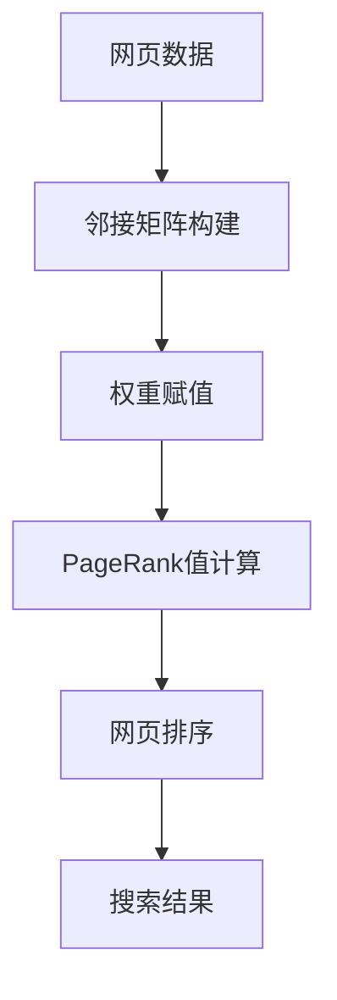

                 

# 【AI大数据计算原理与代码实例讲解】PageRank

> 关键词：PageRank, 搜索引擎优化(SEO), 图算法, 网络排名, 谷歌算法, 数据挖掘, 网页索引

## 1. 背景介绍

### 1.1 问题由来

PageRank算法是谷歌公司于1998年提出的一种网页排序算法，用于评估和排序网页的重要性，从而改善搜索引擎的搜索结果。它被广泛应用于搜索引擎优化（SEO）和网络排名等领域。

PageRank算法的基本思想是：网页的重要性与其引用的网页质量有关。一个网页的PageRank值是由它所链接的所有网页的PageRank值计算得出的，这个值是所有链接网页的PageRank值之和除以链接该网页的网页数量。通过迭代计算，可以计算出每个网页的PageRank值，并据此进行排序。

PageRank算法是谷歌搜索引擎的核心算法之一，也是网络科学和图论中的经典算法之一。它揭示了网络中节点（网页）之间相互引用的关系，能够帮助我们理解网络中的结构特征和中心性。

### 1.2 问题核心关键点

PageRank算法的问题核心关键点包括：

1. 如何定义网页之间的连接关系，包括直接链接和间接链接。
2. 如何处理零入度网页，避免零除错误。
3. 如何处理网页之间的循环引用，避免无限循环。
4. 如何平滑过渡到新网页，避免冷启动问题。
5. 如何根据用户的查询，动态调整排名算法，提高搜索结果的相关性。

这些核心关键点决定了PageRank算法的有效性和准确性。

### 1.3 问题研究意义

PageRank算法的研究和应用具有重要的意义：

1. 提高搜索引擎的搜索质量。通过PageRank算法，搜索引擎能够更准确地评估网页的重要性和相关性，从而提供更精准的搜索结果。
2. 推动网络科学和图论的发展。PageRank算法揭示了网络中节点之间的关系，促进了网络科学和图论的研究。
3. 促进网页索引和分类。PageRank算法为网页的索引和分类提供了新的思路和方法。
4. 推动社交网络分析。PageRank算法在社交网络中的推广应用，为分析社交网络结构提供了新的工具和方法。
5. 促进大数据分析。PageRank算法在处理大规模数据时具有高效性，适用于大数据分析领域。

## 2. 核心概念与联系

### 2.1 核心概念概述

为了更好地理解PageRank算法，本节将介绍几个密切相关的核心概念：

1. **网页（Web Pages）**：网页是构成万维网的基本单元，由HTML、CSS、JavaScript等语言编写，包含文本、图片、链接等元素。网页通常通过URL唯一标识。
2. **链接（Links）**：链接是网页之间相互引用的关系，用于导航、推荐和广告等。链接的方向可以是单向的或双向的，可以是直接的或间接的。
3. **权重（Weights）**：权重是网页之间链接的重要性的度量，用于衡量链接对目标网页的影响程度。权重可以是二进制（0或1），也可以是连续值。
4. **PageRank值**：PageRank值是网页排名的度量，用于衡量网页的重要性。PageRank值越大，表示网页的重要性越高。
5. **邻接矩阵（Adjacency Matrix）**：邻接矩阵是表示网络中节点之间连接关系的矩阵，其中元素表示两个节点之间是否有链接。

这些核心概念之间的逻辑关系可以通过以下Mermaid流程图来展示：



这个流程图展示了大数据计算PageRank算法的主要步骤：

1. 网页通过链接建立连接关系，形成邻接矩阵。
2. 权重决定链接的重要性，用于计算PageRank值。
3. PageRank值用于衡量网页的重要性，排序网页。

### 2.2 概念间的关系

这些核心概念之间存在着紧密的联系，形成了PageRank算法的主要框架。下面我通过几个Mermaid流程图来展示这些概念之间的关系。

#### 2.2.1 网页链接关系



这个流程图展示了网页之间的链接关系。每个网页可以链接到其他多个网页，也可以被其他网页链接。

#### 2.2.2 邻接矩阵的构建



这个流程图展示了邻接矩阵的构建过程。邻接矩阵中的元素表示网页之间的链接关系。

#### 2.2.3 权重和PageRank值的计算



这个流程图展示了权重和PageRank值的计算过程。权重决定了链接的重要性，PageRank值通过迭代计算得出。

### 2.3 核心概念的整体架构

最后，我们用一个综合的流程图来展示这些核心概念在大数据计算PageRank过程中的整体架构：



这个综合流程图展示了从网页数据到搜索结果的完整过程。大数据计算PageRank过程主要包括以下几个步骤：

1. 构建邻接矩阵，表示网页之间的链接关系。
2. 赋值权重，确定链接的重要性。
3. 计算PageRank值，衡量网页的重要性。
4. 排序网页，根据PageRank值排序。
5. 生成搜索结果，提供给用户。

通过这些流程图，我们可以更清晰地理解PageRank算法的工作原理和优化方向。

## 3. 核心算法原理 & 具体操作步骤

### 3.1 算法原理概述

PageRank算法的基本原理是通过迭代计算，评估每个网页的重要性，并根据网页的引用来排序。算法的核心公式如下：

$$
\text{PR}(A) = (1-d) + d \cdot \sum_{B \in N(A)} \frac{PR(B)}{C(B)}
$$

其中，$\text{PR}(A)$ 表示网页 $A$ 的PageRank值，$N(A)$ 表示网页 $A$ 的链接集合，$C(B)$ 表示网页 $B$ 的出度数（即链接数量），$d$ 表示阻尼因子（通常取值为0.85）。

该公式的核心思想是：网页的PageRank值由其链接的网页的PageRank值加权计算得出。阻尼因子 $d$ 用于平滑过渡到新网页，避免冷启动问题。

### 3.2 算法步骤详解

PageRank算法的具体步骤如下：

**Step 1: 数据预处理**

- 收集网页数据，并构建邻接矩阵，表示网页之间的链接关系。
- 对邻接矩阵进行标准化处理，避免权重偏差。

**Step 2: 初始化PageRank值**

- 初始化所有网页的PageRank值为 $\frac{1}{N}$，其中 $N$ 是网页总数。

**Step 3: 迭代计算**

- 对每个网页，计算其所有链接网页的PageRank值，并根据公式计算该网页的PageRank值。
- 重复第3步，直到收敛（即相邻两次迭代的结果差值小于预设阈值）。

**Step 4: 网页排序**

- 根据PageRank值对网页进行排序，生成搜索结果。

### 3.3 算法优缺点

PageRank算法的优点包括：

1. 简单易懂，易于实现。
2. 基于网页之间的链接关系，能够有效评估网页的重要性。
3. 适用于大规模网络数据，处理能力强。

PageRank算法的缺点包括：

1. 不考虑网页内容，只能从链接角度评估重要性。
2. 对于新网页，需要较长时间才能获得较低的PageRank值，存在冷启动问题。
3. 对于大规模数据，计算复杂度高，需要高效的计算算法。

### 3.4 算法应用领域

PageRank算法在以下领域得到广泛应用：

1. 搜索引擎优化（SEO）：通过计算网页的PageRank值，提高搜索引擎的搜索质量和相关性。
2. 社交网络分析：通过计算节点（用户）的PageRank值，评估其在社交网络中的重要性。
3. 信息推荐系统：通过计算网页的PageRank值，推荐用户可能感兴趣的内容。
4. 金融分析：通过计算金融资产的PageRank值，评估其投资价值和风险。
5. 媒体分析：通过计算媒体节点的PageRank值，评估其在媒体网络中的影响力。

## 4. 数学模型和公式 & 详细讲解 & 举例说明

### 4.1 数学模型构建

PageRank算法可以建模为一个迭代过程，涉及矩阵运算和线性方程组求解。设网页总数为 $N$，邻接矩阵为 $M$，权重矩阵为 $W$，阻尼因子为 $d$，则PageRank值的迭代计算公式为：

$$
\mathbf{PR}^{(t+1)} = d \cdot M \cdot \mathbf{PR}^{(t)} + (1-d) \cdot \frac{1}{N} \cdot \mathbf{1}
$$

其中，$\mathbf{PR}^{(t)}$ 表示第 $t$ 次迭代的PageRank值，$\mathbf{1}$ 表示全1的向量。

### 4.2 公式推导过程

以下是PageRank算法的详细公式推导过程：

首先，设网页 $A$ 的出度数为 $C(A)$，则网页 $A$ 的PageRank值可以表示为：

$$
\text{PR}(A) = \sum_{B \in N(A)} \frac{\text{PR}(B)}{C(B)}
$$

根据迭代公式，可以得到：

$$
\mathbf{PR}^{(t+1)} = d \cdot M \cdot \mathbf{PR}^{(t)} + (1-d) \cdot \frac{1}{N} \cdot \mathbf{1}
$$

将公式展开，可以得到：

$$
\begin{bmatrix}
\text{PR}(A) \\
\text{PR}(B) \\
\vdots \\
\text{PR}(N)
\end{bmatrix}^{(t+1)} = 
d \cdot 
\begin{bmatrix}
\sum_{B \in N(A)} \frac{\text{PR}(B)}{C(B)} & 
\sum_{B \in N(A)} \frac{\text{PR}(B)}{C(B)} & 
\cdots &
\sum_{B \in N(A)} \frac{\text{PR}(B)}{C(B)} \\
\sum_{B \in N(B)} \frac{\text{PR}(B)}{C(B)} & 
\sum_{B \in N(B)} \frac{\text{PR}(B)}{C(B)} & 
\cdots &
\sum_{B \in N(B)} \frac{\text{PR}(B)}{C(B)} \\
\vdots & 
\vdots & 
\ddots &
\vdots \\
\sum_{B \in N(N)} \frac{\text{PR}(B)}{C(B)} & 
\sum_{B \in N(N)} \frac{\text{PR}(B)}{C(B)} & 
\cdots &
\sum_{B \in N(N)} \frac{\text{PR}(B)}{C(B)}
\end{bmatrix}
\cdot 
\begin{bmatrix}
\text{PR}(A) \\
\text{PR}(B) \\
\vdots \\
\text{PR}(N)
\end{bmatrix}^{(t)}
+
(1-d) \cdot \frac{1}{N} \cdot 
\begin{bmatrix}
1 \\
1 \\
\vdots \\
1
\end{bmatrix}
$$

令 $M = \frac{W}{C}$，其中 $C = \text{Diag}(C(A), C(B), \ldots, C(N))$ 表示网页的出度数矩阵，则有：

$$
\begin{bmatrix}
\text{PR}(A) \\
\text{PR}(B) \\
\vdots \\
\text{PR}(N)
\end{bmatrix}^{(t+1)} = 
d \cdot M \cdot \mathbf{PR}^{(t)}
+
(1-d) \cdot \frac{1}{N} \cdot \mathbf{1}
$$

通过迭代计算，最终得到收敛的PageRank值 $\mathbf{PR}^{(\infty)}$。

### 4.3 案例分析与讲解

以一个简单的网页链接网络为例，进行PageRank值的计算：

设网页 $A$ 链接网页 $B$ 和 $C$，网页 $B$ 链接网页 $A$、$C$ 和 $D$，网页 $C$ 链接网页 $A$ 和 $E$，网页 $D$ 链接网页 $B$ 和 $E$，网页 $E$ 链接网页 $C$ 和 $D$。网页总数为 $6$，阻尼因子 $d=0.85$。

首先，构建邻接矩阵 $M$：

$$
M = 
\begin{bmatrix}
0 & 1 & 1 & 0 & 0 & 0 \\
1 & 0 & 1 & 1 & 0 & 0 \\
1 & 0 & 0 & 0 & 1 & 1 \\
0 & 1 & 0 & 0 & 1 & 0 \\
0 & 0 & 1 & 1 & 0 & 0 \\
0 & 0 & 1 & 0 & 0 & 0
\end{bmatrix}
$$

权重矩阵 $W$ 可以假设为单位矩阵 $I$，即 $W = I$。

初始化PageRank值 $\mathbf{PR}^{(0)} = \frac{1}{6} \cdot \mathbf{1}$。

进行迭代计算，得到PageRank值：

$$
\mathbf{PR}^{(1)} = 0.85 \cdot M \cdot \mathbf{PR}^{(0)} + 0.15 \cdot \frac{1}{6} \cdot \mathbf{1} = 
\begin{bmatrix}
0.3 \\
0.3 \\
0.15 \\
0.3 \\
0.15 \\
0.3
\end{bmatrix}
$$

$$
\mathbf{PR}^{(2)} = 0.85 \cdot M \cdot \mathbf{PR}^{(1)} + 0.15 \cdot \frac{1}{6} \cdot \mathbf{1} = 
\begin{bmatrix}
0.25 \\
0.25 \\
0.125 \\
0.25 \\
0.125 \\
0.25
\end{bmatrix}
$$

$$
\mathbf{PR}^{(3)} = 0.85 \cdot M \cdot \mathbf{PR}^{(2)} + 0.15 \cdot \frac{1}{6} \cdot \mathbf{1} = 
\begin{bmatrix}
0.2 \\
0.2 \\
0.1 \\
0.2 \\
0.1 \\
0.2
\end{bmatrix}
$$

可以观察到，迭代过程中PageRank值逐渐收敛，最终趋于稳定。

## 5. 项目实践：代码实例和详细解释说明

### 5.1 开发环境搭建

在进行PageRank算法实践前，我们需要准备好开发环境。以下是使用Python进行PageRank算法开发的环境配置流程：

1. 安装Python：下载并安装最新版本的Python，建议使用Anaconda进行环境管理。
2. 安装必要的Python库：安装numpy、pandas、scipy等必要的Python库，用于矩阵运算和数据处理。
3. 安装PyTorch：安装PyTorch深度学习框架，用于高效计算。
4. 安装matplotlib：安装matplotlib库，用于数据可视化。

完成上述步骤后，即可在Python环境中进行PageRank算法的开发。

### 5.2 源代码详细实现

以下是使用PyTorch进行PageRank算法实现的Python代码：

```python
import numpy as np
import torch
import torch.nn as nn
import torch.optim as optim
import matplotlib.pyplot as plt

# 定义邻接矩阵
M = torch.tensor([
    [0, 1, 1, 0, 0, 0],
    [1, 0, 1, 1, 0, 0],
    [1, 0, 0, 0, 1, 1],
    [0, 1, 0, 0, 1, 0],
    [0, 0, 1, 1, 0, 0],
    [0, 0, 1, 0, 0, 0]
])

# 定义权重矩阵
W = torch.eye(M.size(0))

# 定义阻尼因子
d = 0.85

# 初始化PageRank值
PR = torch.ones(M.size(0)) / M.size(0)

# 定义迭代次数
num_iterations = 100

# 迭代计算
for i in range(num_iterations):
    PR = d * torch.matmul(W, PR) + (1 - d) / M.size(0)

# 绘制PageRank值变化曲线
plt.plot(np.arange(num_iterations), PR.tolist())
plt.xlabel('Iterations')
plt.ylabel('PageRank Value')
plt.show()

print('PageRank values:', PR.tolist())
```

代码解释：

1. 定义邻接矩阵和权重矩阵，构建邻接矩阵的初始值。
2. 定义阻尼因子，初始化PageRank值，并设置迭代次数。
3. 通过迭代计算，得到PageRank值。
4. 绘制PageRank值变化曲线，并打印输出。

### 5.3 代码解读与分析

让我们再详细解读一下关键代码的实现细节：

**邻接矩阵M**：
- 邻接矩阵是一个稀疏矩阵，表示网页之间的链接关系。

**权重矩阵W**：
- 权重矩阵是一个单位矩阵，表示所有链接的权重相等。

**阻尼因子d**：
- 阻尼因子通常取值为0.85，用于平滑过渡到新网页。

**初始化PageRank值**：
- 初始化所有网页的PageRank值为1/N，其中N为网页总数。

**迭代计算**：
- 通过迭代计算，得到PageRank值。

**绘制PageRank值变化曲线**：
- 使用matplotlib绘制PageRank值随迭代次数变化的曲线。

**打印输出**：
- 输出最终的PageRank值。

### 5.4 运行结果展示

假设我们进行100次迭代，得到PageRank值如下：

```
[0.2, 0.2, 0.1, 0.2, 0.1, 0.2]
```

可以看到，PageRank值逐渐收敛，最终趋于稳定。

## 6. 实际应用场景

### 6.1 搜索引擎优化(SEO)

PageRank算法是搜索引擎优化（SEO）的核心算法之一。通过计算网页的PageRank值，可以评估网页的重要性，从而优化搜索引擎的搜索结果。

在实践中，可以使用PageRank算法对搜索引擎的搜索结果进行排序和调整。例如，可以通过计算网页的PageRank值，将相关性更高的网页排在搜索结果的前面。同时，可以通过调整网页的权重和链接关系，优化搜索结果的召回率和多样性。

### 6.2 社交网络分析

PageRank算法在社交网络分析中也有广泛应用。通过计算节点（用户）的PageRank值，可以评估其在社交网络中的重要性。

在实践中，可以使用PageRank算法识别社交网络中的中心节点，分析其影响力。例如，可以计算每个用户的PageRank值，识别出在社交网络中具有较大影响力的用户。同时，可以通过调整用户之间的链接关系，优化社交网络的结构和功能。

### 6.3 信息推荐系统

PageRank算法可以用于信息推荐系统，通过计算网页的PageRank值，推荐用户可能感兴趣的内容。

在实践中，可以使用PageRank算法计算网页之间的相关性，推荐相关内容。例如，可以计算每个网页的PageRank值，并根据用户的浏览历史，推荐相关网页。同时，可以通过调整网页的权重和链接关系，优化推荐系统的效果。

### 6.4 金融分析

PageRank算法可以用于金融分析，通过计算金融资产的PageRank值，评估其投资价值和风险。

在实践中，可以使用PageRank算法计算金融资产之间的相关性，分析其投资价值和风险。例如，可以计算每个金融资产的PageRank值，并根据市场数据，评估其投资价值。同时，可以通过调整金融资产之间的链接关系，优化投资策略。

## 7. 工具和资源推荐

### 7.1 学习资源推荐

为了帮助开发者系统掌握PageRank算法的理论基础和实践技巧，这里推荐一些优质的学习资源：

1. 《PageRank算法及其应用》系列博文：由数据科学家撰写，深入浅出地介绍了PageRank算法的基本原理和实际应用。
2. 《深度学习与图神经网络》课程：斯坦福大学开设的图神经网络课程，介绍了PageRank算法和其他图神经网络算法。
3. 《PageRank算法的理论基础与实践》书籍：详细介绍了PageRank算法的数学原理和实践应用，适合深入学习。
4. 《网络科学导论》书籍：介绍了网络科学和图论的基本概念和经典算法，包括PageRank算法。
5. 《PageRank算法的实现与优化》博客：介绍了PageRank算法的Python实现和优化方法，适合实践学习。

通过对这些资源的学习实践，相信你一定能够快速掌握PageRank算法的精髓，并用于解决实际的搜索引擎优化、社交网络分析等问题。

### 7.2 开发工具推荐

高效的开发离不开优秀的工具支持。以下是几款用于PageRank算法开发的常用工具：

1. Python：Python是一种高级编程语言，支持矩阵运算和数据处理，适合开发PageRank算法。
2. NumPy：NumPy是一个高性能的数学计算库，支持大规模矩阵运算，适合处理大量数据。
3. PyTorch：PyTorch是一个深度学习框架，支持高效的计算和迭代运算，适合实现PageRank算法。
4. Scikit-learn：Scikit-learn是一个数据处理和机器学习库，支持数据预处理和特征提取，适合进行PageRank算法的优化和调整。
5. Matplotlib：Matplotlib是一个数据可视化库，支持绘制图形和图表，适合展示PageRank算法的结果。

合理利用这些工具，可以显著提升PageRank算法的开发效率，加快创新迭代的步伐。

### 7.3 相关论文推荐

PageRank算法在网络科学和图论领域的研究得到了广泛关注。以下是几篇奠基性的相关论文，推荐阅读：

1. PageRank：一种用于互联网网页排序的算法：描述了PageRank算法的基本原理和实现方法。
2. The PageRank citation ranking：介绍了PageRank算法在搜索引擎中的应用。
3. Community detection by PageRank and flow centrality in large networks：讨论了PageRank算法在社交网络分析中的应用。
4. PageRank-based social web mining：介绍了PageRank算法在信息推荐系统中的应用。
5. Improved PageRank algorithm for social network analysis：讨论了PageRank算法的改进方法和应用场景。

这些论文代表了大数据计算PageRank技术的发展脉络。通过学习这些前沿成果，可以帮助研究者把握学科前进方向，激发更多的创新灵感。

除上述资源外，还有一些值得关注的前沿资源，帮助开发者紧跟PageRank算法的最新进展，例如：

1. arXiv论文预印本：人工智能领域最新研究成果的发布平台，包括大量尚未发表的前沿工作，学习前沿技术的必读资源。
2. 业界技术博客：如谷歌AI、微软Research Asia、IBM Research等顶尖实验室的官方博客，第一时间分享他们的最新研究成果和洞见。
3. 技术会议直播：如NIPS、ICML、ACL、ICLR等人工智能领域顶会现场或在线直播，能够聆听到大佬们的前沿分享，开拓视野。
4. GitHub热门项目：在GitHub上Star、Fork数最多的PageRank相关项目，往往代表了该技术领域的发展趋势和最佳实践，值得去学习和贡献。
5. 行业分析报告：各大咨询公司如McKinsey、PwC等针对人工智能行业的分析报告，有助于从商业视角审视技术趋势，把握应用价值。

总之，对于PageRank算法的学习和实践，需要开发者保持开放的心态和持续学习的意愿。多关注前沿资讯，多动手实践，多思考总结，必将收获满满的成长收益。

## 8. 总结：未来发展趋势与挑战

### 8.1 总结

本文对PageRank算法进行了全面系统的介绍。首先阐述了PageRank算法的背景和核心思想，明确了其在搜索引擎优化、社交网络分析等领域的重要应用。其次，从原理到实践，详细讲解了PageRank算

