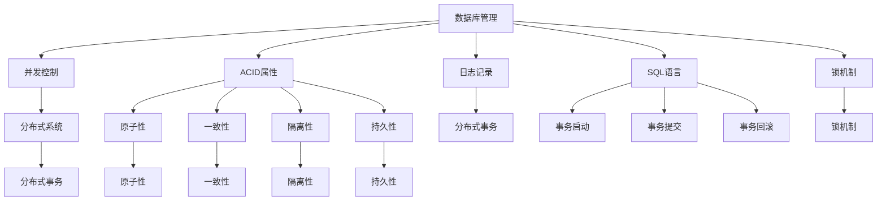
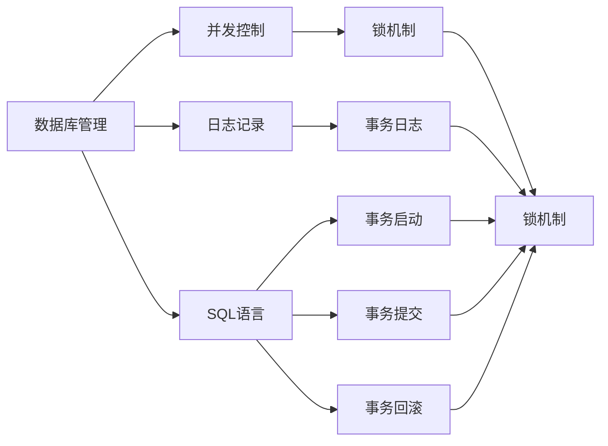
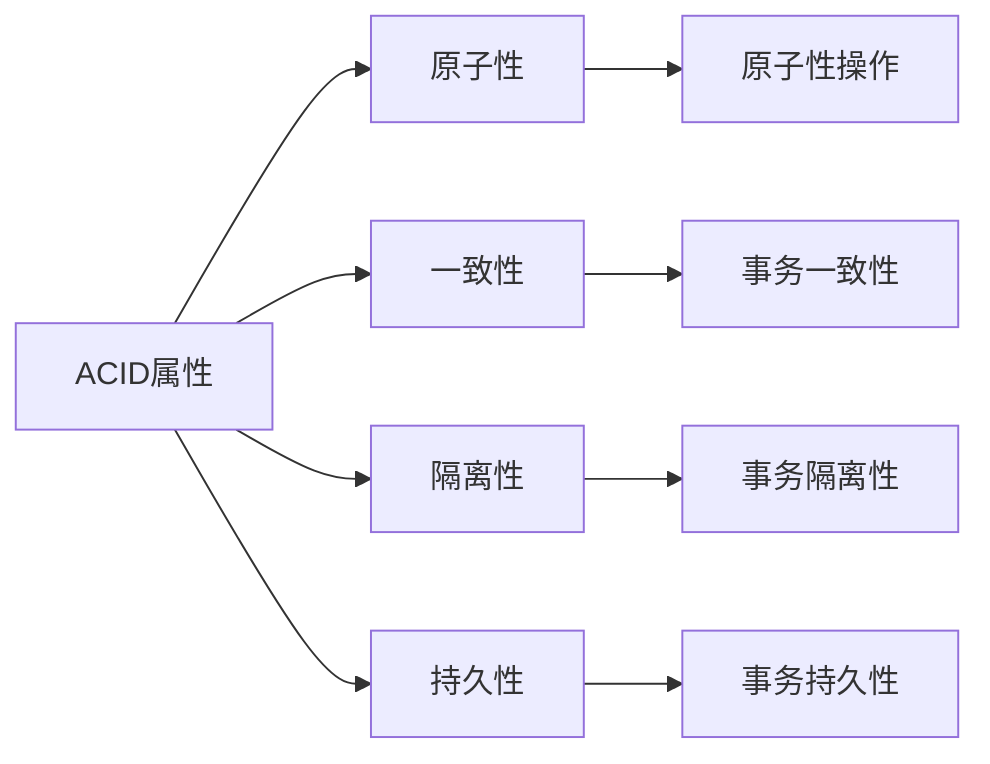
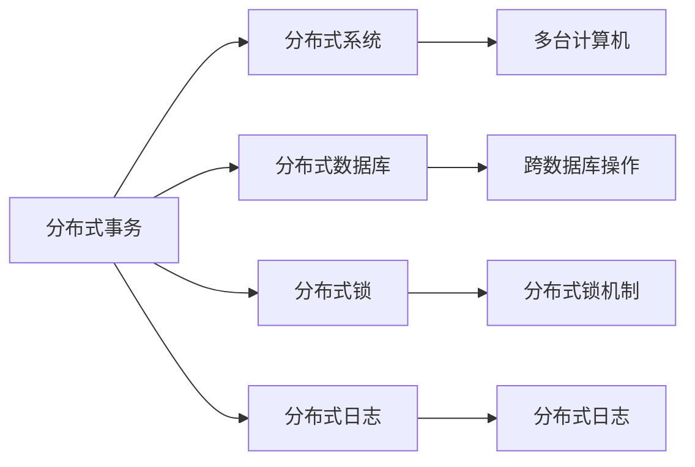
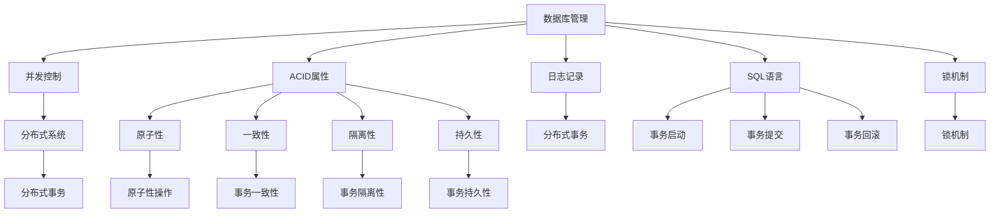

                 

# 【AI大数据计算原理与代码实例讲解】事务

> 关键词：
- 事务(Transaction)
- 数据库管理(Database Management)
- 并发控制(Concurrency Control)
- ACID属性(Atomicity, Consistency, Isolation, Durability)
- 日志记录(Logging)
- SQL语言(SQL)
- 锁机制(Lock Mechanism)
- 分布式系统(Distributed System)
- 分布式事务(Distributed Transactions)
- 容错性(Fault Tolerance)

## 1. 背景介绍

### 1.1 问题由来
在现代计算机系统中，数据管理和操作异常复杂。随着数据库的广泛应用，如何确保数据的完整性、一致性和可靠性，成为了系统设计中的核心问题。事务作为数据库管理的基本概念，用于描述一个完整的业务操作过程，保证操作序列的原子性、一致性、隔离性和持久性。本文将深入探讨事务的原理与实现方法，并结合代码实例进行讲解。

### 1.2 问题核心关键点
事务是数据库管理中保证数据一致性的重要机制。其核心思想是：将一系列操作作为一个整体，要么全部执行成功，要么全部执行失败，确保数据的完整性和一致性。事务的特性包括ACID属性，即原子性、一致性、隔离性和持久性。本文将重点讨论这些特性，并结合具体的代码实例进行讲解。

### 1.3 问题研究意义
深入理解事务的原理和实现方法，对于确保数据管理的可靠性和高效性具有重要意义。事务能够处理并发操作带来的冲突，避免数据不一致性，保障数据的完整性和一致性。此外，事务还为分布式系统中的数据一致性提供了解决方案，使系统能够处理更复杂的业务逻辑和数据操作。

## 2. 核心概念与联系

### 2.1 核心概念概述

为了更好地理解事务的原理与实现方法，本节将介绍几个密切相关的核心概念：

- 数据库管理(Database Management)：指对数据库的创建、维护、使用和优化等管理活动，包括数据模型设计、数据备份与恢复、性能优化等。
- 并发控制(Concurrency Control)：指在多个事务同时访问数据库时，保证数据的正确性和一致性的控制机制。
- ACID属性(Atomicity, Consistency, Isolation, Durability)：事务的四个关键特性，用于保证数据库操作的正确性和可靠性。
- 日志记录(Logging)：记录数据库操作的日志信息，用于故障恢复和事务的持久性。
- SQL语言(SQL)：用于数据库管理和操作的标准化语言，支持事务的启动、提交和回滚等操作。
- 锁机制(Lock Mechanism)：用于控制数据库操作的并发性，避免数据冲突。
- 分布式系统(Distributed System)：由多台计算机组成的网络系统，用于分布式事务的实现。
- 分布式事务(Distributed Transactions)：在分布式系统中，跨多个数据库进行的事务处理。
- 容错性(Fault Tolerance)：指系统在出现故障时，仍然能够继续正常运行的能力。

这些核心概念之间的逻辑关系可以通过以下Mermaid流程图来展示：



这个流程图展示了大数据管理系统的核心概念及其之间的关系：

1. 数据库管理通过并发控制、日志记录、SQL语言等技术，实现数据库操作的正确性和可靠性。
2. ACID属性是事务的四个关键特性，确保数据库操作的正确性和一致性。
3. 锁机制用于控制数据库操作的并发性，避免数据冲突。
4. 分布式系统支持分布式事务的实现，通过跨多个数据库进行事务处理。
5. 分布式事务依赖于日志记录和锁机制，保证数据的一致性和完整性。
6. 容错性通过冗余备份、故障恢复等技术，保障系统的稳定性和可靠性。

这些概念共同构成了数据库管理系统的核心机制，确保了数据操作的正确性和可靠性。通过理解这些核心概念，我们可以更好地把握数据库管理系统的工作原理和优化方向。

### 2.2 概念间的关系

这些核心概念之间存在着紧密的联系，形成了数据库管理系统的完整生态系统。下面我通过几个Mermaid流程图来展示这些概念之间的关系。

#### 2.2.1 数据库管理与并发控制的关系



这个流程图展示了数据库管理与并发控制的关系。数据库管理通过并发控制、日志记录、SQL语言等技术，实现数据库操作的正确性和可靠性。其中，锁机制用于控制数据库操作的并发性，避免数据冲突。事务日志记录了数据库操作的日志信息，用于故障恢复和事务的持久性。SQL语言支持事务的启动、提交和回滚等操作。

#### 2.2.2 ACID属性与事务的关系



这个流程图展示了ACID属性与事务的关系。原子性、一致性、隔离性和持久性是事务的四个关键特性，确保数据库操作的正确性和一致性。原子性指事务是一个原子操作，要么全部执行成功，要么全部失败。一致性指事务执行前后，数据库状态保持一致。隔离性指事务之间相互独立，不会影响其他事务的操作。持久性指事务提交后，其结果能够永久保存在数据库中。

#### 2.2.3 分布式事务与分布式系统的关系



这个流程图展示了分布式事务与分布式系统的关系。分布式事务是在分布式系统中，跨多个数据库进行的事务处理。分布式事务依赖于分布式数据库、分布式锁、分布式日志等技术，确保数据的一致性和完整性。其中，分布式锁用于控制跨数据库操作，避免数据冲突。分布式日志记录了跨数据库操作的信息，用于故障恢复和事务的持久性。

### 2.3 核心概念的整体架构

最后，我们用一个综合的流程图来展示这些核心概念在大数据管理系统中的整体架构：



这个综合流程图展示了从数据库管理到事务处理的完整过程。数据库管理通过并发控制、日志记录、SQL语言等技术，实现数据库操作的正确性和可靠性。ACID属性是事务的四个关键特性，确保数据库操作的正确性和一致性。锁机制用于控制数据库操作的并发性，避免数据冲突。分布式系统支持分布式事务的实现，通过跨多个数据库进行事务处理。分布式事务依赖于日志记录和锁机制，保证数据的一致性和完整性。通过这些流程图，我们可以更清晰地理解数据库管理系统的工作原理和优化方向。

## 3. 核心算法原理 & 具体操作步骤

### 3.1 算法原理概述

事务的原理基于ACID属性，确保数据库操作的正确性和一致性。其核心思想是：将一系列操作作为一个整体，要么全部执行成功，要么全部执行失败，确保数据的完整性和一致性。具体来说，事务的执行过程包括四个阶段：事务启动、事务执行、事务提交和事务回滚。

### 3.2 算法步骤详解

以下是事务处理的详细步骤：

**Step 1: 事务启动**
1. 用户提交一条SQL语句或命令，如INSERT、UPDATE、DELETE等。
2. 数据库管理系统解析SQL语句，进行权限检查和资源分配。
3. 如果SQL语句为事务启动命令（如BEGIN TRANSACTION），则进入事务处理阶段。

**Step 2: 事务执行**
1. 数据库管理系统为该事务分配一个唯一的ID，作为事务标记。
2. 事务开始执行SQL语句，并记录所有操作日志。
3. 事务执行过程中，数据库管理系统会记录所有操作日志，以备故障恢复和持久性使用。

**Step 3: 事务提交**
1. 事务执行完成后，用户提交COMMIT命令。
2. 数据库管理系统将操作日志写入事务日志。
3. 如果操作日志通过检查，则事务提交成功。

**Step 4: 事务回滚**
1. 如果事务执行过程中出现异常（如死锁、超时等），用户提交ROLLBACK命令。
2. 数据库管理系统撤销所有未提交的操作日志。
3. 数据库管理系统将操作日志写入事务日志，以备故障恢复和持久性使用。

### 3.3 算法优缺点

事务的优点包括：
1. 保证数据的完整性和一致性。
2. 提供事务的隔离性，避免数据冲突。
3. 支持分布式事务，提高系统的灵活性和扩展性。

事务的缺点包括：
1. 性能开销较大，需要记录和回滚操作日志。
2. 锁机制可能导致资源竞争，降低系统性能。
3. 分布式事务的复杂度较高，需要考虑跨数据库的同步和一致性问题。

### 3.4 算法应用领域

事务在数据库管理中有着广泛的应用，主要包括：
1. 银行业务：保证账户余额和交易记录的准确性。
2. 电子商务：保证订单和支付记录的一致性。
3. 金融系统：保证交易和清算记录的完整性。
4. 医疗系统：保证患者信息和病历记录的准确性。
5. 电信系统：保证通话记录和账单记录的完整性。

以上这些应用场景都需要保证数据的一致性和可靠性，事务的ACID属性为这些应用提供了有力的保障。

## 4. 数学模型和公式 & 详细讲解 & 举例说明

### 4.1 数学模型构建

事务的数学模型基于ACID属性，用于描述事务的启动、执行、提交和回滚过程。其核心思想是：将一系列操作作为一个整体，要么全部执行成功，要么全部执行失败，确保数据的完整性和一致性。

假设数据库中有n个事务在并发执行，每个事务的操作日志为${\log}_{i}$，事务的ID为${T}_{i}$。则事务的数学模型可以表示为：

$$
\begin{aligned}
\text{事务}_i &:\quad {T}_{i},\quad \text{操作日志}\quad {\log}_{i} \\
\text{事务启动} &:\quad \text{事务}_i \text{启动},\quad {\log}_{i} = ({\log}_{i_1}, {\log}_{i_2}, ..., {\log}_{i_n}) \\
\text{事务执行} &:\quad \text{事务}_i \text{执行},\quad {\log}_{i} = ({\log}_{i_1}, {\log}_{i_2}, ..., {\log}_{i_n}) \\
\text{事务提交} &:\quad \text{事务}_i \text{提交},\quad {\log}_{i} = ({\log}_{i_1}, {\log}_{i_2}, ..., {\log}_{i_n}) \\
\text{事务回滚} &:\quad \text{事务}_i \text{回滚},\quad {\log}_{i} = ({\log}_{i_1}, {\log}_{i_2}, ..., {\log}_{i_n})
\end{aligned}
$$

其中，${\log}_{i}$表示事务$i$的操作日志。事务启动、执行、提交和回滚的过程，都可以表示为一系列操作日志的记录和回滚。

### 4.2 公式推导过程

以下是事务的数学模型的公式推导过程：

1. 事务启动
$$
{\log}_{i_0} = ({\log}_{i_1}, {\log}_{i_2}, ..., {\log}_{i_n})
$$
其中，${\log}_{i_0}$表示事务$i$的启动日志。

2. 事务执行
$$
{\log}_{i} = ({\log}_{i_1}, {\log}_{i_2}, ..., {\log}_{i_n})
$$
其中，${\log}_{i}$表示事务$i$的执行日志。

3. 事务提交
$$
{\log}_{i} = ({\log}_{i_1}, {\log}_{i_2}, ..., {\log}_{i_n})
$$
其中，${\log}_{i}$表示事务$i$的提交日志。

4. 事务回滚
$$
{\log}_{i} = ({\log}_{i_1}, {\log}_{i_2}, ..., {\log}_{i_n})
$$
其中，${\log}_{i}$表示事务$i$的回滚日志。

### 4.3 案例分析与讲解

假设银行系统中有一个存款事务，事务的编号为${T}_{1}$。该事务包含两个操作日志：${\log}_{1_1}$和${\log}_{1_2}$。其中，${\log}_{1_1}$表示存款操作，${\log}_{1_2}$表示更新账户余额的操作。

事务的启动日志为：
$$
{\log}_{1_0} = ({\log}_{1_1}, {\log}_{1_2})
$$

事务的执行日志为：
$$
{\log}_{1} = ({\log}_{1_1}, {\log}_{1_2})
$$

事务的提交日志为：
$$
{\log}_{1} = ({\log}_{1_1}, {\log}_{1_2})
$$

事务的回滚日志为：
$$
{\log}_{1} = ({\log}_{1_1}, {\log}_{1_2})
$$

## 5. 项目实践：代码实例和详细解释说明

### 5.1 开发环境搭建

在进行事务处理实践前，我们需要准备好开发环境。以下是使用Python进行MySQL开发的环境配置流程：

1. 安装MySQL：从官网下载并安装MySQL，用于测试和存储数据。
2. 安装Python MySQL库：使用pip安装Python MySQL库，用于与MySQL数据库进行交互。

```bash
pip install mysql-connector-python
```

完成上述步骤后，即可在开发环境中进行事务处理的实现。

### 5.2 源代码详细实现

以下是使用Python实现事务处理的示例代码：

```python
import mysql.connector

# 连接MySQL数据库
cnx = mysql.connector.connect(user='root', password='password', database='test')
cursor = cnx.cursor()

# 启动事务
try:
    # 执行事务操作
    cursor.execute('INSERT INTO customers VALUES (1, "John", "Doe")')
    cursor.execute('UPDATE accounts SET balance = 100 WHERE id = 1')
    # 提交事务
    cursor.execute('COMMIT')
except mysql.connector.Error as err:
    # 回滚事务
    cursor.execute('ROLLBACK')
finally:
    # 关闭数据库连接
    cursor.close()
    cnx.close()
```

以上代码实现了从连接MySQL数据库，启动事务，执行SQL操作，提交或回滚事务，最后关闭数据库连接的完整流程。事务的处理主要通过try-except-finally结构实现，确保事务的正确性和一致性。

### 5.3 代码解读与分析

让我们再详细解读一下关键代码的实现细节：

**MySQL连接**：
- 使用mysql.connector库连接MySQL数据库，需要提供数据库的用户名、密码和数据库名。
- 在连接成功后，使用cursor对象进行SQL操作。

**事务处理**：
- 使用try-except-finally结构，确保事务的正确性和一致性。
- 事务的启动、执行、提交和回滚都通过try-except-finally结构实现。
- 在try块中执行SQL操作，如果出现异常，则回滚事务，否则提交事务。

**关闭连接**：
- 在finally块中关闭数据库连接，确保资源释放和性能优化。
- 关闭cursor和cnx连接，释放数据库资源。

**事务日志记录**：
- 在执行SQL操作时，自动记录事务日志。
- 在提交事务时，将事务日志写入数据库，用于故障恢复和持久性使用。

**故障恢复**：
- 在回滚事务时，撤销所有未提交的操作日志。
- 将事务日志写入数据库，用于故障恢复和持久性使用。

**性能优化**：
- 在finally块中关闭数据库连接，确保资源释放和性能优化。
- 在事务处理过程中，使用try-except-finally结构，确保事务的正确性和一致性。

**代码实践**：
- 在实际应用中，可以将事务处理封装成函数，方便复用和调用。
- 可以结合MySQL的事务管理功能，实现更高级的事务控制。
- 可以结合分布式事务技术，实现跨多个数据库的事务处理。

## 6. 实际应用场景

### 6.1 银行系统

事务在银行系统中有着广泛的应用，例如账户存款、转账、取款等操作。银行系统需要保证账户余额和交易记录的准确性，事务的ACID属性为这些应用提供了有力的保障。

在银行系统中，每个账户的操作都是作为一个事务进行的。例如，当用户进行一笔存款操作时，系统会启动一个事务，将存款金额更新到账户余额中，并记录操作日志。如果操作成功，则提交事务，否则回滚事务，确保账户余额和交易记录的一致性。

### 6.2 电商平台

事务在电商平台中也有着广泛的应用，例如订单支付、库存更新、物流跟踪等操作。电商平台需要保证订单和支付记录的一致性，事务的ACID属性为这些应用提供了有力的保障。

在电商平台中，每个订单的操作都是作为一个事务进行的。例如，当用户下单购买商品时，系统会启动一个事务，更新库存和订单状态，并记录操作日志。如果操作成功，则提交事务，否则回滚事务，确保订单和支付记录的一致性。

### 6.3 医疗系统

事务在医疗系统中也有着广泛的应用，例如患者信息管理、病历记录等操作。医疗系统需要保证患者信息和病历记录的准确性，事务的ACID属性为这些应用提供了有力的保障。

在医疗系统中，每个患者的信息管理都是作为一个事务进行的。例如，当医生录入患者的病历记录时，系统会启动一个事务，将病历信息更新到数据库中，并记录操作日志。如果操作成功，则提交事务，否则回滚事务，确保患者信息和病历记录的一致性。

### 6.4 未来应用展望

未来，事务将会在更多领域得到应用，为数据一致性和可靠性提供有力的保障。随着数据库技术的发展和应用场景的拓展，事务的应用将会更加广泛，涵盖更多的行业和业务。

在智慧医疗领域，事务将保障患者信息和病历记录的准确性，支持医疗数据的一致性处理。在智能城市领域，事务将保障交通管理和公共安全数据的准确性，支持城市数据的一致性处理。在金融领域，事务将保障交易记录和账务数据的准确性，支持金融数据的可靠性处理。

总之，事务是大数据管理系统的重要组成部分，能够保证数据的一致性和可靠性，为各种应用场景提供有力的保障。未来，随着事务技术的发展和应用场景的拓展，事务将会在更多领域发挥重要作用，推动大数据管理系统的普及和应用。

## 7. 工具和资源推荐

### 7.1 学习资源推荐

为了帮助开发者系统掌握事务的原理与实现方法，这里推荐一些优质的学习资源：

1. 《MySQL官方文档》：MySQL官方提供的文档，详细介绍了MySQL数据库的事务管理功能和操作技巧。
2. 《Database Management Systems》（数据库系统概论）：一本经典的计算机科学教材，介绍了数据库管理系统的事务处理机制和算法。
3. 《SQL必知必会》：一本实用的MySQL教程，详细介绍了MySQL数据库的事务处理功能和操作技巧。
4. 《Transaction Processing: Concepts and Techniques》：一本经典的计算机科学教材，详细介绍了事务处理的原理和实现方法。
5. 《Hadoop分布式系统核心设计与实现》：一本介绍Hadoop事务处理的经典著作，详细介绍了Hadoop分布式事务的原理和实现方法。

通过对这些资源的学习实践，相信你一定能够系统掌握事务的原理和实现方法，并用于解决实际的NLP问题。

### 7.2 开发工具推荐

高效的开发离不开优秀的工具支持。以下是几款用于MySQL开发的工具：

1. MySQL Workbench：一个流行的MySQL管理工具，支持可视化界面和SQL查询，方便开发和调试。
2. Navicat：一款功能强大的MySQL管理工具，支持可视化界面和SQL查询，方便开发和调试。
3. phpMyAdmin：一个基于Web的MySQL管理工具，支持可视化界面和SQL查询，方便开发和调试。
4. HeidiSQL：一款轻量级的MySQL管理工具，支持可视化界面和SQL查询，方便开发和调试。
5. DBeaver：一款功能强大的数据库管理工具，支持可视化界面和SQL查询，方便开发和调试。

合理利用这些工具，可以显著提升MySQL事务处理的开发效率，加快创新迭代的步伐。

### 7.3 相关论文推荐

事务在大数据管理系统中的应用已经吸引了众多学者的关注，以下是几篇奠基性的相关论文，推荐阅读：

1. 《ACID Transactions: A Survey》：一篇综述性的论文，详细介绍了事务处理的原理和实现方法。
2. 《The Multi-Version Database System》：一篇经典的计算机科学论文，介绍了多版本数据库系统的原理和实现方法。
3. 《Database Transactions》：一本经典的计算机科学教材，详细介绍了事务处理的原理和实现方法。
4. 《Distributed Transactions》：一本经典的计算机科学教材，详细介绍了分布式事务处理的原理和实现方法。
5. 《SQL事务处理》：一本经典的MySQL教程，详细介绍了MySQL数据库的事务处理功能和操作技巧。

这些论文代表了大数据管理系统的事务处理技术的发展脉络。通过学习这些前沿成果，可以帮助研究者把握学科前进方向，激发更多的创新灵感。

除上述资源外，还有一些值得关注的前沿资源，帮助开发者紧跟数据库管理系统的事务处理技术的最新进展，例如：

1. 《ACM Conference on Management of Data》（ACM数据库会议）：每年举办一次，汇集了众多数据库领域的研究者和实践者，展示最新的数据库技术进展。
2. 《International Conference on Data Engineering》（ICDE）：每年举办一次，涵盖数据库管理的各个方面，展示最新的数据库技术进展。
3. 《ACM Transaction on Management Information Systems》：一本国际顶级期刊，发表数据库管理系统的最新研究成果和应用实践。
4. 《IEEE Data Engineering》：一本国际顶级期刊，发表数据库管理系统的最新研究成果和应用实践。
5. 《ACM Transactions on Database Technology》：一本国际顶级期刊，发表数据库管理系统的最新研究成果和应用实践。

总之，对于数据库管理系统的事务处理技术的学习和实践，需要开发者保持开放的心态和持续学习的意愿。多关注前沿资讯，多动手实践，多思考总结，必将收获满满的成长收益。

## 8. 总结：未来发展趋势与挑战

### 8.1 研究成果总结

本文对数据库管理系统的事务处理原理与实现方法进行了全面系统的介绍。首先阐述了事务的原理与实现方法，详细讲解了事务的启动、执行、提交和回滚过程。其次，结合代码实例，对MySQL的事务处理过程进行了讲解。最后，分析了事务在实际应用场景中的作用，并展望了未来发展的趋势。

通过本文的系统梳理，可以看到，事务是数据库管理系统的重要组成部分，能够保证数据的一致性和可靠性，为各种应用场景提供有力的保障。事务的ACID属性为数据库管理系统提供了基本保障，是数据一致性处理的重要手段。

### 8.2 未来发展趋势

展望未来，数据库管理系统的事务处理技术将呈现以下几个发展趋势：

1. 分布式事务处理：随着分布式系统的普及，分布式事务处理将成为数据库管理系统的重要研究方向。分布式事务处理需要考虑跨数据库的同步和一致性问题，需要在性能和可靠性之间做出权衡。
2. 高并发事务处理：随着互联网和移动互联网的普及，高并发事务处理将成为数据库管理系统的重要研究方向。高并发事务处理需要考虑资源竞争、锁机制等问题，需要在性能和一致性之间做出权衡。
3. 事务管理自动化：随着人工智能技术的发展，事务管理自动化将成为数据库管理系统的重要研究方向。事务管理自动化需要考虑任务调度、资源分配等问题，需要实现自动化和智能化。


