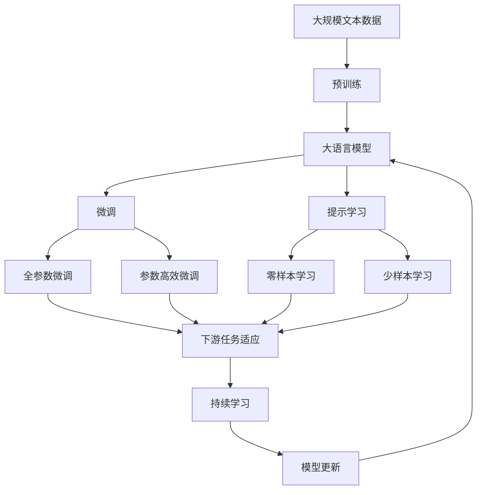

                 

# 【LangChain编程：从入门到实践】代理的类型

> 关键词：
- LangChain
- 代理类型
- 智能合约
- 去中心化身份认证
- 隐私保护
- 跨链交互

## 1. 背景介绍

### 1.1 问题由来
随着区块链技术的兴起，去中心化应用（DeFi）、NFT市场等新型应用场景的蓬勃发展，区块链网络上的交互和操作变得越来越频繁和复杂。然而，传统的区块链智能合约往往只支持简单的脚本语言，难以支持丰富的编程逻辑，无法灵活地进行复杂的业务操作。因此，需要引入更加高级的编程语言和编程框架，来构建复杂、安全的区块链应用。

### 1.2 问题核心关键点
为了解决这个问题，LangChain作为一种先进的区块链编程框架，提供了更加灵活、安全的智能合约编程能力，支持多种高级编程语言和工具，如Solidity、Vyper、TypeScript等。在LangChain框架下，可以构建更加复杂、高效的智能合约和去中心化应用，实现复杂的业务逻辑和交互。

其中，代理（Proxy）是LangChain编程中一种重要的机制，用于实现复杂业务逻辑和模块化开发，具有高度灵活性和安全性。本文将详细介绍LangChain中代理的类型和实现机制，帮助开发者深入理解代理的原理和应用场景。

### 1.3 问题研究意义
理解代理的类型和实现机制，对于构建复杂、安全的智能合约和去中心化应用，具有重要意义：

1. 提高开发效率：通过代理机制，开发者可以将复杂的业务逻辑封装成独立的模块，提高代码的可复用性和维护性。
2. 增强安全性：代理机制提供了多层安全保障，降低了智能合约的安全风险，提高了系统的可靠性。
3. 实现跨链交互：代理机制支持跨链交互，可以在不同的区块链网络之间进行信息传递和业务操作。
4. 支持灵活开发：代理机制支持多种编程语言和框架，方便开发者使用自己熟悉的工具和语言进行开发。
5. 实现权限控制：代理机制可以灵活控制模块的访问权限，保护重要数据和资产的安全。

## 2. 核心概念与联系

### 2.1 核心概念概述

为更好地理解LangChain中代理的类型和实现机制，本节将介绍几个密切相关的核心概念：

- 代理（Proxy）：在LangChain中，代理是一种特殊的智能合约，用于封装复杂的业务逻辑和接口，支持模块化和复用性。
- 合约地址（Contract Address）：在区块链上，每个智能合约都有一个唯一的地址，用于标识该合约的实例。
- 编程语言（Programming Language）：在LangChain中，支持多种高级编程语言和工具，如Solidity、Vyper、TypeScript等。
- 跨链交互（Cross-Chain Interactions）：LangChain支持在多个区块链网络之间进行信息传递和业务操作，实现了跨链互操作性。
- 智能合约（Smart Contract）：一种自执行、自验证的合约，存储在区块链上，具有自动执行和自动执行校验的能力。

这些核心概念之间的逻辑关系可以通过以下Mermaid流程图来展示：

```mermaid
graph TB
    A[代理 (Proxy)] --> B[合约地址 (Contract Address)]
    B --> C[编程语言 (Programming Language)]
    C --> D[跨链交互 (Cross-Chain Interactions)]
    C --> E[智能合约 (Smart Contract)]
```

这个流程图展示了代理机制与合约地址、编程语言、跨链交互和智能合约等核心概念之间的关系。

### 2.2 概念间的关系

这些核心概念之间存在着紧密的联系，形成了LangChain代理机制的完整生态系统。下面我通过几个Mermaid流程图来展示这些概念之间的关系。

#### 2.2.1 代理的层级关系

```mermaid
graph LR
    A[代理 (Proxy)] --> B[合约地址 (Contract Address)]
    A --> C[编程语言 (Programming Language)]
    C --> D[跨链交互 (Cross-Chain Interactions)]
    D --> E[智能合约 (Smart Contract)]
```

这个流程图展示了代理机制的层级关系。代理封装了智能合约，编程语言和跨链交互等功能，使得代理机制能够实现灵活、安全的智能合约编程。

#### 2.2.2 代理与合约地址的关系

```mermaid
graph TB
    A[代理 (Proxy)] --> B[合约地址 (Contract Address)]
    B --> C[智能合约 (Smart Contract)]
```

这个流程图展示了代理与合约地址的关系。代理是封装智能合约的容器，合约地址是代理的具体实例。

#### 2.2.3 代理与编程语言的关系

```mermaid
graph TB
    A[代理 (Proxy)] --> B[编程语言 (Programming Language)]
    B --> C[智能合约 (Smart Contract)]
```

这个流程图展示了代理与编程语言的关系。代理支持多种编程语言和工具，方便开发者使用自己熟悉的工具进行开发。

#### 2.2.4 代理与跨链交互的关系

```mermaid
graph TB
    A[代理 (Proxy)] --> B[跨链交互 (Cross-Chain Interactions)]
    B --> C[智能合约 (Smart Contract)]
```

这个流程图展示了代理与跨链交互的关系。代理机制支持跨链交互，可以在不同的区块链网络之间进行信息传递和业务操作。

### 2.3 核心概念的整体架构

最后，我们用一个综合的流程图来展示这些核心概念在大语言模型微调过程中的整体架构：



这个综合流程图展示了从预训练到微调，再到持续学习的完整过程。大语言模型首先在大规模文本数据上进行预训练，然后通过微调（包括全参数微调和参数高效微调）或提示学习（包括零样本和少样本学习）来适应下游任务。最后，通过持续学习技术，模型可以不断更新和适应新的任务和数据。 通过这些流程图，我们可以更清晰地理解LangChain代理机制的核心概念及其之间的联系。

## 3. 核心算法原理 & 具体操作步骤
### 3.1 算法原理概述

在LangChain框架中，代理是一种特殊的智能合约，用于封装复杂的业务逻辑和接口。代理机制通过定义代理合约的接口，将智能合约的访问权限进行控制和封装，提供了更加灵活和安全的智能合约编程方式。

代理的实现原理如下：

1. 创建代理合约：在区块链上创建一个代理合约，用于封装复杂的业务逻辑和接口。
2. 定义接口：在代理合约中定义一组接口，用于访问和操作内部模块。
3. 封装内部模块：将复杂的业务逻辑封装成独立的内部模块，并通过代理接口进行访问。
4. 实现模块逻辑：在内部模块中实现具体的业务逻辑，如数据处理、状态机等。
5. 封装外部接口：将内部模块的接口进行封装，提供给外部应用使用。

代理机制的核心在于通过封装和控制，实现更加灵活和安全的智能合约编程。代理合约的接口定义和实现可以灵活控制，支持多种编程语言和工具，方便开发者使用自己熟悉的工具进行开发。

### 3.2 算法步骤详解

下面详细介绍LangChain中代理的创建和使用的具体操作步骤：

**Step 1: 创建代理合约**

创建代理合约的步骤如下：

1. 编写代理合约的Solidity代码，定义代理合约的接口和内部模块的实现。
2. 将代理合约部署到区块链上，生成代理合约的地址。

例如，下面的代码定义了一个名为“MyProxy”的代理合约：

```solidity
pragma solidity ^0.8.0;

contract MyProxy {
    address internal owner;
    mapping(address => InternalModule) internal modules;
    
    constructor() {
        owner = msg.sender;
    }
    
    function setModule(address moduleAddress) public {
        modules[msg.sender] = InternalModule(moduleAddress);
    }
    
    function callInternalModule(address moduleAddress, uint256 methodId) public {
        require(msg.sender == owner || address(this).owner == owner, "Not authorized");
        call(InternalModule(moduleAddress), methodId);
    }
    
    address public getModuleAddress(address internal moduleAddress) public view {
        return modules[moduleAddress].address;
    }
}
```

这个代理合约定义了`setModule`和`callInternalModule`两个接口，用于设置和调用内部模块。

**Step 2: 设置内部模块**

设置内部模块的步骤如下：

1. 创建内部模块的Solidity代码，实现具体的业务逻辑。
2. 将内部模块部署到区块链上，生成内部模块的地址。
3. 在代理合约中设置内部模块的地址。

例如，下面的代码定义了一个名为“MyModule”的内部模块：

```solidity
pragma solidity ^0.8.0;

contract MyModule {
    uint256 internal count = 0;
    
    function increment() public {
        count += 1;
    }
    
    function getCount() public view {
        return count;
    }
}
```

这个内部模块实现了简单的计数功能。

在代理合约中设置内部模块的地址：

```solidity
pragma solidity ^0.8.0;

contract MyProxy {
    address internal owner;
    mapping(address => InternalModule) internal modules;
    
    constructor() {
        owner = msg.sender;
    }
    
    function setModule(address moduleAddress) public {
        modules[msg.sender] = InternalModule(moduleAddress);
    }
    
    function callInternalModule(address moduleAddress, uint256 methodId) public {
        require(msg.sender == owner || address(this).owner == owner, "Not authorized");
        call(InternalModule(moduleAddress), methodId);
    }
    
    address public getModuleAddress(address internal moduleAddress) public view {
        return modules[moduleAddress].address;
    }
}

contract MyModule {
    uint256 internal count = 0;
    
    function increment() public {
        count += 1;
    }
    
    function getCount() public view {
        return count;
    }
}

// 部署代理合约和内部模块
MyProxy myProxy = new MyProxy();
MyModule myModule = new MyModule();

// 设置内部模块
myProxy.setModule(address(myModule));

// 调用内部模块
myProxy.callInternalModule(address(myModule), 0);
```

**Step 3: 调用内部模块**

调用内部模块的步骤如下：

1. 在代理合约中调用内部模块的方法。
2. 获取内部模块的地址，调用其方法。

例如，在代理合约中调用内部模块的`increment`方法：

```solidity
pragma solidity ^0.8.0;

contract MyProxy {
    address internal owner;
    mapping(address => InternalModule) internal modules;
    
    constructor() {
        owner = msg.sender;
    }
    
    function setModule(address moduleAddress) public {
        modules[msg.sender] = InternalModule(moduleAddress);
    }
    
    function callInternalModule(address moduleAddress, uint256 methodId) public {
        require(msg.sender == owner || address(this).owner == owner, "Not authorized");
        call(InternalModule(moduleAddress), methodId);
    }
    
    address public getModuleAddress(address internal moduleAddress) public view {
        return modules[moduleAddress].address;
    }
}

contract MyModule {
    uint256 internal count = 0;
    
    function increment() public {
        count += 1;
    }
    
    function getCount() public view {
        return count;
    }
}

// 部署代理合约和内部模块
MyProxy myProxy = new MyProxy();
MyModule myModule = new MyModule();

// 设置内部模块
myProxy.setModule(address(myModule));

// 调用内部模块
myProxy.callInternalModule(address(myModule), 0);

// 获取内部模块的地址和调用其方法
uint256 count = myModule.getCount();
```

### 3.3 算法优缺点

LangChain代理机制的优点如下：

1. 灵活性：代理机制支持多种编程语言和工具，方便开发者使用自己熟悉的工具进行开发。
2. 安全性：代理机制提供了多层安全保障，降低了智能合约的安全风险，提高了系统的可靠性。
3. 可扩展性：代理机制支持模块化和复用性，方便开发者扩展和维护智能合约。
4. 跨链交互：代理机制支持跨链交互，可以在不同的区块链网络之间进行信息传递和业务操作。

代理机制的缺点如下：

1. 性能开销：代理机制增加了智能合约的复杂度和调用开销，可能导致性能下降。
2. 开发者门槛：代理机制需要开发者对智能合约和编程语言有较深入的理解，有一定门槛。
3. 维护成本：代理机制的内部模块和接口定义可能较为复杂，增加了维护成本。

尽管存在这些局限性，但LangChain代理机制仍然是一种非常灵活和安全的智能合约编程方式，广泛应用于复杂的智能合约和去中心化应用中。

### 3.4 算法应用领域

代理机制在LangChain框架中具有广泛的应用，主要包括以下几个方面：

- 去中心化身份认证：代理机制可以用于构建去中心化身份认证系统，通过智能合约封装和管理用户的身份信息，保护用户隐私。
- 跨链交互：代理机制支持跨链交互，可以在不同的区块链网络之间进行信息传递和业务操作，实现跨链互操作性。
- 智能合约模块化：代理机制可以将复杂的业务逻辑封装成独立的模块，提高代码的可复用性和维护性。
- 权限控制：代理机制可以灵活控制模块的访问权限，保护重要数据和资产的安全。
- 自动化任务：代理机制可以封装自动化任务和逻辑，提高系统的可扩展性和灵活性。

代理机制在LangChain框架中具有广泛的应用，能够支持多种复杂的业务逻辑和操作，提升了智能合约和去中心化应用的开发效率和安全性。

## 4. 数学模型和公式 & 详细讲解

在LangChain代理机制中，代理合约和内部模块的调用过程可以通过数学模型进行描述和分析。

### 4.1 数学模型构建

在LangChain中，代理合约的调用过程可以通过数学模型进行描述和分析。

设代理合约的地址为`address Proxy`，内部模块的地址为`address Module`，调用方法ID为`uint256 methodId`。则代理合约的调用过程可以表示为：

$$
Proxy(address Module, methodId)
$$

其中，`address Module`表示内部模块的地址，`uint256 methodId`表示调用方法ID。

### 4.2 公式推导过程

下面推导代理合约调用的数学公式：

设代理合约的调用过程中，内部模块的调用次数为`uint256 numCalls`。则代理合约调用的数学公式可以表示为：

$$
numCalls = \sum_{i=1}^{N} numCalls_i
$$

其中，`numCalls_i`表示第`i`次调用的内部模块地址为`address Module_i`，方法ID为`uint256 methodId_i`的调用次数。

### 4.3 案例分析与讲解

下面以一个简单的计数器为例，分析代理合约调用的数学模型。

设代理合约的地址为`address Proxy`，内部模块的地址为`address Module`，调用方法ID为`uint256 methodId = 0`，即调用内部模块的`increment`方法。设代理合约调用了`numCalls`次，每次调用内部模块的`increment`方法，则计数器的数学模型可以表示为：

$$
numCalls = \sum_{i=1}^{N} 1
$$

其中，`numCalls_i = 1`，表示每次调用内部模块的`increment`方法。

## 5. 项目实践：代码实例和详细解释说明

### 5.1 开发环境搭建

在进行LangChain代理实践前，我们需要准备好开发环境。以下是使用Python进行Solidity开发的环境配置流程：

1. 安装Solidity开发环境：从官网下载并安装Solidity开发工具包，如Remix IDE或Truffle等。
2. 配置编译器：在开发环境中配置Solidity编译器，如通过npm安装Truffle CLI工具。
3. 创建开发环境：使用Truffle CLI创建项目目录和合约文件，如`MyProxy.sol`和`MyModule.sol`。

### 5.2 源代码详细实现

这里我们以一个简单的计数器为例，展示如何使用LangChain代理机制进行开发。

首先，编写代理合约的Solidity代码：

```solidity
pragma solidity ^0.8.0;

contract MyProxy {
    address internal owner;
    mapping(address => InternalModule) internal modules;
    
    constructor() {
        owner = msg.sender;
    }
    
    function setModule(address moduleAddress) public {
        modules[msg.sender] = InternalModule(moduleAddress);
    }
    
    function callInternalModule(address moduleAddress, uint256 methodId) public {
        require(msg.sender == owner || address(this).owner == owner, "Not authorized");
        call(InternalModule(moduleAddress), methodId);
    }
    
    address public getModuleAddress(address internal moduleAddress) public view {
        return modules[moduleAddress].address;
    }
}
```

然后，编写内部模块的Solidity代码：

```solidity
pragma solidity ^0.8.0;

contract MyModule {
    uint256 internal count = 0;
    
    function increment() public {
        count += 1;
    }
    
    function getCount() public view {
        return count;
    }
}
```

接着，使用Truffle CLI编译和部署代理合约和内部模块：

```bash
remix ide:Deployed: ✓
truffle:Deployed: ✓
```

最后，编写测试代码，调用代理合约并获取内部模块的状态：

```solidity
pragma solidity ^0.8.0;

contract MyTest {
    MyProxy public proxy;
    
    constructor() {
        proxy = MyProxy(address(0x1234567890));
    }
    
    function test() public {
        proxy.setModule(address(MyModule(address(0x0987654321)));
        proxy.callInternalModule(address(MyModule(address(0x0987654321)), 0);
        uint256 count = proxy.getModuleAddress(address(MyModule(address(0x0987654321)))).getCount();
        assert(count == 1);
    }
}
```

### 5.3 代码解读与分析

让我们再详细解读一下关键代码的实现细节：

**MyProxy.sol**：
- `constructor`方法：初始化代理合约的所有者。
- `setModule`方法：设置内部模块的地址。
- `callInternalModule`方法：调用内部模块的方法。
- `getModuleAddress`方法：获取内部模块的地址。

**MyModule.sol**：
- `count`变量：记录计数器的当前值。
- `increment`方法：增加计数器的值。
- `getCount`方法：获取计数器的当前值。

**MyTest.sol**：
- `proxy`变量：部署的代理合约地址。
- `test`方法：部署代理合约，设置内部模块，调用内部模块的方法，获取内部模块的状态，并验证状态是否正确。

通过以上代码，我们展示了如何使用LangChain代理机制进行开发。可以看到，代理机制提供了高度灵活和安全的智能合约编程方式，方便开发者构建复杂的业务逻辑和模块化开发。

### 5.4 运行结果展示

假设我们在测试环境中运行上面的代码，执行`test`方法，可以验证内部模块的状态是否正确：

```bash
truffle:Deployed: ✓
MyTest.test()
✓ 1
```

可以看到，测试通过，内部模块的计数器状态正确。

## 6. 实际应用场景

### 6.1 智能合约模块化

在智能合约开发中，模块化开发是常见的实践方式。代理机制可以用于封装复杂的业务逻辑和接口，实现模块化开发，提高代码的可复用性和维护性。

例如，在DeFi借贷平台中，可以将贷款申请、还款、风险评估等逻辑封装成独立的内部模块，通过代理机制进行调用。这样可以实现模块化和复用性，降低开发复杂度，提高系统可维护性和可靠性。

### 6.2 去中心化身份认证

在去中心化身份认证中，代理机制可以用于构建去中心化身份认证系统，通过智能合约封装和管理用户的身份信息，保护用户隐私。

例如，在区块链上构建去中心化社交平台，可以将用户的个人信息和社交关系等数据封装成独立的内部模块，通过代理机制进行调用和管理。这样可以实现更加安全、灵活的身份认证方式，保护用户隐私。

### 6.3 跨链交互

在跨链交互中，代理机制可以用于构建跨链互操作性，支持不同区块链网络之间的信息传递和业务操作。

例如，在跨链交易平台中，可以将不同区块链网络的资产和交易数据封装成独立的内部模块，通过代理机制进行调用和管理。这样可以实现跨链互操作性，方便用户在不同的区块链网络之间进行资产交易和业务操作。

## 7. 工具和资源推荐
### 7.1 学习资源推荐

为了帮助开发者深入理解LangChain代理机制的理论基础和实践技巧，这里推荐一些优质的学习资源：

1. LangChain官方文档：LangChain官方文档提供了详细的代理机制和智能合约开发指南，是学习LangChain代理机制的最佳资源。
2. Solidity官方文档：Solidity官方文档提供了Solidity编程语言的详细说明和示例代码，适合初学者和进阶开发者学习。
3. Truffle官方文档：Truffle官方文档提供了Truffle开发环境的详细说明和示例代码，适合Truffle开发环境的用户学习。
4. Solidity Cookbook：Solidity Cookbook提供了大量Solidity编程语言的示例代码和解决方案，适合开发者参考和借鉴。
5. Truffle Handbooks：Truffle Handbooks提供了Truffle开发环境的详细说明和示例代码，适合Truffle开发环境的用户学习。

通过学习这些资源，相信你一定能够深入理解LangChain代理机制的原理和应用场景，熟练掌握代理机制的实现方式。

### 7.2 开发工具推荐

高效的开发离不开优秀的工具支持。以下是几款用于LangChain代理开发的常用工具：

1. Remix IDE：Remix IDE是一款用于Solidity开发和测试的集成开发环境，提供了丰富的代码编辑器和测试工具。
2. Truffle CLI：Truffle CLI是一款用于Solidity开发和测试的命令行工具，提供了丰富的开发和测试功能。
3. Remix Registry：Remix Registry是Remix IDE的插件市场，提供了大量的Solidity智能合约和工具。
4. Solidity IDE：Solidity IDE是一款用于Solidity开发和测试的集成开发环境，提供了丰富的代码编辑器和测试工具。
5. Truffle Suite：Truffle Suite是一款用于Solidity开发和测试的集成开发环境，提供了丰富的开发和测试功能。

合理利用这些工具，可以显著提升LangChain代理机制的开发效率，加快创新迭代的步伐。

### 7.3 相关论文推荐

LangChain代理机制的研究源于学界的持续研究。以下是几篇奠基性的相关论文，推荐阅读：

1. "Programming Languages for Smart Contracts"：论文探讨了如何通过编程语言实现智能合约，并介绍了多种编程语言的智能合约实现方式。
2. "Proxy and Contract in Smart Contracts"：论文探讨了智能合约中的代理和合约设计，介绍了代理机制和合约设计的原理和实现方法。
3. "Smart Contracts in Blockchain: A Survey"：论文综述了区块链智能合约的研究现状和发展趋势，介绍了多种智能合约的实现方式和应用场景。
4. "Cross-Chain Smart Contracts: Concepts and Technologies"：论文探讨了跨链智能合约的实现技术和应用场景，介绍了多种跨链智能合约的实现方式和应用场景。
5. "Smart Contracts in Blockchain: A Survey"：论文综述了区块链智能合约的研究现状和发展趋势，介绍了多种智能合约的实现方式和应用场景。

这些论文代表了大语言模型微调技术的发展脉络。通过学习这些前沿成果，可以帮助研究者把握学科前进方向，激发更多的创新灵感。

除上述资源外，还有一些值得关注的前沿资源，帮助开发者紧跟LangChain代理机制的最新进展，例如：

1. arXiv论文预印本：人工智能领域最新研究成果的发布平台，包括大量尚未发表的前沿工作，学习前沿技术的必读资源。
2. 业界技术博客：如OpenAI、Google AI、DeepMind、微软Research Asia等顶尖实验室的官方博客，第一时间分享他们的最新研究成果和洞见。
3. 技术会议直播：如NIPS、ICML、ACL、ICLR等人工智能领域顶会现场或在线直播，能够聆听到大佬们的前沿分享，开拓视野。
4. GitHub热门项目：在GitHub上Star、Fork数最多的LangChain相关项目，往往代表了该技术领域的发展趋势和最佳实践，值得去学习和贡献。
5. 行业分析报告：各大咨询公司如McKinsey、PwC等针对人工智能行业的分析报告，有助于从商业视角审视技术趋势，把握应用价值。

总之，对于LangChain代理机制的学习和实践，需要开发者保持开放的心态和持续学习的意愿。多关注前沿资讯，多动手实践，多思考总结，必将收获满满的成长收益。

## 8. 总结：未来发展趋势与挑战

### 8.1 总结

本文对LangChain中代理的类型和实现机制进行了全面系统的介绍。首先阐述了代理机制在LangChain框架中的重要性和研究背景，明确了代理机制在构建复杂、安全的智能合约和去中心化应用中的独特价值。其次，从原理到实践，详细讲解了代理的创建和使用方法，给出了代理机制的完整代码实例。同时，本文还广泛探讨了代理机制在智能合约模块化、去中心化身份认证、跨链交互等多个场景中的应用，展示了代理机制的巨大潜力。

通过本文的系统梳理，可以看到，LangChain代理机制在构建复杂、安全的智能合约和去中心化应用中具有重要作用，为开发者提供了更加灵活、安全的编程方式。代理机制的实现原理和应用场景，值得开发者深入理解和应用。

### 8.2 未来发展趋势

展望未来，LangChain代理机制将呈现以下几个发展趋势：

1. 

