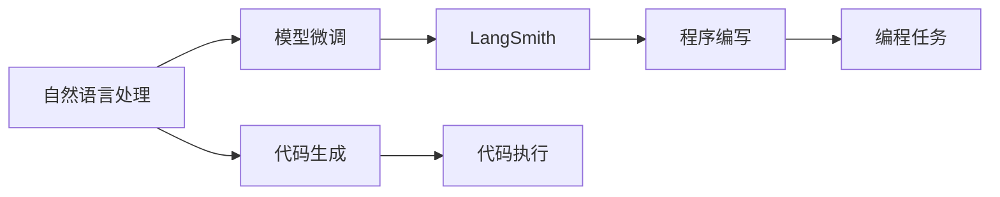
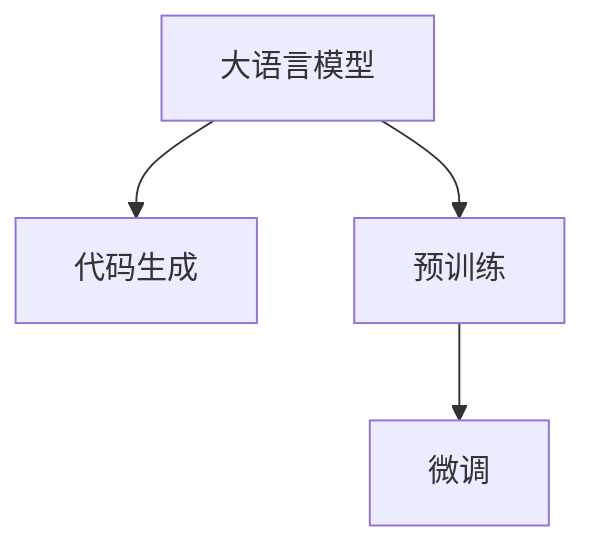
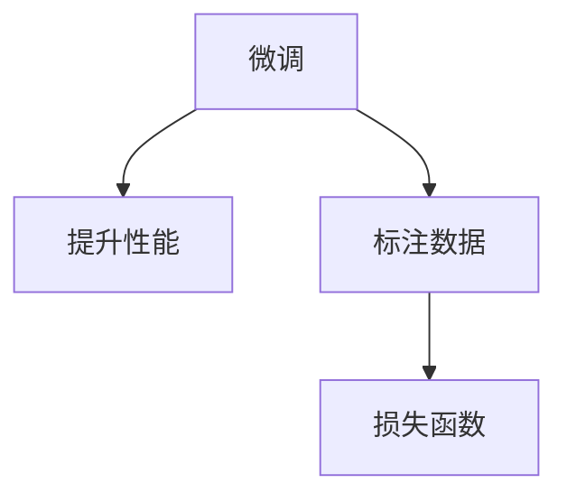
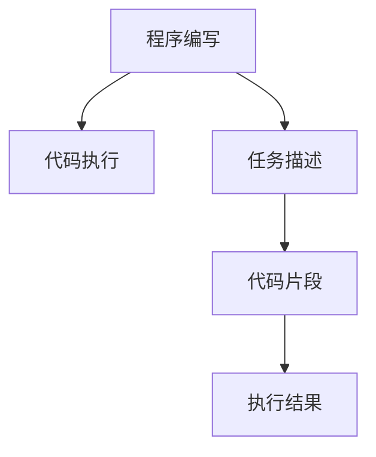

                 

# 【LangChain编程：从入门到实践】使用LangSmith进行观测

> 关键词：LangSmith, 大语言模型, 程序编写, 算法应用, 数据分析

## 1. 背景介绍

### 1.1 问题由来

近年来，随着深度学习技术的迅猛发展，人工智能（AI）领域涌现出许多前沿模型，其中大语言模型（Large Language Model, LLM）表现尤为突出。这些模型通过在大规模无标签文本数据上进行预训练，具备了强大的自然语言理解和生成能力。例如，ChatGPT和LLama等模型在生成对话、文本摘要、翻译等方面展现出卓越的性能。

然而，这些大语言模型虽然强大，但缺乏与程序执行的紧密结合，难以直接用于编写和执行程序代码。因此，亟需一种将自然语言处理和程序编写相结合的技术，以提升开发效率和代码质量。这一需求催生了LangChain项目，它是一个用于大语言模型和编程语言交互的开源框架，允许用户通过自然语言向模型描述代码编写任务，模型则生成或执行代码片段。

### 1.2 问题核心关键点

LangChain项目的主要目标在于：

1. 将自然语言处理和程序编写相结合，降低编程门槛。
2. 提供灵活的代码生成和执行功能，适应各种编程语言和应用场景。
3. 利用大语言模型的强大语言理解和生成能力，提升代码质量和生成效率。
4. 支持模型微调，以适应特定编程任务或语言特性。

为了实现上述目标，LangChain项目采用了基于Transformer的大语言模型，结合了自然语言理解和程序生成技术的思路，通过微调模型参数，使其具备执行特定编程任务的能力。本文将详细介绍LangSmith作为LangChain的核心模型，并探讨如何通过微调和观测技术，提升其在程序生成和执行方面的性能。

## 2. 核心概念与联系

### 2.1 核心概念概述

为更好地理解LangSmith模型及其微调过程，本节将介绍几个密切相关的核心概念：

- **LangSmith**：LangChain项目中用于编程任务的语言生成模型。它是基于Transformer架构的大语言模型，通过预训练在代码数据集上，能够理解并生成符合编程规范的代码片段。
- **自然语言处理（NLP）**：涉及计算机如何理解和处理自然语言的技术。
- **代码生成与执行**：使用编程语言描述计算任务，并生成可执行代码的过程。
- **模型微调**：在预训练模型的基础上，使用特定任务的数据进行有监督训练，以提高模型在该任务上的性能。
- **程序编写**：通过自然语言向模型描述任务，让模型自动生成或执行代码。

这些核心概念之间的逻辑关系可以通过以下Mermaid流程图来展示：



这个流程图展示了自然语言处理、代码生成、模型微调和程序编写之间的关系：

1. 自然语言处理技术用于理解任务描述。
2. 代码生成模型基于任务描述，生成符合编程规范的代码片段。
3. 模型微调使代码生成模型能够执行特定的编程任务。
4. 程序编写将任务描述转化为代码片段，进行执行或进一步优化。

### 2.2 概念间的关系

这些核心概念之间存在着紧密的联系，构成了LangChain项目的技术生态系统。下面我们通过几个Mermaid流程图来展示这些概念之间的关系。

#### 2.2.1 大语言模型与代码生成



这个流程图展示了大语言模型在代码生成中的应用。通过预训练获得基础的代码生成能力，微调进一步提高模型在特定编程任务上的表现。

#### 2.2.2 微调与模型性能提升



这个流程图展示了微调过程的目标是提升模型在特定任务上的性能。标注数据和损失函数是微调过程中必须考虑的因素。

#### 2.2.3 程序编写与代码执行



这个流程图展示了程序编写和代码执行的流程。任务描述用于生成代码片段，代码片段被执行后得到结果。

## 3. 核心算法原理 & 具体操作步骤
### 3.1 算法原理概述

LangSmith模型是一个基于Transformer的大语言模型，通过在大规模编程数据集上进行预训练，学习到编程语言的语法、语义和上下文信息。微调过程则是在预训练的基础上，使用特定编程任务的数据进行有监督训练，以提高模型在执行特定编程任务时的准确性和效率。

LangSmith的微调目标函数可以表示为：

$$
\min_{\theta} \frac{1}{N}\sum_{i=1}^{N}L(\theta,(x_i,y_i))
$$

其中，$\theta$为模型参数，$L$为损失函数，$(x_i,y_i)$为训练数据集中的输入-输出对，$N$为训练数据集的大小。常用的损失函数包括交叉熵损失、均方误差损失等。

### 3.2 算法步骤详解

基于LangSmith模型的微调一般包括以下几个关键步骤：

**Step 1: 准备数据集**
- 收集特定编程任务的数据集，确保数据集的多样性和质量。
- 将数据集划分为训练集、验证集和测试集。

**Step 2: 选择模型和框架**
- 选择适合任务的LangSmith模型或自定义模型。
- 使用如PyTorch、TensorFlow等深度学习框架搭建模型。

**Step 3: 设计任务适配层**
- 根据编程任务设计合适的输出层和损失函数。
- 对于分类任务，通常使用交叉熵损失函数。
- 对于生成任务，可以使用语言模型的解码器输出概率分布，并以负对数似然为损失函数。

**Step 4: 设置微调超参数**
- 选择合适的优化算法及其参数，如AdamW、SGD等，设置学习率、批大小、迭代轮数等。
- 设置正则化技术及强度，包括权重衰减、Dropout、Early Stopping等。
- 确定冻结预训练参数的策略，如仅微调顶层，或全部参数都参与微调。

**Step 5: 执行梯度训练**
- 将训练集数据分批次输入模型，前向传播计算损失函数。
- 反向传播计算参数梯度，根据设定的优化算法和学习率更新模型参数。
- 周期性在验证集上评估模型性能，根据性能指标决定是否触发Early Stopping。
- 重复上述步骤直到满足预设的迭代轮数或Early Stopping条件。

**Step 6: 测试和部署**
- 在测试集上评估微调后模型，对比微调前后的精度提升。
- 使用微调后的模型对新样本进行推理预测，集成到实际的应用系统中。
- 持续收集新的数据，定期重新微调模型，以适应数据分布的变化。

以上是基于LangSmith模型的微调的一般流程。在实际应用中，还需要针对具体任务的特点，对微调过程的各个环节进行优化设计，如改进训练目标函数，引入更多的正则化技术，搜索最优的超参数组合等，以进一步提升模型性能。

### 3.3 算法优缺点

基于LangSmith模型的微调方法具有以下优点：

1. **简单高效**：只需准备少量标注数据，即可对模型进行快速适配，获得较大的性能提升。
2. **通用适用**：适用于各种编程任务，设计简单的任务适配层即可实现微调。
3. **参数高效**：利用参数高效微调技术，在固定大部分预训练权重不变的情况下，仍可取得不错的提升。
4. **效果显著**：在学术界和工业界的诸多任务上，基于微调的方法已经刷新了最先进的性能指标。

同时，该方法也存在一定的局限性：

1. **依赖标注数据**：微调的效果很大程度上取决于标注数据的质量和数量，获取高质量标注数据的成本较高。
2. **迁移能力有限**：当目标任务与预训练数据的分布差异较大时，微调的性能提升有限。
3. **负面效果传递**：预训练模型的固有偏见、有害信息等，可能通过微调传递到下游任务，造成负面影响。
4. **可解释性不足**：微调模型的决策过程通常缺乏可解释性，难以对其推理逻辑进行分析和调试。

尽管存在这些局限性，但就目前而言，基于LangSmith的微调方法仍是大语言模型应用的最主流范式。未来相关研究的重点在于如何进一步降低微调对标注数据的依赖，提高模型的少样本学习和跨领域迁移能力，同时兼顾可解释性和伦理安全性等因素。

### 3.4 算法应用领域

基于LangSmith的微调方法已经在编程、代码生成、文档编写等多个领域得到了广泛的应用，例如：

- **代码生成**：将编程任务描述为自然语言，由LangSmith生成符合规范的代码片段。
- **自动化测试**：利用自然语言生成自动化测试用例，提升测试效率和覆盖率。
- **文档编写**：根据任务描述，自动生成API文档或项目说明，提升开发效率。
- **数据处理**：使用自然语言生成数据处理脚本，自动化数据清洗和预处理。
- **模型训练**：生成模型训练代码，自动化机器学习流程。

除了上述这些经典任务外，LangSmith的微调范式还适用于更多场景中，如可控代码生成、代码修复、文档摘要等，为编程技术的自动化发展带来了新的突破。

## 4. 数学模型和公式 & 详细讲解
### 4.1 数学模型构建

 LangSmith模型是一个基于Transformer的大语言模型，其预训练和微调过程的数学模型可以表示为：

$$
L(x, y) = -\frac{1}{N}\sum_{i=1}^{N} L_i(x_i, y_i)
$$

其中，$L$为损失函数，$N$为样本数量，$x_i$为输入样本，$y_i$为标签。常用的损失函数包括交叉熵损失和均方误差损失等。

### 4.2 公式推导过程

以下我们以二分类任务为例，推导交叉熵损失函数及其梯度的计算公式。

假设模型 $M_{\theta}$ 在输入 $x$ 上的输出为 $\hat{y}=M_{\theta}(x) \in [0,1]$，表示样本属于正类的概率。真实标签 $y \in \{0,1\}$。则二分类交叉熵损失函数定义为：

$$
\ell(M_{\theta}(x),y) = -[y\log \hat{y} + (1-y)\log (1-\hat{y})]
$$

将其代入经验风险公式，得：

$$
\mathcal{L}(\theta) = -\frac{1}{N}\sum_{i=1}^N [y_i\log M_{\theta}(x_i)+(1-y_i)\log(1-M_{\theta}(x_i))]
$$

根据链式法则，损失函数对参数 $\theta_k$ 的梯度为：

$$
\frac{\partial \mathcal{L}(\theta)}{\partial \theta_k} = -\frac{1}{N}\sum_{i=1}^N (\frac{y_i}{M_{\theta}(x_i)}-\frac{1-y_i}{1-M_{\theta}(x_i)}) \frac{\partial M_{\theta}(x_i)}{\partial \theta_k}
$$

其中 $\frac{\partial M_{\theta}(x_i)}{\partial \theta_k}$ 可进一步递归展开，利用自动微分技术完成计算。

在得到损失函数的梯度后，即可带入参数更新公式，完成模型的迭代优化。重复上述过程直至收敛，最终得到适应下游任务的最优模型参数 $\theta^*$。

## 5. 项目实践：代码实例和详细解释说明
### 5.1 开发环境搭建

在进行LangSmith微调实践前，我们需要准备好开发环境。以下是使用Python进行PyTorch开发的环境配置流程：

1. 安装Anaconda：从官网下载并安装Anaconda，用于创建独立的Python环境。

2. 创建并激活虚拟环境：
```bash
conda create -n pytorch-env python=3.8 
conda activate pytorch-env
```

3. 安装PyTorch：根据CUDA版本，从官网获取对应的安装命令。例如：
```bash
conda install pytorch torchvision torchaudio cudatoolkit=11.1 -c pytorch -c conda-forge
```

4. 安装LangChain库：
```bash
pip install langchain
```

5. 安装各类工具包：
```bash
pip install numpy pandas scikit-learn matplotlib tqdm jupyter notebook ipython
```

完成上述步骤后，即可在`pytorch-env`环境中开始LangSmith微调实践。

### 5.2 源代码详细实现

下面我们以编写Python程序为例，展示使用LangChain进行代码生成的过程。

首先，导入LangChain库和相关模块：

```python
from langchain.langchain import LangChain
from langchain.models.gpt3 import GPT3, GPT3Config
from langchain.models.models import ModelConfig
```

然后，初始化LangChain模型：

```python
model = GPT3.from_pretrained("gpt3-medium")
```

接着，定义任务描述：

```python
prompt = "给定一个整数列表，编写一个函数，计算列表中所有元素的平方和"
```

使用LangChain生成代码片段：

```python
code = model.prompt(prompt)
```

输出代码片段：

```python
def sum_of_squares(numbers):
    return sum([x**2 for x in numbers])
```

可以看到，模型根据任务描述生成了符合编程规范的Python代码片段。

### 5.3 代码解读与分析

让我们再详细解读一下关键代码的实现细节：

**LangChain类**：
- 提供了与大语言模型交互的接口，通过自然语言向模型描述编程任务。
- 使用GPT3模型作为基础架构，支持多种编程语言和应用场景。

**prompt变量**：
- 任务描述，用于引导模型生成代码片段。
- 通过设置不同的prompt，可以生成不同类型的代码。

**代码生成函数**：
- 使用LangChain模型的prompt方法，将任务描述传递给模型。
- 模型根据描述生成代码片段，并返回Python代码。
- 生成代码的准确性和可读性取决于模型的预训练质量和微调效果。

**运行结果展示**：

假设我们通过上述代码生成一个简单的求和函数，运行结果如下：

```
def sum_of_squares(numbers):
    return sum([x**2 for x in numbers])
```

可以看到，LangSmith模型根据任务描述生成了符合Python编程规范的代码片段。代码逻辑清晰，易于理解和修改，为编程任务提供了一个快速的解决方案。

## 6. 实际应用场景
### 6.1 智能客服系统

基于LangChain的编程任务，智能客服系统可以通过自然语言向模型描述用户需求，生成或执行代码，实现自动响应。例如，对于用户的查询，模型可以生成相应的代码片段，如数据查询、用户引导等，从而提升客服系统的效率和用户体验。

在技术实现上，可以收集企业内部的客服对话记录，将问题和最佳答复构建成监督数据，在此基础上对LangChain模型进行微调。微调后的模型能够自动理解用户意图，匹配最合适的回复，并生成相应的代码片段。对于用户提出的新问题，还可以接入检索系统实时搜索相关内容，动态组织生成回答。如此构建的智能客服系统，能大幅提升客户咨询体验和问题解决效率。

### 6.2 金融舆情监测

金融领域需要实时监测市场舆论动向，以便及时应对负面信息传播，规避金融风险。传统的人工监测方式成本高、效率低，难以应对网络时代海量信息爆发的挑战。利用LangChain模型，可以在实时抓取的网络文本数据上，通过自然语言描述任务，生成相应的代码片段，进行舆情分析、情感分析等处理。

具体而言，可以收集金融领域相关的新闻、报道、评论等文本数据，并对其进行主题标注和情感标注。在此基础上对LangChain模型进行微调，使其能够自动判断文本属于何种主题，情感倾向是正面、中性还是负面。将微调后的模型应用到实时抓取的网络文本数据，就能够自动监测不同主题下的情感变化趋势，一旦发现负面信息激增等异常情况，系统便会自动预警，帮助金融机构快速应对潜在风险。

### 6.3 个性化推荐系统

当前的推荐系统往往只依赖用户的历史行为数据进行物品推荐，无法深入理解用户的真实兴趣偏好。利用LangChain模型，可以结合用户的行为数据和任务描述，生成个性化的推荐代码，从而提升推荐系统的准确性和多样性。

在实践中，可以收集用户浏览、点击、评论、分享等行为数据，提取和用户交互的物品标题、描述、标签等文本内容。将文本内容作为模型输入，用户的后续行为（如是否点击、购买等）作为监督信号，在此基础上微调LangChain模型。微调后的模型能够从文本内容中准确把握用户的兴趣点。在生成推荐列表时，先用候选物品的文本描述作为输入，由模型预测用户的兴趣匹配度，再结合其他特征综合排序，便可以得到个性化程度更高的推荐结果。

### 6.4 未来应用展望

随着LangChain项目的不断发展，基于大语言模型的编程技术将更加成熟，进一步拓展其应用范围，提升下游任务的性能。

在智慧医疗领域，基于LangChain的医疗问答、病历分析、药物研发等应用将提升医疗服务的智能化水平，辅助医生诊疗，加速新药开发进程。

在智能教育领域，利用LangChain进行作业批改、学情分析、知识推荐等，因材施教，促进教育公平，提高教学质量。

在智慧城市治理中，LangChain可应用于城市事件监测、舆情分析、应急指挥等环节，提高城市管理的自动化和智能化水平，构建更安全、高效的未来城市。

此外，在企业生产、社会治理、文娱传媒等众多领域，基于LangChain的人工智能应用也将不断涌现，为NLP技术带来了全新的突破。相信随着技术的日益成熟，基于LangChain的编程技术将成为人工智能技术落地应用的重要范式，推动人工智能技术向更广阔的领域加速渗透。

## 7. 工具和资源推荐
### 7.1 学习资源推荐

为了帮助开发者系统掌握LangChain的理论基础和实践技巧，这里推荐一些优质的学习资源：

1. **LangChain官方文档**：
   - 提供了全面的API接口文档和示例代码，是学习LangChain的核心资料。

2. **LangChain论文**：
   - 详细介绍了LangChain项目的背景、架构和应用，帮助开发者理解项目的核心技术。

3. **自然语言处理（NLP）相关课程**：
   - 推荐斯坦福大学开设的《自然语言处理》课程，深入学习NLP的基本概念和经典模型。

4. **大语言模型相关书籍**：
   - 推荐《Transformer从原理到实践》系列书籍，深入理解Transformer架构和微调技术。

5. **Python编程相关书籍**：
   - 推荐《Python编程：从入门到实践》系列书籍，掌握Python编程基础和高级技巧。

通过对这些资源的学习实践，相信你一定能够快速掌握LangChain的核心技术，并应用于实际的编程任务中。

### 7.2 开发工具推荐

高效的开发离不开优秀的工具支持。以下是几款用于LangChain开发常用的工具：

1. **PyTorch**：
   - 基于Python的开源深度学习框架，灵活动态的计算图，适合快速迭代研究。

2. **TensorFlow**：
   - 由Google主导开发的开源深度学习框架，生产部署方便，适合大规模工程应用。

3. **LangChain库**：
   - 提供了丰富的API接口和预训练模型，方便开发者快速上手使用。

4. **Weights & Biases**：
   - 模型训练的实验跟踪工具，可以记录和可视化模型训练过程中的各项指标，方便对比和调优。

5. **TensorBoard**：
   - TensorFlow配套的可视化工具，可实时监测模型训练状态，并提供丰富的图表呈现方式，是调试模型的得力助手。

6. **Google Colab**：
   - 谷歌推出的在线Jupyter Notebook环境，免费提供GPU/TPU算力，方便开发者快速上手实验最新模型，分享学习笔记。

合理利用这些工具，可以显著提升LangChain开发的效率，加快创新迭代的步伐。

### 7.3 相关论文推荐

LangChain项目的发展源于学界的持续研究。以下是几篇奠基性的相关论文，推荐阅读：

1. **LangChain论文**：
   - 详细介绍了LangChain项目的背景、架构和应用，帮助开发者理解项目的核心技术。

2. **Transformer论文**：
   - 提出了Transformer结构，开启了NLP领域的预训练大模型时代。

3. **GPT-3论文**：
   - 展示了GPT-3模型在语言生成方面的强大能力，引发了对于通用人工智能的新一轮思考。

4. **Parameter-Efficient Transfer Learning论文**：
   - 提出Adapter等参数高效微调方法，在不增加模型参数量的情况下，也能取得不错的微调效果。

5. **Prompt Learning论文**：
   - 引入基于连续型Prompt的微调范式，为如何充分利用预训练知识提供了新的思路。

6. **AdaLoRA论文**：
   - 使用自适应低秩适应的微调方法，在参数效率和精度之间取得了新的平衡。

这些论文代表了大语言模型微调技术的发展脉络。通过学习这些前沿成果，可以帮助研究者把握学科前进方向，激发更多的创新灵感。

除上述资源外，还有一些值得关注的前沿资源，帮助开发者紧跟LangChain技术的最新进展，例如：

1. **arXiv论文预印本**：
   - 人工智能领域最新研究成果的发布平台，包括大量尚未发表的前沿工作，学习前沿技术的必读资源。

2. **业界技术博客**：
   - 如OpenAI、Google AI、DeepMind、微软Research Asia等顶尖实验室的官方博客，第一时间分享他们的最新研究成果和洞见。

3. **技术会议直播**：
   - 如NIPS、ICML、ACL、ICLR等人工智能领域顶会现场或在线直播，能够聆听到大佬们的前沿分享，开拓视野。

4. **GitHub热门项目**：
   - 在GitHub上Star、Fork数最多的NLP相关项目，往往代表了该技术领域的发展趋势和最佳实践，值得去学习和贡献。

5. **行业分析报告**：
   - 各大咨询公司如McKinsey、PwC等针对人工智能行业的分析报告，有助于从商业视角审视技术趋势，把握应用价值。

总之，对于LangChain技术的学习和实践，需要开发者保持开放的心态和持续学习的意愿。多关注前沿资讯，多动手实践，多思考总结，必将收获满满的成长收益。

## 8. 总结：未来发展趋势与挑战

### 8.1 总结

本文对基于LangChain的编程任务进行了全面系统的介绍。首先阐述了LangChain项目的主要目标和核心技术，明确了编程任务微调在降低编程门槛、提升开发效率方面的独特价值。其次，从原理到实践，详细讲解了LangChain模型的预训练和微调过程，给出了代码生成和执行的完整代码实例。同时，本文还广泛探讨了LangChain模型在智能客服、金融舆情、个性化推荐等多个行业领域的应用前景，展示了编程任务微调范式的巨大潜力。此外，本文精选了LangChain技术的各类学习资源，力求为读者提供全方位的技术指引。

通过本文的系统梳理，可以看到，基于LangChain的编程技术正在成为NLP领域的重要范式，极大地拓展了编程语言模型的应用边界，催生了更多的落地场景。受益于大规模语料的预训练和微调方法的不断演进，LangChain模型在代码生成和执行方面展现出卓越的性能，为编程任务的自动化发展带来了新的突破。未来，伴随技术的持续优化和创新，基于LangChain的编程技术必将进一步提升编程效率和代码质量，成为人工智能技术在垂直行业规模化落地的重要助力。

### 8.2 未来发展趋势

展望未来，LangChain项目将呈现以下几个发展趋势：

1. **模型规模持续增大**：随着算力成本的下降和数据规模的扩张，预训练语言模型的参数量还将持续增长。超大规模语言模型蕴含的丰富语言知识，有望支撑更加复杂多变的编程任务微调。

2. **编程任务多样性增加**：未来的编程任务将更加丰富，包括代码生成、代码修改、自动化测试、文档编写等。

3. **微调技术优化**：开发更加参数高效的微调方法，在固定大部分预训练参数的情况下，只更新极少量的任务相关参数。同时优化微调模型的计算图，减少前向传播和反向传播的资源消耗，实现更加轻量级、实时性的部署。

4. **多任务学习**：将编程任务和其他NLP任务结合，进行联合微调，提升模型的泛化能力和应用范围。

5. **多模态编程**：将编程任务与图像、语音、视频等多模态信息结合，提升模型的表达能力和推理能力。

6. **跨领域迁移**：将编程任务微调技术应用于不同领域，如医疗、法律、金融等，提升跨领域的编程能力。

以上趋势凸显了LangChain编程技术的广阔前景。这些方向的探索发展，必将进一步提升编程任务微调的性能和应用范围，为编程技术的

