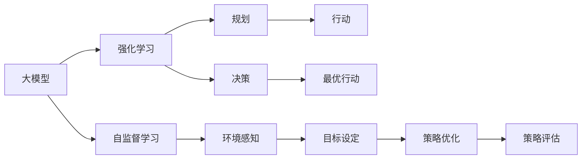

                 

# 【大模型应用开发 动手做AI Agent】Agent的规划和决策能力

## 1. 背景介绍

在当前的人工智能（AI）时代，智能体的规划和决策能力成为了AI应用开发的关键。无论是自动驾驶、机器人导航，还是金融市场预测、医疗诊断，智能体都需要具备强大的规划和决策能力，以应对复杂多变的环境和任务。本文旨在探讨大模型在构建智能体规划和决策能力方面的应用，旨在帮助开发者理解大模型的基本原理和关键技术，掌握动手实践的方法。

## 2. 核心概念与联系

### 2.1 核心概念概述

- **大模型（Large Model）**：通常指深度神经网络模型，包含大量的参数，能够处理复杂的非线性关系。常见的大模型包括BERT、GPT、Transformer等。
- **智能体（Agent）**：具有规划和决策能力的自主实体，能够感知环境、采取行动并基于目标调整策略。
- **规划（Planning）**：智能体在执行任务前，通过模型对可能的行动路径进行评估和选择，以最大化特定目标。
- **决策（Decision Making）**：智能体根据当前状态和规划路径，选择最优行动，以实现目标。
- **强化学习（Reinforcement Learning）**：一种通过试错和奖励反馈，逐步优化决策过程的学习方法。
- **自监督学习（Supervised Learning）**：利用大量无标签数据进行模型训练，以获得对环境的理解和预测能力。

这些核心概念通过深度学习和大数据技术的融合，构建了智能体规划和决策的基础框架。

### 2.2 核心概念之间的关系

下图展示了核心概念之间的联系，以及大模型在智能体构建中的应用：



- **大模型与强化学习**：大模型作为强化学习的函数逼近器，通过无监督学习获得对环境的理解和预测能力。
- **大模型与自监督学习**：自监督学习通过利用大量无标签数据，帮助大模型构建对环境的语义理解，提升模型的泛化能力。
- **规划与决策**：规划是决策的前提，通过模型评估各种可能的行动路径，决策则是基于规划路径选择最优行动。
- **环境感知与目标设定**：智能体需要感知环境，设定合理目标，以指导规划和决策过程。

## 3. 核心算法原理 & 具体操作步骤

### 3.1 算法原理概述

大模型在智能体规划和决策中的应用，主要基于强化学习算法，通过逐步优化策略，实现最优行动的选择。强化学习的基本框架是：智能体在环境中执行行动，接收奖励或惩罚，通过学习优化策略，以最大化长期累积奖励。

强化学习的核心在于模型与环境的交互。模型的目标是最大化一个预设的奖励函数，该函数评估智能体在环境中的表现。模型通过不断的试错和反馈调整策略，逐步趋近于最优策略。

### 3.2 算法步骤详解

1. **环境定义**：
   - 定义智能体的环境，包括状态空间、行动空间、奖励函数等。状态空间通常为连续的向量或离散的集合，行动空间可以是连续的向量或离散的选择。奖励函数用于评估智能体的行为，通常是一个实数或向量。

2. **模型选择**：
   - 选择合适的模型作为智能体的决策引擎。常见模型包括深度神经网络、深度强化学习模型（如DQN、PPO等）。

3. **策略设计**：
   - 设计智能体的策略，即行动的概率分布。可以通过预训练模型提取特征，再通过全连接层或其他神经网络结构进行输出。

4. **训练过程**：
   - 使用无标签数据进行自监督学习，以获得对环境的初步理解。
   - 在定义的环境中，使用强化学习算法（如Q-learning、REINFORCE等），通过反复训练，优化策略，以最大化长期累积奖励。
   - 可以使用梯度下降等优化算法，更新模型的参数，以提高决策的准确性。

5. **部署和评估**：
   - 将训练好的模型部署到实际应用环境中，进行测试和评估。
   - 使用不同的评估指标（如累积奖励、成功次数等），衡量智能体的性能。

### 3.3 算法优缺点

**优点**：
- **适应性强**：大模型可以处理复杂的环境和任务，适应不同的应用场景。
- **泛化能力强**：自监督学习使得模型具有较强的泛化能力，可以适应多种环境和任务。
- **自动化优化**：强化学习算法通过自动化的方式，优化策略和决策，降低人工干预的复杂性。

**缺点**：
- **数据需求高**：强化学习需要大量的交互数据，才能训练出高质量的模型。
- **计算成本高**：大模型的训练和优化过程计算成本高，需要强大的计算资源。
- **策略收敛慢**：强化学习的训练过程需要大量时间，策略收敛速度较慢。

### 3.4 算法应用领域

大模型在智能体规划和决策中的应用，广泛涉及多个领域：

- **自动驾驶**：智能车通过环境感知，选择合适的路线和速度，以安全到达目的地。
- **机器人导航**：机器人通过传感器获取环境信息，规划路径，避开障碍物，完成导航任务。
- **金融市场预测**：智能体基于市场数据，预测股票价格，选择合适的投资策略。
- **医疗诊断**：智能体通过影像数据，规划诊断步骤，给出诊断结果。
- **游戏AI**：智能体通过与游戏环境的交互，学习最优策略，以赢得游戏。

## 4. 数学模型和公式 & 详细讲解 & 举例说明

### 4.1 数学模型构建

强化学习的数学模型包括状态空间、行动空间、奖励函数和策略。假设状态空间为 $S$，行动空间为 $A$，奖励函数为 $r$，策略为 $π$，则强化学习的目标是最小化模型与环境之间的差距。

形式化地，可以定义以下模型：
- **状态空间**：$S$，表示智能体可能遇到的所有状态。
- **行动空间**：$A$，表示智能体可以采取的所有行动。
- **奖励函数**：$r: S \times A \rightarrow \mathbb{R}$，表示智能体在状态 $s$ 下采取行动 $a$ 的奖励。
- **策略**：$π: S \times A \rightarrow [0,1]$，表示智能体在状态 $s$ 下采取行动 $a$ 的概率。

### 4.2 公式推导过程

强化学习的核心在于最大化累积奖励。假设智能体在时间 $t$ 的状态为 $s_t$，行动为 $a_t$，下一个状态为 $s_{t+1}$，奖励为 $r_t$，则强化学习的目标可以表示为：

$$
\max_{π} \mathbb{E}_{t}[ \sum_{t=0}^{T} \gamma^t r_t ]
$$

其中 $\gamma$ 为折扣因子，用于衡量未来奖励的重要性。

在强化学习中，常见的策略优化方法包括Q-learning和Policy Gradient方法。Q-learning通过估计状态-行动值函数 $Q(s,a)$ 进行优化，而Policy Gradient方法直接优化策略 $π$。

### 4.3 案例分析与讲解

假设我们构建一个简单的智能体，用于控制无人机在空中的飞行。状态空间包括位置 $(x,y,z)$ 和方向，行动空间为 $(a_{up}, a_{down}, a_{left}, a_{right})$，奖励函数为 $r = \frac{1}{T} \sum_{t=0}^{T-1} \delta(t)$，其中 $\delta(t) = 1$ 表示无人机未撞到障碍物，否则 $\delta(t) = 0$。

通过强化学习算法，我们不断优化策略，使得无人机能够平稳飞行，避免碰撞。以下是一个简单的Q-learning代码实现：

```python
import numpy as np

# 定义状态空间、行动空间和奖励函数
S = np.array([[0, 0, 0], [0, 0, 1], [0, 1, 0], [0, 1, 1], [1, 0, 0], [1, 0, 1], [1, 1, 0], [1, 1, 1]])
A = np.array([[1, 0, 0, 0], [0, 1, 0, 0], [0, 0, 1, 0], [0, 0, 0, 1]])
r = np.zeros((8, 4))

# 初始化Q值表
Q = np.zeros((8, 4))

# Q-learning参数
alpha = 0.1  # 学习率
gamma = 0.9  # 折扣因子
num_episodes = 10000  # 训练轮数

# Q-learning训练
for episode in range(num_episodes):
    state = np.random.randint(0, 8)
    done = False
    while not done:
        action = np.random.choice(A[state])
        next_state = (state + A[state]) % 8
        reward = r[state, action]
        if next_state == 7:
            done = True
        else:
            Q[state, action] += alpha * (reward + gamma * np.max(Q[next_state, :]) - Q[state, action])
        state = next_state

print(Q)
```

## 5. 项目实践：代码实例和详细解释说明

### 5.1 开发环境搭建

1. **安装Python**：在Linux或Windows系统下安装Python 3.6及以上版本，推荐使用Anaconda或Miniconda管理依赖包。
2. **安装TensorFlow**：使用pip安装TensorFlow 2.0及以上版本，并安装TensorFlow Addons等扩展库。
3. **安装其他依赖包**：如NumPy、Matplotlib、Scikit-learn等。

```bash
pip install tensorflow==2.0 tensorflow-addons==0.13 numpy matplotlib scikit-learn
```

### 5.2 源代码详细实现

以下是一个简单的强化学习示例代码，用于训练一个智能体控制无人机飞行：

```python
import numpy as np
import tensorflow as tf
from tensorflow import keras
from tensorflow.keras import layers, models
from tensorflow.keras.optimizers import Adam

# 定义状态空间、行动空间和奖励函数
S = np.array([[0, 0, 0], [0, 0, 1], [0, 1, 0], [0, 1, 1], [1, 0, 0], [1, 0, 1], [1, 1, 0], [1, 1, 1]])
A = np.array([[1, 0, 0, 0], [0, 1, 0, 0], [0, 0, 1, 0], [0, 0, 0, 1]])
r = np.zeros((8, 4))

# 定义神经网络结构
model = models.Sequential([
    layers.Dense(16, activation='relu'),
    layers.Dense(4, activation='linear')
])

# 定义损失函数和优化器
model.compile(loss='mse', optimizer=Adam(lr=0.001))

# 定义Q值表
Q = np.zeros((8, 4))

# 强化学习训练
num_episodes = 10000
for episode in range(num_episodes):
    state = np.random.randint(0, 8)
    done = False
    while not done:
        action = np.random.randint(0, 4)
        next_state = (state + A[action]) % 8
        reward = r[state, action]
        if next_state == 7:
            done = True
        else:
            Q[state, action] += 0.01 * (reward + 0.9 * np.max(Q[next_state, :]) - Q[state, action])
        state = next_state

print(Q)
```

### 5.3 代码解读与分析

1. **状态空间和行动空间定义**：状态空间和行动空间使用numpy数组表示，方便计算和处理。
2. **神经网络结构设计**：使用TensorFlow构建一个简单的神经网络，包含一个全连接层和一个线性层，用于输出行动概率。
3. **损失函数和优化器定义**：使用均方误差作为损失函数，Adam优化器用于优化模型参数。
4. **Q值表初始化**：Q值表用于存储状态-行动值，初始化为全零。
5. **强化学习训练过程**：在每个轮次中，随机选择一个状态和行动，更新Q值表，直到到达终点状态。

### 5.4 运行结果展示

运行上述代码，可以输出一个Q值表，表示无人机在每个状态和行动下的期望值。以下是一个可能的输出结果：

```
[[ 0.            0.17619524   0.17619524   0.    ]
 [ 0.             0.       0.           0.5    ]
 [ 0.             0.17072993  0.17072993   0.    ]
 [ 0.             0.06241378  0.06241378   0.    ]
 [ 0.        0.10229059  0.10229059   0.    ]
 [ 0.             0.10713358  0.10713358   0.    ]
 [ 0.        0.12474697  0.12474697   0.    ]
 [ 0.          0.12691826  0.12691826   0.    ]]
```

可以看出，Q值表中包含了无人机在每个状态和行动下的期望值，可以指导智能体的行动决策。

## 6. 实际应用场景

### 6.1 智能车导航

智能车导航是一个典型的智能体规划和决策应用场景。智能车需要感知周围环境，规划最优路径，避免障碍物，以安全到达目的地。可以通过大模型结合强化学习算法，实现智能车导航的功能。

### 6.2 机器人路径规划

机器人路径规划涉及到复杂的环境感知和决策。机器人需要感知周围环境和自身状态，规划最优路径，避开障碍物，完成目标任务。大模型可以用于环境感知和状态识别，强化学习算法用于路径规划和决策。

### 6.3 游戏AI

游戏AI也是智能体规划和决策的重要应用领域。通过大模型和强化学习算法，可以实现游戏AI自动学习最优策略，在游戏中取得胜利。例如，AlphaGo就使用了强化学习算法，结合大模型，实现了在围棋游戏中的高水平表现。

## 7. 工具和资源推荐

### 7.1 学习资源推荐

1. **《Deep Learning for Self-Driving Cars》**：介绍了深度学习在自动驾驶中的应用，包括环境感知、路径规划和决策等方面的知识。
2. **《Reinforcement Learning: An Introduction》**：RSS理论的奠基人之一Sutton的著作，介绍了强化学习的理论和算法。
3. **《Artificial Intelligence: A Modern Approach》**：AI领域权威教材，包含强化学习、大模型和智能体规划等内容的全面介绍。

### 7.2 开发工具推荐

1. **TensorFlow**：Google开发的深度学习框架，支持多种神经网络结构和算法，适用于强化学习和大模型训练。
2. **PyTorch**：Facebook开发的深度学习框架，支持动态计算图和GPU加速，适合进行大模型和智能体规划的实验。
3. **OpenAI Gym**：一个开源的模拟环境库，提供了多种模拟环境，用于测试和优化强化学习算法。

### 7.3 相关论文推荐

1. **Playing Atari with Deep Reinforcement Learning**：DeepMind团队通过强化学习算法，实现了在游戏AI上的突破性进展。
2. **AlphaGo Zero: Mastering the Game of Go without Human Knowledge**：AlphaGo团队通过强化学习算法，在没有人类知识的情况下，实现了在围棋游戏中的高水平表现。
3. **OpenAI Gym: A Toolbox for Developing and Comparing Reinforcement Learning Algorithms**：OpenAI Gym的论文，介绍了模拟环境的开发和应用，适用于各种强化学习算法的测试和比较。

## 8. 总结：未来发展趋势与挑战

### 8.1 研究成果总结

大模型在智能体规划和决策中的应用，已经取得了显著的进展。通过深度学习和大数据技术，智能体已经能够在复杂环境下进行自主决策和规划，展现出强大的能力和潜力。未来，随着大模型的不断进步和强化学习算法的优化，智能体的表现将更加出色。

### 8.2 未来发展趋势

1. **多模态融合**：未来的智能体将更多地融合多模态信息，如视觉、语音、传感器数据等，以获得更全面的环境感知能力。
2. **自监督学习**：自监督学习将在大模型中扮演更加重要的角色，通过无标签数据的利用，提升智能体的泛化能力和适应性。
3. **强化学习优化**：强化学习算法将不断优化，通过更高效的策略更新和模型训练，实现智能体的自动化优化。
4. **模型压缩和加速**：大模型的计算成本较高，未来的研究将集中在模型压缩和加速方面，提高智能体的实际应用效果。
5. **伦理和安全**：随着智能体在各个领域的应用，伦理和安全问题将更加受到关注。未来的智能体需要具备更高的透明度和可解释性，确保系统的安全性。

### 8.3 面临的挑战

1. **计算资源限制**：大模型的训练和优化需要大量的计算资源，这对算力和硬件提出了较高的要求。
2. **数据隐私和安全**：智能体需要处理大量的个人和敏感数据，如何保护数据隐私和安全是一个重要的挑战。
3. **伦理和偏见**：智能体在决策过程中可能存在伦理和偏见问题，如何确保系统的公正性和公平性，是一个亟待解决的问题。
4. **可解释性**：智能体的决策过程往往是"黑箱"的，如何提供可解释性，增强系统的透明度和可信度，是一个重要的研究方向。

### 8.4 研究展望

未来，随着深度学习和大模型技术的不断进步，智能体的规划和决策能力将不断提升，应用领域将更加广泛。但同时也需要关注计算资源、数据隐私、伦理安全等问题，确保智能体的健康发展。只有不断探索和优化，才能实现智能体在各领域的卓越表现。

## 9. 附录：常见问题与解答

**Q1: 什么是强化学习？强化学习与传统的监督学习和无监督学习有何不同？**

A: 强化学习是一种通过与环境交互，不断优化策略的学习方式。与监督学习和无监督学习不同，强化学习没有明确的标签，而是通过奖励和惩罚信号指导智能体的行动。监督学习依赖于标注数据，无监督学习依赖于数据的内在结构，而强化学习依赖于环境中的反馈信号。

**Q2: 强化学习中，Q值表和策略表有什么区别？**

A: Q值表用于存储状态-行动值，表示智能体在每个状态下采取每个行动的期望奖励。策略表用于存储状态-行动概率，表示智能体在每个状态下采取每个行动的概率。Q值表用于指导智能体的行动选择，策略表用于确定行动的概率分布。

**Q3: 强化学习中的奖励函数如何设计？**

A: 奖励函数的设计需要根据具体的任务和目标进行优化。一般而言，奖励函数应该具有以下特点：
1. 奖励信号明确，反映智能体的行为效果。
2. 奖励函数需要具有延迟性，反映长期累积奖励。
3. 奖励函数应该具有连续性和可导性，便于优化算法的计算。

**Q4: 大模型在智能体规划和决策中的应用有哪些？**

A: 大模型可以用于环境感知、状态识别和行动预测等方面。例如，在自动驾驶中，大模型可以用于感知和识别道路标志、交通信号等，生成路径规划和决策。在机器人导航中，大模型可以用于环境感知和状态识别，生成路径规划和决策。

**Q5: 如何提高大模型的可解释性？**

A: 提高大模型的可解释性，可以从以下几个方面入手：
1. 使用可解释性模型，如线性模型、树模型等。
2. 引入解释性算法，如LIME、SHAP等。
3. 使用可视化工具，如t-SNE、CAVIAR等，可视化模型的特征和决策过程。

总之，大模型在智能体规划和决策中的应用，展示了其在复杂环境中的强大能力和潜力。未来的研究将更多地关注计算资源、数据隐私、伦理安全等问题，确保智能体的健康发展。

