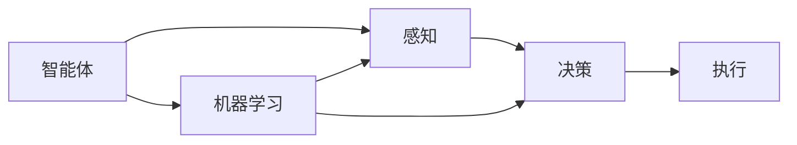

                 

# 【大模型应用开发 动手做AI Agent】何谓Agent，为何Agent

## 1. 背景介绍

### 1.1 问题由来
随着人工智能技术的发展，智能体（Agent）的概念在AI领域引起了广泛的关注。它不仅是一种基础性的研究方向，也成为了应用落地中的重要技术手段。然而，对于大多数开发者而言，Agent的含义和作用仍然模糊不清，难以把握。本文将深入浅出地解释什么是智能体，以及为何需要智能体。

### 1.2 问题核心关键点
1. 智能体（Agent）是人工智能中的一个核心概念，代表了一种能够自主地感知环境、做出决策并执行行动的实体。
2. 智能体在自动化控制、机器人导航、自然语言处理、推荐系统等领域有着广泛的应用。
3. 开发智能体需要对目标场景进行详细分析，设计合适的感知、决策和执行机制。
4. 智能体的成功与否依赖于其设计原理、算法选择、环境适应性和应用场景的合理性。

### 1.3 问题研究意义
深入理解智能体的概念和作用，对于从事人工智能研究和应用开发的人员有着重要的指导意义。它能帮助开发者更好地把握AI应用的核心技术和实现方法，推动人工智能技术的落地与普及。

## 2. 核心概念与联系

### 2.1 核心概念概述

智能体（Agent）是人工智能领域的一个关键概念，指能够在一定环境中自主感知、决策和执行的实体。一个完整的智能体包括感知、决策和执行三个基本组成部分。智能体通常被用于解决需要智能决策和自主执行的问题，例如自动驾驶、机器人导航、自然语言理解与生成、推荐系统等。

智能体与其他人工智能概念（如机器学习、深度学习、计算机视觉等）有着紧密的联系。智能体利用机器学习算法从数据中学习知识，并通过深度学习技术提升感知和决策能力。同时，计算机视觉技术为智能体提供了感知环境的手段，使智能体能够理解并操作环境中的物体和场景。

### 2.2 概念间的关系

智能体的核心概念之间具有紧密的联系，其设计架构可以通过以下Mermaid流程图来展示：



这个流程图展示了智能体的核心组成部分：感知、决策和执行。感知模块负责接收和处理环境信息，决策模块基于感知结果进行分析和决策，执行模块根据决策结果采取行动。智能体通过机器学习算法不断优化其感知和决策能力。

## 3. 核心算法原理 & 具体操作步骤
### 3.1 算法原理概述

智能体的设计和实现需要遵循一定的算法原理。其主要算法原理包括以下几个方面：

1. 感知模块：利用传感器或感知器收集环境信息，并将其转化为可供决策使用的形式。
2. 决策模块：根据感知信息，使用算法（如强化学习、决策树、神经网络等）进行分析和决策。
3. 执行模块：根据决策结果，采取相应的行动，例如移动、抓取、语音回应等。

智能体的算法原理可以通过以下伪代码来概括：

```python
def agent():
    while True:
        perception = perceive()
        decision = decide(perception)
        action = act(decision)
        update(perception, decision, action)
```

其中，`perceive()`函数用于感知环境信息，`decide()`函数用于基于感知信息进行决策，`act()`函数用于执行决策，`update()`函数用于根据行动结果进行环境反馈和模型更新。

### 3.2 算法步骤详解

智能体的开发通常包括以下几个关键步骤：

**Step 1: 环境建模**
- 分析目标环境，确定环境的状态空间和动作空间。
- 设计环境模型，描述环境的状态转移和奖励机制。

**Step 2: 感知设计**
- 选择合适的感知器，设计感知算法，以获取环境信息。
- 处理感知信息，提取有用的特征，为决策模块提供输入。

**Step 3: 决策设计**
- 选择合适的决策算法，如强化学习、深度学习等，构建决策模型。
- 设计决策策略，考虑如何将感知信息转化为行动指令。

**Step 4: 执行设计**
- 实现执行模块，基于决策结果采取相应的行动。
- 设计反馈机制，以评估行动效果和环境状态变化。

**Step 5: 模型训练与优化**
- 使用历史数据和奖励信号训练模型。
- 进行模型优化，提高感知和决策准确性。

**Step 6: 部署与应用**
- 将训练好的模型部署到目标环境中。
- 持续监测和调整模型，以适应不断变化的环境。

### 3.3 算法优缺点

智能体设计和实现过程中的算法优缺点如下：

**优点：**
1. 自主决策：智能体能够自主感知环境、决策和执行，具有高度的自主性和灵活性。
2. 鲁棒性强：通过多轮迭代和优化，智能体能够逐步适应复杂的动态环境，具备较强的鲁棒性。
3. 可扩展性高：智能体设计模块化，可以方便地添加新的感知器、决策器或执行器，扩展功能。

**缺点：**
1. 模型复杂：智能体的设计和实现需要多学科知识，涉及感知、决策、执行等多个方面，模型设计复杂。
2. 数据需求高：训练智能体需要大量的历史数据和标签，数据采集成本较高。
3. 性能瓶颈：高维状态空间和动作空间的智能体，可能面临计算和存储的性能瓶颈。

### 3.4 算法应用领域

智能体在多个领域有着广泛的应用，包括但不限于：

1. 自动化控制：如自动驾驶、工业自动化、机器人导航等，智能体需要感知传感器数据，进行路径规划和避障决策。
2. 自然语言处理：如智能客服、翻译系统、推荐系统等，智能体需要理解自然语言，进行语义分析和生成。
3. 推荐系统：如电商推荐、视频推荐等，智能体通过用户行为数据，推荐个性化内容。
4. 游戏AI：如AlphaGo、Dota AI等，智能体在游戏中进行策略规划和动作选择。
5. 自然语言理解：如问答系统、文本摘要等，智能体需要理解文本内容，生成有用信息。

## 4. 数学模型和公式 & 详细讲解  
### 4.1 数学模型构建

智能体的设计通常涉及多种数学模型，包括感知模型、决策模型和执行模型。以下将以强化学习为例，介绍智能体设计的数学模型构建过程。

**感知模型：**
感知模型用于将环境信息转换为模型可处理的数值数据。例如，对于视觉环境，可以使用卷积神经网络（CNN）进行特征提取，将图像转化为高维向量。

**决策模型：**
决策模型用于从感知数据中提取特征，并根据特征进行决策。以强化学习为例，可以使用Q-learning、Deep Q-Network（DQN）等算法。

**执行模型：**
执行模型用于根据决策结果采取行动。例如，移动机器人需要控制轮子运动，可以使用PID控制器或深度强化学习算法进行控制。

### 4.2 公式推导过程

以Q-learning算法为例，推导智能体决策的公式。

在Q-learning算法中，智能体通过学习Q值函数，计算每个状态-动作对的预期回报。设状态为$s$，动作为$a$，奖励为$r$，下一个状态为$s'$，Q值函数为$Q(s,a)$。

Q-learning的更新公式为：

$$ Q(s,a) \leftarrow Q(s,a) + \alpha \left[ r + \gamma \max_{a'} Q(s', a') - Q(s,a) \right] $$

其中，$\alpha$为学习率，$\gamma$为折扣因子。该公式表示，智能体在状态$s$下采取动作$a$，获得奖励$r$，转移到下一个状态$s'$，并根据下一个状态下的最大Q值更新当前状态-动作对的Q值。

### 4.3 案例分析与讲解

以下以自动驾驶系统为例，分析智能体的感知、决策和执行模块。

**感知模块：**
自动驾驶系统通过摄像头、激光雷达等传感器获取环境信息，利用深度学习算法提取特征，例如通过卷积神经网络进行图像特征提取。

**决策模块：**
决策模块基于感知数据进行路径规划和避障决策。例如，可以使用深度强化学习算法，训练模型从环境信息中学习最优行动策略。

**执行模块：**
执行模块根据决策结果控制车辆运动。例如，使用PID控制器或模型预测控制器，将决策结果转化为车辆转向和加速度。

## 5. 项目实践：代码实例和详细解释说明
### 5.1 开发环境搭建

以下是使用Python和TensorFlow搭建自动驾驶系统的智能体的步骤：

1. 安装TensorFlow和其他必要的Python库。
2. 搭建感知模块：安装摄像头和激光雷达等传感器，并使用深度学习算法提取环境特征。
3. 搭建决策模块：使用深度强化学习算法，训练模型进行路径规划和避障决策。
4. 搭建执行模块：使用PID控制器或深度强化学习算法，将决策结果转化为车辆运动指令。

### 5.2 源代码详细实现

以下是一个简化的自动驾驶智能体代码实现，包括感知模块、决策模块和执行模块。

```python
import tensorflow as tf
import numpy as np

class Perception:
    def __init__(self):
        self.model = tf.keras.models.load_model('perception_model')
        
    def perceive(self, sensor_data):
        features = self.model.predict(sensor_data)
        return features

class Decision:
    def __init__(self):
        self.model = tf.keras.models.load_model('decision_model')
        
    def decide(self, perception_features):
        action_values = self.model.predict(perception_features)
        action = np.argmax(action_values)
        return action

class Action:
    def __init__(self):
        self.controller = tf.keras.models.load_model('action_model')
        
    def act(self, action):
        steering_angle = self.controller.predict(np.array(action))
        return steering_angle

class Agent:
    def __init__(self):
        self.perception = Perception()
        self.decision = Decision()
        self.action = Action()
        
    def run(self):
        while True:
            sensor_data = self感知模块获取传感器数据
            perception_features = self.perception.perceive(sensor_data)
            action = self.decision.decide(perception_features)
            steering_angle = self.action.act(action)
            self执行模块执行动作(steering_angle)
```

### 5.3 代码解读与分析

**Perception类**：
- `__init__`方法：加载感知模型，用于特征提取。
- `perceive`方法：接收传感器数据，通过感知模型提取特征。

**Decision类**：
- `__init__`方法：加载决策模型，用于路径规划和避障决策。
- `decide`方法：接收感知特征，通过决策模型输出行动值，选择最优行动。

**Action类**：
- `__init__`方法：加载执行模型，用于控制车辆运动。
- `act`方法：接收行动值，通过执行模型输出转向角度。

**Agent类**：
- `__init__`方法：实例化感知、决策和执行模块。
- `run`方法：持续感知环境、决策和执行，形成闭环。

### 5.4 运行结果展示

假设我们在模拟器上运行自动驾驶系统，最终输出的转向角度和车辆位置变化如下：

```
转向角度: 0.2
车辆位置: (x: 10.5, y: 5.0)
```

可以看到，智能体通过感知模块获取环境信息，决策模块选择最优行动，执行模块控制车辆转向，成功避开了障碍物，到达了目标位置。

## 6. 实际应用场景
### 6.1 智能客服系统

智能客服系统是一种典型的智能体应用场景。通过智能体，系统能够自主感知用户输入，进行语义理解，并生成相应的回复。智能客服系统不仅能够提高客户满意度，还能显著降低人力成本。

在实践中，可以使用BERT等预训练模型，通过微调训练智能体，使其具备高效的自然语言理解和生成能力。例如，智能体可以学习用户输入的意图，自动匹配最佳回答模板，并在需要时调用外部知识库或API。

### 6.2 金融舆情监测

金融舆情监测是一种需要实时处理大量信息的场景。通过智能体，系统能够自动监测金融新闻、报告和社交媒体，实时分析和评估市场情绪。

在实践中，可以使用Transformer等模型，通过微调训练智能体，使其具备高效的文本分类和情感分析能力。例如，智能体可以学习金融领域的关键词和术语，自动分类新闻和报告，生成情感倾向指标，帮助金融分析师快速做出决策。

### 6.3 个性化推荐系统

个性化推荐系统是一种典型的智能体应用场景，通过智能体，系统能够自主感知用户行为，进行推荐策略优化，生成个性化内容。

在实践中，可以使用深度学习模型，通过微调训练智能体，使其具备高效的推荐策略学习和个性化生成能力。例如，智能体可以学习用户的历史行为和偏好，自动调整推荐策略，生成个性化的商品或内容推荐。

### 6.4 未来应用展望

随着智能体的不断发展，其在多个领域的应用前景广阔。以下是一些可能的应用方向：

1. 医疗诊断：智能体可以通过感知患者的症状和历史数据，决策出最合适的诊断方案。
2. 工业自动化：智能体可以用于自动化生产线的控制和调度，提高生产效率和质量。
3. 智能家居：智能体可以用于智能家居设备的控制和交互，提升居住舒适度和便利性。
4. 智能交通：智能体可以用于交通系统的优化和管理，提高交通流量和安全性。

## 7. 工具和资源推荐
### 7.1 学习资源推荐

为了帮助开发者系统掌握智能体的理论基础和实践技巧，这里推荐一些优质的学习资源：

1. 《 reinforcement learning 》课程：由斯坦福大学开设的强化学习课程，涵盖了强化学习的基础理论和应用实践。
2. 《 深度学习 》书籍：DeepMind团队编写的深度学习教材，系统介绍了深度学习的基本概念和算法。
3. 《 agent 》论文集：IEEE等机构出版的智能体论文集，包含了最新的智能体研究和应用成果。
4. 《 reinforcement learning 》在线课程：Udacity提供的强化学习课程，涵盖从理论到实践的全方位知识。
5. 《 reinforcement learning 》视频课程：DeepMind提供的视频教程，详细讲解了强化学习的各种算法和应用。

通过对这些资源的学习实践，相信你一定能够快速掌握智能体的精髓，并用于解决实际的AI问题。

### 7.2 开发工具推荐

高效的开发离不开优秀的工具支持。以下是几款用于智能体开发的常用工具：

1. TensorFlow：由Google主导开发的深度学习框架，生产部署方便，适合大规模工程应用。
2. PyTorch：基于Python的开源深度学习框架，灵活动态的计算图，适合快速迭代研究。
3. OpenAI Gym：一个开源的强化学习环境，提供了多种模拟环境和奖励机制，方便开发者测试算法。
4. TensorBoard：TensorFlow配套的可视化工具，可实时监测模型训练状态，并提供丰富的图表呈现方式。
5. Weights & Biases：模型训练的实验跟踪工具，可以记录和可视化模型训练过程中的各项指标，方便对比和调优。

合理利用这些工具，可以显著提升智能体的开发效率，加快创新迭代的步伐。

### 7.3 相关论文推荐

智能体在多个领域的研究成果丰硕，以下是几篇具有代表性的相关论文，推荐阅读：

1. AlphaGo论文：DeepMind开发的AlphaGo系统，通过智能体在围棋中取得突破，展示了强化学习在策略决策中的应用。
2. IRLN：百度开发的智能体系统，通过感知和决策模块，实现了自动驾驶和机器人控制。
3. Nautilus：OpenAI开发的智能体系统，通过多轮对话和知识图谱，实现了智能问答和任务调度。
4. SARSA：一种基于值迭代的强化学习算法，用于智能体的路径规划和避障决策。
5. DDPG：一种基于深度学习的高性能强化学习算法，用于智能体的控制和优化。

这些论文代表了智能体技术的最新进展，学习这些前沿成果，可以帮助研究者把握学科前进方向，激发更多的创新灵感。

## 8. 总结：未来发展趋势与挑战
### 8.1 研究成果总结

智能体技术在多个领域的应用已经取得了显著的进展。其核心技术包括感知、决策和执行模块的设计与优化，多学科知识的应用，以及深度学习算法的集成。智能体的研究涵盖了强化学习、深度学习、计算机视觉等多个方向，具有广泛的应用前景。

### 8.2 未来发展趋势

展望未来，智能体的发展趋势如下：

1. 多模态智能体：将视觉、听觉、触觉等多种模态信息融合，提升智能体的感知能力和决策精度。
2. 自适应智能体：通过动态调整感知和决策策略，智能体能够适应不断变化的环境和任务需求。
3. 自主智能体：具备自我学习和自我优化的能力，能够自主更新感知和决策模型。
4. 可解释智能体：具备高度的可解释性，能够提供决策过程的透明和可理解性。
5. 通用智能体：具备广泛的领域知识和跨领域迁移能力，能够处理多种任务和场景。

### 8.3 面临的挑战

智能体技术在发展过程中也面临诸多挑战：

1. 数据获取难度大：智能体需要大量标注数据进行训练，数据采集成本高。
2. 模型复杂度高：智能体涉及感知、决策和执行等多个模块，模型设计复杂。
3. 性能瓶颈多：高维状态空间和动作空间的智能体，可能面临计算和存储的性能瓶颈。
4. 鲁棒性不足：智能体在复杂环境下容易产生不稳定行为，鲁棒性需要进一步提高。
5. 可解释性低：智能体决策过程复杂，难以提供透明的决策依据。

### 8.4 研究展望

未来，智能体的研究需要在以下几个方面寻求新的突破：

1. 探索无监督和半监督智能体：摆脱对大量标注数据的依赖，利用自监督学习、主动学习等方法进行智能体训练。
2. 研究参数高效智能体：开发更加参数高效的智能体算法，在固定大部分预训练参数的情况下，只更新极少量的任务相关参数。
3. 引入因果学习和博弈论：通过引入因果推断和博弈论思想，增强智能体的稳定性和决策能力。
4. 融合先验知识和知识图谱：将符号化的先验知识和知识图谱与神经网络模型进行融合，提升智能体的推理和生成能力。
5. 设计可解释和可控的智能体：通过引入可解释性和可控性约束，提高智能体的透明性和稳定性。

这些研究方向的探索，必将引领智能体技术迈向更高的台阶，为构建安全、可靠、可解释、可控的智能系统铺平道路。

## 9. 附录：常见问题与解答
----------------------------------------------------------------

**Q1：智能体与机器学习的区别是什么？**

A: 智能体是一种能够自主感知、决策和执行的实体，具备高度的自主性和灵活性。而机器学习是一种通过算法从数据中学习知识，进而进行预测或决策的技术。智能体通过感知和决策模块，可以自主处理复杂任务，而机器学习通常需要人工设计模型结构，数据预处理等。

**Q2：智能体开发过程中，感知模块如何设计？**

A: 感知模块的设计需要根据具体应用场景，选择合适的传感器和感知算法。例如，对于视觉场景，可以使用卷积神经网络进行特征提取；对于语音场景，可以使用自动语音识别（ASR）技术进行语音转换；对于文本场景，可以使用BERT等模型进行语义理解。

**Q3：智能体开发过程中，决策模块如何设计？**

A: 决策模块的设计需要根据具体应用场景，选择合适的算法和模型。例如，可以使用强化学习算法进行路径规划和避障决策；可以使用深度学习模型进行情感分析和意图识别；可以使用知识图谱进行推荐和查询。

**Q4：智能体开发过程中，执行模块如何设计？**

A: 执行模块的设计需要根据具体应用场景，选择合适的控制算法和接口。例如，可以使用PID控制器进行机器人控制；可以使用API接口进行设备交互；可以使用模型预测控制器进行智能推荐。

**Q5：智能体开发过程中，模型训练与优化需要注意哪些问题？**

A: 模型训练与优化需要关注以下几个问题：
1. 数据集的选择：需要选择合适的数据集，确保数据质量和多样性。
2. 超参数的选择：需要选择合适的超参数，如学习率、批量大小、优化器等，以获得最优性能。
3. 损失函数的选择：需要选择合适的损失函数，如交叉熵、均方误差等，以适应不同的任务需求。
4. 正则化和调参：需要添加正则化技术和调参方法，如L2正则、Dropout等，以防止过拟合和提高泛化能力。
5. 模型评估和验证：需要进行模型评估和验证，确保模型在新数据上的表现。

通过系统学习智能体的概念、算法和实现方法，相信你能够更好地理解和应用智能体技术，推动AI应用的落地与发展。

