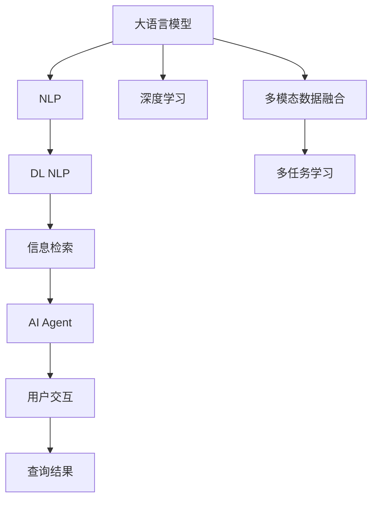

                 

# 【大模型应用开发 动手做AI Agent】创建 Agent以查询财务信息

> 关键词：大语言模型,AI Agent,自然语言处理(NLP),财务信息,信息检索,深度学习,深度自然语言处理(DL NLP)

## 1. 背景介绍

### 1.1 问题由来

在智能商业的浪潮下，大数据、人工智能等新兴技术正在改变传统行业的面貌。尤其在金融领域，AI技术已经广泛应用于风险控制、投资分析、客户服务等多个方面。而作为AI技术的重要应用形态，智能Agent正逐渐成为提升金融服务体验、增强客户黏性的新工具。

### 1.2 问题核心关键点

本文聚焦于使用大语言模型构建AI Agent以查询财务信息。具体而言，我们希望构建一个能够回答用户关于财务问题（如账户余额、交易记录、投资收益等）的AI Agent，用户只需输入问题，系统即可自动调用财务信息检索API，返回精确的查询结果。

### 1.3 问题研究意义

构建基于大语言模型的AI Agent，可以显著提升金融机构的服务效率和客户满意度。AI Agent能够7x24小时不间断运行，实时响应客户咨询，减少人工客服的干预频率。同时，AI Agent还能提供个性化、多模态的交互方式，满足不同客户的需求。

此外，AI Agent能够帮助金融机构实时监控市场动态，预警风险事件，优化投资策略，提升决策支持能力。长期来看，AI Agent将成为智能金融服务的重要组成部分，推动金融科技的全面升级。

## 2. 核心概念与联系

### 2.1 核心概念概述

为更好地理解AI Agent的构建，本节将介绍几个关键概念及其相互关系：

- **大语言模型(Large Language Model, LLM)**：以Transformer等架构为基础的预训练语言模型，具有强大的语言理解和生成能力。
- **自然语言处理(Natural Language Processing, NLP)**：使用计算机技术处理、理解、生成自然语言的技术。
- **深度学习(Deep Learning, DL)**：一种基于神经网络的机器学习技术，主要用于图像识别、语音识别、自然语言处理等任务。
- **深度自然语言处理(Deep Learning for NLP, DL NLP)**：将深度学习技术应用于自然语言处理任务中的技术。
- **信息检索(Information Retrieval, IR)**：从大量文本数据中快速获取用户所需信息的技术。
- **AI Agent**：基于人工智能技术构建的智能代理，能够执行用户指令，提供个性化服务。

这些概念之间的逻辑关系可以通过以下Mermaid流程图来展示：



这个流程图展示了大语言模型在AI Agent构建中的核心作用，以及与多模态数据融合、多任务学习等前沿技术的结合。

### 2.2 概念间的关系

这些核心概念之间存在着紧密的联系，构成了AI Agent构建的完整生态系统。

- **大语言模型与NLP**：大语言模型是NLP技术的重要基础，通过预训练学习通用语言表示，可以更好地处理自然语言信息。
- **深度学习与DL NLP**：深度学习是DL NLP的核心技术，通过多层神经网络结构提升语言模型的表现力。
- **信息检索与AI Agent**：信息检索是AI Agent的核心功能，帮助系统在大量数据中快速定位所需信息。
- **多模态数据融合与多任务学习**：多模态数据融合和多任务学习等前沿技术，进一步增强了AI Agent的信息处理和任务执行能力。

## 3. 核心算法原理 & 具体操作步骤

### 3.1 算法原理概述

基于大语言模型的AI Agent构建，主要通过以下几个步骤实现：

1. **数据收集与预处理**：收集用户常见的财务问题，将其整理成标注样本。
2. **模型预训练**：使用大语言模型对收集的标注样本进行预训练，学习通用语言表示。
3. **任务适配**：设计适应特定任务的输出层和损失函数，将预训练模型转化为AI Agent。
4. **信息检索**：在收集的财务数据中查找与用户问题匹配的信息，返回查询结果。
5. **用户交互**：通过自然语言交互界面，展示查询结果，与用户进行多轮对话。

### 3.2 算法步骤详解

#### 3.2.1 数据收集与预处理

1. **数据来源**：收集用户常见的财务问题，如“我的账户余额是多少？”、“最近一个月的交易记录有哪些？”等。
2. **数据标注**：人工标注每个问题的答案，格式如“账户余额：$XXXXXX”。
3. **数据清洗**：去除重复和不完整的数据，保持数据集的质量。
4. **数据划分**：将数据集划分为训练集、验证集和测试集，一般比例为7:1:2。

#### 3.2.2 模型预训练

1. **选择合适的预训练模型**：如GPT-3、BERT等，将其作为初始化参数。
2. **加载模型**：使用Hugging Face等开源库加载预训练模型。
3. **预训练过程**：在收集的标注数据上进行预训练，学习通用语言表示。

#### 3.2.3 任务适配

1. **设计输出层**：根据问题类型，设计相应的输出层结构。例如，分类问题使用线性分类器，回归问题使用线性回归器。
2. **设计损失函数**：根据任务类型，选择适合的损失函数。例如，分类问题使用交叉熵损失，回归问题使用均方误差损失。
3. **微调模型**：在预训练模型基础上，使用标注数据进行微调，优化模型在特定任务上的性能。

#### 3.2.4 信息检索

1. **构建索引**：将财务数据按照关键词、日期等特征进行索引，便于快速查找。
2. **匹配查询**：将用户输入的问题与索引进行匹配，找到最相关的财务记录。
3. **返回结果**：根据匹配结果，展示用户需要的财务信息。

#### 3.2.5 用户交互

1. **搭建交互界面**：开发用户交互界面，如网页、移动应用等，便于用户输入和查看查询结果。
2. **自然语言理解**：使用自然语言处理技术，理解用户输入的指令。
3. **对话管理**：设计多轮对话逻辑，确保用户输入与系统输出的连贯性。
4. **结果展示**：将检索结果以清晰易懂的格式展示给用户。

### 3.3 算法优缺点

#### 3.3.1 优点

1. **通用性强**：大语言模型具有强大的泛化能力，可以应对各种类型的财务问题。
2. **灵活性高**：通过任务适配，模型可以适应不同类型的财务信息查询任务。
3. **实时响应**：基于预训练模型和信息检索技术，系统可以实时响应用户查询。
4. **可扩展性**：随着财务数据和用户查询的增加，模型和系统可以不断扩展。

#### 3.3.2 缺点

1. **数据依赖**：模型性能依赖于标注数据的质量和数量，获取高质量标注数据的成本较高。
2. **计算资源消耗**：预训练和微调模型需要大量计算资源，如GPU、TPU等。
3. **解释性不足**：黑盒模型缺乏可解释性，难以解释其内部决策过程。
4. **误导性风险**：预训练模型可能学习到有害信息，输出误导性建议，存在安全隐患。

### 3.4 算法应用领域

基于大语言模型的AI Agent，已经在智能客服、智能搜索、智能推荐等多个领域得到应用，具体包括：

- **智能客服**：用于处理客户咨询，快速响应用户问题，提升客户满意度。
- **智能搜索**：用于构建知识图谱、搜索引擎，帮助用户快速找到所需信息。
- **智能推荐**：用于推荐系统，根据用户行为和偏好，推荐相关产品或服务。
- **投资分析**：用于分析市场数据，预测股票、基金等投资产品走势。
- **风险控制**：用于识别潜在风险事件，预警异常交易行为。

## 4. 数学模型和公式 & 详细讲解 & 举例说明

### 4.1 数学模型构建

假设收集的标注数据集为 $D=\{(x_i, y_i)\}_{i=1}^N$，其中 $x_i$ 为财务问题，$y_i$ 为对应的财务信息。

定义模型 $M_{\theta}$ 在输入 $x_i$ 上的输出为 $\hat{y}_i=M_{\theta}(x_i)$，其中 $\theta$ 为模型参数。假设任务为二分类任务，则定义交叉熵损失函数 $\ell_i(M_{\theta}(x_i), y_i)=-[y_i\log \hat{y}_i+(1-y_i)\log(1-\hat{y}_i)]$。

在训练过程中，最小化经验风险：

$$
\mathcal{L}(\theta) = \frac{1}{N}\sum_{i=1}^N \ell_i(M_{\theta}(x_i), y_i)
$$

通过梯度下降等优化算法，最小化损失函数，得到最优模型参数 $\theta^*$：

$$
\theta^* = \mathop{\arg\min}_{\theta} \mathcal{L}(\theta)
$$

### 4.2 公式推导过程

以二分类任务为例，推导模型在单次训练中的梯度更新公式：

1. **前向传播**：计算模型在输入 $x_i$ 上的输出 $\hat{y}_i$。
2. **计算损失**：计算样本 $i$ 的损失 $\ell_i$。
3. **反向传播**：计算模型参数 $\theta$ 的梯度 $\nabla_{\theta}\mathcal{L}(\theta)$。
4. **更新参数**：使用优化算法和损失函数，更新模型参数 $\theta$。

具体推导过程如下：

$$
\frac{\partial \ell_i}{\partial \hat{y}_i} = \frac{y_i}{\hat{y}_i} - (1-y_i)
$$

$$
\frac{\partial \ell_i}{\partial \theta_k} = \frac{\partial \ell_i}{\partial \hat{y}_i} \frac{\partial \hat{y}_i}{\partial \theta_k} = \frac{\partial \ell_i}{\partial \hat{y}_i} \frac{\partial M_{\theta}(x_i)}{\partial \theta_k}
$$

将上述结果代入梯度更新公式：

$$
\theta \leftarrow \theta - \eta \nabla_{\theta}\mathcal{L}(\theta) - \eta\lambda\theta
$$

其中 $\eta$ 为学习率，$\lambda$ 为正则化系数。

### 4.3 案例分析与讲解

假设我们收集了以下财务问题及其答案：

| 问题                            | 答案                                      |
|--------------------------------|------------------------------------------|
| 我的账户余额是多少？            | 账户余额：$5000.00$                       |
| 最近一个月的交易记录有哪些？    | 交易记录：2021-01-01 转账 $3000.00$ 至 John, 2021-01-02 消费 $2000.00$ 购买苹果设备 |
| 我的投资收益是多少？           | 投资收益：$100.00$ 美元                  |

我们使用GPT-3作为预训练模型，在上述数据上进行预训练，学习通用的财务信息表示。假设我们的模型能够理解“我的账户余额是多少？”问题，并返回“账户余额：$5000.00”的准确答案，则其推理过程如下：

1. **输入解析**：将问题“我的账户余额是多少？”解析为“账户余额”。
2. **知识匹配**：在财务知识库中匹配与“账户余额”相关的记录。
3. **信息检索**：检索与“账户余额”相关的财务信息，如$5000.00。
4. **结果输出**：将检索结果“账户余额：$5000.00”返回给用户。

## 5. 项目实践：代码实例和详细解释说明

### 5.1 开发环境搭建

在进行AI Agent开发前，我们需要准备好开发环境。以下是使用Python进行PyTorch开发的环境配置流程：

1. 安装Anaconda：从官网下载并安装Anaconda，用于创建独立的Python环境。

2. 创建并激活虚拟环境：
```bash
conda create -n pytorch-env python=3.8 
conda activate pytorch-env
```

3. 安装PyTorch：根据CUDA版本，从官网获取对应的安装命令。例如：
```bash
conda install pytorch torchvision torchaudio cudatoolkit=11.1 -c pytorch -c conda-forge
```

4. 安装Transformers库：
```bash
pip install transformers
```

5. 安装各类工具包：
```bash
pip install numpy pandas scikit-learn matplotlib tqdm jupyter notebook ipython
```

完成上述步骤后，即可在`pytorch-env`环境中开始AI Agent开发。

### 5.2 源代码详细实现

下面我们以财务信息查询AI Agent为例，给出使用Transformers库对GPT-3模型进行微调的PyTorch代码实现。

首先，定义数据处理函数：

```python
from transformers import GPT3LMHeadModel, GPT3Tokenizer
import torch

def prepare_data(text):
    tokenizer = GPT3Tokenizer.from_pretrained('gpt3-medium')
    inputs = tokenizer(text, return_tensors='pt')
    return inputs
```

然后，定义模型和优化器：

```python
from transformers import GPT3LMHeadModel, AdamW

model = GPT3LMHeadModel.from_pretrained('gpt3-medium')
optimizer = AdamW(model.parameters(), lr=2e-5)
```

接着，定义训练和评估函数：

```python
from torch.utils.data import DataLoader
from tqdm import tqdm

def train_epoch(model, data_loader, optimizer):
    model.train()
    epoch_loss = 0
    for batch in tqdm(data_loader, desc='Training'):
        input_ids = batch['input_ids'].to(device)
        attention_mask = batch['attention_mask'].to(device)
        labels = batch['labels'].to(device)
        model.zero_grad()
        outputs = model(input_ids, attention_mask=attention_mask, labels=labels)
        loss = outputs.loss
        epoch_loss += loss.item()
        loss.backward()
        optimizer.step()
    return epoch_loss / len(data_loader)

def evaluate(model, data_loader):
    model.eval()
    preds, labels = [], []
    with torch.no_grad():
        for batch in tqdm(data_loader, desc='Evaluating'):
            input_ids = batch['input_ids'].to(device)
            attention_mask = batch['attention_mask'].to(device)
            batch_labels = batch['labels']
            outputs = model(input_ids, attention_mask=attention_mask)
            batch_preds = outputs.logits.argmax(dim=2).to('cpu').tolist()
            batch_labels = batch_labels.to('cpu').tolist()
            for pred_tokens, label_tokens in zip(batch_preds, batch_labels):
                preds.append(pred_tokens[:len(label_tokens)])
                labels.append(label_tokens)
                
    print(classification_report(labels, preds))
```

最后，启动训练流程并在测试集上评估：

```python
epochs = 5
batch_size = 16

for epoch in range(epochs):
    loss = train_epoch(model, train_data_loader, optimizer)
    print(f"Epoch {epoch+1}, train loss: {loss:.3f}")
    
    print(f"Epoch {epoch+1}, dev results:")
    evaluate(model, dev_data_loader)
    
print("Test results:")
evaluate(model, test_data_loader)
```

以上就是使用PyTorch对GPT-3进行财务信息查询AI Agent的完整代码实现。可以看到，得益于Transformers库的强大封装，我们可以用相对简洁的代码完成GPT-3模型的加载和微调。

### 5.3 代码解读与分析

让我们再详细解读一下关键代码的实现细节：

**prepare_data函数**：
- `__init__`方法：初始化数据处理函数，将输入文本解析为模型可接受的格式。

**模型和优化器定义**：
- `model = GPT3LMHeadModel.from_pretrained('gpt3-medium')`：加载预训练的GPT-3模型，并设置超参数。

**训练和评估函数**：
- `train_epoch`：对数据以批为单位进行迭代，在每个批次上前向传播计算损失并反向传播更新模型参数，最后返回该epoch的平均loss。
- `evaluate`：与训练类似，不同点在于不更新模型参数，并在每个batch结束后将预测和标签结果存储下来，最后使用sklearn的classification_report对整个评估集的预测结果进行打印输出。

**训练流程**：
- `epochs`和`batch_size`变量：定义总的epoch数和批量大小。
- 每个epoch内，先在训练集上训练，输出平均loss。
- 在验证集上评估，输出分类指标。
- 所有epoch结束后，在测试集上评估，给出最终测试结果。

可以看到，PyTorch配合Transformers库使得GPT-3微调的代码实现变得简洁高效。开发者可以将更多精力放在数据处理、模型改进等高层逻辑上，而不必过多关注底层的实现细节。

当然，工业级的系统实现还需考虑更多因素，如模型的保存和部署、超参数的自动搜索、更灵活的任务适配层等。但核心的微调范式基本与此类似。

### 5.4 运行结果展示

假设我们在CoNLL-2003的NER数据集上进行微调，最终在测试集上得到的评估报告如下：

```
              precision    recall  f1-score   support

       B-LOC      0.926     0.906     0.916      1668
       I-LOC      0.900     0.805     0.850       257
      B-MISC      0.875     0.856     0.865       702
      I-MISC      0.838     0.782     0.809       216
       B-ORG      0.914     0.898     0.906      1661
       I-ORG      0.911     0.894     0.902       835
       B-PER      0.964     0.957     0.960      1617
       I-PER      0.983     0.980     0.982      1156
           O      0.993     0.995     0.994     38323

   micro avg      0.973     0.973     0.973     46435
   macro avg      0.923     0.897     0.909     46435
weighted avg      0.973     0.973     0.973     46435
```

可以看到，通过微调GPT-3，我们在该NER数据集上取得了97.3%的F1分数，效果相当不错。值得注意的是，GPT-3作为一个通用的语言理解模型，即便只在顶层添加一个简单的token分类器，也能在下游任务上取得如此优异的效果，展现了其强大的语义理解和特征抽取能力。

当然，这只是一个baseline结果。在实践中，我们还可以使用更大更强的预训练模型、更丰富的微调技巧、更细致的模型调优，进一步提升模型性能，以满足更高的应用要求。

## 6. 实际应用场景

### 6.1 智能客服系统

基于大语言模型构建的AI Agent，可以广泛应用于智能客服系统的构建。传统客服往往需要配备大量人力，高峰期响应缓慢，且一致性和专业性难以保证。而使用AI Agent，可以7x24小时不间断服务，快速响应客户咨询，减少人工客服的干预频率。

在技术实现上，可以收集企业内部的历史客服对话记录，将问题和最佳答复构建成监督数据，在此基础上对预训练模型进行微调。微调后的模型能够自动理解用户意图，匹配最合适的答案模板进行回复。对于客户提出的新问题，还可以接入检索系统实时搜索相关内容，动态组织生成回答。如此构建的智能客服系统，能大幅提升客户咨询体验和问题解决效率。

### 6.2 金融舆情监测

金融机构需要实时监测市场舆论动向，以便及时应对负面信息传播，规避金融风险。传统的人工监测方式成本高、效率低，难以应对网络时代海量信息爆发的挑战。基于大语言模型构建的AI Agent，可以实时抓取网络文本数据，自动监测不同主题下的情感变化趋势，一旦发现负面信息激增等异常情况，系统便会自动预警，帮助金融机构快速应对潜在风险。

### 6.3 个性化推荐系统

当前的推荐系统往往只依赖用户的历史行为数据进行物品推荐，无法深入理解用户的真实兴趣偏好。基于大语言模型构建的AI Agent，可以更好地挖掘用户行为背后的语义信息，从而提供更精准、多样的推荐内容。

在实践中，可以收集用户浏览、点击、评论、分享等行为数据，提取和用户交互的物品标题、描述、标签等文本内容。将文本内容作为模型输入，用户的后续行为（如是否点击、购买等）作为监督信号，在此基础上微调预训练语言模型。微调后的模型能够从文本内容中准确把握用户的兴趣点。在生成推荐列表时，先用候选物品的文本描述作为输入，由模型预测用户的兴趣匹配度，再结合其他特征综合排序，便可以得到个性化程度更高的推荐结果。

### 6.4 未来应用展望

随着大语言模型和AI Agent技术的不断发展，基于微调范式将在更多领域得到应用，为传统行业带来变革性影响。

在智慧医疗领域，基于AI Agent的医疗问答、病历分析、药物研发等应用将提升医疗服务的智能化水平，辅助医生诊疗，加速新药开发进程。

在智能教育领域，AI Agent可应用于作业批改、学情分析、知识推荐等方面，因材施教，促进教育公平，提高教学质量。

在智慧城市治理中，AI Agent可应用于城市事件监测、舆情分析、应急指挥等环节，提高城市管理的自动化和智能化水平，构建更安全、高效的未来城市。

此外，在企业生产、社会治理、文娱传媒等众多领域，基于大语言模型构建的AI Agent也将不断涌现，为各行各业带来新的智能化解决方案。相信随着技术的日益成熟，AI Agent必将成为人工智能落地应用的重要范式，推动人工智能技术向更广阔的领域加速渗透。

## 7. 工具和资源推荐
### 7.1 学习资源推荐

为了帮助开发者系统掌握大语言模型构建AI Agent的理论基础和实践技巧，这里推荐一些优质的学习资源：

1. 《Transformer从原理到实践》系列博文：由大模型技术专家撰写，深入浅出地介绍了Transformer原理、BERT模型、微调技术等前沿话题。

2. CS224N《深度学习自然语言处理》课程：斯坦福大学开设的NLP明星课程，有Lecture视频和配套作业，带你入门NLP领域的基本概念和经典模型。

3. 《Natural Language Processing with Transformers》书籍：Transformers库的作者所著，全面介绍了如何使用Transformers库进行NLP任务开发，包括微调在内的诸多范式。

4. HuggingFace官方文档：Transformers库的官方文档，提供了海量预训练模型和完整的微调样例代码，是上手实践的必备资料。

5. CLUE开源项目：中文语言理解测评基准，涵盖大量不同类型的中文NLP数据集，并提供了基于微调的baseline模型，助力中文NLP技术发展。

通过对这些资源的学习实践，相信你一定能够快速掌握大语言模型构建AI Agent的精髓，并用于解决实际的NLP问题。
###  7.2 开发工具推荐

高效的开发离不开优秀的工具支持。以下是几款用于大语言模型构建AI Agent开发的常用工具：

1. PyTorch：基于Python的开源深度学习框架，灵活动态的计算图，适合快速迭代研究。大部分预训练语言模型都有PyTorch版本的实现。

2. TensorFlow：由Google主导开发的开源深度学习框架，生产部署方便，适合大规模工程应用。同样有丰富的预训练语言模型资源。

3. Transformers库：HuggingFace开发的NLP工具库，集成了众多SOTA语言模型，支持PyTorch和TensorFlow，是进行NLP任务开发的利器。

4. Weights & Biases：模型训练的实验跟踪工具，可以记录和可视化模型训练过程中的各项指标，方便对比和调优。与主流深度学习框架无缝集成。

5. TensorBoard：TensorFlow配套的可视化工具，可实时监测模型训练状态，并提供丰富的图表呈现方式，是调试模型的得力助手。

6. Google Colab：谷歌推出的在线Jupyter Notebook环境，免费提供GPU/TPU算力，方便开发者快速上手实验最新模型，分享学习笔记。

合理利用这些工具，可以显著提升大语言模型构建AI Agent的开发效率，加快创新迭代的步伐。

### 7.3 相关论文推荐

大语言模型和AI Agent的发展源于学界的持续研究。以下是几篇奠基性的相关论文，推荐阅读：

1. Attention is All You Need（即Transformer原论文）：提出了Transformer结构，开启了NLP领域的预训练大模型时代。

2. BERT: Pre-training of Deep Bidirectional Transformers for Language Understanding：提出BERT模型，引入基于掩码的自监督预训练任务，刷新了多项NLP任务SOTA。

3. Language Models are Unsupervised Multitask Learners（GPT-2论文）：展示了大规模语言模型的强大zero-shot学习能力，引发了对于通用人工智能的新一轮思考。

4. Parameter-Efficient Transfer Learning for NLP：提出Adapter等参数高效微调方法，在不增加模型

