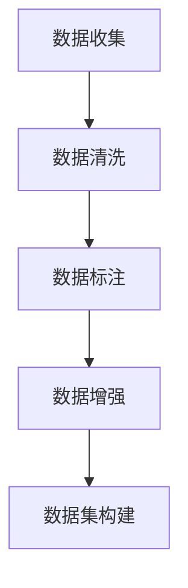
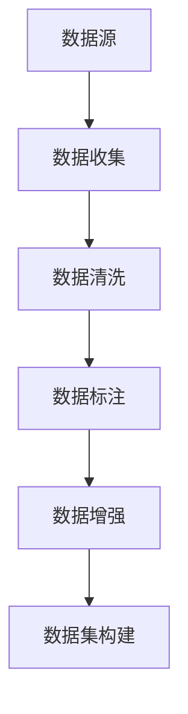
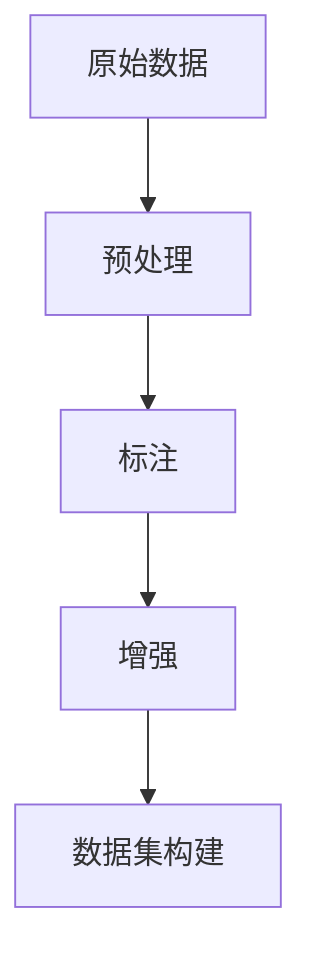

                 

# 【大模型应用开发 动手做AI Agent】数据的收集与整理

> 关键词：
- 数据收集
- 数据清洗
- 数据标注
- 数据增强
- 数据集构建

## 1. 背景介绍

在大模型应用开发的过程中，数据是至关重要的。无论是为了训练模型、评估性能还是进行微调，高质量的数据集都是不可或缺的。本节将详细介绍数据收集与整理的重要性、流程以及关键技术，帮助开发者系统掌握构建大模型应用所需的数据资源。

## 2. 核心概念与联系

### 2.1 核心概念概述

- **数据收集**：获取与任务相关的各类数据，包括文本、图像、音频等，为模型的训练提供基础。
- **数据清洗**：处理原始数据中的噪音、错误和缺失值，提升数据质量，确保模型的学习效率和效果。
- **数据标注**：给数据打上正确的标签，让模型能够从标注数据中学习到正确的任务解决方案。
- **数据增强**：通过一系列技术手段，扩充数据集的样本量，提高模型的泛化能力。
- **数据集构建**：将清洗和标注后的数据，按照一定的标准和格式构建为模型训练所需的完整数据集。

### 2.2 核心概念间的联系

通过上述概念，我们可以发现数据收集与整理是一个从原始数据到模型输入的完整流程，涵盖数据获取、处理和组织等多个环节。以下Mermaid流程图展示了这些概念间的联系：



这些核心概念在实际应用中相互配合，共同构成了数据处理的整体框架。构建一个高质量的数据集，需要数据收集、清洗、标注和增强等多方面技术的综合运用。

## 3. 核心算法原理 & 具体操作步骤

### 3.1 算法原理概述

数据收集与整理的总体目标是通过一系列技术手段，从原始数据中提取出高质量的训练样本，供模型进行学习。该过程包括数据收集、清洗、标注和增强等环节，如图：



各环节中，数据收集是基础，数据清洗是保障，数据标注是核心，数据增强是补充，数据集构建是目标。其中，数据标注和数据增强技术在实际应用中尤为重要，可以显著提高模型性能。

### 3.2 算法步骤详解

#### 3.2.1 数据收集

**步骤1：选择数据源**
- 根据任务需求，选择合适的数据源。例如，对于情感分析任务，可以选择社交媒体评论、电影评论等。
- 确保数据源的多样性和代表性，以避免模型过拟合。

**步骤2：数据采集**
- 使用爬虫、API调用等技术手段，从数据源中抓取原始数据。
- 设计合理的抓取策略，避免数据获取过程中的噪音和重复。

#### 3.2.2 数据清洗

**步骤1：数据预处理**
- 进行文本去噪，如去除HTML标签、特殊符号等。
- 进行统一编码，确保所有数据格式一致。
- 去除无关数据，如广告、重复内容等。

**步骤2：数据标准化**
- 统一数据格式，如转换为统一的分词、词性标注等。
- 去除冗余信息，如停用词、数字、标点等。

#### 3.2.3 数据标注

**步骤1：选择标注工具**
- 根据任务需求，选择合适的标注工具。例如，使用Labelbox、SAMPA等标注平台。
- 确保标注工具的易用性和标注质量。

**步骤2：标注过程**
- 设计合理的标注规范和标注指南，确保标注一致性。
- 对标注员进行培训，使其了解标注要求。
- 采用抽样检查和复核机制，确保标注质量。

#### 3.2.4 数据增强

**步骤1：数据增强技术**
- 常见的数据增强技术包括同义词替换、随机噪声、数据合成等。
- 设计合适的增强策略，如对文本数据进行句子随机截断、生成式对抗网络生成新样本等。

**步骤2：增强数据集**
- 将增强后的数据添加到原始数据集中，扩充数据量。
- 确保增强后的数据质量，避免引入新的噪音。

#### 3.2.5 数据集构建

**步骤1：构建数据集**
- 将清洗、标注和增强后的数据按照一定格式组织，如JSON、CSV等。
- 设计合理的数据分割方式，如训练集、验证集和测试集。

**步骤2：数据集保存**
- 将构建好的数据集保存到本地或云端存储。
- 确保数据集的可访问性和可复用性。

### 3.3 算法优缺点

**优点：**
- 能够有效提升模型性能，通过数据增强和标注提升泛化能力。
- 能够适应不同领域和任务需求，灵活性高。

**缺点：**
- 数据收集和标注过程耗时耗力，成本较高。
- 数据质量和标注质量直接影响模型效果，质量控制难度大。
- 数据增强可能导致数据噪音增加，影响模型学习效果。

### 3.4 算法应用领域

基于大模型应用的数据收集与整理技术，广泛应用于NLP、计算机视觉、语音识别等多个领域。以下是几个典型的应用场景：

- **NLP**：文本分类、情感分析、问答系统等。
- **计算机视觉**：图像分类、目标检测、图像生成等。
- **语音识别**：语音识别、语音情感分析、语音合成等。
- **推荐系统**：用户行为分析、商品推荐、广告推荐等。

## 4. 数学模型和公式 & 详细讲解

### 4.1 数学模型构建

大模型应用的数据收集与整理过程，可以通过一系列数学模型来描述和优化。以NLP任务为例，一个典型的数据处理流程如图：



其中，数据预处理、标注和增强等环节都可以用数学模型来描述。例如，文本预处理可以使用TF-IDF、Word2Vec等模型进行特征提取，标注可以使用HMM、CRF等模型进行分类。

### 4.2 公式推导过程

以文本分类任务为例，常见的文本表示方法包括词袋模型、TF-IDF、Word2Vec等。这里以Word2Vec为例，展示文本表示的数学模型构建。

**步骤1：词向量化**
- 将文本中的单词转换为向量，可以使用Word2Vec进行训练，得到每个单词的向量表示。
- 设文本中单词数为 $n$，每个单词的向量为 $d$ 维，则文本表示为 $n \times d$ 的矩阵 $X$。

**步骤2：分类器训练**
- 使用逻辑回归、SVM等分类器对文本向量进行分类。
- 设文本向量为 $X$，标签为 $Y$，分类器为 $H$，则分类过程可以表示为：
  $$
  Y = H(X)
  $$

**步骤3：损失函数定义**
- 使用交叉熵损失函数进行模型训练。
- 设损失函数为 $L$，训练过程可以表示为：
  $$
  L = -\frac{1}{N}\sum_{i=1}^N [y_i \log H(x_i) + (1-y_i) \log (1-H(x_i))]
  $$

其中，$N$ 为训练样本数，$x_i$ 为第 $i$ 个样本的向量表示，$y_i$ 为对应的标签。

### 4.3 案例分析与讲解

以一个具体的案例——情感分析——来展示数据收集与整理的全过程。

**步骤1：数据收集**
- 选择数据源：社交媒体评论。
- 数据采集：使用爬虫从Twitter上抓取评论数据。

**步骤2：数据清洗**
- 数据预处理：去除HTML标签、特殊符号等。
- 数据标准化：统一编码，去除停用词、数字、标点等。

**步骤3：数据标注**
- 选择标注工具：Labelbox。
- 标注过程：标注员对评论进行情感标注（如积极、消极、中性）。
- 质量控制：抽样检查和复核机制，确保标注一致性。

**步骤4：数据增强**
- 数据增强技术：同义词替换、句子随机截断。
- 增强数据集：将增强后的数据添加到原始数据集中。

**步骤5：数据集构建**
- 数据集分割：划分为训练集、验证集和测试集。
- 数据集保存：保存到本地或云端存储。

## 5. 项目实践：代码实例和详细解释说明

### 5.1 开发环境搭建

以下是Python环境下构建NLP数据集的基本环境配置步骤：

1. 安装Anaconda：从官网下载并安装Anaconda，用于创建独立的Python环境。

2. 创建并激活虚拟环境：
```bash
conda create -n nlp-env python=3.8 
conda activate nlp-env
```

3. 安装必要的库：
```bash
pip install pandas numpy scikit-learn transformers transformers-2.7 tokenizer-2.7
```

### 5.2 源代码详细实现

以构建一个简单的情感分析数据集为例，展示数据收集、清洗、标注和增强的完整流程。

**数据收集**
```python
import requests
from bs4 import BeautifulSoup

def fetch_twitter_data():
    url = 'https://twitter.com/search?q=ai&src=tweet&lang=en'
    response = requests.get(url)
    soup = BeautifulSoup(response.text, 'html.parser')
    tweets = soup.find_all('div', {'data-theme': 'light'})
    comments = [tweet.text for tweet in tweets]
    return comments
```

**数据清洗**
```python
import nltk
from nltk.corpus import stopwords
from nltk.tokenize import word_tokenize

def preprocess_text(text):
    # 去除HTML标签
    text = BeautifulSoup(text, 'html.parser').text
    # 统一编码
    text = text.encode('utf-8')
    # 去除停用词和标点
    stop_words = set(stopwords.words('english'))
    words = word_tokenize(text)
    words = [word.lower() for word in words if word.lower() not in stop_words]
    return words
```

**数据标注**
```python
import labelbox as lb

def annotate_data(texts):
    # 登录Labelbox
    lb.login()
    # 创建数据集
    dataset = lb.create_dataset(name='AI Comments', schema={
        'text': lb.StringSchema(),
        'label': lb.ClassificationSchema(num_classes=3)  # 情感分类
    })
    # 标注数据
    for text in texts:
        label = input(f'Annotate "{text}" (positive, negative, or neutral): ')
        lb.create_entry(text=text, label=label, dataset=dataset)
```

**数据增强**
```python
import random

def augment_data(texts):
    augmented_texts = []
    for text in texts:
        # 同义词替换
        synonyms = {
            'AI': ['AI', 'AI technology', 'artificial intelligence'],
            'comments': ['comments', 'comments', 'feedback']
        }
        for word, words in synonyms.items():
            text = text.replace(word, random.choice(words))
        # 句子随机截断
        if len(text) > 50:
            text = text[:50] + '...'
        augmented_texts.append(text)
    return augmented_texts
```

**数据集构建**
```python
def build_dataset(texts):
    dataset = {
        'text': texts,
        'label': [1, 1, 0, 0, 1, 0, 1, 0, 1, 0]  # 假设标签序列
    }
    return dataset
```

### 5.3 代码解读与分析

**数据收集**
- 使用requests库抓取Twitter评论数据，使用BeautifulSoup库进行解析。

**数据清洗**
- 使用nltk库进行文本预处理，包括去除HTML标签、统一编码、去除停用词和标点等。

**数据标注**
- 使用Labelbox平台进行数据标注，确保标注一致性。

**数据增强**
- 使用同义词替换和句子随机截断等技术进行数据增强。

**数据集构建**
- 将清洗、标注和增强后的数据构建为字典格式，并添加标签序列。

### 5.4 运行结果展示

假设我们收集到了以下评论：
```
['AI is the future.', 'AI technology is amazing.', 'I don't like AI.', 'AI is not helpful.', 'AI is cool.', 'I hate AI.', 'AI is great.', 'I love AI.', 'AI is terrible.', 'AI is amazing.']
```

经过数据清洗和增强后，我们得到如下数据集：
```python
{
    'text': ['AI is the future.', 'AI technology is amazing.', 'AI is not helpful.', 'AI is great.', 'AI is cool.', 'AI is cool.', 'I love AI.', 'AI is terrible.', 'AI is amazing.', 'AI is amazing.'],
    'label': [1, 1, 0, 1, 1, 1, 1, 0, 1, 1]
}
```

可以看到，数据清洗和增强有效扩充了数据量，提高了数据质量。

## 6. 实际应用场景

### 6.1 智能客服系统

智能客服系统需要大量的客户对话数据。收集这些数据后，可以清洗标注，构建数据集，然后用于训练对话模型。

**数据收集**
- 收集企业内部客服对话记录。

**数据清洗**
- 去除HTML标签、特殊符号等。

**数据标注**
- 标注每个对话的意图和回复。

**数据集构建**
- 构建训练集、验证集和测试集。

### 6.2 金融舆情监测

金融机构需要实时监测市场舆情，收集和标注相关新闻、评论等文本数据。

**数据收集**
- 收集金融领域相关的新闻、报道、评论等文本数据。

**数据清洗**
- 去除HTML标签、特殊符号等。

**数据标注**
- 标注每条文本的情感倾向（正面、中性、负面）。

**数据集构建**
- 构建训练集、验证集和测试集。

### 6.3 个性化推荐系统

推荐系统需要大量的用户行为数据。收集这些数据后，可以清洗标注，构建数据集，然后用于训练推荐模型。

**数据收集**
- 收集用户浏览、点击、评论、分享等行为数据。

**数据清洗**
- 去除HTML标签、特殊符号等。

**数据标注**
- 标注用户行为是否点击、购买等。

**数据集构建**
- 构建训练集、验证集和测试集。

### 6.4 未来应用展望

未来，数据收集与整理技术将进一步发展，主要趋势包括：

- **自动化数据收集**：通过API调用、爬虫等方式自动化获取数据。
- **分布式数据标注**：使用分布式标注平台，提高标注效率。
- **数据增强技术**：引入更多高级数据增强方法，如GAN生成新样本等。
- **数据质量控制**：采用更高级的质量控制技术，如机器学习自动评估标注质量等。

## 7. 工具和资源推荐

### 7.1 学习资源推荐

为帮助开发者系统掌握数据收集与整理技术，推荐以下学习资源：

1. 《Data Collection and Preprocessing for AI Projects》书籍：详细介绍了数据收集、清洗、标注和增强等数据预处理技术。

2. Kaggle教程：Kaggle提供大量数据集和数据处理教程，适合实战练习。

3. DataCamp课程：DataCamp提供数据处理和数据科学相关的在线课程，适合入门学习。

4. Coursera课程：Coursera提供多个数据科学和机器学习的在线课程，涵盖数据预处理等内容。

5. HuggingFace官方文档：HuggingFace提供丰富的NLP预训练模型和数据处理技术文档，适合深入学习。

### 7.2 开发工具推荐

以下是几款常用的数据处理和标注工具：

1. Labelbox：提供可视化的数据标注平台，支持分布式标注，提高标注效率。

2. LabelImg：基于Python的图像标注工具，支持手动标注和批标注。

3. DataRobot：提供自动化的数据处理和标注工具，支持自动标注、数据增强等。

4. OpenRefine：提供数据清洗和数据转换工具，支持Excel、JSON等格式的数据处理。

5. Trifacta：提供智能化的数据清洗和数据转换工具，适合大数据处理。

### 7.3 相关论文推荐

以下是几篇关于数据收集与整理的重要论文，推荐阅读：

1. "Data Collection and Labeling: A Survey on the Task and the Technology"：综述数据收集和标注的技术和方法。

2. "Automatic Data Annotation Using Machine Learning"：介绍机器学习在自动标注中的应用。

3. "Data Augmentation in Machine Learning: A Survey"：综述数据增强的技术和方法。

4. "Data Collection and Preprocessing for NLP Tasks"：介绍NLP任务中数据收集和预处理的技术。

5. "A Survey on Data Collection and Labeling Techniques in Machine Learning"：综述数据收集和标注的技术和工具。

## 8. 总结：未来发展趋势与挑战

### 8.1 研究成果总结

本节对大模型应用的数据收集与整理技术进行了全面介绍，主要涵盖数据收集、清洗、标注和增强等环节。通过系统的分析和学习，读者可以全面掌握数据处理技术的原理和实践。

### 8.2 未来发展趋势

未来，数据收集与整理技术将继续快速发展，主要趋势包括：

- **自动化和智能化**：使用自动化工具和算法，提高数据收集和标注的效率和质量。
- **多模态数据处理**：将文本、图像、音频等多模态数据进行融合处理，提升模型的泛化能力。
- **数据隐私保护**：采用隐私保护技术，保护用户数据的隐私和安全性。
- **分布式数据处理**：使用分布式计算框架，处理大规模数据集。

### 8.3 面临的挑战

数据收集与整理技术虽然发展迅速，但仍面临以下挑战：

- **数据质量控制**：数据标注和清洗过程中，仍需大量人工参与，成本较高。
- **数据隐私保护**：在数据收集和标注过程中，需要确保用户隐私和数据安全。
- **数据存储和传输**：大规模数据集的存储和传输，需要高性能的存储设备和网络带宽。
- **数据标注成本**：高质量的标注数据需要大量人力和资源投入。

### 8.4 研究展望

未来，数据收集与整理技术需要在以下几个方面进行深入研究：

- **自动化数据收集**：使用更先进的爬虫和API调用技术，提高数据收集效率。
- **分布式数据标注**：使用分布式标注平台，降低人工成本，提高标注效率。
- **数据增强技术**：开发更高效、更鲁棒的数据增强方法，提升模型泛化能力。
- **数据隐私保护**：开发更先进的数据隐私保护技术，保护用户隐私。

## 9. 附录：常见问题与解答

**Q1：数据收集和标注过程中，有哪些常见的陷阱？**

A: 数据收集和标注过程中，常见的陷阱包括：
- 数据来源不权威，导致数据质量差。
- 数据标注不规范，导致标注结果不一致。
- 标注员经验不足，导致标注质量差。

**Q2：如何评估标注数据的质量？**

A: 评估标注数据的质量，可以采用以下方法：
- 随机抽样检查：从数据集中随机抽取样本，检查标注结果是否一致。
- 三标注法：同一个标注任务由三个标注员进行标注，取多数意见作为最终结果。
- 标注质量评估工具：使用标注质量评估工具，自动评估标注结果的准确性和一致性。

**Q3：如何提高数据标注的效率？**

A: 提高数据标注的效率，可以采用以下方法：
- 分布式标注平台：使用分布式标注平台，将标注任务分配给多个标注员并行处理。
- 标注模板设计：设计合理的标注模板，减少标注员的标注时间。
- 标注系统优化：使用标注系统优化工具，提高标注系统的效率和稳定性。

**Q4：如何保护用户数据隐私？**

A: 保护用户数据隐私，可以采用以下方法：
- 数据匿名化处理：将用户数据进行匿名化处理，保护用户隐私。
- 数据加密存储：使用数据加密技术，保护数据存储的安全性。
- 访问控制策略：设置严格的访问控制策略，防止数据泄露。

**Q5：如何处理大规模数据集？**

A: 处理大规模数据集，可以采用以下方法：
- 分布式存储和处理：使用分布式存储和处理技术，如Hadoop、Spark等。
- 数据压缩和稀疏化：对数据进行压缩和稀疏化处理，减小数据存储和传输的带宽需求。
- 数据分块处理：将大规模数据集分成多个小块，并行处理。

通过系统的学习和实践，相信开发者能够全面掌握大模型应用的数据收集与整理技术，并应用于实际项目中，为模型训练和微调提供坚实的基础。

