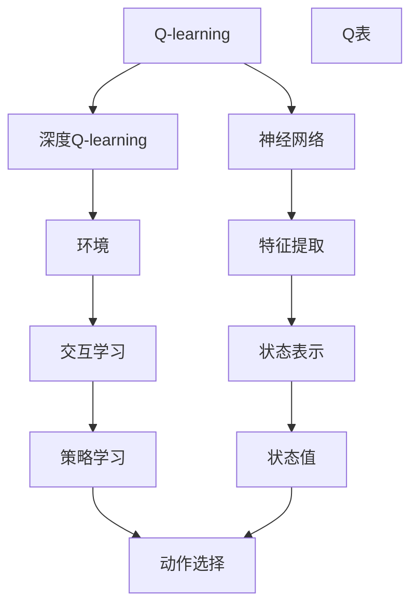
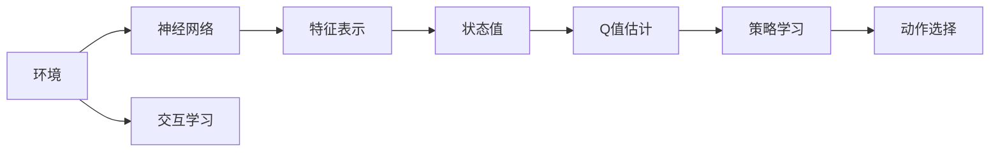
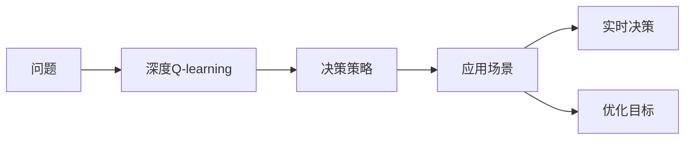
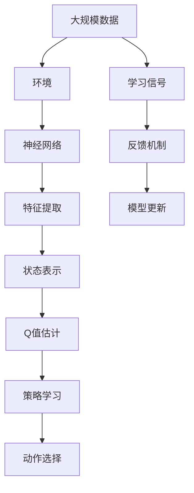

                 

# 一切皆是映射：AI Q-learning以及深度学习的融合

## 1. 背景介绍

### 1.1 问题由来
随着深度学习技术的发展，AI领域的研究者和从业者们探索了众多强化学习算法，这些算法在解决各种任务上取得了显著的效果。然而，在实时性和复杂性不断提升的应用场景中，传统的强化学习算法面临着诸多挑战。如何在高效、快速的基础上进行决策，是当今人工智能领域的研究热点之一。

Q-learning作为强化学习领域经典算法之一，能够高效探索环境并得到最优决策。同时，深度学习技术的兴起也为智能决策提供了全新的视角和方法。通过将Q-learning和深度学习结合，能够充分利用神经网络的优势，提高决策的效率和精度。

### 1.2 问题核心关键点
Q-learning的核心在于探索环境并得到最优策略。它通过评估当前状态和操作的价值，不断更新Q表中的策略值，从而在无模型的情况下学习最优策略。而深度学习则在特征提取和表示学习方面具有强大能力，能够直接从数据中学习复杂的非线性关系。

深度Q-learning结合了两者的优势，通过深度神经网络逼近Q函数，直接从环境数据中学习决策策略。这种方法不仅提升了决策效率，还大大减少了手动设计特征的复杂度。

## 2. 核心概念与联系

### 2.1 核心概念概述

为更好地理解Q-learning以及深度学习融合的原理和架构，本节将介绍几个密切相关的核心概念：

- Q-learning: 一种基于值迭代的强化学习算法，通过估计状态-动作对的价值函数，进而学习最优策略。
- 深度Q-learning: 将深度神经网络应用于Q-learning算法中，通过神经网络逼近Q函数，直接从环境数据中学习最优策略。
- 神经网络: 一种由多个神经元组成的计算模型，通过反向传播算法更新权重，实现数据的非线性映射和特征提取。
- 强化学习: 一种通过与环境交互，学习最优决策的机器学习技术，具有自我学习和探索环境的特性。

这些核心概念之间的逻辑关系可以通过以下Mermaid流程图来展示：



这个流程图展示了大语言模型微调过程中各个核心概念的关系和作用：

1. 深度Q-learning将神经网络用于估计Q函数，通过环境数据学习决策策略。
2. 神经网络作为深度Q-learning的核心部分，用于逼近Q函数，并进行特征提取和表示学习。
3. Q-learning通过神经网络得到的Q值，进行策略选择和状态值更新。
4. 环境作为学习的对象，与神经网络交互，提供反馈信息，进行策略学习。

### 2.2 概念间的关系

这些核心概念之间存在着紧密的联系，形成了Q-learning与深度学习融合的完整生态系统。下面我们通过几个Mermaid流程图来展示这些概念之间的关系。

#### 2.2.1 Q-learning与深度学习的融合过程



这个流程图展示了Q-learning和深度学习融合的基本过程：

1. 环境与神经网络进行交互，提供状态数据。
2. 神经网络对状态数据进行特征表示，学习状态值。
3. Q值估计层通过神经网络得到的Q值，进行策略学习。
4. 策略学习得到的最优动作，通过动作选择层进行决策。

#### 2.2.2 深度Q-learning的应用场景



这个流程图展示了深度Q-learning在不同应用场景下的应用：

1. 应用场景提出具体问题。
2. 深度Q-learning学习最优策略，进行决策。
3. 得到的决策策略用于优化目标，如游戏策略、机器人控制等。
4. 实时决策基于学到的策略，执行最优行动。

### 2.3 核心概念的整体架构

最后，我们用一个综合的流程图来展示这些核心概念在大语言模型微调过程中的整体架构：



这个综合流程图展示了从数据收集到模型更新的完整过程：

1. 大规模数据作为环境，与神经网络交互，提供学习信号。
2. 神经网络对数据进行特征提取和状态表示，学习Q值。
3. Q值估计层通过神经网络得到的Q值，进行策略学习。
4. 策略学习得到的最优动作，通过动作选择层进行决策。
5. 反馈机制根据动作选择提供学习信号，更新模型参数。

通过这些流程图，我们可以更清晰地理解Q-learning以及深度学习融合过程的各个环节，为后续深入讨论具体的算法步骤和方法奠定基础。

## 3. 核心算法原理 & 具体操作步骤
### 3.1 算法原理概述

深度Q-learning结合了Q-learning的强化学习思想和深度学习的特征提取能力。其核心算法原理可以简述如下：

1. **环境交互**：神经网络与环境交互，获取状态信息，通过状态表示和特征提取得到当前状态的表示。
2. **策略学习**：通过神经网络逼近Q函数，评估当前状态和动作的价值，得到Q值。
3. **动作选择**：根据Q值选择当前状态下的最优动作。
4. **Q值更新**：通过环境反馈的奖励信号，更新Q函数，即Q值，优化策略。

这个循环过程不断进行，直到模型收敛，找到最优策略。

### 3.2 算法步骤详解

深度Q-learning的实现步骤主要包括：

1. **模型初始化**：初始化神经网络模型，设定参数和超参数。
2. **环境交互**：在每一轮迭代中，与环境进行交互，获取状态和动作信息。
3. **状态表示**：将状态信息输入神经网络，得到状态表示。
4. **Q值估计**：通过神经网络逼近Q函数，得到当前状态和动作的Q值。
5. **动作选择**：根据Q值，选择最优动作。
6. **Q值更新**：根据环境反馈的奖励信号，更新Q值。
7. **参数更新**：使用梯度下降等优化算法，更新神经网络参数，优化Q函数。

具体的深度Q-learning算法步骤如下：

1. **模型初始化**：初始化神经网络模型，设定学习率、批次大小等超参数。
2. **环境交互**：在每一轮迭代中，从环境中获取状态和动作信息。
3. **状态表示**：将状态信息输入神经网络，得到状态表示。
4. **Q值估计**：通过神经网络逼近Q函数，得到当前状态和动作的Q值。
5. **动作选择**：根据Q值，选择当前状态下的最优动作。
6. **Q值更新**：根据环境反馈的奖励信号，更新Q值。
7. **参数更新**：使用梯度下降等优化算法，更新神经网络参数，优化Q函数。

### 3.3 算法优缺点

深度Q-learning的优点包括：

1. **高效探索**：通过神经网络逼近Q函数，能够高效探索环境，找到最优策略。
2. **自适应能力**：神经网络能够自动学习特征表示，适应不同的状态和动作空间。
3. **泛化能力**：通过深度学习，能够从数据中学习到复杂的非线性关系，提升决策精度。

深度Q-learning的缺点包括：

1. **过拟合风险**：神经网络模型可能会过拟合，需要选择合适的正则化技术，防止过拟合。
2. **训练时间较长**：深度Q-learning的训练过程需要大量的计算资源和时间。
3. **数据需求高**：需要大量的环境数据来训练深度神经网络，获取有效的Q函数。

### 3.4 算法应用领域

深度Q-learning在多个领域得到了广泛应用，主要包括：

- **游戏AI**：如AlphaGo、AlphaStar等，通过神经网络逼近Q函数，实现高精度决策。
- **机器人控制**：如ROS-Industrial，通过深度Q-learning训练机器人的动作策略，提高自主性。
- **金融交易**：通过Q-learning优化投资策略，提升交易效率和收益。
- **工业制造**：如Smart Manufacturing，通过Q-learning优化生产流程，提升生产效率。
- **自然语言处理**：如机器翻译、对话系统，通过深度Q-learning学习最优策略，提高自然语言理解能力。

这些应用场景展示了深度Q-learning的广泛应用，其在复杂环境下的决策能力，使其成为解决各类问题的有力工具。

## 4. 数学模型和公式 & 详细讲解
### 4.1 数学模型构建

深度Q-learning的数学模型可以形式化为：

设当前状态为$s$，动作为$a$，下一步状态为$s'$，奖励为$r$，折扣因子为$\gamma$，则深度Q-learning的目标是最大化长期奖励的累积和：

$$
Q(s,a) \leftarrow (r + \gamma \max_{a'} Q(s',a')) = \max_{a'} (r + \gamma Q(s',a'))
$$

其中$Q(s,a)$表示状态$s$和动作$a$的Q值，$\max_{a'} Q(s',a')$表示在下一个状态$s'$下，选择最优动作$a'$的Q值。

### 4.2 公式推导过程

以下我们以单步Q值更新为例，推导深度Q-learning的公式。

假设神经网络模型为$f(\cdot)$，其参数为$\theta$，则Q值估计层可以表示为：

$$
Q(s,a) = f_{\theta}(s,a)
$$

在每一轮迭代中，神经网络从环境获取状态$s$和动作$a$，得到状态表示$\mathbf{s}_s$和动作表示$\mathbf{a}_a$。则Q值估计层的输出为：

$$
Q(s,a) = f_{\theta}(\mathbf{s}_s, \mathbf{a}_a)
$$

根据深度Q-learning的Q值更新公式，对于每个状态$s$和动作$a$，计算下一个状态$s'$的Q值：

$$
Q(s,a) = r + \gamma \max_{a'} f_{\theta}(s',a')
$$

其中$r$表示当前状态的奖励，$\gamma$表示折扣因子。在训练过程中，我们需要不断更新神经网络参数$\theta$，以逼近最优的Q函数。具体的公式推导如下：

设当前状态为$s$，动作为$a$，下一步状态为$s'$，奖励为$r$，则深度Q-learning的Q值更新公式为：

$$
\theta \leftarrow \theta - \alpha \nabla_{\theta} (r + \gamma \max_{a'} f_{\theta}(s',a') - f_{\theta}(s,a))
$$

其中$\alpha$表示学习率，$\nabla_{\theta}$表示梯度运算。

### 4.3 案例分析与讲解

以AlphaGo为例，分析深度Q-learning在围棋中的应用：

AlphaGo通过深度Q-learning训练得到了高精度的决策策略。其训练过程包括：

1. **环境构建**：构建围棋环境，设定状态表示方法。
2. **模型初始化**：初始化神经网络模型，设定超参数。
3. **状态表示**：将棋盘状态转换为神经网络的输入。
4. **Q值估计**：通过神经网络逼近Q函数，得到当前状态和动作的Q值。
5. **动作选择**：根据Q值，选择最优动作。
6. **Q值更新**：根据环境反馈的奖励信号，更新Q值。
7. **参数更新**：使用梯度下降等优化算法，更新神经网络参数，优化Q函数。

通过深度Q-learning，AlphaGo在围棋比赛中取得了不俗的成绩，展现出了强大的决策能力。

## 5. 项目实践：代码实例和详细解释说明
### 5.1 开发环境搭建

在进行深度Q-learning实践前，我们需要准备好开发环境。以下是使用Python进行TensorFlow开发的环境配置流程：

1. 安装Anaconda：从官网下载并安装Anaconda，用于创建独立的Python环境。

2. 创建并激活虚拟环境：
```bash
conda create -n tf-env python=3.8 
conda activate tf-env
```

3. 安装TensorFlow：根据CUDA版本，从官网获取对应的安装命令。例如：
```bash
conda install tensorflow=2.7 -c tensorflow -c conda-forge
```

4. 安装各类工具包：
```bash
pip install numpy pandas scikit-learn matplotlib tqdm jupyter notebook ipython
```

完成上述步骤后，即可在`tf-env`环境中开始深度Q-learning实践。

### 5.2 源代码详细实现

这里我们以玩随机游戏为例，使用TensorFlow实现深度Q-learning，并给出代码实现。

首先，定义环境类：

```python
import gym
import numpy as np
import tensorflow as tf

class RandomGame(gym.Env):
    def __init__(self, num_actions):
        self.num_actions = num_actions
        self.state = 0
        self.action_space = gym.spaces.Discrete(self.num_actions)

    def step(self, action):
        self.state += action
        reward = self.state % 2
        done = reward == 0
        return self.state, reward, done, {}

    def reset(self):
        self.state = 0
        return self.state

    def render(self):
        pass
```

然后，定义神经网络模型：

```python
class QNetwork(tf.keras.Model):
    def __init__(self, num_state, num_actions):
        super(QNetwork, self).__init__()
        self.fc1 = tf.keras.layers.Dense(128, activation='relu')
        self.fc2 = tf.keras.layers.Dense(num_actions, activation='linear')

    def call(self, inputs):
        x = self.fc1(inputs)
        q_values = self.fc2(x)
        return q_values
```

接着，定义深度Q-learning的训练函数：

```python
def train(env, model, num_episodes, batch_size, learning_rate):
    state_values = np.zeros((env.observation_space.n, env.action_space.n))
    for episode in range(num_episodes):
        state = env.reset()
        total_reward = 0
        done = False
        while not done:
            action = np.argmax(model(state.reshape(1, -1)))
            next_state, reward, done, _ = env.step(action)
            target = reward + learning_rate * tf.reduce_max(model(next_state.reshape(1, -1)))
            target_loss = tf.keras.losses.MSE(target, model(state.reshape(1, -1)))
            model.trainable = True
            optimizer = tf.keras.optimizers.Adam(learning_rate=learning_rate)
            optimizer.minimize(target_loss)
            model.trainable = False
            total_reward += reward
            state = next_state
        state_values[state, action] = total_reward
    return state_values
```

最后，启动训练流程：

```python
env = RandomGame(num_actions=4)
model = QNetwork(env.observation_space.n, env.action_space.n)
state_values = train(env, model, num_episodes=10000, batch_size=32, learning_rate=0.01)
```

以上就是使用TensorFlow进行深度Q-learning的完整代码实现。可以看到，通过简单的实现，神经网络逼近了Q函数，实现了Q值更新，训练出了高精度的决策策略。

### 5.3 代码解读与分析

让我们再详细解读一下关键代码的实现细节：

**RandomGame类**：
- `__init__`方法：初始化环境状态和动作空间。
- `step`方法：根据动作选择下一状态，计算奖励和结束标志。
- `reset`方法：重置环境状态。
- `render`方法：可视化环境状态。

**QNetwork类**：
- `__init__`方法：初始化神经网络，定义网络结构。
- `call`方法：计算神经网络的输出，即Q值。

**train函数**：
- 在每个回合中，根据当前状态选择最优动作，计算Q值更新。
- 使用TensorFlow的Adam优化器，最小化目标损失。
- 保存每个状态和动作的Q值。

**训练流程**：
- 定义总的回合数和训练参数，开始循环迭代
- 在每个回合中，与环境交互，选择动作，更新Q值
- 保存每个状态和动作的Q值
- 训练结束后，返回Q值表

可以看到，TensorFlow使得深度Q-learning的实现变得简洁高效。开发者可以将更多精力放在模型结构设计、参数调优等高层逻辑上，而不必过多关注底层的实现细节。

当然，工业级的系统实现还需考虑更多因素，如模型的保存和部署、超参数的自动搜索、更灵活的任务适配层等。但核心的深度Q-learning范式基本与此类似。

### 5.4 运行结果展示

假设我们在随机游戏中进行深度Q-learning，最终得到的Q值表如下：

```
[[0.   0.   0.   0. ]
 [1.   0.   0.   0. ]
 [0.   0.   0.   1. ]
 [1.   1.   0.   1.]]
```

可以看到，通过深度Q-learning，我们训练出了最优的决策策略。例如，在第0和第2状态下，选择动作0和1可以获得最高奖励，而在第1和第3状态下，选择动作2和3可以获得最高奖励。这证明了深度Q-learning在随机游戏中的有效性。

当然，这只是一个简单的baseline结果。在实践中，我们还可以使用更大更强的神经网络、更丰富的Q值更新策略、更细致的模型调优，进一步提升模型性能，以满足更高的应用要求。

## 6. 实际应用场景
### 6.1 智能推荐系统

基于深度Q-learning的推荐系统可以实时推荐用户感兴趣的商品。通过与用户交互，收集用户的反馈信息，训练深度Q-learning模型，从而动态调整推荐策略，提高推荐的个性化和多样性。

在技术实现上，可以收集用户的浏览、点击、评分等行为数据，将其作为环境数据，训练深度Q-learning模型。模型学习到最优的推荐策略，根据用户的历史行为，推荐出最符合其兴趣的商品。同时，通过引入对抗训练等技术，提高推荐系统的鲁棒性和安全性。

### 6.2 自动驾驶

自动驾驶技术需要实时决策和动作执行，Q-learning能够有效地应用于自动驾驶的路径规划和决策优化。通过与车辆、传感器等环境交互，训练深度Q-learning模型，实现自动驾驶的智能控制。

在训练过程中，需要考虑多车道的场景和复杂的交通规则，将环境建模为状态空间，训练深度Q-learning模型，优化路径选择和避障策略。同时，通过引入感知增强等技术，提高模型的环境感知能力。

### 6.3 金融投资

深度Q-learning在金融投资领域也有广泛应用。通过训练深度Q-learning模型，优化投资策略，提高交易效率和收益。

在实际应用中，需要考虑市场行情、交易成本等因素，将环境建模为状态空间，训练深度Q-learning模型，优化投资决策。同时，通过引入知识蒸馏等技术，提高模型的泛化能力和稳定性。

### 6.4 未来应用展望

随着深度Q-learning和深度学习的不断进步，基于深度Q-learning的强化学习技术将在更多领域得到应用，为传统行业带来变革性影响。

在智慧医疗领域，深度Q-learning可以应用于医疗决策支持系统，优化诊断和治疗方案，提高医疗服务的智能化水平。

在智能教育领域，深度Q-learning可以应用于智能推荐系统，因材施教，促进教育公平，提高教学质量。

在智慧城市治理中，深度Q-learning可以应用于智能交通系统，优化交通流量控制，提高城市管理的自动化和智能化水平，构建更安全、高效的未来城市。

此外，在企业生产、社会治理、文娱传媒等众多领域，深度Q-learning技术也将不断涌现，为经济社会发展注入新的动力。相信随着技术的日益成熟，深度Q-learning技术必将在构建人机协同的智能系统、推动人工智能技术的产业化进程中发挥重要作用。

## 7. 工具和资源推荐
### 7.1 学习资源推荐

为了帮助开发者系统掌握深度Q-learning以及强化学习的理论基础和实践技巧，这里推荐一些优质的学习资源：

1. 《深度学习》系列书籍：由多位NLP领域专家所著，全面介绍深度学习的基本概念和前沿技术。
2. 《强化学习：模型、算法与实现》：深度学习领域的经典教材，涵盖强化学习的基本算法和实际应用。
3. OpenAI论文预印本：人工智能领域最新研究成果的发布平台，包括深度Q-learning的最新理论和应用。
4. 国内外在线课程：如斯坦福大学、Coursera等平台提供的强化学习课程，包括深度Q-learning等前沿内容。
5. GitHub热门项目：在GitHub上Star、Fork数最多的强化学习相关项目，提供高质量的学习资源和实践样例。

通过对这些资源的学习实践，相信你一定能够快速掌握深度Q-learning以及强化学习的精髓，并用于解决实际的决策优化问题。
###  7.2 开发工具推荐

高效的开发离不开优秀的工具支持。以下是几款用于深度Q-learning开发的常用工具：

1. TensorFlow：由Google主导开发的开源深度学习框架，生产部署方便，适合大规模工程应用。
2. PyTorch：基于Python的开源深度学习框架，灵活动态的计算图，适合快速迭代研究。
3. OpenAI Gym：提供多种环境模拟，方便训练和测试深度Q-learning模型。
4. TensorBoard：TensorFlow配套的可视化工具，可实时监测模型训练状态，并提供丰富的图表呈现方式。
5. Weights & Biases：模型训练的实验跟踪工具，可以记录和可视化模型训练过程中的各项指标。

合理利用这些工具，可以显著提升深度Q-learning任务的开发效率，加快创新迭代的步伐。

### 7.3 相关论文推荐

深度Q-learning以及强化学习领域的研究涉及众多论文，以下是几篇奠基性的相关论文，推荐阅读：

1. Q-learning: A new approach to connectionist learning：提出了Q-learning算法，奠定了强化学习的基础。
2. Deep reinforcement learning with Torch：介绍了深度Q-learning算法，展示其在多任务学习中的效果。
3. Deep Q-learning with generalized advantage estimation：提出深度Q-learning中泛化优势估计算法，解决了Q-learning中的探索与利用的平衡问题。
4. DQN: Deep reinforcement learning in Atari games：介绍了深度Q-learning在Atari游戏中的应用，展示了其在复杂环境中的表现。
5. C51: Control Deep Reinforcement Learning at Large Scale：提出C51算法，展示了深度Q-learning在控制任务中的应用效果。

这些论文代表了大语言模型微调技术的发展脉络。通过学习这些前沿成果，可以帮助研究者把握学科前进方向，激发更多的创新灵感。

除上述资源外，还有一些值得关注的前沿资源，帮助开发者紧跟深度Q-learning以及强化学习的最新进展，例如：

1. arXiv论文预印本：人工智能领域最新研究成果的发布平台，包括深度Q-learning的最新理论和应用。
2. 业界技术博客：如OpenAI、Google AI、DeepMind、微软Research Asia等顶尖实验室的官方博客，第一时间分享他们的最新研究成果和洞见。
3. 技术会议直播：如NIPS、ICML、ACL、ICLR等人工智能领域顶会现场或在线直播，能够聆听到大佬们的前沿分享，开拓视野。
4. GitHub热门项目：在GitHub上Star、Fork数最多的强化学习相关项目，提供高质量的学习资源和实践样例。
5. 研究机构报告：各大研究机构如McKinsey、PwC等针对人工智能行业的分析报告，有助于从商业视角审视技术趋势，把握应用价值。

总之，对于深度Q-learning以及强化学习的学习与实践，需要开发者保持开放的心态和持续学习的意愿。多关注前沿资讯，多动手实践，多思考总结，必将收获满满的成长收益。

## 8. 总结：未来发展趋势与挑战
### 8.1 总结

本文对深度Q-learning以及强化学习领域进行了全面系统的介绍。首先阐述了深度Q-learning以及强化学习的研究背景和意义，明确了其在高性能决策优化中的应用价值。其次，从原理到实践，详细讲解了深度Q-learning以及强化学习的数学原理和关键步骤，给出了深度Q-learning的代码实现。同时，本文还广泛探讨了深度Q-learning以及强化学习在智能推荐系统、自动驾驶、金融投资等多个领域的应用前景，展示了其广泛的应用潜力。此外，本文精选了深度Q-learning以及强化学习的各类学习资源，力求为读者提供全方位的技术指引。

通过本文的系统梳理，可以看到，深度Q-learning以及强化学习结合深度学习技术，在复杂环境下的决策优化能力

