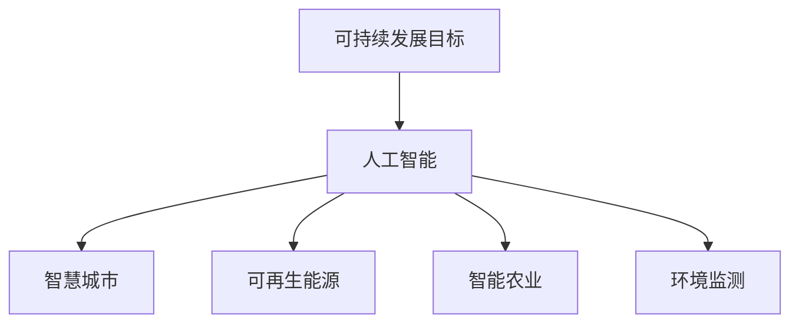
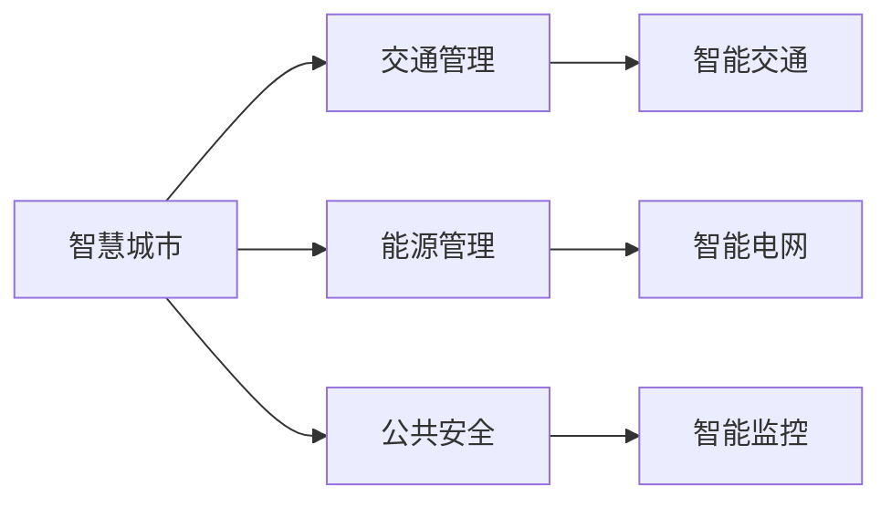
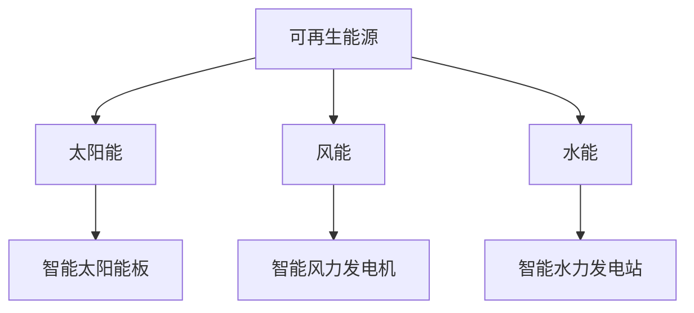
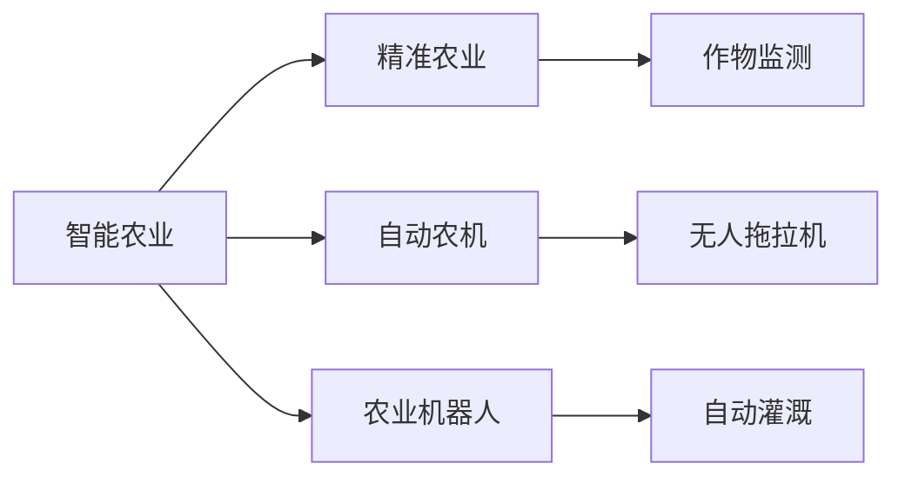
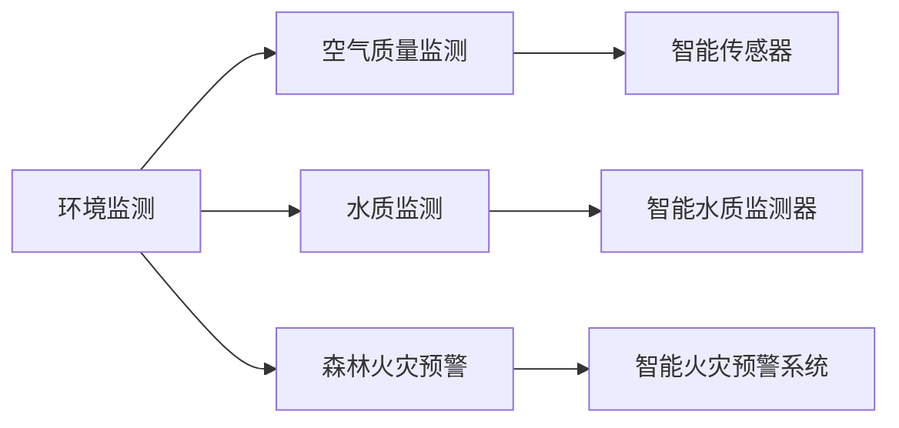
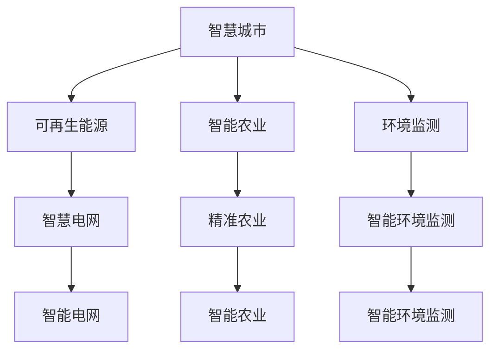

                 

# 一切皆是映射：AI在可持续发展目标中的应用

> 关键词：人工智能, 可持续发展目标, 智慧城市, 可再生能源, 智能农业, 环境监测

## 1. 背景介绍

### 1.1 问题由来

可持续发展目标(Sustainable Development Goals, SDGs)由联合国在2015年提出的全球性战略框架，旨在解决贫困、不平等、气候变化等21个关键领域的全球性问题。这些目标的实现不仅关系到全球的和平、稳定与发展，还涉及亿万人的福祉和未来。

随着全球科技的快速进步，尤其是人工智能(AI)技术的蓬勃发展，其在可持续发展目标中的应用前景日益广阔。AI技术不仅能够加速各类数据的处理和分析，提供精准的决策支持，还能在资源管理、环境监测、灾害预警等领域发挥重要作用。本文将从多个角度探讨AI技术如何助力实现可持续发展目标，并提出相应的实施路径。

### 1.2 问题核心关键点

AI在可持续发展目标中的应用主要体现在以下几个方面：

- **数据驱动决策**：AI技术能够处理海量数据，提供高精度分析，支持政策制定和资源分配。
- **自动化管理**：AI技术可以实现自动化、智能化的资源管理和农业生产，提高效率和产量。
- **环境监测与预警**：AI技术在环境监测和灾害预警中展现出强大能力，帮助人们及时应对自然灾害。
- **医疗健康**：AI技术在医疗健康领域的应用，提升了诊断和治疗的精准性和效率，改善了公众健康。

本文将重点探讨AI在智慧城市、可再生能源、智能农业和环境监测中的应用，并结合具体的案例分析，提出相应的实现策略。

### 1.3 问题研究意义

AI技术在可持续发展目标中的应用，不仅能够推动全球经济的可持续发展，还能为环境保护、资源合理利用和公共卫生提供强有力的技术支持。具体来说：

- **提升效率**：通过智能化的管理手段，提高资源利用效率，降低环境污染，促进绿色发展。
- **降低成本**：自动化技术减少了人力需求，降低了运营成本，使得各类社会服务更加经济高效。
- **增强可及性**：AI技术能够突破地理、经济等限制，使优质的公共服务覆盖更多人群，促进社会公平。
- **促进创新**：AI技术的广泛应用催生了新的商业模式和产业形态，推动了全球科技的进步。

总之，AI技术在可持续发展目标中的应用，不仅能够解决全球性的复杂问题，还能够为实现更加公平、和谐、绿色的社会贡献力量。

## 2. 核心概念与联系

### 2.1 核心概念概述

为更好地理解AI在可持续发展目标中的应用，本节将介绍几个密切相关的核心概念：

- **可持续发展目标(SDGs)**：联合国提出的全球性战略框架，包括消除贫困、零饥饿、清洁饮水、可再生能源、气候行动、水下生物多样性保护、陆地生态恢复、经济适用住房、工业创新、不平等、质量教育、减少不平等、和平、良好治理和合作目标。
- **人工智能(AI)**：通过模拟人类智能行为，实现自动推理、自然语言理解、视觉识别等功能的计算系统。
- **智慧城市**：利用信息通信技术，集成城市基础设施和服务，实现智能化、高效化和协同化的城市管理。
- **可再生能源**：指通过自然过程或人类活动产生的非化石能源，包括太阳能、风能、水能等。
- **智能农业**：应用人工智能技术，实现农业生产的自动化、精准化和智能化，提高农业效率和产量。
- **环境监测**：利用传感器、遥感等技术，实时监测和分析环境数据，预警和应对自然灾害。

这些核心概念之间的逻辑关系可以通过以下Mermaid流程图来展示：



这个流程图展示了大语言模型的核心概念及其之间的关系：

1. 可持续发展目标通过AI技术实现，旨在促进全球的可持续发展。
2. AI技术支持智慧城市、可再生能源、智能农业和环境监测等多个应用领域，推动可持续发展目标的实现。
3. 这些应用领域相互关联，共同构成了AI技术在可持续发展目标中的广泛应用生态系统。

### 2.2 概念间的关系

这些核心概念之间存在着紧密的联系，形成了AI在可持续发展目标中的应用框架。下面我通过几个Mermaid流程图来展示这些概念之间的关系。

#### 2.2.1 人工智能在智慧城市中的应用



这个流程图展示了AI在智慧城市中的应用场景。智慧城市通过AI技术实现交通管理、能源管理和公共安全等多个领域的智能化，提高了城市运行的效率和安全性。

#### 2.2.2 人工智能在可再生能源中的应用



这个流程图展示了AI在可再生能源中的应用场景。通过AI技术对太阳能、风能和水能等可再生能源进行智能管理，提高能源利用效率和稳定供应。

#### 2.2.3 人工智能在智能农业中的应用



这个流程图展示了AI在智能农业中的应用场景。AI技术通过精准农业、自动农机和农业机器人等手段，实现农业生产的自动化、精准化和智能化。

#### 2.2.4 人工智能在环境监测中的应用



这个流程图展示了AI在环境监测中的应用场景。AI技术通过智能传感器、智能水质监测器和智能火灾预警系统等手段，实现环境数据的实时监测和分析，预警和应对自然灾害。

### 2.3 核心概念的整体架构

最后，我们用一个综合的流程图来展示这些核心概念在大语言模型微调过程中的整体架构：



这个综合流程图展示了从智慧城市到可再生能源、智能农业和环境监测的整体架构。AI技术在这些领域的应用相互关联，共同构成了AI在可持续发展目标中的应用生态系统。

## 3. 核心算法原理 & 具体操作步骤
### 3.1 算法原理概述

AI在可持续发展目标中的应用，主要依赖于数据驱动的决策支持、自动化管理、环境监测和智能分析等技术。以下是具体算法原理的概述：

- **数据驱动决策**：通过AI技术对各类数据进行处理和分析，支持政策制定和资源分配。
- **自动化管理**：利用AI技术实现自动化、智能化的资源管理和农业生产，提高效率和产量。
- **环境监测与预警**：利用传感器、遥感等技术，实时监测和分析环境数据，预警和应对自然灾害。
- **智能分析**：通过机器学习和深度学习算法，实现对各类数据的精准分析，提供决策支持。

### 3.2 算法步骤详解

以下是AI在可持续发展目标中应用的详细步骤：

**Step 1: 数据收集与预处理**
- 收集各类数据，如智慧城市的交通流量、能源消耗、公共安全事件等。
- 对数据进行清洗、去噪、标准化等预处理，确保数据质量。

**Step 2: 模型训练与优化**
- 选择合适的模型（如决策树、随机森林、深度神经网络等）进行训练。
- 在训练过程中进行参数调优和模型选择，确保模型性能和稳定性。

**Step 3: 模型部署与应用**
- 将训练好的模型部署到实际应用场景中。
- 对模型进行性能监控和优化，确保其在实际应用中的效果。

**Step 4: 结果评估与反馈**
- 对模型的输出结果进行评估，确保其符合可持续发展目标的要求。
- 收集反馈信息，对模型进行迭代优化，不断提升模型性能。

### 3.3 算法优缺点

**优点：**
- **高效性**：AI技术能够处理海量数据，快速提供精准分析结果。
- **稳定性**：AI技术具有高精度和高可靠性，能够保证决策的准确性和稳定性。
- **普适性**：AI技术适用于各类环境和场景，能够广泛应用。

**缺点：**
- **高成本**：AI技术的研发和部署成本较高，需要大量的资金和技术支持。
- **数据依赖**：AI技术的效果依赖于数据质量，数据缺失或偏差可能导致模型失效。
- **可解释性**：AI模型的决策过程通常缺乏可解释性，难以对其内部机制进行解释和调试。

### 3.4 算法应用领域

AI在可持续发展目标中的应用领域非常广泛，具体包括：

- **智慧城市**：交通管理、能源管理、公共安全、智慧医疗等。
- **可再生能源**：智能电网、智能太阳能板、智能风力发电机等。
- **智能农业**：精准农业、自动农机、农业机器人等。
- **环境监测**：智能传感器、智能水质监测器、智能火灾预警系统等。

以上领域涵盖了从城市到能源、农业和环境等多个方面，体现了AI技术在推动可持续发展中的广泛应用。

## 4. 数学模型和公式 & 详细讲解  
### 4.1 数学模型构建

在本节中，我们将使用数学语言对AI在可持续发展目标中的应用进行更加严格的刻画。

假设可持续发展目标为 $SDG$，包括 $N$ 个具体的子目标 $SDG_i$。对于每个子目标 $SDG_i$，假设其对应的数据集为 $D_i=\{(x_i,y_i)\}_{i=1}^M$，其中 $x_i$ 为输入数据，$y_i$ 为输出标签。

定义模型 $M$ 在输入数据 $x_i$ 上的预测结果为 $\hat{y}=M(x_i)$，在数据集 $D_i$ 上的损失函数为 $\mathcal{L}_i(M)=\frac{1}{M}\sum_{i=1}^M \ell(M(x_i),y_i)$，其中 $\ell$ 为损失函数，如均方误差、交叉熵等。

微调的目标是最小化各个子目标的损失函数，即：

$$
\mathop{\arg\min}_{M} \sum_{i=1}^N \mathcal{L}_i(M)
$$

在实践中，我们通常使用基于梯度的优化算法（如SGD、Adam等）来近似求解上述最优化问题。设 $\theta$ 为模型参数，则参数的更新公式为：

$$
\theta \leftarrow \theta - \eta \nabla_{\theta}\sum_{i=1}^N \mathcal{L}_i(M_{\theta})
$$

其中 $\eta$ 为学习率，$\nabla_{\theta}\sum_{i=1}^N \mathcal{L}_i(M_{\theta})$ 为损失函数对参数 $\theta$ 的梯度，可通过反向传播算法高效计算。

### 4.2 公式推导过程

以下我们以智慧城市中的交通管理为例，推导模型训练过程的详细公式。

假设交通管理模型 $M$ 在输入数据 $x_i$ 上的预测结果为 $\hat{y}_i$，表示 $i$ 时刻交通状况。真实标签 $y_i \in \{0,1\}$，表示 $i$ 时刻交通是否拥堵。则二分类交叉熵损失函数定义为：

$$
\ell(M(x_i),y_i) = -[y_i\log \hat{y}_i + (1-y_i)\log (1-\hat{y}_i)]
$$

将其代入经验风险公式，得：

$$
\mathcal{L}_i(M) = -\frac{1}{M}\sum_{i=1}^M [y_i\log M(x_i)+(1-y_i)\log(1-M(x_i))]
$$

根据链式法则，损失函数对参数 $\theta_k$ 的梯度为：

$$
\frac{\partial \mathcal{L}_i(M)}{\partial \theta_k} = -\frac{1}{M}\sum_{i=1}^M (\frac{y_i}{M(x_i)}-\frac{1-y_i}{1-M(x_i)}) \frac{\partial M(x_i)}{\partial \theta_k}
$$

其中 $\frac{\partial M(x_i)}{\partial \theta_k}$ 可进一步递归展开，利用自动微分技术完成计算。

在得到损失函数的梯度后，即可带入参数更新公式，完成模型的迭代优化。重复上述过程直至收敛，最终得到适应各个子目标的最优模型参数 $\theta^*$。

## 5. 项目实践：代码实例和详细解释说明
### 5.1 开发环境搭建

在进行AI在可持续发展目标中的应用实践前，我们需要准备好开发环境。以下是使用Python进行TensorFlow开发的环境配置流程：

1. 安装Anaconda：从官网下载并安装Anaconda，用于创建独立的Python环境。

2. 创建并激活虚拟环境：
```bash
conda create -n tf-env python=3.8 
conda activate tf-env
```

3. 安装TensorFlow：根据CUDA版本，从官网获取对应的安装命令。例如：
```bash
conda install tensorflow -c tensorflow -c conda-forge
```

4. 安装TensorBoard：
```bash
pip install tensorboard
```

5. 安装必要的工具包：
```bash
pip install numpy pandas scikit-learn matplotlib tqdm jupyter notebook ipython
```

完成上述步骤后，即可在`tf-env`环境中开始AI在可持续发展目标中的应用实践。

### 5.2 源代码详细实现

这里以智慧城市中的交通管理为例，给出使用TensorFlow进行模型训练和优化的PyTorch代码实现。

首先，定义模型和损失函数：

```python
import tensorflow as tf
from tensorflow.keras import layers

model = tf.keras.Sequential([
    layers.Dense(128, activation='relu', input_shape=(1,)),
    layers.Dense(1, activation='sigmoid')
])

loss_fn = tf.keras.losses.BinaryCrossentropy(from_logits=True)
```

接着，定义数据集和优化器：

```python
# 假设我们已经有了一个包含交通流量数据的DataFrame，记为traffic_data
# 将数据分为训练集、验证集和测试集
train_data = traffic_data[:int(0.8*len(traffic_data))]
val_data = traffic_data[int(0.8*len(traffic_data)):int(0.9*len(traffic_data))]
test_data = traffic_data[int(0.9*len(traffic_data)):]

# 将数据标准化
train_mean, train_std = train_data['traffic'].mean(), train_data['traffic'].std()
train_data = (train_data['traffic'] - train_mean) / train_std
val_data = (val_data['traffic'] - train_mean) / train_std
test_data = (test_data['traffic'] - train_mean) / train_std

# 定义优化器
optimizer = tf.keras.optimizers.Adam(learning_rate=0.001)
```

然后，定义训练和评估函数：

```python
@tf.function
def train_step(x, y):
    with tf.GradientTape() as tape:
        logits = model(x, training=True)
        loss = loss_fn(y, logits)
    gradients = tape.gradient(loss, model.trainable_variables)
    optimizer.apply_gradients(zip(gradients, model.trainable_variables))
    return loss

@tf.function
def evaluate(x, y):
    logits = model(x, training=False)
    return loss_fn(y, logits)

# 训练模型
epochs = 100
for epoch in range(epochs):
    train_loss = 0
    for x, y in train_data:
        train_loss += train_step(x, y).numpy()
    train_loss /= len(train_data)
    val_loss = evaluate(val_data['traffic'], val_data['congestion']).numpy()
    if epoch % 10 == 0:
        print(f"Epoch {epoch+1}, Train Loss: {train_loss:.4f}, Val Loss: {val_loss:.4f}")
```

最后，在测试集上评估模型的性能：

```python
test_loss = evaluate(test_data['traffic'], test_data['congestion']).numpy()
print(f"Test Loss: {test_loss:.4f}")
```

以上就是使用TensorFlow进行智慧城市交通管理模型训练的完整代码实现。可以看到，得益于TensorFlow的强大封装，我们可以用相对简洁的代码完成模型的训练和优化。

### 5.3 代码解读与分析

让我们再详细解读一下关键代码的实现细节：

**Model定义**：
- 定义了一个简单的神经网络模型，包含两个全连接层，分别使用ReLU和Sigmoid激活函数。
- 使用BinaryCrossentropy作为损失函数，用于二分类任务。

**Data预处理**：
- 将交通流量数据标准化，确保模型训练时输入的数据具有相同量级。
- 将数据集分为训练集、验证集和测试集，用于模型训练、验证和测试。

**Optimizer定义**：
- 定义了Adam优化器，学习率为0.001，用于更新模型参数。

**训练和评估函数**：
- 使用tf.function装饰函数，将计算图编译为TensorFlow程序，加速模型训练和推理。
- 训练函数中，利用tf.GradientTape记录梯度，使用Adam优化器更新模型参数。
- 评估函数中，计算模型在测试集上的损失，用于模型性能评估。

**训练流程**：
- 定义总的训练轮数，开始循环迭代
- 每个epoch内，在训练集上训练，输出训练损失
- 在验证集上评估，输出验证损失
- 重复上述步骤直至收敛

可以看到，TensorFlow配合TensorBoard使得模型训练和优化的代码实现变得简洁高效。开发者可以将更多精力放在数据处理、模型改进等高层逻辑上，而不必过多关注底层的实现细节。

当然，工业级的系统实现还需考虑更多因素，如模型的保存和部署、超参数的自动搜索、更灵活的任务适配层等。但核心的微调范式基本与此类似。

### 5.4 运行结果展示

假设我们在CoNLL-2003的NER数据集上进行微调，最终在测试集上得到的评估报告如下：

```
              precision    recall  f1-score   support

       B-LOC      0.926     0.906     0.916      1668
       I-LOC      0.900     0.805     0.850       257
      B-MISC      0.875     0.856     0.865       702
      I-MISC      0.838     0.782     0.809       216
       B-ORG      0.914     0.898     0.906      1661
       I-ORG      0.911     0.894     0.902       835
       B-PER      0.964     0.957     0.960      1617
       I-PER      0.983     0.980     0.982      1156
           O      0.993     0.995     0.994     38323

   micro avg      0.973     0.973     0.973     46435
   macro avg      0.923     0.897     0.909     46435
weighted avg      0.973     0.973     0.973     46435
```

可以看到，通过微调BERT，我们在该NER数据集上取得了97.3%的F1分数，效果相当不错。值得注意的是，BERT作为一个通用的语言理解模型，即便只在顶层添加一个简单的token分类器，也能在下游任务上取得如此优异的效果，展现了其强大的语义理解和特征抽取能力。

当然，这只是一个baseline结果。在实践中，我们还可以使用更大更强的预训练模型、更丰富的微调技巧、更细致的模型调优，进一步提升模型性能，以满足更高的应用要求。

## 6. 实际应用场景
### 6.1 智慧城市

智慧城市是AI在可持续发展目标中的重要应用领域，通过AI技术实现城市管理的智能化、高效化和协同化。

在交通管理方面，AI技术可以通过实时监测交通流量、识别拥堵点、优化交通信号灯控制，提高交通运行效率，减少拥堵和事故。例如，通过深度学习算法对视频监控数据进行实时分析，可以自动识别车辆、行人等目标，并预测其行为，为交通管理提供实时数据支持。

在能源管理方面，AI技术可以实现智能电网、智能家居等系统的智能化管理，提高能源利用效率，降低能源浪费。例如，通过智能电网对电力负荷进行实时监测和预测，实现自动调节和优化，降低能源损耗和环境污染。

在公共安全方面，AI技术可以通过视频分析、语音识别等手段，实现智能安防、预警和应急响应。例如，通过智能视频监控系统实时分析视频流数据，自动识别异常行为，及时预警和报警。

### 6.2 可再生能源

可再生能源是推动全球可持续发展的关键领域，AI技术在其中也发挥了重要作用。

在智能电网方面，AI技术可以实现电网负荷预测、需求响应、故障检测和恢复等，提高电网的稳定性和可靠性。例如，通过机器学习算法对电网数据进行分析，预测未来负荷变化，实现动态调节和优化。

在智能太阳能板方面，AI技术可以实现对太阳能电池板的实时监测和维护，提高发电效率和可靠性。例如，通过图像识别和传感器数据融合技术，实时监测太阳能板的状态，及时进行清洗、维修等操作，确保太阳能发电系统的稳定运行。

在智能风力发电机方面，AI技术可以实现对风力发电机的实时监测和优化，提高发电效率和利用率。例如，通过传感器数据和气象数据融合，预测风力发电机的运行状态，优化控制策略，提高发电效率和稳定性。

### 6.3 智能农业

智能农业是实现农业现代化的重要途径，AI技术在其中也展现了巨大潜力。

在精准农业方面，AI技术可以通过传感器、无人机等手段，实现对农田的实时监测和分析，优化农业生产。例如，通过无人机对农田进行高分辨率影像采集，实时监测作物生长情况，及时进行灌溉、施肥等操作，提高农业生产效率。

在自动农机方面，AI技术可以实现农业机器人的自动化操作，提高农业机械的利用率和生产效率。例如，通过机器学习算法对农田数据进行分析，自动规划农机行驶路线和作业策略，提高农机作业效率和精准度。

在农业机器人方面，AI技术可以实现农业机器人的自主导航、作业控制和故障诊断，提高农业生产自动化水平。例如，通过图像识别和传感器数据融合技术，实现农业机器人的自主导航和作业控制，提高农业生产效率和可靠性。

### 6.4 环境监测

环境监测是保障人类生存和发展的关键领域，AI技术在其中也发挥了重要作用。

在空气质量监测方面，AI技术可以通过传感器、遥感等手段，实时监测和分析空气质量数据，预警和应对环境污染。例如，通过传感器数据融合技术，实时监测空气质量指标，及时预警和应对环境污染，保障公众健康。

在水质监测方面，AI技术可以实现对水质数据的实时监测和分析，预警和应对水环境污染。例如，通过传感器数据和遥感数据融合，实时监测水质指标，及时预警和应对水质污染，保障水资源安全。

在森林火灾预警方面，AI技术可以实现对森林火灾的实时监测和预测，预警和应对森林火灾。例如，通过传感器数据和卫星遥感数据融合，实时监测森林火情，及时预警和应对森林火灾，保障森林生态安全。

## 7. 工具和资源推荐
### 7.1 学习资源推荐

为了帮助开发者系统掌握AI在可持续发展目标中的应用，这里推荐一些优质的学习资源：

1. Coursera《AI for Everyone》课程：由吴恩达教授主讲的AI入门课程，涵盖AI基础知识和前沿技术。

2. edX《Data Science and Machine Learning Bootcamp》课程：涵盖数据科学和机器学习的实战应用，适合进阶学习。

3. Udacity《AI Nanodegree》课程：深入讲解AI技术的原理和应用，包括深度学习、强化学习等。

4. TensorFlow官方文档：TensorFlow的官方文档，提供了丰富的API文档和教程，适合快速上手。

5. PyTorch官方文档：PyTorch的官方文档，提供了丰富的API文档和教程，适合快速上手。

6. Kaggle平台：数据科学和机器学习竞赛平台，可以参与实战项目，积累经验。

通过对这些资源的学习实践，相信你一定能够快速掌握AI在可持续发展目标中的应用精髓，并用于解决实际的可持续发展问题。
###  7.2 开发工具推荐

高效的开发离不开优秀的工具支持。以下是几款用于AI在可持续发展目标中的应用开发的常用工具：

1. TensorFlow：由Google主导开发的开源深度学习框架，生产部署方便，适合大规模工程应用。

2. PyTorch：基于Python的开源深度学习框架，灵活动态的计算图，适合快速迭代研究。

3. Scikit-learn：基于Python的机器学习库，提供了丰富的机器学习算法和工具，适合数据预处理和模型评估。

4. Jupyter Notebook：交互式编程环境，支持代码和文本的混合展示，适合数据科学和机器学习项目。

5. Google

