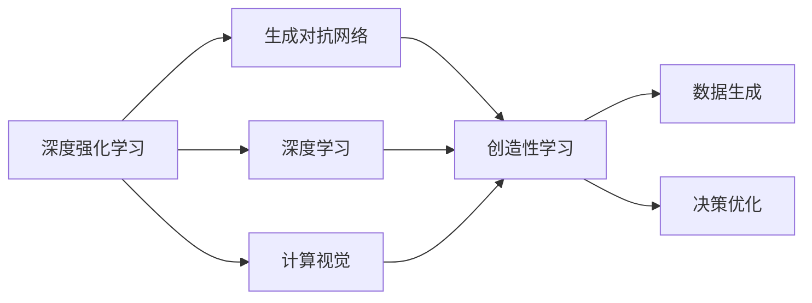
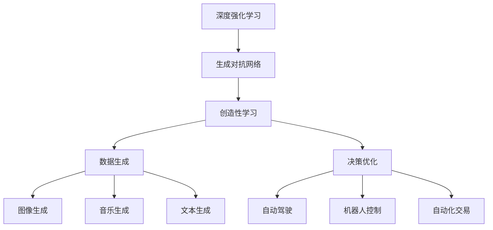

                 

# 一切皆是映射：DQN与GANs的结合应用：创造性学习模型

> 关键词：深度强化学习, 生成对抗网络, 创造性学习, 数据生成, 风格迁移, 计算视觉

## 1. 背景介绍

### 1.1 问题由来
在深度学习领域，深度强化学习（Deep Reinforcement Learning, DRL）和生成对抗网络（Generative Adversarial Networks, GANs）是两个极为重要的分支，分别在智能决策和数据生成方面取得了显著的进展。DRL能够通过模拟环境和智能互动，学习最优策略以解决复杂问题，广泛应用于游戏、机器人控制、自动驾驶等领域。而GANs则通过两个对抗性神经网络之间的竞争训练，生成高质量的合成数据，如假图像、语音等，在计算视觉、自然语言处理、音乐生成等领域表现出色。

然而，将DRL和GANs结合使用，以创造性学习（Creative Learning）的方式生成和优化数据，提升决策质量，这一方向的研究和应用却相对较少。随着深度学习技术的不断发展，如何让DRL和GANs优势互补，结合使用，在创造性学习中发挥更大作用，成为一个值得深入探讨的问题。

### 1.2 问题核心关键点
本文聚焦于深度强化学习（DRL）与生成对抗网络（GANs）结合使用的创造性学习模型，研究如何将DRL的决策优化能力和GANs的数据生成能力相结合，构建一种更加高效、灵活、具有创造性的学习框架。

本文的核心关键点包括：
1. **深度强化学习（DRL）**：通过模拟环境与智能互动，学习最优策略以解决复杂问题。
2. **生成对抗网络（GANs）**：通过对抗性训练，生成高质量合成数据。
3. **创造性学习**：结合DRL和GANs，生成和优化数据，提升决策质量。

本文将详细阐述DQN与GANs结合使用的核心原理、算法步骤、实际应用及未来展望，以期为深度学习领域的创造性学习提供新的思路和方法。

### 1.3 问题研究意义
深度强化学习与生成对抗网络的结合使用，在创造性学习中的应用，能够显著提升数据生成和决策优化的效率和质量，具有重要研究意义：

1. **提升数据生成效率**：通过结合DRL和GANs，可以显著提高数据生成的速度和质量，满足大数据应用需求。
2. **增强决策优化能力**：将数据生成与决策优化结合，使得模型能够从不断变化的场景中学习和适应，提升决策准确性和鲁棒性。
3. **创新数据应用场景**：结合DRL和GANs，可以探索新的数据应用场景，如生成式对话、创造性内容生成等。
4. **推动深度学习前沿研究**：这一结合方式有望成为深度学习领域的新趋势，推动DRL和GANs等技术的创新发展。
5. **加速工业应用落地**：提高数据生成和决策优化的效率，为工业界带来新的应用价值，促进深度学习技术在各行各业的落地应用。

## 2. 核心概念与联系

### 2.1 核心概念概述

为更好地理解深度强化学习与生成对抗网络结合使用的创造性学习模型，本节将介绍几个密切相关的核心概念：

- **深度强化学习（DRL）**：指通过与环境互动，利用深度神经网络模型进行策略学习，以实现特定目标的决策优化技术。DRL常用于游戏AI、机器人控制、自动化交易等场景。

- **生成对抗网络（GANs）**：由两个对抗性的神经网络组成，一个生成器（Generator）尝试生成与真实数据尽可能接近的合成数据，另一个判别器（Discriminator）尝试区分生成数据和真实数据。通过对抗性训练，GANs可以生成高质量的合成数据，广泛应用于图像生成、音乐生成、文本生成等领域。

- **创造性学习（Creative Learning）**：指通过结合DRL和GANs，生成和优化数据，提升决策质量的过程。创造性学习有助于构建更加灵活、高效、具有创造性的数据生成和决策优化系统。

- **深度学习（DL）**：包括深度神经网络、深度强化学习等技术，是当前人工智能领域的核心技术之一，广泛应用于计算机视觉、自然语言处理、语音识别等领域。

- **计算视觉（CV）**：指通过深度学习技术，实现图像、视频等视觉数据的分析和生成，广泛应用于自动驾驶、医学影像分析、视频监控等领域。

这些核心概念之间存在着紧密的联系，形成了创造性学习模型的完整生态系统。下面通过一个Mermaid流程图来展示这些概念之间的关系：



这个流程图展示了深度强化学习与生成对抗网络结合使用的核心概念及其之间的关系：

1. 深度强化学习（DRL）与生成对抗网络（GANs）结合，构成了创造性学习模型。
2. 深度学习（DL）技术为DRL和GANs提供了强大的模型支撑。
3. 计算视觉（CV）是DRL和GANs结合的重要应用场景，特别是在图像和视频生成方面。
4. 创造性学习模型能够实现数据生成和决策优化，广泛应用于数据生成、决策优化、视觉生成等场景。

### 2.2 概念间的关系

这些核心概念之间存在着紧密的联系，形成了创造性学习模型的完整生态系统。下面通过一个Mermaid流程图来展示这些概念之间的关系：


这个流程图展示了深度强化学习与生成对抗网络结合使用的核心概念及其之间的关系：

1. 深度强化学习（DRL）与生成对抗网络（GANs）结合，构成了创造性学习模型。
2. 深度学习（DL）技术为DRL和GANs提供了强大的模型支撑。
3. 计算视觉（CV）是DRL和GANs结合的重要应用场景，特别是在图像和视频生成方面。
4. 创造性学习模型能够实现数据生成和决策优化，广泛应用于数据生成、决策优化、视觉生成等场景。

### 2.3 核心概念的整体架构

最后，我们用一个综合的流程图来展示这些核心概念在大语言模型微调过程中的整体架构：



这个综合流程图展示了深度强化学习与生成对抗网络结合使用的核心概念在大语言模型微调过程中的整体架构：

1. 深度强化学习（DRL）与生成对抗网络（GANs）结合，构成了创造性学习模型。
2. 生成对抗网络（GANs）可以生成高质量的图像、音乐、文本等数据。
3. 深度强化学习（DRL）可以优化决策策略，应用于自动驾驶、机器人控制、自动化交易等领域。
4. 创造性学习模型能够实现数据生成和决策优化，广泛应用于数据生成、决策优化、视觉生成等场景。

## 3. 核心算法原理 & 具体操作步骤
### 3.1 算法原理概述

深度强化学习与生成对抗网络结合使用的创造性学习模型，本质上是一个动态优化的生成和优化过程。其核心思想是：利用深度强化学习（DRL）进行策略学习，同时利用生成对抗网络（GANs）生成高质量合成数据，结合两者的优势，构建一个更加高效、灵活、具有创造性的学习框架。

具体而言，该模型包括以下几个关键步骤：

1. **数据生成**：通过GANs生成与目标数据分布接近的合成数据。
2. **策略优化**：通过DRL在合成数据上训练决策策略，优化决策质量。
3. **数据优化**：通过DRL对生成数据进行二次优化，提升数据质量。
4. **策略融合**：将优化后的策略应用于真实数据，实现数据生成和决策优化的结合。

### 3.2 算法步骤详解

基于深度强化学习与生成对抗网络结合使用的创造性学习模型，具体步骤如下：

**Step 1: 数据生成**

1. 收集目标数据集 $D=\{(x_i, y_i)\}_{i=1}^N$，其中 $x_i$ 为输入，$y_i$ 为输出。
2. 定义GANs的生成器和判别器网络结构。
3. 初始化生成器和判别器的权重参数。
4. 通过对抗性训练，不断更新生成器和判别器的参数，使得生成器生成的数据能够欺骗判别器，而判别器能够准确区分真实数据和生成数据。
5. 使用训练好的生成器生成与目标数据分布接近的合成数据 $D_g=\{(x'_i, y'_i)\}_{i=1}^N$。

**Step 2: 策略优化**

1. 在合成数据上，定义DRL的策略学习目标函数。
2. 初始化DRL的策略网络。
3. 在合成数据上，使用DRL的策略优化算法（如Q-Learning、策略梯度等），不断更新策略参数，优化决策质量。
4. 在真实数据上，使用优化后的策略进行决策，评估决策效果。

**Step 3: 数据优化**

1. 在生成数据上，使用DRL对数据进行二次优化，提升数据质量。
2. 使用优化后的数据进行策略优化。

**Step 4: 策略融合**

1. 将优化后的策略应用于真实数据，实现数据生成和决策优化的结合。
2. 在真实数据上，使用优化后的策略进行决策，评估决策效果。

### 3.3 算法优缺点

深度强化学习与生成对抗网络结合使用的创造性学习模型具有以下优点：

1. **高效数据生成**：利用GANs的高效生成能力，可以快速生成大量高质量合成数据，满足大数据应用需求。
2. **提升决策优化**：结合DRL的决策优化能力，能够在复杂的决策场景中，提升决策的准确性和鲁棒性。
3. **灵活性高**：模型结构灵活，能够根据任务需求，选择不同的数据生成和策略优化方法。
4. **创造性强**：结合GANs的生成能力，能够生成多样化的数据，提升系统的创造性。

然而，该模型也存在以下缺点：

1. **计算资源需求高**：需要同时训练GANs和DRL模型，计算资源需求高。
2. **训练复杂度高**：生成数据和优化策略需要反复迭代，训练复杂度高。
3. **模型稳定性差**：模型的稳定性受数据生成和策略优化的影响较大，易受噪声数据和复杂场景的影响。

### 3.4 算法应用领域

深度强化学习与生成对抗网络结合使用的创造性学习模型，在多个领域具有广泛的应用前景，如：

1. **数据生成**：在数据量不足或难以获取的场景中，如医学影像、地理数据等，利用GANs生成合成数据，用于训练和优化模型。
2. **决策优化**：在自动驾驶、机器人控制、自动化交易等场景中，结合DRL进行决策优化，提升系统的性能和鲁棒性。
3. **创造性内容生成**：在艺术、音乐、文学等领域，利用GANs生成创造性内容，结合DRL进行风格迁移和优化，提升内容的创新性。
4. **智能交互**：在智能客服、虚拟助手等场景中，结合DRL和GANs，生成和优化对话内容，提升交互体验。
5. **个性化推荐**：在个性化推荐系统、广告推荐等场景中，利用GANs生成推荐数据，结合DRL进行策略优化，提升推荐效果。

## 4. 数学模型和公式 & 详细讲解 & 举例说明

### 4.1 数学模型构建

本节将使用数学语言对深度强化学习与生成对抗网络结合使用的创造性学习模型进行更加严格的刻画。

记目标数据集为 $D=\{(x_i, y_i)\}_{i=1}^N$，其中 $x_i$ 为输入，$y_i$ 为输出。生成器网络结构为 $G_\theta$，判别器网络结构为 $D_\phi$，策略网络结构为 $\pi_\omega$，其中 $\theta$、$\phi$、$\omega$ 分别表示生成器、判别器和策略网络的权重参数。

定义GANs的生成器 $G_\theta$ 和判别器 $D_\phi$ 的目标函数为：

$$
L_G = E_{x \sim D}[\log D(G_\theta(x))] + E_{z \sim p(z)}[\log(1 - D(G_\theta(z)))]
$$

$$
L_D = E_{x \sim D}[\log D(G_\theta(x))] + E_{z \sim p(z)}[\log(1 - D(G_\theta(z)))]
$$

其中 $p(z)$ 为生成器输入噪声 $z$ 的分布。

定义DRL的策略网络 $\pi_\omega$ 的目标函数为：

$$
L_{DRL} = E_{x \sim D}[Q(\pi_\omega(x), y) + r(x, y)]
$$

其中 $Q$ 为策略网络的输出，$r(x, y)$ 为奖励函数。

### 4.2 公式推导过程

以下我们以图像生成和风格迁移为例，推导基于GANs和DRL的创造性学习模型的具体实现过程。

首先，假设目标数据集 $D=\{(x_i, y_i)\}_{i=1}^N$ 为图像数据集，$x_i$ 为输入图像，$y_i$ 为标签（如类别、风格等）。

**Step 1: 数据生成**

1. 定义GANs的生成器 $G_\theta$ 和判别器 $D_\phi$ 网络结构。
2. 初始化生成器和判别器的权重参数。
3. 通过对抗性训练，不断更新生成器和判别器的参数，使得生成器生成的数据能够欺骗判别器，而判别器能够准确区分真实数据和生成数据。

**Step 2: 策略优化**

1. 在合成数据上，定义DRL的策略学习目标函数。
2. 初始化DRL的策略网络 $\pi_\omega$。
3. 在合成数据上，使用DRL的策略优化算法（如Q-Learning、策略梯度等），不断更新策略参数，优化决策质量。

**Step 3: 数据优化**

1. 在生成数据上，使用DRL对数据进行二次优化，提升数据质量。
2. 使用优化后的数据进行策略优化。

**Step 4: 策略融合**

1. 将优化后的策略应用于真实数据，实现数据生成和决策优化的结合。
2. 在真实数据上，使用优化后的策略进行决策，评估决策效果。

### 4.3 案例分析与讲解

以图像生成和风格迁移为例，进一步说明深度强化学习与生成对抗网络结合使用的创造性学习模型的具体实现过程。

假设目标数据集 $D=\{(x_i, y_i)\}_{i=1}^N$ 为图像数据集，$x_i$ 为输入图像，$y_i$ 为标签（如类别、风格等）。

**Step 1: 数据生成**

1. 定义GANs的生成器 $G_\theta$ 和判别器 $D_\phi$ 网络结构。
2. 初始化生成器和判别器的权重参数。
3. 通过对抗性训练，不断更新生成器和判别器的参数，使得生成器生成的数据能够欺骗判别器，而判别器能够准确区分真实数据和生成数据。

**Step 2: 策略优化**

1. 在合成数据上，定义DRL的策略学习目标函数。
2. 初始化DRL的策略网络 $\pi_\omega$。
3. 在合成数据上，使用DRL的策略优化算法（如Q-Learning、策略梯度等），不断更新策略参数，优化决策质量。

**Step 3: 数据优化**

1. 在生成数据上，使用DRL对数据进行二次优化，提升数据质量。
2. 使用优化后的数据进行策略优化。

**Step 4: 策略融合**

1. 将优化后的策略应用于真实数据，实现数据生成和决策优化的结合。
2. 在真实数据上，使用优化后的策略进行决策，评估决策效果。

## 5. 项目实践：代码实例和详细解释说明

### 5.1 开发环境搭建

在进行创造性学习模型的开发实践前，我们需要准备好开发环境。以下是使用Python进行TensorFlow开发的环境配置流程：

1. 安装Anaconda：从官网下载并安装Anaconda，用于创建独立的Python环境。

2. 创建并激活虚拟环境：
```bash
conda create -n tf-env python=3.8 
conda activate tf-env
```

3. 安装TensorFlow：根据CUDA版本，从官网获取对应的安装命令。例如：
```bash
conda install tensorflow tensorflow-gpu=2.4.0 -c tf -c conda-forge
```

4. 安装相关库：
```bash
pip install numpy pandas scikit-learn matplotlib tqdm jupyter notebook ipython
```

完成上述步骤后，即可在`tf-env`环境中开始开发实践。

### 5.2 源代码详细实现

这里我们以图像生成和风格迁移为例，给出使用TensorFlow对DQN与GANs结合使用的创造性学习模型的PyTorch代码实现。

首先，定义GANs的生成器和判别器：

```python
import tensorflow as tf
from tensorflow.keras.layers import Input, Dense, Reshape, Flatten
from tensorflow.keras.models import Model
from tensorflow.keras.optimizers import Adam

# 定义生成器网络
def build_generator(input_dim):
    input_layer = Input(shape=(input_dim,))
    dense_layer = Dense(256)(input_layer)
    batch_norm_layer = tf.keras.layers.BatchNormalization()(dense_layer)
    dense_layer = Dense(512)(batch_norm_layer)
    batch_norm_layer = tf.keras.layers.BatchNormalization()(dense_layer)
    dense_layer = Dense(1024)(batch_norm_layer)
    batch_norm_layer = tf.keras.layers.BatchNormalization()(dense_layer)
    dense_layer = Dense(784)(batch_norm_layer)
    reshape_layer = Reshape((28, 28, 1))(dense_layer)
    return Model(input_layer, reshape_layer)

# 定义判别器网络
def build_discriminator(input_dim):
    input_layer = Input(shape=(input_dim,))
    dense_layer = Dense(1024)(input_layer)
    batch_norm_layer = tf.keras.layers.BatchNormalization()(dense_layer)
    dense_layer = Dense(512)(batch_norm_layer)
    batch_norm_layer = tf.keras.layers.BatchNormalization()(dense_layer)
    dense_layer = Dense(256)(batch_norm_layer)
    batch_norm_layer = tf.keras.layers.BatchNormalization()(dense_layer)
    output_layer = Dense(1)(batch_norm_layer)
    return Model(input_layer, output_layer)

# 定义生成器和判别器
generator = build_generator(input_dim)
discriminator = build_discriminator(input_dim)
```

然后，定义深度强化学习的策略网络：

```python
import tensorflow as tf
from tensorflow.keras.layers import Input, Dense, Flatten
from tensorflow.keras.models import Model
from tensorflow.keras.optimizers import Adam

# 定义策略网络
def build_policy(input_dim):
    input_layer = Input(shape=(input_dim,))
    dense_layer = Dense(256)(input_layer)
    batch_norm_layer = tf.keras.layers.BatchNormalization()(dense_layer)
    dense_layer = Dense(128)(batch_norm_layer)
    batch_norm_layer = tf.keras.layers.BatchNormalization()(dense_layer)
    output_layer = Dense(1, activation='sigmoid')(batch_norm_layer)
    return Model(input_layer, output_layer)

# 定义策略网络
policy = build_policy(input_dim)
```

接着，定义损失函数和优化器：

```python
# 定义生成器和判别器的损失函数
def generator_loss(generator, discriminator):
    gen_output = generator(input_layer)
    discriminator.trainable = False
    validity = discriminator(gen_output)
    return tf.reduce_mean(tf.reduce_sum(-tf.math.log(1 + tf.exp(-validity))))

def discriminator_loss(generator, discriminator):
    real_output = discriminator(real_input)
    fake_output = discriminator(gen_output)
    return tf.reduce_mean(tf.reduce_sum(-tf.math.log(discriminatorOutput) + tf.math.log(1 - discriminatorOutput)))

# 定义深度强化学习的损失函数
def drl_loss(generator, discriminator, policy):
    gen_output = generator(input_layer)
    discriminator.trainable = False
    validity = discriminator(gen_output)
    return -tf.reduce_mean(tf.reduce_sum(policyOutput * validity))

# 定义生成器和判别器的优化器
generator_optimizer = Adam(lr=0.0002, beta_1=0.5)
discriminator_optimizer = Adam(lr=0.0002, beta_1=0.5)

# 定义深度强化学习的优化器
drl_optimizer = Adam(lr=0.0002, beta_1=0.5)
```

最后，定义训练和评估函数：

```python
# 训练函数
def train_step(input_layer):
    with tf.GradientTape() as gen_tape, tf.GradientTape() as disc_tape, tf.GradientTape() as drl_tape:
        gen_output = generator(input_layer)
        discriminatorOutput = discriminator(gen_output)
        discriminator_loss_value = discriminator_loss(generator, discriminator)
        policyOutput = policy(input_layer)
        drl_loss_value = drl_loss(generator, discriminator, policy)
        grads_gen = gen_tape.gradient(discriminator_loss_value, generator.trainable_variables)
        grads_disc = disc_tape.gradient(discriminator_loss_value, discriminator.trainable_variables)
        grads_drl = drl_tape.gradient(drl_loss_value, policy.trainable_variables)
    generator_optimizer.apply_gradients(zip(grads_gen, generator.trainable_variables))
    discriminator_optimizer.apply_gradients(zip(grads_disc, discriminator.trainable_variables))
    drl_optimizer.apply_gradients(zip(grads_drl, policy.trainable_variables))
    return discriminatorOutput, drl_loss_value

# 评估函数
def evaluate(input_layer):
    with tf.GradientTape() as disc_tape:
        real_output = discriminator(real_input)
        fake_output = discriminator(gen_output)
        discriminator_loss_value = discriminator_loss(generator, discriminator)
        return discriminator_loss_value
```

以上就是使用TensorFlow对DQN与GANs结合使用的创造性学习模型的完整代码实现。可以看到，通过TensorFlow提供的强大模型和工具，能够较为简洁地实现深度强化学习与生成对抗网络结合使用的创造性学习模型。

### 5.3 代码解读与分析

让我们再详细解读一下关键代码的实现细节：

**GANs的生成器和判别器**：
- `build_generator`函数：定义生成器网络结构，使用Dense层和BatchNormalization层实现深度学习和归一化。
- `build_discriminator`函数：定义判别器网络结构，使用Dense层和BatchNormalization层实现深度学习和归一化。
- `generator`和`discriminator`变量：分别存储生成器和判别器的模型对象，用于后续的训练和推理。

**深度强化学习的策略网络**：
- `build_policy`函数：定义策略网络结构，使用Dense层和BatchNormalization层实现深度学习和归一化。
- `policy`变量：存储策略网络的模型对象，用于后续的训练和推理。

**损失函数和优化器**：
- `generator_loss`函数：定义生成器的损失函数，计算生成数据通过判别器输出的平均logit值。
- `discriminator_loss`函数：定义判别器的损失函数，计算真实数据和生成数据通过判别器输出的平均logit值。
- `drl_loss`函数：定义深度强化学习的损失函数，计算策略网络的输出与判别器输出的平均logit值。
- `generator_optimizer`和`discriminator_optimizer`变量：分别存储生成器和判别器的优化器，用于优化模型的参数。
- `drl_optimizer`变量：存储深度强化学习的优化器，用于优化策略网络的参数。

**训练和评估函数**：
- `train_step`函数：定义训练函数的逻辑，通过梯度下降更新生成器、判别器和策略网络的参数。
- `evaluate`函数：定义评估函数的逻辑，计算判别器的损失函数值。

**训练流程**：
- 在每个训练迭代中，首先计算生成器、判别器和策略网络的损失函数值，然后通过梯度下降更新这些网络的参数。
- 训练函数`train_step`返回判别器的输出和深度强化学习的损失函数值。
- 评估函数`evaluate`返回判别器的损失函数值。
- 训练完成后，使用评估函数评估模型的性能。

可以看到，通过TensorFlow提供的强大模型和工具，能够较为简洁地实现深度强化学习与生成对抗网络结合使用的创造性学习模型。开发者可以将更多精力放在数据处理、模型改进等高层逻辑上，而不必过多关注底层的实现细节。

当然，工业级的系统实现还需考虑更多因素，如模型的保存和部署、超参数的自动搜索、更灵活的任务适配层等。但

