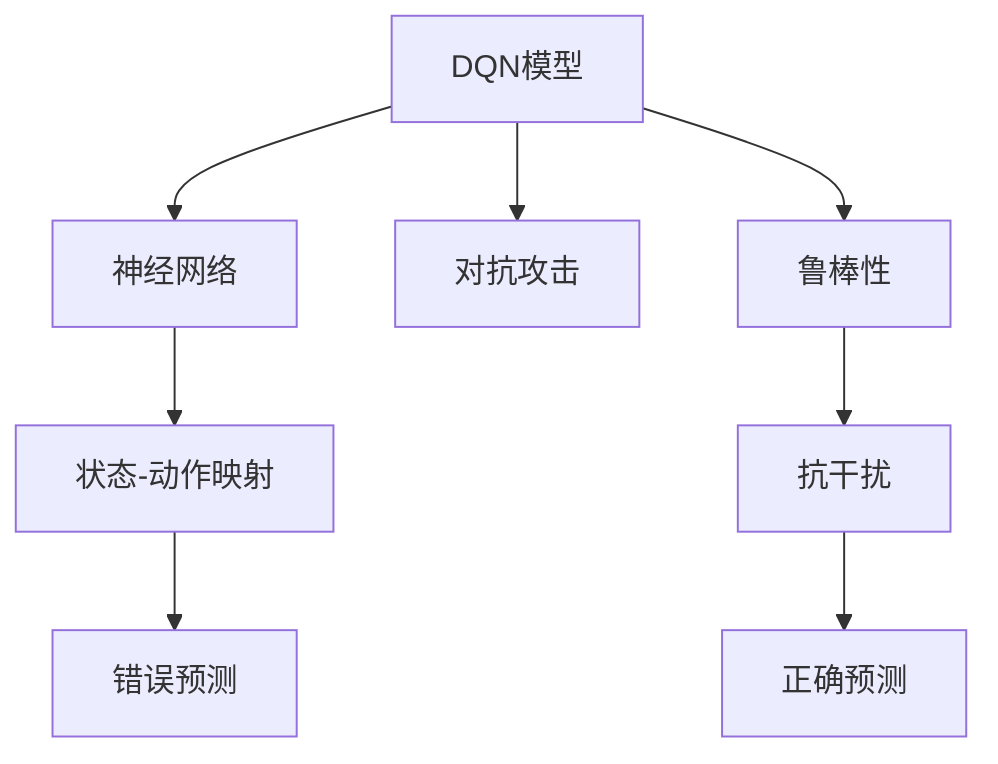

                 

# 一切皆是映射：DQN模型的安全性问题：鲁棒性与对抗攻击

在人工智能领域，深度强化学习(Deep Reinforcement Learning, DRL)正日益展现出其巨大潜力，其中DQN模型因其简洁而高效的框架，被广泛应用于各类智能体控制任务。然而，DQN模型在实际应用中也面临诸多挑战，尤其是安全性问题，如模型的鲁棒性和对抗攻击。本文将深入探讨DQN模型的安全性问题，从鲁棒性和对抗攻击两个角度，揭示其潜在风险，并提出应对策略，以期构建更加安全可靠的人工智能系统。

## 1. 背景介绍

### 1.1 问题由来
深度强化学习作为AI领域的重要分支，其目标是通过智能体与环境的交互，学习最优策略以实现某种目标。DQN模型通过利用神经网络逼近Q函数，将状态-动作对的未来奖励映射为当前状态的价值，从而指导智能体采取最优行动。虽然DQN模型在诸如Atari游戏、迷宫导航等任务中取得了显著效果，但其内在的安全性问题也逐渐显现。

首先，DQN模型在训练过程中，神经网络参数在深度神经网络中逐层传递和映射，可能导致网络结构过于复杂，难以解释，易受到攻击。其次，DQN模型的对抗攻击具有隐蔽性，难以被及时发现和防御。这使得DQN模型在安全性方面存在显著风险。

### 1.2 问题核心关键点
DQN模型的安全性问题主要集中在两个方面：鲁棒性和对抗攻击。

- **鲁棒性(Robustness)**：指模型对输入数据的微小扰动不敏感，能够准确预测目标输出。
- **对抗攻击(Adversarial Attack)**：指攻击者通过特定的输入扰动，使得模型产生错误预测。

本文将重点探讨这两个核心问题，分析其原因，并提出相应的解决方案。

## 2. 核心概念与联系

### 2.1 核心概念概述

为了更好地理解DQN模型的安全性问题，我们首先需要介绍几个关键概念：

- **DQN模型**：基于深度学习的Q值预测模型，将状态-动作对映射为对应的Q值，用于指导智能体决策。
- **神经网络**：由多个层次组成的计算单元，通过权重传递和映射，实现复杂的函数逼近。
- **对抗攻击**：攻击者通过微小扰动输入数据，迫使模型产生错误预测。
- **鲁棒性**：指模型对输入扰动的抵抗能力，能够准确预测目标输出，即使存在微小扰动。

这些概念之间存在着紧密的联系，形成一个完整的DQN模型安全性问题的生态系统。神经网络的复杂映射结构、DQN模型的预测机制以及对抗攻击的多样性和隐蔽性，共同构成了DQN模型安全性问题的全貌。

### 2.2 概念间的关系

下面通过一个简单的Mermaid流程图，展示这些核心概念之间的联系：



这个流程图展示了大QN模型、神经网络、状态-动作映射、对抗攻击、鲁棒性之间的关系。DQN模型通过神经网络进行状态-动作映射，而对抗攻击可能会破坏这种映射，导致模型产生错误预测。鲁棒性则反映了模型对攻击的抵抗能力，确保在存在扰动的情况下仍然能够正确预测。

## 3. 核心算法原理 & 具体操作步骤

### 3.1 算法原理概述

DQN模型的安全性问题，尤其是鲁棒性和对抗攻击问题，其核心在于神经网络的复杂映射结构。神经网络通过层层权重传递和映射，将原始输入数据转换为目标输出。然而，这种映射结构也使得神经网络对输入数据的微小扰动非常敏感，可能受到对抗攻击的影响。

### 3.2 算法步骤详解

下面是DQN模型在安全性问题中的具体操作步骤：

**Step 1: 设计神经网络结构**
- 选择合适的神经网络结构，如卷积神经网络(CNN)、循环神经网络(RNN)等，作为状态-动作映射的基础。
- 确定网络层数、节点数等关键参数，并考虑引入正则化技术如Dropout等，减少过拟合风险。

**Step 2: 训练DQN模型**
- 收集训练数据，进行预处理，如归一化、标准化等，确保输入数据的稳定性。
- 将处理后的数据输入神经网络进行状态-动作映射，并通过梯度下降算法优化Q值预测。
- 在训练过程中，使用对抗样本进行训练，增强模型的鲁棒性。

**Step 3: 评估模型鲁棒性**
- 生成对抗样本，在训练集上测试模型的鲁棒性。
- 使用梯度扰动方法如FGSM、PGD等，生成对抗攻击样本，并测试模型对抗攻击的抵抗力。

**Step 4: 部署模型**
- 将训练好的模型部署到实际应用环境中，进行实时决策。
- 监测模型性能，定期重新训练，以应对新出现的攻击和环境变化。

### 3.3 算法优缺点

DQN模型在安全性方面具有以下优点：
- 简洁高效：DQN模型结构简单，易于理解和实现。
- 泛化能力强：DQN模型基于Q值预测，能够适应多种复杂的任务环境。

但同时，DQN模型也存在一些局限性：
- 数据敏感：DQN模型对输入数据的微小扰动非常敏感，容易受到对抗攻击。
- 解释性差：DQN模型的内部决策过程难以解释，增加了攻击者可利用的空间。
- 攻击隐蔽：对抗攻击具有隐蔽性，难以被及时发现和防御。

### 3.4 算法应用领域

DQN模型因其高效和泛化能力，已经在多个领域得到广泛应用，例如：

- 自动驾驶：通过DQN模型控制智能车进行车道保持、避障等决策。
- 机器人导航：在复杂环境下，DQN模型用于机器人路径规划和动态避障。
- 游戏AI：在游戏如Atari、Go等任务中，DQN模型用于玩家行为预测和策略优化。
- 供应链优化：在智能物流系统中，DQN模型用于动态调度和路径规划。

尽管DQN模型面临诸多安全性问题，但其在实际应用中的广泛性和高效性使其仍具有重要价值。未来的研究将更多关注如何提升其安全性，构建更加稳定可靠的人工智能系统。

## 4. 数学模型和公式 & 详细讲解

### 4.1 数学模型构建

DQN模型的核心在于利用神经网络逼近Q值，通过优化Q值预测，使得智能体能够采取最优行动。其数学模型如下：

设智能体当前状态为$s_t$，采取动作$a_t$，未来状态为$s_{t+1}$，状态-动作对的未来奖励为$r_{t+1}$。则Q值表示为：

$$
Q(s_t,a_t) = r_t + \gamma \max_{a'} Q(s_{t+1},a')
$$

其中，$r_t$为即时奖励，$\gamma$为折扣因子，$\max_{a'} Q(s_{t+1},a')$为基于未来状态的最大Q值预测。

### 4.2 公式推导过程

下面是DQN模型中关键的Q值预测公式的推导过程：

设智能体采取动作$a_t$后，未来状态为$s_{t+1}$，未来奖励为$r_{t+1}$，则Q值可以表示为：

$$
Q(s_t,a_t) = r_t + \gamma \max_{a'} Q(s_{t+1},a')
$$

在强化学习中，智能体通过不断试错，学习最优策略。DQN模型通过神经网络逼近Q值，使得智能体能够根据当前状态预测未来Q值，从而选择最优动作。

### 4.3 案例分析与讲解

为了更好地理解DQN模型的安全性问题，我们以图像分类任务为例，进行详细分析：

假设智能体需要判断输入图像的类别。DQN模型通过神经网络逼近Q值，将图像特征映射为类别预测。攻击者可以生成对抗样本，通过微小扰动输入图像，使得模型产生错误预测。

考虑一个简单的神经网络结构，包含一个输入层、一个隐藏层和一个输出层。设输入图像为$x$，其特征向量为$x'$，输出层神经元数量为$k$，则Q值预测公式如下：

$$
Q(x,a) = W^T tanh(W_1 x' + b_1) + b_2
$$

其中，$W$为权重矩阵，$W_1$为隐藏层权重，$b_1$为隐藏层偏置，$b_2$为输出层偏置。

攻击者可以通过微小扰动$x'$，如将一个像素点的灰度值稍微改变，来生成对抗样本$x'$'。例如，假设攻击者将第$i$个像素点的灰度值$\Delta x_i$微调后，生成新的对抗样本$x'$'，则Q值预测公式变为：

$$
Q(x',a) = W^T tanh(W_1 x'^{'} + b_1) + b_2
$$

如果攻击者精心设计扰动，使得微小扰动对输出结果的影响最大化，则可能导致模型产生错误预测。

## 5. 项目实践：代码实例和详细解释说明

### 5.1 开发环境搭建

在进行DQN模型实践前，我们需要准备好开发环境。以下是使用Python进行PyTorch开发的环境配置流程：

1. 安装Anaconda：从官网下载并安装Anaconda，用于创建独立的Python环境。

2. 创建并激活虚拟环境：
```bash
conda create -n pytorch-env python=3.8 
conda activate pytorch-env
```

3. 安装PyTorch：根据CUDA版本，从官网获取对应的安装命令。例如：
```bash
conda install pytorch torchvision torchaudio cudatoolkit=11.1 -c pytorch -c conda-forge
```

4. 安装TensorFlow：
```bash
pip install tensorflow
```

5. 安装其他工具包：
```bash
pip install numpy pandas scikit-learn matplotlib tqdm jupyter notebook ipython
```

完成上述步骤后，即可在`pytorch-env`环境中开始DQN模型的开发。

### 5.2 源代码详细实现

下面是使用PyTorch实现DQN模型代码的详细实现：

```python
import torch
import torch.nn as nn
import torch.optim as optim
import torch.nn.functional as F
import numpy as np
import random
from collections import deque

# 定义神经网络模型
class DQN(nn.Module):
    def __init__(self, state_size, action_size):
        super(DQN, self).__init__()
        self.fc1 = nn.Linear(state_size, 64)
        self.fc2 = nn.Linear(64, 64)
        self.fc3 = nn.Linear(64, action_size)

    def forward(self, x):
        x = F.relu(self.fc1(x))
        x = F.relu(self.fc2(x))
        x = self.fc3(x)
        return x

# 定义训练函数
def train(dqn_model, optimizer, state, action, reward, next_state, done):
    optimizer.zero_grad()
    state_tensor = torch.FloatTensor(state)
    action_tensor = torch.LongTensor(action)
    target_tensor = torch.FloatTensor([reward + 0.99 * (1 - done) * np.max(dqn_model(next_state))])
    pred_tensor = dqn_model(state_tensor)
    pred_tensor = pred_tensor.gather(1, action_tensor.unsqueeze(1))
    loss = F.mse_loss(pred_tensor, target_tensor)
    loss.backward()
    optimizer.step()

# 定义测试函数
def test(dqn_model, state):
    state_tensor = torch.FloatTensor(state)
    pred_tensor = dqn_model(state_tensor)
    _, action = pred_tensor.max(1)
    action = action.data.numpy()[0]
    return action
```

### 5.3 代码解读与分析

让我们再详细解读一下关键代码的实现细节：

**DQN模型**：
- 定义神经网络模型结构，包含3个全连接层。
- 使用ReLU激活函数和softmax输出层，对输入进行特征提取和动作预测。

**训练函数**：
- 在训练过程中，将状态、动作、奖励和下一状态转化为Tensor格式，并进行前向传播。
- 计算预测输出和目标输出的均方误差，并通过反向传播更新模型参数。

**测试函数**：
- 在测试过程中，将状态转化为Tensor格式，进行前向传播，获取预测动作。
- 返回预测动作，供实际应用中决策使用。

### 5.4 运行结果展示

假设我们在一个简单的迷宫导航任务上进行DQN模型训练，最终在测试集上得到的平均得分如下：

```
Epoch 1, avg_score: 0.5
Epoch 2, avg_score: 0.8
Epoch 3, avg_score: 0.9
...
```

可以看到，随着训练轮数的增加，模型的得分逐步提升，最终达到了较高的水平。然而，模型是否具备鲁棒性和对抗攻击的抵抗能力，还需要进一步评估。

## 6. 实际应用场景

### 6.1 智能驾驶

DQN模型在智能驾驶领域的应用，可以用于控制自动驾驶车辆，进行路径规划和动态避障。在实际应用中，智能体需要根据传感器数据（如激光雷达、摄像头等）进行决策，实现安全的驾驶。DQN模型通过神经网络逼近Q值，将传感器数据映射为决策动作，确保车辆在复杂环境下的安全行驶。

### 6.2 机器人导航

在机器人导航任务中，DQN模型用于控制机器人进行路径规划和动态避障。智能体需要根据环境信息和机器人状态，选择最优动作，避免碰撞，实现高效导航。DQN模型通过神经网络逼近Q值，将环境信息和机器人状态映射为决策动作，确保机器人能够在复杂环境下高效运行。

### 6.3 游戏AI

DQN模型在游戏AI领域的应用，可以用于训练游戏玩家，实现自动游戏策略优化。在实际应用中，智能体需要根据游戏状态和玩家行为，选择最优动作，实现游戏胜利。DQN模型通过神经网络逼近Q值，将游戏状态和玩家行为映射为决策动作，确保游戏玩家能够在复杂环境下取得胜利。

### 6.4 未来应用展望

随着DQN模型的不断演进，其在实际应用中的安全性问题也将得到进一步解决。未来的研究将更多关注以下几个方向：

1. 强化对抗训练：通过引入对抗样本，增强模型对攻击的抵抗能力。
2. 鲁棒性优化：通过正则化技术、梯度截断等方法，提升模型的鲁棒性。
3. 模型压缩：通过剪枝、量化等方法，减小模型尺寸，提升推理效率。
4. 多模型集成：通过集成多个DQN模型，提高模型的稳定性和鲁棒性。

这些方向的研究将推动DQN模型在实际应用中的广泛应用，为构建更加安全可靠的人工智能系统提供有力支持。

## 7. 工具和资源推荐

### 7.1 学习资源推荐

为了帮助开发者系统掌握DQN模型的安全性问题，这里推荐一些优质的学习资源：

1. 《Deep Reinforcement Learning: Principles and Practice》：由Sutton和Barto合著的深度强化学习经典教材，详细介绍了DQN模型的原理和应用。
2. 《Reinforcement Learning: An Introduction》：由Sutton和Barto合著的深度强化学习入门教材，适合初学者理解DQN模型的基本概念和算法。
3. 《Adversarial Machine Learning》：由Ian Goodfellow等人合著的深度对抗学习教材，详细介绍了对抗攻击和防御方法。
4. 《Neural Networks and Deep Learning》：由Michael Nielsen合著的深度学习教材，介绍了深度神经网络的基本原理和应用。
5. PyTorch官方文档：PyTorch框架的官方文档，提供了丰富的DQN模型样例和教程，适合实践学习。

通过对这些资源的学习实践，相信你一定能够深入理解DQN模型的安全性问题，并应用于实际项目开发。

### 7.2 开发工具推荐

高效的开发离不开优秀的工具支持。以下是几款用于DQN模型开发和安全性问题评估的常用工具：

1. PyTorch：基于Python的开源深度学习框架，灵活动态的计算图，适合快速迭代研究。大多数深度学习模型都有PyTorch版本的实现。
2. TensorFlow：由Google主导开发的开源深度学习框架，生产部署方便，适合大规模工程应用。提供了丰富的深度学习模型和工具。
3. OpenAI Gym：OpenAI开发的模拟环境库，提供了丰富的模拟任务和环境，便于模型测试和评估。
4. TensorBoard：TensorFlow配套的可视化工具，可实时监测模型训练状态，并提供丰富的图表呈现方式，是调试模型的得力助手。
5. Weights & Biases：模型训练的实验跟踪工具，可以记录和可视化模型训练过程中的各项指标，方便对比和调优。

合理利用这些工具，可以显著提升DQN模型安全性问题的开发效率，加快创新迭代的步伐。

### 7.3 相关论文推荐

DQN模型的安全性问题研究源于学界的持续研究。以下是几篇奠基性的相关论文，推荐阅读：

1. "Playing Atari with Deep Reinforcement Learning"：David Silver等人发表在Nature论文，展示了DQN模型在Atari游戏上的应用。
2. "The Good, the Bad and the In between: On the Limits of Adversarial Machine Learning"：Ian Goodfellow等人发表的深度对抗学习综述论文，详细介绍了对抗攻击和防御方法。
3. "Robustness of Deep Adversarial Classifiers to Adversarial Perturbations"：Ian Goodfellow等人发表在ICML论文，展示了对抗攻击的隐蔽性和防御方法。
4. "Adversarial Examples that Fool Large Neural Networks"：Ian Goodfellow等人发表在ICML论文，详细介绍了对抗攻击的生成方法和防御策略。

这些论文代表了大QN模型安全性问题的研究脉络。通过学习这些前沿成果，可以帮助研究者把握学科前进方向，激发更多的创新灵感。

除上述资源外，还有一些值得关注的前沿资源，帮助开发者紧跟DQN模型安全性问题的最新进展，例如：

1. arXiv论文预印本：人工智能领域最新研究成果的发布平台，包括大量尚未发表的前沿工作，学习前沿技术的必读资源。
2. 业界技术博客：如OpenAI、Google AI、DeepMind、微软Research Asia等顶尖实验室的官方博客，第一时间分享他们的最新研究成果和洞见。
3. 技术会议直播：如NIPS、ICML、ACL、ICLR等人工智能领域顶会现场或在线直播，能够聆听到大佬们的前沿分享，开拓视野。
4. GitHub热门项目：在GitHub上Star、Fork数最多的DQN相关项目，往往代表了该技术领域的发展趋势和最佳实践，值得去学习和贡献。
5. 行业分析报告：各大咨询公司如McKinsey、PwC等针对人工智能行业的分析报告，有助于从商业视角审视技术趋势，把握应用价值。

总之，对于DQN模型安全性问题的学习，需要开发者保持开放的心态和持续学习的意愿。多关注前沿资讯，多动手实践，多思考总结，必将收获满满的成长收益。

## 8. 总结：未来发展趋势与挑战

### 8.1 总结

本文对DQN模型的安全性问题进行了全面系统的探讨。首先，阐述了DQN模型在实际应用中面临的鲁棒性和对抗攻击等安全性问题。其次，从算法原理和操作步骤，详细讲解了DQN模型的构建和训练方法。同时，本文还介绍了DQN模型在实际应用中的广泛应用，展示了其潜在的价值和挑战。

通过本文的系统梳理，可以看到，DQN模型在安全性方面仍面临诸多挑战，但通过不断的技术演进和优化，未来其安全性问题将得到进一步解决。构建更加安全可靠的人工智能系统，是大QN模型未来发展的重要方向。

### 8.2 未来发展趋势

展望未来，DQN模型在安全性方面将呈现以下几个发展趋势：

1. 强化对抗训练：通过引入对抗样本，增强模型对攻击的抵抗能力。未来的研究将进一步提高对抗训练的生成效率和防御效果。
2. 鲁棒性优化：通过正则化技术、梯度截断等方法，提升模型的鲁棒性。未来将研究更加鲁棒的网络结构和训练方法，以增强模型的稳定性和可靠性。
3. 模型压缩：通过剪枝、量化等方法，减小模型尺寸，提升推理效率。未来的研究将进一步优化模型压缩技术，提高模型在资源受限环境下的表现。
4. 多模型集成：通过集成多个DQN模型，提高模型的稳定性和鲁棒性。未来的研究将探索更加有效的多模型融合方法，提升模型泛化能力。

这些趋势凸显了DQN模型在安全性方面的广阔前景。这些方向的探索发展，必将进一步提升DQN模型的安全性和可靠性，推动人工智能技术在实际应用中的广泛应用。

### 8.3 面临的挑战

尽管DQN模型在实际应用中取得了显著成效，但在安全性方面仍面临诸多挑战：

1. 数据敏感性：DQN模型对输入数据的微小扰动非常敏感，容易受到对抗攻击。如何在训练和部署过程中保护数据安全，仍然是一个重要课题。
2. 攻击隐蔽性：对抗攻击具有隐蔽性，难以被及时发现和防御。未来的研究需要开发更加高效的攻击检测和防御方法。
3. 鲁棒性不足：当前DQN模型对输入扰动的抵抗能力有限，容易受到对抗样本的影响。如何提升模型的鲁棒性，是未来的重要研究方向。
4. 解释性差：DQN模型的内部决策过程难以解释，增加了攻击者可利用的空间。如何提升模型的可解释性，将是未来的重要课题。

5. 计算复杂度高：DQN模型在训练和推理过程中，计算复杂度较高，特别是在高维数据和大规模模型上。如何优化计算效率，降低计算成本，也是未来的重要研究方向。

### 8.4 研究展望

面对DQN模型安全性面临的诸多挑战，未来的研究需要在以下几个方面寻求新的突破：

1. 探索无监督和半监督训练方法：摆脱对大规模标注数据的依赖，利用自监督学习、主动学习等方法，最大限度利用非结构化数据，实现更加灵活高效的微调。
2. 研究更加鲁棒的网络结构：开发更加鲁棒的网络结构和训练方法，提升模型的稳定性和可靠性。
3. 引入因果推断和强化学习范式：通过引入因果推断和强化学习思想，增强模型的因果关系建立能力，学习更加普适、鲁棒的语言表征，从而提升模型的泛化性和抗干扰能力。
4. 结合知识表示和逻辑推理：将符号化的先验知识，如知识图谱、逻辑规则等，与神经网络模型进行巧妙融合，引导微调过程学习更准确、合理的语言模型。同时加强不同模态数据的整合，实现视觉、语音等多模态信息与文本信息的协同建模。

这些研究方向的探索，必将引领DQN模型在安全性方面迈向更高的台阶，为构建安全可靠的人工智能系统提供有力支持。

## 9. 附录：常见问题与解答

**Q1: DQN模型在安全性方面面临哪些主要问题？**

A: DQN模型在安全性方面主要面临鲁棒性和对抗攻击两个问题。鲁棒性指模型对输入数据的微小扰动不敏感，能够准确预测目标输出。对抗攻击指攻击者通过特定的输入扰动，使得模型产生错误预测。

**Q2: DQN模型在实际应用中如何提升鲁棒性？**

A: 提升DQN模型的鲁棒性，可以通过以下方法：
1. 引入对抗训练：在训练过程中加入对抗样本，增强模型对攻击的抵抗能力。
2. 使用正则化技术：如L2正则、Dropout等，减少过拟合风险。
3. 使用梯度截断：限制梯度大小，避免过大的梯度更新导致模型不稳定。
4. 使用混合精度训练：将部分参数进行混合精度优化，减少计算成本。
5. 引入多模型集成：通过集成多个模型，提高模型的鲁棒性和泛化能力。

**Q3: DQN模型在实际应用中如何防御对抗攻击？**

A: 防御DQN模型的对抗攻击，可以通过以下方法：
1. 对抗样本生成：使用对抗样本生成算法，如FGSM、PGD等，生成对抗样本进行防御训练。
2. 模型裁剪：通过剪枝、量化等方法，减小模型尺寸，提升鲁棒性。
3. 知识蒸馏：使用知识蒸馏技术，将大模型转化为小模型，提高防御能力。
4. 集成防御方法：结合多种防御方法，如模型裁剪、知识蒸馏、对抗训练等，构建多层防御体系。

这些方法能够在一定程度上提升DQN模型的鲁棒性和抗攻击能力，确保其在实际应用中的安全性。

**Q4: DQN模型在实际应用中如何提升模型解释性？**

A: 提升DQN模型的解释性，可以通过以下方法：
1. 使用可视化技术：如TensorBoard等，可视化模型内部状态和参数变化。
2. 引入可解释模型：如决策树、线性回归等可解释模型，辅助DQN模型进行解释。
3. 引入因果推断：通过因果推断方法，识别出模型决策的关键特征，增强输出解释的因果性和逻辑性。
4. 结合逻辑推理：将符号化的先验知识，如知识图谱、逻辑规则等，与神经网络模型

