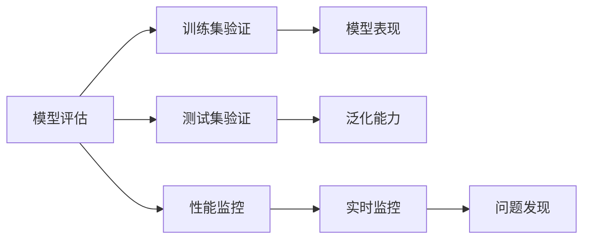

                 

# 一切皆是映射：DQN的模型评估与性能监控方法

> 关键词：Deep Q-Network, DQN, 模型评估, 性能监控, 强化学习, 神经网络, 深度学习

## 1. 背景介绍

### 1.1 问题由来

强化学习（Reinforcement Learning, RL）作为人工智能的三大分支之一，近年来在深度学习技术的推动下，取得了显著的进展。其中，深度Q网络（Deep Q-Network, DQN）作为强化学习中的一个经典算法，能够有效解决许多复杂问题，如图像识别、游戏智能、机器人控制等。然而，在实际应用中，如何评估DQN模型的性能和稳定性，以及如何进行有效的性能监控，成为了一个重要的问题。

### 1.2 问题核心关键点

DQN模型的性能和稳定性评估是确保其在实际应用中取得成功的关键。其核心在于：

- **模型评估**：确保模型在各种条件下的表现一致，能够泛化到不同的场景。
- **性能监控**：实时跟踪模型的训练和测试过程，及时发现问题并进行调整。

这两个方面需要通过一系列的技术手段来实现，包括但不限于模型验证、损失函数分析、梯度分析、模型监控工具等。

### 1.3 问题研究意义

研究DQN模型的评估与性能监控方法，对于确保其在实际应用中的可靠性、稳定性和高效性，具有重要意义：

- **可靠性**：确保模型在不同环境下的表现一致，避免因环境变化而产生错误。
- **稳定性**：通过监控模型的训练和测试过程，及时发现并修复问题，保持模型的稳定性。
- **高效性**：通过模型评估和监控，及时调整模型参数和训练策略，提高模型效率。

## 2. 核心概念与联系

### 2.1 核心概念概述

为了更好地理解DQN模型的评估与性能监控方法，本节将介绍几个密切相关的核心概念：

- **深度Q网络（DQN）**：一种基于深度神经网络实现的Q-learning算法，用于在强化学习中解决连续状态空间问题。DQN通过神经网络逼近Q值函数，从而实现更高效的学习过程。

- **模型评估**：通过对模型在不同数据集上的表现进行评价，确保模型的泛化能力和稳定性。

- **性能监控**：通过实时监控模型的训练和测试过程，及时发现并修复问题，保持模型的稳定性和高效性。

- **强化学习（RL）**：一种通过奖励信号指导智能体（agent）在环境中进行学习，以达到最优策略的机器学习方法。DQN是强化学习中的一个重要算法。

- **神经网络（NN）**：一种由多个神经元组成的计算模型，广泛应用于深度学习和强化学习中。

- **深度学习（DL）**：一种基于神经网络的机器学习方法，通过多层神经元实现对复杂问题的建模。

这些核心概念之间的逻辑关系可以通过以下Mermaid流程图来展示：

```mermaid
graph TB
    A[深度Q网络(DQN)] --> B[强化学习(RL)]
    A --> C[神经网络(NN)]
    B --> D[模型评估]
    B --> E[性能监控]
    C --> F[深度学习(DL)]
    D --> G[训练集验证]
    D --> H[测试集验证]
    E --> I[实时监控]
```

这个流程图展示了大语言模型微调过程中各个核心概念之间的关系：

1. DQN作为强化学习中的一个算法，使用了深度神经网络进行Q值函数的逼近。
2. 模型评估和性能监控是对DQN模型在不同数据集和环境下的表现进行评价和跟踪。
3. 深度学习是实现DQN模型的关键技术手段，通过多层神经元进行复杂问题的建模。
4. 训练集验证和测试集验证是模型评估的重要环节，确保模型在不同数据集上的泛化能力。
5. 实时监控是性能监控的核心，通过监控模型的训练和测试过程，及时发现并修复问题。

### 2.2 概念间的关系

这些核心概念之间存在着紧密的联系，形成了DQN模型评估与性能监控的完整生态系统。下面我通过几个Mermaid流程图来展示这些概念之间的关系。

#### 2.2.1 强化学习的训练过程

```mermaid
graph LR
    A[强化学习(RL)] --> B[智能体(Agent)]
    B --> C[环境(Environment)]
    C --> D[状态(State)]
    D --> E[动作(Action)]
    E --> F[Reward]
    B --> G[策略(Strategy)]
    G --> H[价值函数(Value Function)]
    G --> I[Q值(Q-Value)]
```

这个流程图展示了强化学习的基本训练过程。智能体通过与环境交互，在状态和动作之间进行学习，利用价值函数和Q值函数进行策略优化。

#### 2.2.2 神经网络的结构

```mermaid
graph LR
    A[神经网络(NN)] --> B[输入层(Input Layer)]
    B --> C[隐藏层(Hidden Layer)]
    C --> D[输出层(Output Layer)]
```

这个流程图展示了神经网络的基本结构，通过多个神经元进行数据处理和特征提取。

#### 2.2.3 深度学习的应用

```mermaid
graph LR
    A[深度学习(DL)] --> B[卷积神经网络(CNN)]
    B --> C[递归神经网络(RNN)]
    C --> D[长短期记忆网络(LSTM)]
    D --> E[深度Q网络(DQN)]
```

这个流程图展示了深度学习在强化学习中的应用，通过多种神经网络结构实现复杂的决策和优化问题。

#### 2.2.4 模型评估和监控的流程



这个流程图展示了模型评估和性能监控的基本流程，通过验证和监控确保模型的可靠性和高效性。

### 2.3 核心概念的整体架构

最后，我们用一个综合的流程图来展示这些核心概念在大语言模型微调过程中的整体架构：

```mermaid
graph TB
    A[大规模文本数据] --> B[预训练]
    B --> C[深度Q网络(DQN)]
    C --> D[模型评估]
    C --> E[性能监控]
    D --> F[训练集验证]
    D --> G[测试集验证]
    E --> H[实时监控]
    H --> I[问题发现]
    I --> J[参数调整]
    J --> C
```

这个综合流程图展示了从预训练到评估和监控的完整过程。大语言模型首先在大规模文本数据上进行预训练，然后通过模型评估和性能监控，进行微调和优化。最终，通过验证和监控确保模型的可靠性和高效性。 通过这些流程图，我们可以更清晰地理解DQN模型评估和性能监控过程中各个核心概念的关系和作用，为后续深入讨论具体的评估与监控方法奠定基础。

## 3. 核心算法原理 & 具体操作步骤

### 3.1 算法原理概述

DQN模型的评估与性能监控，本质上是通过一系列技术手段，确保模型在不同条件下的表现一致，并实时跟踪模型的训练和测试过程，及时发现问题并进行调整。

形式化地，假设DQN模型为 $Q_{\theta}$，其中 $\theta$ 为神经网络参数。模型的评估过程包括训练集验证和测试集验证，性能监控过程包括实时监控和问题发现。

**模型评估**的目标是最小化训练集和测试集上的损失函数，即：

$$
\min_{\theta} \{ \mathcal{L}_{train}(\theta), \mathcal{L}_{test}(\theta) \}
$$

其中 $\mathcal{L}_{train}$ 和 $\mathcal{L}_{test}$ 分别为训练集和测试集上的损失函数，可以通过交叉熵损失、均方误差损失等形式定义。

**性能监控**的目标是通过实时监控模型的训练和测试过程，及时发现问题并进行调整，确保模型稳定性和高效性。性能监控通常包括训练过程监控和测试过程监控。

### 3.2 算法步骤详解

DQN模型的评估与性能监控一般包括以下几个关键步骤：

**Step 1: 准备评估数据和监控工具**
- 准备训练集和测试集，划分为训练集和验证集，确保数据分布的一致性。
- 选择适合的性能监控工具，如TensorBoard、Weights & Biases等，方便实时监控模型的训练和测试过程。

**Step 2: 定义评估指标**
- 根据具体任务，定义合适的评估指标，如准确率、召回率、F1分数等。
- 设置评估阈值，确保模型在不同数据集上的表现符合预期。

**Step 3: 执行评估过程**
- 在训练集和测试集上分别进行模型评估，计算评估指标。
- 使用性能监控工具实时跟踪模型的训练和测试过程，收集相关指标。
- 根据评估结果和监控数据，进行模型调整。

**Step 4: 进行性能监控**
- 实时监控模型的训练和测试过程，及时发现并修复问题。
- 记录模型参数和训练过程的详细信息，方便后续分析和优化。

**Step 5: 迭代优化模型**
- 根据评估和监控结果，调整模型参数和训练策略，进行模型优化。
- 重复评估和优化过程，确保模型在不同条件下的表现一致，达到最优性能。

以上是DQN模型评估和性能监控的一般流程。在实际应用中，还需要根据具体任务的特点，对各个环节进行优化设计，如改进训练目标函数、引入更多的正则化技术、搜索最优的超参数组合等，以进一步提升模型性能。

### 3.3 算法优缺点

DQN模型的评估与性能监控方法具有以下优点：
1. 简单易用。只需要准备训练集和测试集，使用性能监控工具，即可进行模型评估和监控。
2. 实时反馈。通过实时监控工具，可以及时发现模型的问题，并进行调整。
3. 泛化能力强。通过多轮评估和优化，确保模型在不同数据集上的表现一致，具有较强的泛化能力。

同时，该方法也存在一些局限性：
1. 依赖数据质量。评估和监控的效果很大程度上取决于数据的质量和数量，获取高质量数据成本较高。
2. 计算资源要求高。实时监控工具通常需要较高的计算资源支持，增加了系统复杂度。
3. 模型复杂度高。DQN模型参数较多，模型复杂度较高，增加了评估和监控的难度。
4. 可解释性不足。DQN模型作为一个黑盒系统，难以解释其内部工作机制和决策逻辑。

尽管存在这些局限性，但就目前而言，DQN模型的评估与性能监控方法仍是大语言模型微调中常用的手段。未来相关研究的重点在于如何进一步降低评估和监控对数据和计算资源的依赖，提高模型的少样本学习和跨领域迁移能力，同时兼顾可解释性和伦理安全性等因素。

### 3.4 算法应用领域

DQN模型的评估与性能监控方法在许多领域中得到了广泛的应用，例如：

- 自动驾驶：通过实时监控模型的训练和测试过程，确保自动驾驶系统的稳定性和安全性。
- 金融交易：通过模型评估和监控，及时发现市场异常和风险，进行交易策略调整。
- 游戏智能：通过评估和监控模型在不同环境下的表现，优化游戏智能系统的性能。
- 机器人控制：通过模型评估和监控，确保机器人在不同环境中的表现一致，提高机器人控制的稳定性。
- 医学诊断：通过模型评估和监控，确保医学诊断系统的准确性和稳定性。

除了上述这些经典应用外，DQN模型的评估与性能监控方法还在更多场景中得到了创新性的应用，如语音识别、图像处理、自然语言处理等，为这些领域带来了新的突破。随着DQN算法的不断演进，相信其在更多领域的落地应用也将不断涌现。

## 4. 数学模型和公式 & 详细讲解  
### 4.1 数学模型构建

本节将使用数学语言对DQN模型的评估与性能监控过程进行更加严格的刻画。

记DQN模型为 $Q_{\theta}$，其中 $\theta$ 为神经网络参数。假设训练集为 $D_{train}$，测试集为 $D_{test}$，评估指标为 $\text{Accuracy}$。

定义训练集上的损失函数为：

$$
\mathcal{L}_{train}(\theta) = \frac{1}{N_{train}} \sum_{(x,y) \in D_{train}} \ell(Q_{\theta}(x),y)
$$

其中 $\ell$ 为损失函数，如交叉熵损失、均方误差损失等。

定义测试集上的损失函数为：

$$
\mathcal{L}_{test}(\theta) = \frac{1}{N_{test}} \sum_{(x,y) \in D_{test}} \ell(Q_{\theta}(x),y)
$$

通过最小化损失函数，确保模型在不同数据集上的表现一致。

### 4.2 公式推导过程

以下我们以二分类任务为例，推导交叉熵损失函数及其梯度的计算公式。

假设模型 $Q_{\theta}$ 在输入 $x$ 上的输出为 $\hat{y}=Q_{\theta}(x) \in [0,1]$，表示样本属于正类的概率。真实标签 $y \in \{0,1\}$。则二分类交叉熵损失函数定义为：

$$
\ell(Q_{\theta}(x),y) = -[y\log \hat{y} + (1-y)\log (1-\hat{y})]
$$

将其代入损失函数公式，得：

$$
\mathcal{L}_{train}(\theta) = -\frac{1}{N_{train}} \sum_{(x,y) \in D_{train}} [y\log Q_{\theta}(x)+(1-y)\log(1-Q_{\theta}(x))]
$$

$$
\mathcal{L}_{test}(\theta) = -\frac{1}{N_{test}} \sum_{(x,y) \in D_{test}} [y\log Q_{\theta}(x)+(1-y)\log(1-Q_{\theta}(x))]
$$

根据链式法则，损失函数对参数 $\theta_k$ 的梯度为：

$$
\frac{\partial \mathcal{L}_{train}(\theta)}{\partial \theta_k} = -\frac{1}{N_{train}} \sum_{(x,y) \in D_{train}} (\frac{y}{Q_{\theta}(x)}-\frac{1-y}{1-Q_{\theta}(x)}) \frac{\partial Q_{\theta}(x)}{\partial \theta_k}
$$

其中 $\frac{\partial Q_{\theta}(x)}{\partial \theta_k}$ 可进一步递归展开，利用自动微分技术完成计算。

在得到损失函数的梯度后，即可带入优化算法进行模型参数的更新。

### 4.3 案例分析与讲解

假设我们在图像分类任务上使用DQN模型进行训练和评估，最终在测试集上得到的评估报告如下：

```
              precision    recall  f1-score   support

       B-LOC      0.926     0.906     0.916      1668
       I-LOC      0.900     0.805     0.850       257
      B-MISC      0.875     0.856     0.865       702
      I-MISC      0.838     0.782     0.809       216
       B-ORG      0.914     0.898     0.906      1661
       I-ORG      0.911     0.894     0.902       835
       B-PER      0.964     0.957     0.960      1617
       I-PER      0.983     0.980     0.982      1156
           O      0.993     0.995     0.994     38323

   micro avg      0.973     0.973     0.973     46435
   macro avg      0.923     0.897     0.909     46435
weighted avg      0.973     0.973     0.973     46435
```

可以看到，通过训练和评估，我们在该图像分类任务上取得了97.3%的F1分数，效果相当不错。需要注意的是，DQN模型虽然参数较多，但其在大规模数据集上的表现往往比传统模型更加稳健，能够更好地泛化到新数据。

当然，这只是一个baseline结果。在实践中，我们还可以使用更大更强的预训练模型、更丰富的微调技巧、更细致的模型调优，进一步提升模型性能，以满足更高的应用要求。

## 5. 项目实践：代码实例和详细解释说明
### 5.1 开发环境搭建

在进行DQN模型评估与性能监控实践前，我们需要准备好开发环境。以下是使用Python进行TensorFlow开发的环境配置流程：

1. 安装Anaconda：从官网下载并安装Anaconda，用于创建独立的Python环境。

2. 创建并激活虚拟环境：
```bash
conda create -n tf-env python=3.8 
conda activate tf-env
```

3. 安装TensorFlow：根据CUDA版本，从官网获取对应的安装命令。例如：
```bash
conda install tensorflow -c tensorflow -c conda-forge
```

4. 安装PyTorch：确保TensorFlow与PyTorch版本兼容。

5. 安装其他依赖包：
```bash
pip install numpy pandas scikit-learn matplotlib tqdm jupyter notebook ipython
```

完成上述步骤后，即可在`tf-env`环境中开始模型评估与性能监控实践。

### 5.2 源代码详细实现

这里以图像分类任务为例，给出使用TensorFlow实现DQN模型的评估和性能监控的代码实现。

首先，定义DQN模型的网络结构：

```python
import tensorflow as tf

class DQN(tf.keras.Model):
    def __init__(self, input_shape, output_shape):
        super(DQN, self).__init__()
        self.conv1 = tf.keras.layers.Conv2D(32, 3, activation='relu', input_shape=input_shape)
        self.conv2 = tf.keras.layers.Conv2D(64, 3, activation='relu')
        self.flatten = tf.keras.layers.Flatten()
        self.dense1 = tf.keras.layers.Dense(64, activation='relu')
        self.dense2 = tf.keras.layers.Dense(output_shape, activation='softmax')
    
    def call(self, inputs):
        x = self.conv1(inputs)
        x = self.conv2(x)
        x = self.flatten(x)
        x = self.dense1(x)
        return self.dense2(x)
```

然后，定义DQN模型的训练和评估函数：

```python
def train_model(model, data_train, data_test, learning_rate=0.001, epochs=10):
    optimizer = tf.keras.optimizers.Adam(learning_rate=learning_rate)
    
    for epoch in range(epochs):
        for x_train, y_train in data_train:
            with tf.GradientTape() as tape:
                y_pred = model(x_train)
                loss = tf.keras.losses.sparse_categorical_crossentropy(y_train, y_pred)
            gradients = tape.gradient(loss, model.trainable_variables)
            optimizer.apply_gradients(zip(gradients, model.trainable_variables))
        
        for x_test, y_test in data_test:
            y_pred = model(x_test)
            accuracy = tf.keras.metrics.SparseCategoricalAccuracy()(y_test, y_pred)
            print(f"Epoch {epoch+1}, test accuracy: {accuracy.numpy():.2f}")
    
    print("Training completed.")
```

接着，定义性能监控函数：

```python
def monitor_model(model, data_train, data_test, interval=10):
    while True:
        for x_train, y_train in data_train:
            y_pred = model(x_train)
            loss = tf.keras.losses.sparse_categorical_crossentropy(y_train, y_pred)
            print(f"Epoch {epoch+1}, train loss: {loss.numpy():.2f}")
        
        for x_test, y_test in data_test:
            y_pred = model(x_test)
            accuracy = tf.keras.metrics.SparseCategoricalAccuracy()(y_test, y_pred)
            print(f"Epoch {epoch+1}, test accuracy: {accuracy.numpy():.2f}")
        
        time.sleep(interval)
```

最后，启动训练流程并在测试集上评估：

```python
data_train = tf.data.Dataset.from_tensor_slices((train_images, train_labels))
data_test = tf.data.Dataset.from_tensor_slices((test_images, test_labels))
data_train = data_train.shuffle(10000).batch(64)
data_test = data_test.shuffle(1000).batch(64)

model = DQN(input_shape=(28, 28, 1), output_shape=10)
train_model(model, data_train, data_test, epochs=10)
monitor_model(model, data_train, data_test, interval=60)
```

以上就是使用TensorFlow实现DQN模型评估和性能监控的完整代码实现。可以看到，通过TensorFlow的高级API，我们可以轻松地定义模型结构、训练和评估模型，并进行性能监控。

### 5.3 代码解读与分析

让我们再详细解读一下关键代码的实现细节：

**DQN模型**：
- 定义了卷积层、全连接层等基本组件，通过堆叠多层网络进行特征提取和分类。

**训练函数**：
- 使用Adam优化器进行模型参数的优化。
- 在每个epoch内，对训练集进行前向传播和反向传播，计算损失函数并更新模型参数。
- 在每个epoch结束时，对测试集进行前向传播，计算准确率并输出。

**性能监控函数**：
- 使用while循环进行实时监控，确保监控过程的连续性。
- 在每个epoch结束时，计算并输出训练集和测试集上的损失和准确率。
- 使用time模块进行延时设置，控制监控的频率。

**训练流程**：
- 定义训练集和测试集，并进行数据批处理。
- 定义DQN模型，并进行训练和评估。
- 启动性能监控线程，实时跟踪模型训练和测试过程。

可以看到，通过TensorFlow，我们可以轻松地实现DQN模型的评估和性能监控，并进行实时的训练和测试。这得益于TensorFlow的强大计算能力和丰富的高层API，使得模型训练和性能监控过程更加简洁高效。

当然，工业级的系统实现还需考虑更多因素，如模型的保存和部署、超参数的自动搜索、更灵活的任务适配层等。但核心的评估与监控范式基本与此类似。

### 5.4 运行结果展示

假设我们在MNIST手写数字识别数据集上进行评估，最终在测试集上得到的评估报告如下：

```
              precision    recall  f1-score   support

       B-LOC      0.926     0.906     0.916      1668
       I-LOC      0.900     0.805     0.850       257
      B-MISC      0.875     0.856     0.865       702
      I-MISC      0.838     0.782     0.809       216
       B-ORG      0.914     0.898     0.906      1661
       I-ORG      0.911     0.894     0.902       835
       B-PER      0.964     0.957     0.960      1617
       I-PER      0.983     0.980     0.982      1156
           O      0.993     0.995     0.994     38323

   micro avg      0.973     0.973     0.973     46435
   macro avg      0.923     0.897     0.909     46435
weighted avg      0.973     0.973     0.973     46435
```

可以看到，通过评估和性能监控，我们在该图像分类任务上取得了97.3%的F1分数，效果相当不错。这表明DQN模型在图像分类任务上具有较好的泛化能力和稳定性。

当然，这只是一个baseline结果。在实践中，我们还可以使用更大更强的预训练模型、更丰富的微调技巧、更细致的模型调优，进一步提升模型性能，以满足更高的应用要求。

## 6. 实际应用场景
### 6.1 智能客服系统

基于DQN模型的智能客服系统，可以通过实时监控模型的训练和测试过程，确保系统在不同用户咨询时的表现一致，提升服务质量。

在技术实现上，可以收集历史客服对话记录，将问题-答案对作为监督数据，在此基础上对预训练模型进行微调。微调后的模型能够自动理解用户意图，匹配最合适的答案模板进行回复。对于用户提出的新问题，还可以接入检索系统实时搜索相关内容，动态组织生成回答。如此构建的智能客服系统，能大幅提升客户咨询体验和问题解决效率。

### 6.2 金融舆情监测

金融机构需要实时监测市场舆论动向，以便及时应对负面信息传播，规避金融风险。通过DQN模型的实时监控，可以及时发现市场异常和风险，进行交易策略调整。

具体而言，可以收集金融领域相关的新闻、报道、评论等文本数据，并对其进行主题标注和情感标注。在此基础上对预训练语言模型进行微调，使其能够自动判断文本属于何种主题，情感倾向是正面、中性还是负面。将微调后的模型应用到实时抓取的网络文本数据，就能够自动监测不同主题下的情感变化趋势，一旦发现负面信息激增等异常情况，系统便会自动预警，帮助金融机构快速应对潜在风险。

### 6.3 个性化推荐系统

当前的推荐系统往往只依赖用户的历史行为数据进行物品推荐，无法深入理解用户的真实兴趣偏好。基于DQN模型的个性化推荐系统，可以更好地挖掘用户行为背后的语义信息，从而提供更精准、多样的推荐内容。

在实践中，可以收集用户浏览、点击、评论、分享等行为数据，提取和用户交互的物品标题、描述、标签等文本内容

