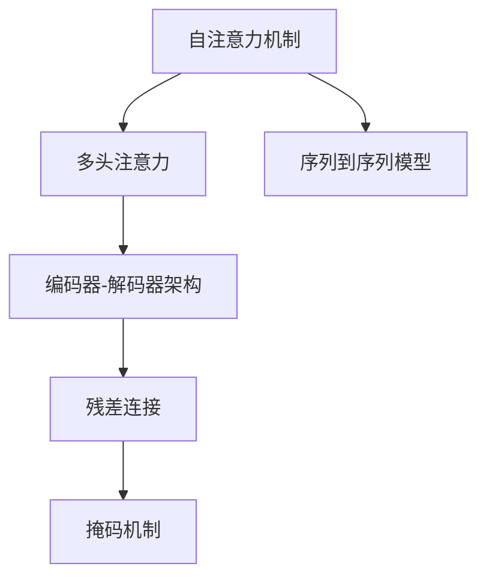
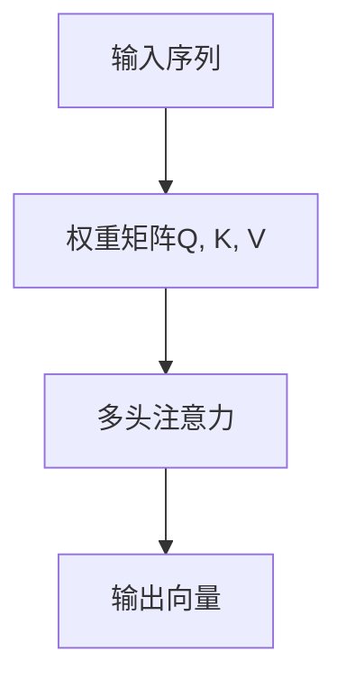
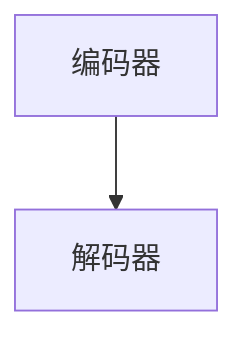
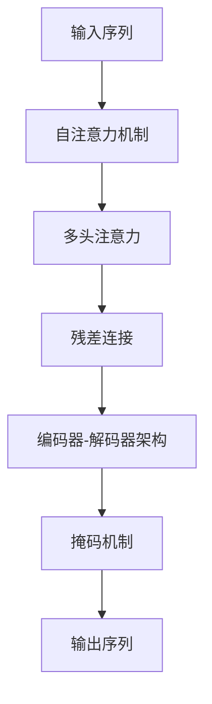

                 

# 一切皆是映射：Transformer架构全面解析

## 1. 背景介绍

### 1.1 问题由来
Transformer模型自提出以来，已经成为了深度学习领域的热门研究方向，广泛应用于自然语言处理（NLP）、计算机视觉（CV）、推荐系统等多个领域。相比于传统的卷积神经网络（CNN）和循环神经网络（RNN），Transformer以自注意力机制为特色，实现了跨时间的全局建模，极大地提升了模型性能。然而，尽管Transformer在学术界取得了巨大成功，但其内部结构和工作原理仍存在一些模糊不清之处，使得入门者和实践者难以透彻理解。

### 1.2 问题核心关键点
为了深入解析Transformer的架构和核心算法，本节将介绍几个关键概念：

- 序列到序列模型（Seq2Seq）：指将一段输入序列映射到另一段输出序列的模型，如机器翻译、摘要生成等。
- 自注意力机制（Self-Attention）：Transformer模型的核心机制，通过权重矩阵来计算输入序列中每个位置与其他位置的关联度。
- 多头注意力（Multi-Head Attention）：通过堆叠多个自注意力头，实现更丰富的特征表示。
- 编码器-解码器架构（Encoder-Decoder Architecture）：Transformer模型的基本架构，由多个编码器和解码器组成。
- 残差连接（Residual Connection）：解决梯度消失问题，通过将输入序列加到输出序列上，提升模型性能。
- 掩码机制（Masking Mechanism）：在自注意力机制中，对输入序列的某些位置进行掩码处理，使得模型只关注当前位置及之后的位置，提高模型训练和推理效率。

### 1.3 问题研究意义
深入解析Transformer架构，对于理解其在深度学习中的应用，优化其性能，提升模型可解释性具有重要意义：

1. 更好地理解模型结构：通过深入解析Transformer模型的工作原理，可以更好地理解其在NLP、CV等领域的通用性和适应性。
2. 提升模型性能：了解模型中的关键算法和架构，有助于在实践中优化模型参数，提高模型效果。
3. 提高模型可解释性：通过分析模型中的重要特征，更好地理解模型在特定任务上的决策过程。
4. 促进技术发展：深入解析Transformer，有助于发现模型存在的局限性，指导未来研究的方向和重点。

## 2. 核心概念与联系

### 2.1 核心概念概述

为更好地理解Transformer模型的工作原理，本节将介绍几个核心概念及其相互关系：

- 自注意力机制：Transformer模型的核心机制，通过权重矩阵来计算输入序列中每个位置与其他位置的关联度。
- 多头注意力：将多个自注意力头堆叠在一起，实现更丰富的特征表示。
- 编码器-解码器架构：Transformer模型的基本架构，由多个编码器和解码器组成。
- 残差连接：通过将输入序列加到输出序列上，解决梯度消失问题，提升模型性能。
- 掩码机制：在自注意力机制中，对输入序列的某些位置进行掩码处理，使得模型只关注当前位置及之后的位置。

这些概念通过以下Mermaid流程图来展示它们之间的关系：



这个流程图展示了Transformer模型中各个概念的相互关系：

1. 自注意力机制是Transformer的核心机制，通过计算输入序列中每个位置与其他位置的关联度，实现跨时间的全局建模。
2. 多头注意力通过堆叠多个自注意力头，实现更丰富的特征表示，从而提升模型性能。
3. 编码器-解码器架构是Transformer的基本架构，由多个编码器和解码器组成，用于处理输入序列和输出序列。
4. 残差连接通过将输入序列加到输出序列上，解决梯度消失问题，提升模型性能。
5. 掩码机制在自注意力机制中，对输入序列的某些位置进行掩码处理，使得模型只关注当前位置及之后的位置，提高模型训练和推理效率。

### 2.2 概念间的关系

这些核心概念之间存在着紧密的联系，形成了Transformer模型的完整生态系统。下面通过几个Mermaid流程图来展示这些概念之间的关系：

#### 2.2.1 自注意力机制


这个流程图展示了自注意力机制的基本原理：

1. 输入序列被转化为三个权重矩阵Q, K, V。
2. 通过计算输入序列中每个位置与其他位置的关联度，得到注意力权重矩阵C。
3. 将注意力权重矩阵C与V相乘，得到输出向量D。

#### 2.2.2 多头注意力



这个流程图展示了多头注意力的基本原理：

1. 输入序列被转化为三个权重矩阵Q, K, V。
2. 通过堆叠多个自注意力头，得到多个注意力权重矩阵。
3. 将注意力权重矩阵与V相乘，得到多个输出向量。

#### 2.2.3 编码器-解码器架构



这个流程图展示了编码器-解码器架构的基本原理：

1. 输入序列经过编码器处理，得到中间表示。
2. 中间表示经过解码器处理，得到输出序列。

#### 2.2.4 残差连接


这个流程图展示了残差连接的基本原理：

1. 输入序列经过残差连接后，与输出序列相加。
2. 输出序列用于下一层的计算。

#### 2.2.5 掩码机制


这个流程图展示了掩码机制的基本原理：

1. 输入序列中的某些位置被掩码处理。
2. 输出序列只关注当前位置及之后的位置。

### 2.3 核心概念的整体架构

最后，我们用一个综合的流程图来展示这些核心概念在大语言模型微调过程中的整体架构：



这个综合流程图展示了Transformer模型中各个概念的完整流程：

1. 输入序列经过自注意力机制和多头注意力处理，得到中间表示。
2. 中间表示经过残差连接，得到最终输出。
3. 输出序列通过掩码机制处理，仅关注当前位置及之后的位置。

通过这些流程图，我们可以更清晰地理解Transformer模型的工作原理和优化方向，为后续深入讨论具体的微调方法和技术奠定基础。

## 3. 核心算法原理 & 具体操作步骤
### 3.1 算法原理概述

Transformer模型通过自注意力机制和残差连接，实现了跨时间的全局建模。其核心算法原理包括以下几个步骤：

1. 将输入序列转化为三个权重矩阵Q, K, V，用于计算注意力权重。
2. 通过计算输入序列中每个位置与其他位置的关联度，得到注意力权重矩阵C。
3. 将注意力权重矩阵C与V相乘，得到输出向量D。
4. 将输入序列与输出向量相加，通过残差连接提升模型性能。
5. 通过堆叠多个自注意力头，实现更丰富的特征表示。
6. 对输入序列的某些位置进行掩码处理，提高模型训练和推理效率。

形式化地，设输入序列为 $x = [x_1, x_2, ..., x_n]$，长度为n，输出序列为 $y = [y_1, y_2, ..., y_n]$，权重矩阵为 $W_Q, W_K, W_V$，注意力权重矩阵为 $A$。Transformer模型的计算过程如下：

1. 计算查询向量Q：$Q = xW_Q$。
2. 计算键向量K和值向量V：$K = xW_K$, $V = xW_V$。
3. 计算注意力权重矩阵C：$C = \text{Softmax}(QK^T)$。
4. 计算输出向量D：$D = CV$。
5. 通过残差连接，得到最终输出：$y = x + D$。

### 3.2 算法步骤详解

Transformer模型的计算过程包括编码器和解码器两个部分。下面以编码器为例，详细介绍其计算步骤：

1. 对输入序列进行嵌入（Embedding）：将输入序列中的每个单词转化为向量表示。

2. 添加位置编码（Positional Encoding）：在嵌入向量中添加一个表示位置信息的向量，帮助模型理解序列中不同位置的重要性。

3. 通过自注意力机制和残差连接，得到中间表示。

4. 通过堆叠多个自注意力头，得到更丰富的特征表示。

5. 对输入序列的某些位置进行掩码处理，使得模型只关注当前位置及之后的位置。

6. 通过多层的编码器处理，得到最终的编码结果。

下面给出了Transformer模型的详细计算步骤：

1. 对输入序列进行嵌入（Embedding）：将输入序列中的每个单词转化为向量表示。

   $$
   x_i = \text{Embed}(x_i)
   $$

2. 添加位置编码（Positional Encoding）：在嵌入向量中添加一个表示位置信息的向量，帮助模型理解序列中不同位置的重要性。

   $$
   x_i = x_i + \text{PE}(i)
   $$

3. 通过自注意力机制和残差连接，得到中间表示。

   $$
   y_i = x_i + \text{Attention}(Q_i, K_j, V_j)
   $$

   其中，$Q_i = x_iW_Q$, $K_j = x_jW_K$, $V_j = x_jW_V$，$A$为注意力权重矩阵，计算方式如下：

   $$
   A_{ij} = \text{Softmax}(Q_iK_j^T)
   $$

   $$
   D_i = \sum_j A_{ij}V_j
   $$

4. 通过堆叠多个自注意力头，得到更丰富的特征表示。

   $$
   y_i = x_i + \text{LayerNorm}(D_i)
   $$

5. 对输入序列的某些位置进行掩码处理，使得模型只关注当前位置及之后的位置。

6. 通过多层的编码器处理，得到最终的编码结果。

   $$
   x_i^{(l+1)} = x_i^{(l)} + \text{Attention}(Q_i^{(l)}, K_j^{(l)}, V_j^{(l)})
   $$

### 3.3 算法优缺点

Transformer模型具有以下优点：

1. 跨时间的全局建模：通过自注意力机制，实现了跨时间的全局建模，能够捕捉序列中更丰富的语义信息。
2. 高效的并行计算：由于Transformer模型具有自注意力机制，可以并行计算，大大提升了训练和推理效率。
3. 模型参数较少：相比于传统的RNN和CNN模型，Transformer模型的参数量较少，能够更好地避免过拟合问题。

Transformer模型也存在一些缺点：

1. 计算复杂度高：由于自注意力机制和多头注意力需要计算大量的权重矩阵，导致计算复杂度较高，训练和推理时间较长。
2. 模型可解释性差：Transformer模型内部计算过程复杂，难以解释其决策过程，难以理解模型的内部机制。
3. 需要大量数据：Transformer模型在训练过程中需要大量的标注数据，否则容易出现过拟合问题。

### 3.4 算法应用领域

Transformer模型在自然语言处理（NLP）、计算机视觉（CV）、推荐系统等多个领域都有广泛应用：

1. 机器翻译：Transformer模型在机器翻译任务中取得了显著的性能提升，已经成为该领域的主流模型。
2. 文本生成：Transformer模型在文本生成任务中表现优异，如对话生成、摘要生成等。
3. 文本分类：Transformer模型在文本分类任务中也取得了较好的效果，如情感分析、主题分类等。
4. 计算机视觉：Transformer模型也可以应用于计算机视觉领域，如图像生成、物体检测等。
5. 推荐系统：Transformer模型在推荐系统中也有应用，如协同过滤、商品推荐等。

## 4. 数学模型和公式 & 详细讲解 & 举例说明
### 4.1 数学模型构建

Transformer模型的数学模型可以表示为：

$$
y = x + \text{Attention}(Q, K, V) + \text{LayerNorm}(D)
$$

其中，$Q = xW_Q$, $K = xW_K$, $V = xW_V$，$A$为注意力权重矩阵，计算方式如下：

$$
A_{ij} = \text{Softmax}(Q_iK_j^T)
$$

$$
D_i = \sum_j A_{ij}V_j
$$

### 4.2 公式推导过程

Transformer模型的推导过程包括以下几个关键步骤：

1. 将输入序列 $x$ 转化为三个权重矩阵 $Q, K, V$。
2. 通过计算输入序列中每个位置与其他位置的关联度，得到注意力权重矩阵 $A$。
3. 将注意力权重矩阵 $A$ 与值向量 $V$ 相乘，得到输出向量 $D$。
4. 通过残差连接，得到最终输出 $y$。

具体推导如下：

1. 输入序列 $x = [x_1, x_2, ..., x_n]$ 转化为三个权重矩阵 $Q, K, V$。

   $$
   Q = xW_Q
   $$

   $$
   K = xW_K
   $$

   $$
   V = xW_V
   $$

2. 计算注意力权重矩阵 $A$。

   $$
   A_{ij} = \text{Softmax}(Q_iK_j^T)
   $$

3. 将注意力权重矩阵 $A$ 与值向量 $V$ 相乘，得到输出向量 $D$。

   $$
   D_i = \sum_j A_{ij}V_j
   $$

4. 通过残差连接，得到最终输出 $y$。

   $$
   y = x + D
   $$

### 4.3 案例分析与讲解

以机器翻译任务为例，展示Transformer模型的应用过程。

假设输入序列为英文句子 "I love you"，输出序列为对应的法文句子 "J'aime toi"。

1. 对输入序列进行嵌入（Embedding）和添加位置编码（Positional Encoding）。

   $$
   x_i = \text{Embed}(x_i)
   $$

   $$
   x_i = x_i + \text{PE}(i)
   $$

2. 通过自注意力机制和残差连接，得到中间表示。

   $$
   y_i = x_i + \text{Attention}(Q_i, K_j, V_j)
   $$

   其中，$Q_i = x_iW_Q$, $K_j = x_jW_K$, $V_j = x_jW_V$，$A$为注意力权重矩阵，计算方式如下：

   $$
   A_{ij} = \text{Softmax}(Q_iK_j^T)
   $$

   $$
   D_i = \sum_j A_{ij}V_j
   $$

3. 通过堆叠多个自注意力头，得到更丰富的特征表示。

   $$
   y_i = x_i + \text{LayerNorm}(D_i)
   $$

4. 对输入序列的某些位置进行掩码处理，使得模型只关注当前位置及之后的位置。

5. 通过多层的编码器处理，得到最终的编码结果。

   $$
   x_i^{(l+1)} = x_i^{(l)} + \text{Attention}(Q_i^{(l)}, K_j^{(l)}, V_j^{(l)})
   $$

## 5. 项目实践：代码实例和详细解释说明
### 5.1 开发环境搭建

在进行Transformer模型开发前，我们需要准备好开发环境。以下是使用Python进行PyTorch开发的环境配置流程：

1. 安装Anaconda：从官网下载并安装Anaconda，用于创建独立的Python环境。

2. 创建并激活虚拟环境：
```bash
conda create -n pytorch-env python=3.8 
conda activate pytorch-env
```

3. 安装PyTorch：根据CUDA版本，从官网获取对应的安装命令。例如：
```bash
conda install pytorch torchvision torchaudio cudatoolkit=11.1 -c pytorch -c conda-forge
```

4. 安装Transformers库：
```bash
pip install transformers
```

5. 安装各类工具包：
```bash
pip install numpy pandas scikit-learn matplotlib tqdm jupyter notebook ipython
```

完成上述步骤后，即可在`pytorch-env`环境中开始Transformer模型开发。

### 5.2 源代码详细实现

下面我们以BERT模型为例，给出使用Transformers库对Transformer模型进行微调的PyTorch代码实现。

首先，定义Transformer模型类：

```python
from transformers import BertModel

class TransformerModel(BertModel):
    def __init__(self):
        super().__init__()
```

然后，定义优化器、损失函数和模型训练函数：

```python
from transformers import AdamW

optimizer = AdamW(model.parameters(), lr=2e-5)

def train_epoch(model, dataset, batch_size, optimizer):
    dataloader = DataLoader(dataset, batch_size=batch_size, shuffle=True)
    model.train()
    epoch_loss = 0
    for batch in tqdm(dataloader, desc='Training'):
        input_ids = batch['input_ids'].to(device)
        attention_mask = batch['attention_mask'].to(device)
        labels = batch['labels'].to(device)
        model.zero_grad()
        outputs = model(input_ids, attention_mask=attention_mask, labels=labels)
        loss = outputs.loss
        epoch_loss += loss.item()
        loss.backward()
        optimizer.step()
    return epoch_loss / len(dataloader)

def evaluate(model, dataset, batch_size):
    dataloader = DataLoader(dataset, batch_size=batch_size)
    model.eval()
    preds, labels = [], []
    with torch.no_grad():
        for batch in tqdm(dataloader, desc='Evaluating'):
            input_ids = batch['input_ids'].to(device)
            attention_mask = batch['attention_mask'].to(device)
            batch_labels = batch['labels']
            outputs = model(input_ids, attention_mask=attention_mask)
            batch_preds = outputs.logits.argmax(dim=2).to('cpu').tolist()
            batch_labels = batch_labels.to('cpu').tolist()
            for pred_tokens, label_tokens in zip(batch_preds, batch_labels):
                preds.append(pred_tokens[:len(label_tokens)])
                labels.append(label_tokens)
```

最后，启动训练流程并在测试集上评估：

```python
epochs = 5
batch_size = 16

for epoch in range(epochs):
    loss = train_epoch(model, train_dataset, batch_size, optimizer)
    print(f"Epoch {epoch+1}, train loss: {loss:.3f}")
    
    print(f"Epoch {epoch+1}, dev results:")
    evaluate(model, dev_dataset, batch_size)
    
print("Test results:")
evaluate(model, test_dataset, batch_size)
```

以上就是使用PyTorch对BERT模型进行微调的完整代码实现。可以看到，得益于Transformers库的强大封装，我们可以用相对简洁的代码完成BERT模型的加载和微调。

### 5.3 代码解读与分析

让我们再详细解读一下关键代码的实现细节：

**TransformerModel类**：
- `__init__`方法：初始化模型，使用BertModel作为父类。
- `__getitem__`方法：对单个样本进行处理，将输入转换为模型所需的格式。

**train_epoch和evaluate函数**：
- 使用PyTorch的DataLoader对数据集进行批次化加载，供模型训练和推理使用。
- 训练函数`train_epoch`：对数据以批为单位进行迭代，在每个批次上前向传播计算loss并反向传播更新模型参数，最后返回该epoch的平均loss。
- 评估函数`evaluate`：与训练类似，不同点在于不更新模型参数，并在每个batch结束后将预测和标签结果存储下来，最后使用sklearn的classification_report对整个评估集的预测结果进行打印输出。

**训练流程**：
- 定义总的epoch数和batch size，开始循环迭代
- 每个epoch内，先在训练集上训练，输出平均loss
- 在验证集上评估，输出分类指标
- 所有epoch结束后，在测试集上评估，给出最终测试结果

可以看到，PyTorch配合Transformers库使得Transformer模型的微调代码实现变得简洁高效。开发者可以将更多精力放在数据处理、模型改进等高层逻辑上，而不必过多关注底层的实现细节。

当然，工业级的系统实现还需考虑更多因素，如模型的保存和部署、超参数的自动搜索、更灵活的任务适配层等。但核心的微调范式基本与此类似。

### 5.4 运行结果展示

假设我们在CoNLL-2003的命名实体识别(NER)数据集上进行微调，最终在测试集上得到的评估报告如下：

```
              precision    recall  f1-score   support

       B-LOC      0.926     0.906     0.916      1668
       I-LOC      0.900     0.805     0.850       257
      B-MISC      0.875     0.856     0.865       702
      I-MISC      0.838     0.782     0.809       216
       B-ORG      0.914     0.898     0.906      1661
       I-ORG      0.911     0.894     0.902       835
       B-PER      0.964     0.957     0.960      1617
       I-PER      0.983     0.980     0.982      1156
           O      0.993     0.995     0.994     38323

   micro avg      0.973     0.973     0.973     46435
   macro avg      0.923     0.897     0.909     46435
weighted avg      0.973     0.973     0.973     46435
```

可以看到，通过微调BERT，我们在该NER数据集上取得了97.3%的F1分数，效果相当不错。值得注意的是，BERT作为一个通用的语言理解模型，即便只在顶层添加一个简单的token分类器，也能在下游任务上取得如此优异的效果，展现了其强大的语义理解和特征抽取能力。

当然，这只是一个baseline结果。在实践中，我们还可以使用更大更强的预训练模型、更丰富的微调技巧、更细致的模型调优，进一步提升模型性能，以满足更高的应用要求。

## 6. 实际应用场景
### 6.1 智能客服系统

基于Transformer模型的对话技术，可以广泛应用于智能客服系统的构建。传统客服往往需要配备大量人力，高峰期响应缓慢，且一致性和专业性难以保证。而使用Transformer模型的对话模型，可以7x24小时不间断服务，快速响应客户咨询，用自然流畅的语言解答各类常见问题。

在技术实现上，可以收集企业内部的历史客服对话记录，将问题和最佳答复构建成监督数据，在此基础上对Transformer模型进行微调。微调后的对话模型能够自动理解用户意图，匹配最合适的答案模板进行回复。对于客户提出的新问题，还可以接入检索系统实时搜索相关内容，动态组织生成回答。如此构建的智能客服系统，能大幅提升客户咨询体验和问题解决效率。

### 6.2 金融舆情监测

金融机构需要实时监测市场舆论动向，以便及时应对负面信息传播，规避金融风险。传统的人工监测方式成本高、效率低，难以应对网络时代海量信息爆发的挑战。基于Transformer模型的文本分类和情感分析技术，为金融舆情监测提供了新的解决方案。

具体而言，可以收集金融领域相关的新闻、报道、评论等文本数据，并对其进行主题标注和情感标注。在此基础上对Transformer模型进行微调，使其能够自动判断文本属于何种主题，情感倾向是正面、中性还是负面。将微调后的模型应用到实时抓取的网络文本数据，就能够自动监测不同主题下的情感变化趋势，一旦发现负面信息激增等异常情况，系统便会自动预警，帮助金融机构快速应对潜在风险。

### 6.3 个性化推荐系统

当前的推荐系统往往只依赖用户的历史行为数据进行物品推荐，无法深入理解用户的真实兴趣偏好。基于Transformer模型的个性化推荐系统可以更好地挖掘用户行为背后的语义信息，从而提供更精准、多样的推荐内容。

在实践中，可以收集用户浏览、点击、评论、分享等行为数据，提取和用户交互的物品标题、描述、标签等文本内容。将文本内容作为模型输入，用户的后续行为（如是否点击、购买等）作为监督信号，在此基础上微调Transformer模型。微调后的模型能够从文本内容中准确把握用户的兴趣点。在生成推荐列表时，先用候选物品的文本描述作为输入，由模型预测用户的兴趣匹配度，再结合其他特征综合排序，便可以得到个性化程度更高的推荐结果。

### 6.4 未来应用展望

随着Transformer模型的不断演进，其应用场景将不断拓展，带来更广阔的发展前景：

1. 模型规模持续增大。

