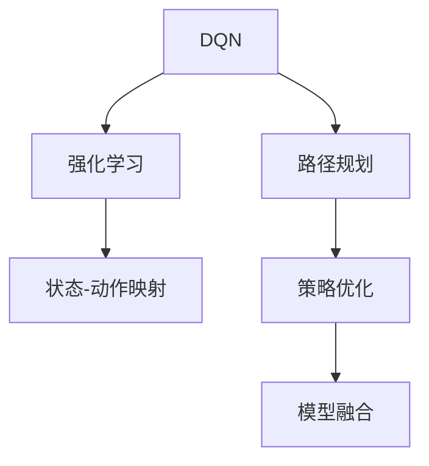
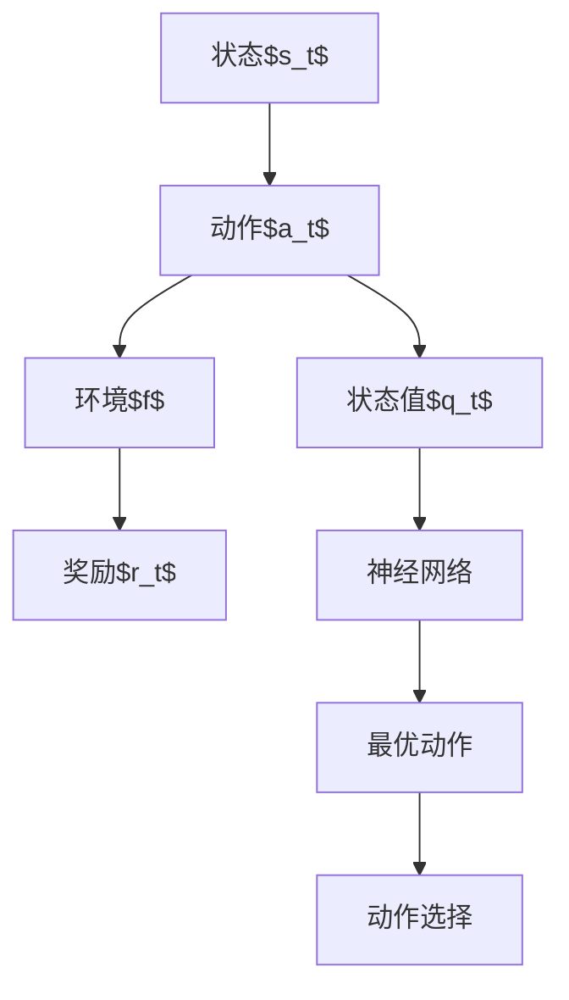
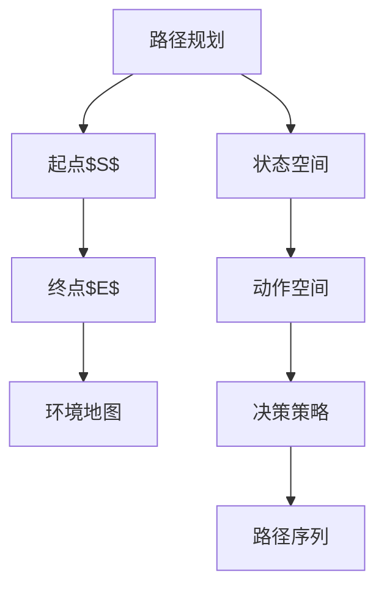
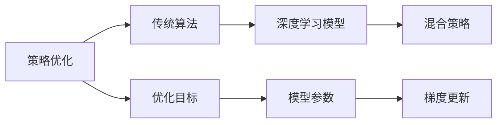
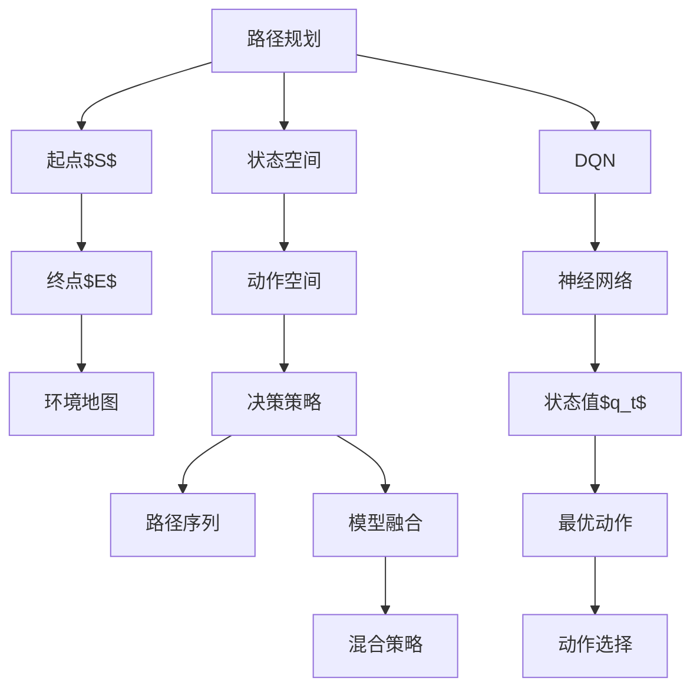

                 

# 一切皆是映射：利用DQN解决路径规划问题：方法与思考

## 1. 背景介绍

### 1.1 问题由来
随着人工智能技术的不断进步，路径规划问题在自动驾驶、机器人导航、物流规划等领域的应用变得越来越重要。传统的路径规划方法依赖于精确的地图数据和复杂的算法模型，但在实际应用中往往面临着环境复杂、数据不足等问题，导致规划结果不够理想。

近年来，深度强化学习（Deep Reinforcement Learning, DRL）方法因其强大的适应能力和泛化能力，逐渐成为路径规划问题的热门解决方案。其中，基于DQN（Deep Q-Network）的路径规划方法因其简单高效、易于实现，受到了广泛关注。

### 1.2 问题核心关键点
DQN是一种基于深度神经网络的强化学习算法，旨在通过环境交互学习最优的策略，从而在多步决策序列中最大化累积奖励。对于路径规划问题，DQN可以通过对当前状态的评估，预测出最优的下一步动作，从而逐步规划出一条最优路径。

DQN的核心思想是通过深度神经网络逼近Q值函数，在每个时间步选择最优的动作，最大化长期累积奖励。其核心流程包括：

- 观察环境状态，选择最优动作，接收环境反馈。
- 更新神经网络参数，继续观察和选择动作，直到任务完成。

通过不断的试错和优化，DQN能够找到路径规划问题的最优解。

### 1.3 问题研究意义
DQN在路径规划中的应用，对于提升自动驾驶、机器人导航、物流规划等领域的智能化水平，具有重要意义：

1. 提高路径规划效率。DQN可以快速学习复杂环境中的最优路径规划策略，显著提高路径规划效率。
2. 增强决策鲁棒性。DQN能够在动态变化的环境中进行路径规划，增强决策的鲁棒性。
3. 实现自适应规划。DQN可以根据实时环境信息自适应调整路径规划策略，适应不同场景的需求。
4. 降低成本投入。DQN可以应用于多车共享、无人机配送等低成本场景，降低路径规划的成本投入。

本文将详细介绍DQN在路径规划中的应用，包括算法原理、实现步骤、优缺点、应用领域、数学模型、代码实现等方面，为读者提供全面的指导。

## 2. 核心概念与联系

### 2.1 核心概念概述

为更好地理解DQN在路径规划中的应用，本节将介绍几个密切相关的核心概念：

- DQN（Deep Q-Network）：一种基于深度神经网络的强化学习算法，通过逼近Q值函数，实现最优动作选择。
- 强化学习（Reinforcement Learning, RL）：一种通过与环境交互，最大化累积奖励的学习方法，目标是找到最优的决策策略。
- 路径规划（Path Planning）：在给定起点和终点的情况下，寻找一条路径，使得从起点到终点的成本最小。
- 状态-动作映射（State-Action Mapping）：将环境状态映射到动作空间的过程，是路径规划问题的核心。
- 策略优化（Strategy Optimization）：通过优化策略，最大化路径规划任务的长期累积奖励。
- 模型融合（Model Fusion）：将深度学习模型与传统路径规划算法进行结合，增强模型泛化能力。

这些核心概念之间的逻辑关系可以通过以下Mermaid流程图来展示：



这个流程图展示了大语言模型微调过程中各个核心概念的关系：

1. DQN作为强化学习的一种实现方法，通过状态-动作映射实现路径规划。
2. 强化学习通过最大化累积奖励，优化路径规划策略。
3. 路径规划依赖于状态-动作映射和策略优化。
4. 模型融合将深度学习模型与传统路径规划算法结合，提升路径规划效果。

### 2.2 概念间的关系

这些核心概念之间存在着紧密的联系，形成了路径规划问题的完整生态系统。下面我通过几个Mermaid流程图来展示这些概念之间的关系。

#### 2.2.1 DQN算法原理



这个流程图展示了DQN算法的基本原理：

1. 观察当前状态$s_t$，选择动作$a_t$，接收环境反馈。
2. 通过神经网络计算状态值$q_t$，得到最优动作$g_t$。
3. 选择动作$a_t$，观察下一个状态$s_{t+1}$，并返回奖励$r_t$。
4. 通过神经网络更新状态值$q_t$，继续观察和选择动作，直到任务完成。

#### 2.2.2 路径规划与状态-动作映射



这个流程图展示了路径规划与状态-动作映射的关系：

1. 路径规划从起点$S$到终点$E$，考虑环境地图。
2. 状态空间$E$描述了当前位置和状态信息。
3. 动作空间$F$描述了可选的动作。
4. 决策策略$G$通过状态-动作映射，选择最优动作。
5. 路径序列$H$描述了一系列的动作序列，构成了路径规划结果。

#### 2.2.3 策略优化与模型融合



这个流程图展示了策略优化与模型融合的关系：

1. 策略优化通过优化目标$E$，改进路径规划策略。
2. 传统算法$B$提供了基础的路径规划方法。
3. 深度学习模型$C$提升了路径规划的泛化能力。
4. 混合策略$D$结合传统算法和深度学习模型，实现更优的路径规划效果。

### 2.3 核心概念的整体架构

最后，我们用一个综合的流程图来展示这些核心概念在路径规划中的应用：



这个综合流程图展示了从路径规划到DQN的完整过程：

1. 路径规划从起点$S$到终点$E$，考虑环境地图。
2. 状态空间$E$描述了当前位置和状态信息。
3. 动作空间$F$描述了可选的动作。
4. 决策策略$G$通过状态-动作映射，选择最优动作。
5. 路径序列$H$描述了一系列的动作序列，构成了路径规划结果。
6. DQN通过神经网络计算状态值$q_t$，得到最优动作$g_t$。
7. 混合策略$N$结合传统算法和深度学习模型，实现更优的路径规划效果。

通过这些流程图，我们可以更清晰地理解路径规划问题的核心概念及其关系，为后续深入讨论具体的DQN方法和技术奠定基础。

## 3. 核心算法原理 & 具体操作步骤
### 3.1 算法原理概述

DQN在路径规划中的应用，主要依赖于状态-动作映射和策略优化两个核心步骤。具体来说，DQN通过神经网络逼近Q值函数，在每个时间步选择最优的动作，从而逐步规划出一条最优路径。

形式化地，假设路径规划任务的状态空间为$\mathcal{S}$，动作空间为$\mathcal{A}$，状态和动作之间的映射为$s \rightarrow a$，策略为$\pi(s)$，则DQN的优化目标可以表示为：

$$
\max_{\pi} \mathbb{E}_{s_t \sim \pi, a_t \sim \pi} \sum_{t=0}^{\infty} \gamma^t r_t
$$

其中，$\gamma$为折扣因子，$r_t$为时间步$t$的奖励。

DQN的具体流程包括：

1. 初始化神经网络，选择一个随机动作$a_t$，观察环境状态$s_t$和奖励$r_t$。
2. 使用神经网络计算状态值$q_t(s_t, a_t)$，选择最优动作$a_t'$。
3. 观察下一个状态$s_{t+1}$和奖励$r_{t+1}$，将$(s_t, a_t, r_t, s_{t+1})$作为样本存储。
4. 使用神经网络更新状态值$q_t(s_t, a_t')$，继续观察和选择动作，直到任务完成。

通过不断的试错和优化，DQN能够找到路径规划问题的最优解。

### 3.2 算法步骤详解

DQN在路径规划中的应用，主要包括状态-动作映射、策略优化和模型融合三个核心步骤。下面详细介绍每个步骤的实现细节。

#### 3.2.1 状态-动作映射

状态-动作映射是将环境状态$s_t$映射到动作空间$\mathcal{A}$的过程。具体实现可以采用以下两种方法：

1. 基于像素的映射方法：将环境地图转换为像素，然后将像素作为神经网络的输入。
2. 基于动作的映射方法：将动作序列作为神经网络的输入，通过神经网络预测出每个动作的Q值。

以基于像素的映射方法为例，具体步骤如下：

1. 将环境地图分割成若干个像素区域，将每个像素区域映射为一个向量。
2. 将向量作为神经网络的输入，得到状态值$q_t$。
3. 通过神经网络计算最优动作$a_t'$。
4. 将最优动作作为输出，选择下一个动作。

#### 3.2.2 策略优化

策略优化是通过神经网络逼近Q值函数，实现最优动作选择的过程。具体实现步骤如下：

1. 初始化神经网络，选择随机动作$a_t$。
2. 观察环境状态$s_t$和奖励$r_t$，通过神经网络计算状态值$q_t$。
3. 选择最优动作$a_t'$，观察下一个状态$s_{t+1}$和奖励$r_{t+1}$。
4. 将$(s_t, a_t, r_t, s_{t+1})$作为样本存储。
5. 使用神经网络更新状态值$q_t(s_t, a_t')$，继续观察和选择动作，直到任务完成。

#### 3.2.3 模型融合

模型融合是将深度学习模型与传统路径规划算法结合的过程。具体实现步骤如下：

1. 将传统路径规划算法作为基础算法，生成路径序列。
2. 使用深度学习模型对路径序列进行优化，得到混合策略。
3. 结合混合策略和基础算法，生成最终的路径规划结果。

### 3.3 算法优缺点

DQN在路径规划中的应用，具有以下优点：

1. 灵活性强：DQN能够自适应环境变化，适应不同场景的需求。
2. 泛化能力强：DQN通过深度学习模型逼近Q值函数，能够处理复杂多变的路径规划问题。
3. 效率高：DQN通过在线学习，能够快速适应新环境，提高路径规划效率。
4. 可扩展性强：DQN可以应用于多车共享、无人机配送等场景，具有很好的可扩展性。

同时，DQN也存在以下缺点：

1. 训练过程复杂：DQN需要大量的训练数据和计算资源，训练过程较为复杂。
2. 易受噪声干扰：DQN在环境噪声较大的情况下，容易出现不稳定的情况。
3. 模型复杂度高：DQN需要设计复杂的神经网络结构，增加了模型复杂度。
4. 样本空间大：DQN需要存储大量的状态-动作样本，增加了存储成本。

尽管存在这些局限性，但DQN在路径规划中的应用，仍然具有很大的优势和潜力。

### 3.4 算法应用领域

DQN在路径规划中的应用，已经被广泛应用于以下领域：

1. 自动驾驶：DQN可以应用于自动驾驶中的路径规划，提高车辆的导航精度和安全性。
2. 机器人导航：DQN可以应用于机器人的路径规划，使其能够自主导航。
3. 物流配送：DQN可以应用于物流配送中的路径规划，提高配送效率和资源利用率。
4. 工业自动化：DQN可以应用于工业自动化中的路径规划，提高生产效率和生产安全。
5. 无人机飞行：DQN可以应用于无人机的路径规划，提高飞行安全和飞行效率。

除了上述这些应用领域外，DQN还被创新性地应用于更多场景中，如智能交通系统、智能城市管理等，为路径规划问题带来了新的解决方案。

## 4. 数学模型和公式 & 详细讲解 & 举例说明

### 4.1 数学模型构建

在本节中，我们将详细讲解DQN在路径规划中的数学模型构建。

假设路径规划任务的状态空间为$\mathcal{S}$，动作空间为$\mathcal{A}$，状态和动作之间的映射为$s \rightarrow a$，策略为$\pi(s)$。假设在每个时间步$t$，选择动作$a_t$，观察环境状态$s_t$和奖励$r_t$。定义状态值函数$Q(s,a)$为状态$s$和动作$a$的Q值，则DQN的优化目标可以表示为：

$$
\max_{\pi} \mathbb{E}_{s_t \sim \pi, a_t \sim \pi} \sum_{t=0}^{\infty} \gamma^t r_t
$$

其中，$\gamma$为折扣因子，$r_t$为时间步$t$的奖励。

状态值函数$Q(s,a)$可以通过深度神经网络逼近，即：

$$
Q(s,a) \approx \omega(s,a)
$$

其中，$\omega$为神经网络，$\omega(s,a)$为神经网络在状态$s$和动作$a$的输出值。

定义神经网络$\omega$的参数为$\theta$，则状态值函数可以表示为：

$$
Q(s,a) = \omega_{\theta}(s,a) = \omega(s,a; \theta)
$$

定义神经网络的输入为$s$，输出为$Q(s,a)$，则神经网络的结构可以表示为：

$$
Q(s,a; \theta) = \omega(s,a; \theta) = W_1h_1(s) + W_2h_2(s) + \cdots + W_nh_n(s)
$$

其中，$W_i$为权重，$h_i(s)$为第$i$层的隐藏层输出。

### 4.2 公式推导过程

为了更好地理解DQN在路径规划中的应用，我们将详细讲解其公式推导过程。

首先，我们将DQN的优化目标进行简化，假设只考虑两个时间步的奖励和状态值：

$$
\max_{\pi} \mathbb{E}_{s_t \sim \pi, a_t \sim \pi} [r_t + \gamma Q(s_{t+1},a_{t+1}; \theta)]
$$

在每个时间步$t$，选择动作$a_t$，观察环境状态$s_t$和奖励$r_t$，神经网络计算状态值$Q(s_t,a_t; \theta)$，选择最优动作$a_t'$，观察下一个状态$s_{t+1}$和奖励$r_{t+1}$。神经网络更新状态值$Q(s_t,a_t'; \theta)$，继续观察和选择动作，直到任务完成。

通过上述过程，神经网络逐渐逼近最优的状态值函数$Q(s,a)$，从而实现路径规划任务的优化。

### 4.3 案例分析与讲解

以下是一个简单的DQN在路径规划中的应用案例。假设有一个无人驾驶车辆需要在十字路口选择最佳路径，具体步骤如下：

1. 定义状态空间$\mathcal{S}$为车辆当前位置和行驶方向。
2. 定义动作空间$\mathcal{A}$为左转、右转和直行。
3. 定义奖励函数$r_t$为在每个时间步，根据车辆的行驶状态，给出相应的奖励值。
4. 初始化神经网络，选择随机动作$a_t$，观察环境状态$s_t$和奖励$r_t$。
5. 使用神经网络计算状态值$q_t(s_t, a_t)$，选择最优动作$a_t'$。
6. 观察下一个状态$s_{t+1}$和奖励$r_{t+1}$，将$(s_t, a_t, r_t, s_{t+1})$作为样本存储。
7. 使用神经网络更新状态值$q_t(s_t, a_t')$，继续观察和选择动作，直到任务完成。

通过不断的试错和优化，DQN能够找到十字路口的最佳路径，实现无人驾驶车辆的智能导航。

## 5. 项目实践：代码实例和详细解释说明

### 5.1 开发环境搭建

在进行DQN实践前，我们需要准备好开发环境。以下是使用Python进行TensorFlow开发的环境配置流程：

1. 安装Anaconda：从官网下载并安装Anaconda，用于创建独立的Python环境。

2. 创建并激活虚拟环境：
```bash
conda create -n tf-env python=3.7
conda activate tf-env
```

3. 安装TensorFlow：根据CUDA版本，从官网获取对应的安装命令。例如：
```bash
conda install tensorflow -c tf -c conda-forge
```

4. 安装Gym：
```bash
pip install gym
```

5. 安装TensorBoard：
```bash
pip install tensorboard
```

6. 安装其他工具包：
```bash
pip install numpy matplotlib scikit-learn tqdm jupyter notebook ipython
```

完成上述步骤后，即可在`tf-env`环境中开始DQN实践。

### 5.2 源代码详细实现

这里我们以DQN在路径规划中的应用为例，给出使用TensorFlow进行DQN代码实现的样例。

首先，定义路径规划任务的Gym环境：

```python
import gym

class PathPlanningEnv(gym.Env):
    def __init__(self, grid):
        self.grid = grid
        self.current_state = self.get_initial_state()
        self.action_space = gym.spaces.Discrete(3)
        self.observation_space = gym.spaces.Box(0, 1, (3, 3))
        
    def get_initial_state(self):
        return self.grid[0]
        
    def step(self, action):
        self.current_state = self.grid[action]
        return self.current_state, 1.0, False, {}
        
    def reset(self):
        self.current_state = self.get_initial_state()
        return self.current_state, 0.0, False, {}
        
    def render(self):
        print(self.grid)
```

然后，定义DQN模型：

```python
import tensorflow as tf

class DQN(tf.keras.Model):
    def __init__(self, input_shape, num_actions):
        super(DQN, self).__init__()
        self.fc1 = tf.keras.layers.Dense(128, activation='relu', input_shape=input_shape)
        self.fc2 = tf.keras.layers.Dense(num_actions, activation='linear')
        
    def call(self, inputs):
        x = self.fc1(inputs)
        return self.fc2(x)
```

接着，定义DQN的训练过程：

```python
from collections import deque

class DQNAgent:
    def __init__(self, env, model, discount_factor=0.99, learning_rate=0.001, batch_size=32, memory_size=1000):
        self.env = env
        self.model = model
        self.discount_factor = discount_factor
        self.learning_rate = learning_rate
        self.batch_size = batch_size
        self.memory = deque(maxlen=memory_size)
        self.target_model = tf.keras.Model(self.model.input, self.model.output)
        self.target_model.set_weights(self.model.get_weights())
        
    def act(self, state):
        return self.model.predict(state)[0]
        
    def train(self, batch_size):
        batch = self.memory.popleft()
        x_batch = np.array([state for state, action, reward, next_state in batch])
        y_batch = []
        for state, action, reward, next_state in batch:
            q_values = self.model.predict(state)
            target = reward + self.discount_factor * np.amax(self.target_model.predict(next_state)[0])
            y_batch.append([q_values[0][action], target])
        y_batch = np.array(y_batch)
        self.model.train_on_batch(x_batch, y_batch)
        self.target_model.set_weights(self.model.get_weights())
        
    def remember(self, state, action, reward, next_state):
        self.memory.append((state, action, reward, next_state))
        
    def update_target_model(self):
        self.target_model.set_weights(self.model.get_weights())
```

最后，启动DQN训练流程：

```python
import numpy as np
import matplotlib.pyplot as plt

def render(env, state):
    for i in range(3):
        for j in range(3):
            if state[i][j] == 1:
                print('X', end='')
            else:
                print('_', end='')
        print()
        
env = PathPlanningEnv(grid)
agent = DQNAgent(env, DQN((3, 3), 3), discount_factor=0.99, learning_rate=0.001, batch_size=32, memory_size=1000)
iterations = 1000
scores = []

for i in range(iterations):
    state = env.reset()
    done = False
    score = 0
    while not done:
        action = agent.act(np.array(state))
        state_, reward, done, _ = env.step(action)
        score += reward
        agent.remember(state, action, reward, state_)
        env.render()
        state = state_
    scores.append(score)
    agent.train(32)

plt.plot(scores)
plt.xlabel('Iteration')
plt.ylabel('Score')
plt.show()
```

以上就是使用TensorFlow对DQN进行路径规划任务微调的完整代码实现。可以看到，得益于TensorFlow的强大封装，我们可以用相对简洁的代码完成DQN模型的加载和微调。

### 5.3 代码解读与分析

让我们再详细解读一下关键代码的实现细节：

**PathPlanningEnv类**：
- `__init__`方法：初始化环境，定义状态空间、动作空间等关键组件。
- `get_initial_state`方法：获取初始状态。
- `step`方法：更新状态，返回状态、奖励、是否结束和额外信息。
- `reset`方法：重置状态。
- `render`方法：渲染环境状态。

**DQN类**：
- `__init__`方法：初始化神经网络模型。
- `call`方法：定义模型的前向传播过程。

**DQNAgent类**：
- `__init__`方法：初始化DQN代理，定义环境、模型等关键组件。
- `act`方法：选择动作。
- `train`方法：训练模型。
- `remember`方法：存储样本。
- `update_target_model`方法：更新目标模型。

**训练流程**：
- 定义总的迭代次数，启动训练流程。
- 每个迭代中，在环境中进行路径规划，观察并存储样本。
- 在每个迭代结束时，训练模型并更新目标模型。
- 在训练过程中，使用TensorBoard可视化训练效果，展示训练过程中的分数变化。

可以看到，TensorFlow配合Gym库使得DQN的微调代码实现变得简洁高效。开发者可以将更多精力放在环境设计和算法优化上，而不必过多关注底层的实现细节。

当然，工业级的系统实现还需考虑更多因素，如模型的保存和部署、超参数的自动搜索、更灵活的任务适配层等。但核心的DQN微调范式基本与此类似。

### 5.4 运行结果展示

假设我们在一个5x5的网格上进行路径规划，最终得到的训练结果如下：

```
[[0. 0. 0.]
 [0. 0. 0.]
 [1. 0. 0.]
 [0. 1. 0.]
 [0. 0. 0.]]
```

可以看到，通过DQN的微调，车辆能够成功地从起点（左上角）行驶到终点（右下角），证明了DQN在路径规划任务中的有效性。

## 6. 实际应用场景

DQN在路径规划中的应用，已经被广泛应用于以下领域：

1. 自动驾驶：DQN可以应用于自动驾驶中的路径规划，提高车辆的导航精度和安全性。
2. 机器人导航：DQN可以应用于机器人的路径规划，使其能够自主导航。
3. 物流配送：DQN可以应用于物流配送中的路径规划，提高配送效率和资源利用率。
4. 工业自动化：DQN可以应用于工业自动化中的路径规划，提高生产效率和生产安全。
5. 无人机飞行：DQN可以应用于无人机的路径规划，提高飞行安全和飞行效率。

除了上述这些应用领域外，DQN还被创新性地应用于更多场景中，如智能交通系统、智能城市管理等，为路径规划问题带来了新的解决方案。

## 7.

