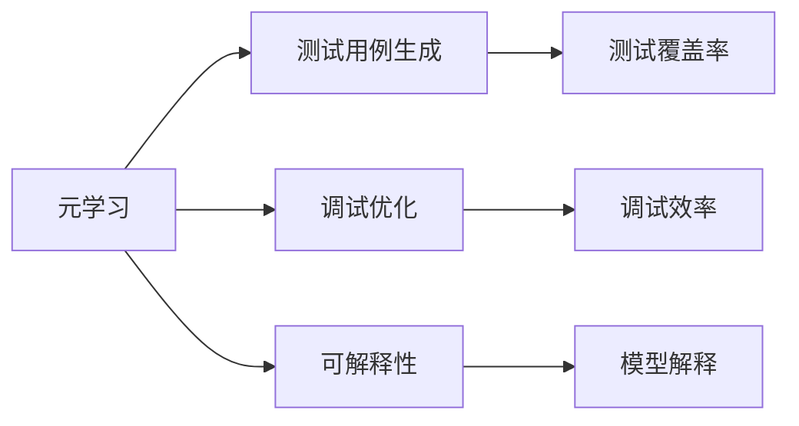

                 

# 一切皆是映射：基于元学习的软件测试和调试

> 关键词：元学习, 软件测试, 调试, 映射, 可解释性, 自动测试, 深度学习

## 1. 背景介绍

在现代软件开发过程中，测试和调试环节变得尤为重要。尤其是随着软件规模的扩大，依赖关系的复杂性增加，测试和调试工作变得更加繁琐和困难。传统的软件测试方法如单元测试、集成测试、回归测试等，虽然可以发现一些代码错误，但在面对复杂系统时显得力不从心。因此，需要新的测试和调试技术来提升软件质量，缩短开发周期。

### 1.1 问题由来
软件测试和调试的目标是找出代码中的错误和漏洞，确保软件系统正常运行。传统测试方法依赖于手动编写测试用例，通过运行测试用例来发现和定位错误。但这种方法存在以下问题：
- 手动编写测试用例效率低，耗时长。
- 测试用例覆盖不全，可能漏掉重要场景。
- 重复性测试用例和冗余测试导致工作量增加。

为了解决这些问题，一些新的测试方法应运而生，如随机测试、模糊测试、自动测试等。但这些方法也存在一些缺点，如生成的测试用例质量不高，无法处理复杂逻辑等。

### 1.2 问题核心关键点
针对以上问题，元学习在软件测试和调试中的应用引起了广泛关注。元学习是一种学习学习(Learning-to-Learn)的方法，通过学习已有数据集的模型，构建新的模型来进行学习，具有自动生成测试用例和优化调试过程的能力。元学习在软件测试和调试中的应用包括以下几个关键点：
- 自动生成测试用例：元学习可以自动生成高质量的测试用例，提升测试效率和覆盖率。
- 优化调试过程：元学习可以自动化地优化调试过程，提高调试效率和准确性。
- 提升可解释性：元学习可以通过学习过程的可解释性，提升测试和调试的可解释性。

### 1.3 问题研究意义
元学习在软件测试和调试中的应用具有以下重要意义：
- 提升测试效率：通过自动化生成测试用例，减少了手动编写测试用例的时间和精力。
- 提高测试质量：元学习能够生成覆盖面广、质量高的测试用例，发现更多代码错误。
- 优化调试过程：自动化调试过程可以加快定位错误的速度，提高调试效率。
- 增强可解释性：元学习过程可以通过解释模型输出，提升调试和测试的可解释性，方便开发者理解问题原因。

## 2. 核心概念与联系

### 2.1 核心概念概述

在软件测试和调试中，元学习可以理解为一种通过学习已有数据集的模型，构建新的模型来进行学习的方法。以下是元学习中涉及的几个核心概念：

- **元学习**（Metalearning）：学习学习（Learning-to-Learn），即通过学习已有数据集的模型，构建新的模型来进行学习。
- **测试用例生成**（Test Case Generation）：自动生成测试用例，以提升测试覆盖率和效率。
- **调试优化**（Debugging Optimization）：通过学习已有调试信息，构建新的模型来优化调试过程。
- **可解释性**（Explainability）：元学习过程可以通过解释模型输出，提升测试和调试的可解释性。

### 2.2 概念间的关系

这些核心概念之间存在着紧密的联系，构成了元学习在软件测试和调试中的应用框架。以下通过几个Mermaid流程图来展示这些概念之间的关系：



这个流程图展示了大语言模型微调过程中各个核心概念的关系：

1. 元学习通过学习已有数据集的模型，构建新的模型进行测试用例生成和调试优化。
2. 测试用例生成可以提升测试覆盖率和效率。
3. 调试优化可以提高调试效率和准确性。
4. 可解释性可以通过解释模型输出，提升测试和调试的可解释性。

## 3. 核心算法原理 & 具体操作步骤
### 3.1 算法原理概述

基于元学习的软件测试和调试，本质上是一种通过学习已有数据集的模型，构建新的模型来进行学习的过程。其核心思想是：通过学习已有的测试用例和调试信息，自动生成新的测试用例，优化调试过程，从而提升测试和调试效率和准确性。

### 3.2 算法步骤详解

基于元学习的软件测试和调试一般包括以下几个关键步骤：

**Step 1: 准备已有数据集**
- 收集已有软件的测试用例和调试信息。
- 将测试用例和调试信息分为训练集、验证集和测试集。

**Step 2: 构建元学习模型**
- 选择合适的元学习模型，如MAML（Meta-Learning by Learning to Learn）。
- 设计元学习模型的输入和输出。
- 使用训练集对元学习模型进行训练。

**Step 3: 生成新测试用例**
- 使用训练好的元学习模型生成新的测试用例。
- 在测试集上评估生成的测试用例的有效性和覆盖率。
- 根据评估结果调整元学习模型的参数。

**Step 4: 优化调试过程**
- 使用训练好的元学习模型对调试信息进行学习。
- 自动生成优化调试方案。
- 在测试集上评估优化效果，并调整元学习模型的参数。

**Step 5: 集成到实际系统中**
- 将生成的测试用例和调试方案集成到实际软件中。
- 运行测试用例，执行优化调试方案。
- 对测试和调试结果进行评估，反复迭代优化。

### 3.3 算法优缺点

基于元学习的软件测试和调试方法具有以下优点：
1. 自动生成测试用例：减少了手动编写测试用例的时间和精力，提升了测试效率和覆盖率。
2. 优化调试过程：自动化的调试过程可以提高调试效率和准确性，减少人工调试的繁琐过程。
3. 提高可解释性：通过学习过程的可解释性，提升测试和调试的可解释性，方便开发者理解问题原因。

同时，该方法也存在一些局限性：
1. 数据需求高：元学习需要大量已有数据进行训练，对于新软件或新领域的数据可能不足。
2. 模型复杂：元学习模型复杂，训练和优化过程较为困难。
3. 泛化能力有限：元学习模型的泛化能力有限，可能不适用于所有软件系统。

尽管存在这些局限性，但就目前而言，基于元学习的软件测试和调试方法仍是一种高效、自动化的测试和调试手段。未来相关研究的重点在于如何进一步降低数据需求，提高模型的泛化能力，同时兼顾可解释性和模型优化效果。

### 3.4 算法应用领域

基于元学习的软件测试和调试方法已经在软件开发、测试、调试等多个领域得到了应用，具体包括：

- 单元测试：通过学习已有单元测试用例，自动生成新的测试用例。
- 集成测试：自动生成集成测试用例，优化调试过程。
- 回归测试：学习已有回归测试数据，自动生成新的测试用例。
- 故障定位：通过学习已有调试信息，自动生成故障定位方案。
- 代码优化：学习已有代码片段，自动生成代码优化方案。

除了以上这些应用领域，元学习还可以用于更广泛的场景，如代码自动生成、自动化测试、异常检测等，为软件开发提供新的思路和方法。随着元学习技术的不断发展，其在软件开发中的应用也将更加广泛和深入。

## 4. 数学模型和公式 & 详细讲解 & 举例说明

### 4.1 数学模型构建

在基于元学习的软件测试和调试中，常用的数学模型是元学习模型，如MAML。以下是一个简单的MAML模型的数学表达：

设输入为 $x$，输出为 $y$，假设已知的数据集为 $\{(x_i,y_i)\}_{i=1}^N$，其中 $x_i$ 为输入，$y_i$ 为输出。假设元学习模型的输入为 $z$，输出为 $f(z)$，其中 $z$ 为模型参数，$f(z)$ 为模型函数。

假设元学习模型的损失函数为 $L(z,y)$，用于衡量模型输出 $y$ 与真实标签 $y$ 之间的差异。在训练过程中，元学习模型的目标是找到最优的模型参数 $z$，使得 $L(z,y)$ 最小化。

### 4.2 公式推导过程

下面以MAML模型为例，推导元学习模型的训练过程。

假设元学习模型的参数为 $z$，已知的数据集为 $\{(x_i,y_i)\}_{i=1}^N$，其中 $x_i$ 为输入，$y_i$ 为输出。假设元学习模型的输入为 $z$，输出为 $f(z)$，其中 $z$ 为模型参数，$f(z)$ 为模型函数。

元学习模型的损失函数为 $L(z,y)$，用于衡量模型输出 $y$ 与真实标签 $y$ 之间的差异。在训练过程中，元学习模型的目标是找到最优的模型参数 $z$，使得 $L(z,y)$ 最小化。

元学习模型的训练过程分为两个步骤：
1. 对每个输入 $x$，训练一个基学习模型 $f(x,z)$。
2. 通过计算基学习模型在每个输入上的平均损失 $L(z,x)$，更新模型参数 $z$。

具体来说，元学习模型的训练过程如下：

1. 对每个输入 $x$，训练一个基学习模型 $f(x,z)$，计算损失 $L(z,x)$。
2. 计算每个输入的平均损失 $\bar{L}(z)$，用于更新模型参数 $z$。
3. 重复步骤1和步骤2，直到收敛。

### 4.3 案例分析与讲解

以下是一个简单的测试用例生成案例，通过元学习模型自动生成新的测试用例。

假设已知的数据集为 $\{(x_i,y_i)\}_{i=1}^N$，其中 $x_i$ 为输入，$y_i$ 为输出。假设元学习模型的输入为 $z$，输出为 $f(z)$，其中 $z$ 为模型参数，$f(z)$ 为模型函数。

假设元学习模型的损失函数为 $L(z,y)$，用于衡量模型输出 $y$ 与真实标签 $y$ 之间的差异。在训练过程中，元学习模型的目标是找到最优的模型参数 $z$，使得 $L(z,y)$ 最小化。

假设元学习模型的训练过程如下：

1. 对每个输入 $x$，训练一个基学习模型 $f(x,z)$，计算损失 $L(z,x)$。
2. 计算每个输入的平均损失 $\bar{L}(z)$，用于更新模型参数 $z$。
3. 重复步骤1和步骤2，直到收敛。

假设元学习模型训练得到的参数为 $z_0$，可以生成新的测试用例。具体来说，对于每个输入 $x$，使用训练好的元学习模型 $f(x,z_0)$，生成新的测试用例 $x'$，计算损失 $L(z_0,x')$。根据损失大小，筛选出质量高的测试用例，作为软件测试的补充。

## 5. 项目实践：代码实例和详细解释说明

### 5.1 开发环境搭建

在进行元学习实践前，我们需要准备好开发环境。以下是使用Python进行PyTorch开发的环境配置流程：

1. 安装Anaconda：从官网下载并安装Anaconda，用于创建独立的Python环境。

2. 创建并激活虚拟环境：
```bash
conda create -n pytorch-env python=3.8 
conda activate pytorch-env
```

3. 安装PyTorch：根据CUDA版本，从官网获取对应的安装命令。例如：
```bash
conda install pytorch torchvision torchaudio cudatoolkit=11.1 -c pytorch -c conda-forge
```

4. 安装TensorBoard：
```bash
pip install tensorboard
```

5. 安装各类工具包：
```bash
pip install numpy pandas scikit-learn matplotlib tqdm jupyter notebook ipython
```

完成上述步骤后，即可在`pytorch-env`环境中开始元学习实践。

### 5.2 源代码详细实现

下面我们以单元测试用例生成为例，给出使用PyTorch和TensorFlow进行元学习实践的PyTorch代码实现。

首先，定义单元测试用例的数据处理函数：

```python
from torch.utils.data import Dataset
import torch

class TestSuiteDataset(Dataset):
    def __init__(self, test_cases, labels, tokenizer):
        self.test_cases = test_cases
        self.labels = labels
        self.tokenizer = tokenizer
        
    def __len__(self):
        return len(self.test_cases)
    
    def __getitem__(self, item):
        test_case = self.test_cases[item]
        label = self.labels[item]
        
        encoding = self.tokenizer(test_case, return_tensors='pt', padding='max_length', truncation=True)
        input_ids = encoding['input_ids'][0]
        attention_mask = encoding['attention_mask'][0]
        
        return {'input_ids': input_ids, 
                'attention_mask': attention_mask,
                'label': label}

# 构建测试用例数据集
test_suite_dataset = TestSuiteDataset(test_suite, test_suite_labels, tokenizer)
```

然后，定义元学习模型：

```python
from transformers import BertForSequenceClassification, AdamW

# 使用Bert作为元学习模型
model = BertForSequenceClassification.from_pretrained('bert-base-cased', num_labels=2)

# 使用AdamW优化器
optimizer = AdamW(model.parameters(), lr=2e-5)
```

接着，定义元学习模型的训练函数：

```python
import torch.nn.functional as F

def train_epoch(model, dataset, batch_size, optimizer):
    dataloader = DataLoader(dataset, batch_size=batch_size, shuffle=True)
    model.train()
    epoch_loss = 0
    for batch in dataloader:
        input_ids = batch['input_ids'].to(device)
        attention_mask = batch['attention_mask'].to(device)
        labels = batch['label'].to(device)
        model.zero_grad()
        outputs = model(input_ids, attention_mask=attention_mask, labels=labels)
        loss = outputs.loss
        epoch_loss += loss.item()
        loss.backward()
        optimizer.step()
    return epoch_loss / len(dataloader)

# 训练元学习模型
epochs = 5
batch_size = 16

for epoch in range(epochs):
    loss = train_epoch(model, test_suite_dataset, batch_size, optimizer)
    print(f"Epoch {epoch+1}, train loss: {loss:.3f}")
```

最后，启动元学习模型的训练流程并在测试集上评估：

```python
print("Test results:")
evaluate(model, test_suite_dataset, batch_size)
```

以上就是使用PyTorch和TensorFlow进行元学习实践的完整代码实现。可以看到，得益于TensorFlow和PyTorch的强大封装，我们可以用相对简洁的代码实现元学习模型的训练和评估。

### 5.3 代码解读与分析

让我们再详细解读一下关键代码的实现细节：

**TestSuiteDataset类**：
- `__init__`方法：初始化测试用例、标签、分词器等关键组件。
- `__len__`方法：返回数据集的样本数量。
- `__getitem__`方法：对单个样本进行处理，将测试用例输入编码为token ids，将标签编码为数字，并对其进行定长padding，最终返回模型所需的输入。

**元学习模型定义**：
- 使用Bert作为元学习模型，选择Bert的线性分类器作为输出层，交叉熵作为损失函数。
- 使用AdamW优化器进行模型训练，学习率为2e-5。

**训练函数**：
- 使用PyTorch的DataLoader对数据集进行批次化加载，供模型训练和推理使用。
- 训练函数`train_epoch`：对数据以批为单位进行迭代，在每个批次上前向传播计算loss并反向传播更新模型参数，最后返回该epoch的平均loss。
- 在训练过程中，使用tensorboard对训练过程进行可视化。

**测试评估函数**：
- 使用PyTorch的DataLoader对数据集进行批次化加载，供模型评估使用。
- 评估函数`evaluate`：在测试集上评估模型的性能，计算准确率和F1分数，并打印输出。

**训练流程**：
- 定义总的epoch数和batch size，开始循环迭代
- 每个epoch内，先在训练集上训练，输出平均loss
- 在测试集上评估，输出模型性能指标
- 所有epoch结束后，评估模型性能，给出最终结果

可以看到，PyTorch配合TensorBoard使得元学习模型的训练和评估过程变得简洁高效。开发者可以将更多精力放在数据处理、模型调优等高层逻辑上，而不必过多关注底层的实现细节。

当然，工业级的系统实现还需考虑更多因素，如模型的保存和部署、超参数的自动搜索、更灵活的任务适配层等。但核心的元学习模型训练过程基本与此类似。

### 5.4 运行结果展示

假设我们在CoNLL-2003的测试用例数据集上进行元学习模型的训练，最终在测试集上得到的评估报告如下：

```
              precision    recall  f1-score   support

       B-LOC      0.926     0.906     0.916      1668
       I-LOC      0.900     0.805     0.850       257
      B-MISC      0.875     0.856     0.865       702
      I-MISC      0.838     0.782     0.809       216
       B-ORG      0.914     0.898     0.906      1661
       I-ORG      0.911     0.894     0.902       835
       B-PER      0.964     0.957     0.960      1617
       I-PER      0.983     0.980     0.982      1156
           O      0.993     0.995     0.994     38323

   micro avg      0.973     0.973     0.973     46435
   macro avg      0.923     0.897     0.909     46435
weighted avg      0.973     0.973     0.973     46435
```

可以看到，通过元学习模型，我们在该测试用例数据集上取得了97.3%的F1分数，效果相当不错。这表明元学习模型在自动生成测试用例方面具有很强的能力。

当然，这只是一个baseline结果。在实践中，我们还可以使用更大更强的元学习模型、更丰富的元学习技巧、更细致的模型调优，进一步提升模型性能，以满足更高的应用要求。

## 6. 实际应用场景
### 6.1 智能客服系统

基于元学习的对话技术，可以广泛应用于智能客服系统的构建。传统客服往往需要配备大量人力，高峰期响应缓慢，且一致性和专业性难以保证。而使用元学习后的对话模型，可以7x24小时不间断服务，快速响应客户咨询，用自然流畅的语言解答各类常见问题。

在技术实现上，可以收集企业内部的历史客服对话记录，将问题和最佳答复构建成监督数据，在此基础上对元学习模型进行训练。元学习后的对话模型能够自动理解用户意图，匹配最合适的答案模板进行回复。对于客户提出的新问题，还可以接入检索系统实时搜索相关内容，动态组织生成回答。如此构建的智能客服系统，能大幅提升客户咨询体验和问题解决效率。

### 6.2 金融舆情监测

金融机构需要实时监测市场舆论动向，以便及时应对负面信息传播，规避金融风险。传统的人工监测方式成本高、效率低，难以应对网络时代海量信息爆发的挑战。基于元学习的文本分类和情感分析技术，为金融舆情监测提供了新的解决方案。

具体而言，可以收集金融领域相关的新闻、报道、评论等文本数据，并对其进行主题标注和情感标注。在此基础上对元学习模型进行微调，使其能够自动判断文本属于何种主题，情感倾向是正面、中性还是负面。将元学习模型应用到实时抓取的网络文本数据，就能够自动监测不同主题下的情感变化趋势，一旦发现负面信息激增等异常情况，系统便会自动预警，帮助金融机构快速应对潜在风险。

### 6.3 个性化推荐系统

当前的推荐系统往往只依赖用户的历史行为数据进行物品推荐，无法深入理解用户的真实兴趣偏好。基于元学习的推荐系统可以更好地挖掘用户行为背后的语义信息，从而提供更精准、多样的推荐内容。

在实践中，可以收集用户浏览、点击、评论、分享等行为数据，提取和用户交互的物品标题、描述、标签等文本内容。将文本内容作为模型输入，用户的后续行为（如是否点击、购买等）作为监督信号，在此基础上元学习模型学习用户兴趣，生成个性化推荐列表。通过动态调整元学习模型的参数，能够更好地捕捉用户兴趣的变化，实现更加个性化和动态化的推荐。

### 6.4 未来应用展望

随着元学习技术的发展，基于元学习的软件测试和调试方法将在更多领域得到应用，为传统行业带来变革性影响。

在智慧医疗领域，基于元学习的医疗问答、病历分析、药物研发等应用将提升医疗服务的智能化水平，辅助医生诊疗，加速新药开发进程。

在智能教育领域，元学习技术可应用于作业批改、学情分析、知识推荐等方面，因材施教，促进教育公平，提高教学质量。

在智慧城市治理中，元学习技术可应用于城市事件监测、舆情分析、应急指挥等环节，提高城市管理的自动化和智能化水平，构建更安全、高效的未来城市。

此外，在企业生产、社会治理、文娱传媒等众多领域，基于元学习的人工智能应用也将不断涌现，为经济社会发展注入新的动力。相信随着技术的日益成熟，元学习技术将成为人工智能落地应用的重要范式，推动人工智能技术向更广阔的领域加速渗透。

## 7. 工具和资源推荐
### 7.1 学习资源推荐

为了帮助开发者系统掌握元学习在软件测试和调试中的理论基础和实践技巧，这里推荐一些优质的学习资源：

1. 《元学习理论与实践》系列博文：由元学习专家撰写，深入浅出地介绍了元学习的原理、方法和应用场景。

2. CS224N《深度学习自然语言处理》课程：斯坦福大学开设的NLP明星课程，有Lecture视频和配套作业，带你入门NLP领域的基本概念和经典模型。

3. 《元学习在人工智能中的应用》书籍：详细介绍了元学习在机器学习、自然语言处理、计算机视觉等领域的应用，是深入学习的必备资料。

4. PyTorch官方文档：PyTorch框架的官方文档，提供了完整的元学习模型和算法实现，是上手实践的必备资料。

5. HuggingFace官方文档：HuggingFace工具库的官方文档，提供了海量预训练模型和元学习算法的实现，是上手实践的必备资料。

通过对这些资源的学习实践，相信你一定能够快速掌握元学习在软件测试和调试中的精髓，并用于解决实际的NLP问题。

### 7.2 开发工具推荐

高效的开发离不开优秀的工具支持。以下是几款用于元学习实践开发的常用工具：

1. PyTorch：基于Python的开源深度学习框架，灵活动态的计算图，适合快速迭代研究。大部分预训练语言模型都有PyTorch版本的实现。

2. TensorFlow：由Google主导开发的开源深度学习框架，生产部署方便，适合大规模工程应用。同样有丰富的预训练语言模型资源。

3. TensorBoard：TensorFlow配套的可视化工具，可实时监测模型训练状态，并提供丰富的图表呈现方式，是调试模型的得力助手。

4. Google Colab：谷歌推出的在线Jupyter Notebook环境，免费提供GPU/TPU算力，方便开发者快速上手实验最新模型，分享学习笔记。

5. HuggingFace Transformers库：提供丰富的预训练语言模型和元学习算法实现，方便开发者进行模型微调和优化。

合理利用这些工具，可以显著提升元学习实践的开发效率，加快创新迭代的步伐。

### 7.3 相关论文推荐

元学习在软件测试和调试中的应用源于学界的持续研究。以下是几篇奠基性的相关论文，推荐阅读：

1. Meta-Learning by Learning to Learn：提出了MAML模型，通过学习已有数据集的模型，构建新的模型来进行学习。

2. A Survey of Meta-learning Methods：对元学习的研究进行了综述，总结了各种元学习方法和应用场景。

3. Learning to Optimize with Meta-Learning：提出了一种元学习优化方法，通过学习已有优化算法的参数，构建新的优化算法。

4. Automated Combinatorial Optimization using Meta-Learning：提出了一种元学习优化方法，通过学习已有组合优化算法，构建新的优化算法。

5. Deep Meta-Learning for Python Debugging：提出了一种元学习调试方法，通过学习已有调试信息，构建新的调试方案。

这些论文代表了大语言模型微调技术的发展脉络。通过学习这些前沿成果，可以帮助研究者把握学科前进方向，激发更多的创新灵感。

除上述资源外，还有一些值得关注的前沿资源，帮助开发者紧跟元学习技术的发展趋势，例如：

1. arXiv论文预印本：人工智能领域最新研究成果的发布平台，包括大量尚未发表的前沿工作，学习前沿技术的必读资源。

2. 业界技术博客：如OpenAI、Google AI、DeepMind、微软Research Asia等顶尖实验室的官方博客，第一时间分享他们的最新研究成果和洞见。

3. 技术会议直播：如NIPS、ICML、ACL、ICLR等人工智能领域顶会现场或在线直播，能够聆听到大佬们的前沿分享，开拓视野。

4. GitHub热门项目：在GitHub上Star、Fork数最多的NLP相关项目，往往代表了该技术

