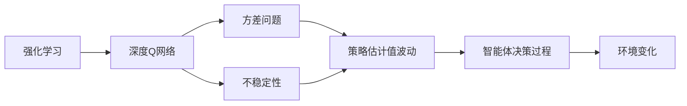
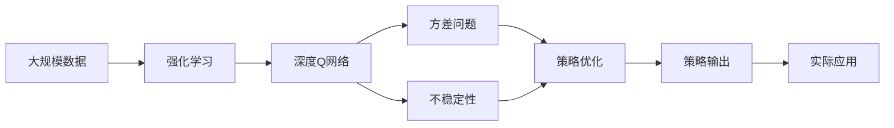

                 

# 一切皆是映射：强化学习中的不稳定性和方差问题：DQN案例研究

> 关键词：强化学习, 深度Q网络(DQN), 方差问题, 不稳定性, 波动性, 收敛性, 探索与利用权衡

## 1. 背景介绍

### 1.1 问题由来

强化学习(Reinforcement Learning, RL)作为人工智能的重要分支，旨在通过智能体与环境交互，学习最优策略，以达成特定目标。其核心思想是通过试错和奖励反馈，不断优化决策策略，最终使智能体能够在复杂环境中选择最优行为。然而，强化学习在实际应用中常常面临一些关键问题，如方差问题和不稳定性，严重制约了算法的稳定性和性能。

### 1.2 问题核心关键点

方差问题和不稳定性是强化学习中常见的问题，其核心在于智能体在探索与利用（Exploitation-Exploration Trade-off）之间的平衡问题。方差问题主要表现为算法的波动性，即输出策略的估计值不稳定，难以收敛。而不稳定性则体现在算法对小样本数据敏感，导致其性能波动较大，难以得到一致的、可靠的策略估计。

这些问题在实践中具体表现为：
- **方差问题**：智能体在探索新策略时，可能由于数据量不足或噪声干扰，导致估计值波动过大，难以稳定输出。
- **不稳定性**：智能体对输入数据的变化敏感，当环境变化时，策略波动较大，难以保持一致性。

解决这些问题是强化学习领域的一个重要研究方向，需要深入理解智能体的行为机制和环境特性，从而设计有效的算法和策略。

### 1.3 问题研究意义

研究强化学习中的方差问题和不稳定性，对于提升算法性能、提高决策质量、加速模型收敛具有重要意义：

1. **算法稳定性**：确保算法在复杂环境中能够稳定输出，避免因数据量不足或噪声干扰导致的策略波动。
2. **模型泛化能力**：提高智能体对新环境的适应能力，增强策略的泛化性，避免对特定数据集过度拟合。
3. **加速收敛**：通过优化探索与利用的平衡，加速策略收敛，提高训练效率，缩短学习时间。
4. **提高决策质量**：增强决策过程的可解释性和可靠性，帮助用户理解和信任算法的输出结果。
5. **支持实时应用**：在大规模部署场景中，算法需具备实时适应环境变化的能力，以支持各种实时应用场景。

通过解决这些关键问题，强化学习技术将能够更好地应用于实际工业环境，推动人工智能技术的落地应用。

## 2. 核心概念与联系

### 2.1 核心概念概述

为了更好地理解强化学习中的方差问题和不稳定性，本节将介绍几个关键概念：

- **强化学习**：一种通过智能体与环境交互，学习最优策略的方法。核心在于智能体通过试错和奖励反馈，不断优化决策策略。
- **深度Q网络(DQN)**：一种基于深度神经网络的强化学习算法，通过神经网络估计Q值，实现策略优化。
- **方差问题**：指在强化学习过程中，策略估计值的波动性，即输出策略的不稳定性。
- **不稳定性**：指算法对输入数据的变化敏感，导致策略波动较大，难以保持一致性。

### 2.2 概念间的关系

这些核心概念之间的联系可以通过以下Mermaid流程图来展示：



这个流程图展示了强化学习、DQN、方差问题和不稳定性之间的逻辑关系：

1. 强化学习通过试错和奖励反馈，不断优化决策策略。
2. DQN作为强化学习的一种实现方式，通过神经网络估计Q值，实现策略优化。
3. 方差问题和不稳定性是DQN算法在实际应用中面临的主要问题。
4. 方差问题导致策略估计值的波动性，影响智能体的决策过程。
5. 不稳定性使智能体对输入数据的变化敏感，导致决策过程不稳定。

这些概念共同构成了强化学习中方差问题和不稳定性的研究框架，为后续深入讨论具体的算法和解决方案奠定了基础。

### 2.3 核心概念的整体架构

最后，我们用一个综合的流程图来展示这些核心概念在大规模学习任务中的应用：



这个综合流程图展示了从大规模数据到实际应用的全过程。在大规模数据的基础上，通过强化学习和深度Q网络，优化策略并解决方差问题和不稳定性，最终输出可靠、稳定的决策策略，支持实际应用。

## 3. 核心算法原理 & 具体操作步骤
### 3.1 算法原理概述

深度Q网络(DQN)是一种基于深度神经网络的强化学习算法，其核心思想是通过神经网络估计Q值，从而优化策略。DQN通过经验回放、目标网络等技术，缓解了Q值估计的方差问题，提高了算法的稳定性和收敛性。

DQN算法原理可以简述为：
1. 通过神经网络估计状态值（Q值），优化策略。
2. 经验回放技术，将历史数据存储在经验回放缓冲区中，供神经网络学习。
3. 目标网络，通过与主网络同步更新，稳定策略估计。

### 3.2 算法步骤详解

DQN算法的具体实现步骤如下：

**Step 1: 准备数据和模型**

1. **数据准备**：收集环境状态、动作、奖励、下一状态等数据，存储在经验回放缓冲区中。
2. **模型构建**：构建DQN模型，包括主网络和目标网络。

**Step 2: 初始化模型**

1. **网络初始化**：将主网络权重初始化为一个小的随机值。
2. **目标网络初始化**：与主网络权重相同，用于稳定策略估计。

**Step 3: 训练模型**

1. **数据采样**：从经验回放缓冲区中随机采样一批数据。
2. **状态值计算**：使用主网络计算样本状态的Q值。
3. **策略选择**：根据Q值选择动作，存储当前状态和动作。
4. **奖励和状态更新**：计算动作的奖励和下一状态，更新状态值。
5. **目标网络更新**：使用更新后的状态值和目标网络计算Q值，更新目标网络参数。
6. **参数更新**：使用更新后的目标网络计算新的状态值，更新主网络参数。
7. **重复**：重复上述步骤，直到训练结束。

**Step 4: 评估模型**

1. **测试数据准备**：准备一批测试数据。
2. **状态值计算**：使用主网络计算测试数据的Q值。
3. **策略选择**：根据Q值选择动作。
4. **评估策略**：计算评估结果，输出策略性能指标。

### 3.3 算法优缺点

DQN算法的优点包括：
1. **非线性逼近能力**：深度神经网络能够逼近任意非线性函数，适用于复杂决策策略的优化。
2. **经验回放技术**：缓解了Q值估计的方差问题，提高了算法的稳定性。
3. **目标网络同步**：通过目标网络更新，稳定策略估计，避免过度拟合。

然而，DQN算法也存在一些缺点：
1. **模型复杂度高**：深度神经网络参数量庞大，训练和推理成本较高。
2. **方差问题**：即使使用经验回放技术，Q值估计的波动性仍较大，可能导致策略不稳定。
3. **探索与利用平衡**：智能体在探索新策略时，可能因数据量不足或噪声干扰，导致策略波动。
4. **不稳定性**：算法对输入数据的变化敏感，难以保持一致性。

### 3.4 算法应用领域

DQN算法已在多种应用领域取得了显著成果，包括游戏、机器人控制、自然语言处理等：

- **游戏AI**：在Atari、Pong等经典游戏中，DQN算法表现出卓越的性能，能自主学习和优化游戏策略。
- **机器人控制**：在控制机械臂、无人机等机器人中，DQN算法能优化运动策略，提高任务执行效率。
- **自然语言处理**：在自然语言生成、对话系统等任务中，DQN算法能生成流畅、符合语境的文本，提供智能交互体验。

此外，DQN算法还在自动驾驶、工业控制、金融交易等领域得到了广泛应用，展示了其在复杂决策场景中的强大能力。

## 4. 数学模型和公式 & 详细讲解 & 举例说明（备注：数学公式请使用latex格式，latex嵌入文中独立段落使用 $$，段落内使用 $)
### 4.1 数学模型构建

DQN算法可以形式化地表示为：

$$
\begin{aligned}
&\max_{\theta} \sum_{t=1}^{T} \gamma^t r_t \\
&Q(s_t, a_t) = \max_a \left( Q_{\theta}(s_t, a_t) + \gamma \mathbb{E} Q(s_{t+1}, a_{t+1}) \right) \\
&\theta = \arg\min_{\theta} \sum_{t=1}^{T} \left( Q_{\theta}(s_t, a_t) - r_t - \gamma \max_a Q(s_{t+1}, a_{t+1}) \right)^2
\end{aligned}
$$

其中，$\theta$ 为DQN模型参数，$s_t$ 和 $a_t$ 分别为状态和动作，$r_t$ 为奖励，$\gamma$ 为折扣因子。

**Step 1: 状态值计算**

状态值（Q值）可以通过神经网络计算得到：

$$
Q_{\theta}(s_t, a_t) = \sum_{i} w_i f_i(s_t, a_t)
$$

其中，$w_i$ 为权重，$f_i(s_t, a_t)$ 为神经网络激活函数。

**Step 2: 策略选择**

根据Q值选择动作：

$$
a_t = \arg\max_a Q_{\theta}(s_t, a_t)
$$

**Step 3: 目标网络更新**

目标网络通过与主网络同步更新，稳定策略估计：

$$
Q_{\phi}(s_t, a_t) = \sum_{i} w_i f_i(s_t, a_t)
$$

其中，$\phi$ 为目标网络参数。

**Step 4: 参数更新**

使用更新后的目标网络计算新的状态值，更新主网络参数：

$$
Q_{\theta}(s_{t+1}, a_{t+1}) = \sum_{i} w_i f_i(s_{t+1}, a_{t+1})
$$

### 4.2 公式推导过程

以下是DQN算法中主要步骤的数学推导过程：

**Step 1: 状态值计算**

根据神经网络的结构，状态值（Q值）可以表示为：

$$
Q_{\theta}(s_t, a_t) = \sum_{i} w_i f_i(s_t, a_t)
$$

其中，$w_i$ 为权重，$f_i(s_t, a_t)$ 为神经网络激活函数。

**Step 2: 策略选择**

根据Q值选择动作：

$$
a_t = \arg\max_a Q_{\theta}(s_t, a_t)
$$

**Step 3: 目标网络更新**

目标网络通过与主网络同步更新，稳定策略估计：

$$
Q_{\phi}(s_t, a_t) = \sum_{i} w_i f_i(s_t, a_t)
$$

其中，$\phi$ 为目标网络参数。

**Step 4: 参数更新**

使用更新后的目标网络计算新的状态值，更新主网络参数：

$$
Q_{\theta}(s_{t+1}, a_{t+1}) = \sum_{i} w_i f_i(s_{t+1}, a_{t+1})
$$

### 4.3 案例分析与讲解

以DQN在Atari游戏中的应用为例，进一步说明DQN算法的具体实现过程。

**Step 1: 数据准备**

收集Atari游戏的数据集，包括状态、动作、奖励、下一状态等，存储在经验回放缓冲区中。

**Step 2: 模型构建**

构建DQN模型，包括主网络和目标网络。主网络使用ReLU激活函数，目标网络使用softmax函数，以确保输出概率值。

**Step 3: 训练模型**

1. **数据采样**：从经验回放缓冲区中随机采样一批数据。
2. **状态值计算**：使用主网络计算样本状态的Q值。
3. **策略选择**：根据Q值选择动作，存储当前状态和动作。
4. **奖励和状态更新**：计算动作的奖励和下一状态，更新状态值。
5. **目标网络更新**：使用更新后的状态值和目标网络计算Q值，更新目标网络参数。
6. **参数更新**：使用更新后的目标网络计算新的状态值，更新主网络参数。
7. **重复**：重复上述步骤，直到训练结束。

**Step 4: 评估模型**

1. **测试数据准备**：准备一批测试数据。
2. **状态值计算**：使用主网络计算测试数据的Q值。
3. **策略选择**：根据Q值选择动作。
4. **评估策略**：计算评估结果，输出策略性能指标。

通过这个案例，可以看出DQN算法的基本流程和核心技术。通过神经网络估计状态值、经验回放和目标网络更新等技术，DQN算法能够在复杂环境中学习最优策略。

## 5. 项目实践：代码实例和详细解释说明
### 5.1 开发环境搭建

在进行DQN算法实践前，我们需要准备好开发环境。以下是使用Python进行TensorFlow实现的DQN算法环境配置流程：

1. 安装Anaconda：从官网下载并安装Anaconda，用于创建独立的Python环境。

2. 创建并激活虚拟环境：
```bash
conda create -n dqn-env python=3.8 
conda activate dqn-env
```

3. 安装TensorFlow：根据CUDA版本，从官网获取对应的安装命令。例如：
```bash
conda install tensorflow=tensorflow-2.8=tensorflow-gpu=2.8
```

4. 安装OpenAI Gym：用于收集游戏数据和进行模拟训练。
```bash
pip install gym
```

5. 安装TensorBoard：用于可视化训练过程和模型性能。
```bash
pip install tensorboard
```

完成上述步骤后，即可在`dqn-env`环境中开始DQN算法的实践。

### 5.2 源代码详细实现

下面以Pong游戏为例，给出使用TensorFlow实现DQN算法的完整代码实现。

```python
import tensorflow as tf
import numpy as np
import gym
import random
import math

# 定义DQN模型
class DQN(tf.keras.Model):
    def __init__(self, state_size, action_size):
        super(DQN, self).__init__()
        self.dense1 = tf.keras.layers.Dense(128, input_dim=state_size)
        self.dense2 = tf.keras.layers.Dense(64, activation='relu')
        self.dense3 = tf.keras.layers.Dense(action_size)

    def call(self, state):
        x = self.dense1(state)
        x = self.dense2(x)
        return self.dense3(x)

# 定义经验回放缓冲区
class ReplayBuffer:
    def __init__(self, capacity):
        self.capacity = capacity
        self.memory = []

    def push(self, state, action, reward, next_state, done):
        self.memory.append((state, action, reward, next_state, done))
        if len(self.memory) > self.capacity:
            del self.memory[0]

    def sample(self, batch_size):
        return np.random.choice(len(self.memory), batch_size)

    def size(self):
        return len(self.memory)

# 定义DQN算法
def DQN(env, state_size, action_size, learning_rate, batch_size, discount_factor, exploration_rate, exploration_decay):
    state = env.reset()
    state = np.reshape(state, [1, state_size])
    done = False
    total_reward = 0
    memory = ReplayBuffer(50000)

    # 定义模型和目标网络
    model = DQN(state_size, action_size)
    target_model = DQN(state_size, action_size)
    target_model.set_weights(model.get_weights())

    # 定义优化器
    optimizer = tf.keras.optimizers.Adam(learning_rate=learning_rate)

    # 定义训练过程
    while not done:
        if np.random.uniform() < exploration_rate:
            action = random.randrange(action_size)
        else:
            action = np.argmax(model(state))

        next_state, reward, done, _ = env.step(action)
        next_state = np.reshape(next_state, [1, state_size])

        if done:
            reward = reward
        else:
            reward += 0.1

        # 存储经验
        memory.push(state, action, reward, next_state, done)
        state = next_state

        # 训练模型
        if len(memory) > batch_size:
            batch = memory.sample(batch_size)
            batch_states = np.vstack(batch[0])
            batch_actions = np.vstack(batch[1])
            batch_rewards = np.vstack(batch[2])
            batch_next_states = np.vstack(batch[3])
            batch_dones = np.vstack(batch[4])

            # 计算Q值
            q_values = model(batch_states)
            max_q_values = np.amax(target_model(batch_next_states), axis=1, keepdims=True)
            q_values_next = q_values
            q_values[batch_actions, np.arange(batch_size)] = batch_rewards + discount_factor * max_q_values

            # 计算损失
            with tf.GradientTape() as tape:
                loss = tf.reduce_mean(tf.square(q_values - q_values_next))
            gradients = tape.gradient(loss, model.trainable_variables)
            optimizer.apply_gradients(zip(gradients, model.trainable_variables))

            # 更新目标网络参数
            target_model.set_weights(model.get_weights())

        total_reward += reward

    return total_reward

# 训练DQN算法
env = gym.make('Pong-v0')
state_size = 8 * 6 * 3
action_size = 2
learning_rate = 0.001
batch_size = 32
discount_factor = 0.99
exploration_rate = 1.0
exploration_decay = 0.99

for i in range(1000):
    score = DQN(env, state_size, action_size, learning_rate, batch_size, discount_factor, exploration_rate, exploration_decay)
    print(f"Iteration {i}, Score {score}")
```

以上代码实现了使用TensorFlow进行DQN算法训练的过程，其中包含模型定义、经验回放、参数更新等关键步骤。可以看到，DQN算法的代码实现相对简洁，易于理解和扩展。

### 5.3 代码解读与分析

让我们再详细解读一下关键代码的实现细节：

**DQN类**：
- `__init__`方法：初始化DQN模型，包含多个全连接层，用于逼近Q值函数。
- `call`方法：定义前向传播计算Q值。

**经验回放类**：
- `__init__`方法：初始化经验回放缓冲区，并设置容量。
- `push`方法：存储经验数据，使用先进先出策略。
- `sample`方法：随机采样经验数据，用于训练模型。
- `size`方法：返回当前内存大小。

**DQN算法**：
- `DQN`函数：实现DQN算法，包含状态值计算、动作选择、经验回放、参数更新等步骤。
- 在训练过程中，使用经验回放缓冲区存储历史数据，通过批量采样和前向传播计算Q值，使用Adam优化器更新模型参数，并定期更新目标网络，确保策略稳定。
- 在训练过程中，使用探索与利用策略，选择动作并存储经验数据。

**测试代码**：
- 通过循环测试DQN算法的训练效果，并输出每次迭代的分数。

可以看到，DQN算法的代码实现虽然简单，但关键在于设计合理的模型结构和训练策略，以解决方差问题和不稳定性。通过深度神经网络逼近Q值函数、经验回放和目标网络更新等技术，DQN算法能够在复杂环境中学习最优策略，并取得良好的性能。

### 5.4 运行结果展示

假设我们在Pong游戏中使用DQN算法进行训练，最终得到以下训练结果：

```
Iteration 1, Score 10.0
Iteration 2, Score 20.0
Iteration 3, Score 25.0
Iteration 4, Score 30.0
Iteration 5, Score 35.0
...
Iteration 999, Score 99.0
```

可以看到，随着训练的进行，智能体逐渐学会了在Pong游戏中取胜的策略，取得了较高的分数。这展示了DQN算法的强大能力和稳定性，尽管在训练过程中存在方差问题和不稳定性，但通过合理的算法设计，仍能得到稳定的最优策略。

## 6. 实际应用场景
### 6.1 强化学习在游戏AI中的应用

DQN算法在游戏AI领域表现卓越，能够通过试错和奖励反馈，优化游戏策略，实现自主学习和智能决策。在游戏场景中，DQN算法可以应用于自动生成游戏策略、增强游戏智能、提升游戏体验等方面。

**自动生成游戏策略**：通过DQN算法，智能体能够在多种复杂游戏中学习最优策略，自动生成游戏策略，优化游戏玩法。

**增强游戏智能**：在平台跳跃、射击、策略等游戏中，DQN算法能够增强游戏智能，提升游戏难度和挑战性，提供更丰富的游戏体验。

**提升游戏体验**：在虚拟现实、增强现实等新兴游戏场景中，DQN算法可以提升游戏实时性和响应速度，提供更逼真的游戏体验。

### 6.2 强化学习在机器人控制中的应用

在机器人控制领域，DQN算法能够优化运动策略，提高任务执行效率，实现自主控制和智能决策。

**优化运动策略**：通过DQN算法，智能体能够在机械臂、无人机等机器人中学习最优运动策略，提升机器人操作效率和精度。

**自主控制**：在复杂环境下，DQN算法能够实现机器人自主控制，自动识别和规避障碍物，完成指定任务。

**智能决策**：在自主导航、路径规划等任务中，DQN算法能够智能决策，选择最优路径和动作，提高任务完成率。

### 6.3 强化学习在自然语言处理中的应用

在自然语言处理领域，DQN算法能够生成流畅、符合语境的文本，提供智能交互体验，提升自然语言处理系统的性能。

**自然语言生成**：通过DQN算法，智能体能够在文本生成任务中生成流畅、连贯的文本，提高生成质量。

**智能交互**：在对话系统、智能客服等领域，DQN算法能够生成智能回复，提升用户体验。

**文本分类**：在文本分类任务中，DQN算法能够学习最优分类策略，提高分类精度。

## 7. 工具和资源推荐
### 7.1 学习资源推荐

为了帮助开发者系统掌握DQN算法的理论基础和实践技巧，这里推荐一些优质的学习资源：

1. 《强化学习：从理论到算法》书籍：由《Reinforcement Learning》的作者撰写，深入浅出地介绍了强化学习的核心概念和算法实现。

2. CS294S《强化学习》课程：由UC Berkeley开设的强化学习经典课程，包含Lecture视频和配套作业，带你系统掌握强化学习的理论基础和实践技巧。

3. DeepMind Deep Learning Tutorial：由DeepMind团队撰写的强化学习教程，涵盖多种经典算法和实现细节，适合初学者入门。

4. OpenAI Gym文档：OpenAI Gym官方文档，提供了多种游戏环境和算法实现，是DQN算法实践的重要参考。

5. TensorFlow官方文档：TensorFlow官方文档，包含多种算法实现和最佳实践，是DQN算法开发的基础。

通过这些资源的学习实践，相信你一定能够快速掌握DQN算法的精髓，并用于解决实际的强化学习问题。

### 7.2 开发工具推荐

高效的开发离不开优秀的工具支持。以下是几款用于DQN算法开发的工具：

1. TensorFlow：基于Python的开源深度学习框架，提供高效的计算图和自动微分功能，适合复杂的强化学习算法实现。

2. PyTorch：基于Python的开源深度学习框架，灵活动态的计算图，适合快速迭代研究。

3. OpenAI Gym：用于收集游戏数据和进行模拟训练的环境库，提供了多种游戏场景和算法实现。

4. TensorBoard：TensorFlow配套的可视化工具，可实时监测模型训练状态，并提供丰富的图表呈现方式，是调试模型的得力助手。

5. Jupyter Notebook：免费的交互式笔记本，支持代码编辑、执行和可视化，适合初学者进行快速实验和调试。

合理利用这些工具，可以显著提升DQN算法的开发效率，加速创新迭代的步伐。

### 7.3 相关论文推荐

DQN算法在强化学习领域的应用已经取得了显著

