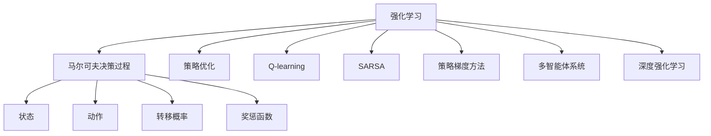

                 

# 一切皆是映射：强化学习在工业自动化中的应用：挑战与机遇

> 关键词：工业自动化, 强化学习, 策略优化, 动态决策, 机器视觉, 模拟仿真, 实时优化, 技术挑战, 工业应用

## 1. 背景介绍

随着工业4.0的到来，智能化、自动化和数字化成为制造业的重要发展方向。在这一过程中，强化学习（Reinforcement Learning, RL）以其在动态、复杂环境下的决策能力，逐步成为自动化系统优化、控制、管理的关键技术。工业自动化领域对强鲁棒性、高精度和高效率的要求，使得强化学习成为解决实际工程问题的重要工具。

### 1.1 问题由来

强化学习在工业自动化中的应用始于20世纪90年代。其最初的思想源自于行为心理学中的“强化”理论，即在特定行为发生后，根据行为结果赋予其正或负的“强化”。在工业生产环境中，机器学习系统可以通过不断的试错和学习，优化自身行为，最终达到系统优化、资源优化和效率提升的目的。

在过去的二十年中，强化学习已经在自动化领域诸多场景中得到应用，如机器人控制、自动驾驶、智能调度、质量控制等。但由于工业环境的复杂性和高风险性，强化学习的实际应用还面临许多挑战。

### 1.2 问题核心关键点

强化学习的核心在于构建一个环境与智能体（Agent）的交互框架。在工业自动化中，智能体可以是机器、设备或控制系统，环境则是实际的生产线和工作流程。通过智能体与环境的交互，不断优化决策策略，最大化系统性能。

强化学习的关键点包括：
- 如何构建一个合理的环境模型，使得智能体能够在其中学习到有价值的策略。
- 如何设计有效的奖惩机制，鼓励智能体执行高质量行为。
- 如何在高维空间中寻找最优决策，解决“维数灾难”问题。
- 如何在连续动作空间中进行决策，避免局部最优解的陷阱。
- 如何在数据稀缺的工业环境中训练稳定且泛化的模型。

## 2. 核心概念与联系

### 2.1 核心概念概述

为更好地理解强化学习在工业自动化中的应用，本节将介绍几个密切相关的核心概念：

- **强化学习（Reinforcement Learning, RL）**：一种通过试错学习实现优化决策的方法。智能体通过与环境交互，在每一步决策后得到正或负的反馈信号，从而调整决策策略，优化性能。

- **马尔可夫决策过程（Markov Decision Process, MDP）**：强化学习的基本框架，由状态、动作、转移概率和奖惩函数构成。

- **策略优化（Policy Optimization）**：强化学习中常用的方法，通过优化策略函数，使得智能体在每一步采取最优动作。

- **Q-learning和SARSA**：两种基本的强化学习算法，用于通过与环境的交互，逐步学习最优决策策略。

- **策略梯度方法**：利用梯度下降优化策略参数，直接更新决策策略，适用于连续动作空间。

- **多智能体系统（Multi-agent Systems）**：在工业自动化中，常常需要多个智能体协同工作，如自动化生产线上的机器人协同作业。多智能体系统扩展了强化学习的应用范围。

- **深度强化学习（Deep Reinforcement Learning）**：将深度学习与强化学习结合，用于处理高维、复杂数据，提高决策效率。

这些核心概念之间的逻辑关系可以通过以下Mermaid流程图来展示：



这个流程图展示了几大核心概念之间的逻辑关系：

1. 强化学习以马尔可夫决策过程为基础，通过策略优化和算法如Q-learning、SARSA等学习最优决策策略。
2. 策略梯度方法直接优化策略函数，适用于连续动作空间。
3. 多智能体系统拓展了强化学习的应用范围，应用于协同作业等场景。
4. 深度强化学习结合深度学习技术，处理高维数据。

### 2.2 概念间的关系

这些核心概念之间存在着紧密的联系，形成了强化学习在工业自动化中的完整应用框架。

- 强化学习作为工业自动化中的优化手段，通过策略优化和算法学习最优决策策略。
- 深度强化学习可以处理高维、非结构化数据，提升决策效率。
- 多智能体系统有助于实现协同作业和复杂任务的自动化。
- 策略梯度方法在实际应用中，常用于解决连续动作空间的决策问题。
- 马尔可夫决策过程是构建环境模型的基础，为智能体提供决策依据。
- 奖惩函数和转移概率是设计环境模型的关键，直接影响到智能体的学习效果。

## 3. 核心算法原理 & 具体操作步骤

### 3.1 算法原理概述

强化学习在工业自动化中的应用，核心在于构建一个动态的优化决策框架。假设工厂环境为状态集 $S$，机器设备为动作集 $A$，机器的执行效率为奖惩函数 $R$。机器设备通过与环境的交互，逐步学习最优策略，使得执行效率最大化。

形式化地，强化学习的目标是求解最优策略 $\pi^*$：

$$
\pi^* = \mathop{\arg\max}_{\pi} \sum_{s,a} \pi(a|s) \mathbb{E}[R(s,a)]
$$

其中 $\pi$ 表示策略函数，$\mathbb{E}[R(s,a)]$ 表示策略 $\pi$ 在状态 $s$ 下执行动作 $a$ 的平均回报。

### 3.2 算法步骤详解

强化学习在工业自动化中的应用通常包括以下几个关键步骤：

**Step 1: 环境建模**
- 构建环境的数学模型，确定状态空间 $S$ 和动作空间 $A$。
- 设计转移概率模型 $P(s'|s,a)$ 和奖惩函数 $R(s,a)$，以指导智能体的行为。
- 采用传感器、监控设备等，采集实际生产环境中的数据，用于验证和训练模型。

**Step 2: 策略设计**
- 选择合适的策略优化算法，如Q-learning、SARSA、策略梯度方法等。
- 设计合适的策略函数 $\pi$，可以是线性函数、神经网络或混合策略。

**Step 3: 训练与优化**
- 利用已有的数据或通过模拟环境，进行训练。
- 设定合适的学习率、探索率等参数，进行策略优化。
- 通过与环境的交互，逐步调整策略，优化执行效率。

**Step 4: 部署与应用**
- 将训练好的模型部署到实际生产环境中。
- 实时监测生产状态，根据环境变化动态调整策略。
- 定期进行模型优化和更新，确保长期稳定运行。

### 3.3 算法优缺点

强化学习在工业自动化中的应用，具有以下优点：
1. 动态适应：强化学习可以实时调整决策策略，适应生产环境的变化。
2. 自适应学习：通过与环境的交互，智能体可以逐步学习最优策略，提高执行效率。
3. 决策优化：强化学习能够基于奖惩机制，优化决策过程，提升资源利用率。
4. 应用广泛：强化学习可以应用于机器人控制、自动化生产线、智能调度等多个工业场景。

同时，强化学习也存在一些局限：
1. 数据需求高：强化学习需要大量的数据进行训练，在数据稀缺的工业环境中难以应用。
2. 复杂性高：工业环境的复杂性使得模型设计困难，难以处理高维、非线性的问题。
3. 安全风险：强化学习在工业环境中的应用，可能会产生安全隐患，需要额外的监控和保障措施。
4. 学习效率低：强化学习在复杂环境中的学习效率较低，可能陷入局部最优解。

### 3.4 算法应用领域

强化学习在工业自动化中的应用领域非常广泛，涵盖以下几大方向：

- **机器人控制与操作**：通过强化学习训练机器人，实现自主导航、抓取、搬运等操作。
- **智能调度与优化**：在制造业中，通过强化学习优化生产计划、资源分配等，提高生产效率和资源利用率。
- **质量控制与检测**：在生产过程中，利用强化学习优化质量检测策略，提升产品合格率。
- **维护与预测**：通过强化学习预测设备故障，优化维护策略，降低生产停机时间。
- **供应链管理**：利用强化学习优化供应链管理，实现物料的实时监控和调度。
- **能源管理**：通过强化学习优化能源分配，降低能耗，提高能源利用率。

此外，强化学习还在工业自动化中的自动化检测、智能检测、智能监控等方向有广泛应用。

## 4. 数学模型和公式 & 详细讲解  
### 4.1 数学模型构建

强化学习在工业自动化中的应用，可以通过数学模型来描述环境与智能体的交互过程。

假设环境为马尔可夫决策过程 $(S, A, P, R)$，其中 $S$ 为状态空间，$A$ 为动作空间，$P(s'|s,a)$ 为转移概率，$R(s,a)$ 为奖惩函数。定义策略函数 $\pi$，表示在状态 $s$ 下选择动作 $a$ 的概率：

$$
\pi(a|s) = \frac{e^{\log \pi(a|s)}}{\sum_{a'} e^{\log \pi(a'|s)}}
$$

在训练过程中，强化学习通过策略优化算法，最大化长期回报。常用的策略优化算法有Q-learning、SARSA和策略梯度方法。

### 4.2 公式推导过程

以Q-learning算法为例，其核心思想是通过状态-动作价值函数 $Q(s,a)$ 来近似最优策略 $\pi$。状态-动作价值函数 $Q(s,a)$ 表示在状态 $s$ 下选择动作 $a$ 的预期回报，推导过程如下：

假设智能体在状态 $s$ 下采取动作 $a$，得到下一个状态 $s'$，并根据转移概率 $P(s'|s,a)$ 和奖惩函数 $R(s,a)$ 计算回报 $G_{t+1} = \sum_{k=0}^{\infty} \gamma^k R(s_{t+k},a_{t+k})$，其中 $\gamma$ 为折扣因子，控制长期回报的权重。则Q-learning算法的更新公式为：

$$
Q(s_t,a_t) \leftarrow Q(s_t,a_t) + \alpha \left[R(s_t,a_t) + \gamma \max_{a'} Q(s_{t+1},a') - Q(s_t,a_t)\right]
$$

其中 $\alpha$ 为学习率。

### 4.3 案例分析与讲解

以制造业中的生产调度优化为例，考虑一个自动化生产系统，其状态空间 $S$ 为生产线上的机器、物料、设备等状态组合，动作空间 $A$ 为生产任务调度。在每个时间步，智能体（如生产调度系统）根据当前状态选择调度动作，更新状态并得到奖惩信号。通过不断的学习和调整，智能体可以优化调度策略，提高生产效率。

假设智能体在状态 $s_t = (机器状态, 物料状态, 设备状态)$ 下选择动作 $a_t = 调度任务$，得到下一个状态 $s_{t+1} = (机器状态', 物料状态', 设备状态')$，并得到奖惩信号 $R(s_t,a_t) = 生产效率提升值 - 调度成本$。

在Q-learning算法中，智能体通过不断更新状态-动作价值函数 $Q(s_t,a_t)$，逐步学习最优调度策略。具体实现过程如下：

1. 初始化状态-动作价值函数 $Q(s_t,a_t) = 0$。
2. 在每个时间步，智能体选择动作 $a_t$ 并得到新状态 $s_{t+1}$ 和奖惩信号 $R(s_t,a_t)$。
3. 根据Q-learning算法更新状态-动作价值函数：

$$
Q(s_t,a_t) \leftarrow Q(s_t,a_t) + \alpha \left[R(s_t,a_t) + \gamma \max_{a'} Q(s_{t+1},a') - Q(s_t,a_t)\right]
$$

4. 更新状态，重复步骤2和3，直到收敛或达到预设轮数。

## 5. 项目实践：代码实例和详细解释说明
### 5.1 开发环境搭建

在进行强化学习项目实践前，我们需要准备好开发环境。以下是使用Python进行OpenAI Gym开发的强化学习环境配置流程：

1. 安装Anaconda：从官网下载并安装Anaconda，用于创建独立的Python环境。

2. 创建并激活虚拟环境：
```bash
conda create -n reinforcement-env python=3.8 
conda activate reinforcement-env
```

3. 安装OpenAI Gym：
```bash
pip install gym
```

4. 安装其他必要工具包：
```bash
pip install numpy pandas scikit-learn matplotlib seaborn jupyter notebook ipython
```

完成上述步骤后，即可在`reinforcement-env`环境中开始强化学习实践。

### 5.2 源代码详细实现

下面我们以机器人路径规划为例，给出使用OpenAI Gym进行强化学习的PyTorch代码实现。

首先，定义机器人和环境的类：

```python
from gym import Env
import numpy as np

class RobotEnv(Env):
    def __init__(self):
        super(RobotEnv, self).__init__()
        self.state = np.zeros((4,))  # 机器人位置和方向
        self.action_space = np.arange(4)  # 左、右、上、下
        self.observation_space = np.arange(5)  # 机器人位置、速度、方向、障碍物、目标位置

    def reset(self):
        self.state = np.zeros((4,))
        return self._get_obs()

    def step(self, action):
        next_state = self._next_state(action)
        reward = self._reward(next_state)
        done = True if next_state[3] == 1 else False
        return next_state, reward, done, {}

    def _next_state(self, action):
        # 根据动作更新状态
        new_state = self.state.copy()
        if action == 0:  # 左
            new_state[1] -= 1
        elif action == 1:  # 右
            new_state[1] += 1
        elif action == 2:  # 上
            new_state[0] += 1
        elif action == 3:  # 下
            new_state[0] -= 1
        # 更新状态
        new_state[2] = (new_state[1] % 2) + 1  # 方向：0:左，1:右
        return new_state

    def _reward(self, state):
        # 根据状态更新奖励
        if state[3] == 1:  # 达到目标
            return 10
        else:
            return -0.1

    def _get_obs(self):
        # 返回观察值
        return np.concatenate((self.state, [0, 0, 0, 0, 1]))  # 目标位置为1
```

然后，定义强化学习算法的类：

```python
import torch
import torch.nn as nn
import torch.optim as optim
from torch.distributions import Categorical

class DQNAgent:
    def __init__(self, env):
        self.env = env
        self.model = nn.Sequential(
            nn.Linear(5, 32),
            nn.ReLU(),
            nn.Linear(32, 32),
            nn.ReLU(),
            nn.Linear(32, 4)
        )
        self.optimizer = optim.Adam(self.model.parameters(), lr=0.001)
        self.loss_fn = nn.MSELoss()
        self.policy = nn.Softmax(dim=-1)
        self.explore = 1.0

    def select_action(self, state):
        state = torch.from_numpy(state).float()
        logits = self.model(state)
        m = Categorical(logits)
        action = m.sample().item()
        if np.random.rand() < self.explore:
            action = np.random.randint(0, 4)
        return action

    def update(self, state, next_state, reward, done):
        state = torch.from_numpy(state).float()
        next_state = torch.from_numpy(next_state).float()
        reward = torch.tensor([reward], dtype=torch.float)
        if done:
            target = reward
        else:
            target = reward + self.model(next_state).logits.max(dim=1)[0]
        output = self.model(state)
        loss = self.loss_fn(target, output)
        self.optimizer.zero_grad()
        loss.backward()
        self.optimizer.step()
        if not done and self.explore > 0.01:
            self.explore -= 0.01
```

最后，定义训练和评估函数：

```python
def train(env, agent, episodes=10000):
    for episode in range(episodes):
        state = env.reset()
        total_reward = 0
        while True:
            action = agent.select_action(state)
            next_state, reward, done, info = env.step(action)
            agent.update(state, next_state, reward, done)
            state = next_state
            total_reward += reward
            if done:
                break
        print("Episode {}: reward={}".format(episode+1, total_reward))

def evaluate(env, agent):
    state = env.reset()
    total_reward = 0
    for episode in range(100):
        for step in range(100):
            action = agent.select_action(state)
            state, reward, done, info = env.step(action)
            total_reward += reward
            if done:
                break
        print("Episode {}: reward={}".format(episode+1, total_reward))
```

现在，我们可以开始训练和评估：

```python
env = RobotEnv()
agent = DQNAgent(env)

# 训练模型
train(env, agent, episodes=10000)

# 评估模型
evaluate(env, agent)
```

以上就是使用PyTorch和OpenAI Gym进行强化学习路径规划的完整代码实现。可以看到，通过简单的代码设计，我们就能实现一个基础的强化学习算法，用于机器人路径规划。

### 5.3 代码解读与分析

让我们再详细解读一下关键代码的实现细节：

**RobotEnv类**：
- `__init__`方法：初始化环境和状态空间。
- `reset`方法：重置环境，返回初始状态。
- `step`方法：执行一个时间步，返回下一个状态、奖励、是否结束和额外信息。
- `_next_state`方法：根据动作更新状态。
- `_reward`方法：根据状态计算奖励。
- `_get_obs`方法：返回观察值。

**DQNAgent类**：
- `__init__`方法：初始化模型、优化器、损失函数和策略函数。
- `select_action`方法：根据当前状态和策略函数选择动作。
- `update`方法：根据状态、下一步状态、奖励和是否结束更新模型参数。

**训练和评估函数**：
- `train`函数：重复执行时间步，更新模型参数。
- `evaluate`函数：评估模型性能，输出每个时间步的奖励。

可以看到，强化学习的代码实现相对简单，主要集中在环境建模和算法实现上。在实际应用中，我们还需要考虑更多的工程细节，如模型压缩、超参数调优、数据增强等。

## 6. 实际应用场景
### 6.1 工业机器人操作

强化学习在工业自动化中最常见的应用之一就是机器人操作。传统的机器人控制系统依赖于预设的控制规则，难以应对复杂的生产环境变化。而强化学习可以通过实时调整控制策略，提高机器人的灵活性和适应性。

以自动化生产线上的协作机器人为例，其任务包括搬运、装配、焊接等。通过强化学习训练机器人，可以使其在复杂的生产环境中自主完成任务，提升生产效率。

### 6.2 生产调度与优化

生产调度是工业自动化中的重要环节，直接影响到生产效率和资源利用率。强化学习可以在高维、动态的生产环境中，实时优化调度策略，提升资源利用率和生产效率。

在制造业中，强化学习可以用于生产计划、物料调度、设备维护等环节。通过实时监测生产状态，动态调整调度策略，实现资源优化和效率提升。

### 6.3 智能检测与质量控制

在生产过程中，质量控制是至关重要的环节。传统的质量控制依赖于人工检测和标准检测流程，效率较低。而强化学习可以通过实时学习最优检测策略，提升检测效率和准确性。

在质量控制中，强化学习可以用于检测参数优化、检测任务调度等环节。通过实时监测生产状态，动态调整检测策略，提高产品合格率。

### 6.4 未来应用展望

随着强化学习技术的不断发展，其在工业自动化中的应用前景将更加广阔。未来，我们可以期待以下几个方面的突破：

- **多智能体系统**：在复杂的多智能体系统中，通过强化学习实现协同作业，提升系统整体性能。如在制造业中，多个机器人协同完成复杂任务。
- **强化学习与深度学习的结合**：通过深度强化学习，处理高维、非结构化数据，提高决策效率。如在智能检测中，利用深度神经网络提取特征，再通过强化学习优化检测策略。
- **实时优化与决策**：强化学习可以实时调整决策策略，应对生产环境的变化。如在生产调度中，根据实时数据动态调整调度策略。
- **跨领域应用**：强化学习可以应用于多个领域，如制造业、医疗、交通等。通过在不同领域的交叉应用，拓展技术应用范围。
- **自动化检测与预测**：通过强化学习训练检测系统，实现自主检测和故障预测。如在制造业中，利用强化学习训练检测系统，实现质量控制和设备预测性维护。

## 7. 工具和资源推荐
### 7.1 学习资源推荐

为了帮助开发者系统掌握强化学习在工业自动化中的应用，这里推荐一些优质的学习资源：

1. 《Reinforcement Learning: An Introduction》书籍：由Richard S. Sutton和Andrew G. Barto所著，全面介绍了强化学习的理论基础和实际应用。

2. CS294: Reinforcement Learning by Sebastian Thrun和Pete Lazka：斯坦福大学开设的强化学习课程，提供了丰富的讲义和课程视频，适合入门和进阶学习。

3. DeepMind研究论文：DeepMind是强化学习领域的重要研究机构，其发布的研究论文涵盖了从理论到实践的多个方面，值得深入学习。

4. OpenAI Gym官方文档：OpenAI Gym是一个开源的强化学习环境，提供了丰富的环境和算法样例，是学习和实践强化学习的重要资源。

5. Udacity强化学习纳米学位：Udacity提供了强化学习的在线课程，适合初学者系统学习强化学习理论和技术。

6. Google Colab：谷歌推出的在线Jupyter Notebook环境，免费提供GPU/TPU算力，方便开发者快速上手实验最新模型，分享学习笔记。

通过对这些资源的学习实践，相信你一定能够快速掌握强化学习在工业自动化中的精髓，并用于解决实际的工程问题。

### 7.2 开发工具推荐

高效的开发离不开优秀的工具支持。以下是几款用于强化学习开发的常用工具：

1. OpenAI Gym：提供丰富的环境和算法样例，是学习和实践强化学习的重要工具。

2. TensorFlow和PyTorch：作为主流的深度学习框架，支持强化学习的各种算法和优化器。

3. Scikit-learn：用于数据预处理和特征提取，适合强化学习的前处理步骤。

4. Seaborn和Matplotlib：用于数据可视化和结果展示，帮助开发者快速理解模型性能。

5. Weights & Biases：实验跟踪工具，可以记录和可视化模型训练过程中的各项指标，方便对比和调优。

6. Google Colab：提供GPU/TPU算力，方便开发者快速上手实验最新模型，分享学习笔记。

合理利用这些工具，可以显著提升强化学习项目开发效率，加快创新迭代的步伐。

### 7.3 相关论文推荐

强化学习在工业自动化中的应用，得益于学界和业界的持续研究。以下是几篇奠基性的相关论文，推荐阅读：

1. Q-learning：David Sutton和Richard S. Barto在1988年提出的强化学习算法，是强化学习的基础。

2. DeepMind的AlphaGo论文：DeepMind利用深度强化学习训练AlphaGo，在围棋中取得突破性进展，展示了强化学习在复杂游戏中的应用潜力。

3. OpenAI的OpenAI Gym论文：OpenAI Gym提供了丰富的环境和算法样例，是学习和实践强化学习的重要资源。

4. 多智能体强化学习（Multi-agent Reinforcement Learning）：利用多智能体系统，实现协同作业和复杂任务的自动化。

5. 强化学习与深度学习的结合：通过深度强化学习，处理高维、非结构化数据，提高决策效率。

6. 强化学习在工业自动化中的应用：展示了强化学习在制造业、医疗、交通等领域的广泛应用，为实际工程问题的解决提供了新思路。

除上述资源外，还有一些值得关注的前沿资源，帮助开发者紧跟强化学习在工业自动化中的最新进展，例如：

1. arXiv论文预印本：人工智能领域最新研究成果的发布平台，包括大量尚未发表的前沿工作，学习前沿技术的必读资源。

2. 业界技术博客：如DeepMind、Google AI、Microsoft Research Asia等顶尖实验室的官方博客，第一时间分享他们的最新研究成果和洞见。

3. 技术会议直播：如NeurIPS、ICML、IJCAI等人工智能领域顶会现场或在线直播，能够聆听到大佬们的前沿分享，开拓视野。

4. GitHub热门项目：在GitHub上Star

