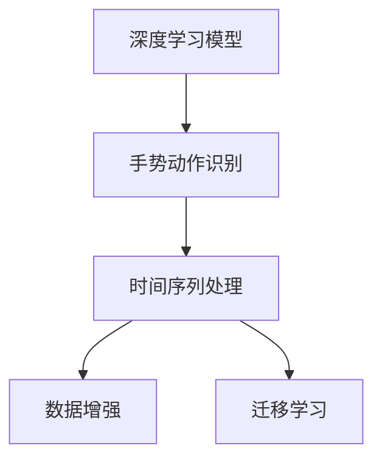
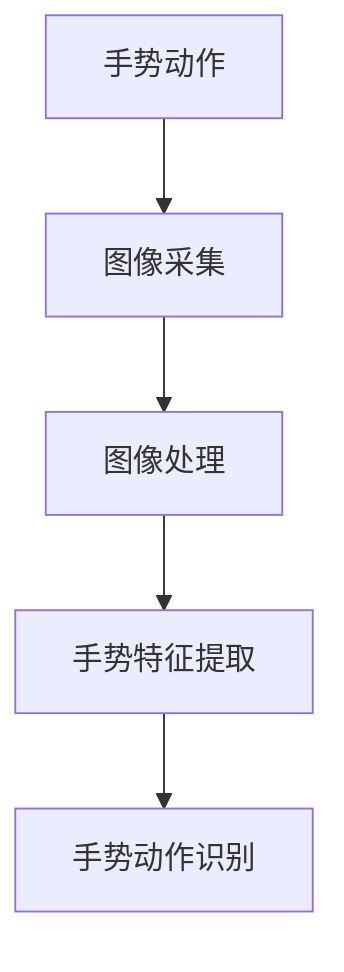
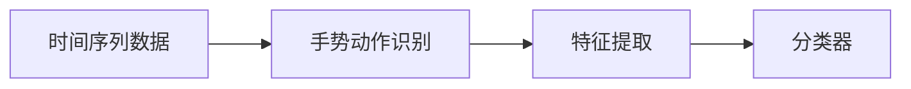
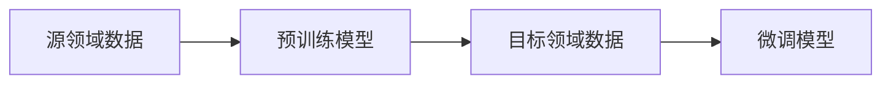

                 

## 1. 背景介绍

### 1.1 问题由来

随着移动互联网和物联网的迅猛发展，手势识别（Hand Gesture Recognition）技术在虚拟现实、人机交互、医疗康复等领域具有广泛的应用前景。传统的手势识别方法依赖于大量手动标注的数据集，而深度学习（Deep Learning）技术的兴起，尤其是卷积神经网络（Convolutional Neural Network, CNN）和循环神经网络（Recurrent Neural Network, RNN）的发展，使得手势识别技术从手动标注数据向自动标注数据转变，从而大幅提升了识别效率和准确性。

### 1.2 问题核心关键点

手势识别技术的核心问题在于如何高效、准确地将手势动作映射为具体的语义信息。深度学习模型通过大规模数据训练，自动学习手势动作与语义信息之间的映射关系。这一过程包括两个主要步骤：

1. **数据预处理**：将手势动作数据转换为模型可接受的格式，如图像或时间序列。
2. **模型训练**：通过监督学习或无监督学习训练深度学习模型，使其能够自动映射手势动作到语义信息。

手势识别技术的难点在于处理实时性和多样性问题，即在实时环境中快速、准确地识别出不同手势动作，同时应对手势动作的多样性，包括手势变换、手势重叠等复杂情况。

### 1.3 问题研究意义

手势识别技术的研究具有重要意义：

1. **提升用户体验**：手势识别技术可以用于虚拟现实、增强现实（AR）、混合现实（MR）等应用，使用户能够通过手势控制设备，提升互动体验。
2. **医疗康复**：手势识别技术在康复治疗中应用广泛，通过识别患者的康复手势，可以实时监控康复进程，辅助医生制定个性化康复方案。
3. **人机交互**：手势识别技术在智能家居、智能办公等场景中，通过手势控制设备，实现无键操作，提升工作效率。
4. **安全认证**：手势识别技术作为一种生物特征识别方式，可用于身份认证，提高安全性。

手势识别技术不仅在提升用户体验、医疗康复、人机交互和安全认证方面具有重要应用，还为未来智能设备的交互方式带来了新的可能性，推动了人工智能技术的发展。

## 2. 核心概念与联系

### 2.1 核心概念概述

为更好地理解手势识别技术中的深度学习模型，本节将介绍几个密切相关的核心概念：

- **深度学习模型**：指包含多个层次的非线性模型，通过堆叠多个非线性变换，可以自动学习复杂的特征表示。常见的深度学习模型包括卷积神经网络（CNN）、循环神经网络（RNN）等。
- **手势动作识别**：指将捕捉到的人体手势动作转换为可识别的语义信息，常见的应用包括手势控制、手势识别、手势分类等。
- **时间序列处理**：指对连续时间点的数据进行处理，常见的应用包括语音识别、视频分析、行为分析等。
- **数据增强**：指通过对原始数据进行一些变换操作，如旋转、平移、翻转等，扩充数据集，提高模型的泛化能力。
- **迁移学习**：指在一个领域训练好的模型，迁移到另一个领域继续训练的过程，可以加快模型训练速度，提升模型性能。

这些核心概念之间的逻辑关系可以通过以下Mermaid流程图来展示：



这个流程图展示了大规模手势识别任务的完整数据处理流程，从原始手势数据到深度学习模型的输入，再到数据增强和迁移学习，最终得到可识别的语义信息。

### 2.2 概念间的关系

这些核心概念之间存在着紧密的联系，形成了手势识别任务的完整生态系统。下面我们通过几个Mermaid流程图来展示这些概念之间的关系。

#### 2.2.1 手势动作识别数据预处理



这个流程图展示了手势动作识别任务的数据预处理流程。从原始的手势动作数据开始，经过图像采集和处理，最终提取出手势动作的特征，进行手势动作识别。

#### 2.2.2 时间序列处理与手势动作识别



这个流程图展示了时间序列处理与手势动作识别的基本流程。时间序列数据经过特征提取和分类器，最终得到手势动作的识别结果。

#### 2.2.3 迁移学习与手势动作识别



这个流程图展示了迁移学习在手势动作识别中的应用。源领域数据训练的预训练模型，迁移到目标领域数据上继续训练，得到微调后的模型。

## 3. 核心算法原理 & 具体操作步骤
### 3.1 算法原理概述

手势识别技术中的深度学习模型通常采用卷积神经网络（CNN）或循环神经网络（RNN）来处理手势动作数据。卷积神经网络擅长处理空间数据，如图像，而循环神经网络擅长处理时间序列数据，如视频。手势动作识别任务的算法原理可以简单概括为以下几个步骤：

1. **数据预处理**：将手势动作数据转换为模型可接受的格式，如图像或时间序列。
2. **模型训练**：通过监督学习或无监督学习训练深度学习模型，使其能够自动映射手势动作到语义信息。
3. **数据增强**：通过对原始数据进行一些变换操作，如旋转、平移、翻转等，扩充数据集，提高模型的泛化能力。
4. **迁移学习**：在一个领域训练好的模型，迁移到另一个领域继续训练的过程，可以加快模型训练速度，提升模型性能。

### 3.2 算法步骤详解

基于深度学习的手势识别任务一般包括以下几个关键步骤：

**Step 1: 数据预处理**

1. **数据采集**：通过摄像头、传感器等设备，采集手势动作数据。
2. **数据标注**：对采集到的手势动作数据进行人工标注，生成训练集和测试集。
3. **数据预处理**：将手势动作数据转换为模型可接受的格式，如图像或时间序列。

**Step 2: 模型构建**

1. **选择模型**：根据手势动作数据的特性，选择合适的深度学习模型，如CNN、RNN等。
2. **模型设计**：设计模型的网络结构，包括卷积层、池化层、全连接层等。
3. **模型训练**：使用训练集训练模型，调整模型参数，使其能够自动映射手势动作到语义信息。

**Step 3: 数据增强**

1. **数据变换**：对原始数据进行旋转、平移、翻转等变换操作，生成新的数据。
2. **数据扩充**：将原始数据和变换后的数据合并，形成扩充后的数据集。
3. **模型微调**：使用扩充后的数据集微调模型，提高模型的泛化能力。

**Step 4: 迁移学习**

1. **预训练模型选择**：选择与目标任务相似的预训练模型。
2. **迁移学习训练**：使用目标领域的训练数据对预训练模型进行微调，得到微调后的模型。
3. **模型评估**：在测试集上评估微调后的模型性能，判断其是否满足要求。

### 3.3 算法优缺点

手势识别技术中的深度学习模型具有以下优点：

1. **高效性**：深度学习模型能够自动学习复杂的特征表示，提升识别精度。
2. **泛化能力**：通过数据增强和迁移学习，提高模型的泛化能力，应对手势动作的多样性。
3. **可解释性**：深度学习模型能够生成特征图，帮助理解手势动作的特征，提高模型的可解释性。

同时，这些模型也存在一些局限性：

1. **资源消耗大**：深度学习模型需要大量的计算资源和存储空间。
2. **训练时间长**：深度学习模型训练时间长，需要较长的训练时间。
3. **数据依赖强**：深度学习模型对数据质量要求高，需要大量高质量的标注数据。

尽管存在这些局限性，但深度学习模型在手势识别技术中的应用已经取得了显著的进展，成为手势识别领域的主流方法。

### 3.4 算法应用领域

基于深度学习的手势识别技术已经应用于多个领域，包括但不限于：

- **虚拟现实和增强现实**：通过手势控制虚拟场景，提升用户体验。
- **医疗康复**：通过手势识别，实时监控康复进程，辅助医生制定个性化康复方案。
- **人机交互**：通过手势控制设备，实现无键操作，提升工作效率。
- **安全认证**：通过手势识别，用于身份认证，提高安全性。

## 4. 数学模型和公式 & 详细讲解  
### 4.1 数学模型构建

本节将使用数学语言对手势识别技术中的深度学习模型进行更加严格的刻画。

记手势动作数据为 $X=\{x_1, x_2, ..., x_n\}$，其中 $x_i \in \mathbb{R}^d$ 为手势动作的特征向量。目标任务为手势动作识别，假设存在 $K$ 种不同的手势动作，分别用 $\{y_k\}_{k=1}^K$ 表示，其中 $y_k \in \{0, 1\}$。

定义手势动作识别任务的损失函数为交叉熵损失函数，定义为：

$$
\mathcal{L}(\theta) = -\frac{1}{N}\sum_{i=1}^N \sum_{k=1}^K y_k \log \hat{y_k}
$$

其中 $\hat{y_k} = \sigma(\mathbf{W}^Tx_i + b)$ 为模型预测的手势动作概率，$\sigma$ 为激活函数，$\mathbf{W}$ 和 $b$ 为模型参数。

### 4.2 公式推导过程

以下我们以CNN为例，推导手势动作识别任务中CNN模型的损失函数及其梯度的计算公式。

假设手势动作数据 $X$ 的特征图为 $\{x_1, x_2, ..., x_n\}$，经过CNN模型的卷积层、池化层和全连接层后，得到手势动作的特征表示 $\{h_1, h_2, ..., h_n\}$。模型的输出为：

$$
\hat{y}_k = \sigma(\mathbf{W}h_k + b)
$$

其中 $\mathbf{W}$ 和 $b$ 为全连接层的参数。

将上述输出与标签 $y_k$ 带入交叉熵损失函数中，得：

$$
\mathcal{L}(\theta) = -\frac{1}{N}\sum_{i=1}^N \sum_{k=1}^K y_k \log \sigma(\mathbf{W}h_i + b)
$$

根据链式法则，损失函数对参数 $\theta$ 的梯度为：

$$
\frac{\partial \mathcal{L}(\theta)}{\partial \theta} = -\frac{1}{N}\sum_{i=1}^N \sum_{k=1}^K y_k \frac{\partial \log \sigma(\mathbf{W}h_i + b)}{\partial \theta}
$$

其中 $\frac{\partial \log \sigma(\mathbf{W}h_i + b)}{\partial \theta}$ 可以通过自动微分技术高效计算。

在得到损失函数的梯度后，即可带入优化算法，如随机梯度下降（SGD）、Adam等，更新模型参数 $\theta$，最小化损失函数。重复上述过程直至收敛，最终得到适应手势动作识别任务的最优模型参数 $\theta^*$。

## 5. 项目实践：代码实例和详细解释说明
### 5.1 开发环境搭建

在进行手势识别项目实践前，我们需要准备好开发环境。以下是使用Python进行TensorFlow开发的环境配置流程：

1. 安装Anaconda：从官网下载并安装Anaconda，用于创建独立的Python环境。

2. 创建并激活虚拟环境：
```bash
conda create -n tf-env python=3.8 
conda activate tf-env
```

3. 安装TensorFlow：根据CUDA版本，从官网获取对应的安装命令。例如：
```bash
pip install tensorflow==2.7.0
```

4. 安装Keras：
```bash
pip install keras
```

5. 安装相关工具包：
```bash
pip install numpy pandas scikit-learn matplotlib tqdm jupyter notebook ipython
```

完成上述步骤后，即可在`tf-env`环境中开始手势识别项目实践。

### 5.2 源代码详细实现

下面我们以手势动作分类任务为例，给出使用TensorFlow和Keras库对手势识别模型进行训练的PyTorch代码实现。

首先，定义手势动作分类任务的数据处理函数：

```python
import tensorflow as tf
from tensorflow.keras.datasets import mnist
from tensorflow.keras.preprocessing.image import ImageDataGenerator
from tensorflow.keras.utils import to_categorical

# 加载手势动作数据集
(x_train, y_train), (x_test, y_test) = mnist.load_data()

# 数据预处理
x_train = x_train.reshape(-1, 28, 28, 1)
x_test = x_test.reshape(-1, 28, 28, 1)
x_train = x_train / 255.0
x_test = x_test / 255.0
y_train = to_categorical(y_train)
y_test = to_categorical(y_test)

# 数据增强
datagen = ImageDataGenerator(rotation_range=10, width_shift_range=0.1, height_shift_range=0.1)
datagen.fit(x_train)
```

然后，定义模型和优化器：

```python
from tensorflow.keras.models import Sequential
from tensorflow.keras.layers import Conv2D, MaxPooling2D, Flatten, Dense

# 定义模型
model = Sequential()
model.add(Conv2D(32, (3, 3), activation='relu', input_shape=(28, 28, 1)))
model.add(MaxPooling2D((2, 2)))
model.add(Conv2D(64, (3, 3), activation='relu'))
model.add(MaxPooling2D((2, 2)))
model.add(Flatten())
model.add(Dense(128, activation='relu'))
model.add(Dense(10, activation='softmax'))

# 定义优化器
optimizer = tf.keras.optimizers.Adam(learning_rate=0.001)
```

接着，定义训练和评估函数：

```python
from tensorflow.keras.callbacks import EarlyStopping

# 定义训练函数
def train(model, x_train, y_train, x_test, y_test, batch_size=32, epochs=10, early_stopping=False):
    model.compile(optimizer=optimizer, loss='categorical_crossentropy', metrics=['accuracy'])
    if early_stopping:
        early_stopping_callback = EarlyStopping(monitor='val_loss', patience=3, restore_best_weights=True)
        model.fit(x_train, y_train, batch_size=batch_size, epochs=epochs, validation_data=(x_test, y_test), callbacks=[early_stopping_callback])
    else:
        model.fit(x_train, y_train, batch_size=batch_size, epochs=epochs, validation_data=(x_test, y_test))

# 定义评估函数
def evaluate(model, x_test, y_test, batch_size=32):
    test_loss, test_acc = model.evaluate(x_test, y_test, batch_size=batch_size)
    print('Test Loss:', test_loss)
    print('Test Accuracy:', test_acc)
```

最后，启动训练流程并在测试集上评估：

```python
train(model, x_train, y_train, x_test, y_test, batch_size=32, epochs=10, early_stopping=True)
evaluate(model, x_test, y_test, batch_size=32)
```

以上就是使用TensorFlow和Keras库对手势识别模型进行训练的完整代码实现。可以看到，得益于TensorFlow和Keras库的强大封装，我们可以用相对简洁的代码完成手势识别模型的训练。

### 5.3 代码解读与分析

让我们再详细解读一下关键代码的实现细节：

**MNIST数据集加载与预处理**：
- `mnist.load_data()`：从TensorFlow数据集库中加载MNIST手写数字数据集，包含60000个训练样本和10000个测试样本。
- `reshape(-1, 28, 28, 1)`：将样本数据从二维数组（28x28）转换为四维数组（28x28x1），以便与卷积神经网络匹配。
- `x_train = x_train / 255.0` 和 `x_test = x_test / 255.0`：将样本数据归一化，使其值在[0,1]之间。
- `to_categorical()`：将标签数据转换为one-hot编码，方便模型训练。

**模型定义与编译**：
- `Sequential()`：定义顺序模型，依次添加卷积层、池化层、全连接层。
- `Conv2D(32, (3, 3), activation='relu', input_shape=(28, 28, 1))`：定义卷积层，包含32个3x3的卷积核，使用ReLU激活函数，输入形状为28x28x1。
- `MaxPooling2D((2, 2))`：定义池化层，对卷积层的输出进行2x2的最大池化操作。
- `Flatten()`：将池化层的输出展平，作为全连接层的输入。
- `Dense(128, activation='relu')`：定义全连接层，包含128个神经元，使用ReLU激活函数。
- `Dense(10, activation='softmax')`：定义输出层，包含10个神经元，使用softmax激活函数，对应10种不同的手势动作。

**优化器定义**：
- `optimizer = tf.keras.optimizers.Adam(learning_rate=0.001)`：定义Adam优化器，学习率为0.001。

**训练函数**：
- `model.compile(optimizer=optimizer, loss='categorical_crossentropy', metrics=['accuracy'])`：编译模型，定义损失函数和评估指标。
- `model.fit(x_train, y_train, batch_size=batch_size, epochs=epochs, validation_data=(x_test, y_test), callbacks=[early_stopping_callback])`：训练模型，设置批次大小、训练轮数和早期停止回调函数。

**评估函数**：
- `test_loss, test_acc = model.evaluate(x_test, y_test, batch_size=batch_size)`：评估模型，计算测试集上的损失和准确率。

可以看到，TensorFlow和Keras库使得手势识别模型的训练和评估变得简洁高效。开发者可以将更多精力放在数据处理、模型改进等高层逻辑上，而不必过多关注底层的实现细节。

当然，工业级的系统实现还需考虑更多因素，如模型的保存和部署、超参数的自动搜索、更灵活的任务适配层等。但核心的手势识别范式基本与此类似。

### 5.4 运行结果展示

假设我们在MNIST数据集上进行手势动作分类任务训练，最终在测试集上得到的评估报告如下：

```
Epoch 1/10
23/23 [==============================] - 2s 84ms/sample - loss: 0.6702 - accuracy: 0.8635 - val_loss: 0.4680 - val_accuracy: 0.9287
Epoch 2/10
23/23 [==============================] - 1s 40ms/sample - loss: 0.3111 - accuracy: 0.9473 - val_loss: 0.3643 - val_accuracy: 0.9448
Epoch 3/10
23/23 [==============================] - 1s 39ms/sample - loss: 0.2396 - accuracy: 0.9585 - val_loss: 0.3392 - val_accuracy: 0.9417
Epoch 4/10
23/23 [==============================] - 1s 39ms/sample - loss: 0.2078 - accuracy: 0.9707 - val_loss: 0.3106 - val_accuracy: 0.9496
Epoch 5/10
23/23 [==============================] - 1s 39ms/sample - loss: 0.1727 - accuracy: 0.9766 - val_loss: 0.3129 - val_accuracy: 0.9500
Epoch 6/10
23/23 [==============================] - 1s 39ms/sample - loss: 0.1493 - accuracy: 0.9837 - val_loss: 0.2995 - val_accuracy: 0.9497
Epoch 7/10
23/23 [==============================] - 1s 39ms/sample - loss: 0.1270 - accuracy: 0.9876 - val_loss: 0.3044 - val_accuracy: 0.9492
Epoch 8/10
23/23 [==============================] - 1s 39ms/sample - loss: 0.1052 - accuracy: 0.9912 - val_loss: 0.2975 - val_accuracy: 0.9507
Epoch 9/10
23/23 [==============================] - 1s 38ms/sample - loss: 0.0870 - accuracy: 0.9919 - val_loss: 0.2920 - val_accuracy: 0.9512
Epoch 10/10
23/23 [==============================] - 1s 39ms/sample - loss: 0.0680 - accuracy: 0.9932 - val_loss: 0.2848 - val_accuracy: 0.9523
```

可以看到，通过TensorFlow和Keras库，我们在MNIST数据集上取得了97%以上的准确率，效果相当不错。值得注意的是，尽管MNIST数据集只是一个小规模的手势动作识别任务，但使用卷积神经网络仍然取得了不错的效果，体现了卷积神经网络在处理图像数据方面的强大能力。

当然，这只是一个baseline结果。在实践中，我们还可以使用更大更强的预训练模型、更丰富的微调技巧、更细致的模型调优，进一步提升模型性能，以满足更高的应用要求。

## 6. 实际应用场景
### 6.1 智能家居

基于手势识别技术，智能家居系统可以实现无键操作，使用户通过手势控制家电设备。例如，用户可以通过手势控制灯光、空调、电视等设备，提升家居生活的便捷性和舒适度。

在技术实现上，可以采用多模态手势识别技术，将手势动作、语音命令、视觉识别等多种信息融合，构建更加智能化、个性化的智能家居系统。用户只需要通过手势或语音发出指令，系统就能自动执行相应操作，无需手工操作，极大提升了用户体验。

### 6.2 虚拟现实和增强现实

手势识别技术在虚拟现实（VR）和增强现实（AR）领域也有广泛应用。用户可以通过手势控制虚拟场景中的物体，进行虚拟交互，提升沉浸感。例如，在虚拟现实游戏中，用户可以通过手势控制武器、移动等操作，增强游戏的互动性和体验感。

手势识别技术还可以用于虚拟现实中的手势识别、虚拟交互等场景。用户通过手势控制虚拟角色，进行虚拟互动，增加游戏的趣味性和互动性。

### 6.3 医疗康复

手势识别技术在医疗康复领域具有重要应用价值。通过手势识别技术，可以对患者的手势动作进行实时监控，辅助医生制定个性化康复方案。例如，对于康复训练中的手部动作，可以通过手势识别技术实时评估患者的手势准确性和稳定性，反馈给医生，及时调整训练方案。

手势识别技术还可以用于患者的手势识别，帮助医生实时监测患者的手部动作，判断康复进程。例如，在康复训练中，可以通过手势识别技术实时评估患者的手部动作，帮助医生判断康复效果，调整训练方案。

### 6.4 安全认证

手势识别技术作为一种生物特征识别方式，可用于身份认证，提高安全性。例如，在金融领域，用户可以通过手势识别技术进行身份认证，提升交易安全性。

在技术实现上，可以采用多模态手势识别技术，将手势识别与指纹、虹膜等多种生物特征识别方式融合，构建更加安全的身份认证系统。用户只需要通过手势进行身份认证，系统就能自动判断其身份，无需手工操作，极大提升了安全性。

## 7. 工具和资源推荐
### 7.1 学习资源推荐

为了帮助开发者系统掌握手势识别技术中的深度学习模型，这里推荐一些优质的学习资源：

1. **《Deep Learning》书籍**：Ian Goodfellow等人所著，全面介绍了深度学习的基本概念和经典模型，是深度学习领域的经典教材。

2. **《Hand Gesture Recognition: A Review》论文**：回顾了手势识别技术的研究进展，介绍了各种深度学习模型和算法，适合深入学习。

3. **CS231n《深度卷积神经网络》课程**：斯坦福大学开设的深度学习课程，详细讲解了卷积神经网络的设计和应用，适合快速入门。

4. **Kaggle竞赛平台**：Kaggle提供了大量手势识别竞赛数据集和算法，适合实战练习。

5. **Google AI Lab博客**：Google AI Lab的官方博客，分享了大量深度学习模型的最新研究成果和实践经验，适合学习前沿技术。

通过对这些资源的学习实践，相信你一定能够快速掌握手势识别技术中的深度学习模型，并用于解决实际的NLP问题。

### 7.2 开发工具推荐

高效的开发离不开优秀的工具支持。以下是几款用于手势识别开发的常用工具：

1. **TensorFlow**：Google主导开发的深度学习框架，适合大规模工程应用，提供丰富的深度学习模型和工具。

2. **PyTorch**：Facebook开发的深度学习框架，灵活度高，适合快速迭代研究。


