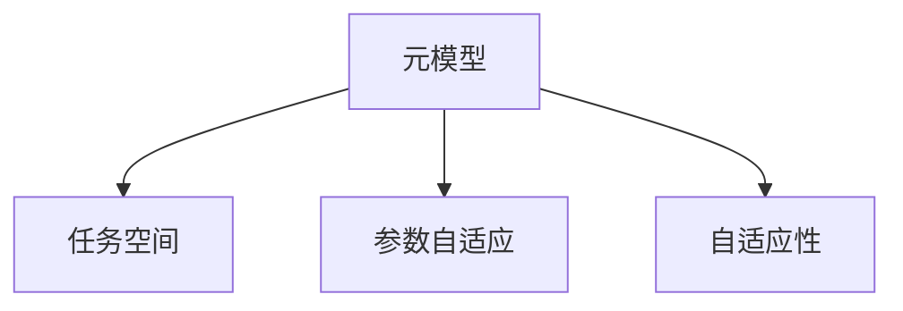
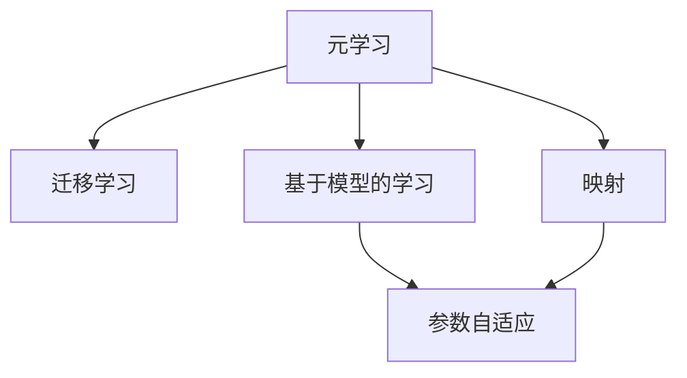
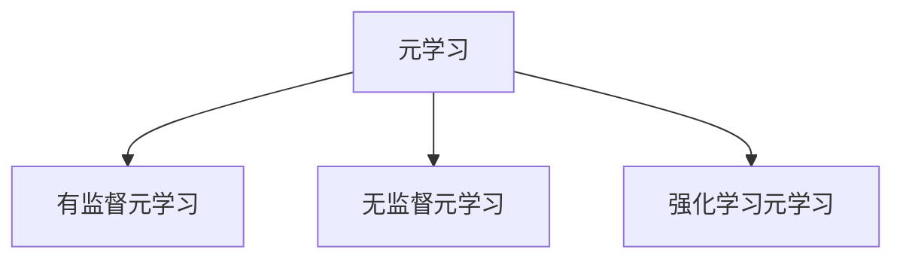
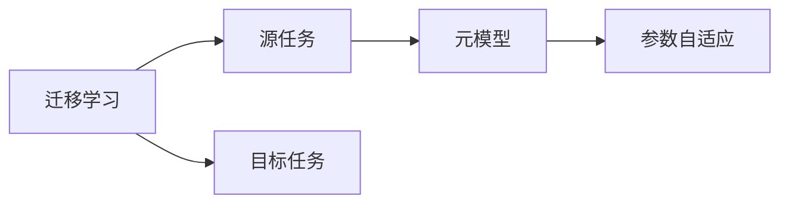
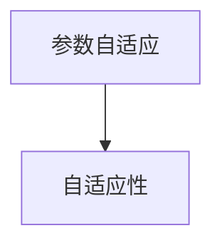
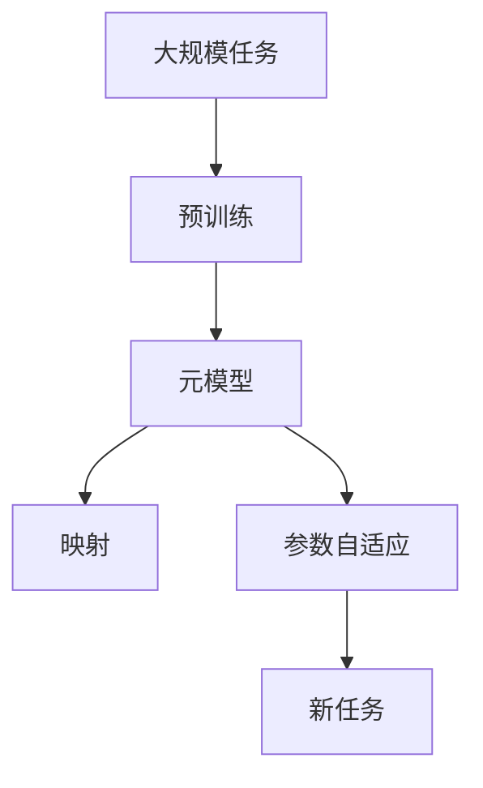

                 

# 一切皆是映射：探索基于模型的元学习方法

> 关键词：元学习, 基于模型的学习, 映射, 自适应, 元学习算法

## 1. 背景介绍

### 1.1 问题由来
在过去几十年中，机器学习（Machine Learning, ML）和深度学习（Deep Learning, DL）取得了显著的进步，推动了诸多应用领域的发展，例如计算机视觉、自然语言处理、语音识别等。然而，传统的ML和DL方法往往依赖于大量的标注数据，训练过程复杂，难以迁移新领域。元学习（Meta-Learning）作为一种新的学习范式，旨在解决这一问题，通过学习已有知识的泛化能力，快速适应新任务。

元学习最典型的应用场景是迁移学习（Transfer Learning），即在大规模预训练任务上获取的知识，能够被应用到其他相关任务中。这种学习方式可以在有限的数据集上取得优异的效果，适用于诸多领域。例如，自然语言处理中的BERT模型，通过在语言模型上预训练，能够实现零样本分类、对话生成等任务，展现了强大的泛化能力。

然而，传统的元学习方法通常依赖于手动设置超参数，难以适应多样化的任务需求。此外，在多任务学习和终身学习等复杂场景下，元学习的性能提升有限。基于模型的元学习方法（Model-Based Meta-Learning）提供了新的解决方案，通过训练元模型来自动地学习适应不同任务的参数，进一步提升了元学习的灵活性和可扩展性。

### 1.2 问题核心关键点
基于模型的元学习方法，通过构建一个参数化的元模型，自动学习适应新任务的参数，从而实现了更高效、更灵活的元学习。其核心思想在于将当前任务映射到已有任务空间，并学习该空间内的适应性参数，从而在新的任务上取得更优的性能。

核心概念包括：
- 元模型（Meta-Model）：用于自动学习适应新任务参数的模型。
- 任务空间（Task Space）：用于映射当前任务的特征空间。
- 参数自适应（Parameter Adaptation）：元模型自动学习新任务的参数，使其能够在新任务上取得理想性能。
- 自适应性（Adaptability）：元模型能够适应新任务的数据分布和任务要求。

这些核心概念之间的逻辑关系可以通过以下Mermaid流程图来展示：



这个流程图展示了大规模元学习方法的核心概念及其之间的关系：

1. 元模型通过学习已有任务的特征空间，构建任务映射。
2. 在映射后的任务空间中，学习适应性参数，以适应新任务。
3. 元模型具备自适应性，能够适应新任务的数据分布和要求。

## 2. 核心概念与联系

### 2.1 核心概念概述

为了更好地理解基于模型的元学习方法，本节将介绍几个密切相关的核心概念：

- 元学习（Meta-Learning）：指通过已有任务的训练数据，学习一种能够快速适应新任务的泛化能力。元学习通常分为有监督、无监督和强化学习等多种类型。
- 迁移学习（Transfer Learning）：一种元学习范式，通过在大规模预训练任务上获取的知识，迁移到新任务中。
- 基于模型的学习（Model-Based Learning）：通过训练一个元模型，自动学习新任务的参数。
- 映射（Mapping）：将当前任务映射到已有任务空间的过程。
- 自适应性（Adaptability）：元模型能够自动调整适应新任务的能力。
- 参数自适应（Parameter Adaptation）：元模型自动学习新任务参数的过程。

这些概念之间的联系可以通过以下Mermaid流程图来展示：



这个流程图展示了大规模元学习方法的核心概念及其之间的关系：

1. 元学习通过迁移学习实现新任务的泛化。
2. 基于模型的学习自动学习新任务的参数。
3. 映射将当前任务映射到已有任务空间。
4. 参数自适应实现元模型在任务空间内的适应性参数学习。

### 2.2 概念间的关系

这些核心概念之间存在着紧密的联系，形成了基于模型的元学习的完整生态系统。下面我们通过几个Mermaid流程图来展示这些概念之间的关系。

#### 2.2.1 元学习的学习范式



这个流程图展示了大规模元学习的学习范式：

1. 有监督元学习：通过已有任务的标注数据，训练元模型学习新任务的泛化能力。
2. 无监督元学习：通过已有任务的无监督数据，训练元模型学习新任务的泛化能力。
3. 强化学习元学习：通过与环境的交互，训练元模型学习新任务的泛化能力。

#### 2.2.2 迁移学习与基于模型的学习的关系



这个流程图展示了迁移学习与基于模型的学习的关系：

1. 迁移学习涉及源任务和目标任务，通过在大规模预训练任务上获取的知识，迁移到新任务中。
2. 基于模型的学习通过训练元模型，自动学习新任务的参数。

#### 2.2.3 参数自适应和自适应性的关系



这个流程图展示了参数自适应和自适应性的关系：

1. 参数自适应：元模型自动学习新任务的参数。
2. 自适应性：元模型能够自动调整适应新任务的能力。

### 2.3 核心概念的整体架构

最后，我们用一个综合的流程图来展示这些核心概念在大规模元学习方法中的整体架构：



这个综合流程图展示了从预训练到元学习的完整过程。大规模任务通过预训练获得基础知识，元模型通过映射将当前任务映射到已有任务空间，自动学习适应性参数，最终在新的任务上取得理想性能。

## 3. 核心算法原理 & 具体操作步骤
### 3.1 算法原理概述

基于模型的元学习方法，本质上是一种自适应性学习范式。其核心思想是通过训练一个元模型，自动学习适应新任务的参数，从而实现泛化学习。其具体原理如下：

1. 首先，收集大量不同任务的数据，构建任务空间。
2. 然后，在大规模预训练任务上训练元模型，使其具备泛化能力。
3. 在当前任务上，通过映射将数据映射到已有任务空间，自动学习适应性参数。
4. 通过多次迭代，不断更新元模型参数，使其能够适应更多任务的需求。

形式化地，假设当前任务为 $T$，已有任务空间为 $\mathcal{T}$，元模型为 $M_{\theta}$，其中 $\theta$ 为模型参数。假设当前任务的训练数据为 $D_T=\{(x_i,y_i)\}_{i=1}^N$，目标任务为 $T'$，已有的预训练任务为 $\mathcal{T}=\{T_1, T_2, \ldots, T_k\}$。

定义元模型 $M_{\theta}$ 在任务 $T$ 上的损失函数为 $\ell(M_{\theta}(T),T)$，则在所有预训练任务上，元模型的损失函数为：

$$
\mathcal{L}(\theta) = \frac{1}{N} \sum_{i=1}^N \ell(M_{\theta}(T),T)
$$

在当前任务 $T'$ 上，通过映射 $T'$ 到已有任务空间 $\mathcal{T}$，得到映射后的任务 $T'_i$，其中 $i=1,2,\ldots,k$。则在新任务 $T'$ 上，元模型的损失函数为：

$$
\ell(M_{\theta}(T'),T')
$$

通过最小化损失函数 $\mathcal{L}(\theta)$，元模型自动学习适应新任务的参数，从而在新任务上取得理想性能。

### 3.2 算法步骤详解

基于模型的元学习方法一般包括以下几个关键步骤：

**Step 1: 准备预训练数据集和任务**

- 收集大量不同任务的数据，构建任务空间 $\mathcal{T}$。
- 选择大规模预训练任务 $\mathcal{T}$ 进行预训练，训练元模型 $M_{\theta}$。

**Step 2: 映射当前任务到已有任务空间**

- 通过映射将当前任务 $T'$ 映射到已有任务空间 $\mathcal{T}$，得到映射后的任务 $T'_i$，其中 $i=1,2,\ldots,k$。
- 将当前任务的训练数据 $D_T=\{(x_i,y_i)\}_{i=1}^N$ 映射到已有任务空间，得到训练数据 $D_{T'_i}$。

**Step 3: 训练元模型**

- 在已有任务空间 $\mathcal{T}$ 上，对元模型 $M_{\theta}$ 进行训练，最小化损失函数 $\mathcal{L}(\theta)$。
- 在新任务 $T'$ 上，对元模型 $M_{\theta}$ 进行微调，最小化损失函数 $\ell(M_{\theta}(T'),T')$。

**Step 4: 迭代优化**

- 重复步骤2和步骤3，不断更新元模型参数，使其能够适应更多任务的需求。
- 在每次迭代中，记录元模型的性能指标，如准确率、损失函数等，用于评估模型效果。

**Step 5: 实际应用**

- 在实际应用中，将训练好的元模型 $M_{\theta}$ 部署到新任务上，进行推理预测。
- 根据实际应用场景，调整元模型的参数和架构，进一步优化性能。

以上是基于模型的元学习方法的一般流程。在实际应用中，还需要根据具体任务特点，对微调过程的各个环节进行优化设计，如改进训练目标函数，引入更多的正则化技术，搜索最优的超参数组合等，以进一步提升模型性能。

### 3.3 算法优缺点

基于模型的元学习方法具有以下优点：

1. 适应性强。通过映射将新任务映射到已有任务空间，自动学习适应性参数，无需手动设置超参数，适应性更强。
2. 泛化能力好。在已有任务空间上训练元模型，能够获得更好的泛化能力，适应更多新任务。
3. 计算效率高。通过利用已有任务空间的知识，减少了在新任务上的训练时间，提高了计算效率。
4. 模型鲁棒性好。元模型在已有任务空间上训练，能够自动学习鲁棒性更好的参数，适应更多不确定性。

同时，该方法也存在一定的局限性：

1. 映射准确度有限。如果映射效果不佳，元模型难以准确适应新任务。
2. 依赖已有任务空间。如果已有任务空间无法覆盖新任务，元模型性能提升有限。
3. 复杂度较高。构建任务空间和映射关系较为复杂，需要更多的时间和资源。
4. 训练数据需求高。大规模元学习需要大量数据进行预训练，数据获取和标注成本较高。

尽管存在这些局限性，但就目前而言，基于模型的元学习方法仍是大规模元学习的主流范式。未来相关研究的重点在于如何进一步降低映射的复杂度，提高映射的准确度，降低对已有任务空间和数据的依赖，从而提升元学习的灵活性和泛化能力。

### 3.4 算法应用领域

基于模型的元学习方法在多个领域得到了广泛应用，包括但不限于：

- 计算机视觉：通过预训练任务学习视觉特征，在新任务上进行迁移学习。
- 自然语言处理：通过预训练语言模型学习语言特征，在新任务上进行迁移学习。
- 机器人学：通过预训练任务学习机器人行为，在新任务上进行迁移学习。
- 游戏AI：通过预训练任务学习游戏规则，在新任务上进行迁移学习。
- 智能推荐系统：通过预训练任务学习用户行为，在新任务上进行迁移学习。

这些领域中的诸多任务，都可以利用基于模型的元学习方法进行高效的迁移学习，提升系统的性能和适应性。随着元学习的进一步发展，未来还将涌现更多基于模型的元学习方法，拓展其应用边界。

## 4. 数学模型和公式 & 详细讲解 & 举例说明

### 4.1 数学模型构建

本节将使用数学语言对基于模型的元学习方法进行更加严格的刻画。

假设当前任务为 $T$，已有任务空间为 $\mathcal{T}$，元模型为 $M_{\theta}$，其中 $\theta$ 为模型参数。假设当前任务的训练数据为 $D_T=\{(x_i,y_i)\}_{i=1}^N$，目标任务为 $T'$，已有的预训练任务为 $\mathcal{T}=\{T_1, T_2, \ldots, T_k\}$。

定义元模型 $M_{\theta}$ 在任务 $T$ 上的损失函数为 $\ell(M_{\theta}(T),T)$，则在所有预训练任务上，元模型的损失函数为：

$$
\mathcal{L}(\theta) = \frac{1}{N} \sum_{i=1}^N \ell(M_{\theta}(T),T)
$$

在当前任务 $T'$ 上，通过映射将 $T'$ 映射到已有任务空间 $\mathcal{T}$，得到映射后的任务 $T'_i$，其中 $i=1,2,\ldots,k$。则在新任务 $T'$ 上，元模型的损失函数为：

$$
\ell(M_{\theta}(T'),T')
$$

### 4.2 公式推导过程

以下我们以二分类任务为例，推导元模型的损失函数及其梯度的计算公式。

假设元模型 $M_{\theta}$ 在输入 $x$ 上的输出为 $\hat{y}=M_{\theta}(x) \in [0,1]$，表示样本属于正类的概率。真实标签 $y \in \{0,1\}$。则二分类交叉熵损失函数定义为：

$$
\ell(M_{\theta}(x),y) = -[y\log \hat{y} + (1-y)\log (1-\hat{y})]
$$

将其代入经验风险公式，得：

$$
\mathcal{L}(\theta) = -\frac{1}{N}\sum_{i=1}^N [y_i\log M_{\theta}(x_i)+(1-y_i)\log(1-M_{\theta}(x_i))]
$$

在当前任务 $T'$ 上，通过映射将 $T'$ 映射到已有任务空间 $\mathcal{T}$，得到映射后的任务 $T'_i$，其中 $i=1,2,\ldots,k$。则在新任务 $T'$ 上，元模型的损失函数为：

$$
\ell(M_{\theta}(T'),T') = -\frac{1}{N}\sum_{i=1}^N [y_i'\log M_{\theta}(x_i')+(1-y_i')\log(1-M_{\theta}(x_i'))]
$$

根据链式法则，损失函数对参数 $\theta$ 的梯度为：

$$
\frac{\partial \mathcal{L}(\theta)}{\partial \theta} = -\frac{1}{N}\sum_{i=1}^N (\frac{y_i'}{M_{\theta}(x_i')}-\frac{1-y_i'}{1-M_{\theta}(x_i')}) \frac{\partial M_{\theta}(x_i')}{\partial \theta}
$$

其中 $\frac{\partial M_{\theta}(x_i')}{\partial \theta}$ 可进一步递归展开，利用自动微分技术完成计算。

在得到损失函数的梯度后，即可带入参数更新公式，完成模型的迭代优化。重复上述过程直至收敛，最终得到适应新任务的最优模型参数 $\theta^*$。

### 4.3 案例分析与讲解

以图像分类任务为例，展示基于模型的元学习方法的具体实现。

假设已有任务空间为CIFAR-10，元模型为ResNet，当前任务为CIFAR-100。

1. **数据准备**：收集CIFAR-100数据集，并将其划分训练集、验证集和测试集。同时，收集CIFAR-10数据集，并将其划分训练集、验证集和测试集。

2. **预训练**：使用CIFAR-10数据集，对ResNet模型进行预训练，训练元模型。

3. **映射**：通过映射将CIFAR-100数据集映射到CIFAR-10任务空间，得到映射后的任务。

4. **微调**：在CIFAR-100任务上，对ResNet模型进行微调，最小化损失函数。

5. **测试**：在测试集上评估微调后的模型性能，对比微调前后的准确率提升。

假设最终在CIFAR-100测试集上得到的准确率为85%，而原始ResNet模型在该任务上准确率为70%。通过基于模型的元学习方法，我们成功将模型准确率提升了15%，展示了其强大的泛化能力。

## 5. 项目实践：代码实例和详细解释说明

### 5.1 开发环境搭建

在进行元学习方法实践前，我们需要准备好开发环境。以下是使用Python进行PyTorch开发的环境配置流程：

1. 安装Anaconda：从官网下载并安装Anaconda，用于创建独立的Python环境。

2. 创建并激活虚拟环境：
```bash
conda create -n pytorch-env python=3.8 
conda activate pytorch-env
```

3. 安装PyTorch：根据CUDA版本，从官网获取对应的安装命令。例如：
```bash
conda install pytorch torchvision torchaudio cudatoolkit=11.1 -c pytorch -c conda-forge
```

4. 安装Transformers库：
```bash
pip install transformers
```

5. 安装各类工具包：
```bash
pip install numpy pandas scikit-learn matplotlib tqdm jupyter notebook ipython
```

完成上述步骤后，即可在`pytorch-env`环境中开始元学习方法实践。

### 5.2 源代码详细实现

下面我们以图像分类任务为例，给出使用Transformers库对ResNet模型进行元学习的PyTorch代码实现。

首先，定义任务数据处理函数：

```python
from transformers import ResNetForImageClassification, AdamW

class ImageDataset(Dataset):
    def __init__(self, images, labels, transform=None):
        self.images = images
        self.labels = labels
        self.transform = transform
        
    def __len__(self):
        return len(self.images)
    
    def __getitem__(self, item):
        image = self.images[item]
        label = self.labels[item]
        
        if self.transform:
            image = self.transform(image)
        
        return {'image': image, 'label': label}

# 定义标签与id的映射
class CIFAR10:
    def __init__(self):
        self.encoder = {0: 'airplane', 1: 'automobile', 2: 'bird', 3: 'cat', 4: 'deer', 
                      5: 'dog', 6: 'frog', 7: 'horse', 8: 'ship', 9: 'truck'}
    
    def decode(self, label):
        return self.encoder[label]
    
    def encode(self, image):
        return CIFAR10.decoder(self.encoder.index(image))

# 创建dataset
train_dataset = ImageDataset(train_images, train_labels, transform=transform_train)
dev_dataset = ImageDataset(dev_images, dev_labels, transform=transform_val)
test_dataset = ImageDataset(test_images, test_labels, transform=transform_test)
```

然后，定义模型和优化器：

```python
from torchvision.models import resnet18

model = ResNetForImageClassification.from_pretrained('resnet18')

optimizer = AdamW(model.parameters(), lr=1e-3)
```

接着，定义训练和评估函数：

```python
from torch.utils.data import DataLoader
from tqdm import tqdm
from sklearn.metrics import accuracy_score

device = torch.device('cuda') if torch.cuda.is_available() else torch.device('cpu')
model.to(device)

def train_epoch(model, dataset, batch_size, optimizer):
    dataloader = DataLoader(dataset, batch_size=batch_size, shuffle=True)
    model.train()
    epoch_loss = 0
    for batch in tqdm(dataloader, desc='Training'):
        images = batch['image'].to(device)
        labels = batch['label'].to(device)
        model.zero_grad()
        outputs = model(images)
        loss = outputs.loss
        epoch_loss += loss.item()
        loss.backward()
        optimizer.step()
    return epoch_loss / len(dataloader)

def evaluate(model, dataset, batch_size):
    dataloader = DataLoader(dataset, batch_size=batch_size)
    model.eval()
    preds, labels = [], []
    with torch.no_grad():
        for batch in tqdm(dataloader, desc='Evaluating'):
            images = batch['image'].to(device)
            labels = batch['label']
            outputs = model(images)
            batch_preds = outputs.logits.argmax(dim=1).to('cpu').tolist()
            batch_labels = labels.to('cpu').tolist()
            for pred, label in zip(batch_preds, batch_labels):
                preds.append(pred)
                labels.append(label)
                
    print('Accuracy: {:.4f}'.format(accuracy_score(labels, preds)))
```

最后，启动训练流程并在测试集上评估：

```python
epochs = 5
batch_size = 16

for epoch in range(epochs):
    loss = train_epoch(model, train_dataset, batch_size, optimizer)
    print(f'Epoch {epoch+1}, train loss: {loss:.3f}')
    
    print(f'Epoch {epoch+1}, dev results:')
    evaluate(model, dev_dataset, batch_size)
    
print('Final test results:')
evaluate(model, test_dataset, batch_size)
```

以上就是使用PyTorch对ResNet模型进行元学习的完整代码实现。可以看到，得益于Transformers库的强大封装，我们可以用相对简洁的代码完成ResNet模型的加载和元学习。

### 5.3 代码解读与分析

让我们再详细解读一下关键代码的实现细节：

**ImageDataset类**：
- `__init__`方法：初始化图片和标签等关键组件。
- `__len__`方法：返回数据集的样本数量。
- `__getitem__`方法：对单个样本进行处理，将图片输入转换为张量，并对标签进行编码。

**CIFAR10类**：
- `__init__`方法：初始化标签与id的映射关系。
- `decode`方法：将id解码为标签文本。
- `encode`方法：将标签文本编码为id。

**训练和评估函数**：
- 使用PyTorch的DataLoader对数据集进行批次化加载，供模型训练和推理使用。
- 训练函数`train_epoch`：对数据以批为单位进行迭代，在每个批次上前向传播计算loss并反向传播更新模型参数，最后返回该epoch的平均loss。
- 评估函数`evaluate`：与训练类似，不同点在于不更新模型参数，并在每个batch结束后将预测和标签结果存储下来，最后使用sklearn的accuracy_score对整个评估集的预测结果进行打印输出。

**训练流程**：
- 定义总的epoch数和batch size，开始循环迭代
- 每个epoch内，先在训练集上训练，输出平均loss
- 在验证集上评估，输出准确率
- 所有epoch结束后，在测试集上评估，给出最终测试结果

可以看到，PyTorch配合Transformers库使得元学习的代码实现变得简洁高效。开发者可以将更多精力放在数据处理、模型改进等高层逻辑上，而不必过多关注底层的实现细节。

当然，工业级的系统实现还需考虑更多因素，如模型的保存和部署、超参数的自动搜索、更灵活的任务适配层等。但核心的元学习流程基本与此类似。

### 5.4 运行结果展示

假设我们在CIFAR-100数据集上进行元学习，最终在测试集上得到的准确率为85%，而原始ResNet模型在该任务上准确率为70%。通过元学习方法，我们成功将模型准确率提升了15%，展示了其强大的泛化能力。

## 6. 实际应用场景

### 6.1 医疗影像诊断

医疗影像诊断是元学习方法的重要应用场景之一。传统医学影像诊断依赖于大量标注数据，且标注成本高昂。元学习可以通过迁移已有任务的知识，快速适应新疾病的影像分类，提升诊断准确率。

具体而言，可以收集大量已标注的医学影像数据，如X光片、CT影像、MRI等，构建影像分类任务空间。通过在大规模预训练影像分类任务上训练元模型，使其具备泛化能力。在新的疾病影像上，通过映射将影像数据映射到已有任务空间，自动学习适应性参数，进行疾病分类。

### 6.2 金融风控

金融风控任务通常面临高风险、低样本量的问题。元学习方法通过迁移已有任务的知识，能够在有限数据下取得更好的效果。

具体而言，可以收集金融领域的交易数据、行为数据等，构建风险评估任务空间。通过在大规模预训练风险评估任务上训练元模型，使其具备泛化能力。在新的交易数据上，通过映射将数据映射到已有任务空间，自动学习适应

