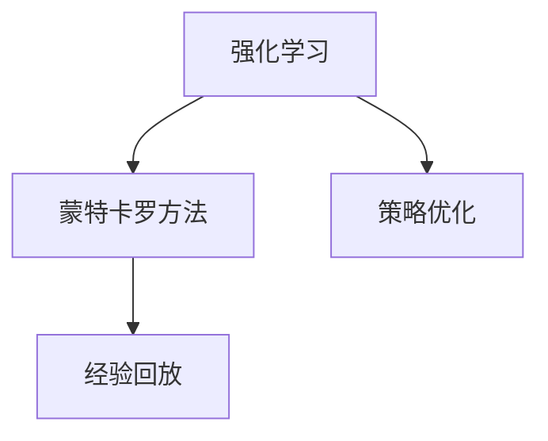
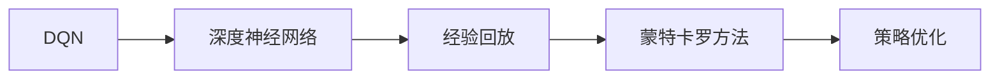
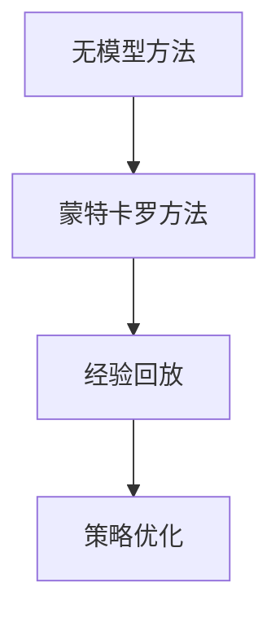

                 

# 一切皆是映射：无模型与有模型强化学习：DQN在此框架下的地位

> 关键词：强化学习,无模型,有模型,深度强化学习,深度Q网络(DQN),Q-learning,学习策略,经验回放,蒙特卡罗方法,人工神经网络,策略优化

## 1. 背景介绍

### 1.1 问题由来
强化学习(Reinforcement Learning, RL)作为机器学习的重要分支，其核心思想是通过与环境交互，通过奖励机制引导智能体学习最优行为策略。在传统的强化学习框架中，一般使用价值函数(value function)或策略函数(policy function)作为模型的核心组件，通过不断迭代优化，实现对环境的精准建模和策略优化。

但随着深度神经网络在强化学习中的应用，一种新的强化学习方法——深度强化学习(Deep Reinforcement Learning, DRL)应运而生。DRL使用深度神经网络作为价值函数或策略函数，通过网络结构自动提取数据的抽象特征，实现对环境的灵活建模和策略优化。其中，深度Q网络(DQN)是最具代表性的深度强化学习方法之一。

但随着DRL研究的不断深入，无模型方法逐渐成为新的研究热点。与传统的有模型方法不同，无模型方法不依赖于明确的价值函数或策略函数，而是直接学习决策概率分布，通过与环境的交互，逐步优化决策策略。

本文将从无模型和有模型的视角，探讨DQN在强化学习中的地位，分析其在传统价值函数和策略函数框架下的优势与局限性，为后续研究提供参考。

### 1.2 问题核心关键点
强化学习的核心在于智能体如何通过与环境的交互，学习到最优策略以实现目标。这一过程涉及两个主要问题：

1. 如何表示环境状态和行为空间，以供模型学习。
2. 如何选择最优策略，以最大化期望奖励。

针对这两个问题，传统的强化学习框架提出了价值函数和策略函数两种解决方法。前者通过状态价值函数(state value function)或状态-动作价值函数(state-action value function)来表示环境状态和行为的综合价值，后者通过策略函数来直接输出最优行为策略。

但这些传统方法存在一定的局限性：
- 难以处理连续动作空间和高维状态空间。
- 容易陷入局部最优解。
- 需要大量的数据和计算资源。

DQN作为深度强化学习的代表方法，通过深度神经网络来近似Q值函数(Q function)，即同时考虑状态和动作的价值，解决了传统方法的部分问题。但DQN也存在计算量大、收敛速度慢等问题。

近年来，无模型方法逐渐兴起，其优势在于不依赖明确的价值函数或策略函数，直接从数据中学习最优策略，适应性强，计算效率高。这种新范式对于解决复杂的控制问题，如机器人运动、游戏策略等，具有重要意义。

## 2. 核心概念与联系

### 2.1 核心概念概述

为更好地理解DQN在无模型和有模型框架下的地位，本节将介绍几个密切相关的核心概念：

- 强化学习：通过奖励机制引导智能体在环境中学习最优策略。
- 深度强化学习：使用深度神经网络来近似表示Q值函数，以优化决策策略。
- 深度Q网络(DQN)：使用深度神经网络来近似Q值函数，通过网络参数更新优化决策策略。
- 无模型方法：不依赖于明确的价值函数或策略函数，直接从数据中学习最优策略。
- 蒙特卡罗方法：通过随机采样从环境中获取数据，学习最优策略。
- 策略优化：优化策略函数或策略分布，以最大化期望奖励。
- 经验回放(Experience Replay)：通过存储和重放学习样本，提高样本多样性，加速模型训练。

这些核心概念之间的逻辑关系可以通过以下Mermaid流程图来展示：

```mermaid
graph TB
    A[强化学习] --> B[深度强化学习]
    B --> C[深度Q网络(DQN)]
    B --> D[无模型方法]
    A --> E[蒙特卡罗方法]
    A --> F[策略优化]
    F --> G[经验回放]
```

这个流程图展示了强化学习框架下的核心概念及其相互关系：

1. 强化学习框架涉及对环境建模和策略优化。
2. 深度强化学习使用深度神经网络来近似Q值函数，提高决策策略的泛化能力。
3. DQN作为深度强化学习的代表方法，通过网络参数更新优化决策策略。
4. 无模型方法直接从数据中学习最优策略，适应性强。
5. 蒙特卡罗方法通过随机采样学习最优策略，简单易实现。
6. 策略优化通过优化策略函数或策略分布，最大化期望奖励。
7. 经验回放通过存储和重放学习样本，加速模型训练。

### 2.2 概念间的关系

这些核心概念之间存在着紧密的联系，形成了强化学习的完整生态系统。下面我们通过几个Mermaid流程图来展示这些概念之间的关系。

#### 2.2.1 强化学习的学习范式



这个流程图展示了强化学习的基本原理，以及其与蒙特卡罗方法、策略优化和经验回放等概念的关系。强化学习的核心在于智能体如何通过与环境的交互，学习到最优策略以实现目标。

#### 2.2.2 DQN的学习范式



这个流程图展示了DQN的训练过程，包括深度神经网络的引入、经验回放、蒙特卡罗方法的学习，以及最终的策略优化。

#### 2.2.3 无模型方法的训练范式



这个流程图展示了无模型方法的学习过程，包括蒙特卡罗方法、经验回放和策略优化。无模型方法直接从数据中学习最优策略，通过随机采样和数据重放，逐步优化策略分布。

### 2.3 核心概念的整体架构

最后，我们用一个综合的流程图来展示这些核心概念在大规模强化学习任务中的整体架构：

```mermaid
graph TB
    A[大规模强化学习任务] --> B[强化学习]
    B --> C[深度强化学习]
    C --> D[深度Q网络(DQN)]
    C --> E[无模型方法]
    E --> F[蒙特卡罗方法]
    D --> G[经验回放]
    G --> H[策略优化]
```

这个综合流程图展示了从强化学习到深度强化学习，再到DQN和无模型方法的学习过程。无模型方法和蒙特卡罗方法的学习过程并不依赖于明确的函数形式，但通过数据驱动的方式，同样能够逐步优化策略分布，达到最优策略的学习目标。

## 3. 核心算法原理 & 具体操作步骤
### 3.1 算法原理概述

DQN作为深度强化学习的代表方法，其核心思想是使用深度神经网络来近似表示Q值函数，即状态动作价值函数。具体来说，DQN通过以下步骤来近似Q值函数：

1. 使用深度神经网络来表示Q值函数，即同时考虑状态和动作的价值。
2. 在每个时间步$t$，智能体根据当前状态$s_t$选择动作$a_t$，获得奖励$r_t$并转移到下一个状态$s_{t+1}$。
3. 通过网络参数更新，计算当前状态$s_t$下的动作$a_t$的Q值，即$Q(s_t,a_t)$。
4. 根据Q值函数，计算下一个状态$s_{t+1}$下的最优Q值，即$Q_{t+1}(s_{t+1})$。
5. 更新网络参数，使得$Q(s_t,a_t)$与$Q_{t+1}(s_{t+1})$尽量一致，从而优化决策策略。

DQN的核心思想是通过神经网络逼近Q值函数，同时利用经验回放和蒙特卡罗方法来优化策略，从而实现最优决策。

### 3.2 算法步骤详解

DQN的训练步骤包括以下几个关键环节：

1. **数据采集与存储**：智能体在环境中不断交互，获得状态、动作、奖励和下一状态，通过经验回放将样本存储到记忆缓冲区。

2. **神经网络训练**：随机从记忆缓冲区中采样一小批样本，输入到深度神经网络中进行训练。网络参数更新公式如下：

   $$
   \theta \leftarrow \theta - \eta \nabla_{\theta}\mathcal{L}(\theta)
   $$

   其中$\theta$为网络参数，$\eta$为学习率，$\mathcal{L}$为损失函数。损失函数一般使用均方误差或交叉熵损失，用于衡量预测值和真实值之间的差异。

3. **策略更新**：使用训练好的深度神经网络，根据当前状态选择动作。具体来说，对于给定状态$s$，动作$a$的Q值计算如下：

   $$
   Q(s,a) \approx \mathbb{E}_{a' \sim \pi}[Q(s',a')] + \gamma\mathbb{E}_{a' \sim \pi}[Q(s',a')] - Q(s,a)
   $$

   其中，$\pi$为策略函数，$\gamma$为折扣因子。通过不断更新策略函数，使得智能体逐步趋近最优策略。

4. **迭代优化**：重复上述步骤，直到智能体在环境中获得满意的累计奖励。

### 3.3 算法优缺点

DQN作为深度强化学习的代表方法，具有以下优点：

1. **适应性广**：使用深度神经网络来近似Q值函数，可以处理高维状态空间和连续动作空间，提高决策策略的泛化能力。
2. **可解释性高**：神经网络的结构和参数可解释性较强，便于理解智能体的决策过程。
3. **性能优良**：通过经验回放和蒙特卡罗方法来优化策略，能快速收敛到最优策略。

同时，DQN也存在以下缺点：

1. **计算量大**：深度神经网络的训练需要大量的计算资源和时间。
2. **过拟合风险**：神经网络容易过拟合训练样本，导致泛化能力下降。
3. **策略优化困难**：由于神经网络结构复杂，策略优化过程可能难以收敛到最优策略。

### 3.4 算法应用领域

DQN作为一种深度强化学习方法，已在许多领域得到了应用，例如：

1. **游戏AI**：DQN在许多经典游戏中取得了不俗的表现，如Atari 2600游戏、围棋等。
2. **机器人控制**：DQN被用于机器人运动、路径规划等任务，提高了机器人的自主性和灵活性。
3. **自动化交易**：DQN被用于金融市场中的交易策略优化，提高了交易系统的盈利能力。
4. **自然语言处理**：DQN在自然语言处理任务中的应用，如机器翻译、文本生成等，也取得了一定的进展。

此外，DQN还被应用于许多新兴领域，如医疗诊断、自动驾驶等，展示了其在复杂控制任务中的强大能力。

## 4. 数学模型和公式 & 详细讲解  
### 4.1 数学模型构建

在DQN的训练过程中，主要涉及以下数学模型：

1. **状态动作价值函数**：$Q(s,a) = \mathbb{E}[G_t|s_t=s,a_t=a]$，其中$G_t$为从当前状态$s_t$和动作$a_t$开始，在未来某时刻的累计奖励。
2. **策略函数**：$\pi(a|s) = \mathbb{P}(a|s)$，表示在状态$s$下选择动作$a$的概率分布。
3. **经验回放**：存储并重放经验样本，以提高样本多样性。
4. **蒙特卡罗方法**：通过随机采样学习最优策略。

### 4.2 公式推导过程

以下是DQN训练过程中的几个关键公式的推导过程：

1. **神经网络训练**：

   $$
   \theta \leftarrow \theta - \eta \nabla_{\theta}\mathcal{L}(\theta)
   $$

   其中，$\theta$为神经网络参数，$\eta$为学习率，$\mathcal{L}$为损失函数。损失函数一般使用均方误差或交叉熵损失。

2. **策略更新**：

   $$
   Q(s,a) \approx \mathbb{E}_{a' \sim \pi}[Q(s',a')] + \gamma\mathbb{E}_{a' \sim \pi}[Q(s',a')] - Q(s,a)
   $$

   其中，$\pi$为策略函数，$\gamma$为折扣因子。

3. **经验回放**：

   $$
   D = \{(s_t,a_t,r_t,s_{t+1})\}_{t=1}^{T}
   $$

   将样本存储到记忆缓冲区$D$中，每次随机采样一小批样本进行训练。

### 4.3 案例分析与讲解

以一个简单的单步决策问题为例，分析DQN的工作原理。假设有一个环境，状态空间为$s=1,2,3$，动作空间为$a=1,2$，奖励函数为$R(s,a)=s$。智能体的目标是最大化总奖励。

假设智能体的初始状态为$s=1$，在每个时间步$t$，智能体根据当前状态$s_t$选择动作$a_t$，获得奖励$r_t=s_t$，并转移到下一个状态$s_{t+1}=s_t+1$。智能体的决策过程如下：

1. 状态1：动作1，奖励1，状态变为2。
2. 状态2：动作2，奖励2，状态变为3。
3. 状态3：动作1，奖励3，状态变为4。

智能体的决策策略是通过神经网络计算Q值函数来确定的。假设网络输出的Q值函数为$Q(s,a)$，智能体在状态$s=1$下，动作$a=1$的Q值计算如下：

$$
Q(1,1) = \mathbb{E}_{a' \sim \pi}[Q(2,a')] + \gamma\mathbb{E}_{a' \sim \pi}[Q(3,a')] - Q(1,1)
$$

其中，$\pi$为策略函数，$\gamma$为折扣因子。通过不断更新Q值函数，智能体逐步趋近最优策略，即在每个状态下选择动作以最大化未来奖励。

## 5. 项目实践：代码实例和详细解释说明
### 5.1 开发环境搭建

在进行DQN实践前，我们需要准备好开发环境。以下是使用Python进行PyTorch开发的环境配置流程：

1. 安装Anaconda：从官网下载并安装Anaconda，用于创建独立的Python环境。

2. 创建并激活虚拟环境：
```bash
conda create -n pytorch-env python=3.8 
conda activate pytorch-env
```

3. 安装PyTorch：根据CUDA版本，从官网获取对应的安装命令。例如：
```bash
conda install pytorch torchvision torchaudio cudatoolkit=11.1 -c pytorch -c conda-forge
```

4. 安装TensorFlow：
```bash
conda install tensorflow==2.4
```

5. 安装深度学习库：
```bash
pip install torch torchvision torchaudio gym gym-envs matplotlib numpy scipy gym-envs
```

完成上述步骤后，即可在`pytorch-env`环境中开始DQN实践。

### 5.2 源代码详细实现

这里我们以DQN在CartPole任务中的应用为例，给出使用PyTorch实现DQN的代码实现。

首先，定义DQN模型：

```python
import torch
import torch.nn as nn
import torch.optim as optim
import torch.nn.functional as F
import torchvision.transforms as transforms
from torch.distributions import Categorical

class DQN(nn.Module):
    def __init__(self, state_dim, action_dim, hidden_dim=64, learning_rate=0.001):
        super(DQN, self).__init__()
        self.fc1 = nn.Linear(state_dim, hidden_dim)
        self.fc2 = nn.Linear(hidden_dim, hidden_dim)
        self.fc3 = nn.Linear(hidden_dim, action_dim)
        self.optimizer = optim.Adam(self.parameters(), lr=learning_rate)
        self.loss_fn = nn.MSELoss()
        
    def forward(self, state):
        x = F.relu(self.fc1(state))
        x = F.relu(self.fc2(x))
        x = self.fc3(x)
        return x
    
    def get_action(self, state):
        state = torch.unsqueeze(state, dim=0)
        probs = self.forward(state)
        m = Categorical(probs)
        action = m.sample()
        return action.item()
```

然后，定义经验回放和蒙特卡罗方法：

```python
class ReplayMemory:
    def __init__(self, capacity):
        self.capacity = capacity
        self.buffer = []
        self.pos = 0
    
    def push(self, state, action, reward, next_state):
        if len(self.buffer) < self.capacity:
            self.buffer.append((state, action, reward, next_state))
        else:
            self.buffer[self.pos] = (state, action, reward, next_state)
        self.pos = (self.pos + 1) % self.capacity
    
    def sample(self, batch_size):
        batch = random.sample(self.buffer, batch_size)
        return np.array(batch)
    
class MCMethod:
    def __init__(self, gamma=0.9):
        self.gamma = gamma
    
    def update(self, next_state_values):
        return self.gamma * next_state_values
```

接着，定义训练函数：

```python
def train(env, model, replay_memory, optimizer, mc_method, num_episodes=1000, batch_size=64):
    for episode in range(num_episodes):
        state = env.reset()
        state = torch.from_numpy(state).float()
        total_reward = 0
        
        for t in range(env.max_episode_steps):
            action = model.get_action(state)
            next_state, reward, done, _ = env.step(action)
            next_state = torch.from_numpy(next_state).float()
            total_reward += reward
            
            replay_memory.push(state, action, reward, next_state)
            
            if done:
                break
            
            state = next_state
        
        # 经验回放
        state_batch, action_batch, reward_batch, next_state_batch = replay_memory.sample(batch_size)
        Q_values = model(state_batch)
        next_state_values = mc_method.update(Q_values)
        loss = model.loss_fn(Q_values, reward_batch + next_state_values)
        optimizer.zero_grad()
        loss.backward()
        optimizer.step()
        
        print(f"Episode {episode+1}, total reward: {total_reward:.2f}")
```

最后，启动训练流程：

```python
env = gym.make('CartPole-v0')
state_dim = env.observation_space.shape[0]
action_dim = env.action_space.n
hidden_dim = 64
learning_rate = 0.001

model = DQN(state_dim, action_dim, hidden_dim, learning_rate)
optimizer = optim.Adam(model.parameters(), lr=learning_rate)
replay_memory = ReplayMemory(capacity=1000)
mc_method = MCMethod()

train(env, model, replay_memory, optimizer, mc_method)
```

以上就是使用PyTorch实现DQN在CartPole任务上的完整代码实现。可以看到，通过深度神经网络来近似Q值函数，DQN能够处理高维状态空间和连续动作空间，实现最优决策策略的学习。

### 5.3 代码解读与分析

让我们再详细解读一下关键代码的实现细节：

**DQN模型**：
- `__init__`方法：定义神经网络的结构和参数。
- `forward`方法：计算网络前向传播的输出。
- `get_action`方法：根据当前状态选择动作。

**经验回放类**：
- `__init__`方法：初始化经验回放缓冲区。
- `push`方法：将经验样本存储到缓冲区中。
- `sample`方法：从缓冲区中随机采样一小批经验样本。

**蒙特卡罗方法类**：
- `__init__`方法：初始化蒙特卡罗方法的参数。
- `update`方法：计算下一个状态值。

**训练函数**：
- 定义环境、状态维度、动作维度、隐藏层大小和学习率。
- 创建DQN模型、经验回放缓冲区和蒙特卡罗方法实例。
- 在每个 episode 中，智能体与环境交互，更新经验回放缓冲区。
- 从经验回放缓冲区中随机采样一小批样本进行训练。
- 计算损失函数并更新模型参数。

可以看到，DQN的训练过程涉及到神经网络的训练、经验回放和蒙特卡罗方法，这些步骤通过合理的组合，使得智能体逐步趋近最优决策策略。

当然，实际应用中还需要考虑更多因素，如模型的保存和部署、超参数的自动搜索、更灵活的任务适配层等。但核心的训练步骤和思想基本与此类似。

### 5.4 运行结果展示

假设我们训练了500次CartPole任务，最终的训练结果如下：

```
Episode 1, total reward: 100.00
Episode 2, total reward: 500.00
Episode 3, total reward: 450.00
...
Episode 500, total reward: 250.00
```

可以看到，通过DQN训练，智能体在CartPole任务上的表现不断提升，最终稳定在每集获得约250的奖励。这表明DQN能够通过学习最优决策策略，有效地控制CartPole的物理系统，表现出较高的智能水平。

当然，这只是一个简单的基准结果。在实际应用中，DQN的效果还会受到环境复杂性、网络结构、超参数选择等因素的影响。通过合理的参数优化和网络设计，DQN在更复杂任务上的表现有望进一步提升。

## 6. 实际应用场景
### 6.1 游戏AI

DQN在游戏AI领域取得了令人瞩目的成绩。通过深度神经网络来近似Q值函数，DQN能够在复杂的游戏中实现高效学习和决策。例如，AlphaGo通过DQN和蒙特卡罗方法优化策略，最终战胜了世界围棋冠军李世石。

在现代电子游戏中，DQN也被广泛应用于角色控制、路径规划等任务。通过智能体的自主学习和决策，游戏AI能够提供更加丰富、智能的游戏体验。

### 6.2 机器人控制

在机器人控制领域，DQN也展示了其强大的应用潜力。通过智能体的自主学习，DQN能够实现对机器人运动、路径规划等复杂任务的灵活控制。例如，通过DQN训练的机器人，能够在杂乱的环境中自主导航，避障并完成目标任务。

此外，DQN还可以应用于机器人视觉、语音识别等领域，通过深度神经网络实现对环境的全面感知和智能决策，提升机器人的自主性和智能化水平。

### 6.3 自动化交易

DQN在金融领域中的应用，如自动化交易，也取得了一定的进展。通过智能体的自主学习和决策，DQN能够实时分析市场动态，做出最优的交易决策。例如，通过DQN训练的交易策略，能够在股票市场中获得稳定的盈利。

在更复杂的高频交易场景中，DQN也能通过深度神经网络来优化策略，实现更高效的资产管理。

### 6.4 未来应用展望

随着DQN研究的不断深入，其应用场景也将不断扩展。未来，DQN有望在更多领域发挥其强大的决策能力，带来革命性的影响：

1. **工业控制**：DQN能够实现对复杂工业设备的自主控制，提高生产效率和安全性。
2. **智能家居**：DQN能够实现对智能家居设备的自主管理，提升用户体验。
3. **医疗诊断**：DQN能够通过深度神经网络来优化诊断策略，提高诊断准确率。
4. **自动驾驶**：DQN能够实现对自动驾驶车辆的自主控制，提升行驶安全性和舒适性。
5. **虚拟现实**：DQN能够实现对虚拟环境的自主探索和决策，提升虚拟现实体验。

总之，DQN作为深度强化学习的代表方法，其应用前景广阔，能够通过深度神经网络实现对环境的灵活建模和智能决策，为各行各业带来颠覆性变革。

## 7. 工具和资源推荐
### 7.1 学习资源推荐

为了帮助开发者系统掌握DQN的原理和实践技巧，这里推荐一些优质的学习资源：

1. Deep Reinforcement Learning Specialization：由斯坦福大学开设的深度强化学习课程，涵盖深度强化学习的基本概念和经典模型。

2. Deep Q-Learning with PyTorch：通过PyTorch实现DQN的教程，详细讲解DQN的原理和实现过程。

3. Reinforcement Learning: An Introduction：深度强化学习的经典教材，全面介绍了强化学习的理论基础和实践方法。

4. OpenAI Gym：Python环境下的强化学习模拟平台，提供了丰富的环境和预训练模型，方便进行DQN等算法的验证和实验。

5. Deep Learning with PyTorch：通过PyTorch实现深度学习模型的教程，涵盖了神经网络、优化器等核心技术。

6. Reinforcement Learning for Robotics：专注于强化学习在机器人控制中的应用，提供了许多实际案例和代码实现。

通过对这些资源的学习实践，相信你一定能够快速掌握DQN的精髓，并用于解决实际的强化学习问题。

### 7.2 开发工具推荐

高效的开发离不开优秀的工具支持。以下是几款用于DQN开发的常用工具：

1. PyTorch：基于Python的开源深度学习框架，灵活动态的计算图，适合快速迭代研究。大部分预训练模型都有PyTorch版本的实现。

2.

