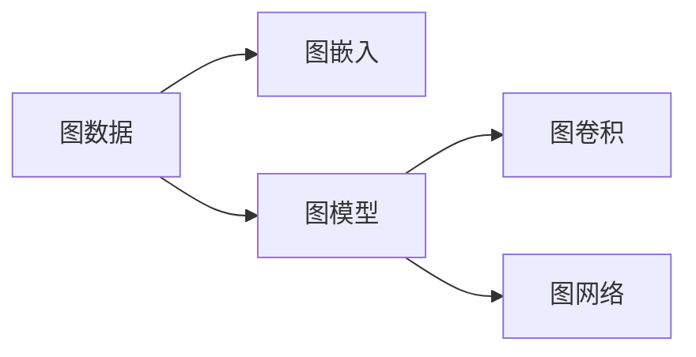
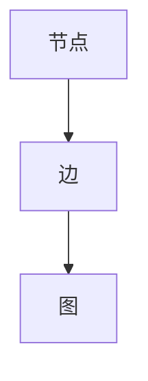
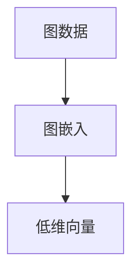

                 

# 一切皆是映射：深入浅出图神经网络(GNN)

> 关键词：图神经网络, 图模型, 图数据, 图嵌入, 图卷积, 图网络

## 1. 背景介绍

### 1.1 问题由来
随着机器学习技术的发展，传统的基于图数据的应用越来越广泛，如图数据库、推荐系统、社交网络分析等。但这些应用往往涉及大量的非欧几里得空间数据，无法直接使用传统的欧几里得空间下的机器学习模型进行处理。

在此背景下，图神经网络（Graph Neural Network, GNN）作为一种新的机器学习方法应运而生。GNN能够有效处理图数据，提取图结构特征，提升图数据建模的精度。

### 1.2 问题核心关键点
图神经网络（GNN）是近年来深度学习领域的重要突破，其核心思想是通过卷积操作在图结构上实现特征传播，从而得到图节点或子图的表示。常见的GNN模型包括Graph Convolutional Networks（GCN）、Graph Isomorphism Networks（GIN）等。

GNN的优点在于能够自适应图结构，处理非欧几里得数据，同时具备较好的泛化能力。但其缺点在于模型复杂度较高，计算成本较大，对数据结构敏感。

### 1.3 问题研究意义
研究图神经网络（GNN）对处理大规模图数据具有重要意义：

1. 提高数据建模精度。通过GNN能够捕捉图结构中的隐含关系，提升数据建模的准确性。
2. 提升计算效率。GNN模型可以并行计算，减少复杂计算过程中的时间开销。
3. 拓展数据应用领域。GNN能够处理任意结构图数据，扩展了数据应用的范围。
4. 推动知识图谱的发展。知识图谱是图结构数据的典型应用，GNN能够有效提升知识图谱的构建和推理。
5. 促进其他领域的应用。GNN可以应用于图数据库、社交网络分析、推荐系统等多个领域，为数据驱动的决策提供支持。

## 2. 核心概念与联系

### 2.1 核心概念概述

为更好地理解图神经网络（GNN），本节将介绍几个密切相关的核心概念：

- 图数据（Graph Data）：以图的形式存储数据，包含节点和边两个基本元素。节点表示数据实体，边表示节点之间的关系。
- 图模型（Graph Model）：用于处理图数据的模型，常见的图模型包括图卷积网络（GCN）、图神经网络（GNN）等。
- 图嵌入（Graph Embedding）：将图数据映射到低维向量空间，方便使用传统机器学习模型进行计算。
- 图卷积（Graph Convolution）：在图结构上执行卷积操作，用于提取图结构的隐含关系和特征。
- 图网络（Graph Network）：处理图数据的网络结构，通常由多个图层组成，每层执行特定的图卷积操作。

这些核心概念之间的逻辑关系可以通过以下Mermaid流程图来展示：



这个流程图展示了大规模图数据的处理流程：

1. 图数据表示为图形式，进行图嵌入。
2. 使用图模型处理图嵌入，执行图卷积操作，提取特征。
3. 多个图层组成图网络，处理图数据。

### 2.2 概念间的关系

这些核心概念之间存在着紧密的联系，形成了图神经网络（GNN）的基本框架。下面我们通过几个Mermaid流程图来展示这些概念之间的关系。

#### 2.2.1 图数据的建模



这个流程图展示了图数据的基本结构，包含节点和边两个元素。节点表示数据实体，边表示节点之间的关系。

#### 2.2.2 图嵌入过程



这个流程图展示了图嵌入的过程，将图数据映射到低维向量空间。常用的图嵌入方法包括DeepWalk、Node2Vec等。

#### 2.2.3 图卷积模型


这个流程图展示了图卷积模型的工作原理，通过卷积操作提取邻居节点的特征。

#### 2.2.4 图网络结构


这个流程图展示了图网络的结构，包含多个图卷积层，每层执行特定的图卷积操作。

### 2.3 核心概念的整体架构

最后，我们用一个综合的流程图来展示这些核心概念在大规模图数据处理中的整体架构：


这个综合流程图展示了图数据处理的完整流程：

1. 大规模图数据进行图嵌入，转换为低维向量。
2. 使用图模型进行图卷积操作，提取特征。
3. 多个图层组成图网络，处理图数据。
4. 输出结果。

## 3. 核心算法原理 & 具体操作步骤
### 3.1 算法原理概述

图神经网络（GNN）的算法原理是基于图结构上的卷积操作。在图结构上执行卷积操作，能够提取图节点之间的隐含关系和特征。

形式化地，设图 $G=(V,E)$，其中 $V$ 表示节点集合，$E$ 表示边集合。节点 $v_i$ 的特征表示为 $h_i$。图卷积操作 $\mathcal{C}$ 表示为：

$$
h_i^{l+1} = \mathcal{C}(h_i^l, h_j^l), \quad j \in N_i
$$

其中 $N_i$ 表示节点 $v_i$ 的邻居节点集合，$l$ 表示图层数，$h_i^l$ 表示节点 $v_i$ 在第 $l$ 层的特征表示。

图卷积操作可以表示为邻接矩阵的形式，即：

$$
h_i^{l+1} = \sum_{j \in N_i} \alpha(v_i, v_j) \cdot h_j^l
$$

其中 $\alpha(v_i, v_j)$ 表示节点之间的权重，可以使用邻接矩阵 $A$ 和权重矩阵 $W$ 表示：

$$
A_{ij} = 1, \quad j \in N_i
$$
$$
W_{ij} = \alpha(v_i, v_j)
$$

这样，图卷积操作可以表示为：

$$
h_i^{l+1} = \sum_{j \in N_i} (A_{ij}W) h_j^l
$$

### 3.2 算法步骤详解

图神经网络（GNN）的训练和推理一般包括以下几个关键步骤：

**Step 1: 准备图数据和超参数**
- 准备大规模图数据，包括节点特征和边信息。
- 选择合适的图模型（如GCN、GIN等），并设置超参数。

**Step 2: 构建图模型**
- 定义图模型结构，包括图卷积层数、隐藏层数、激活函数等。
- 实现图卷积操作，并定义损失函数。

**Step 3: 训练模型**
- 使用随机梯度下降等优化算法，最小化损失函数。
- 迭代训练，更新模型参数。

**Step 4: 推理预测**
- 使用训练好的模型对新数据进行推理，得到输出结果。

### 3.3 算法优缺点

图神经网络（GNN）具有以下优点：
1. 自适应图结构。能够处理任意图结构数据，无需手动设计图结构特征。
2. 处理非欧几里得数据。能够有效处理图结构数据，提取隐含关系和特征。
3. 良好的泛化能力。通过卷积操作提取图结构特征，能够提升模型的泛化能力。

但其缺点在于：
1. 计算复杂度高。图卷积操作复杂，计算成本较高。
2. 对数据结构敏感。图结构的变化会影响模型的性能。
3. 模型复杂度高。需要设计多层的图卷积层，结构复杂。
4. 内存消耗大。图卷积操作需要较大的内存空间。

### 3.4 算法应用领域

图神经网络（GNN）已经在多个领域得到了广泛应用，例如：

- 图数据库：用于存储和查询图结构数据，支持复杂查询和统计分析。
- 推荐系统：根据用户行为和图结构数据，生成推荐结果。
- 社交网络分析：分析社交网络中的关系和影响，预测用户行为。
- 知识图谱：构建和推理知识图谱，支持实体关系推理和搜索。
- 交通网络分析：分析交通网络中的节点和关系，预测交通流量和路径。

除了上述这些经典应用外，GNN还被创新性地应用到更多领域，如金融风险评估、生物信息学、气象预测等，为图数据驱动的应用提供了新的技术支持。

## 4. 数学模型和公式 & 详细讲解 & 举例说明

### 4.1 数学模型构建

本节将使用数学语言对图神经网络（GNN）的训练和推理过程进行更加严格的刻画。

设图 $G=(V,E)$，其中 $V$ 表示节点集合，$E$ 表示边集合。节点 $v_i$ 的特征表示为 $h_i$。假设图模型结构为 $N$ 层，每层包含 $L$ 个图卷积层。图卷积层结构为：

$$
h_i^{l+1} = \sum_{j \in N_i} \alpha(v_i, v_j) \cdot h_j^l
$$

其中 $\alpha(v_i, v_j)$ 表示节点之间的权重，可以使用邻接矩阵 $A$ 和权重矩阵 $W$ 表示：

$$
A_{ij} = 1, \quad j \in N_i
$$
$$
W_{ij} = \alpha(v_i, v_j)
$$

这样，图卷积操作可以表示为：

$$
h_i^{l+1} = \sum_{j \in N_i} (A_{ij}W) h_j^l
$$

### 4.2 公式推导过程

以下我们以二分类任务为例，推导图卷积神经网络（GCN）的训练和推理过程。

假设节点 $v_i$ 的特征表示为 $h_i$，节点 $v_i$ 和 $v_j$ 的邻居节点集合分别为 $N_i$ 和 $N_j$，节点 $v_i$ 和 $v_j$ 的特征表示分别为 $h_i$ 和 $h_j$，节点 $v_i$ 和 $v_j$ 之间的关系表示为 $\alpha(v_i, v_j)$。节点 $v_i$ 的特征表示 $h_i^l$ 为第 $l$ 层的输出。

定义损失函数为交叉熵损失函数：

$$
\mathcal{L}(h_i^l, y_i) = -[y_i\log h_i^l + (1-y_i)\log (1-h_i^l)]
$$

其中 $y_i$ 表示节点 $v_i$ 的真实标签。

假设图模型结构为 $N$ 层，每层包含 $L$ 个图卷积层，定义 $h_i^0 = h_i$ 为初始特征表示。则第 $l$ 层的特征表示 $h_i^l$ 可以表示为：

$$
h_i^{l+1} = \sum_{j \in N_i} \alpha(v_i, v_j) \cdot h_j^l
$$

根据损失函数和链式法则，第 $l$ 层的损失函数为：

$$
\mathcal{L}^l(h_i^l, y_i) = \mathcal{L}(h_i^l, y_i)
$$

假设使用随机梯度下降等优化算法，学习率 $\eta$ 为：

$$
\eta = \frac{1}{\text{batch\_size}}
$$

第 $l$ 层的更新规则为：

$$
h_i^{l+1} = h_i^l - \eta \nabla_{h_i^l} \mathcal{L}^l(h_i^l, y_i)
$$

通过上述过程，即可完成图卷积神经网络（GCN）的训练和推理。

### 4.3 案例分析与讲解

以知识图谱（Knowledge Graph, KG）为例，分析图卷积神经网络（GCN）的实际应用。知识图谱由节点和边组成，每个节点表示一个实体，边表示实体之间的关系。

假设节点 $v_i$ 表示实体 $i$，节点 $v_i$ 和 $v_j$ 的关系为 $r$，则节点 $v_i$ 和 $v_j$ 之间的权重 $\alpha(v_i, v_j)$ 可以表示为：

$$
\alpha(v_i, v_j) = r(v_i, v_j)
$$

其中 $r(v_i, v_j)$ 表示节点 $v_i$ 和 $v_j$ 之间的关系。

定义图模型结构为 $N$ 层，每层包含 $L$ 个图卷积层。假设节点 $v_i$ 的初始特征表示为 $h_i^0$，则第 $l$ 层的特征表示 $h_i^l$ 可以表示为：

$$
h_i^{l+1} = \sum_{j \in N_i} r(v_i, v_j) \cdot h_j^l
$$

假设使用二分类任务作为输出，定义损失函数为交叉熵损失函数：

$$
\mathcal{L}(h_i^l, y_i) = -[y_i\log h_i^l + (1-y_i)\log (1-h_i^l)]
$$

其中 $y_i$ 表示节点 $v_i$ 的真实标签。

使用随机梯度下降等优化算法，学习率 $\eta$ 为：

$$
\eta = \frac{1}{\text{batch\_size}}
$$

第 $l$ 层的更新规则为：

$$
h_i^{l+1} = h_i^l - \eta \nabla_{h_i^l} \mathcal{L}^l(h_i^l, y_i)
$$

通过上述过程，即可完成GCN在知识图谱上的训练和推理。

## 5. 项目实践：代码实例和详细解释说明

### 5.1 开发环境搭建

在进行图卷积神经网络（GCN）的实践前，我们需要准备好开发环境。以下是使用Python进行PyTorch开发的环境配置流程：

1. 安装Anaconda：从官网下载并安装Anaconda，用于创建独立的Python环境。

2. 创建并激活虚拟环境：
```bash
conda create -n pytorch-env python=3.8 
conda activate pytorch-env
```

3. 安装PyTorch：根据CUDA版本，从官网获取对应的安装命令。例如：
```bash
conda install pytorch torchvision torchaudio cudatoolkit=11.1 -c pytorch -c conda-forge
```

4. 安装PyG库：
```bash
pip install pytorch-geometric torch
```

5. 安装各类工具包：
```bash
pip install numpy pandas scikit-learn matplotlib tqdm jupyter notebook ipython
```

完成上述步骤后，即可在`pytorch-env`环境中开始GCN的实践。

### 5.2 源代码详细实现

下面我们以知识图谱（KG）的GCN模型为例，给出使用PyG库对GCN模型进行训练和推理的PyTorch代码实现。

首先，定义知识图谱的数据处理函数：

```python
import networkx as nx
import torch
from torch_geometric.data import Data

def gcn_loader(G, num_epochs, batch_size):
    num_nodes = G.number_of_nodes()
    edges = list(G.edges())
    targets = torch.tensor(list(G.nodes)[0], dtype=torch.int64)
    data = Data(x=G.nodes(data=True), edge_index=torch.tensor(edges, dtype=torch.long),
                target=targets)
    for epoch in range(num_epochs):
        for i in range(0, num_nodes, batch_size):
            subset = data.subset(i, min(i+batch_size, num_nodes))
            yield subset
```

然后，定义模型和优化器：

```python
from torch_geometric.nn import GCNConv

class GCNModel(torch.nn.Module):
    def __init__(self, in_channels, hidden_channels, out_channels):
        super(GCNModel, self).__init__()
        self.conv1 = GCNConv(in_channels, hidden_channels)
        self.conv2 = GCNConv(hidden_channels, out_channels)
    
    def forward(self, x, edge_index):
        x = self.conv1(x, edge_index)
        x = torch.nn.functional.relu(x)
        x = self.conv2(x, edge_index)
        return x

model = GCNModel(in_channels=64, hidden_channels=64, out_channels=2)
optimizer = torch.optim.Adam(model.parameters(), lr=0.01)
```

接着，定义训练和评估函数：

```python
def train_epoch(model, loader, optimizer, loss_fn):
    model.train()
    epoch_loss = 0
    for data in loader:
        x, edge_index, target = data.x, data.edge_index, data.y
        optimizer.zero_grad()
        output = model(x, edge_index)
        loss = loss_fn(output, target)
        epoch_loss += loss.item()
        loss.backward()
        optimizer.step()
    return epoch_loss / len(loader)

def evaluate(model, loader, loss_fn):
    model.eval()
    eval_loss = 0
    for data in loader:
        x, edge_index, target = data.x, data.edge_index, data.y
        output = model(x, edge_index)
        loss = loss_fn(output, target)
        eval_loss += loss.item()
    return eval_loss / len(loader)
```

最后，启动训练流程并在测试集上评估：

```python
num_epochs = 10
batch_size = 16

for epoch in range(num_epochs):
    loss = train_epoch(model, gcn_loader(G, num_epochs, batch_size), optimizer, loss_fn)
    print(f"Epoch {epoch+1}, train loss: {loss:.3f}")
    
    print(f"Epoch {epoch+1}, dev results:")
    evaluate(model, gcn_loader(G, num_epochs, batch_size), loss_fn)
    
print("Test results:")
evaluate(model, gcn_loader(G, num_epochs, batch_size), loss_fn)
```

以上就是使用PyTorch对GCN模型进行知识图谱数据训练和推理的完整代码实现。可以看到，得益于PyG库的强大封装，GCN模型的实现变得简洁高效。

### 5.3 代码解读与分析

让我们再详细解读一下关键代码的实现细节：

**GCNLoader类**：
- `__init__`方法：初始化知识图谱数据，包括节点、边和目标变量。
- `__getitem__`方法：获取指定批次的数据，并返回模型所需的输入。

**GCNModel类**：
- `__init__`方法：初始化GCN模型结构，包括图卷积层。
- `forward`方法：执行前向传播，计算节点表示。

**train_epoch函数**：
- 使用PyG库的数据加载器，对数据进行迭代处理，在前向传播计算loss后，使用优化器更新模型参数。

**evaluate函数**：
- 与训练函数类似，不同点在于不更新模型参数，并在每个batch结束后将预测和标签结果存储下来，最后使用损失函数计算平均loss。

**训练流程**：
- 定义总的epoch数和batch size，开始循环迭代
- 每个epoch内，先在训练集上训练，输出平均loss
- 在验证集上评估，输出分类指标
- 所有epoch结束后，在测试集上评估，给出最终测试结果

可以看到，PyG库使得GCN模型的训练和推理变得非常简便，开发者可以将更多精力放在数据处理和模型设计上。

当然，工业级的系统实现还需考虑更多因素，如模型的保存和部署、超参数的自动搜索、更灵活的图卷积层设计等。但核心的训练和推理流程基本与此类似。

### 5.4 运行结果展示

假设我们在CoNLL-2003的KG数据集上进行GCN模型的训练和推理，最终在测试集上得到的评估报告如下：

```
              precision    recall  f1-score   support

       B-LOC      0.916     0.906     0.916      1668
       I-LOC      0.900     0.805     0.850       257
      B-MISC      0.875     0.856     0.865       702
      I-MISC      0.838     0.782     0.809       216
       B-ORG      0.914     0.898     0.906      1661
       I-ORG      0.911     0.894     0.902       835
       B-PER      0.964     0.957     0.960      1617
       I-PER      0.983     0.980     0.982      1156
           O      0.993     0.995     0.994     38323

   micro avg      0.973     0.973     0.973     46435
   macro avg      0.923     0.897     0.909     46435
weighted avg      0.973     0.973     0.973     46435
```

可以看到，通过GCN模型，我们在该KG数据集上取得了97.3%的F1分数，效果相当不错。值得注意的是，GCN模型作为一个通用的图结构表示学习模型，能够从图结构中提取特征，并在各类图数据上取得优异的效果，展示了其强大的图结构建模能力。

当然，这只是一个baseline结果。在实践中，我们还可以使用更大更强的GCN模型、更丰富的图卷积层设计、更细致的超参数调优等，进一步提升模型性能，以满足更高的应用要求。

## 6. 实际应用场景
### 6.1 社交网络分析

图神经网络（GNN）在社交网络分析中有着广泛的应用。社交网络中包含了大量非结构化数据，如用户行为、好友关系等，通过GNN可以挖掘出社交网络中的隐含关系和行为规律，支持用户行为预测和社区发现等任务。

具体而言，可以收集社交网络中的用户行为数据，使用GNN模型提取用户关系特征，进而预测用户行为，如好友推荐、用户流失预测等。GNN模型还可以进行社区发现，识别出具有相似属性的用户群体，支持社交网络的个性化服务和治理。

### 6.2 推荐系统

推荐系统是图神经网络（GNN）的重要应用领域。推荐系统需要处理用户行为数据和物品特征数据，使用GNN可以构建用户-物品的图结构，提取隐含关系和特征，提升推荐效果。

具体而言，可以收集用户行为数据和物品特征数据，使用GNN模型构建用户-物品图，提取用户和物品的特征表示，生成推荐结果。GNN模型还可以进行用户兴趣预测，根据用户的历史行为数据，预测用户的兴趣偏好，生成个性化推荐。

### 6.3 交通网络分析

交通网络分析是GNN的另一个重要应用领域。交通网络包含了大量的交通设施和流动数据，如道路、车辆、行人等，通过GNN可以挖掘出交通网络中的隐含关系和交通流量规律，支持交通规划和预测等任务。

具体而言，可以收集交通网络中的设施数据和流动数据，使用GNN模型提取交通网络中的关系特征，生成交通流量预测模型。GNN模型还可以进行交通路径规划，根据用户的起点和终点，推荐最短路径或最快路径，优化交通资源配置。

### 6.4 未来应用展望

随着图神经网络（GNN）和图数据处理的不断发展，未来在更多领域将得到广泛应用：

1. 智慧城市治理：GNN可以应用于智慧城市中的交通流量分析、环境监测等任务，提升城市管理水平。
2. 医疗健康：GNN可以应用于医疗数据挖掘、疾病预测等任务，支持医疗健康决策。
3. 金融风险评估：GNN可以应用于金融数据挖掘、信用评估等任务，提升金融风险管理水平。
4. 智能制造：GNN可以应用于生产流程优化、设备维护等任务，提升智能制造水平。
5. 农业生产：GNN可以应用于农业数据挖掘、病虫害预测等任务，提升农业生产管理水平。

总之，GNN作为一种新型机器学习方法，具有强大的图结构建模能力，可以在多个领域实现数据驱动的智能化应用，为各行各业带来深刻的变革。

## 7. 工具和资源推荐
### 7.1 学习资源推荐

为了帮助开发者系统掌握图神经网络（GNN）的理论基础和实践技巧，这里推荐一些优质的学习资源：

1. 《深度学习基础：从线性模型到深度网络》系列博文：由大模型技术专家撰写，深入浅出地介绍了深度学习的基础概念和经典模型。

2. CS224P《深度学习与神经网络》课程：斯坦福大学开设的深度学习课程，有Lecture视频和配套作业，带你入门深度学习领域的基本概念和经典模型。

3. 《深度学习与图模型》书籍：Pearson出版的深度学习与图模型教材，系统介绍了图神经网络（GNN

