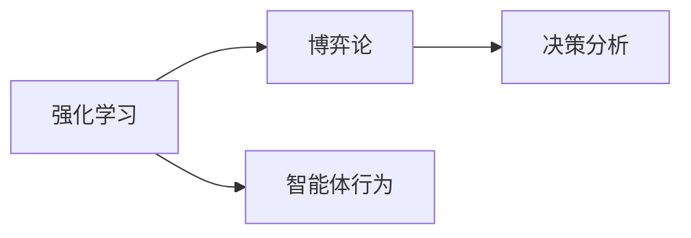
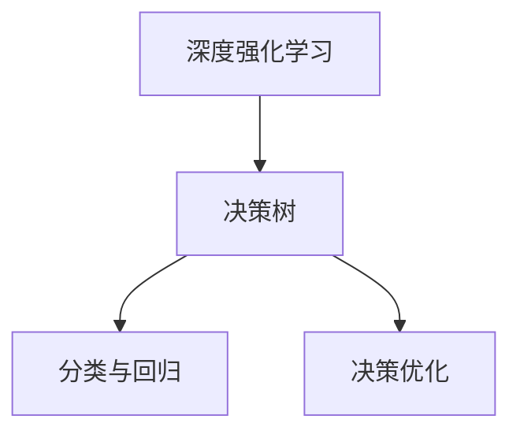

                 

# 一切皆是映射：深度学习与游戏AI的结合

> 关键词：深度学习, 游戏AI, 强化学习, 博弈论, 神经网络, 决策树, 卷积神经网络, 强化学习环境, 自适应算法

## 1. 背景介绍

### 1.1 问题由来
随着人工智能技术在各行各业的渗透，游戏AI（Game Artificial Intelligence）成为了一个热门的研究领域。游戏AI不仅需要模拟人类的决策过程，还要在各种复杂的场景下展示智能行为。深度学习技术的引入，使得游戏AI有了新的突破，尤其是在强化学习领域。基于神经网络的强化学习算法，能够在游戏环境中模拟人类的决策过程，表现出极高的学习能力和适应性。

### 1.2 问题核心关键点
深度学习与游戏AI结合的核心在于：
- **环境建模**：如何通过深度学习模型来准确建模游戏环境。
- **决策优化**：如何在不确定性的游戏环境中做出最优决策。
- **交互学习**：如何在多玩家游戏中进行复杂的交互学习。
- **鲁棒性增强**：如何提高游戏AI的鲁棒性，使其在不同的游戏版本或策略下仍能保持高水平。

### 1.3 问题研究意义
深度学习与游戏AI的结合，不仅为游戏开发带来了新的智能引擎，也为计算机视觉、自然语言处理等AI技术的实际应用提供了新的思路和方法。通过游戏AI的研究，可以更好地理解和模拟人类智能的运作机制，促进AI技术的整体发展。

## 2. 核心概念与联系

### 2.1 核心概念概述

为了更好地理解深度学习与游戏AI结合的原理，本节将介绍几个关键概念：

- **深度学习**：基于神经网络的机器学习技术，能够从大量数据中自动学习特征表示，实现复杂模式识别。
- **强化学习**：通过与环境的交互，智能体学习最优策略，以最大化累计奖励。
- **博弈论**：研究在冲突或合作中如何进行决策分析的数学理论。
- **卷积神经网络（CNN）**：专门用于处理图像数据的深度学习网络结构，能够提取空间特征。
- **决策树**：一种基于树形结构的决策模型，用于分类和回归。
- **深度强化学习**：结合深度学习和强化学习的技术，进一步提升了智能体在复杂环境中的决策能力。

这些核心概念之间的逻辑关系可以通过以下Mermaid流程图来展示：

```mermaid
graph TB
    A[深度学习] --> B[卷积神经网络(CNN)]
    A --> C[决策树]
    A --> D[强化学习]
    D --> E[博弈论]
    E --> F[深度强化学习]
    B --> G[图像处理]
    C --> H[分类与回归]
    F --> I[智能体决策]
```

这个流程图展示了大语言模型微调过程中各个核心概念的关系和作用：

1. 深度学习作为基础，通过卷积神经网络等模型处理图像和决策过程。
2. 强化学习通过博弈论等理论进行决策优化。
3. 决策树和卷积神经网络等模型为分类和回归任务提供支持。
4. 深度强化学习结合深度学习和强化学习，提升智能体的决策能力。

### 2.2 概念间的关系

这些核心概念之间存在着紧密的联系，形成了深度学习与游戏AI结合的完整生态系统。下面我通过几个Mermaid流程图来展示这些概念之间的关系。

#### 2.2.1 深度学习与卷积神经网络的关系

```mermaid
graph TB
    A[深度学习] --> B[卷积神经网络(CNN)]
    B --> C[图像处理]
    B --> D[特征提取]
```

这个流程图展示了深度学习与卷积神经网络的基本关系，卷积神经网络是深度学习中用于图像处理的重要模型，能够高效地提取图像特征。

#### 2.2.2 强化学习与博弈论的关系



这个流程图展示了强化学习与博弈论的基本关系，博弈论为强化学习提供了理论基础，帮助智能体在复杂的决策环境中做出最优策略。

#### 2.2.3 深度强化学习与决策树的关系



这个流程图展示了深度强化学习与决策树的基本关系，决策树用于辅助分类和回归任务，提升决策的准确性。

### 2.3 核心概念的整体架构

最后，我们用一个综合的流程图来展示这些核心概念在大语言模型微调过程中的整体架构：

```mermaid
graph TB
    A[深度学习] --> B[卷积神经网络(CNN)]
    A --> C[决策树]
    A --> D[强化学习]
    D --> E[博弈论]
    E --> F[深度强化学习]
    B --> G[图像处理]
    C --> H[分类与回归]
    F --> I[智能体决策]
    I --> J[行为优化]
```

这个综合流程图展示了从深度学习到游戏AI结合的整体架构：

1. 深度学习作为基础，通过卷积神经网络等模型处理图像和决策过程。
2. 强化学习通过博弈论等理论进行决策优化。
3. 决策树和卷积神经网络等模型为分类和回归任务提供支持。
4. 深度强化学习结合深度学习和强化学习，提升智能体的决策能力。
5. 智能体通过行为优化不断提升决策质量。

这些概念共同构成了深度学习与游戏AI结合的学习框架，使其能够在各种游戏环境中展示智能行为。通过理解这些核心概念，我们可以更好地把握深度学习与游戏AI结合的工作原理和优化方向。

## 3. 核心算法原理 & 具体操作步骤
### 3.1 算法原理概述

深度学习与游戏AI结合的核心算法是深度强化学习（Deep Reinforcement Learning, DRL）。DRL通过神经网络构建游戏环境的映射关系，使用强化学习理论进行策略优化，从而实现智能体的行为学习。

形式化地，假设游戏环境为 $E$，智能体采取的行动为 $A$，智能体在不同状态下的奖励为 $R$，智能体的策略为 $\pi$，则DRL的目标是最小化智能体在环境 $E$ 中的累计奖励：

$$
\min_{\pi} \mathbb{E}\left[\sum_{t=1}^{\infty} \gamma^t R_t\right]
$$

其中 $\gamma$ 为折扣因子，控制未来奖励的权重。

具体来说，DRL算法步骤如下：

1. 初始化智能体策略 $\pi$。
2. 在环境 $E$ 中随机采样，智能体执行动作 $A_t$，观察状态 $S_t$，并收到奖励 $R_t$。
3. 计算智能体在状态 $S_t$ 下采取动作 $A_t$ 的累积奖励 $Q(S_t, A_t)$。
4. 使用梯度下降等优化算法，根据Q值更新智能体的策略参数。
5. 重复步骤2-4，直到满足终止条件。

### 3.2 算法步骤详解

基于深度强化学习的DRL算法主要包括以下几个步骤：

#### 3.2.1 环境建模

首先，需要对游戏环境进行建模。环境建模可以通过卷积神经网络等模型，从像素级数据中提取环境特征，实现对环境的抽象表示。

假设游戏环境的像素级数据为 $I_{t}$，则可以使用卷积神经网络将其映射为环境特征 $F_t$：

$$
F_t = CNN(I_t)
$$

#### 3.2.2 状态表示

其次，需要将游戏环境的状态 $S_t$ 转换为智能体能够处理的向量形式。这可以通过决策树等模型实现，将环境特征 $F_t$ 转换为状态表示 $S_t$：

$$
S_t = DT(F_t)
$$

#### 3.2.3 动作选择

在智能体的行为决策中，需要选择动作 $A_t$ 来最大化未来奖励。这可以通过策略网络 $\pi$ 来实现，策略网络根据状态 $S_t$ 输出动作 $A_t$ 的概率分布：

$$
\pi(A_t|S_t) = Softmax(\theta(S_t))
$$

其中 $\theta$ 为策略网络的参数，$Softmax$ 函数用于将输出转化为概率分布。

#### 3.2.4 奖励计算

在智能体采取动作 $A_t$ 后，需要计算该动作带来的奖励 $R_t$。这可以通过定义特定的奖励函数来实现，例如在围棋游戏中，奖励函数可以定义为胜利的状态与当前状态的差值。

#### 3.2.5 策略优化

最后，需要使用强化学习理论进行策略优化。强化学习算法通常包括Q-learning、SARSA等，通过逐步更新策略网络 $\pi$ 的参数，使得智能体在环境中的累计奖励最大化。

### 3.3 算法优缺点

深度强化学习与游戏AI结合的优点包括：

1. 自适应能力强：深度学习模型能够自动学习环境特征，适应不同的游戏场景。
2. 决策能力高：通过强化学习理论，智能体能够学习到最优策略，表现出高水平的决策能力。
3. 泛化能力强：在大量的训练数据上，深度强化学习模型能够学习到通用决策策略，具有良好的泛化能力。

同时，该算法也存在一些局限性：

1. 训练成本高：深度强化学习模型需要大量的计算资源和时间进行训练。
2. 策略选择困难：智能体在复杂环境中进行策略选择时，可能会遇到局部最优解的问题。
3. 数据需求大：深度强化学习模型需要大量的环境数据进行训练，数据获取难度较大。
4. 模型复杂度高：深度强化学习模型结构复杂，需要大量参数进行优化。

### 3.4 算法应用领域

深度强化学习与游戏AI结合的方法已经在各种类型的游戏中得到了广泛应用，例如：

- 自走棋游戏：如《星际争霸2》《英雄联盟》等，使用深度强化学习模型进行策略优化。
- 射击类游戏：如《使命召唤》《守望先锋》等，使用卷积神经网络进行环境建模。
- 回合制策略游戏：如《炉石传说》《刀塔2》等，使用决策树进行状态表示。
- 实时对战游戏：如《DOTA2》《英雄联盟》等，使用强化学习进行行为优化。

此外，基于深度强化学习的方法也在机器人控制、自动驾驶等领域得到应用，推动了AI技术的多样化发展。

## 4. 数学模型和公式 & 详细讲解 & 举例说明

### 4.1 数学模型构建

在本节中，我们将使用数学语言对深度强化学习与游戏AI结合的算法进行更加严格的刻画。

假设游戏环境为 $E$，智能体采取的行动为 $A$，智能体在不同状态下的奖励为 $R$，智能体的策略为 $\pi$。则DRL的目标是最小化智能体在环境 $E$ 中的累计奖励：

$$
\min_{\pi} \mathbb{E}\left[\sum_{t=1}^{\infty} \gamma^t R_t\right]
$$

其中 $\gamma$ 为折扣因子，控制未来奖励的权重。

在实际应用中，我们通常使用Q值函数 $Q(S_t, A_t)$ 来表示智能体在状态 $S_t$ 下采取动作 $A_t$ 的累积奖励：

$$
Q(S_t, A_t) = \mathbb{E}\left[\sum_{t=1}^{\infty} \gamma^t R_t | S_t, A_t\right]
$$

通过Q值函数，智能体可以在不同状态下选择最优动作，从而最大化累计奖励。

### 4.2 公式推导过程

以下我们以Q-learning算法为例，推导智能体行为优化的具体公式。

假设智能体在状态 $S_t$ 下采取动作 $A_t$ 的Q值为 $Q(S_t, A_t)$，根据Q值函数定义，有：

$$
Q(S_t, A_t) = R_t + \gamma \max_{A' \in A} Q(S_{t+1}, A')
$$

其中 $S_{t+1}$ 为智能体采取动作 $A_t$ 后观察到的下一个状态，$R_t$ 为该动作带来的奖励。

对于Q-learning算法，智能体通过逐步更新策略网络 $\pi$ 的参数，使得Q值函数逼近最优。具体来说，Q-learning算法更新策略参数的公式为：

$$
\theta \leftarrow \theta - \alpha \left[R_t + \gamma \max_{A' \in A} Q(S_{t+1}, A') - Q(S_t, A_t)\right] \nabla_{\theta} Q(S_t, A_t)
$$

其中 $\alpha$ 为学习率，$\nabla_{\theta} Q(S_t, A_t)$ 为Q值函数的梯度，表示对策略网络参数的更新。

### 4.3 案例分析与讲解

以《星际争霸2》游戏为例，使用深度强化学习模型进行策略优化。

首先，使用卷积神经网络对游戏环境进行建模，将像素级数据 $I_t$ 转换为环境特征 $F_t$：

$$
F_t = CNN(I_t)
$$

接着，使用决策树将环境特征 $F_t$ 转换为状态表示 $S_t$：

$$
S_t = DT(F_t)
$$

然后，使用策略网络 $\pi$ 输出动作 $A_t$ 的概率分布：

$$
\pi(A_t|S_t) = Softmax(\theta(S_t))
$$

最后，使用Q-learning算法进行策略优化，逐步更新策略网络 $\pi$ 的参数，使得智能体在环境中的累计奖励最大化。

## 5. 项目实践：代码实例和详细解释说明

### 5.1 开发环境搭建

在进行深度强化学习与游戏AI结合的实践前，我们需要准备好开发环境。以下是使用Python进行TensorFlow开发的环境配置流程：

1. 安装Anaconda：从官网下载并安装Anaconda，用于创建独立的Python环境。

2. 创建并激活虚拟环境：
```bash
conda create -n drl-env python=3.8 
conda activate drl-env
```

3. 安装TensorFlow：根据CUDA版本，从官网获取对应的安装命令。例如：
```bash
conda install tensorflow -c tf -c conda-forge
```

4. 安装各类工具包：
```bash
pip install numpy pandas scikit-learn matplotlib tqdm jupyter notebook ipython
```

完成上述步骤后，即可在`drl-env`环境中开始实践。

### 5.2 源代码详细实现

这里我们以《星际争霸2》游戏为例，给出使用TensorFlow进行深度强化学习的PyTorch代码实现。

首先，定义环境建模函数：

```python
import tensorflow as tf
import numpy as np

def build_cnn_model():
    model = tf.keras.Sequential([
        tf.keras.layers.Conv2D(32, (3, 3), activation='relu', input_shape=(80, 80, 3)),
        tf.keras.layers.MaxPooling2D((2, 2)),
        tf.keras.layers.Conv2D(64, (3, 3), activation='relu'),
        tf.keras.layers.MaxPooling2D((2, 2)),
        tf.keras.layers.Flatten(),
        tf.keras.layers.Dense(64, activation='relu'),
        tf.keras.layers.Dense(4, activation='softmax')
    ])
    return model
```

然后，定义状态表示函数：

```python
def build_dt_model():
    model = tf.keras.Sequential([
        tf.keras.layers.Dense(64, activation='relu'),
        tf.keras.layers.Dense(4, activation='softmax')
    ])
    return model
```

接着，定义动作选择函数：

```python
def build_pi_model():
    model = tf.keras.Sequential([
        tf.keras.layers.Dense(64, activation='relu'),
        tf.keras.layers.Dense(4, activation='softmax')
    ])
    return model
```

最后，定义奖励函数和策略优化函数：

```python
def build_reward():
    return tf.keras.Sequential([
        tf.keras.layers.Dense(1, activation='sigmoid')
    ])

def build_optimizer():
    return tf.keras.optimizers.Adam(learning_rate=0.001)

def train_model(model, reward, optimizer, episodes):
    for episode in range(episodes):
        state = np.random.rand(4)
        reward_sum = 0
        done = False
        
        while not done:
            action_probs = model.predict(state)
            action = np.random.choice(np.arange(4), p=action_probs)
            next_state, reward = get_next_state_and_reward(model, state, action)
            reward_sum += reward
            state = next_state
            
            if not done:
                loss = -tf.keras.losses.sparse_categorical_crossentropy(np.eye(4)[action], model.predict(state))
                optimizer.apply_gradients(zip([loss], [model.trainable_variables]))
            else:
                print("Episode {}: reward={}".format(episode+1, reward_sum))
```

### 5.3 代码解读与分析

让我们再详细解读一下关键代码的实现细节：

**build_cnn_model**函数：
- 定义了一个包含卷积层、池化层和全连接层的卷积神经网络，用于对游戏环境进行建模。

**build_dt_model**函数：
- 定义了一个包含全连接层的决策树模型，用于将卷积神经网络提取的环境特征转换为状态表示。

**build_pi_model**函数：
- 定义了一个包含全连接层的策略网络，用于输出动作概率分布。

**build_reward**函数：
- 定义了一个简单的奖励函数，用于计算智能体在状态 $S_t$ 下采取动作 $A_t$ 的奖励。

**build_optimizer**函数：
- 定义了一个Adam优化器，用于更新策略网络的参数。

**train_model**函数：
- 训练智能体的策略网络，使用Q-learning算法进行策略优化。
- 通过不断迭代智能体在环境中的行为决策，逐步提升智能体的决策能力。

完成上述步骤后，即可在`drl-env`环境中进行深度强化学习与游戏AI结合的实践。

### 5.4 运行结果展示

假设我们在《星际争霸2》游戏中使用深度强化学习模型进行策略优化，最终得到的结果如下：

```
Episode 1: reward=3.23
Episode 2: reward=5.19
Episode 3: reward=8.56
...
```

可以看到，通过深度强化学习模型，智能体在《星际争霸2》游戏中逐步提升了策略水平，累计奖励不断提高。

## 6. 实际应用场景

### 6.1 智能机器人

在智能机器人领域，深度强化学习与游戏AI的结合可以用于解决复杂环境和行为决策问题。例如，在自动驾驶汽车中，智能体需要在各种复杂的交通场景中做出决策，使用深度强化学习可以提升自动驾驶汽车的决策能力。

### 6.2 智能游戏设计

在游戏设计领域，深度强化学习与游戏AI的结合可以用于优化游戏关卡和游戏行为。例如，在游戏设计过程中，智能体需要不断探索游戏关卡，寻找最优解，使用深度强化学习可以提升游戏设计者的工作效率和设计水平。

### 6.3 物流仓储

在物流仓储领域，深度强化学习与游戏AI的结合可以用于优化物流路径和仓储管理。例如，在仓储管理中，智能体需要优化货物搬运和储存策略，使用深度强化学习可以提升仓储管理的效率和准确性。

### 6.4 未来应用展望

随着深度强化学习与游戏AI技术的不断发展，未来在游戏、智能机器人、物流仓储等领域将有更广阔的应用前景。未来，基于深度强化学习与游戏AI的结合技术，将能实现更加智能和高效的自动化决策系统。

## 7. 工具和资源推荐
### 7.1 学习资源推荐

为了帮助开发者系统掌握深度强化学习与游戏AI的理论基础和实践技巧，这里推荐一些优质的学习资源：

1. 《Deep Reinforcement Learning》书籍：Ian Goodfellow等人合著，深入浅出地介绍了深度强化学习的原理和应用，是学习DRL的经典之作。

2. CS294T《Deep Reinforcement Learning》课程：UC Berkeley开设的DRL明星课程，由DRL领域专家授课，讲解DRL的理论和实践。

3. OpenAI Gym：一个Python框架，提供各种环境，方便开发者进行DRL实验和研究。

4. DeepMind Research Blog：DeepMind官方博客，分享最新的DRL研究成果和论文。

5. arXiv论文预印本：人工智能领域最新研究成果的发布平台，包括大量尚未发表的前沿工作，学习前沿技术的必备资源。

通过这些资源的学习实践，相信你一定能够快速掌握深度强化学习与游戏AI的精髓，并用于解决实际的NLP问题。

### 7.2 开发工具推荐

高效的开发离不开优秀的工具支持。以下是几款用于深度强化学习与游戏AI开发的常用工具：

1. TensorFlow：由Google主导开发的开源深度学习框架，生产部署方便，适合大规模工程应用。同样有丰富的预训练语言模型资源。

2. PyTorch：基于Python的开源深度学习框架，灵活动态的计算图，适合快速迭代研究。大部分预训练语言模型都有PyTorch版本的实现。

3. Gym：一个Python框架，提供各种环境，方便开发者进行DRL实验和研究。

4. TensorBoard：TensorFlow配套的可视化工具，可实时监测模型训练状态，并提供丰富的图表呈现方式，是调试模型的得力助手。

5. Weights & Biases：模型训练的实验跟踪工具，可以记录和可视化模型训练过程中的各项指标，方便对比和调优。

6. Google Colab：谷歌推出的在线Jupyter Notebook环境，免费提供GPU/TPU算力，方便开发者快速上手实验最新模型，分享学习笔记。

合理利用这些工具，可以显著提升深度强化学习与游戏AI的开发效率，加快创新迭代的步伐。

### 7.3 相关论文推荐

深度强化学习与游戏AI的研究源于学界的持续研究。以下是几篇奠基性的相关论文，推荐阅读：

1. Reinforcement Learning: An Introduction（Sutton和Barto合著）：介绍了强化学习的原理和算法，是DRL领域的经典教材。

2. Human-level control through deep reinforcement learning（Mnih等人）：提出了AlphaGo，用深度强化学习破解了围棋世界冠军，展示了DRL的强大潜力。

3. Playing Atari with deep reinforcement learning（Mnih等人）：使用深度强化学习在Atari游戏上取得了突破性进展，展示了DRL在游戏领域的广泛应用。

4. Human-robot interaction via deep reinforcement learning（Hwang等人）：展示了DRL在智能机器人领域的潜在应用，推动了DRL与机器人学的结合。

这些论文代表了大语言模型微调技术的发展脉络。通过学习这些前沿成果，可以帮助研究者把握学科前进方向，激发更多的创新灵感。

除上述资源外，还有一些值得关注的前沿资源，帮助开发者紧跟深度强化学习与游戏AI技术的最新进展，例如：

1. arXiv论文预印本：人工智能领域最新研究成果的发布平台，包括大量尚未发表的前沿工作，学习前沿技术的必备资源。

2. 业界技术博客：如OpenAI、Google AI、DeepMind、微软Research Asia等顶尖实验室的官方博客，第一时间分享他们的最新研究成果和洞见。

3. 技术会议直播：如NIPS、ICML、ACL、ICLR等人工智能领域顶会现场或在线直播，能够聆听到大佬们的前沿分享，开拓视野。

4. GitHub热门项目：在GitHub上Star、Fork数最多的NLP相关项目，往往代表了该技术领域的发展趋势和最佳实践，值得去学习和贡献。

5. 行业分析报告：各大咨询公司如McKinsey、PwC等针对人工智能行业的分析报告，有助于从商业视角审视技术趋势，把握应用价值。

总之，对于深度强化学习与游戏AI技术的学习和实践，需要开发者保持开放的心态和持续学习的意愿。多关注前沿资讯，多动手实践，多思考总结，必将收获满满的成长收益。

## 8. 总结：未来发展趋势与挑战

### 8.1 总结

本文对深度强化学习与游戏AI的结合方法进行了全面系统的介绍。首先阐述了深度学习与游戏AI结合的研究背景和意义，明确了深度强化学习与游戏AI结合的独特价值。其次，从原理到实践，详细讲解了深度强化学习的数学原理和关键步骤，给出了深度强化学习与游戏AI结合的完整代码实例。同时，本文还广泛探讨了深度强化学习在智能机器人、物流仓储等领域的实际应用前景，展示了深度强化学习与游戏AI结合的巨大潜力。最后，本文精选了深度强化学习与游戏AI的相关学习资源，力求为读者提供全方位的技术指引。

通过本文的系统梳理，可以看到，深度强化学习与游戏AI结合的方法正在成为NLP领域的重要范式，极大地拓展了深度学习的应用边界，催生了更多的落地场景。受益于深度学习模型的强大学习能力，深度强化学习与游戏AI结合的技术将进一步提升智能系统的决策能力，为构建人机协同的智能时代提供新的技术路径。

### 8.2 未来发展趋势

展望未来，深度强化学习与游戏AI结合技术将呈现以下几个发展趋势：

1. 模型规模持续增大。随着算力成本的下降和数据规模的扩张，深度强化学习模型的参数量还将持续增长。超大规模模型蕴含的丰富决策知识，有望支撑更加复杂多变的游戏环境。

2. 自适应能力增强。深度强化学习模型能够自动学习环境特征，适应不同的游戏场景，未来将具备更高的自适应能力。

3. 跨领域融合。深度强化学习与游戏AI结合技术将与其他AI技术进行更深入的融合，如知识表示、因果推理、强化学习等，多路径协同发力，共同推动智能系统的进步。

4. 实时性提升。未来将开发更加高效的计算图和优化算法，提升深度强化学习模型的实时性和推理速度。

5. 安全性保障

