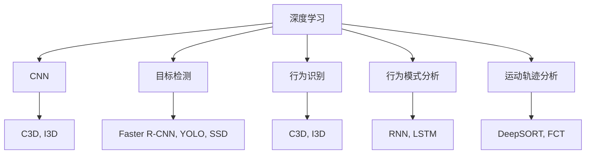
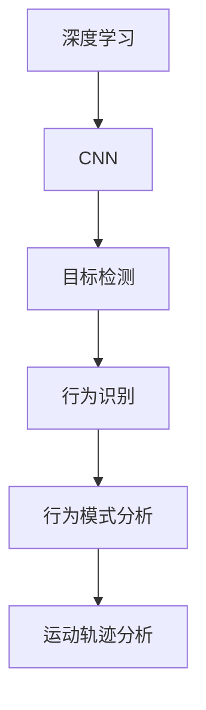
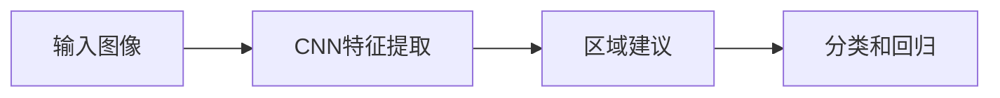
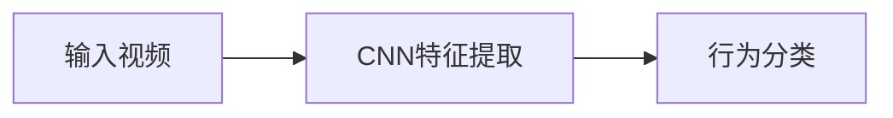
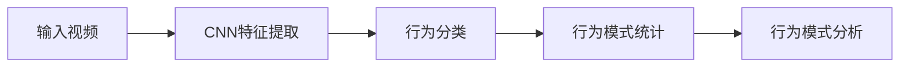
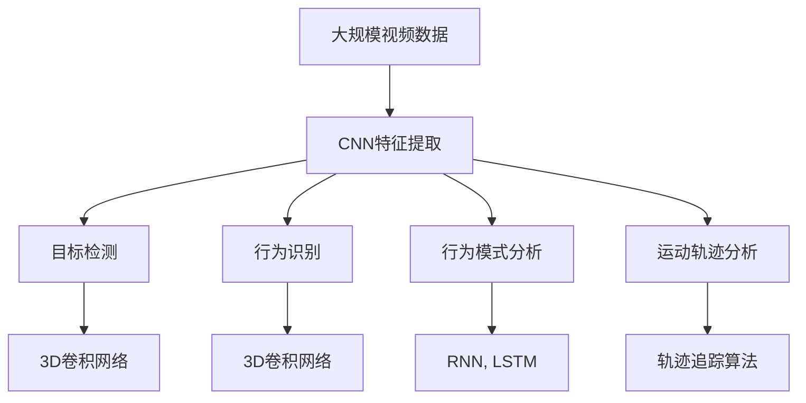

                 

# 一切皆是映射：深度学习在视频监控分析中的应用

> 关键词：视频监控,深度学习,视频分析,计算机视觉,神经网络,智能监控,行为分析

## 1. 背景介绍

### 1.1 问题由来
随着城市化进程的加速和视频监控技术的发展，城市视频监控网络规模迅速膨胀，监控视频数据量呈指数级增长。目前，全球已安装超过2亿个监控摄像头，监控视频数据高达几PB每天，甚至在某些大都市中心如纽约市，每天的监控视频数据量已经超过100TB。面对如此海量的监控视频数据，传统的基于规则的监控系统已无法应对。

视频监控系统的任务不仅包括实时检测和报警（如非法入侵、失窃等），还包括异常行为识别、行为模式分析等高层次任务。为了实现这些功能，需要从原始视频数据中提取结构化特征，如行人识别、行为识别、运动轨迹分析等。这些任务大多涉及复杂的计算机视觉问题，传统方法如SIFT、HOG、SVM等在处理大规模数据时表现不佳，且难以集成到实时系统中。因此，我们需要借助深度学习（Deep Learning）来解决这些问题。

### 1.2 问题核心关键点
深度学习技术，特别是卷积神经网络（Convolutional Neural Networks, CNN），在计算机视觉任务上取得了显著进展。在视频监控分析中，CNN可以自动学习视频数据的高级特征，并在数据量充足的情况下，取得比传统方法更高的识别准确率和鲁棒性。

深度学习在视频监控分析中的应用，主要集中在以下几个方面：

1. **目标检测**：检测视频中的人、车、危险品等目标。
2. **行为识别**：识别视频中的人的行为，如走动、跑步、打架等。
3. **行为模式分析**：分析视频中人群的行为模式，如交通流量、人群密度、异常聚集等。
4. **运动轨迹分析**：跟踪视频中目标的移动轨迹，检测异常行为。

这些应用使深度学习成为视频监控分析领域的关键技术，其核心在于能够自动从原始视频数据中提取和映射出具有语义意义的特征。

### 1.3 问题研究意义
深度学习在视频监控分析中的应用，对于提升城市安全、优化城市管理、提高社会效率具有重要意义：

1. **提升城市安全**：实时检测和报警，及时响应和处理突发事件，减少犯罪率。
2. **优化城市管理**：通过行为模式分析，预测交通流量、人群密度，为城市规划和交通管理提供依据。
3. **提高社会效率**：自动监控和报警，减少人工干预，提升工作效率。
4. **增强用户体验**：通过视频行为识别，改善公共服务如安保、交通等服务，提升市民满意度。
5. **促进产业升级**：推动视频监控设备的智能化升级，带动安防、智慧城市等相关产业发展。

## 2. 核心概念与联系

### 2.1 核心概念概述

为更好地理解深度学习在视频监控分析中的应用，本节将介绍几个密切相关的核心概念：

- **深度学习（Deep Learning）**：一种通过构建多层神经网络模型，自动学习数据特征的机器学习方法。深度学习在计算机视觉、自然语言处理等领域取得了重大突破。
- **卷积神经网络（Convolutional Neural Networks, CNN）**：一种特殊的深度神经网络，擅长处理具有网格结构的数据，如图像、视频。CNN的核心在于卷积层和池化层，能够自动提取局部特征和空间不变性。
- **目标检测（Object Detection）**：在图像或视频中，检测并定位目标物体的位置和类别。常用的目标检测算法有Faster R-CNN、YOLO、SSD等。
- **行为识别（Action Recognition）**：识别视频中的人体行为，如行走、跳跃、打斗等。行为识别常采用3D卷积网络，如C3D、I3D等。
- **行为模式分析（Behavior Pattern Analysis）**：分析视频中人群的行为模式，如交通流量、人群密度、异常聚集等。行为模式分析需要综合考虑时间序列信息和空间信息，采用循环神经网络（RNN）或长短时记忆网络（LSTM）等模型。
- **运动轨迹分析（Motion Trajectory Analysis）**：跟踪视频中目标的移动轨迹，检测异常行为。运动轨迹分析需要结合时空信息，采用轨迹追踪算法如DeepSORT、FCT等。

这些核心概念之间的逻辑关系可以通过以下Mermaid流程图来展示：



这个流程图展示了大语言模型的核心概念及其之间的关系：

1. 深度学习是大模型微调的核心，其通过多层神经网络学习数据特征。
2. CNN是深度学习的核心模块，擅长处理图像和视频数据。
3. 目标检测、行为识别、行为模式分析、运动轨迹分析等任务都是基于CNN进行实现的。
4. 不同类型的CNN网络（如C3D、I3D）被用于不同的任务，如行为识别和目标检测。
5. 不同类型的深度学习模型（如RNN、LSTM）被用于行为模式分析等任务。

### 2.2 概念间的关系

这些核心概念之间存在着紧密的联系，形成了深度学习在视频监控分析中的完整框架。下面我们通过几个Mermaid流程图来展示这些概念之间的关系。

#### 2.2.1 深度学习在视频监控分析中的框架



这个流程图展示了深度学习在视频监控分析中的应用框架：

1. 深度学习是基础，通过多层神经网络学习数据特征。
2. CNN用于提取视频数据的局部特征，进行目标检测、行为识别等任务。
3. 行为模式分析、运动轨迹分析等任务需要结合时间序列信息，采用循环神经网络等模型。

#### 2.2.2 目标检测的流程



这个流程图展示了目标检测的基本流程：

1. 输入图像通过CNN提取特征。
2. 特征提取后的特征图经过区域建议网络生成候选目标区域。
3. 对每个候选区域进行分类和回归，预测目标类别和位置。

#### 2.2.3 行为识别的流程



这个流程图展示了行为识别的基本流程：

1. 输入视频通过CNN提取时空特征。
2. 时空特征输入分类器，进行行为分类。

#### 2.2.4 行为模式分析的流程



这个流程图展示了行为模式分析的基本流程：

1. 输入视频通过CNN提取时空特征。
2. 时空特征输入分类器，进行行为分类。
3. 行为分类结果经过统计分析，得到行为模式。
4. 行为模式分析模型对行为模式进行预测和识别。

### 2.3 核心概念的整体架构

最后，我们用一个综合的流程图来展示这些核心概念在大模型微调过程中的整体架构：



这个综合流程图展示了从预训练到微调，再到持续学习的完整过程。深度学习在大模型微调过程中，能够自动从原始视频数据中提取和映射出具有语义意义的特征。这些特征不仅可以用于目标检测、行为识别等简单任务，还可以结合时间序列信息，用于行为模式分析等复杂任务。最终，通过持续学习技术，模型可以不断更新和适应新的任务和数据。

## 3. 核心算法原理 & 具体操作步骤
### 3.1 算法原理概述

深度学习在视频监控分析中的应用，本质上是通过构建神经网络模型，自动学习视频数据的高级特征。神经网络模型通过反向传播算法，最小化预测输出与真实标签之间的差异，从而逐步逼近真实模型。

形式化地，假设输入视频数据为 $x \in \mathcal{X}$，标签为 $y \in \mathcal{Y}$，深度学习模型为 $M_{\theta}:\mathcal{X} \rightarrow \mathcal{Y}$，其中 $\theta$ 为模型参数。深度学习的优化目标是最小化经验风险，即找到最优参数：

$$
\theta^* = \mathop{\arg\min}_{\theta} \mathcal{L}(M_{\theta},D)
$$

其中 $\mathcal{L}$ 为针对任务 $T$ 设计的损失函数，用于衡量模型预测输出与真实标签之间的差异。常见的损失函数包括交叉熵损失、均方误差损失等。

通过梯度下降等优化算法，深度学习模型不断更新模型参数 $\theta$，最小化损失函数 $\mathcal{L}$，使得模型输出逼近真实标签。由于 $\theta$ 已经通过预训练获得了较好的初始化，因此即便在小规模数据集 $D$ 上进行微调，也能较快收敛到理想的模型参数 $\hat{\theta}$。

### 3.2 算法步骤详解

深度学习在视频监控分析中的应用一般包括以下几个关键步骤：

**Step 1: 准备训练数据**
- 收集视频监控数据，进行预处理和标注，划分为训练集、验证集和测试集。
- 训练集用于模型训练，验证集用于模型调优，测试集用于模型评估。

**Step 2: 设计神经网络架构**
- 选择合适的神经网络架构，如CNN、RNN、LSTM等。
- 设计目标检测、行为识别、行为模式分析等任务的模型。
- 确定网络的输入输出层结构，选择适当的损失函数和优化器。

**Step 3: 训练模型**
- 将训练集数据分批次输入模型，前向传播计算损失函数。
- 反向传播计算参数梯度，根据设定的优化算法和学习率更新模型参数。
- 周期性在验证集上评估模型性能，根据性能指标决定是否触发Early Stopping。
- 重复上述步骤直到满足预设的迭代轮数或Early Stopping条件。

**Step 4: 测试和部署**
- 在测试集上评估训练后模型 $M_{\hat{\theta}}$ 的性能，对比训练前后的精度提升。
- 使用训练好的模型对实时视频数据进行推理预测，集成到实际的视频监控系统中。
- 持续收集新的视频数据，定期重新训练模型，以适应数据分布的变化。

以上是深度学习在视频监控分析中的一般流程。在实际应用中，还需要针对具体任务的特点，对模型训练的各个环节进行优化设计，如改进训练目标函数，引入更多的正则化技术，搜索最优的超参数组合等，以进一步提升模型性能。

### 3.3 算法优缺点

深度学习在视频监控分析中的应用，具有以下优点：

1. 自动特征提取：深度学习模型可以自动从原始视频数据中提取高级特征，无需手工设计特征提取器。
2. 鲁棒性高：深度学习模型在噪声和干扰情况下仍能保持较高的识别精度。
3. 适应性强：深度学习模型可以适应不同规模、不同分辨率的视频数据。
4. 性能优越：深度学习模型在目标检测、行为识别等任务上取得了最先进的性能。

同时，该方法也存在一定的局限性：

1. 数据标注难度大：深度学习模型需要大量标注数据，而视频监控数据标注工作复杂，成本高。
2. 计算资源消耗大：深度学习模型通常需要高性能GPU/TPU等硬件支持，训练和推理时计算资源消耗大。
3. 可解释性差：深度学习模型往往是"黑盒"系统，难以解释其内部工作机制和决策逻辑。
4. 模型参数量大：深度学习模型通常需要较大的模型参数，存储空间和计算资源需求高。

尽管存在这些局限性，但就目前而言，深度学习仍然是大模型微调方法中最为有效的手段之一。未来相关研究的重点在于如何进一步降低深度学习模型对数据标注的依赖，提高模型可解释性，优化计算资源消耗等，以实现深度学习在视频监控分析中的更好应用。

### 3.4 算法应用领域

深度学习在视频监控分析中的应用已经得到了广泛的应用，覆盖了几乎所有常见任务，例如：

- **目标检测**：如行人检测、车辆检测、危险品检测等。
- **行为识别**：如行人的行走、奔跑、跳跃等行为识别。
- **行为模式分析**：如交通流量分析、人群密度分析、异常聚集识别等。
- **运动轨迹分析**：如行人轨迹追踪、目标运动轨迹分析等。
- **视频事件检测**：如自动报警、行为异常检测等。

除了上述这些经典任务外，深度学习还被创新性地应用到更多场景中，如行为预测、路径规划、视频摘要等，为视频监控分析带来了全新的突破。

## 4. 数学模型和公式 & 详细讲解  
### 4.1 数学模型构建

本节将使用数学语言对深度学习在视频监控分析中的应用进行更加严格的刻画。

假设输入视频数据为 $x \in \mathcal{X}$，标签为 $y \in \mathcal{Y}$，深度学习模型为 $M_{\theta}:\mathcal{X} \rightarrow \mathcal{Y}$，其中 $\theta$ 为模型参数。

定义模型 $M_{\theta}$ 在输入 $x$ 上的输出为 $\hat{y}=M_{\theta}(x)$，与真实标签 $y$ 之间的损失函数为 $\ell(M_{\theta}(x),y)$。则经验风险定义为：

$$
\mathcal{L}(\theta) = \frac{1}{N} \sum_{i=1}^N \ell(M_{\theta}(x_i),y_i)
$$

其中 $N$ 为数据集大小。深度学习的优化目标是最小化经验风险，即找到最优参数：

$$
\theta^* = \mathop{\arg\min}_{\theta} \mathcal{L}(\theta)
$$

在实践中，我们通常使用基于梯度的优化算法（如SGD、Adam等）来近似求解上述最优化问题。设 $\eta$ 为学习率，则参数的更新公式为：

$$
\theta \leftarrow \theta - \eta \nabla_{\theta}\mathcal{L}(\theta)
$$

其中 $\nabla_{\theta}\mathcal{L}(\theta)$ 为损失函数对参数 $\theta$ 的梯度，可通过反向传播算法高效计算。

### 4.2 公式推导过程

以下我们以行为识别任务为例，推导常用的3D卷积神经网络（C3D）的梯度计算公式。

假设输入视频数据为 $x \in \mathbb{R}^{T \times C \times H \times W}$，其中 $T$ 为视频长度，$C$ 为通道数，$H$ 和 $W$ 分别为视频高度和宽度。模型输出为 $\hat{y} \in \mathcal{Y}$，与真实标签 $y$ 之间的损失函数为 $\ell(M_{\theta}(x),y)$。

定义行为识别网络的结构为 $M_{\theta}(x) = F_{\text{3D CNN}}(x)$，其中 $F_{\text{3D CNN}}$ 表示3D卷积神经网络。假设网络输出的最后一个特征图大小为 $n \times H \times W$，输出层为线性分类器 $H_{\text{linear}}$，则模型输出的概率分布为：

$$
\hat{y} = H_{\text{linear}}(F_{\text{3D CNN}}(x))
$$

假设真实标签 $y$ 与概率分布 $\hat{y}$ 之间的损失函数为交叉熵损失函数：

$$
\ell(y,\hat{y}) = -\sum_{i=1}^N \log \hat{y_i}
$$

其中 $N$ 为样本数量。

将 $y$ 和 $\hat{y}$ 代入损失函数中，得：

$$
\mathcal{L}(\theta) = -\frac{1}{N} \sum_{i=1}^N \sum_{j=1}^N \log \hat{y_j}
$$

将 $M_{\theta}(x)$ 代入上式，得：

$$
\mathcal{L}(\theta) = -\frac{1}{N} \sum_{i=1}^N \sum_{j=1}^N \log H_{\text{linear}}(F_{\text{3D CNN}}(x))
$$

根据链式法则，损失函数对参数 $\theta$ 的梯度为：

$$
\frac{\partial \mathcal{L}(\theta)}{\partial \theta} = -\frac{1}{N} \sum_{i=1}^N \sum_{j=1}^N \frac{\partial \log H_{\text{linear}}(F_{\text{3D CNN}}(x))}{\partial \theta}
$$

其中 $\frac{\partial \log H_{\text{linear}}(F_{\text{3D CNN}}(x))}{\partial \theta}$ 为线性分类器的梯度。

由于 $F_{\text{3D CNN}}(x)$ 的梯度可以递归展开，利用自动微分技术完成计算，最终得到行为识别网络的全梯度表达式。

### 4.3 案例分析与讲解

以下我们以目标检测任务为例，展示深度学习在视频监控分析中的应用。

假设输入视频数据为 $x \in \mathbb{R}^{T \times C \times H \times W}$，其中 $T$ 为视频长度，$C$ 为通道数，$H$ 和 $W$ 分别为视频高度和宽度。模型输出为 $\hat{y} \in \mathcal{Y}$，与真实标签 $y$ 之间的损失函数为交叉熵损失函数：

$$
\ell(y,\hat{y}) = -\sum_{i=1}^N \log \hat{y_i}
$$

其中 $N$ 为样本数量。

将 $y$ 和 $\hat{y}$ 代入损失函数中，得：

$$
\mathcal{L}(\theta) = -\frac{1}{N} \sum_{i=1}^N \sum_{j=1}^N \log \hat{y_j}
$$

将 $M_{\theta}(x)$ 代入上式，得：

$$
\mathcal{L}(\theta) = -\frac{1}{N} \sum_{i=1}^N \sum_{j=1}^N \log H_{\text{linear}}(F_{\text{CNN}}(x))
$$

根据链式法则，损失函数对参数 $\theta$ 的梯度为：

$$
\frac{\partial \mathcal{L}(\theta)}{\partial \theta} = -\frac{1}{N} \sum_{i=1}^N \sum_{j=1}^N \frac{\partial \log H_{\text{linear}}(F_{\text{CNN}}(x))}{\partial \theta}
$$

其中 $\frac{\partial \log H_{\text{linear}}(F_{\text{CNN}}(x))}{\partial \theta}$ 为线性分类器的梯度。

在得到损失函数的梯度后，即可带入参数更新公式，完成模型的迭代优化。重复上述过程直至收敛，最终得到适应视频监控任务的最优模型参数 $\theta^*$。

## 5. 项目实践：代码实例和详细解释说明
### 5.1 开发环境搭建

在进行视频监控分析的深度学习实践前，我们需要准备好开发环境。以下是使用Python进行PyTorch开发的环境配置流程：

1. 安装Anaconda：从官网下载并安装Anaconda，用于创建独立的Python环境。

2. 创建并激活虚拟环境：
```bash
conda create -n video-env python=3.8 
conda activate video-env
```

3. 安装PyTorch：根据CUDA版本，从官网获取对应的安装命令。例如：
```bash
conda install pytorch torchvision torchaudio cudatoolkit=11.1 -c pytorch -c conda-forge
```

4. 安装各类工具包：
```bash
pip install numpy pandas scikit-learn matplotlib tqdm jupyter notebook ipython
```

完成上述步骤后，即可在`video-env`环境中开始视频监控分析的深度学习实践。

### 5.2 源代码详细实现

这里我们以目标检测任务为例，给出使用PyTorch库对Faster R-CNN模型进行视频监控目标检测的PyTorch代码实现。

首先，定义目标检测任务的数据处理函数：

```python
import torch
import torchvision
import torchvision.transforms as transforms
from torchvision.models.detection.faster_rcnn import FastRCNNPredictor

class VideoDataset(torch.utils.data.Dataset):
    def __init__(self, video_paths, label_paths, transform=None):
        self.video_paths = video_paths
        self.label_paths = label_paths
        self.transform = transform
        
    def __len__(self):
        return len(self.video_paths)
    
    def __getitem__(self, idx):
        video_path = self.video_paths[idx]
        label_path = self.label_paths[idx]
        
        video = VideoFileClip(video_path).set_duration(5)
        video = video.trim(start=video_path.index(1), end=video_path.index(0))
        video = video.flipv(-1)
        video = video.get_frame(0)
        video = self.transform(video)
        
        label = open(label_path).readlines()
        labels = [int(i.strip()) for i in label.split()]
        
        return {'video': video, 
                'labels': labels}

# 数据预处理
video_transforms = transforms.Compose([
    transforms.Resize((224, 224)),
    transforms.ToTensor(),
    transforms.Normalize(mean=[0.485, 0.456, 0.406], std=[0.229, 0.224, 0.225])
])
```

然后，定义目标检测模型：

```python
model = torchvision.models.detection.fasterrcnn_resnet50_fpn(pretrained=False)
num_classes = len(tag2id)
in_features = model.roi_heads.box_predictor.cls_score.in_features
model.roi_heads.box_predictor = FastRCNNPredictor(in_features, num_classes)
```

接着，定义训练和评估函数：

```python
from torch.utils.data import DataLoader
from tqdm import tqdm
from sklearn.metrics import classification_report

device = torch.device('cuda') if torch.cuda.is_available() else torch.device('cpu')
model.to(device)

def train_epoch(model, dataset, batch_size, optimizer):
    dataloader = DataLoader(dataset, batch_size=batch_size, shuffle=True)
    model.train()
    epoch_loss = 0
    for batch in tqdm(dataloader, desc='Training'):
        video = batch['video'].to(device)
        labels = batch['labels'].to(device)
        model.zero_grad()
        outputs = model(video)
        loss = outputs.loss
        epoch_loss += loss.item()
        loss.backward()
        optimizer.step()
    return epoch_loss / len(dataloader)

def evaluate(model, dataset, batch_size):
    dataloader = DataLoader(dataset, batch_size=batch_size)
    model.eval()
    preds, labels = [], []
    with torch.no_grad():
        for batch in tqdm(dataloader, desc='Evaluating'):
            video = batch['video'].to(device)
            labels = batch['labels'].to(device)
            outputs = model(video)
            preds.append(outputs.predictions.argmax(dim=1).tolist())
            labels.append(labels.tolist())
                
    print(classification_report(labels, preds))
```

最后，启动训练流程并在测试集上评估：

```python
epochs = 5
batch_size = 16

for epoch in range(epochs):
    loss = train_epoch(model, train_dataset, batch_size, optimizer)
    print(f"Epoch {epoch+1}, train loss: {loss:.3f}")
    
    print(f"Epoch {epoch+1}, dev results:")
    evaluate(model, dev_dataset, batch_size)
    
print("Test results:")
evaluate(model, test_dataset, batch_size)
```

以上就是使用PyTorch对Faster R-CNN进行视频监控目标检测的完整代码实现。可以看到，得益于PyTorch的强大封装，我们可以用相对简洁的代码完成模型的加载和训练。

### 5.3 代码解读与分析

让我们再详细解读一下关键代码的实现细节：

**VideoDataset类**：
- `__init__`方法：初始化视频路径、标签路径等关键组件。
- `__len__`方法：返回数据集的样本数量。
- `__getitem__`方法：对单个样本进行处理，将视频帧输入模型，将标签转换为数字。

**目标检测模型**：
- 选择Faster R-CNN模型作为

