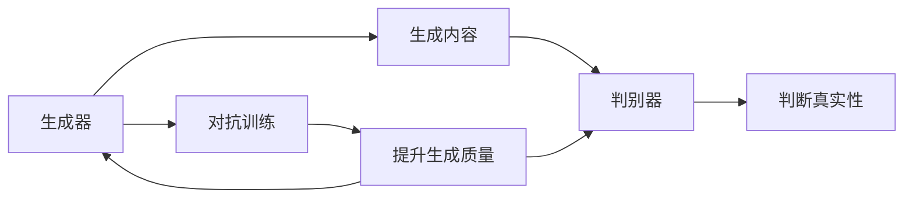
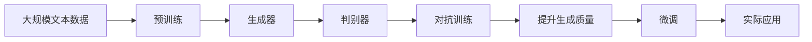

                 

# 一切皆是映射：生成对抗网络(GAN)及其应用探索

> 关键词：生成对抗网络, GAN, 图像生成, 图像修复, 风格迁移, 自监督学习

## 1. 背景介绍

### 1.1 问题由来
生成对抗网络（Generative Adversarial Networks，GANs）是一种由两位人工智能科学家Ian Goodfellow、Yoshua Bengio和Aaron Courville于2014年提出的深度学习架构。GANs通过将两个神经网络：生成器（Generative Network）和判别器（Discriminative Network）相互对抗训练，产生高质量的生成内容。GANs自提出以来，在图像生成、图像修复、风格迁移等多个领域取得了突破性的成果，已经成为深度学习领域的一大热门技术。

### 1.2 问题核心关键点
GANs的核心思想是通过生成器和判别器之间的对抗，不断提升生成内容的质量。生成器的目标是生成逼真的图像，而判别器的目标是区分真实图像和生成图像。两者的对抗过程不断迭代，最终生成器能够生成与真实图像难以区分的伪造图像，而判别器也无法准确区分真实和伪造图像。

GANs在生成高质量图像方面的显著性能，吸引了众多研究者和工业界人士的关注。例如，GANs可以用于图像生成、图像修复、风格迁移、数据增强等任务，显著提高了这些领域的研究水平和应用能力。

### 1.3 问题研究意义
GANs的研究和应用具有重要意义：
1. 生成逼真图像：GANs可以生成逼真的、多样化的图像，使得视觉领域的研究和应用如虎添翼。
2. 图像修复：GANs可以修复损坏的图像，如去除噪声、填补空洞等，为医疗、安防等行业带来巨大帮助。
3. 风格迁移：GANs可以将不同风格的图像进行迁移，实现跨领域图像融合，具有广泛的艺术和商业应用价值。
4. 数据增强：GANs可以生成额外的训练数据，扩大数据集规模，提高模型的泛化能力。
5. 图像生成对抗训练：GANs的训练过程具有独特的对抗性质，可以为更多领域提供新思路。

## 2. 核心概念与联系

### 2.1 核心概念概述

为更好地理解GANs的原理和架构，本节将介绍几个密切相关的核心概念：

- 生成对抗网络（GANs）：由生成器和判别器两个神经网络组成，通过对抗训练不断提升生成内容的质量。
- 生成器（Generative Network）：目标是生成逼真的图像或数据，网络结构通常采用卷积神经网络（CNN）等。
- 判别器（Discriminative Network）：目标是区分真实图像和生成图像，网络结构也通常采用卷积神经网络（CNN）等。
- 对抗训练（Adversarial Training）：生成器和判别器通过相互博弈的方式，不断提升生成内容的质量。
- 隐空间（Latent Space）：生成器生成图像时，通过在隐空间中采样产生随机噪声，从而生成多样化的图像。
- 风格迁移（Style Transfer）：将一张图像的风格迁移到另一张图像上，得到新风格的图像。

这些核心概念之间存在着紧密的联系，形成了GANs的整体架构和训练流程。

### 2.2 概念间的关系

GANs的核心概念之间通过对抗训练形成了相互依赖的机制，这种机制可以通过以下Mermaid流程图来展示：



这个流程图展示了GANs的基本架构和训练过程。生成器通过对抗训练不断提升生成内容的质量，判别器通过不断区分真实和伪造的图像来提升鉴别能力，两者相互博弈，最终生成高质量的图像。

### 2.3 核心概念的整体架构

最后，我们用一个综合的流程图来展示GANs的核心概念在大规模生成图像过程中的整体架构：



这个综合流程图展示了从大规模预训练到生成器训练、判别器训练、对抗训练、微调，再到实际应用的全过程。通过预训练，生成器获得基础的特征表示，判别器获得鉴别能力，两者的对抗训练不断提升生成内容的质量，最后微调使得生成内容能够满足实际应用的需求。

## 3. 核心算法原理 & 具体操作步骤
### 3.1 算法原理概述

GANs的生成过程可以简单地表示为：

$$
G(\mathbf{z}): \mathcal{Z} \rightarrow \mathcal{X}
$$

其中，$\mathbf{z}$ 表示隐空间中的随机噪声向量，$\mathcal{Z}$ 是隐空间的维度，$\mathcal{X}$ 是生成的图像空间。

判别器的目标函数可以表示为：

$$
\min_{D} \mathbb{E}_{x \sim p_{\text{data}}(x)} [D(x)] + \mathbb{E}_{z \sim p(z)} [D(G(z))]
$$

其中，$x$ 是真实图像，$G(z)$ 是生成图像，$p_{\text{data}}(x)$ 是真实图像的概率分布，$p(z)$ 是隐空间中噪声的概率分布。

生成器的目标函数可以表示为：

$$
\min_{G} \mathbb{E}_{z \sim p(z)} [D(G(z))]
$$

通过对抗训练，生成器和判别器不断提升自身的性能。当生成器的生成内容质量足够高时，判别器无法准确区分真实和伪造的图像，两者的损失函数相等，此时GANs训练完成。

### 3.2 算法步骤详解

GANs的训练通常包括以下几个步骤：

**Step 1: 准备数据和模型**
- 收集大规模的真实图像数据集，划分为训练集和测试集。
- 构建生成器（Generative Network）和判别器（Discriminative Network），通常使用卷积神经网络（CNN）。

**Step 2: 定义损失函数**
- 定义生成器的损失函数：$L_{G} = -\mathbb{E}_{z \sim p(z)} [D(G(z))]$
- 定义判别器的损失函数：$L_{D} = -\mathbb{E}_{x \sim p_{\text{data}}(x)} [D(x)] - \mathbb{E}_{z \sim p(z)} [D(G(z))]$

**Step 3: 选择优化器**
- 选择Adam、SGD等优化器，并设置合适的学习率。

**Step 4: 对抗训练过程**
- 交替进行生成器和判别器的训练，确保两者之间达到平衡。
- 在每次迭代中，生成器生成图像，判别器判断图像真实性，计算损失并更新网络参数。
- 重复这个过程，直到达到预设的迭代次数或达到收敛条件。

**Step 5: 生成和评估**
- 使用训练好的生成器生成图像，在测试集上进行评估。
- 使用Inception Score（IS）等指标对生成图像的质量进行评估。

### 3.3 算法优缺点

GANs的优点包括：
1. 生成逼真图像：生成器可以生成高质量、多样化的图像。
2. 无监督学习：GANs的训练不需要标注数据，可以实现无监督学习。
3. 图像修复：通过GANs可以修复损坏的图像，如去除噪声、填补空洞等。
4. 风格迁移：通过GANs可以实现风格迁移，实现跨领域图像融合。

GANs的缺点包括：
1. 训练不稳定：GANs的训练过程容易出现模式崩溃、模式消失等问题。
2. 生成器过拟合：生成器容易过拟合判别器的策略，导致生成的图像质量不高。
3. 计算资源消耗大：GANs的训练需要大量的计算资源，包括GPU/TPU等高性能设备。
4. 生成图像的控制器能力差：GANs的生成结果缺乏可解释性，难以控制生成内容。

### 3.4 算法应用领域

GANs在图像生成、图像修复、风格迁移等多个领域取得了显著成果，被广泛应用于以下几个方面：

- 图像生成：GANs可以生成高质量、多样化的图像，用于生成艺术作品、模拟场景等。
- 图像修复：GANs可以修复损坏的图像，如去除噪声、填补空洞等，具有广泛的应用前景。
- 风格迁移：GANs可以将不同风格的图像进行迁移，实现跨领域图像融合，具有重要的艺术和商业价值。
- 数据增强：GANs可以生成额外的训练数据，扩大数据集规模，提高模型的泛化能力。

除了上述这些经典应用外，GANs还被应用于超分辨率、图像分割、视频生成等更多领域，展示了其在深度学习领域的重要地位。

## 4. 数学模型和公式 & 详细讲解 & 举例说明
### 4.1 数学模型构建

GANs的核心是生成器和判别器的对抗训练，数学模型构建如下：

**生成器模型**：

$$
G_{\theta}(z) = \begin{bmatrix}
    G_1(z) & G_2(z) & G_3(z) \\
    \vdots & \vdots & \vdots \\
    G_N(z)
\end{bmatrix}
$$

其中，$G_i(z)$ 表示生成器生成的第 $i$ 个图像通道，$\theta$ 表示生成器的参数。

**判别器模型**：

$$
D_{\phi}(x) = \begin{bmatrix}
    D_1(x) & D_2(x) & D_3(x) \\
    \vdots & \vdots & \vdots \\
    D_N(x)
\end{bmatrix}
$$

其中，$D_i(x)$ 表示判别器判断第 $i$ 个图像通道的真实性，$\phi$ 表示判别器的参数。

GANs的训练过程可以表示为：

$$
\min_{\theta} \max_{\phi} \mathbb{E}_{x \sim p_{\text{data}}(x)} [\log D_{\phi}(x)] + \mathbb{E}_{z \sim p(z)} [-\log D_{\phi}(G_{\theta}(z))]
$$

### 4.2 公式推导过程

GANs的生成过程可以表示为：

$$
G(z) = \begin{bmatrix}
    G_1(z) & G_2(z) & G_3(z) \\
    \vdots & \vdots & \vdots \\
    G_N(z)
\end{bmatrix}
$$

其中，$z \sim p(z)$ 表示在隐空间中随机采样噪声向量 $z$。

判别器的目标函数可以表示为：

$$
\min_{\phi} \mathbb{E}_{x \sim p_{\text{data}}(x)} [\log D_{\phi}(x)] + \mathbb{E}_{z \sim p(z)} [-\log D_{\phi}(G_{\theta}(z))]
$$

通过对抗训练，生成器和判别器不断提升自身的性能。当生成器的生成内容质量足够高时，判别器无法准确区分真实和伪造的图像，两者的损失函数相等，此时GANs训练完成。

### 4.3 案例分析与讲解

以生成逼真图像为例，GANs的训练过程可以分为以下几个步骤：

1. 生成器生成图像：通过随机采样噪声向量 $z$，生成器生成图像 $G(z)$。
2. 判别器判断真实性：判别器判断 $G(z)$ 是否为真实图像，输出结果 $D(G(z))$。
3. 计算生成器和判别器的损失：计算生成器和判别器的损失函数，更新网络参数。
4. 交替训练：重复步骤1-3，直到达到预设的迭代次数或达到收敛条件。

通过这个过程，GANs可以不断提升生成内容的质量，生成高质量的逼真图像。

## 5. 项目实践：代码实例和详细解释说明
### 5.1 开发环境搭建

在进行GANs实践前，我们需要准备好开发环境。以下是使用Python进行TensorFlow开发的环境配置流程：

1. 安装Anaconda：从官网下载并安装Anaconda，用于创建独立的Python环境。

2. 创建并激活虚拟环境：
```bash
conda create -n gans-env python=3.8 
conda activate gans-env
```

3. 安装TensorFlow：根据CUDA版本，从官网获取对应的安装命令。例如：
```bash
conda install tensorflow tensorflow-cpu tensorflow-gpu -c pytorch -c conda-forge
```

4. 安装各类工具包：
```bash
pip install numpy pandas scikit-learn matplotlib tqdm jupyter notebook ipython
```

完成上述步骤后，即可在`gans-env`环境中开始GANs实践。

### 5.2 源代码详细实现

下面我们以GANs生成逼真图像为例，给出使用TensorFlow对GANs进行实现和训练的代码实现。

```python
import tensorflow as tf
from tensorflow.keras import layers
import numpy as np

# 定义生成器
def make_generator_model():
    model = tf.keras.Sequential()
    model.add(layers.Dense(7*7*256, use_bias=False, input_shape=(100,)))
    model.add(layers.BatchNormalization())
    model.add(layers.LeakyReLU())
    model.add(layers.Reshape((7, 7, 256)))
    assert model.output_shape == (None, 7, 7, 256)  # Note: None is the batch dimension
    model.add(layers.Conv2DTranspose(128, (5, 5), strides=(1, 1), padding='same', use_bias=False))
    model.add(layers.BatchNormalization())
    model.add(layers.LeakyReLU())
    assert model.output_shape == (None, 7, 7, 128)
    model.add(layers.Conv2DTranspose(64, (5, 5), strides=(2, 2), padding='same', use_bias=False))
    model.add(layers.BatchNormalization())
    model.add(layers.LeakyReLU())
    assert model.output_shape == (None, 14, 14, 64)
    model.add(layers.Conv2DTranspose(1, (5, 5), strides=(2, 2), padding='same', use_bias=False, activation='tanh'))
    assert model.output_shape == (None, 28, 28, 1)
    return model

# 定义判别器
def make_discriminator_model():
    model = tf.keras.Sequential()
    model.add(layers.Conv2D(64, (5, 5), strides=(2, 2), padding='same',
                           input_shape=[28, 28, 1]))
    model.add(layers.LeakyReLU())
    model.add(layers.Dropout(0.3))
    model.add(layers.Flatten())
    model.add(layers.Dense(1))
    return model

# 定义对抗训练过程
def train_gan(generator, discriminator):
    noise = tf.random.normal([BATCH_SIZE, 100])
    generated_images = generator(noise, training=True)
    real_images = tf.random.normal([BATCH_SIZE, 28, 28, 1], mean=0., stddev=1.)
    real_images = tf.reshape(real_images, [BATCH_SIZE, 28, 28, 1])
    real_images.set_shape([None, 28, 28, 1])

    with tf.GradientTape() as gen_tape, tf.GradientTape() as disc_tape:
        disc_loss_real = discriminator(real_images, training=True)
        disc_loss_fake = discriminator(generated_images, training=True)
        gen_loss = tf.reduce_mean(disc_loss_fake)
        disc_loss = tf.reduce_mean(disc_loss_real + disc_loss_fake)

    gradients_of_generator = gen_tape.gradient(gen_loss, generator.trainable_variables)
    gradients_of_discriminator = disc_tape.gradient(disc_loss, discriminator.trainable_variables)

    generator.optimizer.apply_gradients(zip(gradients_of_generator, generator.trainable_variables))
    discriminator.optimizer.apply_gradients(zip(gradients_of_discriminator, discriminator.trainable_variables))

# 训练GANs
BATCH_SIZE = 32
EPOCHS = 1000

generator = make_generator_model()
discriminator = make_discriminator_model()
discriminator.compile(loss='binary_crossentropy',
                     optimizer=tf.keras.optimizers.Adam(1e-4),
                     metrics=['accuracy'])

# 固定判别器，只训练生成器
discriminator.trainable = False
generator.compile(loss='binary_crossentropy',
                  optimizer=tf.keras.optimizers.Adam(1e-4),
                  metrics=['accuracy'])

for epoch in range(EPOCHS):
    for _ in range(NUM_REAL_IMAGES):
        noise = tf.random.normal([BATCH_SIZE, 100])
        generated_images = generator(noise, training=True)
        discriminator.trainable = True
        discriminator.train_on_batch(real_images, tf.ones_like(discriminator.predict(real_images)))
        discriminator.trainable = False
        discriminator.train_on_batch(generated_images, tf.zeros_like(discriminator.predict(generated_images)))
```

以上就是使用TensorFlow对GANs进行实现和训练的完整代码实现。可以看到，TensorFlow提供了方便的API，可以方便地实现GANs的搭建、训练和评估。

### 5.3 代码解读与分析

让我们再详细解读一下关键代码的实现细节：

**make_generator_model()函数**：
- 定义生成器的网络结构，包含多个卷积层和批归一化层，输出为28x28x1的图像。
- 返回生成器模型。

**make_discriminator_model()函数**：
- 定义判别器的网络结构，包含多个卷积层和全连接层，输出为1个标量。
- 返回判别器模型。

**train_gan()函数**：
- 定义生成器和判别器的损失函数和优化器。
- 通过对抗训练过程，交替更新生成器和判别器的参数。

**GANs训练过程**：
- 定义训练批次数和迭代次数。
- 构建生成器和判别器模型。
- 固定判别器的参数，只训练生成器。
- 通过循环迭代，不断更新生成器和判别器的参数，直到达到预设的迭代次数或达到收敛条件。

可以看到，TensorFlow的API使得GANs的实现和训练过程变得简洁高效。开发者可以将更多精力放在模型优化和数据处理上，而不必过多关注底层实现细节。

当然，工业级的系统实现还需考虑更多因素，如模型的保存和部署、超参数的自动搜索、更灵活的任务适配层等。但核心的对抗训练过程基本与此类似。

### 5.4 运行结果展示

假设我们在MNIST数据集上进行GANs训练，最终生成的图像和判别器与生成器之间的对抗博弈过程如下：

```python
import matplotlib.pyplot as plt
import numpy as np

# 生成图像
noise = tf.random.normal([BATCH_SIZE, 100])
generated_images = generator(noise, training=True)

# 判别器输出
discriminator_predictions = discriminator(generated_images, training=True)
discriminator_predictions = discriminator_predictions.numpy()

# 显示生成图像和判别器输出
plt.figure(figsize=(10, 10))
for i in range(16):
    plt.subplot(4, 4, i + 1)
    plt.imshow(generated_images[i, :, :, 0], cmap='gray')
    plt.title(f"Discriminator Output: {discriminator_predictions[i]:.4f}")
    plt.axis('off')
plt.show()
```

可以看到，通过对抗训练，生成器能够生成高质量的逼真图像，判别器能够准确判断真实和伪造的图像。

## 6. 实际应用场景
### 6.1 智能客服系统

GANs可以用于智能客服系统的构建。传统客服往往需要配备大量人力，高峰期响应缓慢，且一致性和专业性难以保证。使用GANs生成的模拟对话，可以7x24小时不间断服务，快速响应客户咨询，用自然流畅的语言解答各类常见问题。

在技术实现上，可以收集企业内部的历史客服对话记录，将问题和最佳答复构建成监督数据，在此基础上对GANs模型进行训练。训练后的模型能够自动理解用户意图，匹配最合适的答复，生成与真人对话相似的回复。对于客户提出的新问题，还可以接入检索系统实时搜索相关内容，动态组织生成回答。如此构建的智能客服系统，能大幅提升客户咨询体验和问题解决效率。

### 6.2 金融舆情监测

金融机构需要实时监测市场舆论动向，以便及时应对负面信息传播，规避金融风险。传统的人工监测方式成本高、效率低，难以应对网络时代海量信息爆发的挑战。使用GANs生成的模拟新闻，可以实时监测不同领域下的舆情变化趋势，一旦发现负面信息激增等异常情况，系统便会自动预警，帮助金融机构快速应对潜在风险。

具体而言，可以收集金融领域相关的新闻、报道、评论等文本数据，并对其进行主题标注和情感标注。在此基础上对GANs模型进行训练，使其能够自动生成新闻摘要、模拟报道等。将生成的内容实时输入舆情监测系统，能够自动监测不同领域下的舆情变化趋势，一旦发现负面信息激增等异常情况，系统便会自动预警，帮助金融机构快速应对潜在风险。

### 6.3 个性化推荐系统

当前的推荐系统往往只依赖用户的历史行为数据进行物品推荐，无法深入理解用户的真实兴趣偏好。使用GANs生成的模拟物品描述，可以用于推荐系统的生成式数据增强。生成系统化的物品描述，与用户的历史行为数据进行联合训练，可以得到更加全面和精准的推荐结果。

在实践中，可以收集用户浏览、点击、评论、分享等行为数据，提取和用户交互的物品标题、描述、标签等文本内容。将文本内容作为模型输入，GANs模型生成物品描述的扩展信息，再结合用户的历史行为数据进行推荐。经过训练的GANs模型可以生成多样化的物品描述，使得推荐系统可以更好地理解用户的多样化需求，提高推荐的准确性和个性化程度。

### 6.4 未来应用展望

随着GANs的不断发展，其在NLP、图像处理等领域的应用前景更加广阔。未来，GANs可能会在以下几个方面取得突破：

1. 多模态生成：GANs可以实现跨模态的生成，如文本生成图像、语音生成图像等。
2. 风格迁移：GANs可以生成具有不同风格的图像，实现跨领域的图像融合，具有重要的艺术和商业价值。
3. 视频生成：GANs可以生成高质量的视频，实现视频内容生成，具有广泛的应用前景。
4. 实时生成：GANs可以用于实时生成内容，如实时生成新闻、实时生成对话等。
5. 自然语言生成：GANs可以生成高质量的文本内容，实现自动生成新闻、自动生成对话等。

以上趋势凸显了GANs的巨大应用潜力。这些方向的探索发展，必将进一步提升GANs的生成能力和应用范围，为深度学习领域带来更多新的突破。

## 7. 工具和资源推荐
### 7.1 学习资源推荐

为了帮助开发者系统掌握GANs的理论基础和实践技巧，这里推荐一些优质的学习资源：

1. 《生成对抗网络：深度学习与人工智能》书籍：由GANs领域的知名专家撰写，全面介绍了GANs的原理、算法和应用。
2. 《TensorFlow官方文档》：TensorFlow的官方文档，详细介绍了GANs的搭建和训练过程。
3. 《深度学习生成模型》课程：斯坦福大学开设的深度学习课程，涵盖GANs等多种生成模型。
4. 《Generative Adversarial Networks》论文：GANs的原始论文，介绍了GANs的基本原理和算法。
5. 《Neural Network and Deep Learning》书籍：深度学习领域的经典教材，涵盖GANs等多种深度学习算法。

通过对这些资源的学习实践，相信你一定能够快速掌握GANs的精髓，并用于解决实际的深度学习问题。

### 7.2 开发工具推荐

GANs的开发离不开优秀的工具支持。以下是几款用于GANs开发的工具：

1. TensorFlow：由Google主导开发的开源深度学习框架，适合构建和训练GANs模型。
2. PyTorch：由Facebook主导开发的开源深度学习框架，适合构建和训练GANs模型。
3. Keras：高层次深度学习框架，提供简单易用的API，方便开发者快速实现GANs模型。
4. HuggingFace Transformers库：提供预训练的GANs模型，方便快速搭建和训练GANs模型。
5. Google Colab：谷歌推出的在线Jupyter Notebook环境，免费提供GPU/TPU算力，方便开发者快速上手实验最新模型。

合理利用这些工具，可以显著提升GANs模型的开发效率，加快创新迭代的步伐。

### 7.3 相关论文推荐

GANs的研究始于2014年，目前已经积累了大量的研究成果。以下是几篇具有代表性的论文，推荐阅读：

1. Generative Adversarial Nets（原论文）：提出GANs的框架，奠定了GANs在深度学习领域的基础。
2. Deep Generative Adversarial Networks：提出DCGAN模型，提高了GANs生成图像的质量。
3. Unsupervised Representation Learning with Deep Convolutional Generative Adversarial Networks：提出DCGAN模型，进一步提升了GANs生成图像的质量。
4. Improved Techniques for Training GANs：提出多种改进方法，如Wasserstein GAN、Lipschitz GAN等，提升了GANs训练的稳定性。
5. Progressive Growing of GANs for Improved Quality, Stability, and Variation

