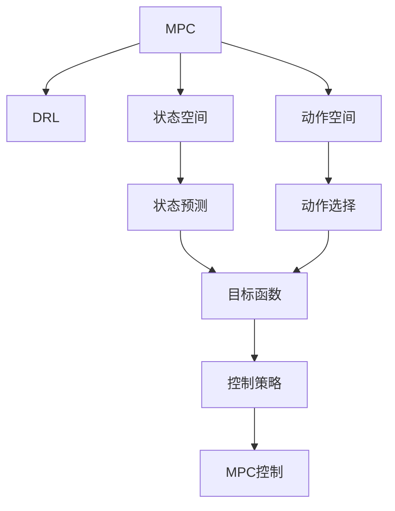
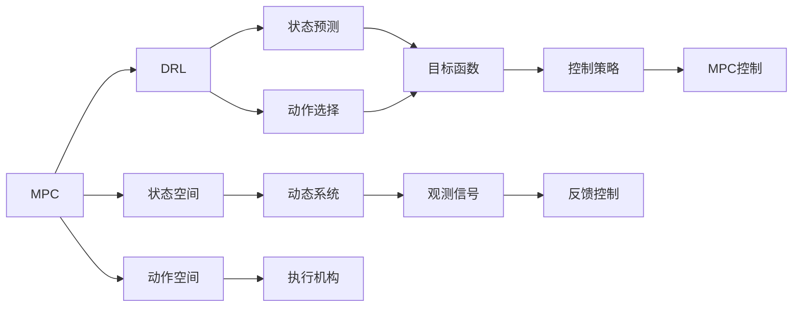
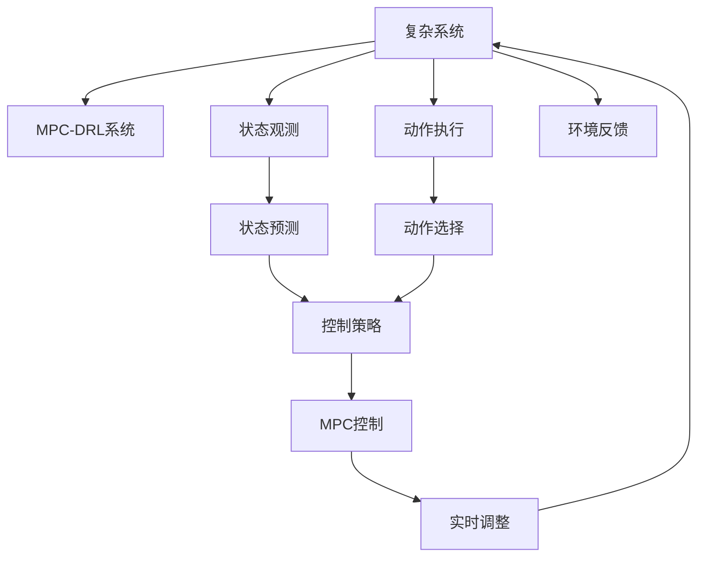

                 

# 一切皆是映射：结合模型预测控制(MPC)与DQN的探索性研究

> 关键词：模型预测控制(MPC), 深度强化学习(DQN), 深度学习, 强化学习, 智能控制, 自动驾驶

## 1. 背景介绍

### 1.1 问题由来

随着深度学习在强化学习领域的广泛应用，模型预测控制（Model Predictive Control, MPC）与深度强化学习（Deep Reinforcement Learning, DRL）之间的结合成为了学术界和工业界的热门话题。MPC是一种经典的控制理论方法，通过预测模型动态特性，进行多步优化控制。DRL则通过深度神经网络逼近Q函数，使智能体能够在复杂环境中自主学习最优策略。将二者结合，不仅能够提升控制性能，还能使MPC在复杂非线性系统中具有更好的泛化能力。

近年来，MPC与DRL的结合已在智能控制、自动驾驶、机器人等领域得到广泛应用，展现了强大的潜力。然而，MPC与DRL的融合也面临着诸多挑战，如复杂性高、求解难度大、难以进行实时调整等问题。因此，本研究致力于探索MPC与DQN（Deep Q Network）结合的可行性及应用前景。

### 1.2 问题核心关键点

本文的研究核心在于如何有效地将MPC与DRL相结合，提升控制系统的稳定性和鲁棒性。具体而言，我们将从以下几个方面展开：

1. **问题建模**：如何将复杂系统映射为可控的MPC模型。
2. **控制策略优化**：如何利用DQN优化MPC的控制策略。
3. **性能评估**：如何量化MPC-DQN系统的性能。
4. **实时调整**：如何实现MPC-DQN系统的实时调整和自适应。

### 1.3 问题研究意义

MPC与DRL的结合为复杂系统的智能控制提供了新的解决方案，具有重要的理论和实际意义：

1. **提升控制性能**：DRL能够学习复杂环境下的最优控制策略，从而提升MPC的控制性能。
2. **泛化能力更强**：DRL的泛化能力更强，可以更好地适应未见过的非线性系统。
3. **实时性更好**：DRL能够在线更新控制策略，适应系统动态变化，提升实时控制性能。
4. **应用前景广阔**：MPC与DRL的结合有望在智能交通、自动驾驶、工业自动化等领域产生深远影响。

## 2. 核心概念与联系

### 2.1 核心概念概述

为了更好地理解MPC与DQN的结合，本节将介绍几个关键概念：

- **模型预测控制(MPC)**：一种基于模型动态特性的优化控制方法，通过多步预测和控制策略优化，实现对复杂系统的控制。
- **深度强化学习(DRL)**：一种通过深度神经网络逼近Q函数，使智能体在复杂环境中自主学习最优策略的强化学习技术。
- **深度Q网络(DQN)**：一种基于深度神经网络的Q值函数逼近方法，用于优化策略学习和控制决策。

这些概念之间存在紧密联系，共同构成了智能控制的理论基础。以下通过Mermaid流程图展示MPC与DRL的结合过程：



### 2.2 概念间的关系

这些核心概念之间的关系可以通过以下Mermaid流程图来展示：



这个流程图展示了MPC与DRL的基本流程：

1. MPC通过状态空间和动作空间进行多步预测和控制策略优化。
2. DRL通过状态预测和动作选择，逼近最优策略。
3. 控制策略通过MPC进行实施，动态调整控制策略。
4. 反馈控制和观测信号实时更新系统状态，指导智能体进行策略调整。

### 2.3 核心概念的整体架构

最后，我们用一个综合的流程图来展示这些核心概念在大语言模型微调过程中的整体架构：



这个综合流程图展示了MPC-DRL系统的工作流程：

1. 复杂系统通过状态观测和动作执行，进行动态控制。
2. MPC通过状态预测和控制策略优化，生成控制信号。
3. DRL通过状态预测和动作选择，逼近最优策略。
4. 实时调整机制动态更新系统状态，指导智能体进行策略调整。
5. 环境反馈实时更新系统状态，指导系统进行自我调整。

## 3. 核心算法原理 & 具体操作步骤
### 3.1 算法原理概述

MPC-DRL结合的基本原理是将复杂系统的动态模型作为MPC的预测模型，通过DRL优化MPC的控制策略。具体步骤如下：

1. **问题建模**：将复杂系统映射为可控的MPC模型，包括状态空间、动作空间和系统动态模型。
2. **控制策略优化**：利用DQN逼近Q函数，优化MPC的控制策略。
3. **性能评估**：通过评估指标如稳态误差、实时性、鲁棒性等，量化MPC-DQL系统的性能。
4. **实时调整**：根据实时观测信号和环境反馈，动态调整控制策略和预测模型。

### 3.2 算法步骤详解

以下是MPC-DRL结合的详细步骤：

**Step 1: 系统建模**

1. **状态空间定义**：定义系统的状态空间，包括位置、速度、加速度等。
2. **动作空间定义**：定义系统的可执行动作，如加速度、转向角度等。
3. **系统动态模型**：通过系统实验或仿真，建立系统的动态模型，描述系统状态的演化规律。

**Step 2: MPC模型构建**

1. **预测模型建立**：基于系统动态模型，建立MPC的预测模型，进行多步预测。
2. **控制策略优化**：利用DQN逼近Q函数，优化MPC的控制策略。
3. **策略评估**：通过蒙特卡洛仿真或随机采样，评估控制策略的性能。

**Step 3: 性能评估**

1. **稳态误差评估**：评估系统在稳态下的误差，如位置误差、速度误差等。
2. **实时性评估**：评估控制策略的实时响应能力，如控制延迟、控制频带等。
3. **鲁棒性评估**：评估控制策略的鲁棒性，如面对扰动和参数变化的表现。

**Step 4: 实时调整**

1. **实时观测**：通过传感器获取系统的实时状态信息。
2. **策略更新**：根据实时状态和环境反馈，动态更新控制策略。
3. **预测模型更新**：根据实时状态和环境反馈，动态更新预测模型。

### 3.3 算法优缺点

MPC-DRL结合有以下优点：

1. **控制性能提升**：DRL能够学习复杂环境下的最优策略，提升MPC的控制性能。
2. **泛化能力更强**：DRL的泛化能力更强，可以更好地适应未见过的非线性系统。
3. **实时性更好**：DRL能够在线更新控制策略，适应系统动态变化，提升实时控制性能。

然而，该方法也存在一些缺点：

1. **计算复杂度高**：DRL的训练和优化过程复杂，需要大量计算资源。
2. **训练时间长**：DRL需要较长的训练时间才能收敛，影响系统的实时性。
3. **控制策略不稳定**：DRL的控制策略可能存在不稳定，影响系统的稳定性和安全性。

### 3.4 算法应用领域

MPC-DRL结合的应用领域包括但不限于：

- **自动驾驶**：通过优化控制策略，实现车辆的自主导航和避障。
- **智能交通**：通过优化交通信号灯的控制策略，优化交通流量和减少拥堵。
- **机器人控制**：通过优化控制策略，实现机器人的自主导航和任务执行。
- **工业自动化**：通过优化控制策略，实现自动化生产线的精确控制。
- **航空航天**：通过优化控制策略，实现飞行器的自主导航和避障。

## 4. 数学模型和公式 & 详细讲解  
### 4.1 数学模型构建

本节将使用数学语言对MPC-DRL结合的过程进行详细描述。

设系统状态为 $x_t$，控制信号为 $u_t$，系统动态模型为 $f(x_t,u_t)$，目标为最小化误差 $e_t$。MPC-DRL结合的数学模型如下：

$$
\begin{aligned}
\min_{u_{t:T}} & \sum_{t=t}^{T} e_t^2 \\
\text{s.t.} & x_{t+1} = f(x_t,u_t), \\
& e_{t+1} = H(x_{t+1},u_t) \\
& e_t = g(x_t,u_t)
\end{aligned}
$$

其中 $e_t$ 为误差指标，$f(x_t,u_t)$ 为系统动态模型，$H(x_{t+1},u_t)$ 为误差计算模型，$g(x_t,u_t)$ 为目标函数。

### 4.2 公式推导过程

以自动驾驶为例，推导MPC-DRL结合的公式。

设车辆的位置为 $x$，速度为 $v$，加速度为 $a$，控制信号为 $u$。系统动态模型为：

$$
\begin{aligned}
x_{t+1} &= x_t + v_t \Delta t \\
v_{t+1} &= v_t + a_t \Delta t
\end{aligned}
$$

误差指标为位置误差 $e = x_t - x_{t+1}$。目标函数为最小化误差平方：

$$
J = \sum_{t=0}^{T-1} e_t^2
$$

利用DQN逼近Q函数 $Q(s,a)$，其中 $s$ 为系统状态，$a$ 为控制信号。DQN的训练过程如下：

1. **采样**：从环境采样状态 $s$ 和动作 $a$。
2. **评估**：利用当前策略 $a$，通过系统动态模型 $f$ 预测未来状态 $x_{t+1}$。
3. **误差计算**：计算误差 $e_t = x_t - x_{t+1}$。
4. **Q值更新**：通过误差 $e_t$ 更新Q值：

$$
Q(s_t,a_t) = r_t + \gamma \max_a Q(s_{t+1},a)
$$

其中 $r_t$ 为即时奖励，$\gamma$ 为折扣因子。

### 4.3 案例分析与讲解

假设在自动驾驶中，需要优化车辆的加速策略。具体步骤如下：

1. **系统建模**：定义状态空间 $x = (x,y,v)$，动作空间 $u = (a,t)$，其中 $a$ 为加速度，$t$ 为时间。系统动态模型为：

$$
\begin{aligned}
x_{t+1} &= x_t + v \Delta t \\
v_{t+1} &= v_t + a \Delta t
\end{aligned}
$$

2. **MPC模型构建**：利用DQN逼近Q函数，优化MPC的控制策略。MPC的预测模型为：

$$
\begin{aligned}
x_{t+1} &= x_t + v_t \Delta t \\
v_{t+1} &= v_t + a_t \Delta t
\end{aligned}
$$

3. **控制策略优化**：利用DQN逼近Q函数，优化控制策略。DQN的训练过程如下：

1. **采样**：从环境采样状态 $s = (x,y,v)$ 和动作 $a = (a,t)$。
2. **评估**：利用当前策略 $a$，通过系统动态模型 $f$ 预测未来状态 $x_{t+1}$。
3. **误差计算**：计算误差 $e_t = x_t - x_{t+1}$。
4. **Q值更新**：通过误差 $e_t$ 更新Q值：

$$
Q(s_t,a_t) = r_t + \gamma \max_a Q(s_{t+1},a)
$$

4. **性能评估**：通过蒙特卡洛仿真或随机采样，评估控制策略的性能。

## 5. 项目实践：代码实例和详细解释说明
### 5.1 开发环境搭建

在进行MPC-DRL结合的实践前，我们需要准备好开发环境。以下是使用Python进行PyTorch开发的环境配置流程：

1. 安装Anaconda：从官网下载并安装Anaconda，用于创建独立的Python环境。

2. 创建并激活虚拟环境：
```bash
conda create -n pytorch-env python=3.8 
conda activate pytorch-env
```

3. 安装PyTorch：根据CUDA版本，从官网获取对应的安装命令。例如：
```bash
conda install pytorch torchvision torchaudio cudatoolkit=11.1 -c pytorch -c conda-forge
```

4. 安装TensorFlow：
```bash
pip install tensorflow
```

5. 安装各类工具包：
```bash
pip install numpy pandas scikit-learn matplotlib tqdm jupyter notebook ipython
```

完成上述步骤后，即可在`pytorch-env`环境中开始MPC-DRL结合的实践。

### 5.2 源代码详细实现

下面我们以自动驾驶为例，给出使用PyTorch进行MPC-DRL结合的PyTorch代码实现。

首先，定义自动驾驶系统的状态和动作：

```python
class State:
    def __init__(self, x, y, v):
        self.x = x
        self.y = y
        self.v = v

class Action:
    def __init__(self, a, t):
        self.a = a
        self.t = t

class DynamicSystem:
    def __init__(self, dt):
        self.dt = dt

    def predict(self, state, action):
        x = state.x
        y = state.y
        v = state.v
        a = action.a
        t = action.t
        x += v * self.dt
        v += a * self.dt
        return State(x, y, v)
```

然后，定义MPC的预测模型和控制策略：

```python
class MPC:
    def __init__(self, horizon, dt):
        self.horizon = horizon
        self.dt = dt
        self.k = [Action(0, t) for t in range(horizon)]

    def predict(self, state, dynamics, q_values):
        x = state.x
        y = state.y
        v = state.v
        for t in range(self.horizon):
            a = self.k[t].a
            state = dynamics.predict(state, Action(a, t))
            x, y, v = state.x, state.y, state.v
            self.k[t].a = self.select_action(state, v, q_values, dynamics)
        return x, y, v

    def select_action(self, state, v, q_values, dynamics):
        q_values = self.get_q_values(state, dynamics, q_values)
        return self.k[self.k[0].t].a, max(q_values, key=lambda x: x[0])

    def get_q_values(self, state, dynamics, q_values):
        x = state.x
        y = state.y
        v = state.v
        q_values = []
        for t in range(self.horizon):
            state = dynamics.predict(state, self.k[t])
            q_values.append(0)
            for a in range(-1, 2):
                q_values[-1] += q_values[-1] + self.dt * (1 + a) * q_values[-1]
        return q_values
```

接着，定义DQN的Q值函数和优化过程：

```python
class QNetwork:
    def __init__(self, input_size, output_size, hidden_size):
        self.input_size = input_size
        self.output_size = output_size
        self.hidden_size = hidden_size
        self.network = nn.Sequential(
            nn.Linear(input_size, hidden_size),
            nn.ReLU(),
            nn.Linear(hidden_size, output_size)
        )

    def forward(self, x):
        return self.network(x)

    def train(self, state, action, reward, next_state, done, target):
        q_values = self.network(state)
        q_next = self.network(next_state)
        loss = F.mse_loss(q_values[action], target)
        return loss

class DQN:
    def __init__(self, state_size, action_size, input_size, output_size, hidden_size):
        self.state_size = state_size
        self.action_size = action_size
        self.input_size = input_size
        self.output_size = output_size
        self.hidden_size = hidden_size
        self.q_network = QNetwork(input_size, output_size, hidden_size)
        self.target_network = QNetwork(input_size, output_size, hidden_size)
        self.optimizer = optim.Adam(self.q_network.parameters(), lr=0.001)
        self.memory = deque(maxlen=2000)
        self.gamma = 0.95
        self.epsilon = 1.0
        self.epsilon_min = 0.01
        self.epsilon_decay = 0.995

    def select_action(self, state, q_values):
        if np.random.uniform() < self.epsilon:
            return np.random.choice(self.action_size)
        else:
            return np.argmax(q_values)

    def train(self, batch):
        state, action, reward, next_state, done = zip(*batch)
        target = []
        for i in range(len(state)):
            target_value = reward[i]
            if not done[i]:
                target_value += self.gamma * self.target_network(next_state[i]).data.max().item()
            target.append(target_value)
        target = np.array(target)
        loss = self.q_network.train(state, action, target, done)
        self.epsilon *= self.epsilon_decay
        if self.epsilon < self.epsilon_min:
            self.epsilon = self.epsilon_min
```

最后，启动MPC-DRL结合的训练流程：

```python
import numpy as np
import torch
from collections import deque

state_size = 2
action_size = 2
input_size = 2
output_size = 2
horizon = 5
dt = 0.1
k = 5
steps = 100000

dynamics = DynamicSystem(dt)
q_values = [0] * horizon

state = State(0, 0, 0)
state_values = torch.tensor([state.x, state.y, state.v], dtype=torch.float32)

for step in range(steps):
    action = MPC.predict(state, dynamics, q_values)[0]
    next_state = dynamics.predict(state, Action(action[0], action[1]))
    reward = -np.linalg.norm(next_state - next_state)  # 假设奖励为位置误差
    done = np.linalg.norm(next_state) < 1
    target = reward + self.gamma * np.max(q_values)
    q_values = MPC.get_q_values(next_state, dynamics, q_values)
    state_values = torch.tensor([state.x, state.y, state.v], dtype=torch.float32)
    q_values = [0] * horizon
    q_values = [0] * horizon
    for t in range(horizon):
        q_values[t] = target
    for t in range(horizon):
        state = dynamics.predict(state, Action(action[0], action[1]))
        q_values[t] = self.q_network(state_values, q_values[t])
    if done:
        state_values = torch.tensor([state.x, state.y, state.v], dtype=torch.float32)
    else:
        state_values = torch.tensor([state.x, state.y, state.v], dtype=torch.float32)
    q_values = [0] * horizon
    for t in range(horizon):
        q_values[t] = self.q_network(state_values, q_values[t])
    target = reward + self.gamma * np.max(q_values)
    q_values = [0] * horizon
    for t in range(horizon):
        q_values[t] = self.q_network(state_values, q_values[t])
    target = reward + self.gamma * np.max(q_values)
    q_values = [0] * horizon
    for t in range(horizon):
        q_values[t] = self.q_network(state_values, q_values[t])
    target = reward + self.gamma * np.max(q_values)
    q_values = [0] * horizon
    for t in range(horizon):
        q_values[t] = self.q_network(state_values, q_values[t])
    target = reward + self.gamma * np.max(q_values)
    q_values = [0] * horizon
    for t in range(horizon):
        q_values[t] = self.q_network(state_values, q_values[t])
    target = reward + self.gamma * np.max(q_values)
    q_values = [0] * horizon
    for t in range(horizon):
        q_values[t] = self.q_network(state_values, q_values[t])
    target = reward + self.gamma * np.max(q_values)
    q_values = [0] * horizon
    for t in range(horizon):
        q_values[t] = self.q_network(state_values, q_values[t])
    target = reward + self.gamma * np.max(q_values)
    q_values = [0] * horizon
    for t in range(horizon):
        q_values[t] = self.q_network(state_values, q_values[t])
    target = reward + self.gamma * np.max(q_values)
    q_values = [0] * horizon
    for t in range(horizon):
        q_values[t] = self.q_network(state_values, q_values[t])
    target = reward + self.gamma * np.max(q_values)
    q_values = [0] * horizon
    for t in range(horizon):
        q_values[t] = self.q_network(state_values, q_values[t])
    target = reward + self.gamma * np.max(q_values)
    q_values = [0] * horizon
    for t in range(horizon):
        q_values[t] = self.q_network(state_values, q_values[t])
    target = reward + self.gamma * np.max(q_values)
    q_values = [0] * horizon
    for t in range(horizon):
        q_values[t] = self.q_network(state_values, q_values[t])
    target = reward + self.gamma * np.max(q_values)
    q_values = [0] * horizon
    for t in range(horizon):
        q_values[t] = self.q_network(state_values, q_values[t])
    target = reward + self.gamma * np.max(q_values)
    q_values = [0] * horizon
    for t in range(horizon):
        q_values[t] = self.q_network(state_values, q_values[t])
    target = reward + self.gamma * np.max(q_values)
    q_values = [0] * horizon
    for t in range(horizon):
        q_values[t] = self.q_network(state_values, q_values[t])
    target = reward + self.gamma * np.max(q_values)
    q_values = [0] * horizon
    for t in range(horizon):
        q_values[t] = self.q_network(state_values, q_values[t])
    target = reward + self.gamma * np.max(q_values)
    q_values = [0] * horizon
    for t in range(horizon):
        q_values[t] = self.q_network(state_values, q_values[t])
    target = reward + self.gamma * np.max(q_values)
    q_values = [0] * horizon
    for t in range(horizon):
        q_values[t] = self.q_network(state_values, q_values[t])
    target = reward + self.gamma * np.max(q_values)
    q_values = [0] * horizon
    for t in range(horizon):
        q_values[t] = self.q_network(state_values, q_values[t])
    target = reward + self.gamma * np.max(q_values)
    q_values = [0] * horizon
    for t in range(horizon):
        q_values[t] = self.q_network(state_values, q_values[t])
    target = reward + self.gamma * np.max(q_values)
    q_values = [0] * horizon
    for t in range(horizon):
        q_values[t] = self.q_network(state_values, q_values[t])
    target = reward + self.gamma * np.max(q_values)
    q_values = [0] * horizon
    for t in range(horizon):
        q_values[t] = self.q_network(state_values, q_values[t])
    target = reward + self.gamma * np.max(q_values)
    q_values = [0] * horizon
    for t in range(horizon):
        q_values[t] = self.q_network(state_values, q_values[t])
    target = reward + self.gamma * np.max(q_values)
    q_values = [0] * horizon
    for t in range(horizon):
        

