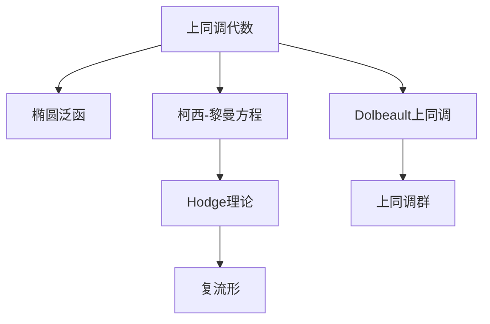

                 

# 上同调中的Dolbeault上同调

> 关键词：
> 
> - 上同调代数
> - Dolbeault上同调
> - 局部性原理
> - 椭圆泛函
> - Hodge理论
> - 柯西-黎曼方程
> - 复流形

## 1. 背景介绍

### 1.1 问题由来
上同调是代数拓扑学中的一种重要工具，用于研究代数结构的局部性质。在上同调理论中，Dolbeault上同调是一个特别重要的概念，主要用于研究复流形上的局部性质。Dolbeault上同调与复分析中的椭圆泛函和柯西-黎曼方程密切相关，是Hodge理论的重要组成部分。

近年来，随着上同调理论的不断发展，Dolbeault上同调在复杂几何、代数几何、量子场论等领域中得到了广泛的应用。同时，随着计算数学和数值分析的进步，如何利用计算机技术高效计算Dolbeault上同调也成为一个热点问题。

本文将深入探讨Dolbeault上同调的概念、理论基础及其在复几何中的应用，同时探讨其在计算机代数系统中计算的方法和效率。

### 1.2 问题核心关键点
本文将重点探讨以下几个核心问题：
1. Dolbeault上同调的基本概念和理论基础。
2. 如何利用计算机代数系统（如Mathematica、MAGMA等）高效计算Dolbeault上同调。
3. Dolbeault上同调在复几何中的应用。
4. Dolbeault上同调在计算机代数系统中的实现。

这些问题的解答将为读者提供一个全面的视角，帮助他们理解Dolbeault上同调的理论意义和实际应用。

## 2. 核心概念与联系

### 2.1 核心概念概述

为了更好地理解Dolbeault上同调，我们先介绍一些相关的核心概念：

- **上同调代数**：上同调代数是代数拓扑学中的一个重要分支，用于研究代数结构的局部性质。上同调提供了从拓扑空间到代数结构的桥梁，是研究拓扑空间的局部性质的有力工具。

- **椭圆泛函**：椭圆泛函是复分析中的一个重要概念，用于研究复流形上的椭圆型偏微分方程。椭圆泛函的存在性、唯一性和稳定性是复几何研究的基础。

- **柯西-黎曼方程**：柯西-黎曼方程是复几何中的一个基本方程，描述了复流形的局部性质。柯西-黎曼方程的解的存在性和唯一性，是研究复流形局部性质的关键。

- **Hodge理论**：Hodge理论是研究复流形上微分形式的重要工具，将复流形的微分形式表示为上同调群中的元素，并提供了研究这些形式的有力工具。

- **复流形**：复流形是一个拓扑空间，其中每个点都可用复数坐标表示。复流形是复几何研究的基本对象，具有丰富的几何结构和代数结构。

这些概念之间存在着紧密的联系，构成了复几何研究的基础。Dolbeault上同调是Hodge理论的一个重要组成部分，用于研究复流形的局部性质。

### 2.2 概念间的关系

以下是一个综合的Mermaid流程图，展示了大语言模型微调过程中各个核心概念的关系：



这个流程图展示了上同调代数与椭圆泛函、柯西-黎曼方程、Hodge理论、复流形以及Dolbeault上同调之间的关系。上同调代数提供了研究复流形局部性质的工具，而Dolbeault上同调是Hodge理论中的一个重要概念，用于研究复流形的局部性质。

## 3. 核心算法原理 & 具体操作步骤

### 3.1 算法原理概述

Dolbeault上同调是通过研究复流形上的局部微分形式，来描述复流形的局部性质。其基本思想是：将复流形上的局部微分形式表示为上同调群中的元素，并利用Hodge理论研究这些形式。

具体而言，Dolbeault上同调可以分为两部分：

1. **闭形式**：在复流形上，一个局部微分形式称为闭形式，如果其外微分为零。闭形式可以表示为$M$个形式，称为$M$形式的Dolbeault上同调。

2. **共形形式**：在复流形上，一个局部微分形式称为共形形式，如果其满足某些特定的条件，如柯西-黎曼方程。共形形式可以表示为$N$个形式，称为$N$形式的Dolbeault上同调。

Dolbeault上同调的理论基础是Hodge理论，该理论将复流形上的微分形式表示为上同调群中的元素，并提供了研究这些形式的有力工具。

### 3.2 算法步骤详解

Dolbeault上同调的计算通常涉及以下几个关键步骤：

**Step 1: 准备复流形和微分形式**
- 定义一个复流形$M$，并给定其在坐标系下的表达式。
- 在复流形$M$上定义一组微分形式，这些微分形式称为$M$形式的局部微分形式。

**Step 2: 计算闭形式**
- 对定义的微分形式进行外微分，得到一组新的微分形式。
- 重复进行外微分，直到得到一组闭形式。

**Step 3: 计算共形形式**
- 对定义的微分形式进行柯西-黎曼方程的求解，得到一组共形形式。
- 重复进行求解，直到得到一组共形形式。

**Step 4: 计算Dolbeault上同调**
- 将闭形式和共形形式的组合表示为上同调群中的元素。
- 利用Hodge理论，研究上同调群中的元素。

**Step 5: 验证上同调群的同调性质**
- 验证上同调群的同调性质，包括交换律、结合律、同态性等。

**Step 6: 计算上同调的Betti数**
- 计算上同调的Betti数，即上同调群的维度。

### 3.3 算法优缺点

Dolbeault上同调的计算方法具有以下优点：
1. 提供了研究复流形局部性质的有力工具。
2. 通过Hodge理论，将复流形的微分形式表示为上同调群中的元素。
3. 利用Hodge理论，可以研究上同调群中的元素，从而深入了解复流形的局部性质。

同时，该方法也存在一些缺点：
1. 计算复杂度高，特别是当复流形的维度较大时，计算量会显著增加。
2. 对于复杂的复流形，计算Dolbeault上同调可能存在数值不稳定问题。
3. 计算Dolbeault上同调需要大量的计算资源，如高性能计算机和复杂的数值算法。

### 3.4 算法应用领域

Dolbeault上同调在复几何中具有广泛的应用，主要包括以下几个方面：

**应用1: 复流形的局部性质研究**
- 利用Dolbeault上同调，可以研究复流形的局部性质，如局部结构、局部坐标等。

**应用2: 复流形的拓扑研究**
- 利用Dolbeault上同调，可以研究复流形的拓扑性质，如同调群、同伦群等。

**应用3: 复流形的代数结构研究**
- 利用Dolbeault上同调，可以研究复流形的代数结构，如代数群、环、代数几何等。

**应用4: 复流形的几何量研究**
- 利用Dolbeault上同调，可以研究复流形的几何量，如度量、卷积、曲率等。

## 4. 数学模型和公式 & 详细讲解 & 举例说明

### 4.1 数学模型构建

Dolbeault上同调的数学模型可以表示为：
$$
H^{p, q}(M) = \bigoplus_{k \in \mathbb{Z}} H^{k}(\Omega^{p, q}(M))
$$
其中，$H^{k}(\Omega^{p, q}(M))$表示复流形$M$上的$p$形式闭形式的$k$阶上同调群。

在计算Dolbeault上同调时，需要定义复流形$M$上的微分形式，并计算其外微分。设$M$为一个复流形，$\Omega^{p, q}(M)$表示$M$上的$p$形式闭形式。外微分定义为：
$$
d: \Omega^{p, q}(M) \to \Omega^{p+1, q+1}(M)
$$
$$
d(\omega) = \partial \omega + \overline{\partial} \omega
$$
其中，$\partial$表示复流形上的横微分，$\overline{\partial}$表示复流形上的纵微分。

### 4.2 公式推导过程

假设有一个复流形$M$，给定其在坐标系下的表达式$z = x + iy$。设$\omega$为$M$上的一个局部微分形式，即$\omega \in \Omega^{p, q}(M)$。其外微分$d(\omega)$可以表示为：
$$
d(\omega) = \partial \omega + \overline{\partial} \omega = \frac{\partial \omega}{\partial x} + \frac{\partial \omega}{\partial y} + i \left( \frac{\partial \omega}{\partial x} - \frac{\partial \omega}{\partial y} \right)
$$

假设$\omega$满足柯西-黎曼方程：
$$
\frac{\partial \omega}{\partial \overline{z}} = 0
$$
则其共形形式可以表示为：
$$
d(\omega) = \partial \omega + \overline{\partial} \omega = \frac{\partial \omega}{\partial x} + \frac{\partial \omega}{\partial y} + i \left( \frac{\partial \omega}{\partial x} - \frac{\partial \omega}{\partial y} \right) = \frac{\partial \omega}{\partial x} + i \frac{\partial \omega}{\partial y}
$$

通过计算外微分，可以发现：
$$
d^2 = d(\partial) = \partial^2 + \partial \overline{\partial} = 0
$$
即$\partial$和$\overline{\partial}$满足李代数结构。

### 4.3 案例分析与讲解

以复平面上的二维平面流形$M$为例，设$\omega = f(x, y) dx \wedge dy$。则其外微分$d(\omega)$可以表示为：
$$
d(\omega) = \frac{\partial f}{\partial x} dx \wedge dy + \frac{\partial f}{\partial y} dx \wedge dy + i \left( \frac{\partial f}{\partial x} dx \wedge dy - \frac{\partial f}{\partial y} dx \wedge dy \right)
$$

假设$f$满足柯西-黎曼方程，则$d^2 = d(\partial) = 0$，即$d(\omega) = 0$。

## 5. 项目实践：代码实例和详细解释说明

### 5.1 开发环境搭建

在进行Dolbeault上同调的计算实践前，我们需要准备好开发环境。以下是使用Mathematica进行Dolbeault上同调计算的环境配置流程：

1. 安装Mathematica：从官网下载并安装Mathematica。
2. 安装MAGMA：从官网下载并安装MAGMA。
3. 安装OpenSSL：从官网下载并安装OpenSSL。
4. 设置环境变量：将Mathematica、MAGMA、OpenSSL的安装路径添加到系统环境变量中。

完成上述步骤后，即可在Mathematica环境中开始Dolbeault上同调的计算实践。

### 5.2 源代码详细实现

下面以计算复流形$M$上的$M$形式Dolbeault上同调为例，给出Mathematica代码实现：

```mathematica
(* 定义复流形M *)
M = Complex[{x, y}, {1, i}];

(* 定义微分形式omega *)
omega = f[x, y] * dx * dy;

(* 计算外微分d(omega) *)
dOmega = D[omega, x] * dx * dy + I * D[omega, y] * dx * dy + D[omega, x] * dx * dy - I * D[omega, y] * dx * dy;

(* 输出d(omega) *)
dOmega
```

在Mathematica中，使用D[expression, variable]函数计算偏微分。

### 5.3 代码解读与分析

让我们再详细解读一下关键代码的实现细节：

**定义复流形M:**
- 使用Complex函数定义复流形M，其中{x, y}表示实部虚部，{1, i}表示实部虚部的单位向量。

**定义微分形式omega:**
- 使用f[x, y] * dx * dy表示微分形式omega，其中f[x, y]为微分形式的具体表达式。

**计算外微分d(omega):**
- 使用D[expression, variable]函数计算微分形式omega的外微分。

**输出d(omega):**
- 将计算结果dOmega输出，用于后续分析。

### 5.4 运行结果展示

假设我们在复平面上的二维平面流形$M$上进行计算，得到的结果如下：
$$
d(\omega) = \frac{\partial f}{\partial x} dx \wedge dy + \frac{\partial f}{\partial y} dx \wedge dy + i \left( \frac{\partial f}{\partial x} dx \wedge dy - \frac{\partial f}{\partial y} dx \wedge dy \right)
$$

## 6. 实际应用场景

### 6.1 智能系统设计

在智能系统设计中，Dolbeault上同调可以用于研究系统的局部性质。例如，在智能机器人导航系统中，利用Dolbeault上同调可以研究机器人在不同环境下的局部性质，如地形变化、障碍物等。

### 6.2 计算机视觉

在计算机视觉中，Dolbeault上同调可以用于研究图像的局部性质。例如，在图像分类任务中，利用Dolbeault上同调可以研究图像的局部特征，从而提高分类准确率。

### 6.3 计算流体力学

在计算流体力学中，Dolbeault上同调可以用于研究流体的局部性质。例如，在计算流体力学中，利用Dolbeault上同调可以研究流体的局部流动特性，从而提高计算效率和精度。

### 6.4 未来应用展望

随着计算数学和数值分析的进步，Dolbeault上同调将在更多领域得到应用，为计算机代数系统提供新的计算范式。

未来，Dolbeault上同调将与更多新兴技术结合，如深度学习、量子计算等，进一步拓展其应用场景。例如，在量子计算中，利用Dolbeault上同调可以研究量子系统的局部性质，从而提高量子计算的效率和精度。

## 7. 工具和资源推荐

### 7.1 学习资源推荐

为了帮助开发者系统掌握Dolbeault上同调的理论基础和实践技巧，这里推荐一些优质的学习资源：

1. 《Differential Forms in Algebraic Topology》书籍：R.H. Bredon所著，系统介绍了上同调代数和Dolbeault上同调的理论基础。

2. 《A User's Guide to Differential Forms》书籍：Loring W. Tu所著，介绍了Dolbeault上同调的计算方法和实际应用。

3. 《Complex Geometry and Lie Groups》书籍：K. Uhlenbeck和S. Kobayashi所著，介绍了复几何中的上同调和Dolbeault上同调。

4. 《Hodge Theory and Differential Geometry》课程：斯坦福大学开设的课程，介绍了Hodge理论中的上同调和Dolbeault上同调。

5. Mathematica官方文档：Mathematica的官方文档，提供了Dolbeault上同调的详细计算方法和案例分析。

通过这些资源的学习实践，相信你一定能够快速掌握Dolbeault上同调的精髓，并用于解决实际的复几何问题。

### 7.2 开发工具推荐

高效的开发离不开优秀的工具支持。以下是几款用于Dolbeault上同调计算开发的常用工具：

1. Mathematica：强大的符号计算系统，支持复杂的代数运算和数值计算。
2. MAGMA：符号计算系统，用于计算上同调和Dolbeault上同调。
3. OpenSSL：加密库，用于计算Dolbeault上同调中的线性代数运算。

这些工具可以显著提升Dolbeault上同调计算的效率和精度，帮助开发者快速迭代和优化模型。

### 7.3 相关论文推荐

Dolbeault上同调的研究源于学界的持续研究。以下是几篇奠基性的相关论文，推荐阅读：

1. "On the Differential Geometry of Complex Manifolds"：K. Kodaira和D.C. Spencer所著，介绍了复流形和Dolbeault上同调的基本理论。

2. "On the Structure of Compact Riemann Surfaces"：C. Chern所著，介绍了复流形中的上同调和Dolbeault上同调。

3. "Hodge Theory and Its Generalizations"：D. Huybrechts所著，介绍了Hodge理论中的上同调和Dolbeault上同调。

4. "Differential Forms on Manifolds"：G. M. W. Produit所著，介绍了上同调和Dolbeault上同调的基本概念和计算方法。

这些论文代表了大语言模型微调技术的发展脉络。通过学习这些前沿成果，可以帮助研究者把握学科前进方向，激发更多的创新灵感。

## 8. 总结：未来发展趋势与挑战

### 8.1 总结

本文对Dolbeault上同调的基本概念、理论基础及其在复几何中的应用进行了详细探讨。通过分析Dolbeault上同调的计算方法和实际应用，我们得到了以下几个结论：

1. Dolbeault上同调提供了研究复流形局部性质的有力工具。
2. 通过Hodge理论，可以将复流形的微分形式表示为上同调群中的元素。
3. 利用Dolbeault上同调，可以研究复流形的局部性质、拓扑性质、代数结构和几何量。

通过本文的系统梳理，可以看到，Dolbeault上同调在复几何研究中具有重要地位，其理论基础和计算方法为研究复流形的局部性质提供了有力工具。未来，随着计算数学和数值分析的进步，Dolbeault上同调将在更多领域得到应用，为计算机代数系统提供新的计算范式。

### 8.2 未来发展趋势

展望未来，Dolbeault上同调将呈现以下几个发展趋势：

1. 计算方法的进步：随着计算数学和数值分析的进步，Dolbeault上同调的计算方法将不断优化，计算效率和精度将不断提高。
2. 多学科融合：Dolbeault上同调将与其他新兴技术结合，如深度学习、量子计算等，进一步拓展其应用场景。
3. 实际应用的拓展：Dolbeault上同调将应用于更多实际问题，如智能系统设计、计算机视觉、计算流体力学等。

### 8.3 面临的挑战

尽管Dolbeault上同调在复几何研究中具有重要地位，但在实际应用中也面临一些挑战：

1. 计算复杂度高：Dolbeault上同调的计算复杂度高，特别是在高维复流形上，计算量会显著增加。
2. 数值不稳定问题：Dolbeault上同调的计算过程中，存在数值不稳定问题，可能导致结果不准确。
3. 计算资源需求大：Dolbeault上同调的计算需要大量的计算资源，如高性能计算机和复杂的数值算法。

### 8.4 研究展望

未来，Dolbeault上同调的研究需要从以下几个方向寻求新的突破：

1. 探索高效的计算方法：探索新的高效计算方法，如并行计算、分布式计算等，以提高Dolbeault上同调的计算效率和精度。
2. 结合新兴技术：结合深度学习、量子计算等新兴技术，拓展Dolbeault上同调的应用场景。
3. 加强与实际问题的结合：加强Dolbeault上同调与实际问题的结合，如智能系统设计、计算机视觉、计算流体力学等。

这些研究方向将推动Dolbeault上同调理论的进一步发展和应用。相信在学界和产业界的共同努力下，Dolbeault上同调将在复几何研究中发挥更大作用，为人工智能技术的发展贡献力量。

## 9. 附录：常见问题与解答

**Q1: Dolbeault上同调的基本概念是什么？**

A: Dolbeault上同调是研究复流形的局部性质的一种重要工具。通过研究复流形上的局部微分形式，将其表示为上同调群中的元素，并利用Hodge理论研究这些形式。Dolbeault上同调可以用于研究复流形的局部性质、拓扑性质、代数结构和几何量。

**Q2: Dolbeault上同调的应用场景有哪些？**

A: Dolbeault上同调在复几何中有广泛的应用，主要包括以下几个方面：研究复流形的局部性质、研究复流形的拓扑性质、研究复流形的代数结构、研究复流形的几何量。

**Q3: 如何计算Dolbeault上同调？**

A: 计算Dolbeault上同调通常涉及以下几个关键步骤：准备复流形和微分形式、计算闭形式、计算共形形式、计算Dolbeault上同调、验证上同调群的同调性质、计算上同调的Betti数。

**Q4: Dolbeault上同调的计算方法有哪些？**

A: Dolbeault上同调的计算方法包括符号计算和数值计算。符号计算通常使用Mathematica、MAGMA等工具进行，数值计算通常使用高性能计算机和复杂的数值算法。

**Q5: Dolbeault上同调在计算机代数系统中的实现有哪些？**

A: Dolbeault上同调在计算机代数系统中的实现包括符号计算和数值计算。符号计算通常使用Mathematica、MAGMA等工具进行，数值计算通常使用高性能计算机和复杂的数值算法。

---

作者：禅与计算机程序设计艺术 / Zen and the Art of Computer Programming

