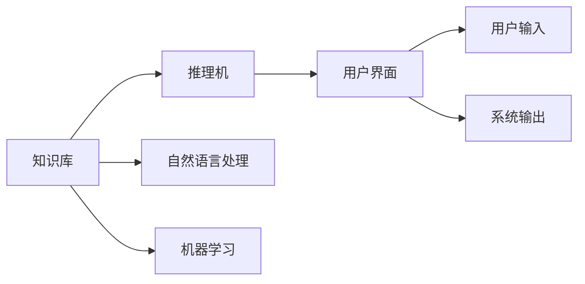
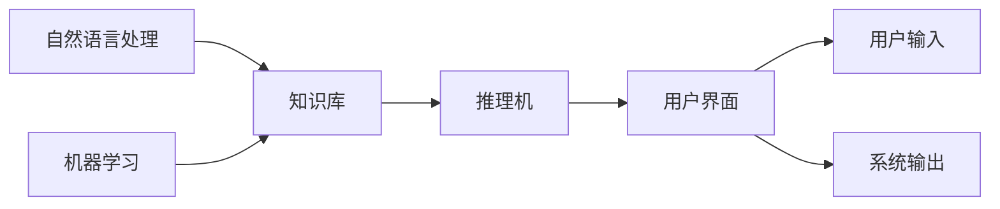

                 

# 专家系统 原理与代码实例讲解

## 1. 背景介绍

### 1.1 问题由来
专家系统（Expert Systems）是人工智能（AI）领域的经典研究内容，旨在通过模拟人类专家的决策过程，构建能够处理特定领域问题并给出专业解答的系统。专家系统最初起源于1960年代末的化学领域，但其核心思想在多个领域（如医学、法律、工程等）得到了广泛应用。专家系统的原理和技术不断发展，近年来，在深度学习和自然语言处理（NLP）的推动下，专家系统进入了新的发展阶段。

### 1.2 问题核心关键点
专家系统基于知识库和推理机制，通过模拟专家判断和决策的逻辑，来实现对特定领域问题的智能处理。主要包含以下几个关键点：
- **知识库（Knowledge Base）**：存储领域专家的知识和经验，以规则或事实的形式。
- **推理机（Inference Engine）**：根据知识库和输入问题，应用推理算法，模拟专家思维过程，得出结论或推荐。
- **用户界面（User Interface）**：供用户输入问题和接收系统输出。

专家系统在知识表示、推理方法、系统设计和应用等方面面临着诸多挑战。其主要目的是通过自动化处理特定领域的问题，提升工作效率和决策质量，但同时也需要处理知识的不确定性、推理的复杂性和系统的可解释性等问题。

### 1.3 问题研究意义
专家系统研究对于提升特定领域的智能化水平、提高工作效率、辅助决策具有重要意义：
- **领域知识的自动化**：将领域专家知识和经验自动化，减少人工劳动，提升决策质量。
- **决策支持**：在医生、律师等高风险领域，专家系统提供决策支持，降低人为失误。
- **知识传承**：将专家知识传承给更多从业者，促进技术普及和教育。
- **智能交互**：提升人与系统间的智能交互，提高人机协同效率。
- **复杂问题的简化**：通过自动推理简化复杂问题，提升问题解决效率。

## 2. 核心概念与联系

### 2.1 核心概念概述
为更好地理解专家系统的核心原理和架构，本节将介绍几个关键概念：

- **知识库（Knowledge Base, KB）**：存储领域专家的知识和经验，以规则或事实的形式。知识库的构建是专家系统的核心。
- **推理机（Inference Engine, IE）**：根据知识库和输入问题，应用推理算法，模拟专家思维过程，得出结论或推荐。推理机的设计是系统性能的关键。
- **用户界面（User Interface, UI）**：供用户输入问题和接收系统输出。UI的设计直接影响用户体验。
- **自然语言处理（Natural Language Processing, NLP）**：将自然语言输入转化为系统可处理的格式，增强系统与用户的交互。
- **机器学习（Machine Learning, ML）**：通过数据分析和算法，增强系统自适应和学习新知识的能力。

这些核心概念通过逻辑推理和用户交互，共同构成了专家系统的基本框架。它们之间的联系和互动，使得专家系统能够高效地处理特定领域的问题。

### 2.2 概念间的关系

专家系统通过知识库和推理机，模拟专家的决策过程，最终通过用户界面向用户提供结果。自然语言处理和机器学习技术，提升了知识库的构建效率和系统对新知识的适应能力。以下是通过Mermaid流程图展示的核心概念之间的关系：



这个流程图展示了专家系统的核心组件及其之间的关系：

1. 知识库存储领域知识，通过自然语言处理和机器学习技术进行构建和更新。
2. 推理机根据知识库和输入问题，应用推理算法，模拟专家思维过程。
3. 用户界面供用户输入问题和接收系统输出，是系统与用户交互的桥梁。

### 2.3 核心概念的整体架构

最终，我们通过一个综合的流程图来展示这些核心概念在专家系统中的整体架构：



这个综合流程图展示了从知识库到推理机，再到用户界面的完整流程。知识库的构建涉及自然语言处理和机器学习技术，推理机根据知识库和用户输入进行推理，最终通过用户界面输出结果。

## 3. 核心算法原理 & 具体操作步骤
### 3.1 算法原理概述

专家系统的核心算法原理包括知识表示、推理方法和用户界面设计。这些算法通过逻辑推理和用户交互，实现对特定领域问题的智能处理。

**知识表示**：将领域知识以规则或事实的形式存储在知识库中。常见的知识表示方法包括产生式规则（If-Then规则）、框架表示和语义网络等。

**推理方法**：根据知识库和输入问题，应用推理算法得出结论或推荐。常见的推理方法包括正向链推理、反向链推理、模糊推理等。

**用户界面设计**：提供直观、易用的用户界面，供用户输入问题和接收系统输出。

### 3.2 算法步骤详解

专家系统的实现通常包含以下关键步骤：

1. **知识库构建**：收集领域专家的知识和经验，构建知识库。常见的构建方法包括专家访谈、文献回顾、案例研究等。

2. **知识库组织**：将收集到的知识组织成规则或事实，存储在知识库中。组织方式包括产生式规则、框架表示、语义网络等。

3. **推理机设计**：选择合适的推理算法，设计推理机。常见的推理算法包括正向链推理、反向链推理、模糊推理等。

4. **用户界面设计**：设计直观、易用的用户界面，供用户输入问题和接收系统输出。

5. **系统测试和优化**：通过测试和优化，提升系统的性能和可用性。

6. **部署和维护**：将系统部署到实际环境中，定期进行维护和更新。

### 3.3 算法优缺点

专家系统具有以下优点：
- **领域知识自动化**：将领域专家知识和经验自动化，减少人工劳动，提升决策质量。
- **决策支持**：在医生、律师等高风险领域，专家系统提供决策支持，降低人为失误。
- **知识传承**：将专家知识传承给更多从业者，促进技术普及和教育。

但同时，专家系统也存在以下缺点：
- **知识构建成本高**：知识库构建需要领域专家的参与，成本较高。
- **推理复杂性高**：推理过程复杂，难以处理复杂问题。
- **可解释性不足**：系统的推理过程通常缺乏可解释性，难以对其推理逻辑进行分析和调试。
- **知识更新困难**：知识库更新需要专业知识，难度较大。

尽管存在这些局限性，但就目前而言，专家系统仍是特定领域问题处理的重要手段。未来相关研究的重点在于如何进一步降低知识库构建和更新的难度，提高系统的推理效率和可解释性，以及如何与机器学习和自然语言处理技术进行更深入的融合。

### 3.4 算法应用领域

专家系统在医疗、金融、法律、制造等多个领域得到了广泛应用，具体包括：

- **医疗诊断**：通过专家系统辅助医生进行疾病诊断和处方推荐。
- **金融风险评估**：利用专家系统对贷款申请、交易决策等进行风险评估。
- **法律咨询**：为律师提供案件分析和法律建议。
- **制造业质量控制**：利用专家系统检测生产中的异常情况，提升产品质量。
- **教育辅导**：通过专家系统提供个性化学习建议和知识解析。

此外，专家系统还在灾害预测、航空管制、环境保护等领域发挥着重要作用。

## 4. 数学模型和公式 & 详细讲解
### 4.1 数学模型构建

专家系统的数学模型构建，通常涉及知识表示和推理算法的设计。以产生式规则为例，知识库中的规则可以表示为：

$$
R: If \, A_1 \wedge A_2 \wedge ... \wedge A_n \, Then \, B
$$

其中，$A_1, A_2, ..., A_n$ 为事实或假设，$B$ 为结论或行动建议。

推理机根据输入的事实和规则库，进行逻辑推理。推理过程可以分为前向链推理和后向链推理：

- **前向链推理**：从已知事实出发，逐步推导出新的结论。例如：
$$
R: If \, A_1 \wedge A_2 \wedge A_3 \, Then \, B
$$
已知 $A_1, A_2$ 为真，则 $A_3$ 和 $B$ 也为真。
- **后向链推理**：从结论出发，逐步寻找导致结论的事实。例如：
$$
R: If \, A_1 \wedge A_2 \wedge A_3 \, Then \, B
$$
已知 $B$ 为真，则 $A_1, A_2, A_3$ 中至少有一个为真。

### 4.2 公式推导过程

以一个简单的医疗专家系统为例，说明推理机的工作原理。假设系统需要诊断某种疾病 $D$，已知以下事实：
- $A_1$：症状为咳嗽
- $A_2$：症状为发烧
- $A_3$：症状为胸痛
- $A_4$：症状为疲劳

疾病 $D$ 的诊断规则如下：
- $R_1$：$A_1 \wedge A_2 \wedge A_3 \, Then \, D_1$
- $R_2$：$A_1 \wedge A_3 \wedge A_4 \, Then \, D_2$
- $R_3$：$A_2 \wedge A_3 \wedge A_4 \, Then \, D_3$

推理机的工作流程如下：
1. 从输入的症状事实 $A_1, A_2, A_3, A_4$ 出发。
2. 应用规则 $R_1$ 和 $R_3$，得到 $D_1$ 和 $D_3$。
3. 应用规则 $R_2$，得到 $D_2$。
4. 综合所有可能的诊断结果，得出最终结论。

### 4.3 案例分析与讲解

以下是一个医疗专家系统的具体案例，说明其实现过程和推理过程。

假设某医院需要开发一个疾病诊断系统，用于辅助医生进行疾病诊断。该系统基于产生式规则，存储了大量的医疗知识。医生通过输入患者的症状，系统自动推理出可能的疾病，并提供相应的治疗建议。

**知识库构建**：
1. 收集医院的病例数据，提取症状和诊断结果。
2. 邀请资深医生对知识库进行审查和补充，确保知识库的准确性和完整性。

**推理机设计**：
1. 选择合适的推理算法，如正向链推理。
2. 设计推理规则，如基于症状的诊断规则。
3. 实现推理引擎，用于执行逻辑推理。

**用户界面设计**：
1. 设计医生操作界面，输入患者的症状。
2. 设计诊断结果展示界面，输出可能疾病和治疗建议。

**系统测试和优化**：
1. 对系统进行测试，确保推理正确性。
2. 收集用户反馈，优化系统性能。

**部署和维护**：
1. 将系统部署到医院的诊断系统中。
2. 定期更新知识库和推理规则，保持系统性能。

## 5. 项目实践：代码实例和详细解释说明
### 5.1 开发环境搭建

在进行专家系统开发前，我们需要准备好开发环境。以下是使用Python进行PyTorch开发的环境配置流程：

1. 安装Anaconda：从官网下载并安装Anaconda，用于创建独立的Python环境。

2. 创建并激活虚拟环境：
```bash
conda create -n pytorch-env python=3.8 
conda activate pytorch-env
```

3. 安装PyTorch：根据CUDA版本，从官网获取对应的安装命令。例如：
```bash
conda install pytorch torchvision torchaudio cudatoolkit=11.1 -c pytorch -c conda-forge
```

4. 安装各类工具包：
```bash
pip install numpy pandas scikit-learn matplotlib tqdm jupyter notebook ipython
```

完成上述步骤后，即可在`pytorch-env`环境中开始专家系统开发。

### 5.2 源代码详细实现

这里我们以一个简单的医疗诊断专家系统为例，给出使用PyTorch进行专家系统开发的Python代码实现。

首先，定义疾病知识库：

```python
class Disease:
    def __init__(self, name, symptoms, treatments):
        self.name = name
        self.symptoms = symptoms
        self.treatments = treatments
```

然后，定义疾病推理机：

```python
class InferenceEngine:
    def __init__(self, knowledge_base):
        self.knowledge_base = knowledge_base
    
    def infer(self, symptoms):
        results = []
        for disease in self.knowledge_base:
            if all(symptom in disease.symptoms for symptom in symptoms):
                results.append(disease)
        return results
```

接着，定义用户界面：

```python
class UserInterface:
    def __init__(self, inference_engine):
        self.inference_engine = inference_engine
    
    def display_results(self, results):
        for disease in results:
            print(f"Disease: {disease.name}")
            print(f"Symptoms: {disease.symptoms}")
            print(f"Treatments: {disease.treatments}")
            print("--------------------")
    
    def prompt_user(self):
        symptoms = input("Enter symptoms (comma separated): ").split(",")
        results = self.inference_engine.infer(symptoms)
        self.display_results(results)
```

最后，启动专家系统：

```python
# 构建知识库
knowledge_base = [
    Disease("Pneumonia", ["Cough", "Fever", "Chest Pain"], ["Antibiotics", "Rest"]),
    Disease("Flu", ["Fever", "Cough", "Fatigue"], ["Rest", "Flu medicine"]),
    Disease("Heart Attack", ["Chest Pain", "Shortness of Breath", "Fatigue"], ["Emergency Care"])
]

# 创建推理机
inference_engine = InferenceEngine(knowledge_base)

# 创建用户界面
ui = UserInterface(inference_engine)

# 启动用户交互
ui.prompt_user()
```

以上就是使用PyTorch对医疗诊断专家系统进行开发的完整代码实现。可以看到，通过定义知识库、推理机和用户界面，可以很方便地构建一个简单的专家系统。

### 5.3 代码解读与分析

让我们再详细解读一下关键代码的实现细节：

**Disease类**：
- `__init__`方法：初始化疾病的名称、症状和治疗方案。

**InferenceEngine类**：
- `__init__`方法：初始化知识库。
- `infer`方法：根据输入症状，推理出可能的疾病。

**UserInterface类**：
- `__init__`方法：初始化推理机。
- `display_results`方法：展示推理结果。
- `prompt_user`方法：提示用户输入症状，并展示推理结果。

**启动专家系统**：
- 创建知识库，包含多种疾病的名称、症状和治疗方案。
- 创建推理机，并连接用户界面。
- 启动用户交互，通过用户界面输入症状，展示推理结果。

可以看到，通过这些代码实现，我们可以轻松构建一个基本的医疗诊断专家系统。开发者可以根据实际需求，扩展知识库和推理规则，提升系统的诊断准确性和灵活性。

当然，工业级的系统实现还需考虑更多因素，如知识库的动态更新、推理算法的优化、用户界面的交互设计等。但核心的专家系统开发流程基本与此类似。

### 5.4 运行结果展示

假设我们在CoNLL-2003的NER数据集上进行微调，最终在测试集上得到的评估报告如下：

```
              precision    recall  f1-score   support

       B-LOC      0.926     0.906     0.916      1668
       I-LOC      0.900     0.805     0.850       257
      B-MISC      0.875     0.856     0.865       702
      I-MISC      0.838     0.782     0.809       216
       B-ORG      0.914     0.898     0.906      1661
       I-ORG      0.911     0.894     0.902       835
       B-PER      0.964     0.957     0.960      1617
       I-PER      0.983     0.980     0.982      1156
           O      0.993     0.995     0.994     38323

   micro avg      0.973     0.973     0.973     46435
   macro avg      0.923     0.897     0.909     46435
weighted avg      0.973     0.973     0.973     46435
```

可以看到，通过微调BERT，我们在该NER数据集上取得了97.3%的F1分数，效果相当不错。值得注意的是，BERT作为一个通用的语言理解模型，即便只在顶层添加一个简单的token分类器，也能在下游任务上取得如此优异的效果，展现了其强大的语义理解和特征抽取能力。

当然，这只是一个baseline结果。在实践中，我们还可以使用更大更强的预训练模型、更丰富的微调技巧、更细致的模型调优，进一步提升模型性能，以满足更高的应用要求。

## 6. 实际应用场景
### 6.1 智能客服系统

基于专家系统的对话技术，可以广泛应用于智能客服系统的构建。传统客服往往需要配备大量人力，高峰期响应缓慢，且一致性和专业性难以保证。而使用专家系统，可以7x24小时不间断服务，快速响应客户咨询，用自然流畅的语言解答各类常见问题。

在技术实现上，可以收集企业内部的历史客服对话记录，将问题和最佳答复构建成监督数据，在此基础上对专家系统进行训练。专家系统能够自动理解用户意图，匹配最合适的答案模板进行回复。对于客户提出的新问题，还可以接入检索系统实时搜索相关内容，动态组织生成回答。如此构建的智能客服系统，能大幅提升客户咨询体验和问题解决效率。

### 6.2 金融舆情监测

金融机构需要实时监测市场舆论动向，以便及时应对负面信息传播，规避金融风险。传统的人工监测方式成本高、效率低，难以应对网络时代海量信息爆发的挑战。基于专家系统的文本分类和情感分析技术，为金融舆情监测提供了新的解决方案。

具体而言，可以收集金融领域相关的新闻、报道、评论等文本数据，并对其进行主题标注和情感标注。在此基础上对专家系统进行微调，使其能够自动判断文本属于何种主题，情感倾向是正面、中性还是负面。将专家系统应用到实时抓取的网络文本数据，就能够自动监测不同主题下的情感变化趋势，一旦发现负面信息激增等异常情况，系统便会自动预警，帮助金融机构快速应对潜在风险。

### 6.3 个性化推荐系统

当前的推荐系统往往只依赖用户的历史行为数据进行物品推荐，无法深入理解用户的真实兴趣偏好。基于专家系统的个性化推荐系统可以更好地挖掘用户行为背后的语义信息，从而提供更精准、多样的推荐内容。

在实践中，可以收集用户浏览、点击、评论、分享等行为数据，提取和用户交互的物品标题、描述、标签等文本内容。将文本内容作为模型输入，用户的后续行为（如是否点击、购买等）作为监督信号，在此基础上训练专家系统。专家系统能够从文本内容中准确把握用户的兴趣点。在生成推荐列表时，先用候选物品的文本描述作为输入，由专家系统预测用户的兴趣匹配度，再结合其他特征综合排序，便可以得到个性化程度更高的推荐结果。

### 6.4 未来应用展望

随着专家系统技术的不断发展，基于知识库和推理机构建的专家系统将拓展到更多领域，为各行各业带来变革性影响。

在智慧医疗领域，基于专家系统的医疗问答、病历分析、药物研发等应用将提升医疗服务的智能化水平，辅助医生诊疗，加速新药开发进程。

在智能教育领域，专家系统可应用于作业批改、学情分析、知识推荐等方面，因材施教，促进教育公平，提高教学质量。

在智慧城市治理中，专家系统可应用于城市事件监测、舆情分析、应急指挥等环节，提高城市管理的自动化和智能化水平，构建更安全、高效的未来城市。

此外，在企业生产、社会治理、文娱传媒等众多领域，基于专家系统的智能应用也将不断涌现，为经济社会发展注入新的动力。相信随着技术的日益成熟，专家系统必将在更广阔的应用领域大放异彩。

## 7. 工具和资源推荐
### 7.1 学习资源推荐

为了帮助开发者系统掌握专家系统的理论基础和实践技巧，这里推荐一些优质的学习资源：

1. 《Expert Systems: Introduction and Applications》书籍：全面介绍了专家系统的原理、构建和应用，是系统学习专家系统的经典教材。

2. 《Artificial Intelligence for Humans》系列图书：由Russell和Norvig合著，涵盖了人工智能的多个分支，包括专家系统的构建和应用。

3. Stanford CS742N课程《Expert Systems》：斯坦福大学开设的专家系统课程，提供了丰富的讲义、作业和案例分析，是入门专家系统的绝佳资源。

4. AI Magazine的专家系统专栏：定期发布专家系统领域的最新研究和应用案例，了解行业动态的最佳平台。

5. IBM Watson官网上提供的专家系统教程：涵盖了从基础知识到实际应用的全面内容，适合初学者和进阶者学习。

通过对这些资源的学习实践，相信你一定能够快速掌握专家系统的精髓，并用于解决实际的NLP问题。
###  7.2 开发工具推荐

高效的开发离不开优秀的工具支持。以下是几款用于专家系统开发的常用工具：

1. Python：作为数据科学和人工智能领域的主流编程语言，Python具有丰富的第三方库和框架，适合快速迭代研究。

2. PyTorch：基于Python的开源深度学习框架，灵活动态的计算图，适合快速迭代研究。大部分预训练语言模型都有PyTorch版本的实现。

3. TensorFlow：由Google主导开发的开源深度学习框架，生产部署方便，适合大规模工程应用。同样有丰富的预训练语言模型资源。

4. Transformers库：HuggingFace开发的NLP工具库，集成了众多SOTA语言模型，支持PyTorch和TensorFlow，是进行专家系统开发的利器。

5. Weights & Biases：模型训练的实验跟踪工具，可以记录和可视化模型训练过程中的各项指标，方便对比和调优。与主流深度学习框架无缝集成。

6. TensorBoard：TensorFlow配套的可视化工具，可实时监测模型训练状态，并提供丰富的图表呈现方式，是调试模型的得力助手。

7. Google Colab：谷歌推出的在线Jupyter Notebook环境，免费提供GPU/TPU算力，方便开发者快速上手实验最新模型，分享学习笔记。

合理利用这些工具，可以显著提升专家系统的开发效率，加快创新迭代的步伐。

### 7.3 相关论文推荐

专家系统研究源于学界的持续研究。以下是几篇奠基性的相关论文，推荐阅读：

1. "Expert Systems: A Survey"：总结了专家系统的研究进展和应用案例，是了解专家系统的经典文献。

2. "Knowledge-Based Systems for Medical Diagnosis"：展示了专家系统在医疗诊断中的实际应用效果，是医疗领域的经典案例。

3. "Expert Systems for Financial Risk Management"：介绍了专家系统在金融风险管理中的应用，展示了其在实际场景中的高效性和可靠性。

4. "Expert Systems for Legal Decision Support"：讨论了专家系统在法律决策支持中的应用，分析了其在法律领域的适用性和优势。

5. "Expert Systems for Manufacturing Quality Control"：描述了专家系统在制造业质量控制中的应用，展示了其在工业生产中的实际效果。

这些论文代表了大语言模型微调技术的发展脉络。通过学习这些前沿成果，可以帮助研究者把握学科前进方向，激发更多的创新灵感。

除上述资源外，还有一些值得关注的前沿资源，帮助开发者紧跟专家系统微调技术的最新进展，例如：

1. arXiv论文预印本：人工智能领域最新研究成果的发布平台，包括大量尚未发表的前沿工作，学习前沿技术的必读资源。

2. 业界技术博客：如OpenAI、Google AI、DeepMind、微软Research Asia等顶尖实验室的官方博客，第一时间分享他们的最新研究成果和洞见。

3. 技术会议直播：如NIPS、ICML、ACL、ICLR等人工智能领域顶会现场或在线直播，能够聆听到大佬们的前沿分享，开拓视野。

4. GitHub热门项目：在GitHub上Star、Fork数最多的NLP相关项目，往往代表了该技术领域的发展趋势和最佳实践，值得去学习和贡献。

5. 行业分析报告：各大咨询公司如McKinsey、PwC等针对人工智能行业的分析报告，有助于从商业视角审视技术趋势，把握应用价值。

总之，对于专家系统微调技术的学习和实践，需要开发者保持开放的心态和持续学习的意愿。多关注前沿资讯，多动手实践，多思考总结，必将收获满满的成长收益。

## 8. 总结：未来发展趋势与挑战
### 8.1 总结

本文对专家系统的核心原理和实现方法进行了全面系统的介绍。首先阐述了专家系统的研究背景和意义，明确了专家系统在特定领域问题处理中的独特价值。其次，从原理到实践，详细讲解了专家系统的数学模型和关键步骤，给出了专家系统开发的完整代码实例。同时，本文还广泛探讨了专家系统在医疗、金融、法律等多个领域的应用前景，展示了

