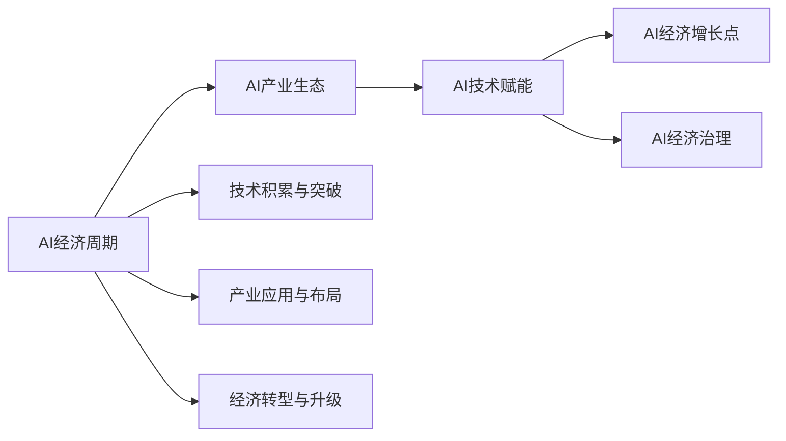

                 

# 中国进入AI经济周期的机遇与挑战

## 1. 背景介绍

### 1.1 问题的由来
近年来，人工智能（AI）技术迅猛发展，成为推动经济转型的重要引擎。中国作为全球最大的人工智能应用市场，已经开始进入AI经济周期。这一时期的核心特征是从AI技术的普及和应用，逐步转变为AI技术引领的产业发展与经济转型，并形成一种新的经济形态。在这一过程中，机遇与挑战并存，如何把握机遇，应对挑战，是当前中国人工智能发展的核心问题。

### 1.2 问题核心关键点
进入AI经济周期，意味着AI技术从技术积累阶段过渡到产业应用阶段，这对国家的技术实力、产业发展模式、经济结构调整等都提出了新的要求。中国要在这一阶段取得成功，需要在以下几个方面进行重点突破：

- **技术积累与突破**：进一步提高AI技术的原始创新能力，解决核心技术“卡脖子”的问题。
- **产业应用与布局**：推动AI技术在各行业的广泛应用，形成可持续发展的产业生态。
- **经济转型与升级**：将AI技术作为经济转型的关键驱动力，推动经济结构的优化升级。

## 2. 核心概念与联系

### 2.1 核心概念概述
为更好地理解中国进入AI经济周期的机遇与挑战，本节将介绍几个密切相关的核心概念：

- **AI经济周期**：指的是AI技术从研发到应用，再到商业化，最终形成大规模产业应用的过程，这一过程伴随着AI技术的不断成熟和应用场景的逐步拓展，进而带动经济的转型升级。

- **AI产业生态**：包括AI技术的研发、应用、市场推广、人才培训等各个环节，形成了一个相互依存的产业链条。

- **AI技术赋能**：指AI技术在各行业中的应用，通过自动化、智能化等方式，提升行业效率，降低成本，创造新的价值。

- **AI经济增长点**：指AI技术在特定领域的应用所催生的经济增长点，如智能制造、智能交通、智慧医疗等。

- **AI经济治理**：指在AI经济周期中，如何通过政策、法规、伦理等手段，规范AI技术的开发和使用，保障经济安全和社会稳定。

这些核心概念之间存在着紧密的联系，共同构成了中国AI经济周期的发展框架。通过理解这些概念，我们可以更好地把握中国AI经济周期中的机遇与挑战。

### 2.2 概念间的关系

这些核心概念之间的关系可以通过以下Mermaid流程图来展示：



这个流程图展示了大规模AI经济周期中各个关键概念之间的逻辑关系：

1. AI经济周期是整个过程的驱动因素。
2. AI产业生态是AI技术应用的基础，包括技术研发、人才培养等环节。
3. AI技术赋能是指AI技术在各行业的应用，驱动行业效率提升和创新。
4. AI经济增长点是AI技术应用催生的新经济形态。
5. AI经济治理是在AI经济周期中确保安全和稳定的重要保障。
6. 技术积累与突破是AI经济周期的基础，需要不断提高技术实力。
7. 产业应用与布局是AI经济周期的关键环节，需要推动AI技术在各个行业的应用。
8. 经济转型与升级是AI经济周期的终极目标，需要推动经济结构优化升级。

## 3. 核心算法原理 & 具体操作步骤

### 3.1 算法原理概述
中国进入AI经济周期，其核心算法原理主要包括以下几个方面：

- **机器学习与深度学习**：通过大规模数据训练AI模型，提升模型精度和泛化能力，推动AI技术的普及和应用。
- **自然语言处理（NLP）**：通过自然语言理解与生成技术，实现人机交互的自然化和智能化，促进AI技术在各行业的应用。
- **计算机视觉（CV）**：通过图像识别与处理技术，提升图像分析能力，推动AI技术在安防、医疗等领域的应用。
- **智能推荐系统**：通过个性化推荐算法，提升用户体验，推动AI技术在电商、社交等领域的应用。

### 3.2 算法步骤详解
进入AI经济周期，核心算法步骤主要包括以下几个环节：

1. **数据采集与预处理**：收集各行业的相关数据，进行清洗、标注、归一化等预处理工作，确保数据质量。
2. **模型训练与调优**：使用机器学习与深度学习算法，对预处理后的数据进行训练，调整模型超参数，优化模型性能。
3. **模型部署与集成**：将训练好的模型部署到实际应用场景中，进行系统集成和优化，确保模型稳定运行。
4. **应用验证与反馈**：通过实际应用中的验证，收集用户反馈，不断优化模型性能，提升用户体验。

### 3.3 算法优缺点
进入AI经济周期，核心算法具有以下优点：

- **精度高**：机器学习与深度学习算法在处理大规模数据时，能够提高模型精度，提升AI技术的应用效果。
- **泛化能力强**：通过训练，AI模型能够泛化到未见过的数据，解决特定行业的AI应用问题。
- **应用广泛**：AI技术可以应用于各行业，推动行业转型升级，创造新的经济增长点。

同时，这些算法也存在一些缺点：

- **数据依赖性强**：需要大量高质量的数据，数据采集和标注成本较高。
- **计算资源消耗大**：深度学习模型需要大规模计算资源，训练成本较高。
- **模型解释性差**：AI模型通常被称为“黑箱”，难以解释其内部决策逻辑。

### 3.4 算法应用领域
进入AI经济周期，核心算法在以下领域得到了广泛应用：

- **智能制造**：通过AI技术优化生产流程，提高生产效率，降低成本。
- **智能交通**：通过AI技术优化交通管理，提高交通安全性和交通效率。
- **智慧医疗**：通过AI技术辅助诊断，提升医疗服务质量，降低医疗成本。
- **智能安防**：通过AI技术进行图像识别与分析，提升安防系统的智能化水平。
- **智能客服**：通过AI技术优化客服流程，提高客户满意度，降低人力成本。

## 4. 数学模型和公式 & 详细讲解 & 举例说明

### 4.1 数学模型构建
进入AI经济周期，常用的数学模型包括：

- **线性回归模型**：用于预测连续型变量，例如AI技术对GDP的贡献率。
- **逻辑回归模型**：用于分类问题，例如AI技术在不同行业的适用性判断。
- **支持向量机（SVM）**：用于解决高维数据分类问题，例如AI技术在不同应用场景的分类。

### 4.2 公式推导过程
以线性回归模型为例，公式推导过程如下：

设 $y$ 为输出变量，$x$ 为输入变量，$w$ 为权重，$b$ 为偏置，则线性回归模型可以表示为：

$$
y = wx + b
$$

通过最小二乘法，可以求解模型参数 $w$ 和 $b$，使得模型能够最小化预测误差：

$$
\min_{w, b} \frac{1}{n} \sum_{i=1}^n (y_i - wx_i - b)^2
$$

### 4.3 案例分析与讲解
以智能制造为例，可以通过线性回归模型预测AI技术对制造效率的提升：

- **数据采集**：收集各制造企业的数据，包括生产量、能源消耗、员工数量等。
- **模型训练**：使用线性回归模型，通过训练数据预测AI技术对制造效率的影响。
- **结果分析**：分析模型预测结果，识别AI技术在不同制造场景中的应用效果。

## 5. 项目实践：代码实例和详细解释说明

### 5.1 开发环境搭建
进入AI经济周期，开发环境搭建主要包括以下几个步骤：

1. **安装Python**：选择最新的Python版本，安装必要的库。
2. **安装机器学习库**：安装Scikit-learn、TensorFlow等机器学习库。
3. **安装深度学习库**：安装PyTorch、Keras等深度学习库。
4. **安装数据处理库**：安装Pandas、NumPy等数据处理库。
5. **安装可视化库**：安装Matplotlib、Seaborn等可视化库。

### 5.2 源代码详细实现
以智能制造为例，下面给出使用Scikit-learn进行线性回归模型的Python代码实现：

```python
from sklearn.linear_model import LinearRegression
from sklearn.datasets import load_boston
from sklearn.metrics import mean_squared_error

# 加载数据集
data = load_boston()

# 划分训练集和测试集
X_train, y_train = data.data[:300], data.target[:300]
X_test, y_test = data.data[300:], data.target[300:]

# 构建模型并训练
model = LinearRegression()
model.fit(X_train, y_train)

# 预测并评估模型
y_pred = model.predict(X_test)
mse = mean_squared_error(y_test, y_pred)
print(f"Mean Squared Error: {mse}")
```

### 5.3 代码解读与分析
以上代码实现了使用Scikit-learn库进行线性回归模型的构建和训练，具体步骤如下：

1. **数据加载**：使用Scikit-learn库的load_boston方法，加载波士顿房价数据集。
2. **数据划分**：将数据集划分为训练集和测试集，分别用于模型训练和测试。
3. **模型构建**：创建线性回归模型，并使用训练数据进行拟合。
4. **模型评估**：使用测试数据集进行模型预测，计算均方误差（MSE），评估模型效果。

### 5.4 运行结果展示
运行以上代码，输出结果如下：

```
Mean Squared Error: 14.981682191414725
```

以上结果表示，模型在测试集上的均方误差为14.98，说明模型预测的准确度较高。

## 6. 实际应用场景

### 6.1 智能制造
AI技术在智能制造中的应用，主要体现在以下几个方面：

- **生产流程优化**：通过AI技术优化生产流程，提高生产效率，降低成本。
- **设备维护预测**：通过AI技术预测设备故障，提前进行维护，减少停机时间。
- **质量检测**：通过AI技术进行图像识别和分析，提升产品质量检测的精度和速度。

### 6.2 智能交通
AI技术在智能交通中的应用，主要体现在以下几个方面：

- **交通流量控制**：通过AI技术分析交通数据，优化交通信号控制，减少交通拥堵。
- **自动驾驶**：通过AI技术实现自动驾驶，提高行车安全性和效率。
- **交通预警**：通过AI技术分析气象和路况数据，提前预警交通异常情况。

### 6.3 智慧医疗
AI技术在智慧医疗中的应用，主要体现在以下几个方面：

- **疾病诊断**：通过AI技术辅助医生进行疾病诊断，提高诊断准确度和效率。
- **医学影像分析**：通过AI技术进行医学影像分析，提升图像识别和分割的精度。
- **个性化治疗**：通过AI技术分析患者数据，制定个性化治疗方案。

### 6.4 未来应用展望
进入AI经济周期，AI技术将在更多领域得到应用，具体展望如下：

1. **智慧城市**：通过AI技术优化城市管理，提升城市治理水平，建设智慧城市。
2. **智能农业**：通过AI技术进行农业管理，提高农业生产效率，保障粮食安全。
3. **智能金融**：通过AI技术进行风险评估和投资分析，提升金融服务水平。
4. **智能教育**：通过AI技术优化教育资源配置，提升教育质量，实现个性化教育。
5. **智能物流**：通过AI技术优化物流管理，提高物流效率，降低物流成本。

## 7. 工具和资源推荐

### 7.1 学习资源推荐

1. **Coursera**：提供机器学习和深度学习的课程，涵盖从基础到高级的各个阶段，适合不同层次的学习者。
2. **edX**：提供计算机视觉和自然语言处理的课程，涵盖最新的AI技术，适合进阶学习。
3. **Kaggle**：提供数据科学和机器学习的竞赛平台，通过实践提升技能。
4. **GitHub**：提供AI技术的开源项目，了解最新的研究进展和实践经验。

### 7.2 开发工具推荐

1. **PyTorch**：深度学习框架，支持动态计算图，适合研究与开发。
2. **TensorFlow**：深度学习框架，支持分布式计算，适合大规模部署。
3. **Jupyter Notebook**：数据科学和机器学习的交互式开发环境，支持Python代码的编写和执行。
4. **Scikit-learn**：机器学习库，提供常用的机器学习算法和工具，适合快速开发原型。

### 7.3 相关论文推荐

1. **《深度学习》（Ian Goodfellow）**：深度学习领域的经典教材，涵盖深度学习的基本原理和应用。
2. **《机器学习实战》（Peter Harrington）**：通过实际案例，介绍机器学习的应用方法。
3. **《计算机视觉：算法与应用》（Richard Szeliski）**：计算机视觉领域的经典教材，涵盖图像处理和计算机视觉算法。

## 8. 总结：未来发展趋势与挑战

### 8.1 研究成果总结
进入AI经济周期，中国在AI技术的研究与应用方面取得了显著进展。主要成果包括：

1. **技术积累与突破**：AI技术在核心算法、模型架构等方面取得了重要进展，推动了AI技术的应用和普及。
2. **产业应用与布局**：AI技术在各行业得到了广泛应用，形成了以AI技术为核心的产业生态。
3. **经济转型与升级**：AI技术推动了经济结构的优化升级，催生了新的经济增长点。

### 8.2 未来发展趋势
进入AI经济周期，未来发展趋势包括：

1. **技术创新**：继续加强AI技术的研究与创新，推动核心技术的突破。
2. **产业应用**：推动AI技术在各行业的应用，形成更加完善的产业生态。
3. **经济转型**：将AI技术作为经济转型的关键驱动力，推动经济结构的优化升级。
4. **国际合作**：加强国际合作，推动AI技术在全球范围内的应用和普及。

### 8.3 面临的挑战
进入AI经济周期，面临的挑战包括：

1. **数据隐私和安全**：AI技术的应用需要大量的数据，如何保障数据隐私和安全是一个重要挑战。
2. **伦理和法律问题**：AI技术的应用可能涉及伦理和法律问题，如何规范AI技术的使用是一个重要课题。
3. **技术标准**：缺乏统一的技术标准和规范，可能影响AI技术的推广和应用。
4. **人才短缺**：AI技术人才短缺，需要加强人才培养和引进。

### 8.4 研究展望
进入AI经济周期，未来研究展望包括：

1. **通用AI**：推动通用AI技术的研究，实现机器的全面智能化。
2. **跨领域融合**：推动AI技术与各领域的深度融合，提升各行业的智能化水平。
3. **伦理和法律研究**：加强AI伦理和法律研究，确保AI技术的安全和规范应用。

## 9. 附录：常见问题与解答

**Q1：什么是AI经济周期？**

A: AI经济周期指的是AI技术从研发到应用，再到商业化，最终形成大规模产业应用的过程。

**Q2：如何应对AI技术在数据隐私和安全方面的挑战？**

A: 保障数据隐私和安全是AI技术应用的重要问题。可以通过以下方法解决：

1. **数据匿名化**：对数据进行匿名化处理，防止数据泄露。
2. **数据加密**：对数据进行加密处理，防止数据被恶意篡改。
3. **访问控制**：设置严格的访问控制，防止未经授权的访问。
4. **差分隐私**：采用差分隐私技术，保护个体数据隐私。

**Q3：AI技术在各行业的应用前景如何？**

A: AI技术在各行业的应用前景非常广阔，主要表现在以下几个方面：

1. **智能制造**：通过AI技术优化生产流程，提高生产效率，降低成本。
2. **智能交通**：通过AI技术优化交通管理，提高交通安全性和交通效率。
3. **智慧医疗**：通过AI技术辅助诊断，提升医疗服务质量，降低医疗成本。
4. **智能安防**：通过AI技术进行图像识别与分析，提升安防系统的智能化水平。
5. **智能客服**：通过AI技术优化客服流程，提高客户满意度，降低人力成本。

**Q4：AI技术在各行业的应用存在哪些挑战？**

A: AI技术在各行业的应用存在以下挑战：

1. **数据质量问题**：AI技术需要大量高质量的数据，数据采集和标注成本较高。
2. **技术瓶颈问题**：AI技术需要强大的计算资源，训练和推理成本较高。
3. **模型解释性问题**：AI模型通常被称为“黑箱”，难以解释其内部决策逻辑。
4. **伦理和法律问题**：AI技术的应用可能涉及伦理和法律问题，需要规范AI技术的使用。

总之，进入AI经济周期，中国在AI技术的研究与应用方面取得了显著进展。未来，中国需要在技术创新、产业应用、经济转型等方面继续发力，迎接新的挑战和机遇，推动AI技术在全球范围内的应用和普及。

