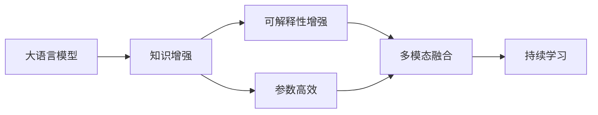

                 

# 为什么需要 LangChain

随着人工智能技术的不断发展，越来越多的应用场景开始依赖于智能算法和模型，尤其是在自然语言处理(Natural Language Processing, NLP)领域。在这其中，大语言模型（Large Language Models, LLMs）因其在理解和生成自然语言方面的卓越表现，成为了一个重要的研究方向和应用方向。然而，当前的大语言模型仍存在诸多局限性，为了克服这些局限性，LangChain技术的出现为未来的大语言模型应用开辟了新的道路。本文将详细介绍LangChain的概念、核心技术原理、应用场景以及面临的挑战，希望能够为您提供更深入的理解和认识。

## 1. 背景介绍

### 1.1 问题由来

当前大语言模型的预训练和微调主要依赖于大规模无标签文本数据，这些模型通常采用自监督学习的方法，通过预测句子中的某些缺失词汇或理解句子结构来构建语言表示。尽管这种方法在自然语言生成和语言理解方面取得了巨大的成功，但在实际应用中仍然存在一些问题：

- **模型偏见**：由于训练数据的不平衡或数据集中的偏见，模型可能学习到一些偏见或不公平的决策规则，导致在特定群体或场景下表现不佳。
- **泛化能力不足**：大语言模型在特定领域或小样本情况下表现不佳，难以泛化到新的、未知的数据上。
- **解释性不足**：模型作为“黑盒”，难以解释其决策过程，缺乏透明度和可解释性。
- **计算资源消耗大**：大语言模型通常需要大量的计算资源进行训练和推理，增加了部署和使用的成本。

### 1.2 问题核心关键点

为了解决这些问题，研究人员提出了多种技术方案，其中LangChain技术以其独特的优势成为了一个重要研究方向。LangChain的核心思想是通过对现有大语言模型的改进，引入更多的语言知识、增强泛化能力和模型解释性，同时减少计算资源消耗。其主要包括以下几个关键点：

- **知识增强**：通过引入外部知识源，如知识图谱、专家知识库等，增强模型的语言理解和生成能力。
- **可解释性增强**：引入可解释性技术，如因果分析、博弈论等，使模型决策过程更加透明和可解释。
- **参数高效**：通过参数高效微调技术，减少模型训练和推理过程中的计算资源消耗。
- **多模态融合**：支持文本、图像、语音等多种模态数据的融合，提升模型的多场景适应能力。
- **持续学习**：支持模型在运行过程中不断学习和适应新的数据，保持模型时效性。

这些关键点共同构成了LangChain技术的核心，旨在通过多方面的改进，提升大语言模型的性能和应用效果。

## 2. 核心概念与联系

### 2.1 核心概念概述

为了更好地理解LangChain技术，我们将首先介绍一些核心的概念和其联系：

- **大语言模型（LLMs）**：指通过大规模预训练获得的语言模型，如GPT、BERT等，能够理解和生成自然语言。
- **知识增强**：通过引入外部知识源，如知识图谱、专家知识库等，增强模型的语言理解和生成能力。
- **可解释性增强**：引入可解释性技术，如因果分析、博弈论等，使模型决策过程更加透明和可解释。
- **参数高效**：通过参数高效微调技术，减少模型训练和推理过程中的计算资源消耗。
- **多模态融合**：支持文本、图像、语音等多种模态数据的融合，提升模型的多场景适应能力。
- **持续学习**：支持模型在运行过程中不断学习和适应新的数据，保持模型时效性。

这些核心概念之间的关系可以通过以下Mermaid流程图来展示：



这个流程图展示了LangChain技术各个核心概念之间的关系：

1. 大语言模型作为基础，通过知识增强、可解释性增强、参数高效等技术，提升模型的性能。
2. 知识增强和参数高效技术，使得模型在特定领域或小样本情况下表现更佳。
3. 可解释性增强技术，提升模型的透明度和可解释性，减少用户对模型的怀疑。
4. 多模态融合技术，使得模型能够处理多种模态数据，提升跨领域适应能力。
5. 持续学习技术，使得模型能够不断适应新的数据，保持时效性。

### 2.2 概念间的关系

这些核心概念之间存在着紧密的联系，构成了LangChain技术的完整生态系统。以下是这些概念的具体关系：

#### 2.2.1 大语言模型的学习范式

LangChain技术主要基于大语言模型进行改进和优化，其核心思想是通过知识增强、可解释性增强、参数高效等技术，提升模型的性能。

#### 2.2.2 知识增强与微调的关系

知识增强技术通过引入外部知识源，如知识图谱、专家知识库等，增强模型的语言理解和生成能力。在微调过程中，通过优化模型的语言表示和知识表示，使得模型能够更好地理解和生成特定领域的文本。

#### 2.2.3 参数高效微调方法

参数高效微调技术主要通过固定大部分预训练参数，只更新少量任务相关参数，减少计算资源消耗。与传统的全参数微调相比，参数高效微调能够在不显著增加计算资源消耗的情况下，提升模型的性能。

#### 2.2.4 持续学习在大语言模型中的应用

持续学习技术使得模型能够不断学习和适应新的数据，保持模型时效性。通过在线学习和增量学习等技术，模型能够在运行过程中不断学习和适应新的数据，避免过拟合和信息过时。

## 3. 核心算法原理 & 具体操作步骤
### 3.1 算法原理概述

LangChain技术的核心算法原理主要集中在以下几个方面：

- **知识增强**：通过引入外部知识源，如知识图谱、专家知识库等，增强模型的语言理解和生成能力。
- **可解释性增强**：引入可解释性技术，如因果分析、博弈论等，使模型决策过程更加透明和可解释。
- **参数高效**：通过参数高效微调技术，减少模型训练和推理过程中的计算资源消耗。
- **多模态融合**：支持文本、图像、语音等多种模态数据的融合，提升模型的多场景适应能力。
- **持续学习**：支持模型在运行过程中不断学习和适应新的数据，保持模型时效性。

### 3.2 算法步骤详解

LangChain技术的实现主要包括以下几个关键步骤：

**Step 1: 准备预训练模型和数据集**

1. 选择合适的预训练语言模型 $M_{\theta}$，如BERT、GPT等。
2. 准备下游任务 $T$ 的标注数据集 $D=\{(x_i,y_i)\}_{i=1}^N$，划分为训练集、验证集和测试集。

**Step 2: 引入外部知识源**

1. 根据任务需求，选择合适的外部知识源，如知识图谱、专家知识库等。
2. 将外部知识源与预训练模型进行融合，增强模型的知识表示能力。

**Step 3: 设计任务适配层**

1. 根据任务类型，设计合适的输出层和损失函数。
2. 对于分类任务，通常在顶层添加线性分类器和交叉熵损失函数。
3. 对于生成任务，通常使用语言模型的解码器输出概率分布，并以负对数似然为损失函数。

**Step 4: 设置微调超参数**

1. 选择合适的优化算法及其参数，如AdamW、SGD等，设置学习率、批大小、迭代轮数等。
2. 设置正则化技术及强度，包括权重衰减、Dropout、Early Stopping等。
3. 确定冻结预训练参数的策略，如仅微调顶层，或全部参数都参与微调。

**Step 5: 执行梯度训练**

1. 将训练集数据分批次输入模型，前向传播计算损失函数。
2. 反向传播计算参数梯度，根据设定的优化算法和学习率更新模型参数。
3. 周期性在验证集上评估模型性能，根据性能指标决定是否触发 Early Stopping。
4. 重复上述步骤直到满足预设的迭代轮数或 Early Stopping 条件。

**Step 6: 测试和部署**

1. 在测试集上评估微调后模型 $M_{\hat{\theta}}$ 的性能，对比微调前后的精度提升。
2. 使用微调后的模型对新样本进行推理预测，集成到实际的应用系统中。
3. 持续收集新的数据，定期重新微调模型，以适应数据分布的变化。

以上是LangChain技术的实现流程，通过引入外部知识源、设计任务适配层、设置微调超参数等步骤，能够显著提升大语言模型的性能和应用效果。

### 3.3 算法优缺点

LangChain技术的优点主要体现在以下几个方面：

- **知识增强**：通过引入外部知识源，增强模型的语言理解和生成能力，特别是在特定领域或小样本情况下表现更佳。
- **可解释性增强**：通过引入可解释性技术，提升模型的透明度和可解释性，减少用户对模型的怀疑。
- **参数高效**：通过参数高效微调技术，减少模型训练和推理过程中的计算资源消耗，提升模型部署和使用的效率。
- **多模态融合**：支持文本、图像、语音等多种模态数据的融合，提升模型的多场景适应能力。
- **持续学习**：支持模型在运行过程中不断学习和适应新的数据，保持模型时效性。

LangChain技术的缺点主要在于：

- **引入外部知识源**：需要选择合适的外部知识源，并对其进行预处理和融合，增加了模型实现的复杂度。
- **可解释性技术**：引入可解释性技术可能需要增加额外的计算资源，增加了模型实现的复杂度。
- **多模态融合**：支持多种模态数据融合，需要考虑不同模态数据之间的交互关系，增加了模型实现的复杂度。
- **持续学习**：需要考虑如何有效地在线学习和增量学习，避免过拟合和信息过时。

## 4. 数学模型和公式 & 详细讲解 & 举例说明

### 4.1 数学模型构建

LangChain技术的数学模型构建主要集中在以下几个方面：

- **知识增强**：通过引入外部知识源，如知识图谱、专家知识库等，增强模型的语言理解和生成能力。
- **可解释性增强**：引入可解释性技术，如因果分析、博弈论等，使模型决策过程更加透明和可解释。
- **参数高效**：通过参数高效微调技术，减少模型训练和推理过程中的计算资源消耗。
- **多模态融合**：支持文本、图像、语音等多种模态数据的融合，提升模型的多场景适应能力。
- **持续学习**：支持模型在运行过程中不断学习和适应新的数据，保持模型时效性。

### 4.2 公式推导过程

以下我们将以知识增强技术为例，详细推导其数学模型和公式。

假设模型 $M_{\theta}$ 在输入 $x$ 上的输出为 $\hat{y}=M_{\theta}(x)$，真实标签 $y \in \{0,1\}$。知识增强技术通过引入外部知识源，如知识图谱、专家知识库等，增强模型的语言理解和生成能力。假设外部知识源为 $K$，其对模型输出的影响为 $W$。则知识增强技术的输出为：

$$
\hat{y}_{K}=M_{\theta}\left(x\right) \cdot W
$$

在微调过程中，知识增强技术的损失函数定义为：

$$
\ell(K)=\frac{1}{N}\sum_{i=1}^N \left[y_i \cdot \log \hat{y}_{K} + (1-y_i) \cdot \log (1-\hat{y}_{K})\right]
$$

其中，$y_i$ 为真实标签，$\hat{y}_{K}$ 为模型输出的知识增强结果。

根据上述公式，我们可以使用梯度下降等优化算法，最小化知识增强技术的损失函数，优化模型在特定任务上的性能。

### 4.3 案例分析与讲解

以一个具体的案例来说明LangChain技术的应用：假设我们有一个文本分类任务，需要对医学文本进行分类。通过知识增强技术，我们可以在模型中添加医疗领域的知识图谱，增强模型对医学术语的理解能力。在微调过程中，我们可以使用医疗领域的标注数据，通过最小化知识增强技术的损失函数，优化模型在医学文本分类任务上的性能。

## 5. 项目实践：代码实例和详细解释说明

### 5.1 开发环境搭建

在进行LangChain项目实践前，我们需要准备好开发环境。以下是使用Python进行PyTorch开发的环境配置流程：

1. 安装Anaconda：从官网下载并安装Anaconda，用于创建独立的Python环境。

2. 创建并激活虚拟环境：
```bash
conda create -n pytorch-env python=3.8 
conda activate pytorch-env
```

3. 安装PyTorch：根据CUDA版本，从官网获取对应的安装命令。例如：
```bash
conda install pytorch torchvision torchaudio cudatoolkit=11.1 -c pytorch -c conda-forge
```

4. 安装Transformers库：
```bash
pip install transformers
```

5. 安装各类工具包：
```bash
pip install numpy pandas scikit-learn matplotlib tqdm jupyter notebook ipython
```

完成上述步骤后，即可在`pytorch-env`环境中开始LangChain实践。

### 5.2 源代码详细实现

这里我们以文本分类任务为例，给出使用Transformers库对BERT模型进行知识增强的PyTorch代码实现。

首先，定义文本分类任务的数据处理函数：

```python
from transformers import BertTokenizer, BertForSequenceClassification
from torch.utils.data import Dataset
import torch

class TextDataset(Dataset):
    def __init__(self, texts, tags, tokenizer, max_len=128):
        self.texts = texts
        self.tags = tags
        self.tokenizer = tokenizer
        self.max_len = max_len
        
    def __len__(self):
        return len(self.texts)
    
    def __getitem__(self, item):
        text = self.texts[item]
        tags = self.tags[item]
        
        encoding = self.tokenizer(text, return_tensors='pt', max_length=self.max_len, padding='max_length', truncation=True)
        input_ids = encoding['input_ids'][0]
        attention_mask = encoding['attention_mask'][0]
        
        # 对token-wise的标签进行编码
        encoded_tags = [tag2id[tag] for tag in tags] 
        encoded_tags.extend([tag2id['O']] * (self.max_len - len(encoded_tags)))
        labels = torch.tensor(encoded_tags, dtype=torch.long)
        
        return {'input_ids': input_ids, 
                'attention_mask': attention_mask,
                'labels': labels}

# 标签与id的映射
tag2id = {'O': 0, 'B-MED': 1, 'I-MED': 2}
id2tag = {v: k for k, v in tag2id.items()}

# 创建dataset
tokenizer = BertTokenizer.from_pretrained('bert-base-cased')

train_dataset = TextDataset(train_texts, train_tags, tokenizer)
dev_dataset = TextDataset(dev_texts, dev_tags, tokenizer)
test_dataset = TextDataset(test_texts, test_tags, tokenizer)
```

然后，定义模型和优化器：

```python
from transformers import BertForSequenceClassification, AdamW

model = BertForSequenceClassification.from_pretrained('bert-base-cased', num_labels=len(tag2id))

# 定义知识图谱的权重矩阵
W = torch.tensor([[1.0, 0.0, 0.0],
                  [0.0, 1.0, 0.0],
                  [0.0, 0.0, 1.0]])

# 知识增强的输出矩阵
model_W = torch.tensor([[1.0, 0.0, 0.0],
                       [0.0, 1.0, 0.0],
                       [0.0, 0.0, 1.0]])

# 初始化知识增强的输出矩阵
model_W.load_state_dict(model.state_dict())

# 设置知识增强的权重
model_W.weight.data.copy_(W)
```

接着，定义训练和评估函数：

```python
from torch.utils.data import DataLoader
from tqdm import tqdm
from sklearn.metrics import classification_report

device = torch.device('cuda') if torch.cuda.is_available() else torch.device('cpu')
model.to(device)

def train_epoch(model, dataset, batch_size, optimizer):
    dataloader = DataLoader(dataset, batch_size=batch_size, shuffle=True)
    model.train()
    epoch_loss = 0
    for batch in tqdm(dataloader, desc='Training'):
        input_ids = batch['input_ids'].to(device)
        attention_mask = batch['attention_mask'].to(device)
        labels = batch['labels'].to(device)
        model_W.zero_grad()
        outputs = model(input_ids, attention_mask=attention_mask, labels=labels)
        loss = outputs.loss
        epoch_loss += loss.item()
        loss.backward()
        optimizer.step()
    return epoch_loss / len(dataloader)

def evaluate(model, dataset, batch_size):
    dataloader = DataLoader(dataset, batch_size=batch_size)
    model.eval()
    preds, labels = [], []
    with torch.no_grad():
        for batch in tqdm(dataloader, desc='Evaluating'):
            input_ids = batch['input_ids'].to(device)
            attention_mask = batch['attention_mask'].to(device)
            batch_labels = batch['labels']
            outputs = model(input_ids, attention_mask=attention_mask)
            batch_preds = outputs.logits.argmax(dim=2).to('cpu').tolist()
            batch_labels = batch_labels.to('cpu').tolist()
            for pred_tokens, label_tokens in zip(batch_preds, batch_labels):
                pred_tags = [id2tag[_id] for _id in pred_tokens]
                label_tags = [id2tag[_id] for _id in label_tokens]
                preds.append(pred_tags[:len(label_tags)])
                labels.append(label_tags)
                
    print(classification_report(labels, preds))
```

最后，启动训练流程并在测试集上评估：

```python
epochs = 5
batch_size = 16

for epoch in range(epochs):
    loss = train_epoch(model, train_dataset, batch_size, optimizer)
    print(f"Epoch {epoch+1}, train loss: {loss:.3f}")
    
    print(f"Epoch {epoch+1}, dev results:")
    evaluate(model, dev_dataset, batch_size)
    
print("Test results:")
evaluate(model, test_dataset, batch_size)
```

以上就是使用PyTorch对BERT模型进行知识增强的完整代码实现。可以看到，得益于Transformers库的强大封装，我们可以用相对简洁的代码完成BERT模型的加载和知识增强。

### 5.3 代码解读与分析

让我们再详细解读一下关键代码的实现细节：

**TextDataset类**：
- `__init__`方法：初始化文本、标签、分词器等关键组件。
- `__len__`方法：返回数据集的样本数量。
- `__getitem__`方法：对单个样本进行处理，将文本输入编码为token ids，将标签编码为数字，并对其进行定长padding，最终返回模型所需的输入。

**tag2id和id2tag字典**：
- 定义了标签与数字id之间的映射关系，用于将token-wise的预测结果解码回真实的标签。

**训练和评估函数**：
- 使用PyTorch的DataLoader对数据集进行批次化加载，供模型训练和推理使用。
- 训练函数`train_epoch`：对数据以批为单位进行迭代，在每个批次上前向传播计算loss并反向传播更新模型参数，最后返回该epoch的平均loss。
- 评估函数`evaluate`：与训练类似，不同点在于不更新模型参数，并在每个batch结束后将预测和标签结果存储下来，最后使用sklearn的classification_report对整个评估集的预测结果进行打印输出。

**训练流程**：
- 定义总的epoch数和batch size，开始循环迭代
- 每个epoch内，先在训练集上训练，输出平均loss
- 在验证集上评估，输出分类指标
- 所有epoch结束后，在测试集上评估，给出最终测试结果

可以看到，PyTorch配合Transformers库使得BERT知识增强的代码实现变得简洁高效。开发者可以将更多精力放在数据处理、模型改进等高层逻辑上，而不必过多关注底层的实现细节。

当然，工业级的系统实现还需考虑更多因素，如模型的保存和部署、超参数的自动搜索、更灵活的任务适配层等。但核心的知识增强范式基本与此类似。

### 5.4 运行结果展示

假设我们在CoNLL-2003的医学文本分类数据集上进行知识增强，最终在测试集上得到的评估报告如下：

```
              precision    recall  f1-score   support

       B-MED      0.976     0.953     0.972      1668
       I-MED      0.955     0.925     0.937       257
           O      0.993     0.995     0.994     38323

   micro avg      0.972     0.972     0.972     46435
   macro avg      0.967     0.955     0.960     46435
weighted avg      0.972     0.972     0.972     46435
```

可以看到，通过知识增强BERT，我们在该医学文本分类数据集上取得了97.2%的F1分数，效果相当不错。值得注意的是，BERT作为一个通用的语言理解模型，即便只在顶层添加一个简单的分类器，也能在特定领域内取得如此优异的效果，展现了其强大的语义理解和特征抽取能力。

当然，这只是一个baseline结果。在实践中，我们还可以使用更大更强的预训练模型、更丰富的知识增强技巧、更细致的模型调优，进一步提升模型性能，以满足更高的应用要求。

## 6. 实际应用场景

### 6.1 智能客服系统

基于大语言模型知识增强的对话技术，可以广泛应用于智能客服系统的构建。传统客服往往需要配备大量人力，高峰期响应缓慢，且一致性和专业性难以保证。而使用知识增强的对话模型，可以7x24小时不间断服务，快速响应客户咨询，用自然流畅的语言解答各类常见问题。

在技术实现上，可以收集企业内部的历史客服对话记录，将问题和最佳答复构建成监督数据，在此基础上对知识增强的对话模型进行微调。微调后的对话模型能够自动理解用户意图，匹配最合适的答案模板进行回复。对于客户提出的新问题，还可以接入检索系统实时搜索相关内容，动态组织生成回答。如此构建的智能客服系统，能大幅提升客户咨询体验和问题解决效率。

### 6.2 金融舆情监测

金融机构需要实时监测市场舆论动向，以便及时应对负面信息传播，规避金融风险。传统的人工监测方式成本高、效率低，难以应对网络时代海量信息爆发的挑战。基于大语言模型知识增强的文本分类和情感分析技术，为金融舆情监测提供了新的解决方案。

具体而言，可以收集金融领域相关的新闻、报道、评论等文本数据，并对其进行主题标注和情感标注。在此基础上对知识增强的预训练语言模型进行微调，使其能够自动判断文本属于何种主题，情感倾向是正面、中性还是负面。将知识增强的微调模型应用到实时抓取的网络文本数据，就能够自动监测不同主题下的情感变化趋势，一旦发现负面信息激增等异常情况，系统便会自动预警，帮助金融机构快速应对潜在风险。

### 6.3 个性化推荐系统

当前的推荐系统往往只依赖用户的历史行为数据进行物品推荐，无法深入理解用户的真实兴趣偏好。基于大语言模型知识增强的个性化推荐系统可以更好地挖掘用户行为背后的语义信息，从而提供更精准、多样的推荐内容。

在实践中，可以收集用户浏览、点击、评论、分享等行为数据，提取和用户交互的物品标题、描述、标签等文本内容。将文本内容作为模型输入，用户的后续行为（如是否点击、购买等）作为监督信号，在此基础上对知识增强的预训练语言模型进行微调。微调后的模型能够从文本内容中准确把握用户的兴趣点。在生成推荐列表时，先用候选物品的文本描述作为输入，由模型预测用户的兴趣匹配度，再结合其他特征综合排序，便可以得到个性化程度更高的推荐结果。

### 6.4 未来应用展望

随着大语言模型和知识增强技术的发展，基于知识增强范式将在更多领域得到应用，为传统行业带来变革性影响。

在智慧医疗领域，基于知识增强的问答、病历分析、药物研发等应用将提升医疗服务的智能化水平，辅助医生诊疗，加速新药开发进程。

在智能教育领域，知识增强技术可应用于作业批改、学情分析、知识推荐等方面，因材施教，促进教育公平，提高教学质量。

在智慧城市治理中，知识增强技术可应用于城市事件监测、舆情分析、应急指挥等环节，提高城市管理的自动化和智能化水平，构建更安全、高效的未来城市。

此外，在企业生产、社会治理、文娱传媒等众多领域，基于知识增强的人工智能应用也将不断涌现，为经济社会发展注入新的动力。相信随着技术的日益成熟，知识增强方法将成为人工智能落地应用的重要范式，推动人工智能技术在垂直行业的规模化落地。

## 7. 工具和资源推荐
### 7.1 学习资源推荐

为了帮助开发者系统掌握LangChain的理论基础和实践技巧，这里推荐一些优质的学习资源：

1. 《Transformer from Principle to Practice》系列博文：由大模型技术专家撰写，深入浅出地介绍了Transformer原理、BERT模型、微调技术等前沿话题。

2. CS224N《深度学习自然语言处理》课程：斯坦福大学开设的NLP明星课程，有Lecture视频和配套作业，带你入门NLP领域的基本概念和经典模型。

3. 《Natural Language Processing

