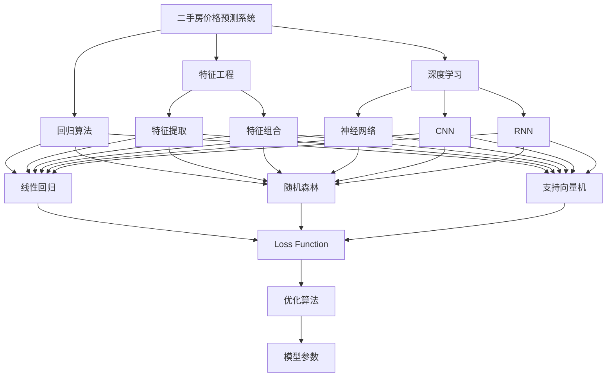
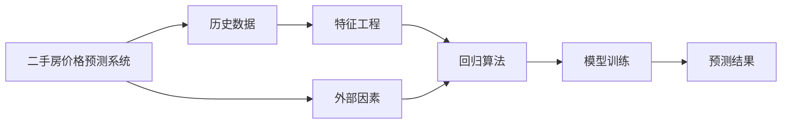
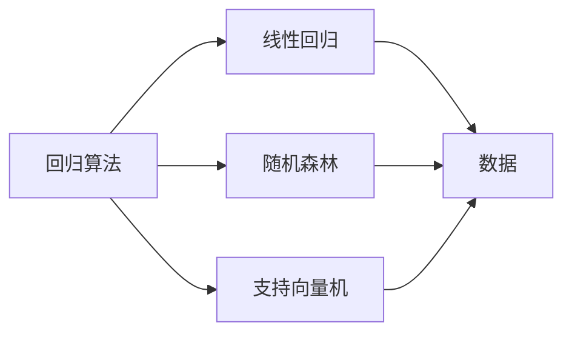
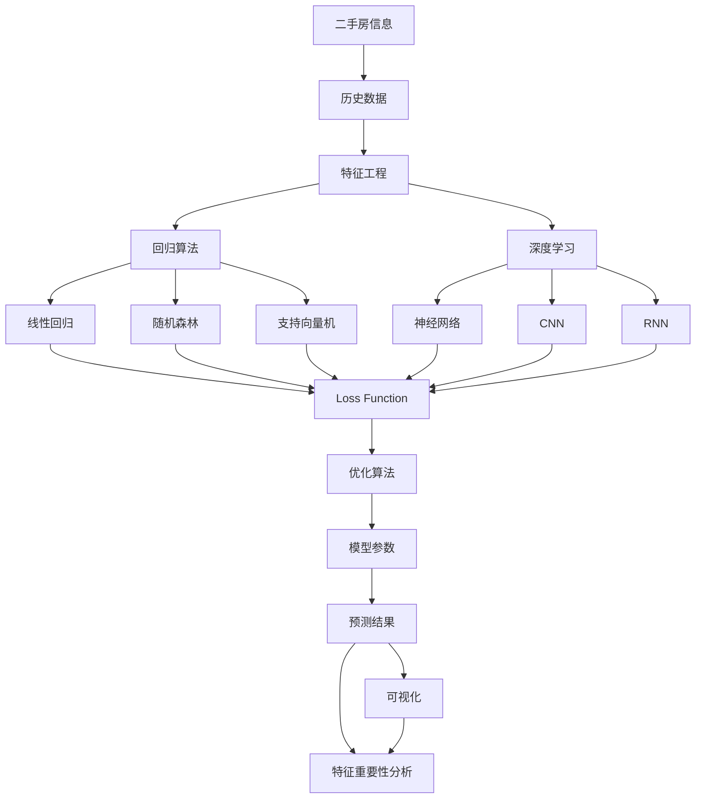

                 

# 二手房价格数据分析预测系统

## 1. 背景介绍

### 1.1 问题由来
随着我国经济的快速发展，房地产市场呈现出快速膨胀的态势，房产交易愈发频繁。然而，房产市场的复杂性使得买卖双方在价格谈判上存在较大分歧。为了解决这一问题，房产中介机构通过竞价手段帮助买卖双方找到市场公允价格，以达到快速交易的目的。然而，这一过程消耗了大量时间和人力成本，且极易产生交易纠纷。

房地产市场的复杂性在于价格受多种因素的影响，如地段、房屋朝向、房屋状态、面积大小、装修程度等。要通过传统的竞价手段找到合理的市场公允价格，其难度很大。尽管有了一些估价模型和软件工具，但这些工具往往需要大量数据支持，且对于单一房产的估价准确度有限。因此，开发一个基于数据驱动的二手房价格预测系统，成为亟需解决的问题。

### 1.2 问题核心关键点
本文聚焦于基于机器学习算法的二手房价格数据分析预测系统。系统能够实时抓取网络上的二手房信息，并结合多种外部因素（如地理信息、房产状态等）进行综合分析，预测当前房产的公允价格，供买卖双方参考。

系统的核心算法包括线性回归、随机森林、支持向量机、深度学习等。通过这些算法，系统能够自动学习和提取房产数据的内在规律，准确预测房产价格。此外，系统还需具备较强的鲁棒性和可解释性，以便用户理解预测过程。

### 1.3 问题研究意义
研究二手房价格数据分析预测系统，对于降低房产交易成本、提高交易效率、避免交易纠纷具有重要意义：

1. 降低房产交易成本。通过预测系统，买卖双方可以在充分了解市场公允价格的基础上进行谈判，避免高估或低估，从而减少交易过程中的资金和时间成本。
2. 提高交易效率。系统可以快速提供房产价格预测结果，大大缩短买卖双方的谈判时间，加速房产交易过程。
3. 避免交易纠纷。通过精确的价格预测，买卖双方可以就房产价格达成一致，减少因价格分歧引发的纠纷。
4. 增强用户信心。系统通过提供详细的预测分析结果，增强用户对房产价格的信心，提升用户满意度。
5. 推动房产市场发展。系统的广泛应用，将有助于提升房产市场的透明度，推动市场健康发展。

## 2. 核心概念与联系

### 2.1 核心概念概述

为更好地理解二手房价格数据分析预测系统，本节将介绍几个密切相关的核心概念：

- 二手房价格预测系统：基于数据驱动的房产价格预测系统，通过机器学习算法对房产数据进行分析，并结合外部因素预测房产价格。
- 特征工程(Feature Engineering)：通过提取、组合、变换房产数据中的特征，增强算法的预测能力。
- 回归算法(Regression)：包括线性回归、随机森林、支持向量机等，用于从历史数据中学习房产价格的内在规律。
- 深度学习(DL)：包括神经网络、卷积神经网络(CNN)、循环神经网络(RNN)等，用于从海量数据中提取更复杂、更抽象的特征。
- 损失函数(Loss Function)：用于衡量预测值与真实值之间的差异，是模型训练的重要指标。
- 优化算法(Optimization Algorithm)：用于最小化损失函数，更新模型参数，如梯度下降法、Adam等。
- 可解释性(Explainability)：通过可视化、特征重要性分析等方法，增强模型的可解释性，便于用户理解预测结果。

这些核心概念之间的逻辑关系可以通过以下Mermaid流程图来展示：



这个流程图展示了大语言模型微调过程中各个核心概念之间的关系：

1. 二手房价格预测系统通过特征工程、回归算法和深度学习等技术，从房产数据中提取特征，建立预测模型。
2. 回归算法包括线性回归、随机森林、支持向量机等，用于从历史数据中学习房产价格的内在规律。
3. 深度学习算法包括神经网络、CNN、RNN等，用于从海量数据中提取更复杂、更抽象的特征。
4. 特征工程通过特征提取、组合和变换，增强算法的预测能力。
5. 损失函数用于衡量预测值与真实值之间的差异，是模型训练的重要指标。
6. 优化算法用于最小化损失函数，更新模型参数，如梯度下降法、Adam等。
7. 可解释性通过可视化、特征重要性分析等方法，增强模型的可解释性。

### 2.2 概念间的关系

这些核心概念之间存在着紧密的联系，形成了二手房价格预测系统的完整生态系统。下面我通过几个Mermaid流程图来展示这些概念之间的关系。

#### 2.2.1 二手房价格预测系统的学习范式



这个流程图展示了二手房价格预测系统的学习范式：

1. 系统从历史数据中获取房产信息，通过特征工程提取特征，使用回归算法进行模型训练。
2. 模型训练过程中，通过优化算法最小化损失函数，更新模型参数。
3. 训练好的模型可以对新的房产信息进行预测，生成预测结果。
4. 系统还可结合外部因素（如地理位置、房屋状态等）进行综合分析，提升预测准确度。

#### 2.2.2 回归算法与深度学习的关系



这个流程图展示了回归算法与深度学习的关系：

1. 回归算法包括线性回归、随机森林、支持向量机等，用于从历史数据中学习房产价格的内在规律。
2. 深度学习算法包括神经网络、CNN、RNN等，用于从海量数据中提取更复杂、更抽象的特征。
3. 回归算法和深度学习算法可以相互结合，增强预测系统的性能。

#### 2.2.3 可解释性与特征工程的关系


这个流程图展示了可解释性与特征工程的关系：

1. 可解释性通过可视化、特征重要性分析等方法，增强模型的可解释性。
2. 可视化方法（如特征重要性图、特征分布图等）能够帮助用户理解模型的预测过程。
3. 特征重要性分析方法（如SHAP值、LIME等）能够帮助用户理解每个特征对预测结果的贡献程度。

### 2.3 核心概念的整体架构

最后，我们用一个综合的流程图来展示这些核心概念在二手房价格预测系统中的整体架构：



这个综合流程图展示了从房产数据获取、特征提取、模型训练到预测结果生成的完整过程：

1. 系统从房产信息中获取历史数据，通过特征工程提取特征。
2. 特征数据分别用于回归算法和深度学习算法，建立预测模型。
3. 回归算法包括线性回归、随机森林、支持向量机等，用于从历史数据中学习房产价格的内在规律。
4. 深度学习算法包括神经网络、CNN、RNN等，用于从海量数据中提取更复杂、更抽象的特征。
5. 回归算法和深度学习算法通过最小化损失函数，更新模型参数，得到最终的预测模型。
6. 预测模型可以对新的房产信息进行预测，生成预测结果。
7. 预测结果通过可视化、特征重要性分析等方法进行解释，增强用户理解。

## 3. 核心算法原理 & 具体操作步骤
### 3.1 算法原理概述

二手房价格数据分析预测系统的核心算法包括线性回归、随机森林、支持向量机、深度学习等。下面逐一介绍这些算法的原理和操作步骤。

### 3.2 算法步骤详解

#### 3.2.1 线性回归

线性回归是最经典的回归算法，用于建立房产价格与特征之间的线性关系。假设房产价格为 $y$，特征为 $x$，线性回归模型的表达式为：

$$
y = \beta_0 + \beta_1 x_1 + \beta_2 x_2 + ... + \beta_n x_n + \epsilon
$$

其中 $\beta_0, \beta_1, \beta_2, ..., \beta_n$ 为回归系数，$\epsilon$ 为误差项。

线性回归的步骤如下：

1. 收集历史数据，将其分为训练集和测试集。
2. 在训练集上，通过最小化损失函数 $L = \frac{1}{2} \sum_{i=1}^{n} (y_i - \hat{y}_i)^2$ 拟合回归模型，得到回归系数 $\beta$。
3. 在测试集上，使用拟合好的模型进行预测，评估预测精度。

#### 3.2.2 随机森林

随机森林是一种集成学习算法，通过构建多个决策树，增强模型的泛化能力和鲁棒性。假设房产价格为 $y$，特征为 $x$，随机森林模型的表达式为：

$$
y = \sum_{i=1}^{k} w_i \cdot \hat{y}_i
$$

其中 $k$ 为决策树的数量，$w_i$ 为第 $i$ 棵决策树的权重，$\hat{y}_i$ 为第 $i$ 棵决策树的预测结果。

随机森林的步骤如下：

1. 收集历史数据，将其分为训练集和测试集。
2. 在训练集上，通过构建多个决策树，预测房产价格。
3. 计算各个决策树的权重，使用投票或平均等方法进行综合预测。
4. 在测试集上，使用综合预测结果进行评估，评估预测精度。

#### 3.2.3 支持向量机

支持向量机是一种基于分类和回归的统计学习算法，通过构建超平面，实现房产价格的预测。假设房产价格为 $y$，特征为 $x$，支持向量机的表达式为：

$$
\hat{y} = sign(\sum_{i=1}^{n} \alpha_i y_i x_i + b)
$$

其中 $\alpha_i$ 为决策函数的系数，$b$ 为偏置项。

支持向量机的步骤如下：

1. 收集历史数据，将其分为训练集和测试集。
2. 在训练集上，通过最小化损失函数 $L = \frac{1}{2} ||w||^2 + C \sum_{i=1}^{n} \xi_i$ 拟合支持向量机，得到决策函数系数 $\alpha$ 和偏置项 $b$。
3. 在测试集上，使用决策函数进行预测，评估预测精度。

#### 3.2.4 深度学习

深度学习是一种基于神经网络的机器学习算法，用于从海量数据中提取更复杂、更抽象的特征。假设房产价格为 $y$，特征为 $x$，深度学习模型的表达式为：

$$
\hat{y} = f_{\theta}(x)
$$

其中 $f_{\theta}$ 为神经网络模型，$\theta$ 为模型参数。

深度学习模型的步骤如下：

1. 收集历史数据，将其分为训练集和测试集。
2. 在训练集上，通过最小化损失函数 $L = \frac{1}{2} ||w||^2 + C \sum_{i=1}^{n} \xi_i$ 拟合神经网络模型，得到模型参数 $\theta$。
3. 在测试集上，使用拟合好的模型进行预测，评估预测精度。

### 3.3 算法优缺点

线性回归、随机森林、支持向量机和深度学习算法各有优缺点，具体如下：

#### 3.3.1 线性回归

优点：
- 模型简单，易于理解和实现。
- 预测速度较快，适用于小规模数据集。

缺点：
- 对数据线性关系要求较高，难以处理非线性数据。
- 预测结果较为粗糙，缺乏细节。

#### 3.3.2 随机森林

优点：
- 模型具有较好的泛化能力和鲁棒性，适用于处理非线性数据。
- 可以自动选择最优特征，减少过拟合风险。

缺点：
- 模型较为复杂，训练和预测速度较慢。
- 难以解释模型的预测过程。

#### 3.3.3 支持向量机

优点：
- 模型具有较好的泛化能力和鲁棒性，适用于处理高维数据。
- 可以处理非线性数据，通过核函数变换实现。

缺点：
- 对数据噪声敏感，需要进行参数调优。
- 模型较为复杂，训练和预测速度较慢。

#### 3.3.4 深度学习

优点：
- 可以处理大规模、高维数据，提取更复杂、更抽象的特征。
- 具有较强的泛化能力和鲁棒性，适用于处理非线性数据。

缺点：
- 模型较为复杂，训练和预测速度较慢。
- 需要大量的数据和计算资源。

### 3.4 算法应用领域

二手房价格数据分析预测系统涉及多种算法，具体应用领域如下：

- 线性回归：适用于小规模、线性关系明确的数据集，用于房产价格的基础预测。
- 随机森林：适用于非线性数据集，用于房产价格的复杂预测。
- 支持向量机：适用于高维数据集，用于房产价格的高维预测。
- 深度学习：适用于海量、高维数据集，用于房产价格的复杂预测。

此外，这些算法还可应用于其他领域，如金融市场预测、股票价格分析、商品价格预测等。

## 4. 数学模型和公式 & 详细讲解  
### 4.1 数学模型构建

假设二手房价格为 $y$，特征为 $x = (x_1, x_2, ..., x_n)$，其中 $x_1, x_2, ..., x_n$ 为影响房价的各个因素，如地理位置、房屋状态、装修程度等。

### 4.2 公式推导过程

#### 4.2.1 线性回归

假设历史数据集为 $D = \{(x_i, y_i)\}_{i=1}^{m}$，其中 $x_i = (x_{i1}, x_{i2}, ..., x_{in})$，$y_i$ 为房价。线性回归模型的最小二乘法求解步骤如下：

1. 计算样本均值 $\bar{x} = \frac{1}{m} \sum_{i=1}^{m} x_i$ 和样本方差 $S_x^2 = \frac{1}{m} \sum_{i=1}^{m} (x_i - \bar{x})^2$。
2. 计算回归系数 $\beta = (S_x^2 \cdot S_y^2)^{-1} S_x^2 \sum_{i=1}^{m} (x_i - \bar{x}) y_i$。
3. 计算回归截距 $\beta_0 = \bar{y} - \beta \bar{x}$。

其中 $S_y^2 = \frac{1}{m} \sum_{i=1}^{m} (y_i - \bar{y})^2$ 为样本方差。

#### 4.2.2 随机森林

假设历史数据集为 $D = \{(x_i, y_i)\}_{i=1}^{m}$，其中 $x_i = (x_{i1}, x_{i2}, ..., x_{in})$，$y_i$ 为房价。随机森林模型的最小二乘法求解步骤如下：

1. 从历史数据集中随机抽取 $k$ 个样本作为训练集，剩余样本作为测试集。
2. 对训练集 $D_k$ 构建 $t$ 棵决策树，预测房价。
3. 计算每个决策树的预测误差 $E_k$。
4. 计算各个决策树的权重 $w_i = \frac{1}{t} \sum_{j=1}^{t} \frac{1}{n_i}$，其中 $n_i$ 为第 $i$ 棵决策树的叶子节点数。
5. 使用投票或平均等方法进行综合预测，得到预测结果。

#### 4.2.3 支持向量机

假设历史数据集为 $D = \{(x_i, y_i)\}_{i=1}^{m}$，其中 $x_i = (x_{i1}, x_{i2}, ..., x_{in})$，$y_i$ 为房价。支持向量机的最小二乘法求解步骤如下：

1. 计算样本均值 $\bar{x} = \frac{1}{m} \sum_{i=1}^{m} x_i$ 和样本方差 $S_x^2 = \frac{1}{m} \sum_{i=1}^{m} (x_i - \bar{x})^2$。
2. 构造超平面 $w \cdot x + b = 0$。
3. 计算支持向量 $\alpha_i$ 和偏置项 $b$，使得误差最小化。
4. 使用支持向量进行预测。

#### 4.2.4 深度学习

假设历史数据集为 $D = \{(x_i, y_i)\}_{i=1}^{m}$，其中 $x_i = (x_{i1}, x_{i2}, ..., x_{in})$，$y_i$ 为房价。深度学习模型的最小二乘法求解步骤如下：

1. 收集历史数据，将其分为训练集和测试集。
2. 在训练集上，通过最小化损失函数 $L = \frac{1}{2} ||w||^2 + C \sum_{i=1}^{n} \xi_i$ 拟合神经网络模型，得到模型参数 $\theta$。
3. 在测试集上，使用拟合好的模型进行预测，评估预测精度。

### 4.3 案例分析与讲解

假设某城市共有 $m$ 套二手房数据，每套房产有 $n$ 个特征，记为 $x_1, x_2, ..., x_n$。

#### 4.3.1 线性回归案例

使用线性回归模型对某城市的二手房价格进行预测。假设历史数据集为 $D = \{(x_i, y_i)\}_{i=1}^{m}$，其中 $x_i = (x_{i1}, x_{i2}, ..., x_{in})$，$y_i$ 为房价。

1. 收集历史数据，将其分为训练集和测试集。
2. 在训练集上，通过最小化损失函数 $L = \frac{1}{2} \sum_{i=1}^{n} (y_i - \hat{y}_i)^2$ 拟合线性回归模型，得到回归系数 $\beta$。
3. 在测试集上，使用拟合好的模型进行预测，评估预测精度。

#### 4.3.2 随机森林案例

使用随机森林模型对某城市的二手房价格进行预测。假设历史数据集为 $D = \{(x_i, y_i)\}_{i=1}^{m}$，其中 $x_i = (x_{i1}, x_{i2}, ..., x_{in})$，$y_i$ 为房价。

1. 从历史数据集中随机抽取 $k$ 个样本作为训练集，剩余样本作为测试集。
2. 对训练集 $D_k$ 构建 $t$ 棵决策树，预测房价。
3. 计算每个决策树的预测误差 $E_k$。
4. 计算各个决策树的权重 $w_i = \frac{1}{t} \sum_{j=1}^{t} \frac{1}{n_i}$，其中 $n_i$ 为第 $i$ 棵决策树的叶子节点数。
5. 使用投票或平均等方法进行综合预测，得到预测结果。

#### 4.3.3 支持向量机案例

使用支持向量机模型对某城市的二手房价格进行预测。假设历史数据集为 $D = \{(x_i, y_i)\}_{i=1}^{m}$，其中 $x_i = (x_{i1}, x_{i2}, ..., x_{in})$，$y_i$ 为房价。

1. 收集历史数据，将其分为训练集和测试集。
2. 在训练集上，通过最小化损失函数 $L = \frac{1}{2} ||w||^2 + C \sum_{i=1}^{n} \xi_i$ 拟合支持向量机，得到决策函数系数 $\alpha$ 和偏置项 $b$。
3. 在测试集上，使用决策函数进行预测，评估预测精度。

#### 4.3.4 深度学习案例

使用深度学习模型对某城市的二手房价格进行预测。假设历史数据集为 $D = \{(x_i, y_i)\}_{i=1}^{m}$，其中 $x_i = (x_{i1}, x_{i2}, ..., x_{in})$，$y_i$ 为房价。

1. 收集历史数据，将其分为训练集和测试集。
2. 在训练集上，通过最小化损失函数 $L = \frac{1}{2} ||w||^2 + C \sum_{i=1}^{n} \xi_i$ 拟合神经网络模型，得到模型参数 $\theta$。
3. 在测试集上，使用拟合好的模型进行预测，评估预测精度。

## 5. 项目实践：代码实例和详细解释说明
### 5.1 开发环境搭建

在进行二手房价格数据分析预测系统开发前，我们需要准备好开发环境。以下是使用Python进行PyTorch开发的环境配置流程：

1. 安装Anaconda：从官网下载并安装Anaconda，用于创建独立的Python环境。

2. 创建并激活虚拟环境：
```bash
conda create -n pytorch-env python=3.8 
conda activate pytorch-env
```

3. 安装PyTorch：根据CUDA版本，从官网获取对应的安装命令。例如：
```bash
conda install pytorch torchvision torchaudio cudatoolkit=11.1 -c pytorch -c conda-forge
```

4. 安装相关库：
```bash
pip install pandas numpy matplotlib scikit-learn
```

完成上述步骤后，即可在`pytorch-env`环境中开始开发实践。

### 5.2 源代码详细实现

下面我们以线性回归模型为例，给出使用PyTorch进行二手房价格预测的PyTorch代码实现。

首先，定义线性回归模型：

```python
import torch
import torch.nn as nn
import torch.optim as optim

class LinearRegression(nn.Module):
    def __init__(self, input_dim):
        super(LinearRegression, self).__init__()
        self.linear = nn.Linear(input_dim, 1)
    
    def forward(self, x):
        return self.linear(x)
```

然后，定义训练函数：

```python
def train(model, train_dataset, valid_dataset, learning_rate, num_epochs):
    optimizer = optim.SGD(model.parameters(), lr=learning_rate)
    loss_fn = nn.MSELoss()
    
    for epoch in range(num_epochs):
        model.train()
        for batch in train_dataset:
            inputs, targets = batch
            optimizer.zero_grad()
            outputs = model(inputs)
            loss = loss_fn(outputs, targets)
            loss.backward()
            optimizer.step()
        
        model.eval()
        with torch.no_grad():
            valid_loss = 0
            for batch in valid_dataset:
                inputs, targets = batch
                outputs = model(inputs)
                loss = loss_fn(outputs, targets)
                valid_loss += loss.item()
            valid_loss /= len(valid_dataset)
            
        print(f"Epoch {epoch+1}, train loss: {train_loss:.3f}, valid loss: {valid_loss:.3f}")
```

最后，启动训练流程：

```python
train_model = LinearRegression(input_dim)
train_dataset = ...
valid_dataset = ...
train(train_model, train_dataset, valid_dataset, learning_rate, num_epochs)
```

以上就是使用PyTorch进行线性回归模型训练的完整代码实现。可以看到，得益

