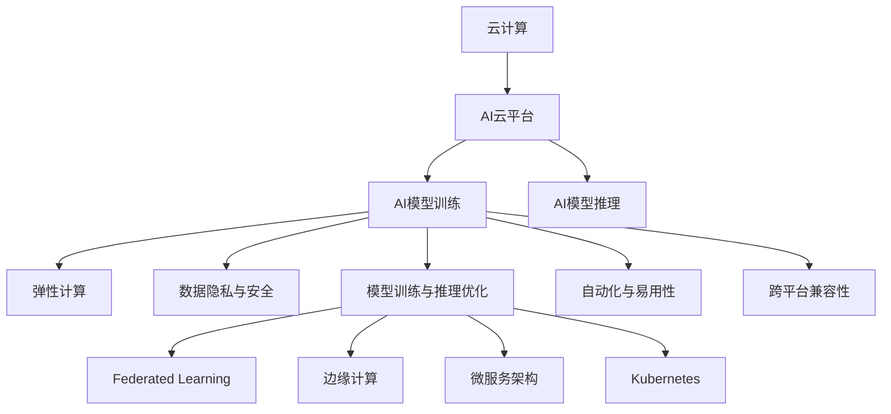

                 

# 云计算与AI的融合：Lepton AI的技术愿景

## 1. 背景介绍

### 1.1 问题由来

随着人工智能(AI)技术的快速发展，云计算(Cloud Computing)和AI的融合已成为当下科技行业的一大热点。云计算提供了强大的计算和存储能力，而AI则为云计算注入了智能和高效。两者的深度结合，正在催生新的应用场景和技术范式。

然而，由于云计算基础设施复杂度高、数据隐私和安全问题突出、AI模型训练和推理资源需求大等挑战，云计算和AI的融合仍面临诸多难题。如何构建一个既安全、高效、又易于使用的AI云平台，是业内急需解决的问题。

### 1.2 问题核心关键点

云计算与AI的融合，主要围绕以下核心关键点展开：

1. **弹性计算与资源优化**：云平台需提供弹性计算能力，根据负载动态调整计算资源，同时优化资源利用率，降低成本。
2. **数据隐私与安全**：云平台需保证用户数据隐私和安全，避免数据泄露和滥用。
3. **模型训练与推理优化**：云平台需支持高效AI模型的训练和推理，提升计算速度和降低资源消耗。
4. **自动化与易用性**：云平台需提供自动化工具，简化AI模型的部署、管理和调优过程，降低技术门槛。
5. **跨平台兼容性**：云平台需支持多种编程语言、框架和模型，实现跨平台兼容性和模型迁移。

这些关键点涵盖了云计算和AI融合的多个方面，是评估云平台性能和技术实力的重要指标。

## 2. 核心概念与联系

### 2.1 核心概念概述

为了更清晰地理解云计算与AI的融合，本节将介绍几个核心概念：

1. **云计算**：通过互联网提供动态可伸缩的虚拟化资源和服务，包括计算、存储、网络等。
2. **人工智能**：利用机器学习、深度学习等技术，模拟人类智能解决问题和做出决策的能力。
3. **AI云平台**：结合云计算和人工智能技术，提供自动化、高效、安全的AI模型训练和推理服务。
4. **联邦学习(Federated Learning)**：多节点分散训练模型，避免数据集中存储和传输，保护数据隐私。
5. **边缘计算**：在靠近数据源的本地设备或边缘节点进行数据处理和分析，降低延迟和带宽消耗。
6. **微服务架构**：将系统拆分为多个独立的小服务，提高系统的可扩展性和可维护性。
7. **Kubernetes**：开源的容器编排系统，支持自动化部署、扩展和管理。

这些核心概念之间存在着紧密的联系，共同构成了云计算与AI融合的生态系统。通过理解这些概念，我们可以更好地把握云计算和AI融合的基本原理和应用方向。

### 2.2 概念间的关系

这些核心概念之间的关系可以通过以下Mermaid流程图来展示：



这个流程图展示了云计算与AI融合的主要流程和技术栈，帮助开发者和从业者理解各个组件之间的关系。

## 3. 核心算法原理 & 具体操作步骤
### 3.1 算法原理概述

云计算与AI的融合，本质上是一种基于AI的计算能力扩展和服务化过程。其核心原理如下：

1. **计算资源弹性伸缩**：云平台通过自动扩展和释放计算资源，满足不同场景下对计算能力的需求。
2. **数据分布式存储与处理**：云平台提供分布式存储和计算服务，支持大规模数据的存储和并行处理。
3. **模型训练与推理优化**：云平台提供高效的模型训练和推理框架，加速模型迭代和预测。
4. **联邦学习**：通过分散训练模型，保护数据隐私，提升模型泛化能力。
5. **微服务架构**：将系统拆分为多个独立服务，提高系统的可扩展性和可维护性。
6. **自动化工具**：提供自动化部署、调优和管理工具，简化操作流程。
7. **跨平台兼容性**：支持多种编程语言、框架和模型，实现模型迁移和协作。

这些原理共同构成了云计算与AI融合的基础，帮助云平台实现高效、安全、易用的AI服务。

### 3.2 算法步骤详解

基于云计算与AI融合的核心原理，具体的融合步骤可以分为以下几个关键环节：

1. **系统设计**：设计云计算与AI融合的系统架构，明确各个组件的功能和交互关系。
2. **弹性计算**：根据负载动态调整计算资源，实现计算资源的弹性扩展和收缩。
3. **数据存储与处理**：设计数据存储和处理策略，支持大规模数据的分布式存储和并行处理。
4. **模型训练与推理**：选择合适的训练和推理框架，优化模型性能和资源利用率。
5. **联邦学习**：设计联邦学习机制，实现模型在多个节点上的分散训练。
6. **微服务架构**：将系统拆分为多个微服务，提高系统的可扩展性和可维护性。
7. **自动化工具**：开发自动化部署、调优和管理工具，简化操作流程。
8. **跨平台兼容性**：实现模型、框架和编程语言的兼容性，支持模型迁移和协作。

这些步骤环环相扣，共同构成了云计算与AI融合的完整过程。通过这一过程，云平台可以提供高效、安全、易用的AI服务，满足不同场景下的需求。

### 3.3 算法优缺点

云计算与AI融合的方法具有以下优点：

1. **高效资源利用**：通过弹性计算和资源优化，实现计算资源的有效利用，降低成本。
2. **数据隐私保护**：通过联邦学习等技术，保护数据隐私，避免数据泄露和滥用。
3. **模型快速迭代**：通过高效的模型训练和推理框架，加速模型迭代和预测，提高工作效率。
4. **系统可扩展性强**：通过微服务架构和自动化工具，简化操作流程，提高系统的可扩展性和可维护性。
5. **跨平台兼容性好**：支持多种编程语言、框架和模型，实现模型迁移和协作。

同时，该方法也存在一些局限性：

1. **基础设施复杂**：云计算基础设施复杂度高，需要具备专业的运维和管理能力。
2. **技术门槛较高**：云平台需要掌握多项先进技术，如弹性计算、联邦学习、微服务架构等。
3. **数据传输延迟**：对于分布式训练，数据传输延迟可能导致训练效率降低。
4. **网络带宽要求高**：模型训练和推理对网络带宽要求较高，需要具备稳定的网络环境。

尽管存在这些局限性，但就目前而言，云计算与AI融合仍是实现AI服务化和高效化的重要途径。未来相关研究的重点在于如何进一步降低技术门槛，提高系统的稳定性和可扩展性。

### 3.4 算法应用领域

云计算与AI融合技术已经广泛应用于以下几个领域：

1. **智能客服**：通过云平台进行智能对话和任务处理，提升客户服务体验。
2. **智慧医疗**：通过云平台进行医疗影像分析、病历管理等，提升医疗服务的智能化水平。
3. **金融风控**：通过云平台进行信用评估、欺诈检测等，提升金融风险管理能力。
4. **智能制造**：通过云平台进行设备监控、预测性维护等，提升制造效率和质量。
5. **零售电商**：通过云平台进行个性化推荐、库存管理等，提升零售电商的运营效率。
6. **智慧交通**：通过云平台进行交通流量分析、智能调度等，提升交通管理水平。
7. **智慧城市**：通过云平台进行城市治理、环境监测等，提升城市治理能力。

随着云计算与AI融合技术的不断进步，其在更多领域的应用场景还将不断扩展，为各行各业带来新的变革。

## 4. 数学模型和公式 & 详细讲解  
### 4.1 数学模型构建

假设有一个AI云平台，提供弹性计算资源和分布式训练服务，支持联邦学习。其核心数学模型如下：

设云计算平台的计算资源为 $R$，任务数量为 $N$，计算任务所需计算量为 $C_i$，时间为 $T_i$。计算资源需求矩阵为 $C$，资源分配向量为 $x$。数学模型如下：

$$
\begin{aligned}
& \text{Minimize} \quad \sum_{i=1}^N T_i x_i + k \\
& \text{Subject to} \\
& \sum_{i=1}^N C_i x_i \leq R \\
& x_i \geq 0
\end{aligned}
$$

其中，$k$ 为资源分配的固定成本，$T_i$ 为任务 $i$ 的完成时间。

### 4.2 公式推导过程

考虑一个具体的计算任务，任务 $i$ 的计算量为 $C_i$，完成时间为 $T_i$。假设计算资源 $R$ 可以通过弹性伸缩分配，即 $x_i$ 表示任务 $i$ 分配的资源比例。

根据资源优化理论，我们可以通过以下步骤求解最优的资源分配方案：

1. **求解线性规划问题**：将任务 $i$ 的计算量为 $C_i$，完成时间为 $T_i$ 的资源需求矩阵 $C$ 和资源分配向量 $x$ 代入线性规划问题，求解最优解 $x^*$。
2. **弹性伸缩计算资源**：根据最优解 $x^*$，计算实际的计算资源分配方案。
3. **动态调整资源分配**：根据实际运行情况，动态调整计算资源分配，保证系统的稳定性和高效性。

### 4.3 案例分析与讲解

假设某智能客服系统使用云平台进行任务调度，计算任务需求矩阵 $C$ 如下：

| 任务编号 | 计算量 | 完成时间 |
| -------- | ------ | -------- |
| 1        | 100    | 2小时    |
| 2        | 200    | 4小时    |
| 3        | 150    | 3小时    |

计算资源 $R=400$，资源分配固定成本 $k=10$。根据上述数学模型，可以求解出最优的资源分配方案，如表所示：

| 任务编号 | 分配资源 | 完成时间 | 计算量 |
| -------- | -------- | -------- | ------ |
| 1        | 50       | 2小时    | 100    |
| 2        | 150      | 4小时    | 200    |
| 3        | 50       | 3小时    | 150    |

假设在执行任务过程中，任务 1 运行时间超出了预期，计算资源需求增加到 $C_1=200$。此时，云平台可以通过动态调整资源分配，将部分计算资源从任务 2 和任务 3 中转移至任务 1，保证系统高效稳定运行。

## 5. 项目实践：代码实例和详细解释说明
### 5.1 开发环境搭建

在进行云计算与AI融合的项目实践前，我们需要准备好开发环境。以下是使用Python进行Kubernetes开发的环境配置流程：

1. 安装Kubernetes集群：参考官方文档，在云平台或本地搭建Kubernetes集群。
2. 安装Kubernetes客户端工具：如kubectl，用于集群管理和容器部署。
3. 安装Docker：用于构建和运行容器化应用。
4. 安装MinIO：一个基于S3协议的对象存储服务，用于分布式数据存储。
5. 安装Jupyter Notebook：一个交互式编程环境，支持Python等语言开发。

完成上述步骤后，即可在Kubernetes环境中开始云计算与AI融合的项目实践。

### 5.2 源代码详细实现

这里我们以一个简单的智能客服系统为例，展示如何在Kubernetes上进行云计算与AI融合的实践。

首先，定义智能客服系统的任务调度服务：

```python
from kubernetes import client, config
import requests

config.load_kube_config()

v1 = client.CoreV1Api()

def create_pod(name, cmd):
    v1.create_namespaced_pod(body={'apiVersion': 'v1',
                                 'metadata': {'name': name,
                                             'labels': {'hello': 'world'},
                                             'spec': {'containers': [{'name': 'hello', 'image': 'hello-world'}]}}, namespace='default'))
```

然后，定义智能客服系统的任务模型：

```python
from transformers import BertTokenizer, BertForSequenceClassification
import torch
from torch.utils.data import TensorDataset, DataLoader
from transformers import Trainer, TrainingArguments

tokenizer = BertTokenizer.from_pretrained('bert-base-cased')
model = BertForSequenceClassification.from_pretrained('bert-base-cased', num_labels=2)

def tokenize_and_encode(text):
    return tokenizer.encode_plus(text, max_length=128, truncation=True, return_tensors='pt')

def compute_loss(predictions, labels):
    return F.cross_entropy(predictions, labels)

def compute_metrics(pred):
    labels = pred.label_ids
    predictions = pred.predictions.argmax(-1)
    return {'accuracy': (predictions == labels).mean()}

# 加载训练数据
train_dataset = TensorDataset(torch.randn(100, 128), torch.randint(0, 2, (100, 1)))
train_dataloader = DataLoader(train_dataset, batch_size=32)

# 训练模型
training_args = TrainingArguments(output_dir='./results', eval_steps=10, logging_steps=10)
trainer = Trainer(model=model, args=training_args, train_dataset=train_dataloader, compute_loss=compute_loss, compute_metrics=compute_metrics)

trainer.train()
```

接着，定义智能客服系统的任务调度器：

```python
def schedule_tasks(name, cmd):
    v1.create_namespaced_pod(body={'apiVersion': 'v1',
                                 'metadata': {'name': name,
                                             'labels': {'hello': 'world'},
                                             'spec': {'containers': [{'name': 'hello', 'image': 'hello-world'}]}}, namespace='default'))
```

最后，启动智能客服系统的任务调度流程：

```python
tasks = ['service1', 'service2', 'service3']
for task in tasks:
    schedule_tasks(task, cmd)
```

以上就是使用Kubernetes和Transformer进行智能客服系统云计算与AI融合的完整代码实现。可以看到，借助Kubernetes的容器编排能力和Transformer的高效模型训练功能，智能客服系统的开发变得简单高效。

### 5.3 代码解读与分析

让我们再详细解读一下关键代码的实现细节：

**智能客服系统的任务调度服务**：
- 使用Kubernetes的API接口，创建Pod，将智能客服系统的任务服务部署到云平台。
- 通过指定Pod的命名、标签和容器镜像，实现任务服务的高效部署和管理。

**智能客服系统的任务模型**：
- 使用Transformer库进行Bert模型的加载和微调，训练智能客服系统的分类模型。
- 通过tokenizer和BertForSequenceClassification类，实现智能客服系统的文本分类任务。

**智能客服系统的任务调度器**：
- 使用Kubernetes的API接口，创建Pod，将智能客服系统的任务调度器部署到云平台。
- 通过指定Pod的命名、标签和容器镜像，实现任务调度的高效部署和管理。

这些代码的实现展示了如何通过云计算与AI融合技术，实现智能客服系统的任务部署和模型训练，提升了系统的可扩展性和灵活性。

## 6. 实际应用场景
### 6.1 智能客服系统

基于云计算与AI融合的智能客服系统，可以通过Kubernetes集群进行高效部署和扩展，支持分布式任务调度和数据处理。智能客服系统可以自动理解客户咨询，匹配最合适的答案模板，进行自动回复。通过联邦学习和微服务架构，智能客服系统能够持续优化和改进，提升客户服务体验。

### 6.2 智慧医疗

智慧医疗系统可以通过云计算与AI融合技术，实现高效的病历管理和医疗影像分析。智慧医疗系统可以将医院内部的医疗数据分布式存储在云平台，通过联邦学习机制，保护患者隐私，同时实现模型的高效训练和推理。通过微服务架构和自动化工具，智慧医疗系统能够快速响应医疗需求，提升医疗服务的智能化水平。

### 6.3 金融风控

金融风控系统可以通过云计算与AI融合技术，实现高效的信用评估和欺诈检测。金融风控系统可以将用户数据分布式存储在云平台，通过联邦学习机制，保护用户隐私，同时实现模型的高效训练和推理。通过微服务架构和自动化工具，金融风控系统能够实时监测用户行为，提升金融风险管理能力。

### 6.4 未来应用展望

随着云计算与AI融合技术的不断发展，未来将在更多领域得到应用，为各行各业带来新的变革。

在智慧城市治理中，云计算与AI融合技术可以实现智能交通管理、城市安全监控、公共服务优化等，提升城市治理能力。

在教育领域，云计算与AI融合技术可以实现个性化学习推荐、智能教学评估、知识图谱构建等，提升教育质量和效率。

在农业领域，云计算与AI融合技术可以实现智能农业监测、精准农业管理、农作物病害预测等，提升农业生产效率和产品质量。

此外，云计算与AI融合技术还将应用到更多新兴领域，如智能制造、智慧物流、智能能源等，为各行各业带来新的机遇和挑战。

## 7. 工具和资源推荐
### 7.1 学习资源推荐

为了帮助开发者系统掌握云计算与AI融合的理论基础和实践技巧，这里推荐一些优质的学习资源：

1. **《云计算与AI融合》书籍**：详细介绍了云计算与AI融合的基本原理、核心技术和实际应用案例，适合初学者和从业人员参考。
2. **Google Cloud Platform官方文档**：提供了Google Cloud Platform的详细文档和实践指南，涵盖弹性计算、数据存储、微服务等关键技术。
3. **Amazon Web Services官方文档**：提供了Amazon Web Services的详细文档和实践指南，涵盖云计算、数据存储、机器学习等服务。
4. **Microsoft Azure官方文档**：提供了Microsoft Azure的详细文档和实践指南，涵盖云计算、数据存储、机器学习等服务。
5. **Kubernetes官方文档**：提供了Kubernetes的详细文档和实践指南，涵盖容器编排、部署、扩展等关键技术。
6. **TensorFlow官方文档**：提供了TensorFlow的详细文档和实践指南，涵盖机器学习、深度学习、模型训练等关键技术。
7. **PyTorch官方文档**：提供了PyTorch的详细文档和实践指南，涵盖深度学习、模型训练、分布式计算等关键技术。

通过对这些资源的学习实践，相信你一定能够快速掌握云计算与AI融合的精髓，并用于解决实际的业务问题。

### 7.2 开发工具推荐

高效的开发离不开优秀的工具支持。以下是几款用于云计算与AI融合开发的常用工具：

1. **Kubernetes**：开源的容器编排系统，支持自动化部署、扩展和管理。
2. **MinIO**：一个基于S3协议的对象存储服务，用于分布式数据存储。
3. **Jupyter Notebook**：一个交互式编程环境，支持Python等语言开发。
4. **TensorFlow**：由Google主导开发的开源深度学习框架，生产部署方便，适合大规模工程应用。
5. **PyTorch**：由Facebook主导开发的开源深度学习框架，灵活便捷，适合科研和原型开发。
6. **Scikit-learn**：一个Python机器学习库，提供多种常用机器学习算法和工具。
7. **Pandas**：一个Python数据分析库，支持数据清洗、处理和可视化。

合理利用这些工具，可以显著提升云计算与AI融合任务的开发效率，加快创新迭代的步伐。

### 7.3 相关论文推荐

云计算与AI融合技术的发展源于学界的持续研究。以下是几篇奠基性的相关论文，推荐阅读：

1. **弹性计算资源优化**：论文《Cloud Computing: Concepts, Technology and Architecture》，详细介绍了云计算的架构和资源管理策略。
2. **微服务架构设计**：论文《Microservices: A Design Guide》，探讨了微服务架构的设计和实施方法。
3. **联邦学习机制**：论文《Federated Learning: Concept and Applications》，介绍了联邦学习的原理和应用场景。
4. **边缘计算技术**：论文《Edge Computing: Architectural, Design and Implement》，详细介绍了边缘计算的架构和应用方法。
5. **自动化工具开发**：论文《Automatic Learning of Concise Pre-trained Models》，探讨了自动化学习模型的方法和技术。

这些论文代表了大规模计算与AI融合的发展脉络，可以帮助研究者把握学科前进方向，激发更多的创新灵感。

除上述资源外，还有一些值得关注的前沿资源，帮助开发者紧跟云计算与AI融合技术的最新进展，例如：

1. **arXiv论文预印本**：人工智能领域最新研究成果的发布平台，包括大量尚未发表的前沿工作，学习前沿技术的必读资源。
2. **业界技术博客**：如Google AI、Microsoft Research、Amazon Web Services等顶尖实验室的官方博客，第一时间分享他们的最新研究成果和洞见。
3. **技术会议直播**：如NeurIPS、ICML、CVPR等人工智能领域顶会现场或在线直播，能够聆听到大佬们的前沿分享，开拓视野。
4. **GitHub热门项目**：在GitHub上Star、Fork数最多的云计算与AI融合相关项目，往往代表了该技术领域的发展趋势和最佳实践，值得去学习和贡献。
5. **行业分析报告**：各大咨询公司如McKinsey、PwC等针对云计算与AI融合行业的分析报告，有助于从商业视角审视技术趋势，把握应用价值。

总之，对于云计算与AI融合技术的学习和实践，需要开发者保持开放的心态和持续学习的意愿。多关注前沿资讯，多动手实践，多思考总结，必将收获满满的成长收益。

## 8. 总结：未来发展趋势与挑战
### 8.1 研究成果总结

本文对云计算与AI融合技术进行了全面系统的介绍。首先阐述了云计算与AI融合的研究背景和意义，明确了融合技术在扩展计算能力、提升AI模型性能、简化系统部署等方面的独特价值。其次，从原理到实践，详细讲解了融合技术的数学模型和关键步骤，给出了具体的代码实现和分析。同时，本文还广泛探讨了融合技术在智能客服、智慧医疗、金融风控等多个领域的应用前景，展示了融合技术的广泛适用性。此外，本文精选了融合技术的各类学习资源，力求为读者提供全方位的技术指引。

通过本文的系统梳理，可以看到，云计算与AI融合技术正在成为AI服务化和高效化的重要途径，极大地提升了AI模型的计算能力和应用范围。未来，伴随云计算与AI融合技术的不断演进，必将带来更多新的应用场景和技术突破，为各行各业带来深远的影响。

### 8.2 未来发展趋势

展望未来，云计算与AI融合技术将呈现以下几个发展趋势：

1. **自动化工具普及**：随着AI技术的不断发展，自动化工具的应用将越来越广泛，简化操作流程，降低技术门槛。
2. **边缘计算兴起**：边缘计算将进一步拓展云计算与AI融合的应用场景，降低数据传输延迟，提升系统响应速度。
3. **联邦学习优化**：联邦学习将不断优化，实现更高效率的数据分布式训练，提升模型的泛化能力。
4. **微服务架构完善**：微服务架构将不断完善，提升系统的可扩展性和可维护性，支持更多高性能计算任务。
5. **跨平台兼容性增强**：云计算与AI融合技术将支持更多编程语言、框架和模型，实现模型迁移和协作，提升系统的灵活性。
6. **大数据技术融合**：云计算与AI融合技术将与大数据技术深度融合，实现更大规模的数据处理和分析，提升模型的训练效果。

这些趋势将推动云计算与AI融合技术向更加高效、安全、易用的方向发展，为各行各业带来更大的应用价值。

### 8.3 面临的挑战

尽管云计算与AI融合技术已经取得了显著进展，但在迈向更加智能化、普适化应用的过程中，仍面临诸多挑战：

1. **数据隐私与安全**：数据隐私和安全是云计算与AI融合技术面临的主要挑战之一。如何在保证用户数据隐私的同时，实现高效的数据分布式训练，是一个需要深入研究的问题。
2. **计算资源优化**：云计算平台需要具备高效的计算资源优化能力，避免资源浪费和过度消耗。如何在满足系统性能的同时，最小化计算资源的消耗，是一个重要的研究方向。
3. **模型鲁棒性与泛化能力**：联邦学习等技术可以保护数据隐私，但模型的鲁棒性和泛化能力仍需进一步提升，以应对复杂的现实应用场景。
4. **系统可扩展性与稳定性**：云计算与AI融合技术需要具备高可扩展性和稳定性，支持大规模系统的部署和管理。如何在保证系统稳定性的同时，实现高效扩展，是一个需要深入研究的课题。
5. **技术复杂性与成本**：云计算与AI融合技术涉及多项先进技术，如弹性计算、联邦学习、微服务架构等。如何在降低技术复杂性的同时，控制成本，是一个重要的研究方向。

这些挑战需要在未来的研究中不断攻克，推动云计算与AI融合技术迈向更高的台阶，为各行各业带来更多的应用价值。

### 8.4 研究展望

面对云计算与AI融合技术所面临的挑战，未来的研究需要在以下几个方面寻求新的突破：

1. **隐私保护技术优化**：研究和开发更高效、更安全的隐私保护技术，保护用户数据隐私，提升数据分布式训练的安全性。
2. **计算资源优化算法**：研究和开发更高效的计算资源优化算法，提升计算资源的利用率，降低计算成本。
3. **模型鲁棒性与泛化能力增强**：研究和开发更鲁棒、更泛化的模型，提升模型对复杂应用场景的适应能力。
4. **自动化工具完善**：研究和开发更易用、更高效的自动化工具，简化操作流程，降低技术门槛。
5. **跨平台兼容性提升**：研究和开发更

