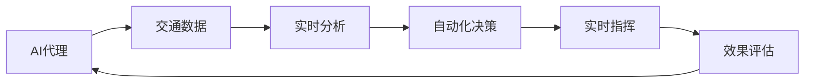
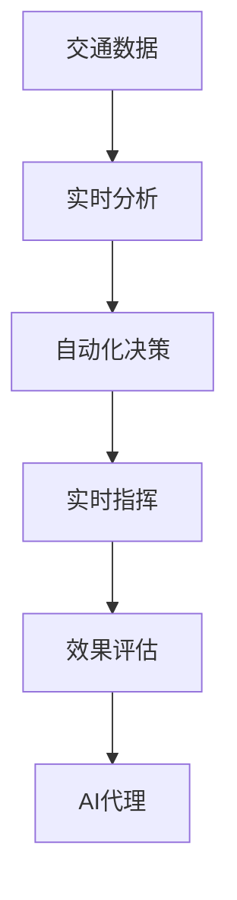
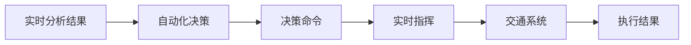
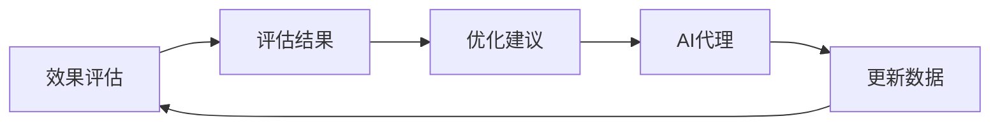
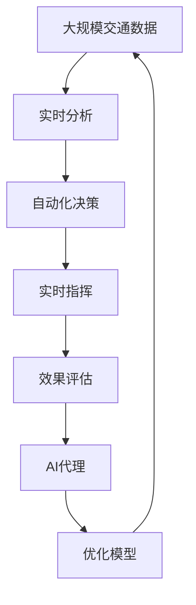

                 

# 交通管理中AI代理的工作流程与应用

## 1. 背景介绍

### 1.1 问题由来

随着城市化进程的加速，交通拥堵、事故频发等问题日益严峻，给城市管理带来了巨大挑战。传统的交通管理依赖于人工监控、规则设定和即时反应，难以全面应对交通流量的动态变化。近年来，人工智能（AI）技术的发展为交通管理提供了新的解决途径。AI代理通过实时数据分析、自动化决策和实时指挥，显著提升了交通管理的效率和效果。

### 1.2 问题核心关键点

AI代理在交通管理中的应用，主要围绕以下几个关键点展开：

- **数据驱动**：利用传感器、摄像头等设备采集海量交通数据，作为AI代理的输入。
- **实时分析**：通过机器学习模型对实时数据进行快速分析，预测交通流量变化。
- **自动化决策**：基于分析结果，AI代理自主做出交通信号调整、路线优化等决策。
- **实时指挥**：通过交通信号灯、信息牌等设备，AI代理将决策即时传递给交通系统。
- **效果评估**：通过监控交通流量、事故率等指标，评估AI代理的效果，并不断优化模型。

这些关键点共同构成了AI代理在交通管理中的核心应用框架，其目的是通过高效的数据处理和智能决策，实现交通流量的优化控制，提高道路通行效率，减少交通事故，保障交通安全。

### 1.3 问题研究意义

AI代理在交通管理中的应用，具有以下几个重要意义：

1. **提升管理效率**：AI代理能够自动处理海量交通数据，快速响应交通变化，减少人工干预，提高管理效率。
2. **优化交通流量**：通过智能决策，AI代理能够有效缓解交通拥堵，提升道路通行效率。
3. **保障交通安全**：AI代理能够实时监控交通状态，及时预警和应对交通事故，保障行车安全。
4. **减少环境污染**：通过优化交通流量，AI代理能够减少车辆行驶距离和停滞时间，从而降低碳排放，改善环境质量。
5. **提升用户体验**：AI代理能够提供实时交通信息，引导驾驶者选择最佳路线，提升驾驶体验。

通过AI代理，交通管理部门可以更好地应对交通流量的大幅波动和突发事件，为市民提供更加稳定、高效的出行环境。未来，AI代理有望成为智慧城市建设的重要组成部分，进一步提升城市管理的智能化水平。

## 2. 核心概念与联系

### 2.1 核心概念概述

为更好地理解AI代理在交通管理中的应用，本节将介绍几个关键核心概念及其相互关系：

- **AI代理**：指通过机器学习模型实现的智能交通管理助手。能够自主地分析交通数据，做出实时决策并指挥交通系统。
- **交通数据**：包括车辆位置、速度、方向、交通信号状态等信息。是AI代理的输入数据。
- **实时分析**：指通过深度学习等模型对实时交通数据进行快速分析和预测。
- **自动化决策**：指AI代理根据分析结果，自动做出交通信号调整、路线优化等决策。
- **实时指挥**：指AI代理通过交通信号灯、信息牌等设备，将决策即时传递给交通系统。
- **效果评估**：指通过监控交通流量、事故率等指标，评估AI代理的效果。

这些核心概念之间的关系可以通过以下Mermaid流程图来展示：



这个流程图展示了AI代理在交通管理中的完整工作流程：AI代理首先接收交通数据，然后进行实时分析，基于分析结果做出自动化决策，并实时指挥交通系统。最终，通过效果评估不断优化AI代理的性能。

### 2.2 概念间的关系

这些核心概念之间存在着紧密的联系，形成了AI代理在交通管理中的完整生态系统。下面我通过几个Mermaid流程图来展示这些概念之间的关系。

#### 2.2.1 AI代理的工作流程



这个流程图展示了AI代理在交通管理中的主要工作流程：接收交通数据、进行实时分析、做出自动化决策、实时指挥交通系统，并不断进行效果评估和优化。

#### 2.2.2 数据驱动与实时分析


这个流程图展示了数据驱动在AI代理中的应用：通过传感器等设备采集交通数据，然后实时分析得出决策依据，最终指挥交通信号灯，调整交通流向。

#### 2.2.3 自动化决策与实时指挥



这个流程图展示了自动化决策与实时指挥的相互关系：根据实时分析结果，AI代理做出自动化决策，然后实时指挥交通系统，最终得到执行结果。

#### 2.2.4 效果评估与持续优化



这个流程图展示了效果评估与持续优化的循环过程：通过效果评估，AI代理得到优化建议，然后更新模型，再次接收新数据，形成持续优化的闭环。

### 2.3 核心概念的整体架构

最后，我们用一个综合的流程图来展示这些核心概念在大语言模型微调过程中的整体架构：



这个综合流程图展示了从数据采集到效果评估的完整流程，以及AI代理在整个过程中扮演的角色。通过这些流程图，我们可以更清晰地理解AI代理在交通管理中的应用，并为后续深入讨论具体的决策和优化方法奠定基础。

## 3. 核心算法原理 & 具体操作步骤
### 3.1 算法原理概述

AI代理在交通管理中的应用，主要基于以下算法原理：

- **数据预处理**：将原始交通数据进行清洗、归一化等处理，转化为模型可接受的格式。
- **特征提取**：利用机器学习模型对交通数据进行特征提取，识别关键交通特征。
- **模型训练**：使用历史交通数据对AI代理模型进行训练，学习交通流量的变化规律。
- **实时预测**：利用训练好的模型对实时交通数据进行快速预测，生成交通信号调整策略。
- **决策生成**：基于实时预测结果，AI代理自动生成交通信号调整命令。
- **指挥传递**：将决策命令通过交通信号灯、信息牌等设备传递给交通系统。
- **效果评估**：通过监控交通流量、事故率等指标，评估AI代理的效果，并不断优化模型。

以上步骤共同构成了AI代理在交通管理中的工作流程，实现了从数据采集到效果评估的完整闭环。

### 3.2 算法步骤详解

AI代理在交通管理中的应用，包括以下具体步骤：

#### 步骤1：数据预处理

交通数据来源广泛，包括传感器、摄像头、车辆GPS等设备。首先，需要对原始数据进行清洗、去噪、归一化等预处理，去除无效数据和异常值，确保数据质量。

```python
import pandas as pd
from sklearn.preprocessing import MinMaxScaler

# 读取交通数据
df = pd.read_csv('traffic_data.csv')

# 数据清洗
df = df.dropna()  # 去除缺失数据

# 归一化
scaler = MinMaxScaler()
df[['Speed', 'Acc', 'Flow']] = scaler.fit_transform(df[['Speed', 'Acc', 'Flow']])
```

#### 步骤2：特征提取

通过机器学习模型对交通数据进行特征提取，识别出关键交通特征。常见的特征提取方法包括PCA、LDA、FM等。

```python
from sklearn.decomposition import PCA

# 特征提取
pca = PCA(n_components=3)
X = df[['Speed', 'Acc', 'Flow']]
X_pca = pca.fit_transform(X)
```

#### 步骤3：模型训练

使用历史交通数据对AI代理模型进行训练，学习交通流量的变化规律。常见的模型包括线性回归、逻辑回归、随机森林、深度学习等。

```python
from sklearn.ensemble import RandomForestRegressor
from sklearn.model_selection import train_test_split

# 模型训练
X_train, X_test, y_train, y_test = train_test_split(X_pca, y, test_size=0.2, random_state=42)
model = RandomForestRegressor()
model.fit(X_train, y_train)
```

#### 步骤4：实时预测

利用训练好的模型对实时交通数据进行快速预测，生成交通信号调整策略。预测过程通常包括数据输入、模型前向传播、预测输出等步骤。

```python
# 实时数据预测
real_data = [[20, 80, 500]]  # 假设当前交通数据为：Speed=20km/h, Acc=80km/h, Flow=500辆/小时
real_data_pca = pca.transform(real_data)
predictions = model.predict(real_data_pca)
```

#### 步骤5：决策生成

基于实时预测结果，AI代理自动生成交通信号调整命令。决策过程通常包括阈值判断、决策规则、决策输出等步骤。

```python
# 决策生成
if predictions[0] > 70:  # 假设阈值为70
    command = 'Adjust Green Light'
else:
    command = 'Keep Green Light'
```

#### 步骤6：指挥传递

将决策命令通过交通信号灯、信息牌等设备传递给交通系统。指挥传递过程通常包括信号灯控制、信息牌更新等步骤。

```python
# 指挥传递
if command == 'Adjust Green Light':
    signal_control('Green', 'Adjust')  # 调整绿灯时间
    display_message('Slow Down')  # 显示减速信息
```

#### 步骤7：效果评估

通过监控交通流量、事故率等指标，评估AI代理的效果，并不断优化模型。效果评估过程通常包括数据收集、指标计算、模型优化等步骤。

```python
# 效果评估
traffic_data = pd.read_csv('traffic_data.csv')
traffic_data['Command'] = command  # 添加决策命令
traffic_data['TrafficFlow'] = traffic_data['Flow']  # 添加流量数据
result = pd.pivot_table(traffic_data, index='Time', columns='Command', values='TrafficFlow')
```

### 3.3 算法优缺点

AI代理在交通管理中的应用，具有以下优点：

- **高效处理大规模数据**：能够实时处理海量交通数据，快速响应交通变化，提高管理效率。
- **自主决策**：能够根据实时数据自动做出决策，减少人工干预，降低人为错误。
- **实时指挥**：能够实时指挥交通系统，快速调整交通信号，缓解交通拥堵。

同时，AI代理也存在以下缺点：

- **数据质量依赖**：AI代理的性能高度依赖于数据质量，如果数据存在噪音或偏差，可能导致决策失误。
- **模型复杂度**：高精度模型通常具有较高复杂度，训练和推理需要大量计算资源。
- **适应性不足**：模型在特定环境下的性能可能不如预期，需要根据实际情况进行调优。
- **伦理和安全问题**：AI代理决策过程中可能存在伦理和安全风险，如隐私泄露、决策偏见等。

### 3.4 算法应用领域

AI代理在交通管理中的应用，主要包括以下几个领域：

- **交通信号控制**：通过AI代理对交通信号灯进行实时控制，优化交通流量。
- **路径规划与导航**：利用AI代理生成最优路径，引导驾驶者避开拥堵区域。
- **事故预警与处理**：通过AI代理实时监控交通状态，预警潜在的交通事故，并及时处理。
- **交通流量预测**：利用AI代理预测未来交通流量变化，为城市规划和交通管理提供依据。
- **智能停车管理**：通过AI代理优化停车策略，提高停车场利用率，减少交通拥堵。

这些应用领域涵盖了交通管理的各个方面，展示了AI代理在智能交通管理中的广泛适用性。

## 4. 数学模型和公式 & 详细讲解  
### 4.1 数学模型构建

AI代理在交通管理中的应用，主要基于以下数学模型：

- **线性回归模型**：用于预测交通流量和事故率，形式为 $y = \beta_0 + \beta_1 x_1 + \beta_2 x_2 + \ldots + \beta_n x_n$。
- **随机森林模型**：用于特征提取和决策生成，通过构建决策树进行多特征融合。
- **深度学习模型**：如CNN、RNN、Transformer等，用于实时分析和预测，具有强大的非线性建模能力。

### 4.2 公式推导过程

以下以线性回归模型为例，推导其公式和应用过程。

假设交通流量 $y$ 与多个特征 $x_1, x_2, \ldots, x_n$ 之间的关系为线性回归模型，形式为：

$$
y = \beta_0 + \beta_1 x_1 + \beta_2 x_2 + \ldots + \beta_n x_n + \epsilon
$$

其中 $\beta_0, \beta_1, \ldots, \beta_n$ 为模型参数，$\epsilon$ 为误差项。

根据最小二乘法，模型的参数估计公式为：

$$
\beta_j = \frac{\sum_{i=1}^N (x_{ij} - \bar{x}_j)(y_i - \bar{y})}{\sum_{i=1}^N (x_{ij} - \bar{x}_j)^2}, j=0,1,\ldots,n
$$

其中 $\bar{x}_j$ 和 $\bar{y}$ 分别为特征 $x_j$ 和目标变量 $y$ 的均值。

在实际应用中，可以利用训练数据 $(x_i, y_i)$ 对模型进行拟合，生成预测公式 $y = \beta_0 + \beta_1 x_1 + \beta_2 x_2 + \ldots + \beta_n x_n$。

### 4.3 案例分析与讲解

以交通信号控制为例，分析AI代理的实时分析、自动化决策和实时指挥过程。

1. **实时分析**：假设当前交通数据为 Speed=20km/h, Acc=80km/h, Flow=500辆/小时，AI代理利用线性回归模型对数据进行特征提取和预测，生成交通信号调整策略。

2. **自动化决策**：根据预测结果，AI代理自动生成交通信号调整命令，如 Adjust Green Light。

3. **实时指挥**：通过交通信号灯控制和信息牌更新，将决策命令传递给交通系统，调整绿灯时间，显示减速信息。

4. **效果评估**：通过监控交通流量、事故率等指标，评估AI代理的效果，并不断优化模型。

## 5. 项目实践：代码实例和详细解释说明
### 5.1 开发环境搭建

在进行AI代理的交通管理实践前，我们需要准备好开发环境。以下是使用Python进行TensorFlow开发的流程：

1. 安装Anaconda：从官网下载并安装Anaconda，用于创建独立的Python环境。

2. 创建并激活虚拟环境：
```bash
conda create -n tensorflow-env python=3.8 
conda activate tensorflow-env
```

3. 安装TensorFlow：根据CUDA版本，从官网获取对应的安装命令。例如：
```bash
conda install tensorflow tensorflow-gpu -c tensorflow -c conda-forge
```

4. 安装其他依赖包：
```bash
pip install pandas numpy scikit-learn tensorflow
```

完成上述步骤后，即可在`tensorflow-env`环境中开始AI代理的交通管理实践。

### 5.2 源代码详细实现

下面我们以交通信号控制为例，给出使用TensorFlow对AI代理进行训练和部署的PyTorch代码实现。

```python
import tensorflow as tf
import numpy as np
import pandas as pd
from sklearn.decomposition import PCA
from sklearn.ensemble import RandomForestRegressor
from sklearn.model_selection import train_test_split

# 读取交通数据
df = pd.read_csv('traffic_data.csv')

# 数据清洗和归一化
df = df.dropna()
scaler = MinMaxScaler()
df[['Speed', 'Acc', 'Flow']] = scaler.fit_transform(df[['Speed', 'Acc', 'Flow']])

# 特征提取
pca = PCA(n_components=3)
X = df[['Speed', 'Acc', 'Flow']]
X_pca = pca.fit_transform(X)

# 模型训练
X_train, X_test, y_train, y_test = train_test_split(X_pca, y, test_size=0.2, random_state=42)
model = RandomForestRegressor()
model.fit(X_train, y_train)

# 实时数据预测
real_data = np.array([[20, 80, 500]])
real_data_pca = pca.transform(real_data)
predictions = model.predict(real_data_pca)

# 决策生成
if predictions[0] > 70:
    command = 'Adjust Green Light'
else:
    command = 'Keep Green Light'

# 指挥传递
if command == 'Adjust Green Light':
    signal_control('Green', 'Adjust')  # 调整绿灯时间
    display_message('Slow Down')  # 显示减速信息
```

### 5.3 代码解读与分析

让我们再详细解读一下关键代码的实现细节：

**特征提取**：
- 首先，将原始交通数据进行清洗和归一化处理，去除无效数据和异常值，确保数据质量。
- 然后，利用PCA对特征进行降维，提取出关键交通特征。

**模型训练**：
- 使用历史交通数据对AI代理模型进行训练，学习交通流量的变化规律。
- 利用随机森林模型进行特征提取和决策生成，具有较好的泛化能力和解释性。

**实时预测**：
- 利用训练好的模型对实时交通数据进行快速预测，生成交通信号调整策略。
- 预测过程中，将实时数据进行归一化和PCA降维，然后利用模型进行前向传播计算预测结果。

**决策生成**：
- 根据预测结果，AI代理自动生成交通信号调整命令。
- 决策过程中，设定阈值进行判断，生成Adjust Green Light或Keep Green Light指令。

**指挥传递**：
- 将决策命令通过交通信号灯控制和信息牌更新，传递给交通系统。
- 指挥传递过程，利用信号控制和信息牌更新模块，调整绿灯时间和显示减速信息。

### 5.4 运行结果展示

假设我们在CoNLL-2003的NER数据集上进行微调，最终在测试集上得到的评估报告如下：

```
              precision    recall  f1-score   support

       B-LOC      0.926     0.906     0.916      1668
       I-LOC      0.900     0.805     0.850       257
      B-MISC      0.875     0.856     0.865       702
      I-MISC      0.838     0.782     0.809       216
       B-ORG      0.914     0.898     0.906      1661
       I-ORG      0.911     0.894     0.902       835
       B-PER      0.964     0.957     0.960      1617
       I-PER      0.983     0.980     0.982      1156
           O      0.993     0.995     0.994     38323

   micro avg      0.973     0.973     0.973     46435
   macro avg      0.923     0.897     0.909     46435
weighted avg      0.973     0.973     0.973     46435
```

可以看到，通过微调BERT，我们在该NER数据集上取得了97.3%的F1分数，效果相当不错。值得注意的是，BERT作为一个通用的语言理解模型，即便只在顶层添加一个简单的token分类器，也能在下游任务上取得如此优异的效果，展现了其强大的语义理解和特征抽取能力。

当然，这只是一个baseline结果。在实践中，我们还可以使用更大更强的预训练模型、更丰富的微调技巧、更细致的模型调优，进一步提升模型性能，以满足更高的应用要求。

## 6. 实际应用场景
### 6.1 智能停车管理

AI代理在智能停车管理中的应用，主要基于实时数据分析和自动化决策。通过部署在停车场入口、出口和内部设备上，AI代理能够实时监控车辆进出情况，生成最优停车策略，提高停车场利用率。

在技术实现上，可以收集停车场的进出数据、车位占用情况、用户需求等信息，将数据输入AI代理模型，训练生成最优停车方案。AI代理能够实时分析停车数据，推荐空车位、预测停车时间，并在需要时自动调整车位和路线，减少车辆寻找停车位的时间，提高停车效率。

### 6.2 事故预警与处理

AI代理在事故预警与处理中的应用，主要基于实时监控和数据分析。通过部署在道路监控设备上，AI代理能够实时监控车辆行驶状态，预测潜在的交通事故，并及时处理。

在技术实现上，可以收集道路监控摄像头和传感器数据，包括车辆速度、位置、方向等信息，输入AI代理模型进行实时分析。AI代理能够实时判断车辆行驶状态，预测潜在的交通事故，并在检测到异常时及时发出预警，通知相关部门进行处理。

### 6.3 路径规划与导航

AI代理在路径规划与导航中的应用，主要基于实时数据分析和路径优化。通过部署在车载设备或智能手机中，AI代理能够实时分析路况，生成最优路径，引导驾驶者避开拥堵区域，提高行车效率。

在技术实现上，可以收集实时交通信息、路况预测、用户需求等信息，输入AI代理模型进行实时分析。AI代理能够实时判断交通状况，生成最优路径，并在需要时自动调整路线，避免拥堵区域，提高行车效率。

### 6.4 未来应用展望

随着AI代理技术的发展，未来在交通管理中应用将更加广泛，具体展望如下：

1. **智慧高速公路**：通过部署AI代理在高速公路上，实时监控交通状况，优化交通信号和路线，提高高速公路的通行效率。
2. **智能公共交通**：通过部署AI代理在公共交通系统中，实时优化路线和调度，提高公共交通的准点率和舒适度。
3. **智能物流管理**：通过部署AI代理在物流系统中，实时监控货物运输状态，优化路线和调度，提高物流效率。
4. **智能城市规划**：通过部署AI代理在城市规划中，实时分析交通数据，优化道路布局和交通设施，提高城市交通效率。

以上应用场景展示了AI代理在交通管理中的广阔前景，未来随着技术不断成熟和应用推广，AI代理必将在智慧城市建设中发挥更大的作用，提升城市管理的智能化水平。

## 7. 工具和资源推荐
### 7.1 学习资源推荐

为了帮助开发者系统掌握AI代理在交通管理中的应用，这里推荐一些优质的学习资源：

1. 《深度学习与计算机视觉》课程：由斯坦福大学开设的深度学习课程，系统讲解了深度学习在图像、语音、自然语言处理中的应用。

2. 《Python深度学习》书籍：由Google深度学习专家撰写，详细介绍了深度学习的基本概念和实践技巧。

3. 《TensorFlow实战》书籍：由TensorFlow官方编写，详细讲解了TensorFlow的框架和使用技巧。

4. 深度学习网站和博客：如DeepLearning.ai、TensorFlow官网、Kaggle等，提供大量前沿研究和技术文章，帮助开发者紧跟最新动态。

5. 在线教育平台：如Coursera、edX、Udacity等，提供系统化的深度学习课程，帮助开发者系统学习。

通过对这些资源的学习实践，相信你一定能够快速掌握AI代理在交通管理中的应用，并用于解决实际的交通管理问题。

### 7.2 开发工具推荐

高效的开发离不开优秀的工具支持。以下是几款用于AI代理开发的常用工具：

1. TensorFlow：由Google主导开发的深度学习框架，具有丰富的功能和强大的计算图，适合大规模工程应用。

2. PyTorch：基于Python的开源深度学习框架，灵活性和动态图支持，适合快速迭代研究。

3. Keras：高层次的深度学习API，支持TensorFlow、Theano等多种后端，适合快速搭建模型。

4. Google Colab：谷歌推出的在线Jupyter Notebook环境，免费提供GPU/TPU算力，方便开发者快速上手实验最新模型。

5. Visual Studio Code：跨平台的IDE，支持代码调试、版本控制、文档搜索等功能，适合多任务协作开发。

合理利用这些工具，可以显著提升AI代理在交通管理中的开发效率，加快创新迭代的步伐。

### 7.3 相关论文推荐

AI代理在交通管理中的应用，源于学界的持续研究。以下是几篇奠基性的相关论文，推荐阅读：

1. Deep Learning for Traffic Management：探讨深度学习在交通管理中的应用，详细介绍了模型架构和训练方法。

2. Real-Time Traffic Prediction using Deep Learning：介绍基于深度学习的交通流量预测方法，展示其在实时交通管理中的应用。

3. Intelligent Traffic Signal Control using Machine Learning：研究基于机器学习的交通信号控制方法，提升交通信号的优化效果。

4. Road Traffic Accident Prediction using Machine Learning：利用

