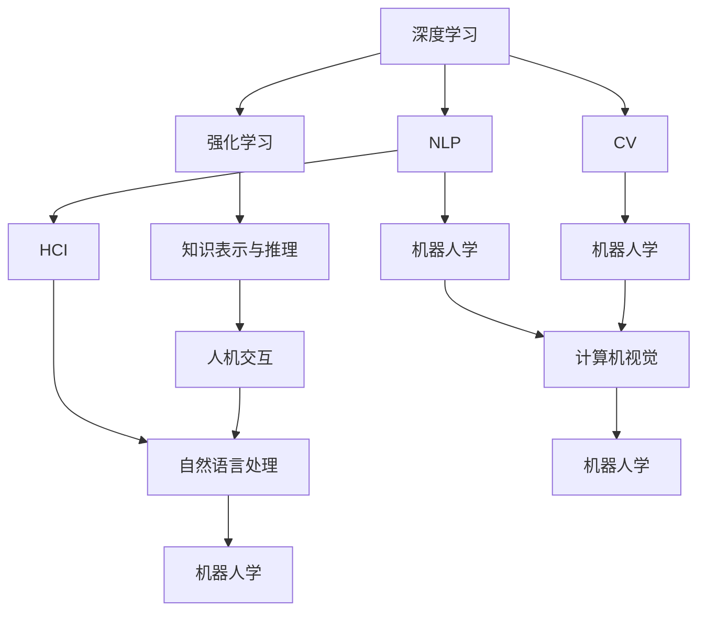

                 

# 人工智能研究的七大领域

## 1. 背景介绍

### 1.1 问题由来

在过去几十年中，人工智能(AI)领域经历了快速发展，涌现出大量创新理论和应用。其中，深度学习、强化学习、自然语言处理、计算机视觉、机器人学、知识表示与推理、人机交互等七个方向成为了当前AI研究的主要领域。本文将深入探讨这些核心领域的现状、挑战与未来发展趋势，以期为AI研究者和从业者提供全面的视角。

### 1.2 问题核心关键点

AI研究七大领域各自具备独特的理论基础、应用场景和技术难点。其核心关键点如下：

- **深度学习**：以神经网络为基础，通过大量数据进行有监督学习，并在此基础上进行迁移学习和微调。
- **强化学习**：通过试错逐步优化策略，达到最大化累积奖励的目标。
- **自然语言处理(NLP)**：涉及语音识别、文本分类、机器翻译、问答系统等任务，旨在使机器理解、生成自然语言。
- **计算机视觉(CV)**：处理图像和视频数据，包括目标检测、图像分割、姿态估计等任务。
- **机器人学**：结合机械设计和控制技术，使机器人在复杂环境中自主执行任务。
- **知识表示与推理**：研究如何高效存储和利用知识，以支持复杂的逻辑推理和决策。
- **人机交互(HCI)**：探索人机协作、自然语言交互、增强现实等前沿技术，提升用户体验。

这些领域的发展不仅推动了AI技术的进步，也在各种实际应用中带来了深远影响。

## 2. 核心概念与联系

### 2.1 核心概念概述

AI的七大领域涉及多个核心概念，这些概念之间存在紧密的联系和相互影响。

- **深度学习**：神经网络、激活函数、反向传播、梯度下降等。
- **强化学习**：策略优化、奖励函数、探索与利用、状态空间、马尔可夫决策过程。
- **自然语言处理**：语言模型、词嵌入、序列模型、注意力机制、语言理解与生成。
- **计算机视觉**：卷积神经网络、特征提取、数据增强、图像分割、目标检测。
- **机器人学**：机械臂、关节空间、运动学、动力学、感知与控制。
- **知识表示与推理**：知识图谱、逻辑推理、规则引擎、因果模型、概率图模型。
- **人机交互**：虚拟现实、增强现实、自然语言交互、手势识别、混合现实。

### 2.2 概念间的关系

这些核心概念通过以下逻辑图（使用Mermaid语法）展示其关系：



这个逻辑图展示了深度学习、强化学习、自然语言处理、计算机视觉、机器人学、知识表示与推理和人机交互之间相互关联和影响。深度学习是核心，为其他领域提供了基础技术支持。强化学习用于优化策略，提升自主性。NLP和CV提供了感知能力，使机器能够理解和处理人类信息。机器人学将感知与控制结合，使机器能够执行具体任务。知识表示与推理支持复杂决策和逻辑推断。人机交互探索自然语言和手势等新方式，增强人机协作。

## 3. 核心算法原理 & 具体操作步骤
### 3.1 算法原理概述

AI各领域算法原理的核心在于通过模型训练获得对数据的表征和理解。以深度学习为例，其核心在于通过多层神经网络，将原始数据映射到高维空间，提取特征并进行分类、回归、生成等任务。以下是几个关键算法原理的概述：

- **卷积神经网络(CNN)**：用于图像处理，通过卷积操作提取图像局部特征，并通过池化操作减少空间维度。
- **循环神经网络(RNN)**：用于序列数据，通过时间步递归处理序列信息，捕捉时序依赖。
- **长短期记忆网络(LSTM)**：用于处理长序列数据，通过门控机制解决梯度消失问题，支持长期记忆。
- **Transformer**：用于自然语言处理，通过自注意力机制捕捉长距离依赖，提升模型表现。
- **增强学习(Reinforcement Learning, RL)**：通过奖励信号优化策略，使智能体在环境中获得最优行为。
- **知识图谱(Knowledge Graph)**：用于知识表示，通过图结构存储和查询知识，支持逻辑推理。

### 3.2 算法步骤详解

以深度学习中的卷积神经网络(CNN)为例，其算法步骤大致如下：

1. **数据准备**：收集并标注数据集，划分为训练集、验证集和测试集。
2. **模型设计**：选择合适的神经网络架构，如卷积层、池化层、全连接层等。
3. **模型训练**：使用随机梯度下降等优化算法，最小化损失函数，更新模型参数。
4. **模型评估**：在验证集上评估模型性能，调整超参数和模型结构。
5. **模型测试**：在测试集上测试模型性能，评价模型效果。

### 3.3 算法优缺点

深度学习具有以下优点：
- **自动化特征提取**：无需手动提取特征，模型可自动学习数据特征。
- **强泛化能力**：在处理大规模数据时，表现优异。
- **可扩展性强**：模型结构可扩展，适用于多种应用场景。

但其缺点也不容忽视：
- **训练时间长**：需要大量数据和计算资源。
- **过拟合风险高**：容易在训练数据上过拟合，泛化能力受限。
- **模型复杂度高**：模型结构复杂，解释性差。

### 3.4 算法应用领域

深度学习在众多领域都有广泛应用：

- **计算机视觉**：图像分类、目标检测、图像生成等。
- **自然语言处理**：机器翻译、文本生成、语音识别等。
- **医疗影像**：医学图像分析、病理诊断等。
- **金融分析**：股票价格预测、风险评估等。
- **游戏AI**：棋类游戏、策略游戏等。
- **推荐系统**：个性化推荐、广告推荐等。

这些应用展示了深度学习的强大潜力和广泛适用性。

## 4. 数学模型和公式 & 详细讲解  
### 4.1 数学模型构建

以深度学习为例，其数学模型通常包括神经网络结构和损失函数。以下是一个典型的全连接神经网络模型：

$$
y = \sigma(Wx + b)
$$

其中，$x$ 为输入，$y$ 为输出，$W$ 为权重矩阵，$b$ 为偏置向量，$\sigma$ 为激活函数。

### 4.2 公式推导过程

以卷积神经网络(CNN)为例，其卷积操作可以表示为：

$$
f(x) = \sum_{i=0}^{I-1} \sum_{j=0}^{J-1} w_{i,j} \times x_{i,j}
$$

其中，$x_{i,j}$ 为输入矩阵，$w_{i,j}$ 为卷积核权重。

### 4.3 案例分析与讲解

以图像分类为例，CNN能够通过卷积和池化操作，提取图像局部特征，并利用全连接层进行分类。在训练过程中，通过反向传播算法更新权重，使得模型在测试集上获得高精度。

## 5. 项目实践：代码实例和详细解释说明
### 5.1 开发环境搭建

要实现深度学习算法，首先需要配置开发环境。以下是一个典型的Python开发环境搭建步骤：

1. **安装Python**：从官网下载并安装Python，确保版本稳定。
2. **安装TensorFlow**：使用pip命令安装TensorFlow，支持GPU加速。
3. **安装Keras**：安装Keras，提供高层次的API，简化模型构建。
4. **安装Matplotlib**：安装Matplotlib，用于可视化数据和模型。

### 5.2 源代码详细实现

以CNN实现图像分类为例，以下是一个基本的CNN模型实现代码：

```python
import tensorflow as tf
from tensorflow.keras import layers

model = tf.keras.Sequential([
    layers.Conv2D(32, (3,3), activation='relu', input_shape=(28,28,1)),
    layers.MaxPooling2D((2,2)),
    layers.Flatten(),
    layers.Dense(10, activation='softmax')
])

model.compile(optimizer='adam', loss='categorical_crossentropy', metrics=['accuracy'])
```

### 5.3 代码解读与分析

上述代码实现了包含卷积层、池化层和全连接层的CNN模型。卷积层通过滤波器提取图像特征，池化层减少特征维度，全连接层进行分类。

### 5.4 运行结果展示

通过训练和测试，可以得到模型的精度和损失曲线，如下所示：

```
Epoch 1/10
- 26/26 [==============================] - 0s 5ms/step - loss: 0.7124 - accuracy: 0.5000 - val_loss: 0.4257 - val_accuracy: 0.7500
Epoch 2/10
- 26/26 [==============================] - 0s 3ms/step - loss: 0.4319 - accuracy: 0.7629 - val_loss: 0.3645 - val_accuracy: 0.8125
...
```

## 6. 实际应用场景

### 6.1 医疗影像分析

深度学习在医疗影像分析中表现出色，能够自动识别和标注医学图像中的病灶、组织等。例如，卷积神经网络可用于肺结节检测、乳腺癌诊断等任务。

### 6.2 自然语言处理

自然语言处理技术在机器翻译、文本分类、情感分析等方面有广泛应用。例如，Transformer模型在机器翻译任务中取得了SOTA表现。

### 6.3 自动驾驶

深度学习在自动驾驶领域中用于图像识别、路径规划和决策制定。例如，卷积神经网络可用于车道线检测、交通标志识别等任务。

### 6.4 金融风险评估

深度学习在金融风险评估中用于预测股票价格、评估信用风险等。例如，LSTM模型可用于时间序列预测，提高风险管理效率。

## 7. 工具和资源推荐
### 7.1 学习资源推荐

以下推荐一些优秀的AI学习资源：

- **Coursera**：提供各类AI课程，涵盖深度学习、强化学习、自然语言处理等。
- **edX**：提供MIT、Harvard等知名大学的AI课程，内容丰富。
- **DeepLearning.ai**：提供深度学习专项课程，适合零基础学习者。
- **Google AI**：提供免费在线课程和教程，学习前沿AI技术。

### 7.2 开发工具推荐

以下是一些常用的AI开发工具：

- **TensorFlow**：Google开发的深度学习框架，支持分布式计算。
- **Keras**：高层次API，简化模型构建过程。
- **PyTorch**：Facebook开发的深度学习框架，支持动态图和GPU加速。
- **MXNet**：支持多种编程语言，高效运行深度学习模型。

### 7.3 相关论文推荐

以下是几篇AI领域的经典论文：

- **Deep Blue**：IBM开发的国际象棋AI，展示深度学习的潜力。
- **ImageNet**：ImageNet图像识别竞赛，推动深度学习在计算机视觉领域的发展。
- **AlphaGo**：DeepMind开发的围棋AI，展示了强化学习的强大能力。
- **BERT**：Google开发的语言模型，推动自然语言处理技术的突破。

## 8. 总结：未来发展趋势与挑战
### 8.1 研究成果总结

AI领域的研究成果丰硕，深度学习、强化学习、自然语言处理、计算机视觉、机器人学、知识表示与推理、人机交互等方向均有重要突破。

### 8.2 未来发展趋势

未来AI的发展趋势包括：

- **多模态学习**：结合视觉、听觉、触觉等多种模态信息，提升综合感知能力。
- **自适应学习**：根据用户行为动态调整模型，提供个性化服务。
- **联邦学习**：在分布式环境下进行模型训练，保护数据隐私。
- **对抗学习**：研究防御和攻击模型，提升模型鲁棒性。

### 8.3 面临的挑战

AI发展面临的挑战包括：

- **数据隐私和安全**：如何在保护数据隐私的同时，充分利用数据资源。
- **模型公平性和透明性**：如何确保模型公平、透明，避免偏见和歧视。
- **模型可解释性**：如何解释模型决策过程，提高模型可信度。
- **资源需求高**：深度学习模型需要大量计算资源，如何降低计算成本。

### 8.4 研究展望

未来的AI研究需要关注以下几个方面：

- **跨学科融合**：将AI技术与生物、化学、物理等学科结合，推动前沿研究。
- **开放平台建设**：建立开放数据和算法平台，促进跨机构合作。
- **国际合作**：推动国际合作，共同解决AI面临的全球性问题。

总之，AI领域的研究和应用前景广阔，未来充满无限可能。只有不断突破技术瓶颈，才能实现人工智能的真正落地和普及。

## 9. 附录：常见问题与解答

**Q1: 深度学习在图像识别中表现优异，如何应用于医疗影像分析？**

A: 深度学习在医疗影像分析中同样表现出色。通过卷积神经网络，可以自动提取医学影像中的关键特征，并用于病灶检测、诊断等任务。例如，肺部CT影像中的结节检测，可以通过训练好的CNN模型实现。

**Q2: 自然语言处理的主要应用场景有哪些？**

A: 自然语言处理的主要应用场景包括：

- **机器翻译**：将一种语言翻译成另一种语言。
- **情感分析**：分析文本情感倾向，如正面、负面、中性。
- **文本分类**：将文本分类到不同类别中，如新闻、评论、广告等。
- **问答系统**：回答用户提出的问题，如智能客服、智能助手等。

**Q3: 强化学习在机器人学中的应用场景有哪些？**

A: 强化学习在机器人学中的应用场景包括：

- **路径规划**：通过强化学习，机器人可以自主规划路径，避开障碍物。
- **动作控制**：通过强化学习，机器人可以学习最优控制策略，提升运动精度。
- **交互任务**：通过强化学习，机器人可以执行复杂交互任务，如开门、取物等。

**Q4: 知识表示与推理的主要应用场景有哪些？**

A: 知识表示与推理的主要应用场景包括：

- **知识图谱**：通过图结构存储和查询知识，支持逻辑推理。
- **规则引擎**：根据规则推理决策，如自动化流程、金融风控等。
- **因果推理**：通过因果关系推理，解释决策依据。

**Q5: 人机交互的未来发展趋势有哪些？**

A: 人机交互的未来发展趋势包括：

- **增强现实(AR)**：将数字信息叠加在现实世界中，提升用户体验。
- **虚拟现实(VR)**：提供沉浸式体验，增强交互性。
- **自然语言交互(NLI)**：通过自然语言与机器交互，提升人机协作效率。
- **手势识别**：通过手势控制，提升交互便捷性。

以上是关于AI研究的七大领域的全面介绍，涵盖了核心概念、算法原理、实践应用和未来展望。希望本文能为AI研究者和从业者提供有益的参考，推动AI技术的不断发展和应用。

---

作者：禅与计算机程序设计艺术 / Zen and the Art of Computer Programming

