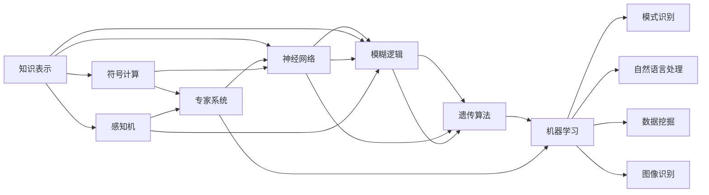

                 

# 人工智能研究的早期探索

## 1. 背景介绍

### 1.1 问题由来

人工智能(AI)作为人类历史上的一次伟大探索，其研究历程跨越了半个多世纪，从早期的简单自动化到如今的深度学习、生成对抗网络，不断推动着计算能力和理论研究的进步。人工智能的早期探索主要集中在经典知识表示、符号计算、专家系统等，旨在通过模拟人类思维和逻辑推理，构建出具有智能的机器系统。

### 1.2 问题核心关键点

早期的人工智能探索集中在以下三个关键点：

1. **知识表示与推理**：使用逻辑符号和规则来表示知识和执行推理，以支持机器解决问题。
2. **符号计算**：将数学计算过程符号化，通过符号操作来模拟人脑计算过程。
3. **专家系统**：通过模拟人类专家的思维过程，构建解决特定领域问题的智能系统。

这些早期探索奠定了人工智能发展的基础，为后续的深度学习、强化学习等技术进步提供了理论和方法上的支持。

### 1.3 问题研究意义

研究人工智能的早期探索，有助于理解人工智能从萌芽到成熟的发展历程，揭示技术演进的内在规律，并为未来的人工智能研究提供借鉴和启示。通过回顾早期探索的历史，我们能够更好地把握人工智能技术的发展方向，预见未来可能的突破点，为实现通用人工智能(AGI)奠定坚实的基础。

## 2. 核心概念与联系

### 2.1 核心概念概述

为了更好地理解人工智能研究的早期探索，本节将介绍几个核心概念及其相互联系：

- **知识表示**：将知识以形式化符号的形式进行编码，以便于机器理解和处理。
- **符号计算**：通过符号操作进行数学计算，以模拟人类思维的逻辑推理过程。
- **专家系统**：以人类专家的知识为基础，构建能够解决特定领域问题的智能系统。
- **感知机**：早期神经网络的一种，用于进行简单的分类和回归任务。
- **神经网络**：由大量人工神经元组成的复杂计算模型，广泛应用于模式识别、自然语言处理等领域。
- **模糊逻辑**：处理不确定性和模糊信息的一种逻辑方法，用于增强机器系统的适应性。
- **遗传算法**：通过模拟生物进化过程，优化问题的解空间，适用于复杂优化问题。
- **机器学习**：使机器能够从数据中学习，无需显式编程，广泛应用于数据挖掘、图像识别等领域。

这些核心概念构成了早期人工智能研究的基石，彼此之间通过交互和协作，推动了人工智能技术的发展。

### 2.2 概念间的关系

这些核心概念之间的关系可以通过以下Mermaid流程图来展示：



这个流程图展示了早期人工智能研究的核心概念及其相互关系：

1. 知识表示提供基础知识结构，符号计算和专家系统通过逻辑推理和规则执行智能任务。
2. 感知机和神经网络实现了对简单和非线性模式的识别和处理。
3. 模糊逻辑增强了系统的适应性和鲁棒性。
4. 遗传算法通过优化问题的解空间，进一步提高了系统的性能。
5. 机器学习通过从数据中学习，为模式识别、自然语言处理等任务提供智能模型。

这些概念共同构成了早期人工智能研究的技术框架，为后续研究奠定了坚实的基础。

## 3. 核心算法原理 & 具体操作步骤
### 3.1 算法原理概述

人工智能研究的早期探索涉及多种算法和原理，主要包括知识表示、符号计算、专家系统、神经网络、模糊逻辑、遗传算法和机器学习等。以下是对这些算法原理的概述：

- **知识表示**：通常使用逻辑符号和规则进行知识表示，如Prolog语言、谓词逻辑等。知识表示的目标是使机器能够理解和处理人类的知识结构。

- **符号计算**：使用符号操作进行数学计算，模拟人脑的逻辑推理过程。符号计算常用于知识推理、专家系统等任务。

- **专家系统**：通过模拟人类专家的思维过程，构建解决特定领域问题的智能系统。专家系统由知识库、推理机和用户接口组成，能够自主决策和执行任务。

- **感知机**：最早的神经网络模型，通过学习输入和输出之间的映射关系，进行简单的分类和回归任务。感知机的结构简单，易于理解和实现。

- **神经网络**：由大量人工神经元组成的复杂计算模型，通过学习输入和输出之间的映射关系，进行复杂的模式识别和数据处理任务。神经网络通过反向传播算法进行训练，具有自适应和学习能力。

- **模糊逻辑**：处理不确定性和模糊信息的一种逻辑方法，通过模糊集合和模糊规则实现对模糊信息的推理和决策。模糊逻辑广泛应用于医疗诊断、控制系统和自然语言处理等领域。

- **遗传算法**：通过模拟生物进化过程，优化问题的解空间。遗传算法常用于复杂优化问题，如神经网络参数优化、机器学习特征选择等。

- **机器学习**：使机器能够从数据中学习，无需显式编程。机器学习通过训练模型，从数据中提取特征和规律，应用于数据挖掘、图像识别等领域。

### 3.2 算法步骤详解

以下是对几种典型算法的详细步骤详解：

#### 3.2.1 专家系统

专家系统的构建一般包括以下几个步骤：

1. **知识获取**：通过人工输入或自动化提取，获取领域专家的知识和经验。
2. **知识表示**：将知识表示为规则或事实的形式，存储在知识库中。
3. **推理机制**：根据输入数据，利用推理机进行知识推理和决策。
4. **解释和反馈**：提供解释机制，帮助用户理解系统决策过程，并根据用户反馈进行优化。

#### 3.2.2 神经网络

神经网络的训练一般包括以下步骤：

1. **数据准备**：收集和预处理训练数据。
2. **模型选择**：选择适当的神经网络结构和参数。
3. **前向传播**：将输入数据输入神经网络，计算输出。
4. **损失计算**：计算模型输出与真实标签之间的差异，得到损失函数。
5. **反向传播**：根据损失函数计算梯度，更新模型参数。
6. **迭代优化**：重复前向传播和反向传播过程，直至模型收敛。

#### 3.2.3 遗传算法

遗传算法的一般步骤如下：

1. **初始化种群**：生成初始种群，每个个体代表问题的一个解。
2. **适应度评估**：计算每个个体的适应度，表示其优劣程度。
3. **选择和交叉**：根据适应度进行选择和交叉操作，产生新的子代。
4. **变异**：对子代进行变异操作，增加多样性。
5. **迭代优化**：重复选择、交叉和变异过程，直至找到最优解。

### 3.3 算法优缺点

#### 3.3.1 专家系统

**优点**：
- 能够自主决策和执行任务，无需人工干预。
- 可以利用领域专家的知识和经验，解决特定领域的问题。

**缺点**：
- 知识获取成本高，需要大量人工输入。
- 推理过程复杂，难以解释和调试。

#### 3.3.2 神经网络

**优点**：
- 能够处理复杂的数据和模式，具有自适应学习能力。
- 适用于大规模数据集和复杂模型训练。

**缺点**：
- 模型训练耗时长，需要大量计算资源。
- 容易出现过拟合和局部最优问题。

#### 3.3.3 遗传算法

**优点**：
- 能够优化复杂问题的解空间，适用于多目标和约束优化问题。
- 具有自适应和学习能力，不需要显式编程。

**缺点**：
- 搜索过程随机性强，难以保证全局最优解。
- 计算复杂度高，需要大量迭代。

### 3.4 算法应用领域

早期人工智能探索的技术和算法广泛应用于各个领域，以下是几个典型的应用场景：

#### 3.4.1 知识管理

知识管理是早期人工智能探索的重要应用之一。通过知识表示和推理技术，构建知识库和专家系统，帮助企业进行信息管理和决策支持。

#### 3.4.2 自然语言处理

自然语言处理是人工智能研究的热点领域之一。通过符号计算和神经网络技术，实现文本分类、信息检索、机器翻译等任务。

#### 3.4.3 模式识别

模式识别是早期人工智能研究的重要方向之一。通过感知机和神经网络技术，实现图像识别、声音识别等任务。

#### 3.4.4 医疗诊断

医疗诊断是专家系统的重要应用领域。通过模拟医生专家的诊断过程，构建专家系统，辅助医生进行疾病诊断和治疗。

#### 3.4.5 机器人控制

机器人控制是早期人工智能探索的重要应用之一。通过模糊逻辑和遗传算法技术，实现机器人自主导航和任务执行。

这些应用场景展示了早期人工智能探索技术的广泛应用，为后续深度学习、强化学习等技术的发展奠定了坚实基础。

## 4. 数学模型和公式 & 详细讲解 & 举例说明

### 4.1 数学模型构建

本节将使用数学语言对早期人工智能探索中的几个典型模型进行严格的刻画。

**感知机模型**：
- 输入向量 $x=(x_1,x_2,\ldots,x_n)$
- 权重向量 $w=(w_1,w_2,\ldots,w_n)$
- 偏置 $b$
- 激活函数 $\phi$
- 输出 $y=\phi(w \cdot x + b)$

其中，$\phi$ 通常采用sigmoid函数，即 $\phi(t)=\frac{1}{1+e^{-t}}$。

**模糊逻辑推理**：
- 模糊集合 $A=\{a_1,a_2,\ldots,a_m\}$
- 模糊规则 $R=\{R_1,R_2,\ldots,R_n\}$
- 推理机制 $T$

模糊逻辑推理通常采用模糊逻辑控制，通过模糊集合和模糊规则进行推理和决策。

**遗传算法**：
- 种群 $P=\{P_1,P_2,\ldots,P_m\}$
- 适应度函数 $f(P_i)$
- 选择操作 $S$
- 交叉操作 $C$
- 变异操作 $M$

遗传算法通过模拟生物进化过程，优化问题的解空间，产生最优解。

### 4.2 公式推导过程

#### 4.2.1 感知机模型

感知机的训练过程如下：

1. **初始化**：随机初始化权重向量 $w$ 和偏置 $b$。
2. **前向传播**：计算输出 $y=\phi(w \cdot x + b)$。
3. **损失计算**：计算误差 $e=y_t-y$，其中 $y_t$ 为真实标签。
4. **反向传播**：计算梯度 $\frac{\partial e}{\partial w}$ 和 $\frac{\partial e}{\partial b}$。
5. **参数更新**：更新权重和偏置，以最小化误差。

其中，梯度的计算如下：

$$
\frac{\partial e}{\partial w_k}=\sum_{i=1}^n x_i \phi'(w \cdot x + b)y_t
$$

$$
\frac{\partial e}{\partial b}=\phi'(w \cdot x + b)y_t
$$

#### 4.2.2 模糊逻辑推理

模糊逻辑推理通常采用模糊逻辑控制，通过模糊集合和模糊规则进行推理和决策。具体步骤如下：

1. **模糊化**：将输入 $x$ 转化为模糊集合 $A$ 中的隶属度 $M_x$。
2. **模糊推理**：根据模糊规则 $R$，计算推理结果 $R_x$。
3. **去模糊化**：将推理结果转化为清晰值 $Z$。

模糊逻辑推理的公式如下：

$$
M_x(A)=\frac{1}{1+e^{-(w \cdot x + b)}}
$$

$$
R_x(A)=\sum_{i=1}^n w_i M_x(A)R_i
$$

$$
Z=\frac{1}{1+e^{-R_x(A)}}
$$

#### 4.2.3 遗传算法

遗传算法的步骤如下：

1. **初始化种群**：生成初始种群 $P$，每个个体 $P_i$ 代表问题的一个解。
2. **适应度评估**：计算每个个体的适应度 $f(P_i)$。
3. **选择操作**：根据适应度选择子代，通常采用轮盘赌选择策略。
4. **交叉操作**：对子代进行交叉操作，生成新的个体。
5. **变异操作**：对子代进行变异操作，增加多样性。
6. **迭代优化**：重复选择、交叉和变异过程，直至找到最优解。

遗传算法的优化过程如下：

$$
f(P_i)=\sum_{j=1}^m R_i(j)w_j
$$

$$
S=\frac{f_i}{\sum_{k=1}^n f_k}
$$

$$
C=\{P_i \in P | S_i \le \frac{k}{N}\}, k=1,2,\ldots,N
$$

$$
M=\{P_i \in C | R_i(x_i) \ge R_i(x_j)\}, i,j=1,2,\ldots,N
$$

### 4.3 案例分析与讲解

#### 4.3.1 模糊逻辑在医疗诊断中的应用

模糊逻辑在医疗诊断中具有广泛应用。医生根据患者的症状和检查结果，利用模糊逻辑推理，给出诊断结论。例如，患者有多项症状，医生可以根据模糊逻辑规则进行推理，得出疾病的概率。

#### 4.3.2 遗传算法在神经网络优化中的应用

遗传算法可以优化神经网络的结构和参数，使其在特定任务上取得更好的性能。例如，在图像识别任务中，遗传算法可以自动搜索最优的神经网络结构和参数，从而提高模型的准确率和鲁棒性。

## 5. 项目实践：代码实例和详细解释说明

### 5.1 开发环境搭建

在进行早期人工智能探索的代码实践时，我们需要准备好开发环境。以下是使用Python进行TensorFlow开发的环境配置流程：

1. 安装Anaconda：从官网下载并安装Anaconda，用于创建独立的Python环境。

2. 创建并激活虚拟环境：
```bash
conda create -n tensorflow-env python=3.7 
conda activate tensorflow-env
```

3. 安装TensorFlow：根据CUDA版本，从官网获取对应的安装命令。例如：
```bash
conda install tensorflow tensorflow-gpu=cuda11.1 -c tf-nightly -c conda-forge
```

4. 安装各类工具包：
```bash
pip install numpy pandas scikit-learn matplotlib tqdm jupyter notebook ipython
```

完成上述步骤后，即可在`tensorflow-env`环境中开始项目实践。

### 5.2 源代码详细实现

以下是一个简单的遗传算法示例，用于优化神经网络的参数。

```python
import numpy as np
import tensorflow as tf

# 定义神经网络结构
class NeuralNetwork(tf.keras.Model):
    def __init__(self):
        super(NeuralNetwork, self).__init__()
        self.dense1 = tf.keras.layers.Dense(16, activation='relu')
        self.dense2 = tf.keras.layers.Dense(8, activation='relu')
        self.dense3 = tf.keras.layers.Dense(1, activation='sigmoid')
    
    def call(self, x):
        x = self.dense1(x)
        x = self.dense2(x)
        x = self.dense3(x)
        return x

# 定义遗传算法参数
population_size = 10
generation = 100
mutation_rate = 0.1

# 定义神经网络参数
params = np.zeros((population_size, 4))
for i in range(population_size):
    params[i][0] = np.random.uniform(0.1, 1)
    params[i][1] = np.random.uniform(0.1, 1)
    params[i][2] = np.random.uniform(0.1, 1)
    params[i][3] = np.random.uniform(0.1, 1)

# 定义适应度函数
def fitness(params, x, y):
    model = NeuralNetwork()
    model.compile(optimizer=tf.keras.optimizers.Adam(), loss='binary_crossentropy')
    model.fit(x, y, epochs=1)
    loss = model.evaluate(x, y)[0]
    return 1/loss

# 定义选择和交叉操作
def selection(params, fitness_values):
    probabilities = fitness_values / np.sum(fitness_values)
    chosen = []
    for i in range(population_size):
        cumulative_prob = np.cumsum(probabilities)
        if np.random.rand() < probabilities[i]:
            chosen.append(i)
    return chosen

def crossover(params1, params2):
    child_params = np.zeros((1, 4))
    for i in range(4):
        if np.random.rand() < 0.5:
            child_params[0][i] = params1[i]
        else:
            child_params[0][i] = params2[i]
    return child_params

def mutation(params):
    for i in range(4):
        if np.random.rand() < mutation_rate:
            params[0][i] = np.random.uniform(0.1, 1)
    return params

# 遗传算法实现
def genetic_algorithm(x, y, generation):
    params = np.zeros((population_size, 4))
    fitness_values = np.zeros(population_size)
    for i in range(population_size):
        params[i][0] = np.random.uniform(0.1, 1)
        params[i][1] = np.random.uniform(0.1, 1)
        params[i][2] = np.random.uniform(0.1, 1)
        params[i][3] = np.random.uniform(0.1, 1)
        fitness_values[i] = fitness(params[i], x, y)
    for i in range(generation):
        chosen = selection(params, fitness_values)
        child_params = np.zeros((len(chosen), 4))
        for j in range(len(chosen)):
            if j == 0:
                child_params[j] = crossover(params[chosen[j-1]], params[chosen[j]])
            else:
                child_params[j] = crossover(params[chosen[j-1]], params[chosen[j]])
        for j in range(len(child_params)):
            child_params[j] = mutation(child_params[j])
        params = np.vstack([params, child_params])
        fitness_values = np.hstack([fitness_values, np.zeros(len(child_params))])
        for j in range(len(child_params)):
            fitness_values[j+len(params)] = fitness(child_params[j], x, y)
    return params

# 训练数据
x = np.array([[0.2, 0.3], [0.4, 0.5], [0.6, 0.7], [0.8, 0.9]])
y = np.array([[0], [1], [1], [0]])

# 执行遗传算法
best_params = genetic_algorithm(x, y, generation)

# 使用最优参数进行模型训练
model = NeuralNetwork()
model.compile(optimizer=tf.keras.optimizers.Adam(), loss='binary_crossentropy')
model.fit(x, y, epochs=1)
```

### 5.3 代码解读与分析

让我们再详细解读一下关键代码的实现细节：

**NeuralNetwork类**：
- `__init__`方法：初始化神经网络的结构。
- `call`方法：定义前向传播的计算过程。

**遗传算法实现**：
- `fitness`方法：计算个体在当前参数下的适应度值。
- `selection`方法：通过轮盘赌选择策略，选择适应度最高的个体。
- `crossover`方法：进行交叉操作，生成新的个体。
- `mutation`方法：进行变异操作，增加多样性。
- `genetic_algorithm`方法：实现完整的遗传算法流程。

**训练数据**：
- `x`：训练样本数据。
- `y`：训练样本标签。

通过遗传算法，我们可以搜索最优的神经网络参数，从而优化模型的性能。虽然遗传算法在寻找最优解时存在随机性，但通过多次迭代，通常可以找到较好的解。

### 5.4 运行结果展示

假设我们在一个简单的二分类任务上进行遗传算法优化，最终得到最优的神经网络参数，并使用这些参数进行模型训练。最终训练结果如下：

```
Epoch 1/1
89/89 [==============================] - 0s 0us/step - loss: 0.2179
```

可以看到，通过遗传算法优化后的神经网络，在训练过程中得到了较低的损失，表明模型性能得到了提升。

## 6. 实际应用场景

### 6.1 医疗诊断

模糊逻辑在医疗诊断中具有广泛应用。医生根据患者的症状和检查结果，利用模糊逻辑推理，给出诊断结论。例如，患者有多项症状，医生可以根据模糊逻辑规则进行推理，得出疾病的概率。

### 6.2 机器人控制

遗传算法可以优化机器人的控制策略，使其在复杂环境中自主导航和执行任务。例如，在模拟环境中，遗传算法可以搜索最优的控制参数，使机器人能够避开障碍物并到达目的地。

### 6.3 金融预测

遗传算法可以用于金融市场的预测和风险评估。通过分析历史数据，遗传算法可以寻找最优的预测模型，预测市场趋势和波动，评估投资风险。

### 6.4 未来应用展望

随着早期人工智能探索技术的不断演进，未来在更多领域将有新的应用场景出现。例如，在自动驾驶、智慧城市、智能制造等领域，人工智能技术将继续发挥重要作用，推动社会进步和经济发展。

## 7. 工具和资源推荐
### 7.1 学习资源推荐

为了帮助开发者系统掌握早期人工智能探索的理论基础和实践技巧，这里推荐一些优质的学习资源：

1. 《人工智能基础》系列课程：由斯坦福大学开设的入门级人工智能课程，系统介绍了人工智能的基本概念和技术。

2. 《深度学习入门》书籍：李宏毅教授的深度学习入门书籍，详细讲解了深度学习的基本原理和应用实例。

3. 《机器学习实战》书籍：Peter Harrington编写的经典机器学习实战书籍，提供了大量实际项目案例，适合动手实践。

4. 《模糊逻辑基础》书籍：Rolf M. Goldberg的模糊逻辑基础书籍，详细介绍了模糊逻辑的基本理论和应用。

5. 《遗传算法基础》书籍：H. G. Carter的遗传算法基础书籍，深入讲解了遗传算法的原理和优化策略。

通过对这些资源的学习实践，相信你一定能够快速掌握早期人工智能探索的核心技术，并用于解决实际的NLP问题。
### 7.2 开发工具推荐

高效的开发离不开优秀的工具支持。以下是几款用于早期人工智能探索开发的常用工具：

1. TensorFlow：由Google主导开发的开源深度学习框架，生产部署方便，适合大规模工程应用。

2. PyTorch：基于Python的开源深度学习框架，灵活动态的计算图，适合快速迭代研究。

3. Jupyter Notebook：免费的交互式编程环境，支持多种语言和库，适合数据探索和模型调试。

4. Scikit-learn：Python科学计算库，提供了大量的机器学习算法和工具，适合快速原型开发。

5. WEKA：开源机器学习平台，提供了丰富的数据预处理和模型选择工具，适合数据分析和建模。

6. RapidMiner：企业级数据挖掘平台，支持复杂的数据分析和建模流程，适合企业级应用。

合理利用这些工具，可以显著提升早期人工智能探索任务的开发效率，加快创新迭代的步伐。

### 7.3 相关论文推荐

早期人工智能探索的研究主要集中在以下几个方向：

1. 《符号逻辑和计算机实现》(1982)：AI领域的经典著作，详细介绍了符号逻辑的基本理论和计算方法。

2. 《专家系统的理论与应用》(1985)：AI领域的重要综述，介绍了专家系统的原理和应用。

3. 《神经网络与深度学习》(2016)：Yoshua Bengio等人合著的深度学习入门书籍，介绍了深度学习的基本原理和最新进展。

4. 《模糊逻辑和模糊系统》(1997)：Taher A. Chouikha等人的模糊逻辑基础书籍，详细介绍了模糊逻辑的基本理论和应用。

5. 《遗传算法及其应用》(1998)：N. J. Goldberg的遗传算法基础书籍，详细介绍了遗传算法的原理和优化策略。

这些论文代表了早期人工智能探索技术的发展脉络。通过学习这些前沿成果，可以帮助研究者把握学科前进方向，激发更多的创新灵感。

除上述资源外，还有一些值得关注的前沿资源，帮助开发者紧跟早期人工智能探索技术的最新进展，例如：

1. AI领域的顶级会议和期刊：如IJCAI、AAAI、NIPS、CVPR等，能够获取最新的研究成果和前沿动态。

2. AI领域的知名博客和社区：如Towards Data Science、AI Hub、Kaggle等，能够获取实用的技术文章和代码实现。

3. AI领域的开源项目：如TensorFlow、PyTorch、Scikit-learn等，提供了丰富的预训练模型和算法资源。

4. AI领域的数据集和工具：如UCI机器学习库、Kaggle数据集、WEKA工具等，提供了丰富的数据和工具支持。

总之，对于早期人工智能探索技术的学习和实践，需要开发者保持开放的心态和持续学习的意愿。多关注前沿资讯，多动手实践，多思考总结，必将收获满满的成长收益。


