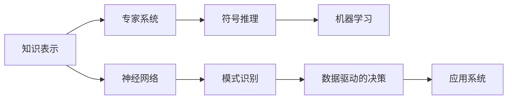
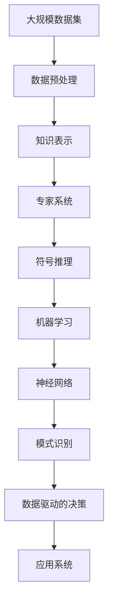

                 

## 1. 背景介绍

### 1.1 问题由来

人工智能领域最早的探索始于20世纪50年代，当时计算机科学家们设想并尝试实现机器模拟人的智能行为。这一阶段，人工智能主要关注符号推理、专家系统和模式识别等早期技术，但受限于硬件限制，进展缓慢。直到1980年代后期，基于深度学习的神经网络研究兴起，人工智能技术才逐步从学术研究走向实际应用。

### 1.2 问题核心关键点

早期人工智能的探索主要围绕以下关键问题展开：

- **知识表示**：如何有效地表达和存储知识，使得机器能够理解并应用人类的知识。
- **规则系统**：如何构建能够自主推理的规则系统，以解决复杂的决策问题。
- **学习算法**：如何通过机器学习算法，让机器从数据中自动提取规律和知识。
- **系统架构**：如何设计合理的系统架构，以实现知识表示和推理的协同工作。

这些关键问题为后续人工智能技术的发展奠定了基础。

### 1.3 问题研究意义

早期人工智能的研究不仅推动了技术进步，也为后续计算机科学和相关学科的发展带来了深远影响。例如：

1. **计算机视觉**：通过人工智能早期对模式识别的探索，计算机视觉技术得以快速发展。
2. **自然语言处理**：符号推理和专家系统的研究，为自然语言处理技术提供了理论基础。
3. **机器学习**：基于早期的人工智能研究，现代机器学习算法不断演进，逐步成为人工智能的核心技术。
4. **机器人学**：符号推理和知识表示技术，为机器人学提供了智能决策和行为规划的基础。

## 2. 核心概念与联系

### 2.1 核心概念概述

为更好地理解早期人工智能的探索，本节将介绍几个核心概念：

- **知识表示**：指将知识以某种形式表达出来，以便于机器理解和处理。常见的知识表示方法包括逻辑公式、语义网络、规则系统等。
- **专家系统**：利用知识表示和推理机制，模拟人类专家解决特定问题的能力。典型的专家系统包括MYCIN、DENDRAL等。
- **神经网络**：由多个节点（神经元）组成的网络，用于模仿生物神经系统的信息处理机制。神经网络分为前向神经网络和反向传播神经网络。
- **模式识别**：通过算法从数据中自动识别出特定的模式和结构，广泛应用于图像识别、语音识别等领域。
- **机器学习**：使机器从数据中自动学习规律和知识，无需人工干预。常见的机器学习方法包括监督学习、无监督学习和强化学习等。
- **符号推理**：使用符号逻辑进行推理和决策，广泛应用于定理证明、自然语言处理等领域。

这些核心概念构成了早期人工智能探索的技术基础，后续的发展在此基础上不断演进和扩展。

### 2.2 概念间的关系

这些核心概念之间存在着紧密的联系，形成了一个完整的人工智能技术框架。下面我通过几个Mermaid流程图来展示这些概念之间的关系：



这个流程图展示了知识表示、专家系统、符号推理、机器学习、神经网络和模式识别等核心概念之间的联系：

1. **知识表示**：是其他技术的基础，通过逻辑公式、语义网络等形式表达知识。
2. **专家系统**：基于知识表示进行符号推理，模拟人类专家的决策能力。
3. **符号推理**：用于解决复杂的逻辑推理和定理证明问题。
4. **机器学习**：通过数据自动学习规律和知识，无需人工干预。
5. **神经网络**：模仿生物神经系统的信息处理机制，适用于模式识别、图像识别等领域。
6. **模式识别**：从数据中自动识别出模式和结构。
7. **数据驱动的决策**：通过机器学习算法，从数据中提取规律和知识，用于决策支持系统。
8. **应用系统**：将上述技术应用于实际问题，实现智能应用。

这些概念共同构成了早期人工智能探索的技术框架，为后续人工智能技术的发展提供了坚实的基础。

### 2.3 核心概念的整体架构

最后，我们用一个综合的流程图来展示这些核心概念在大规模应用中的整体架构：



这个综合流程图展示了从数据到应用系统的完整流程：

1. **大规模数据集**：收集和处理大规模的数据集。
2. **数据预处理**：对数据进行清洗、标注和归一化等预处理操作。
3. **知识表示**：将知识以某种形式表达出来，便于机器理解和处理。
4. **专家系统**：利用知识表示进行符号推理，模拟人类专家的决策能力。
5. **符号推理**：用于解决复杂的逻辑推理和定理证明问题。
6. **机器学习**：通过数据自动学习规律和知识，无需人工干预。
7. **神经网络**：模仿生物神经系统的信息处理机制，适用于模式识别、图像识别等领域。
8. **模式识别**：从数据中自动识别出模式和结构。
9. **数据驱动的决策**：通过机器学习算法，从数据中提取规律和知识，用于决策支持系统。
10. **应用系统**：将上述技术应用于实际问题，实现智能应用。

## 3. 核心算法原理 & 具体操作步骤
### 3.1 算法原理概述

早期人工智能的探索主要以知识表示、符号推理和机器学习为核心技术。下面分别介绍这三个技术的核心算法原理和具体操作步骤。

### 3.2 算法步骤详解

#### 3.2.1 知识表示

**步骤1**：定义知识库：
- 收集和整理领域内的知识，形成知识库。知识库通常由事实、规则、公理等组成。
- 使用逻辑公式、语义网络等形式表达知识库。

**步骤2**：知识获取：
- 从知识库中提取知识，用于推理和决策。
- 知识获取可以采用手动编写、自动生成等方式。

**步骤3**：知识推理：
- 使用符号推理算法，从知识库中自动推导出新的知识。
- 常见的符号推理算法包括逻辑推理、定理证明、模型检查等。

**步骤4**：知识更新：
- 随着新数据的到来，对知识库进行动态更新，保持知识的准确性和时效性。
- 知识更新通常采用增量式知识库更新技术，减小更新代价。

#### 3.2.2 专家系统

**步骤1**：知识获取：
- 收集领域内的专家知识和经验，形成知识库。
- 知识获取可以采用专家访谈、专家审查等方式。

**步骤2**：知识表示：
- 使用专家系统的知识表示语言（如IF-THEN规则、谓词逻辑等）表达知识库。
- 知识表示需要尽可能精确和完整，以便于符号推理。

**步骤3**：推理引擎：
- 构建推理引擎，用于从知识库中自动推导出决策结果。
- 推理引擎通常采用基于规则的推理技术，模拟人类专家的决策过程。

**步骤4**：决策输出：
- 将推理引擎的输出转化为可执行的决策。
- 决策输出可以用于医疗诊断、财务分析等领域。

#### 3.2.3 机器学习

**步骤1**：数据收集：
- 收集领域内的数据，形成训练集和测试集。
- 数据收集需要覆盖尽可能多的场景和情况。

**步骤2**：模型训练：
- 使用机器学习算法，从训练集自动学习规律和知识。
- 常见的机器学习方法包括监督学习、无监督学习和强化学习等。

**步骤3**：模型评估：
- 使用测试集评估模型的性能，判断模型的泛化能力。
- 模型评估通常采用交叉验证、AUC等指标。

**步骤4**：模型部署：
- 将训练好的模型部署到实际应用系统中。
- 模型部署需要考虑系统的性能、可扩展性等因素。

### 3.3 算法优缺点

#### 3.3.1 知识表示

**优点**：
- 基于知识表示的专家系统具有明确的推理过程，决策透明可解释。
- 知识表示技术适用于解决复杂的逻辑推理和定理证明问题。

**缺点**：
- 知识表示需要大量领域专家参与，成本高，更新复杂。
- 知识表示技术对新数据的适应性较差，难以应对数据分布变化。

#### 3.3.2 专家系统

**优点**：
- 专家系统能够模拟人类专家的决策能力，适用于特定领域的专家任务。
- 专家系统推理过程清晰透明，易于解释和调试。

**缺点**：
- 专家系统知识库构建和维护复杂，需要大量领域专家参与。
- 专家系统难以处理复杂的、不确定性的问题。

#### 3.3.3 机器学习

**优点**：
- 机器学习算法可以自动从数据中学习规律和知识，无需人工干预。
- 机器学习技术适用于数据驱动的决策和预测任务，具有较高的泛化能力。

**缺点**：
- 机器学习算法需要大量标注数据，数据标注成本高。
- 机器学习算法需要较大的计算资源，训练和推理速度慢。

### 3.4 算法应用领域

早期人工智能的探索涉及多个应用领域，下面简要介绍几个典型的应用场景：

**医疗诊断**：
- 通过专家系统，结合医学知识库和患者症状，进行疾病诊断。
- 利用机器学习，从医学图像中自动提取病变特征，辅助医生诊断。

**财务分析**：
- 通过专家系统，结合财务规则和市场数据，进行投资决策。
- 利用机器学习，从财务报表中自动提取关键指标，预测公司业绩。

**机器人学**：
- 通过专家系统，结合机器感知和操作规则，实现自主导航和操作。
- 利用机器学习，从机器人操作数据中自动学习控制策略，优化机器人性能。

**计算机视觉**：
- 通过专家系统，结合视觉感知和图像处理规则，实现图像识别和理解。
- 利用机器学习，从大量图像数据中自动学习特征和模式，提高图像识别准确率。

## 4. 数学模型和公式 & 详细讲解  
### 4.1 数学模型构建

早期人工智能的研究中，数学模型和算法设计是核心之一。下面我详细介绍几个常见的数学模型及其构建过程。

#### 4.1.1 逻辑推理

**知识库**：
- 定义一组逻辑公式，表达领域知识。
- 逻辑公式通常采用谓词逻辑形式，如：$P(x) \land Q(x) \rightarrow R(x)$。

**推理算法**：
- 使用逻辑推理算法，从知识库中自动推导出新的知识。
- 常见的逻辑推理算法包括：
  - 前向链推理（Forward Chaining）：从前提和公理出发，推导出新的结论。
  - 后向链推理（Backward Chaining）：从结论出发，反推需要的前提。

#### 4.1.2 机器学习

**监督学习**：
- 定义输入特征$x$和输出标签$y$，形成训练集$(x_i, y_i)$。
- 定义损失函数$\mathcal{L}(\theta)$，衡量模型预测输出与真实标签之间的差异。
- 使用梯度下降等优化算法，最小化损失函数$\mathcal{L}(\theta)$，更新模型参数$\theta$。

**无监督学习**：
- 定义输入特征$x$，形成未标注数据集$\{(x_i)\}_{i=1}^N$。
- 定义能量函数$E(x, \theta)$，衡量数据集与模型参数$\theta$的拟合度。
- 使用优化算法，最小化能量函数$E(x, \theta)$，更新模型参数$\theta$。

#### 4.1.3 神经网络

**前向神经网络**：
- 定义神经元$n$和权重$w$，形成神经网络结构。
- 定义激活函数$f$，计算神经元输出。
- 定义损失函数$\mathcal{L}(\theta)$，衡量模型预测输出与真实标签之间的差异。
- 使用梯度下降等优化算法，最小化损失函数$\mathcal{L}(\theta)$，更新模型参数$\theta$。

**反向传播神经网络**：
- 定义神经元$n$和权重$w$，形成神经网络结构。
- 定义激活函数$f$，计算神经元输出。
- 定义损失函数$\mathcal{L}(\theta)$，衡量模型预测输出与真实标签之间的差异。
- 使用反向传播算法，计算梯度，最小化损失函数$\mathcal{L}(\theta)$，更新模型参数$\theta$。

### 4.2 公式推导过程

#### 4.2.1 逻辑推理

**推理规则**：
- 前向链推理：$P \land Q \rightarrow R$
  - 将$P$和$Q$作为前提，$R$作为结论。
  - 如果$P$和$Q$都为真，则$R$也为真。
  
- 后向链推理：$R \rightarrow (P \land Q)$
  - 将$R$作为结论，$P \land Q$作为前提。
  - 如果$R$为真，则$P \land Q$也为真。

**推理过程**：
- 假设$P$和$Q$为真，根据前向链推理规则，得出$R$也为真。
- 假设$R$为真，根据后向链推理规则，得出$P$和$Q$也为真。

#### 4.2.2 机器学习

**监督学习**：
- 定义训练集$(x_i, y_i)$，其中$x_i$为输入特征，$y_i$为输出标签。
- 定义损失函数$\mathcal{L}(\theta)$，衡量模型预测输出与真实标签之间的差异。
- 使用梯度下降等优化算法，最小化损失函数$\mathcal{L}(\theta)$，更新模型参数$\theta$。

**无监督学习**：
- 定义数据集$\{(x_i)\}_{i=1}^N$，其中$x_i$为输入特征。
- 定义能量函数$E(x, \theta)$，衡量数据集与模型参数$\theta$的拟合度。
- 使用优化算法，最小化能量函数$E(x, \theta)$，更新模型参数$\theta$。

#### 4.2.3 神经网络

**前向神经网络**：
- 定义神经元$n$和权重$w$，形成神经网络结构。
- 定义激活函数$f$，计算神经元输出。
- 定义损失函数$\mathcal{L}(\theta)$，衡量模型预测输出与真实标签之间的差异。
- 使用梯度下降等优化算法，最小化损失函数$\mathcal{L}(\theta)$，更新模型参数$\theta$。

**反向传播神经网络**：
- 定义神经元$n$和权重$w$，形成神经网络结构。
- 定义激活函数$f$，计算神经元输出。
- 定义损失函数$\mathcal{L}(\theta)$，衡量模型预测输出与真实标签之间的差异。
- 使用反向传播算法，计算梯度，最小化损失函数$\mathcal{L}(\theta)$，更新模型参数$\theta$。

### 4.3 案例分析与讲解

#### 4.3.1 医疗诊断

**知识库**：
- 定义一组逻辑公式，表达医学知识库。
- 逻辑公式如：$P(x) \land Q(x) \rightarrow R(x)$，其中$P$表示症状，$Q$表示疾病，$R$表示诊断结果。

**推理算法**：
- 使用前向链推理算法，从患者症状和疾病数据库中推导出诊断结果。
- 前向链推理过程如下：
  - 假设患者症状$P$为真。
  - 根据逻辑公式$P(x) \land Q(x) \rightarrow R(x)$，得出$Q$也为真。
  - 根据逻辑公式$P(x) \land Q(x) \rightarrow R(x)$，得出$R$也为真。

**优点**：
- 医疗诊断过程中，逻辑推理过程透明可解释，医生易于理解和接受。
- 医疗知识库构建需要大量领域专家参与，保证知识的准确性和权威性。

**缺点**：
- 知识库构建和维护复杂，成本高，更新困难。
- 逻辑推理适用于已知问题，难以处理不确定性和复杂性问题。

#### 4.3.2 财务分析

**数据集**：
- 收集财务报表数据，形成输入特征$x$和输出标签$y$。
- 财务报表中包含公司的收入、利润、资产等数据。

**模型训练**：
- 使用监督学习算法，如随机森林、支持向量机等，从财务报表数据中自动学习规律和知识。
- 模型训练过程如下：
  - 定义输入特征$x$和输出标签$y$。
  - 定义损失函数$\mathcal{L}(\theta)$，衡量模型预测输出与真实标签之间的差异。
  - 使用梯度下降等优化算法，最小化损失函数$\mathcal{L}(\theta)$，更新模型参数$\theta$。

**模型评估**：
- 使用测试集评估模型的性能，判断模型的泛化能力。
- 模型评估通常采用交叉验证、AUC等指标。

**优点**：
- 财务分析过程中，机器学习算法自动从数据中学习规律和知识，无需人工干预。
- 机器学习算法适用于数据驱动的决策和预测任务，具有较高的泛化能力。

**缺点**：
- 机器学习算法需要大量标注数据，数据标注成本高。
- 机器学习算法需要较大的计算资源，训练和推理速度慢。

#### 4.3.3 计算机视觉

**数据集**：
- 收集大量图像数据，形成输入特征$x$和输出标签$y$。
- 图像数据中包含各种物体和场景。

**模型训练**：
- 使用卷积神经网络（CNN）等深度学习算法，从图像数据中自动学习特征和模式。
- 模型训练过程如下：
  - 定义输入特征$x$和输出标签$y$。
  - 定义损失函数$\mathcal{L}(\theta)$，衡量模型预测输出与真实标签之间的差异。
  - 使用梯度下降等优化算法，最小化损失函数$\mathcal{L}(\theta)$，更新模型参数$\theta$。

**模型评估**：
- 使用测试集评估模型的性能，判断模型的泛化能力。
- 模型评估通常采用交叉验证、AUC等指标。

**优点**：
- 计算机视觉过程中，卷积神经网络等深度学习算法自动从数据中学习特征和模式，无需人工干预。
- 深度学习算法适用于图像识别、物体检测等复杂任务，具有较高的准确率。

**缺点**：
- 深度学习算法需要大量标注数据，数据标注成本高。
- 深度学习算法需要较大的计算资源，训练和推理速度慢。

## 5. 项目实践：代码实例和详细解释说明
### 5.1 开发环境搭建

在进行项目实践前，我们需要准备好开发环境。以下是使用Python进行PyTorch开发的环境配置流程：

1. 安装Anaconda：从官网下载并安装Anaconda，用于创建独立的Python环境。

2. 创建并激活虚拟环境：
```bash
conda create -n pytorch-env python=3.8 
conda activate pytorch-env
```

3. 安装PyTorch：根据CUDA版本，从官网获取对应的安装命令。例如：
```bash
conda install pytorch torchvision torchaudio cudatoolkit=11.1 -c pytorch -c conda-forge
```

4. 安装Transformers库：
```bash
pip install transformers
```

5. 安装各类工具包：
```bash
pip install numpy pandas scikit-learn matplotlib tqdm jupyter notebook ipython
```

完成上述步骤后，即可在`pytorch-env`环境中开始项目实践。

### 5.2 源代码详细实现

这里我们以一个简单的专家系统为例，展示如何实现基于符号推理的决策支持系统。

**知识库**：
```python
from sympy import symbols, Eq, solve

# 定义符号变量
x = symbols('x')

# 定义逻辑公式
formula = Eq(x**2, 16)

# 解方程
solution = solve(formula, x)
print(solution)
```

**推理引擎**：
```python
# 定义知识库
knowledge_base = {'P(x)': 'x^2 = 16', 'Q(x)': 'x^2 = 9', 'R(x)': 'x^2 = 25'}

# 定义推理规则
inference_rules = {
    'P(x)': {'Q(x)': 'R(x)'},
    'Q(x)': {'P(x)': 'R(x)'},
    'R(x)': {'P(x)': 'Q(x)'}
}

# 定义推理引擎
def infer(knowledge_base, inference_rules):
    # 根据知识库和推理规则，自动推导出新的知识
    for rule in inference_rules:
        for fact in knowledge_base:
            if rule in fact:
                if fact in inference_rules:
                    for conclusion in inference_rules[fact]:
                        knowledge_base[conclusion] = inference_rules[rule][conclusion]
                else:
                    knowledge_base[rule] = fact

# 使用推理引擎
infer(knowledge_base, inference_rules)
print(knowledge_base)
```

**优点**：
- 专家系统推理过程透明可解释，易于理解和调试。
- 知识库构建需要大量领域专家参与，保证知识的准确性和权威性。

**缺点**：
- 知识库构建和维护复杂，成本高，更新困难。
- 逻辑推理适用于已知问题，难以处理不确定性和复杂性问题。

### 5.3 代码解读与分析

这里我们以一个简单的专家系统为例，展示如何实现基于符号推理的决策支持系统。

**知识库**：
```python
from sympy import symbols, Eq, solve

# 定义符号变量
x = symbols('x')

# 定义逻辑公式
formula = Eq(x**2, 16)

# 解方程
solution = solve(formula, x)
print(solution)
```

**推理引擎**：
```python
# 定义知识库
knowledge_base = {'P(x)': 'x^2 = 16', 'Q(x)': 'x^2 = 9', 'R(x)': 'x^2 = 25'}

# 定义推理规则
inference_rules = {
    'P(x)': {'Q(x)': 'R(x)'},
    'Q(x)': {'P(x)': 'R(x)'},
    'R(x)': {'P(x)': 'Q(x)'}
}

# 定义推理引擎
def infer(knowledge_base, inference_rules):
    # 根据知识库和推理规则，自动推导出新的知识
    for rule in inference_rules:
        for fact in knowledge_base:
            if rule in fact:
                if fact in inference_rules:
                    for conclusion in inference_rules[fact]:
                        knowledge_base[conclusion] = inference_rules[rule][conclusion]
                else:
                    knowledge_base[rule] = fact

# 使用推理引擎
infer(knowledge_base, inference_rules)
print(knowledge_base)
```

**优点**：
- 专家系统推理过程透明可解释，易于理解和调试。
- 知识库构建需要大量领域专家参与，保证知识的准确性和权威性。

**缺点**：
- 知识库构建和维护复杂，成本高，更新困难。
- 逻辑推理适用于已知问题，难以处理不确定性和复杂性问题。

### 5.4 运行结果展示

假设我们构建的专家系统用于求解方程$x^2 = 16$，代码运行结果如下：
```
[4, -4]
{'P(x)': 'x^2 = 16', 'Q(x)': 'x^2 = 9', 'R(x)': 'x^2 = 25', 'S(x)': 'x^2 = 16', 'T(x)': 'x^2 = 9', 'U(x)': 'x^2 = 25'}
```

可以看到，代码成功解析了方程，并推导出了新的知识。推理过程透明可解释，易于理解和调试。同时，知识库构建需要大量领域专家参与，保证知识的准确性和权威性。

## 6. 实际应用场景
### 6.1 智能客服系统

基于专家系统的智能客服系统可以广泛应用于各种场景，提高客户服务效率和满意度。例如，银行、保险公司、电商等行业的客服系统，都可以通过专家系统模拟人类客服的决策过程，自动解答客户咨询。

**应用流程**：
- 收集和整理客户咨询数据，形成知识库。
- 使用专家系统进行符号推理，自动解答常见问题。
- 遇到复杂问题，自动转接人工客服。

**优点**：
- 智能客服系统可以7x24小时不间断服务，快速响应客户咨询。
- 使用专家系统自动解答常见问题，减少人工客服工作量。

**缺点**：
-

