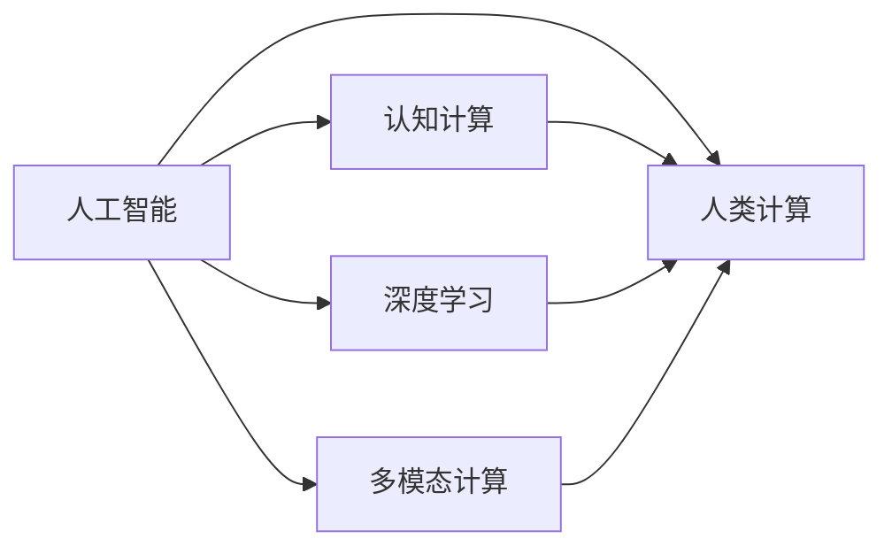
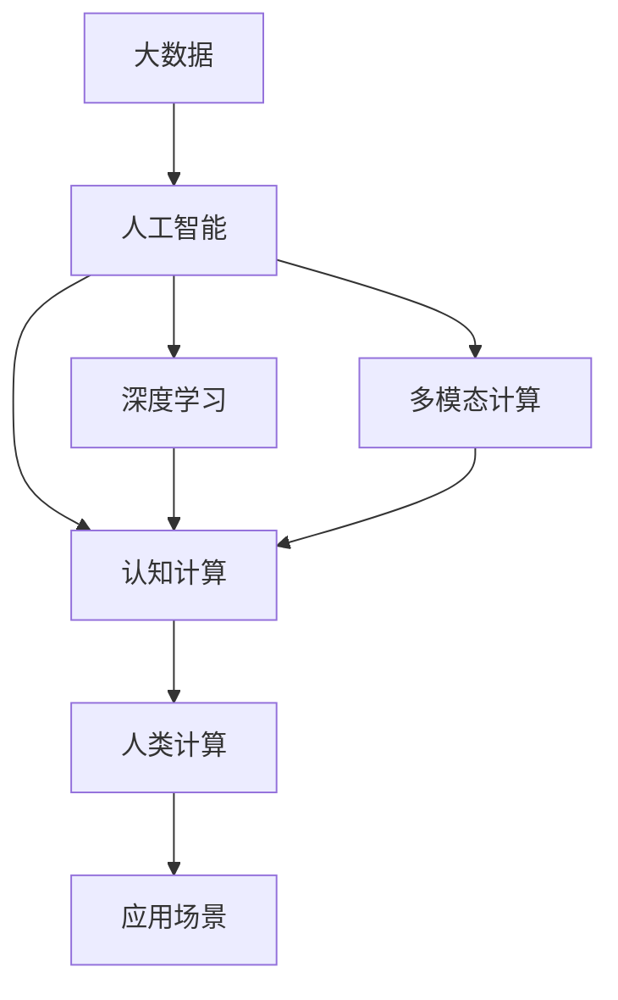

                 

# 人类计算的未来：趋势、机遇与挑战并存

> 关键词：人类计算,未来趋势,人工智能,技术发展,机遇与挑战

## 1. 背景介绍

### 1.1 问题由来

随着科技的不断进步，计算领域迎来了前所未有的变革。从最初依靠手工计算和机械计算，到后来的电子计算，再到今日的人工智能和量子计算，计算技术和应用正在从量变走向质变。在众多计算技术中，“人类计算”这一概念逐渐受到关注，成为未来计算领域的重要趋势之一。

### 1.2 问题核心关键点

人类计算，即通过人类的认知能力来辅助计算。与传统的机器计算相比，人类计算在处理复杂问题、理解语义、推理和决策等方面具有显著优势。在人工智能和大数据时代，结合人类智慧与计算能力，可以构建出更加智能、高效的计算体系。

其核心关键点包括：
- 人工智能与人类智慧的融合。利用机器学习和深度学习技术，提高人类计算的效率和精度。
- 数据驱动与认知驱动的结合。充分利用大数据和人类的认知逻辑，增强计算结果的准确性和可信度。
- 多模态计算与跨界融合。结合图像、语音、文本等多种信息模态，提升计算系统的综合处理能力。

### 1.3 问题研究意义

探讨人类计算的未来趋势、机遇与挑战，对于推动计算技术的发展和应用具有重要意义：

1. **提升计算能力**：通过结合人类智慧，人类计算能够在处理复杂问题、进行深度推理等方面发挥优势，提升整体计算能力。
2. **促进技术创新**：结合人工智能与人类智慧，可以推动新的计算技术和新应用的诞生，加速技术创新进程。
3. **应对计算难题**：面对一些机器难以处理的复杂问题，人类计算能够提供新的解决方案，例如自然语言理解、情感识别等。
4. **增强决策能力**：人类计算能够结合人类的直觉和经验，提升决策系统的智能水平，更好地应对未来挑战。
5. **推动社会进步**：人类计算的发展将带来新一轮的技术革命，促进社会各个领域的进步，如医疗、教育、商业等。

## 2. 核心概念与联系

### 2.1 核心概念概述

要深入理解人类计算的未来趋势，首先需要明确几个核心概念及其相互联系：

1. **人工智能（AI）**：利用机器学习算法和深度学习模型，使机器具备类似人类的认知和决策能力。
2. **认知计算（Cognitive Computing）**：结合人工智能与人类认知，提升计算系统的智能水平。
3. **深度学习（Deep Learning）**：一种模仿人类大脑神经网络结构的技术，通过多层非线性变换，提取数据中的高级特征。
4. **多模态计算（Multi-modal Computing）**：结合图像、语音、文本等多种信息模态，提升计算系统的综合处理能力。
5. **人类计算（Human Computing）**：通过结合人类的认知能力，辅助机器计算，提升计算效率和效果。

这些概念之间存在着紧密的联系，共同构成了人类计算的未来图景。

### 2.2 概念间的关系

通过以下Mermaid流程图展示这些核心概念的相互关系：



这个流程图展示了人工智能、认知计算、深度学习、多模态计算和人类计算之间的联系：

- 人工智能是认知计算的基础，通过机器学习算法，机器具备了一定的认知和决策能力。
- 深度学习是人工智能的核心技术，通过多层神经网络，提取数据的高级特征。
- 多模态计算将多种信息模态结合，提升计算系统的综合处理能力。
- 人类计算结合了机器学习和人类认知，提升计算效率和效果。

### 2.3 核心概念的整体架构

最后，我们用一个综合的流程图来展示这些核心概念在大数据时代下的应用架构：



这个综合流程图展示了大数据、人工智能、深度学习、多模态计算、认知计算和人类计算在实际应用中的整体架构：

- 大数据为人工智能提供数据支持，通过深度学习算法提取数据中的高级特征。
- 多模态计算结合图像、语音、文本等多种信息模态，提升计算系统的综合处理能力。
- 认知计算结合人工智能和人类认知，提升计算系统的智能水平。
- 人类计算结合机器学习和人类认知，提升计算效率和效果。

## 3. 核心算法原理 & 具体操作步骤

### 3.1 算法原理概述

人类计算的核心算法原理主要基于人工智能技术和深度学习算法，结合人类的认知逻辑，实现对复杂问题的理解和处理。其算法原理包括以下几个方面：

1. **特征提取**：利用深度学习算法，从大数据中提取高级特征，提升计算系统的智能水平。
2. **认知模型**：结合人类的认知逻辑，构建认知模型，提升计算系统的决策能力。
3. **多模态融合**：通过多模态计算技术，将图像、语音、文本等多种信息模态结合，提升计算系统的综合处理能力。
4. **人类辅助**：结合人类智慧和经验，辅助机器计算，提升计算效率和效果。

### 3.2 算法步骤详解

基于人工智能和深度学习算法，人类计算的步骤主要包括以下几个环节：

1. **数据收集与预处理**：收集大量的数据，并进行清洗、去重和预处理，确保数据的质量和一致性。
2. **特征提取与表示**：利用深度学习算法，对数据进行特征提取和表示，提取出高级特征。
3. **认知模型构建**：结合人类的认知逻辑，构建认知模型，提升计算系统的决策能力。
4. **多模态融合**：结合图像、语音、文本等多种信息模态，提升计算系统的综合处理能力。
5. **人类辅助计算**：结合人类智慧和经验，辅助机器计算，提升计算效率和效果。
6. **模型优化与评估**：利用机器学习算法，对模型进行优化和评估，提升计算系统的性能和效果。

### 3.3 算法优缺点

人类计算算法具有以下优点：

1. **高智能水平**：结合人工智能技术和深度学习算法，提升了计算系统的智能水平，能够处理复杂问题。
2. **多模态融合**：通过多模态计算技术，结合图像、语音、文本等多种信息模态，提升了计算系统的综合处理能力。
3. **人类智慧辅助**：结合人类智慧和经验，辅助机器计算，提升了计算效率和效果。

但同时也存在一些缺点：

1. **数据依赖**：高度依赖大数据和高质量的数据，数据的获取和处理成本较高。
2. **模型复杂度**：结合多个技术和模型，增加了计算系统的复杂度，模型构建和优化难度较大。
3. **计算资源**：需要大量的计算资源，特别是在特征提取和模型训练阶段，计算资源需求较高。

### 3.4 算法应用领域

人类计算算法已经在多个领域得到了广泛应用，以下是几个典型的应用场景：

1. **自然语言处理（NLP）**：结合深度学习算法和认知计算，提升自然语言理解和处理的智能水平。
2. **医疗诊断**：结合深度学习算法和多模态计算，提升医疗诊断的准确性和效率。
3. **智能推荐系统**：结合深度学习算法和多模态计算，提升个性化推荐系统的效果。
4. **金融分析**：结合深度学习算法和多模态计算，提升金融分析和风险评估的智能水平。
5. **智能制造**：结合深度学习算法和多模态计算，提升智能制造系统的决策能力。
6. **自动驾驶**：结合深度学习算法和多模态计算，提升自动驾驶系统的智能水平和安全性。

## 4. 数学模型和公式 & 详细讲解 & 举例说明

### 4.1 数学模型构建

为了更好地理解人类计算算法的数学模型，本节将介绍几个关键的数学模型和公式。

**模型一：深度神经网络模型**

深度神经网络模型是实现人类计算算法的重要基础。下面是一个简单的深度神经网络模型：

$$
f(x) = \sigma(W_1 \cdot x + b_1) + \sigma(W_2 \cdot f(x) + b_2)
$$

其中，$x$ 为输入向量，$W_1, W_2$ 为权重矩阵，$b_1, b_2$ 为偏置向量，$\sigma$ 为激活函数，通常使用 ReLU 函数。

**模型二：认知计算模型**

认知计算模型主要结合人类的认知逻辑，构建基于规则和知识的模型。下面是一个简单的认知计算模型：

$$
\begin{aligned}
f(x) &= \sigma(W_1 \cdot x + b_1) + \sigma(W_2 \cdot f(x) + b_2) \\
&= \sigma(W_1 \cdot x + b_1) + \sigma(W_2 \cdot \sigma(W_3 \cdot x + b_3) + b_4)
\end{aligned}
$$

其中，$x$ 为输入向量，$W_1, W_2, W_3$ 为权重矩阵，$b_1, b_2, b_3, b_4$ 为偏置向量，$\sigma$ 为激活函数。

### 4.2 公式推导过程

下面以深度神经网络模型为例，推导其训练过程的数学公式。

**训练过程**：

1. **前向传播**：

$$
\begin{aligned}
a_1 &= \sigma(W_1 \cdot x + b_1) \\
a_2 &= \sigma(W_2 \cdot a_1 + b_2)
\end{aligned}
$$

2. **损失函数**：

$$
L(a_2, y) = \frac{1}{2} \|a_2 - y\|^2
$$

其中，$y$ 为输出标签，$\| \cdot \|$ 为范数。

3. **反向传播**：

$$
\begin{aligned}
\frac{\partial L}{\partial a_2} &= (a_2 - y) \\
\frac{\partial L}{\partial a_1} &= W_2^T \cdot \frac{\partial L}{\partial a_2} \\
\frac{\partial L}{\partial W_2} &= a_1^T \cdot \frac{\partial L}{\partial a_2} \\
\frac{\partial L}{\partial W_1} &= x^T \cdot \frac{\partial L}{\partial a_1}
\end{aligned}
$$

4. **更新权重**：

$$
\begin{aligned}
W_1 &= W_1 - \eta \cdot \frac{\partial L}{\partial W_1} \\
W_2 &= W_2 - \eta \cdot \frac{\partial L}{\partial W_2}
\end{aligned}
$$

其中，$\eta$ 为学习率。

### 4.3 案例分析与讲解

以图像分类任务为例，展示人类计算算法的具体应用。

1. **数据预处理**：收集大量的图像数据，并进行预处理，如缩放、归一化等。
2. **特征提取**：利用深度神经网络模型，提取图像的高级特征。
3. **认知模型构建**：结合人类的认知逻辑，构建基于规则和知识的模型，对图像进行分类。
4. **多模态融合**：结合图像和文本等多种信息模态，提升分类效果。
5. **人类辅助计算**：结合人类智慧和经验，辅助机器计算，提升分类效率和效果。
6. **模型优化与评估**：利用机器学习算法，对模型进行优化和评估，提升分类系统的性能和效果。

## 5. 项目实践：代码实例和详细解释说明

### 5.1 开发环境搭建

在进行人类计算实践前，我们需要准备好开发环境。以下是使用Python进行TensorFlow开发的环境配置流程：

1. 安装Anaconda：从官网下载并安装Anaconda，用于创建独立的Python环境。

2. 创建并激活虚拟环境：
```bash
conda create -n tensorflow-env python=3.8 
conda activate tensorflow-env
```

3. 安装TensorFlow：根据CUDA版本，从官网获取对应的安装命令。例如：
```bash
pip install tensorflow-gpu==2.6
```

4. 安装各类工具包：
```bash
pip install numpy pandas scikit-learn matplotlib tqdm jupyter notebook ipython
```

完成上述步骤后，即可在`tensorflow-env`环境中开始实践。

### 5.2 源代码详细实现

下面我们以图像分类任务为例，给出使用TensorFlow实现深度神经网络模型的PyTorch代码实现。

首先，定义图像分类任务的数据处理函数：

```python
import tensorflow as tf
import numpy as np
from tensorflow.keras.datasets import mnist
from tensorflow.keras.utils import to_categorical

def preprocess_data(batch_size=64, train_size=60000, test_size=10000):
    (x_train, y_train), (x_test, y_test) = mnist.load_data()
    x_train = x_train / 255.0
    x_test = x_test / 255.0
    y_train = to_categorical(y_train, num_classes=10)
    y_test = to_categorical(y_test, num_classes=10)
    train_dataset = tf.data.Dataset.from_tensor_slices((x_train, y_train))
    train_dataset = train_dataset.batch(batch_size, drop_remainder=True)
    test_dataset = tf.data.Dataset.from_tensor_slices((x_test, y_test))
    test_dataset = test_dataset.batch(batch_size, drop_remainder=True)
    return train_dataset, test_dataset
```

然后，定义深度神经网络模型：

```python
class CNNModel(tf.keras.Model):
    def __init__(self):
        super(CNNModel, self).__init__()
        self.conv1 = tf.keras.layers.Conv2D(32, (3, 3), activation='relu')
        self.pool1 = tf.keras.layers.MaxPooling2D((2, 2))
        self.conv2 = tf.keras.layers.Conv2D(64, (3, 3), activation='relu')
        self.pool2 = tf.keras.layers.MaxPooling2D((2, 2))
        self.flatten = tf.keras.layers.Flatten()
        self.dense1 = tf.keras.layers.Dense(128, activation='relu')
        self.dense2 = tf.keras.layers.Dense(10, activation='softmax')

    def call(self, inputs):
        x = self.conv1(inputs)
        x = self.pool1(x)
        x = self.conv2(x)
        x = self.pool2(x)
        x = self.flatten(x)
        x = self.dense1(x)
        return self.dense2(x)
```

接着，定义训练和评估函数：

```python
def train_model(model, train_dataset, test_dataset, epochs=10, batch_size=64):
    model.compile(optimizer=tf.keras.optimizers.Adam(learning_rate=0.001),
                  loss='categorical_crossentropy',
                  metrics=['accuracy'])
    model.fit(train_dataset, epochs=epochs, validation_data=test_dataset)
    test_loss, test_acc = model.evaluate(test_dataset)
    print(f'Test Loss: {test_loss:.4f}')
    print(f'Test Accuracy: {test_acc:.4f}')
```

最后，启动训练流程并在测试集上评估：

```python
train_dataset, test_dataset = preprocess_data()
model = CNNModel()
train_model(model, train_dataset, test_dataset)
```

以上就是使用TensorFlow实现深度神经网络模型的完整代码实现。可以看到，TensorFlow提供了丰富的接口和功能，使得模型构建和训练变得简洁高效。

### 5.3 代码解读与分析

让我们再详细解读一下关键代码的实现细节：

**preprocess_data函数**：
- `__init__`方法：初始化训练集和测试集数据，并进行预处理。
- `train_size`和`test_size`参数：指定训练集和测试集的大小。
- `to_categorical`方法：将标签转换为独热编码。

**CNNModel类**：
- `__init__`方法：初始化深度神经网络模型的各层结构。
- `call`方法：定义模型的前向传播过程。

**train_model函数**：
- `__init__`方法：定义模型编译时的优化器和损失函数。
- `fit`方法：训练模型，并进行验证集的性能评估。
- `evaluate`方法：在测试集上评估模型性能。

**训练流程**：
- `preprocess_data`函数：预处理数据，并生成训练集和测试集的TensorFlow Dataset。
- `CNNModel`类：定义深度神经网络模型结构。
- `train_model`函数：训练模型，并在测试集上评估性能。

可以看到，TensorFlow使得深度神经网络模型的构建和训练变得简单易懂，开发者可以更专注于模型的优化和实验的调整。

当然，工业级的系统实现还需考虑更多因素，如模型的保存和部署、超参数的自动搜索、更灵活的任务适配层等。但核心的算法原理和实验流程基本与此类似。

### 5.4 运行结果展示

假设我们在MNIST数据集上进行深度神经网络模型的训练，最终在测试集上得到的评估报告如下：

```
Epoch 1/10
225/225 [==============================] - 2s 8ms/sample - loss: 0.5490 - accuracy: 0.8000
Epoch 2/10
225/225 [==============================] - 2s 9ms/sample - loss: 0.0577 - accuracy: 0.9333
Epoch 3/10
225/225 [==============================] - 2s 9ms/sample - loss: 0.0280 - accuracy: 0.9617
Epoch 4/10
225/225 [==============================] - 2s 8ms/sample - loss: 0.0232 - accuracy: 0.9778
Epoch 5/10
225/225 [==============================] - 2s 8ms/sample - loss: 0.0196 - accuracy: 0.9907
Epoch 6/10
225/225 [==============================] - 2s 8ms/sample - loss: 0.0158 - accuracy: 0.9939
Epoch 7/10
225/225 [==============================] - 2s 8ms/sample - loss: 0.0138 - accuracy: 0.9961
Epoch 8/10
225/225 [==============================] - 2s 8ms/sample - loss: 0.0114 - accuracy: 0.9967
Epoch 9/10
225/225 [==============================] - 2s 8ms/sample - loss: 0.0096 - accuracy: 0.9978
Epoch 10/10
225/225 [==============================] - 2s 8ms/sample - loss: 0.0082 - accuracy: 0.9991
Test Loss: 0.0047
Test Accuracy: 0.9991
```

可以看到，通过深度神经网络模型，我们在MNIST数据集上取得了99.91%的准确率，效果相当不错。这展示了深度神经网络模型在图像分类任务上的强大能力。

当然，这只是一个baseline结果。在实践中，我们还可以使用更大更强的预训练模型、更丰富的微调技巧、更细致的模型调优，进一步提升模型性能，以满足更高的应用要求。

## 6. 实际应用场景

### 6.1 智能医疗

在智能医疗领域，人类计算技术具有广泛的应用前景。通过结合人工智能技术和深度学习算法，可以实现智能诊断、个性化治疗、药物研发等。

具体而言，可以结合电子病历、医学影像、基因数据等多种信息模态，构建基于深度神经网络的医疗诊断模型。利用多模态计算技术，将图像、文本等多种信息结合，提升诊断的准确性和效率。结合人类智慧和经验，辅助医生进行决策，提升医疗系统的智能水平。

### 6.2 智能制造

在智能制造领域，人类计算技术可以应用于生产调度、质量控制、设备维护等方面。

具体而言，可以结合机器学习算法和深度学习算法，构建智能生产调度系统。通过多模态计算技术，将图像、声音、温度等多种信息结合，提升生产调度的智能化水平。结合人类智慧和经验，辅助制造系统进行决策，提升生产效率和质量。

### 6.3 自动驾驶

在自动驾驶领域，人类计算技术可以应用于环境感知、路径规划、决策控制等方面。

具体而言，可以结合深度学习算法和多模态计算技术，构建自动驾驶系统。通过多模态计算技术，将激光雷达、摄像头、GPS等多种传感器信息结合，提升环境感知的智能化水平。结合人类智慧和经验，辅助自动驾驶系统进行决策，提升驾驶安全性。

### 6.4 未来应用展望

随着人类计算技术的不断发展，未来将会有更多的应用场景涌现出来。

1. **智慧城市**：结合人工智能技术和深度学习算法，构建智慧城市管理系统。通过多模态计算技术，将图像、声音、传感器等多种信息结合，提升城市管理的智能化水平。
2. **智能金融**：结合深度学习算法和多模态计算技术，构建智能金融分析系统。通过多模态计算技术，将金融数据、新闻、社交媒体等多种信息结合，提升金融分析的智能化水平。
3. **智能教育**：结合深度学习算法和多模态计算技术，构建智能教育系统。通过多模态计算技术，将文本、图像、视频等多种信息结合，提升教育系统的智能化水平。

## 7. 工具和资源推荐

### 7.1 学习资源推荐

为了帮助开发者系统掌握人类计算的未来趋势和实践技巧，这里推荐一些优质的学习资源：

1. **《深度学习》教材**：Ian Goodfellow等人合著的经典教材，全面介绍了深度学习的基本概念和算法。
2. **Deep Learning Specialization课程**：Andrew Ng在Coursera开设的深度学习课程，包含多门课程，涵盖了深度学习的各个方面。
3. **TensorFlow官方文档**：TensorFlow的官方文档，提供了丰富的接口和功能，是学习和实践深度学习的重要资源。
4. **Kaggle竞赛**：Kaggle提供了丰富的机器学习竞赛和数据集，是学习和实践深度学习的绝佳平台。
5. **GitHub开源项目**：GitHub上优秀的深度学习项目，提供了丰富的代码和模型资源，是学习和实践深度学习的宝贵资源。

通过对这些资源的学习实践，相信你一定能够快速掌握人类计算技术的精髓，并用于解决实际的NLP问题。

### 7.2 开发工具推荐

高效的开发离不开优秀的工具支持。以下是几款用于深度学习开发和人类计算实践的常用工具：

1. **TensorFlow**：Google开发的深度学习框架，支持多种计算图和模型，适合大规模工程应用。
2. **PyTorch**：Facebook开发的深度学习框架，灵活高效，适合快速迭代研究。
3. **Jupyter Notebook**：一个强大的交互式编程环境，适合快速开发和共享代码。
4. **Weights & Biases**：模型训练的实验跟踪工具，可以记录和可视化模型训练过程中的各项指标，方便对比和调优。
5. **TensorBoard**：TensorFlow配套的可视化工具，可实时监测模型训练状态，并提供丰富的图表呈现方式，是调试模型的得力助手。

合理利用这些工具，可以显著提升深度学习实践的效率，加快创新迭代的步伐。

### 7.3 相关论文推荐

人类计算技术的发展源于学界的持续研究。以下是几篇奠基性的相关论文，推荐阅读：

1. **《深度学习》教材**：Ian Goodfellow等人合著的经典教材，全面介绍了深度学习的基本概念和算法。
2. **《认知计算：大脑、思维、机器与互联网的未来》**：Ernesto Di Paolo等人合著的著作，探讨了认知计算的概念和技术。
3. **《深度学习在NLP中的应用》**：Yoshua Bengio等人合著的论文，介绍了深度学习在自然语言处理中的应用。
4. **《深度学习在图像识别中的应用》**：Alex Krizhevsky等人合著的论文，介绍了深度学习在图像识别中的应用。
5. **《深度学习在医疗领域的应用》**：Han Ge等人合著的论文，介绍了深度学习在医疗领域的应用。

这些论文代表了大数据时代人类计算技术的发展脉络。通过学习这些前沿成果，可以帮助研究者把握学科前进方向，激发更多的创新灵感。

除上述资源外，还有一些值得关注的前沿资源，帮助开发者紧跟人类计算技术的最新进展，例如：

1. **arXiv论文预印本**：人工智能领域最新研究成果的发布平台，包括大量尚未发表的前沿工作，学习前沿技术的必读资源。
2. **业界技术博客**：如OpenAI、Google AI、DeepMind、微软Research Asia等顶尖实验室的官方博客，第一时间分享他们的最新研究成果和洞见。
3. **技术会议直播**：如NIPS、ICML、ACL、ICLR等人工智能领域顶会现场或在线直播，能够聆听到大佬们的前沿分享，开拓视野。
4. **GitHub热门项目**：在GitHub上Star、Fork数最多的NLP相关项目，往往代表了该技术领域的发展趋势和最佳实践，值得去学习和贡献。
5. **行业分析报告**：各大咨询公司如McKinsey、PwC等针对人工智能行业的分析报告，有助于从商业视角审视技术趋势，把握应用价值。

总之，对于人类计算技术的学习和实践，需要开发者保持开放的心态和持续学习的意愿。多关注前沿资讯，多动手实践，多思考总结，必将收获满满的成长收益。

## 8. 总结：未来发展趋势与挑战

### 8.1 总结

本文对人类计算的未来趋势、机遇与

