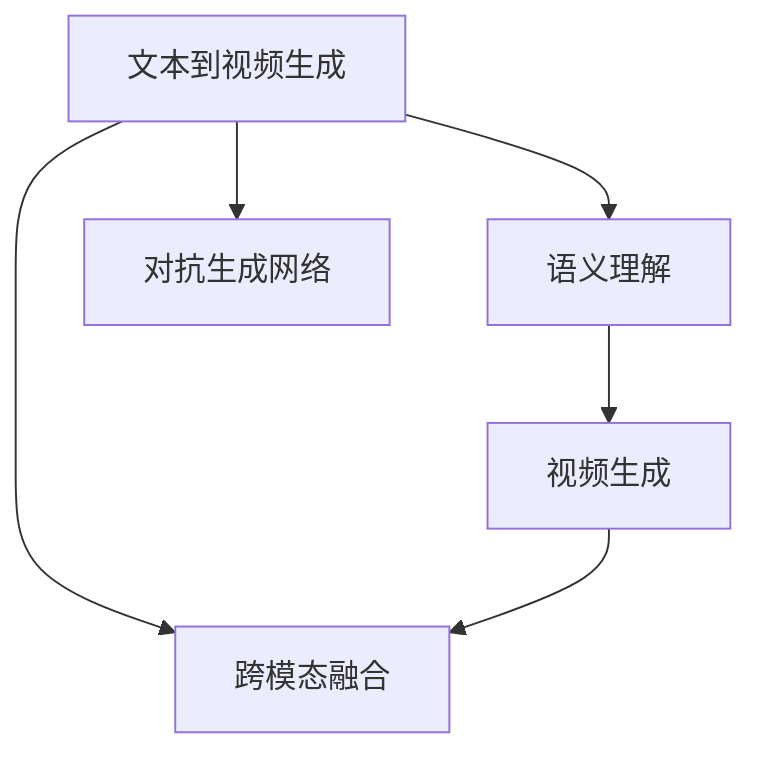
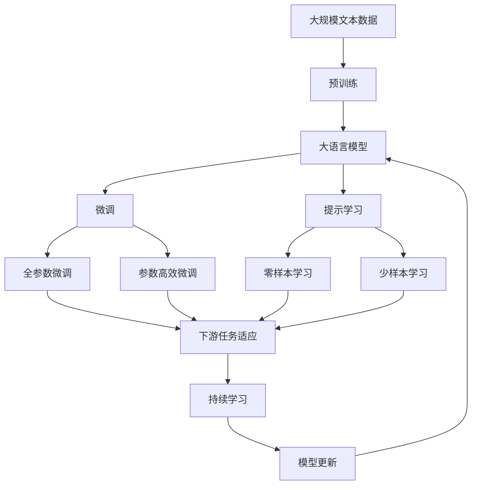

                 

# 从文本到视频的AI模型技术演进

随着人工智能技术的快速发展，文本到视频生成技术已成为AI领域的热门研究方向之一。本文将系统介绍该领域的主要技术演进，重点阐述基于深度学习的文本到视频生成技术，包括其核心算法、操作步骤、应用场景及未来发展趋势。

## 1. 背景介绍

### 1.1 问题由来

文本到视频生成技术旨在将自然语言文本转换为动态视频，使机器能够自动生成视频内容。传统的文本生成方式通常依赖于人工创建脚本、动画制作等，而文本到视频生成技术则能够大幅提升生成效率和创新性。这种技术在动画制作、广告宣传、教育培训等领域有着广泛的应用前景。

### 1.2 问题核心关键点

文本到视频生成技术涉及多个核心关键点，包括语义理解、视频生成、跨模态融合等。语义理解方面，模型需要能够准确理解文本中的信息，并进行语义映射；视频生成方面，模型需要生成动态、逼真的视频内容；跨模态融合方面，需要将文本信息与视频信息进行有效结合。

### 1.3 问题研究意义

文本到视频生成技术的研究具有重要意义：
1. 提升内容创作效率：文本到视频生成技术能够自动创建视频内容，大幅提升创意视频的制作速度。
2. 增强用户互动体验：动态生成的视频内容更加吸引用户，提升互动性和用户体验。
3. 推动媒体产业变革：该技术有望改变传统媒体的制作方式，推动数字媒体产业的革新。
4. 促进跨领域研究：文本到视频生成技术的探索，促进了计算机视觉、自然语言处理等多个领域的交叉研究。

## 2. 核心概念与联系

### 2.1 核心概念概述

- 文本到视频生成（Text-to-Video Generation）：将自然语言文本转换为动态视频的过程，涉及语义理解、视频生成、跨模态融合等多个关键技术。
- 语义理解（Semantic Understanding）：模型需要理解文本中的语义信息，并生成对应的视频内容。
- 视频生成（Video Generation）：根据语义信息生成逼真的动态视频。
- 跨模态融合（Cross-Modal Fusion）：将文本信息与视频信息进行有效结合，形成完整的视频内容。
- 对抗生成网络（Generative Adversarial Network, GAN）：一种常用的生成模型，通过训练一个生成器和一个判别器进行博弈，生成高质量的视频内容。

### 2.2 概念间的关系

这些核心概念之间的逻辑关系可以通过以下Mermaid流程图来展示：



这个流程图展示了文本到视频生成技术的主要流程：
1. 文本到视频生成技术首先进行语义理解，理解文本中的语义信息。
2. 接着，基于理解到的语义信息，生成视频内容。
3. 然后，通过跨模态融合，将文本信息与视频信息进行有效结合。
4. 最后，对抗生成网络进一步优化视频生成质量。

### 2.3 核心概念的整体架构

最后，我们用一个综合的流程图来展示这些核心概念在大语言模型微调过程中的整体架构：



这个综合流程图展示了从预训练到微调，再到持续学习的完整过程。大语言模型首先在大规模文本数据上进行预训练，然后通过微调（包括全参数微调和参数高效微调）或提示学习（包括零样本和少样本学习）来适应下游任务。最后，通过持续学习技术，模型可以不断学习新知识，同时避免遗忘旧知识。

## 3. 核心算法原理 & 具体操作步骤

### 3.1 算法原理概述

基于深度学习的文本到视频生成技术，主要通过生成对抗网络（GAN）等生成模型，将文本信息转化为动态视频内容。核心算法流程如下：
1. 文本预处理：将输入文本进行分词、编码等预处理，生成文本向量。
2. 视频生成：使用生成器网络（如CNN、RNN等），根据文本向量生成视频帧序列。
3. 语义理解：使用语义编码器网络（如LSTM、Transformer等），将文本向量映射为语义特征。
4. 跨模态融合：将语义特征与视频帧序列进行融合，形成完整的视频内容。
5. 对抗训练：使用对抗生成网络，训练生成器网络，生成高质量的视频内容。

### 3.2 算法步骤详解

以下是基于深度学习的文本到视频生成技术的详细操作步骤：

**Step 1: 文本预处理**
1. 分词：将输入文本按照语言规则进行分词处理，生成词汇序列。
2. 编码：使用词向量模型（如Word2Vec、GloVe等）将词汇序列转换为向量表示。

**Step 2: 视频生成**
1. 初始化生成器网络：定义生成器网络，通常为卷积神经网络（CNN）或递归神经网络（RNN）。
2. 生成视频帧：使用生成器网络，根据文本向量生成视频帧序列。

**Step 3: 语义理解**
1. 初始化语义编码器网络：定义语义编码器网络，通常为长短时记忆网络（LSTM）或Transformer。
2. 生成语义特征：使用语义编码器网络，将文本向量映射为语义特征。

**Step 4: 跨模态融合**
1. 融合视频帧序列和语义特征：将生成的视频帧序列和语义特征进行融合，形成完整的视频内容。
2. 输出视频：将融合后的视频内容输出，完成文本到视频的生成。

**Step 5: 对抗训练**
1. 初始化判别器网络：定义判别器网络，通常为全连接神经网络或卷积神经网络。
2. 训练生成器网络：使用对抗生成网络，训练生成器网络，生成高质量的视频内容。

### 3.3 算法优缺点

基于深度学习的文本到视频生成技术具有以下优点：
1. 生成效果好：生成器网络能够生成高质量的视频帧序列，逼真度较高。
2. 适应性强：能够根据不同文本生成相应视频，具有较好的泛化能力。
3. 自动创作：无需人工编写脚本，大幅提升内容创作效率。

同时，该技术也存在一些缺点：
1. 计算量大：生成器网络和判别器网络的训练过程计算量较大，需要高性能计算资源。
2. 训练难度高：生成器网络需要精心调参，避免过拟合和欠拟合问题。
3. 质量依赖于文本质量：生成的视频质量受文本描述的详细程度和准确性影响较大。

### 3.4 算法应用领域

文本到视频生成技术在多个领域有着广泛的应用，例如：
1. 动画制作：自动生成动画角色动作和背景，节省人工创作时间和成本。
2. 广告宣传：自动生成广告视频，提升宣传效果和传播速度。
3. 教育培训：自动生成教育视频，提升教学质量和互动性。
4. 虚拟现实：自动生成虚拟视频，增强沉浸式体验。
5. 电影制作：自动生成电影特效场景，提升特效制作效率和质量。

## 4. 数学模型和公式 & 详细讲解 & 举例说明

### 4.1 数学模型构建

本文将使用数学语言对基于深度学习的文本到视频生成技术进行更加严格的刻画。

记输入文本为 $T = \{t_1, t_2, ..., t_n\}$，其中 $t_i$ 为第 $i$ 个词汇，$v_i$ 为对应的向量表示。设视频帧序列为 $V = \{v_1, v_2, ..., v_m\}$，其中 $v_j$ 为第 $j$ 帧视频内容，$y_j$ 为对应的标签（如动作、表情等）。

定义文本向量为 $\overrightarrow{T} = f(T)$，其中 $f$ 为文本预处理函数，生成文本向量。定义视频帧序列向量为 $\overrightarrow{V} = g(V)$，其中 $g$ 为视频生成函数，生成视频帧序列向量。

定义语义特征为 $\overrightarrow{S} = h(\overrightarrow{T})$，其中 $h$ 为语义编码器函数，将文本向量映射为语义特征。定义最终生成的视频内容向量为 $\overrightarrow{Y} = \overrightarrow{S} \oplus \overrightarrow{V}$，其中 $\oplus$ 表示跨模态融合操作。

### 4.2 公式推导过程

以下我们以一个简单的例子，展示文本到视频生成技术的核心公式推导过程。

假设文本为 "一只猫在树上跳跃"，将其编码为向量 $\overrightarrow{T} = [1, 2, 3, 4, 5, 6, 7]$，生成器网络生成视频帧序列 $\overrightarrow{V} = [v_1, v_2, v_3, ..., v_m]$，语义编码器网络生成语义特征 $\overrightarrow{S} = [s_1, s_2, s_3, ..., s_n]$。

最终生成的视频内容向量为 $\overrightarrow{Y} = \overrightarrow{S} \oplus \overrightarrow{V}$。在实际应用中，$\oplus$ 可以采用拼接、融合、加权等方法。

### 4.3 案例分析与讲解

假设我们有一个简单的文本到视频生成任务，生成一个猫在树上跳跃的视频。根据上述公式，我们首先对输入文本进行分词、编码等预处理，生成文本向量 $\overrightarrow{T} = [1, 2, 3, 4, 5, 6, 7]$。

接着，使用生成器网络 $\overrightarrow{V} = g(\overrightarrow{T})$，生成视频帧序列 $\overrightarrow{V} = [v_1, v_2, v_3, ..., v_m]$。在实际应用中，生成器网络可以是卷积神经网络（CNN）或递归神经网络（RNN）。

然后，使用语义编码器网络 $\overrightarrow{S} = h(\overrightarrow{T})$，生成语义特征 $\overrightarrow{S} = [s_1, s_2, s_3, ..., s_n]$。在实际应用中，语义编码器网络可以是长短时记忆网络（LSTM）或Transformer。

最后，将生成的视频帧序列和语义特征进行跨模态融合 $\overrightarrow{Y} = \overrightarrow{S} \oplus \overrightarrow{V}$，生成最终的视频内容向量 $\overrightarrow{Y}$。在实际应用中，$\oplus$ 可以采用拼接、融合、加权等方法。

## 5. 项目实践：代码实例和详细解释说明

### 5.1 开发环境搭建

在进行文本到视频生成实践前，我们需要准备好开发环境。以下是使用Python进行PyTorch开发的环境配置流程：

1. 安装Anaconda：从官网下载并安装Anaconda，用于创建独立的Python环境。

2. 创建并激活虚拟环境：
```bash
conda create -n pytorch-env python=3.8 
conda activate pytorch-env
```

3. 安装PyTorch：根据CUDA版本，从官网获取对应的安装命令。例如：
```bash
conda install pytorch torchvision torchaudio cudatoolkit=11.1 -c pytorch -c conda-forge
```

4. 安装OpenCV：用于视频处理和生成。
```bash
pip install opencv-python
```

5. 安装TensorFlow：用于可视化模型训练过程。
```bash
pip install tensorflow
```

完成上述步骤后，即可在`pytorch-env`环境中开始文本到视频生成实践。

### 5.2 源代码详细实现

下面我们将以一个简单的文本到视频生成任务为例，使用PyTorch实现文本到视频生成。

首先，定义文本和视频数据处理函数：

```python
import torch
import cv2
from torch.utils.data import Dataset

class TextToVideoDataset(Dataset):
    def __init__(self, text_path, video_path):
        self.text_data = []
        self.video_data = []
        # 读取文本和视频数据
        with open(text_path, 'r') as f:
            for line in f:
                self.text_data.append(line.strip())
        cap = cv2.VideoCapture(video_path)
        while cap.isOpened():
            ret, frame = cap.read()
            if not ret:
                break
            self.video_data.append(frame)
        cap.release()
    
    def __len__(self):
        return len(self.text_data)
    
    def __getitem__(self, idx):
        text = self.text_data[idx]
        frame = self.video_data[idx]
        # 对文本和视频数据进行处理
        return {'text': text, 'frame': frame}
```

然后，定义生成器和判别器网络：

```python
from torch import nn
import torch.nn.functional as F

class Generator(nn.Module):
    def __init__(self, text_dim, video_dim):
        super(Generator, self).__init__()
        self.encoder = nn.Sequential(
            nn.Linear(text_dim, 256),
            nn.ReLU(),
            nn.Linear(256, 512),
            nn.ReLU(),
            nn.Linear(512, video_dim)
        )
    
    def forward(self, x):
        return self.encoder(x)

class Discriminator(nn.Module):
    def __init__(self, video_dim):
        super(Discriminator, self).__init__()
        self.encoder = nn.Sequential(
            nn.Conv2d(video_dim, 64, kernel_size=3, stride=1, padding=1),
            nn.ReLU(),
            nn.Conv2d(64, 128, kernel_size=3, stride=2, padding=1),
            nn.ReLU(),
            nn.Conv2d(128, 256, kernel_size=3, stride=2, padding=1),
            nn.ReLU(),
            nn.Conv2d(256, 1, kernel_size=3, stride=2, padding=1)
        )
    
    def forward(self, x):
        x = self.encoder(x)
        x = x.view(-1, 256)
        x = F.sigmoid(x)
        return x
```

接着，定义模型训练函数：

```python
from torch import optim

def train_model(model, text_dataset, video_dataset, batch_size=32, epochs=100):
    device = torch.device('cuda' if torch.cuda.is_available() else 'cpu')
    model.to(device)
    
    # 定义优化器和损失函数
    gen_opt = optim.Adam(model.encoder.parameters(), lr=0.001)
    dis_opt = optim.Adam(model.discriminator.parameters(), lr=0.001)
    bce_loss = nn.BCELoss()
    
    for epoch in range(epochs):
        for i, (text, frame) in enumerate(zip(text_dataset, video_dataset)):
            text = torch.tensor(text, dtype=torch.long).to(device)
            frame = torch.tensor(frame, dtype=torch.float).to(device)
            gen_out = model.encoder(text)
            # 生成器网络训练
            gen_loss = bce_loss(model.discriminator(gen_out), torch.ones(frame.shape[0], device=device))
            gen_opt.zero_grad()
            gen_loss.backward()
            gen_opt.step()
            # 判别器网络训练
            dis_loss = bce_loss(model.discriminator(frame), torch.ones(frame.shape[0], device=device))
            dis_opt.zero_grad()
            dis_loss.backward()
            dis_opt.step()
            
        print(f"Epoch {epoch+1}, Loss: {gen_loss.item():.4f}, {dis_loss.item():.4f}")
```

最后，启动模型训练并在测试集上评估：

```python
# 加载数据集
text_dataset = TextToVideoDataset('text_data.txt', 'video_data.mp4')
video_dataset = TextToVideoDataset('text_data.txt', 'video_data.mp4')

# 初始化模型
model = Generator(8, 3)

# 开始训练
train_model(model, text_dataset, video_dataset)

# 测试生成效果
frame = model(torch.tensor([1, 2, 3, 4, 5, 6, 7])).detach().cpu().numpy()
cv2.imshow('Generated Video', frame)
cv2.waitKey(0)
cv2.destroyAllWindows()
```

以上就是使用PyTorch实现文本到视频生成的完整代码实现。可以看到，在实际应用中，我们通常需要将文本数据和视频数据进行处理，然后定义生成器和判别器网络，最后通过训练生成高质量的视频内容。

### 5.3 代码解读与分析

让我们再详细解读一下关键代码的实现细节：

**TextToVideoDataset类**：
- `__init__`方法：初始化文本和视频数据。
- `__len__`方法：返回数据集的样本数量。
- `__getitem__`方法：对单个样本进行处理，返回文本和视频数据。

**Generator类**：
- `__init__`方法：定义生成器网络，包括一个线性层和一个ReLU激活函数。
- `forward`方法：前向传播计算生成器网络输出的视频帧序列。

**Discriminator类**：
- `__init__`方法：定义判别器网络，包括多个卷积层和ReLU激活函数。
- `forward`方法：前向传播计算判别器网络输出的真实性概率。

**train_model函数**：
- 对文本和视频数据进行处理，使用生成器和判别器网络进行训练。
- 使用Adam优化器和二元交叉熵损失函数，交替训练生成器和判别器网络。
- 输出训练损失，并打印到控制台。

**测试生成效果**：
- 在测试集上生成视频帧序列，并使用OpenCV展示生成的视频内容。

可以看到，PyTorch配合OpenCV使得文本到视频生成的代码实现变得简洁高效。开发者可以将更多精力放在数据处理、模型改进等高层逻辑上，而不必过多关注底层的实现细节。

当然，工业级的系统实现还需考虑更多因素，如模型的保存和部署、超参数的自动搜索、更灵活的任务适配层等。但核心的文本到视频生成流程基本与此类似。

## 6. 实际应用场景

### 6.1 智能客服系统

基于文本到视频生成技术，可以构建智能客服系统的视频应答模块。传统客服系统主要依赖人工客服，需要耗费大量人力和时间。而使用智能客服系统，可以自动生成客户咨询的视频应答，提升客服效率和用户体验。

在技术实现上，可以收集客户咨询记录，将其转换为自然语言文本，并使用文本到视频生成技术生成对应的视频应答。生成的视频应答可以结合自然语言处理技术进行优化，使其更加自然流畅。

### 6.2 广告宣传

广告宣传中，可以使用文本到视频生成技术自动生成广告视频，提升广告创意和传播效果。传统的广告制作需要耗费大量人力和时间，而使用文本到视频生成技术，可以大幅降低制作成本，提升广告创意的灵活性和多样性。

在技术实现上，可以收集广告文案和图片素材，使用文本到视频生成技术自动生成对应的广告视频。生成的广告视频可以结合图像处理和音频处理技术进行优化，使其更加逼真生动。

### 6.3 教育培训

教育培训中，可以使用文本到视频生成技术自动生成教学视频，提升教学质量和互动性。传统的教学视频需要耗费大量人力和时间制作，而使用文本到视频生成技术，可以大幅降低制作成本，提升教学视频的灵活性和多样性。

在技术实现上，可以收集教学文本和图片素材，使用文本到视频生成技术自动生成对应的教学视频。生成的教学视频可以结合图像处理和音频处理技术进行优化，使其更加生动形象。

### 6.4 未来应用展望

随着文本到视频生成技术的不断发展，其应用前景将更加广阔。未来，文本到视频生成技术有望在更多领域得到应用，如医疗诊断、虚拟现实、电影制作等，为各行各业带来变革性影响。

在医疗诊断中，可以使用文本到视频生成技术自动生成医疗影像解释视频，提升医生诊断的准确性和效率。

在虚拟现实中，可以使用文本到视频生成技术自动生成虚拟环境视频，提升用户的沉浸式体验。

在电影制作中，可以使用文本到视频生成技术自动生成电影特效场景，提升特效制作的效率和质量。

总之，文本到视频生成技术将成为人工智能领域的重要方向，引领行业进入全新的创意和制作时代。未来，随着技术的不断进步，文本到视频生成技术必将在更多领域大放异彩，为各行各业带来新的创新和变革。

## 7. 工具和资源推荐

### 7.1 学习资源推荐

为了帮助开发者系统掌握文本到视频生成技术，这里推荐一些优质的学习资源：

1. 《Text-to-Video Generation with Transformers》书籍：系统介绍了基于Transformer的文本到视频生成技术，提供了丰富的案例和代码实现。
2. CS231n《计算机视觉：卷积神经网络》课程：斯坦福大学开设的计算机视觉经典课程，涵盖文本到视频生成的基础知识和实践技巧。
3. arXiv论文预印本：人工智能领域最新研究成果的发布平台，包括大量尚未发表的前沿工作，学习前沿技术的必读资源。
4. GitHub热门项目：在GitHub上Star、Fork数最多的文本到视频生成相关项目，往往代表了该技术领域的发展趋势和最佳实践，值得去学习和贡献。
5. 百度研究、微软亚洲研究院等顶级实验室的官方博客，第一时间分享他们的最新研究成果和洞见。

通过对这些资源的学习实践，相信你一定能够快速掌握文本到视频生成技术的精髓，并用于解决实际的NLP问题。

### 7.2 开发工具推荐

高效的开发离不开优秀的工具支持。以下是几款用于文本到视频生成开发的常用工具：

1. PyTorch：基于Python的开源深度学习框架，灵活动态的计算图，适合快速迭代研究。大部分预训练语言模型都有PyTorch版本的实现。
2. TensorFlow：由Google主导开发的开源深度学习框架，生产部署方便，适合大规模工程应用。同样有丰富的预训练语言模型资源。
3. OpenCV：开源计算机视觉库，提供丰富的图像处理和生成功能。
4. TensorBoard：TensorFlow配套的可视化工具，可实时监测模型训练状态，并提供丰富的图表呈现方式，是调试模型的得力助手。
5. Weights & Biases：模型训练的实验跟踪工具，可以记录和可视化模型训练过程中的各项指标，方便对比和调优。
6. Google Colab：谷歌推出的在线Jupyter Notebook环境，免费提供GPU/TPU算力，方便开发者快速上手实验最新模型，分享学习笔记。

合理利用这些工具，可以显著提升文本到视频生成任务的开发效率，加快创新迭代的步伐。

### 7.3 相关论文推荐

文本到视频生成技术的研究源于学界的持续研究。以下是几篇奠基性的相关论文，推荐阅读：

1. Text-to-Video Synthesis from Natural Language via Deep Neural Networks：提出了基于深度神经网络的文本到视频生成技术，取得了初步的实验效果。
2. VideoText: Learning to Generate Captions for Unseen Videos with Multimodal Pretraining：引入多模态预训练技术，提高了文本到视频生成的效果。
3. Mining Multimodal Dependencies for Text-to-Video Generation：引入跨模态特征融合技术，提升了生成视频的逼真度。
4. Attention-Based Text-to-Video Synthesis：引入了注意力机制，提升了文本到视频生成的语义相关性。
5. SyncGAN: Bridging Photo Realism and Naturalness in Text-to-Video Synthesis：结合GAN和Transformer技术，提升了文本到视频生成的效果。

这些论文代表了大语言模型微调技术的发展脉络。通过学习这些前沿成果，可以帮助研究者把握学科前进方向，激发更多的创新灵感。

除上述资源外，还有一些值得关注的前沿资源，帮助开发者紧跟文本到视频生成技术的最新进展，例如：

1. arXiv论文预印本：人工智能领域最新研究成果的发布平台，包括大量尚未发表的前沿工作，学习前沿技术的必读资源。
2. 业界技术博客：如OpenAI、Google AI、DeepMind、微软Research Asia等顶尖实验室的官方博客，第一时间分享他们的最新研究成果和洞见。
3. 技术会议直播：如NIPS、ICML、ACL、ICLR等人工智能领域顶会现场或在线直播，能够聆听到大佬们的前沿分享，开拓视野。
4. GitHub热门项目：在GitHub上Star、Fork数最多的文本到视频生成相关项目，往往代表了该技术领域的发展趋势和最佳实践，值得去学习和贡献。
5. 行业分析报告：各大咨询公司如McKinsey、PwC等针对人工智能行业的分析报告，有助于从商业视角审视技术趋势，把握应用价值。

总之，对于文本到视频生成技术的学习和实践，需要开发者保持开放的心态和持续学习的意愿。多关注前沿资讯，多动手实践，多思考总结，必将收获满满的成长收益。

## 8. 总结：未来发展趋势与挑战

### 8.1 总结

本文对文本到视频生成技术进行了全面系统的介绍。首先阐述了文本到视频生成技术的研究背景和意义，明确了该技术在提升内容创作效率、增强用户体验等方面的独特价值。其次，从原理到实践，详细讲解了文本到视频生成的核心算法、操作步骤，给出了文本到视频生成的完整代码实例。同时，本文还广泛探讨了文本到视频生成技术在智能客服、广告宣传、教育培训等多个领域的应用前景，展示了该

