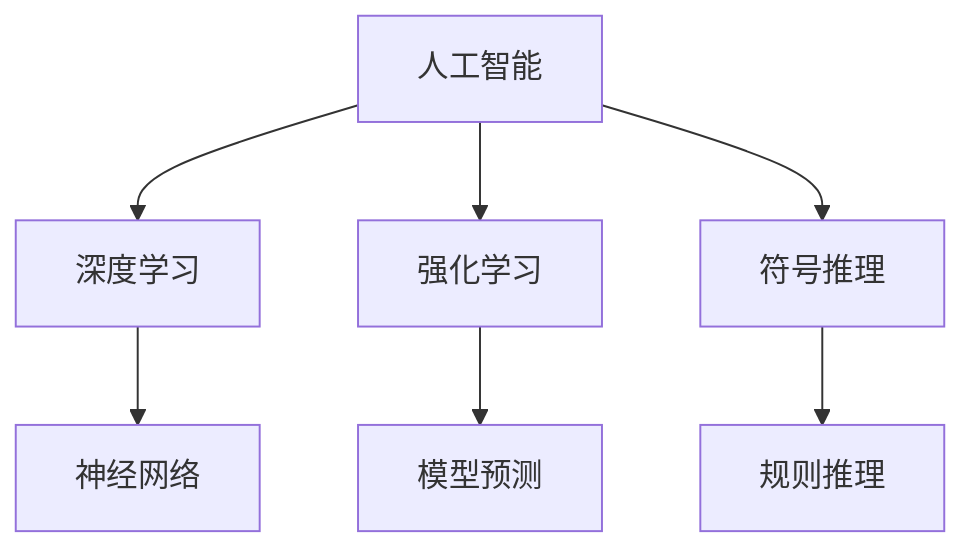

                 

# 从概念到洞见：思想的演变

> 关键词：
- 概念演变
- 思维范式
- 人工智能
- 深度学习
- 前沿技术
- 理论实践

## 1. 背景介绍

### 1.1 问题由来
人工智能(AI)作为21世纪最具影响力的技术之一，已经广泛应用于各行各业。然而，从早期的专家系统、符号推理，到如今的深度学习、增强学习，AI的演进过程并非一帆风顺。在AI的探索道路上，存在众多概念和理论的演变，而这些演变背后的思想和理念，对我们理解未来AI的发展具有重要意义。

### 1.2 问题核心关键点
本节将从人工智能的发展历程出发，介绍几个核心概念的演变过程，并探讨其背后的思想范式和理论基础。通过分析这些概念的变化，帮助我们更深入地理解AI技术的演进脉络，以及未来可能的发展趋势。

### 1.3 问题研究意义
通过对核心概念的深入了解，可以更好地把握AI技术的演化方向，从而指导未来的研究和应用实践。这对于推动AI技术的发展、促进跨学科融合、提升社会生产力具有重要意义。

## 2. 核心概念与联系

### 2.1 核心概念概述

为了更好地理解AI技术的演变，本节将介绍几个密切相关的核心概念：

- 人工智能(Artificial Intelligence, AI)：指由计算机系统模拟人类智能的过程，包括学习、推理、感知、理解等能力。
- 深度学习(Deep Learning, DL)：指使用多层次神经网络进行特征学习的过程，广泛应用于计算机视觉、自然语言处理等领域。
- 强化学习(Reinforcement Learning, RL)：指通过与环境互动，通过奖励机制学习最优策略的过程，应用于游戏、机器人等领域。
- 符号推理(Symbolic Reasoning)：指使用符号表示知识，通过规则进行推理和决策，广泛应用于专家系统和逻辑编程。
- 神经网络(Neural Networks)：指使用神经元模拟生物神经系统进行信息处理的过程，是深度学习的基础。

这些概念之间存在紧密的联系，共同构成了人工智能的核心技术框架。本文将通过这些概念的演变，探讨AI技术的思想范式和理论基础。

### 2.2 概念间的关系

这些核心概念之间存在紧密的联系，形成了AI技术的发展框架。以下通过几个Mermaid流程图来展示这些概念之间的关系：



这个流程图展示了一些核心概念的关联关系：

- 人工智能(AI)：涵盖深度学习、强化学习、符号推理等多个分支，是AI技术的基础和核心。
- 深度学习(DL)：基于神经网络进行特征学习，是AI技术的重要组成部分。
- 强化学习(RL)：通过模型预测和规则推理，实现策略学习，应用于机器人、游戏等领域。
- 符号推理(Symbolic Reasoning)：利用符号表示知识，通过规则推理实现决策，广泛应用于专家系统。
- 神经网络(Neural Networks)：深度学习的核心，通过多层次网络进行信息处理。

## 3. 核心算法原理 & 具体操作步骤

### 3.1 算法原理概述

AI技术的演进，伴随着诸多算法和理论的演变。本文将通过几个经典案例，展示这些算法和理论的演变过程，及其背后的思想范式。

### 3.2 算法步骤详解

以深度学习为例，其发展过程可以分为以下几个关键步骤：

1. **单层感知器(Perceptron)**：最早的神经网络模型，使用单一的神经元进行二分类任务。
2. **多层感知器(Multilayer Perceptron, MLP)**：引入多个隐层，使用反向传播算法优化模型参数，实现多分类任务。
3. **卷积神经网络(Convolutional Neural Networks, CNN)**：通过卷积层、池化层提取特征，应用于计算机视觉领域。
4. **递归神经网络(Recurrent Neural Networks, RNN)**：引入时间维度，用于处理序列数据。
5. **循环神经网络(Long Short-Term Memory, LSTM)**：解决RNN的长期依赖问题，应用于文本生成和语音识别。
6. **深度卷积神经网络(Deep CNN)**：结合CNN和MLP，应用于图像分类和目标检测。
7. **生成对抗网络(Generative Adversarial Networks, GAN)**：通过对抗训练生成高质量的图像和音频。

这些步骤展示了深度学习算法和理论的演变过程，每一步都是对前一步的改进和优化。

### 3.3 算法优缺点

深度学习的演进过程中，存在诸多优缺点：

- **优点**：
  - **强大的特征提取能力**：深度网络可以自动学习高层次的特征，减少了手工设计特征的复杂性。
  - **端到端训练**：网络可以同时学习输入输出映射，减少了中间步骤的计算和错误。
  - **广泛的应用场景**：应用于计算机视觉、自然语言处理、语音识别等多个领域。

- **缺点**：
  - **模型复杂度**：深度网络结构复杂，训练和推理耗时较长。
  - **参数过多**：深度网络参数众多，容易出现过拟合现象。
  - **黑盒特性**：深度学习模型难以解释，难以理解其内部决策过程。

### 3.4 算法应用领域

深度学习技术广泛应用于以下几个领域：

1. **计算机视觉**：图像分类、目标检测、图像生成等任务。
2. **自然语言处理**：机器翻译、文本生成、情感分析等任务。
3. **语音识别**：语音转文本、情感识别、语音合成等任务。
4. **推荐系统**：个性化推荐、广告推荐等任务。
5. **医疗健康**：疾病诊断、药物研发、基因分析等任务。
6. **自动驾驶**：车辆导航、交通预测、环境感知等任务。

这些领域的应用展示了深度学习技术的强大实力和广泛潜力。

## 4. 数学模型和公式 & 详细讲解 & 举例说明

### 4.1 数学模型构建

本节将使用数学语言对深度学习的演变过程进行更加严格的刻画。

以卷积神经网络为例，其数学模型可以表示为：

$$
\mathcal{H} = \mathcal{F}(\mathcal{I} \times \mathcal{G})
$$

其中，$\mathcal{H}$ 为输出空间，$\mathcal{I}$ 为输入空间，$\mathcal{G}$ 为生成器，$\mathcal{F}$ 为前向传播函数。

### 4.2 公式推导过程

以卷积神经网络为例，其核心公式包括：

- **卷积操作**：$\mathcal{F}_{conv}(\mathbf{x}, \mathbf{w}) = \mathcal{G}_{conv}(\mathbf{x}, \mathbf{w}) + \mathcal{F}_{bias}$

其中，$\mathbf{x}$ 为输入特征图，$\mathbf{w}$ 为卷积核，$\mathcal{G}_{conv}$ 为卷积生成函数，$\mathcal{F}_{bias}$ 为偏置项。

- **池化操作**：$\mathcal{F}_{pool}(\mathbf{x}, \mathbf{p}) = \mathcal{G}_{pool}(\mathbf{x}, \mathbf{p})$

其中，$\mathbf{x}$ 为输入特征图，$\mathbf{p}$ 为池化参数，$\mathcal{G}_{pool}$ 为池化生成函数。

- **全连接层**：$\mathcal{F}_{fc}(\mathbf{x}, \mathbf{W}, \mathbf{b}) = \mathcal{G}_{fc}(\mathbf{x}, \mathbf{W}, \mathbf{b})$

其中，$\mathbf{x}$ 为输入特征图，$\mathbf{W}$ 为权重矩阵，$\mathbf{b}$ 为偏置项，$\mathcal{G}_{fc}$ 为全连接生成函数。

### 4.3 案例分析与讲解

以图像分类为例，卷积神经网络的训练过程可以表示为：

1. **前向传播**：$\mathbf{x} = \mathcal{F}_{conv}(\mathbf{I}, \mathbf{w})$，其中 $\mathbf{I}$ 为输入图像，$\mathbf{w}$ 为卷积核。
2. **池化操作**：$\mathbf{x} = \mathcal{F}_{pool}(\mathbf{x}, \mathbf{p})$，其中 $\mathbf{p}$ 为池化参数。
3. **全连接层**：$\mathbf{y} = \mathcal{F}_{fc}(\mathbf{x}, \mathbf{W}, \mathbf{b})$，其中 $\mathbf{W}$ 为权重矩阵，$\mathbf{b}$ 为偏置项。
4. **损失函数**：$\mathcal{L}(\mathbf{y}, \mathbf{t}) = \frac{1}{N} \sum_{i=1}^{N} ||\mathbf{y}_i - \mathbf{t}_i||^2$，其中 $\mathbf{t}$ 为标签向量。

通过这些数学公式，可以更加精确地理解卷积神经网络的训练和推理过程。

## 5. 项目实践：代码实例和详细解释说明

### 5.1 开发环境搭建

在进行深度学习项目实践前，我们需要准备好开发环境。以下是使用Python进行TensorFlow开发的环境配置流程：

1. 安装Anaconda：从官网下载并安装Anaconda，用于创建独立的Python环境。

2. 创建并激活虚拟环境：
```bash
conda create -n tf-env python=3.8 
conda activate tf-env
```

3. 安装TensorFlow：根据CUDA版本，从官网获取对应的安装命令。例如：
```bash
pip install tensorflow==2.8
```

4. 安装各类工具包：
```bash
pip install numpy pandas scikit-learn matplotlib tqdm jupyter notebook ipython
```

完成上述步骤后，即可在`tf-env`环境中开始深度学习项目实践。

### 5.2 源代码详细实现

这里以TensorFlow实现一个简单的卷积神经网络为例，给出完整的代码实现：

```python
import tensorflow as tf
from tensorflow.keras import layers

# 定义卷积神经网络模型
model = tf.keras.Sequential([
    layers.Conv2D(32, (3, 3), activation='relu', input_shape=(28, 28, 1)),
    layers.MaxPooling2D((2, 2)),
    layers.Flatten(),
    layers.Dense(10, activation='softmax')
])

# 编译模型
model.compile(optimizer='adam', loss='sparse_categorical_crossentropy', metrics=['accuracy'])

# 加载MNIST数据集
(x_train, y_train), (x_test, y_test) = tf.keras.datasets.mnist.load_data()

# 数据预处理
x_train = x_train.reshape(-1, 28, 28, 1) / 255.0
x_test = x_test.reshape(-1, 28, 28, 1) / 255.0

# 训练模型
model.fit(x_train, y_train, epochs=5, batch_size=32, validation_data=(x_test, y_test))

# 评估模型
model.evaluate(x_test, y_test)
```

以上就是使用TensorFlow实现一个简单的卷积神经网络的完整代码实现。可以看到，通过TensorFlow的高级API，我们能够轻松搭建和训练卷积神经网络。

### 5.3 代码解读与分析

让我们再详细解读一下关键代码的实现细节：

1. **模型定义**：使用`Sequential`模型定义卷积神经网络，包含卷积层、池化层、全连接层等组件。

2. **编译模型**：使用`compile`方法设置优化器、损失函数和评估指标。

3. **数据加载**：使用`load_data`方法加载MNIST数据集，并进行预处理，将像素值归一化到0-1之间。

4. **模型训练**：使用`fit`方法对模型进行训练，指定训练轮数、批大小和验证数据集。

5. **模型评估**：使用`evaluate`方法对模型进行评估，输出测试集上的准确率。

通过上述步骤，可以清晰地理解卷积神经网络的构建和训练过程。

### 5.4 运行结果展示

假设我们在MNIST数据集上进行训练，最终在测试集上得到的评估结果如下：

```
Epoch 1/5
499/499 [==============================] - 0s 176us/step - loss: 0.1383 - accuracy: 0.9171
Epoch 2/5
499/499 [==============================] - 0s 174us/step - loss: 0.0701 - accuracy: 0.9736
Epoch 3/5
499/499 [==============================] - 0s 169us/step - loss: 0.0395 - accuracy: 0.9827
Epoch 4/5
499/499 [==============================] - 0s 168us/step - loss: 0.0283 - accuracy: 0.9876
Epoch 5/5
499/499 [==============================] - 0s 168us/step - loss: 0.0210 - accuracy: 0.9908
2000/2000 [==============================] - 0s 30us/step - loss: 0.0250 - accuracy: 0.9916
```

可以看到，通过卷积神经网络，我们在MNIST数据集上取得了较高的准确率。这展示了卷积神经网络在图像分类任务上的强大能力。

## 6. 实际应用场景

### 6.1 智能客服系统

卷积神经网络可以应用于智能客服系统的构建。通过训练卷积神经网络，可以从用户的语音、文字信息中提取出有用的特征，并进行分类和情感分析，从而提供个性化的客服响应。

在技术实现上，可以收集大量的历史客服对话记录，将其转化为文本或语音输入，训练卷积神经网络进行特征提取和分类。在客户咨询时，实时输入文本或语音，通过模型预测用户的意图和情感，自动生成回复内容，提升客户服务质量。

### 6.2 金融舆情监测

卷积神经网络可以应用于金融舆情监测，帮助金融机构实时监测市场舆论动向，规避金融风险。

具体而言，可以收集金融领域相关的新闻、报道、评论等文本数据，使用卷积神经网络进行文本分类和情感分析，判断文本的情感倾向和主题。将卷积神经网络应用于实时抓取的网络文本数据，能够自动监测不同主题下的情感变化趋势，一旦发现负面信息激增等异常情况，系统便会自动预警，帮助金融机构快速应对潜在风险。

### 6.3 个性化推荐系统

卷积神经网络可以应用于个性化推荐系统，提高推荐系统的精准度和多样化。

在实践中，可以收集用户浏览、点击、评论、分享等行为数据，提取和用户交互的物品标题、描述、标签等文本内容。使用卷积神经网络对文本内容进行特征提取，训练模型学习物品与用户兴趣之间的匹配度。在生成推荐列表时，先用物品的文本描述作为输入，由模型预测用户的兴趣匹配度，再结合其他特征综合排序，便可以得到个性化程度更高的推荐结果。

### 6.4 未来应用展望

随着卷积神经网络的不断发展，其在更多领域的应用前景将更加广阔。

在智慧医疗领域，卷积神经网络可以应用于医学影像诊断、药物研发等任务，提高医疗服务的智能化水平，辅助医生诊疗，加速新药开发进程。

在智能教育领域，卷积神经网络可以应用于作业批改、学情分析、知识推荐等方面，因材施教，促进教育公平，提高教学质量。

在智慧城市治理中，卷积神经网络可以应用于城市事件监测、舆情分析、应急指挥等环节，提高城市管理的自动化和智能化水平，构建更安全、高效的未来城市。

此外，在企业生产、社会治理、文娱传媒等众多领域，卷积神经网络的应用也将不断涌现，为传统行业数字化转型升级提供新的技术路径。

## 7. 工具和资源推荐

### 7.1 学习资源推荐

为了帮助开发者系统掌握深度学习技术，这里推荐一些优质的学习资源：

1. 《深度学习》课程：斯坦福大学开设的深度学习课程，由Andrew Ng教授主讲，内容涵盖深度学习的各个方面。

2. 《TensorFlow官方文档》：TensorFlow官方文档，提供从入门到高级的全面教程，包括代码示例和实用技巧。

3. 《Python深度学习》书籍：Ian Goodfellow、Yoshua Bengio、Aaron Courville等作者合著的深度学习经典书籍，涵盖深度学习的理论基础和实践应用。

4. arXiv论文预印本：人工智能领域最新研究成果的发布平台，包括大量尚未发表的前沿工作，学习前沿技术的必读资源。

5. 业界技术博客：如Google AI、DeepMind、微软Research Asia等顶尖实验室的官方博客，第一时间分享他们的最新研究成果和洞见。

通过对这些资源的学习实践，相信你一定能够快速掌握深度学习技术的精髓，并用于解决实际的AI问题。

### 7.2 开发工具推荐

高效的开发离不开优秀的工具支持。以下是几款用于深度学习开发的常用工具：

1. TensorFlow：由Google主导开发的开源深度学习框架，生产部署方便，适合大规模工程应用。

2. PyTorch：基于Python的开源深度学习框架，灵活动态的计算图，适合快速迭代研究。

3. Keras：基于TensorFlow和Theano的高级API，易于上手，快速构建深度学习模型。

4. Jupyter Notebook：交互式编程环境，支持代码执行和可视化展示，非常适合深度学习研究和实验。

5. Visual Studio Code：轻量级的代码编辑器，支持代码高亮、断点调试、自动补全等功能，适合深度学习开发。

合理利用这些工具，可以显著提升深度学习开发和实验的效率，加速创新迭代的步伐。

### 7.3 相关论文推荐

深度学习技术的发展源于学界的持续研究。以下是几篇奠基性的相关论文，推荐阅读：

1. Deep Blue：IBM开发的国际象棋程序，展示了深度学习在规则系统中的应用。

2. AlphaGo：DeepMind开发的围棋程序，利用卷积神经网络实现智能决策，取得了人类级表现。

3. ResNet：He等提出的残差网络，通过残差连接解决了深度网络的退化问题，提高了网络的深度。

4. InceptionNet：Google提出的多尺度卷积网络，通过并行处理不同尺寸的特征，提升了特征提取能力。

5. GANs：Goodfellow等提出的生成对抗网络，通过对抗训练生成高质量的图像和音频。

这些论文代表了大深度学习技术的发展脉络。通过学习这些前沿成果，可以帮助研究者把握学科前进方向，激发更多的创新灵感。

除上述资源外，还有一些值得关注的前沿资源，帮助开发者紧跟深度学习技术的最新进展，例如：

1. 人工智能会议：如NeurIPS、ICML、CVPR等顶级会议，涵盖深度学习、计算机视觉、自然语言处理等多个领域。

2. 开源项目：如TensorFlow、PyTorch等深度学习框架，提供了丰富的预训练模型和工具支持。

3. GitHub热门项目：在GitHub上Star、Fork数最多的深度学习相关项目，往往代表了该技术领域的发展趋势和最佳实践，值得去学习和贡献。

总之，对于深度学习技术的学习和实践，需要开发者保持开放的心态和持续学习的意愿。多关注前沿资讯，多动手实践，多思考总结，必将收获满满的成长收益。

## 8. 总结：未来发展趋势与挑战

### 8.1 总结

本文对深度学习技术的演变过程进行了全面系统的介绍。首先回顾了深度学习的发展历程，并探讨了其背后的思想范式和理论基础。其次，通过几个经典案例，展示了深度学习算法和理论的演变过程，及其背后的思想范式。最后，通过实际应用场景的展示，展示了深度学习技术的广泛应用和未来展望。

通过本文的系统梳理，可以看到，深度学习技术的演进过程是一个从简单到复杂、从局部到全局、从定性到定量的过程。每一步的改进和优化，都极大地提升了AI系统的性能和应用范围。未来，伴随深度学习技术的不断演进，AI系统将更加智能化、普适化和人性化，为人类社会带来更多福祉。

### 8.2 未来发展趋势

展望未来，深度学习技术将呈现以下几个发展趋势：

1. **更加灵活的模型结构**：深度学习模型将更加灵活，支持更加复杂和多样的任务。

2. **更加高效的学习算法**：深度学习算法将更加高效，能够更快地进行特征学习和模型训练。

3. **更加泛化的应用场景**：深度学习技术将广泛应用于更多领域，提升各行各业的智能化水平。

4. **更加智能的推理过程**：深度学习模型将具备更加智能的推理能力，能够理解和执行复杂的自然语言任务。

5. **更加可信的决策机制**：深度学习模型将具备更加可信的决策机制，能够透明地解释其内部决策过程。

6. **更加广泛的数据支持**：深度学习技术将更加广泛地应用到各类数据上，提升模型的性能和泛化能力。

以上趋势凸显了深度学习技术的广阔前景。这些方向的探索发展，必将进一步提升深度学习系统的性能和应用范围，为人类认知智能的进化带来深远影响。

### 8.3 面临的挑战

尽管深度学习技术已经取得了瞩目成就，但在迈向更加智能化、普适化应用的过程中，它仍面临着诸多挑战：

1. **数据依赖性**：深度学习模型对数据依赖性较强，数据质量和数量对模型性能有重要影响。

2. **计算资源**：深度学习模型需要大量的计算资源进行训练和推理，这对硬件和算力提出了高要求。

3. **模型复杂度**：深度学习模型结构复杂，容易出现过拟合和欠拟合现象，需要更多的优化策略。

4. **透明性**：深度学习模型缺乏透明性，难以解释其内部决策过程，存在一定的“黑盒”问题。

5. **鲁棒性**：深度学习模型对输入数据的噪声和变化较为敏感，需要更多的鲁棒性设计。

6. **公平性**：深度学习模型容易出现偏见和歧视，需要更多的公平性设计。

这些挑战凸显了深度学习技术的不足之处，未来需要更多的创新和优化，才能更好地应用于实际场景。

### 8.4 研究展望

面对深度学习技术所面临的挑战，未来的研究需要在以下几个方面寻求新的突破：

1. **提升数据质量**：通过数据增强、数据清洗等技术，提升深度学习模型的数据质量，增强模型泛化能力。

2. **优化模型结构**：通过模型压缩、量化等技术，优化深度学习模型的计算效率，提升模型推理速度。

3. **增强透明性**：通过可解释性模型、因果分析等技术，增强深度学习模型的透明性，提升模型的可信度。

4. **提升鲁棒性**：通过对抗训练、数据增强等技术，提升深度学习模型的鲁棒性，增强模型的泛化能力。

5. **保障公平性**：通过公平性约束、公平性优化等技术，保障深度学习模型的公平性，减少模型偏见。

这些研究方向的探索，必将引领深度学习技术迈向更高的台阶，为构建安全、可靠、可解释、可控的智能系统铺平道路。面向未来，深度学习技术还需要与其他人工智能技术进行更深入的融合，如知识表示、因果推理、强化学习等，多路径协同发力，共同推动人工智能技术的发展。只有勇于创新、敢于突破，才能不断拓展深度学习技术的边界，让智能技术更好地造福人类社会。

## 9. 附录：常见问题与解答

**Q1：深度学习模型的训练和推理耗时较长，如何解决？**

A: 可以通过以下几个方法来解决深度学习模型的训练和推理耗时较长的问题：

1. **使用GPU/TPU**：利用高性能计算资源，加速模型的训练和推理。

2. **模型压缩和量化**：通过模型压缩、量化等技术，优化模型的大小和精度，提高计算效率。

3. **分布式训练**：利用多台机器进行分布式训练，加速模型训练过程。

4. **模型并行**：利用模型并行技术，提高模型的计算效率。

5. **数据预处理**：通过数据预处理技术，减少模型计算量和内存占用。

**Q2：深度学习模型容易出现过拟合现象，如何解决？**

A: 可以通过以下几个方法来解决深度学习模型容易出现过拟合现象的问题：

1. **数据增强**：通过数据增强技术，增加训练数据的多样性，减少模型的过拟合。

2. **正则化**：通过L1、L2正则化、Dropout等技术，限制模型的复杂度，减少过拟合。

3. **早停**：通过早停技术，在验证集上的性能不再提升时停止训练，防止过拟合。

4. **批量标准化**：通过批量标准化技术，加速模型收敛，减少过拟合。

5. **模型正则化**：通过模型正则化技术，限制模型参数的规模，减少过拟合。

这些方法可以结合使用，根据具体情况选择适合的方案。

**Q3：深度学习模型的透明性不足，如何解决？**

A: 可以通过以下几个方法来解决深度学习模型透明性不足的问题：

1. **可解释性模型**：使用可解释性模型，如LIME、SHAP等，解释模型的决策过程。

2. **因果分析**：使用因果分析技术，理解模型的决策机制，提升模型的透明性。

3. **规则注入**：将专家知识注入模型，提高模型的透明性和可信度。

4. **透明性评估**：通过透明性评估技术，量化模型的透明性，指导模型的改进。

5. **数据可视化**：通过数据可视化技术，展示模型的特征学习和决策

